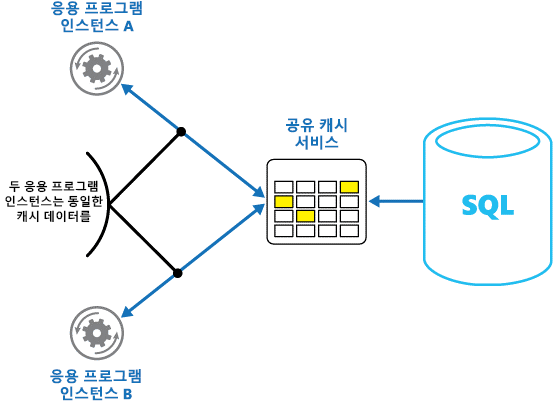

# Caching
[!INCLUDE [header](../_includes/header.md)]

캐싱은 시스템의 성능과 확장성 향상을 목표로 하는 일반적인 기술입니다. 성능과 확장성을 향상하기 위해 자주 액세스하는 데이터를 응용 프로그램 가까이에 있는 빠른 저장소에 임시로 복사하는데, 이때 빠른 데이터 저장소가 원래 소스보다 응용 프로그램에 더 가까운 위치에 있으면 캐싱은 데이터를 보다 신속하게 배치하여 클라이언트 응용 프로그램의 응답 시간을 크게 향상시킬 수 있습니다. 

캐싱은 클라이언트 인스턴스가 동일한 데이터를 반복적으로 읽을 때 가장 효과적입니다. 특히 원래 데이터 저장소에 다음 조건이 모두 적용되는 경우에 더욱 효과적입니다. 

•	상대적으로 정적인 상태를 유지.
•	캐시 속도에 비해 느림.
•	많은 경합을 일으킴.
•	네트워크 대기 시간 때문에 액세스 속도가 느려질 수 있는 경우 훨씬 멀어짐.


## 분산 응용 프로그램에서의 캐싱.
일반적으로 분산 응용 프로그램은 데이터를 캐싱할 때 다음 전략 중 하나 또는 둘 다를 구현합니다. 

•	응용 프로그램이나 서비스의 인스턴스를 실행하는 컴퓨터에 데이터가 로컬로 배치되는 개인 캐시 사용.
•	여러 프로세스 및/또는 시스템에서 액세스할 수 있는 공통 소스의 역할을 하는 공유 캐시 사용.


이 두 경우 모두에서, 캐싱은 클라이언트 쪽 및/또는 서버 쪽에서 수행될 수 있습니다. 클라이언트 쪽 캐싱은 웹 브라우저 또는 데스크탑 응용 프로그램 등 시스템에 대한 사용자 인터페이스를 제공하는 프로세스에 의해 수행됩니다. 서버 쪽 캐싱은 원격으로 실행되는 비즈니스 서비스를 제공하는 프로세스에 의해 수행됩니다. 

### 개인 캐싱(Private caching)
가장 기본적인 캐시 유형은 인메모리 저장소입니다. 인메모리 저장소는 단일 프로세스의 주소 공간에 배치되며 해당 프로세스에서 실행되는 코드에 의해 직접 액세스됩니다. 이 캐시 유형은 액세스 속도가 매우 빠릅니다. 인메로리 저장소는 적은 양의 정적 데이터를 저장할 때 매우 효과적인 수단이 될 수도 있습니다. 캐시 크기는 일반적으로 프로세스를 호스팅하는 시스템에서 사용할 수 있는 메모리의 용량에 따라 제한받기 때문입니다. 

메모리에 물리적으로 담을 수 있는 양보다 많은 정보를 캐시해야 하는 경우에는 캐시된 데이터를 로컬 파일 시스템에 쓸 수 있습니다. 그러면 메모리에 있는 데이터보다는 액세스 속도가 느리지만 네트워크에서 데이터를 검색하는 것보다는 더 빠르고  안정적입니다. 

이 모델을 동시에 실행하는 응용 프로그램의 인스턴스가 여러 개 있으면, 각 응용 프로그램 인스턴스는 고유의 데이터 사본을 가진 고유의 독립 캐시를 갖게 됩니다.

캐시를 과거의 원래 데이터 스냅샷이라고 생각하십시오. 이 데이터가 정적인 데이터가 아니라면, 다른 응용 프로그램 인스턴스가 해당 캐시에 다른 버전의 데이터를 갖게 될 가능성이 큽니다. 따라서 그림 1에 나타난 바와 같이, 이러한 인스턴스에서 수행된 동일한 쿼리가 다른 결과를 반환할 수 있습니다. 


*그림 1: 응용 프로그램의 다른 인스턴스에서 인메모리 캐시 사용*

### 공유 캐싱
공유 캐시를 사용하면 인메모리 캐싱의 각 캐시 데이터가 서로 다를 수 있다는 우려를 덜 수 있습니다. 공유 캐싱은 서로 다른 응용 프로그램 인스턴스가 캐시된 데이터에 대한 동일한 뷰를 볼 수 있게 해줍니다. 그림 2에 나타난 바와 같이, 이는 별도의 위치(일반적으로 별도 서비스의 일부로 호스팅된 위치)에 캐시를 배치하는 방식으로 실행됩니다. 



*그림 2: 공유 캐시 사용*

공유 캐싱 방법이 가지는 중요한 이점은 확장성입니다. 많은 공유 캐시 서비스는 서버 클러스터를 사용하여 구현되고 투명한 방식으로 클러스터에 데이터를 분배하는 소프트웨어를 사용합니다. 응용 프로그램 인스턴스는 단순히 캐시 서비스에 요청을 보냅니다. 기본 인프라는 캐시된 데이터의 클러스터 내 위치를 결정합니다. 사용자는 더 많은 서버를 추가하여 캐시를 쉽게 확장할 수 있습니다. 

공유 캐싱 방법의 단점은 다음과 같이 크게 두 가지가 있습니다. 

•	캐시가 더 이상 각 응용 프로그램 인스턴스에 로컬로 배치되지 않기 때문에 액세스 속도가 느립니다.
•	별도의 캐시 서비스 구현이라는 요구사항 때문에 솔루션이 더 복잡해질 수 있습니다.


## 캐싱 사용 시 고려사항
다음 섹션에서는 캐시 설계 및 사용 시 고려할 사항에 대해 자세히 설명합니다. 

### 데이터를 캐시할 시점 결정
캐싱은 성능, 확장성 및 가용성을 크게 향상시킬 수 있습니다. 가지고 있는 데이터가 많고 이 데이터에 액세스해야 하는 사용자 수가 많을수록 캐싱의 이점이 더 커집니다. 캐싱이 원래 데이터 저장소에서 대량의 동시 요청을 처리하는 문제와 관련하여 대기 시간과 경합을 줄여 주기 때문입니다. 

예를 들어, 데이터베이스는 제한된 수의 동시 연결을 지원할 수 있습니다. 기본 데이터베이스가 아니라 공유 캐시에서 데이터를 검색하면, 현재 사용 가능한 연결 수가 없는 경우에도 클라이언트 응용 프로그램이 이 데이터에 액세스할 수 있습니다. 또한, 데이터베이스를 사용할 수 없게 되면 클라이언트 응용 프로그램이 캐시에 있는 데이터를 사용하여 작업을 계속할 수 있습니다. 

읽기는 자주 하지만 수정이 드물게 이루어지는 데이터를 캐싱하는 것이 좋습니다(예: 쓰기 작업보다 읽기 작업의 비율이 높은 데이터) . 그러나 캐시를 중요한 정보의 신뢰할 수 있는 저장소로 사용하는 것은 권장되지 않습니다. 대신, 손실되어서는 안 되는 응용 프로그램의 모든 변경사항은 항상 영구 데이터 저장소에 저장하십시오. 그러면 캐시를 사용할 수 없는 경우에도 데이터 저장소를 사용하여 응용 프로그램이 작업을 계속할 수 있으므로 중요한 정보가 손실되지 않습니다. 

### 데이터를 효과적으로 캐시하는 방법 결정
효과적인 캐시 사용의 핵심은 캐시에 가장 적합한 데이터를 쓰도록 결정하고 적절한 시점에 캐싱하는 것입니다. 데이터는 응용 프로그램에 의해 처음 검색될 때 요청 시 캐시에 추가할 수 있습니다. 즉, 응용 프로그램은 데이터 저장소에서 데이터를 한 번만 가져오면 되고 이후의 액세스는 캐시를 사용하면 됩니다. 

또는, 일반적으로 응용 프로그램이 시작될 때 캐시에 데이터가 부분적으로나 전체적으로 채워질 수 있습니다(이 방법을 시딩이라고 함). 그러나 이 방법을 사용하면 응용 프로그램이 실행되기 시작할 때 원래 데이터 저장소에 갑자기 높은 부하가 걸릴 수 있기 때문에 대량 캐시에 대한 시딩은 바람직하지 않을 수 있습니다. 

사용 패턴을 분석하면 캐시를 전체적으로 또는 부분적으로 미리 채울지 여부를 결정하고 캐시할 데이터를 선택하는 데 도움이 될 때가 많습니다. 예를 들어, 정기적으로(아마도 매일) 응용 프로그램을 사용하는 고객에 대해서는 캐시를 정적 사용자 프로필 데이터로 시드하는 것이 유용할 수 있지만, 응용 프로그램을 일주일에 한 번만 사용하는 고객에게는 이 방법이 유용하지 않을 수 있습니다. 

일반적으로 캐싱은 변경할 수 없거나 드물게 변경되는 데이터와 잘 작동합니다. 이러한 예로는 전자상거래 응용 프로그램의 제품 및 가격 정보 같은 참조 정보, 그리고 구성하는 데 비용이 많이 드는 공유 정적 리소스 같은 것을 들 수 있습니다. 이 데이터의 일부 또는 전부는 응용 프로그램을 시작할 때 캐시에 로드되어 리소스에 대한 수요를 최소화하고 성능을 향상시킬 수 있습니다. 또한 캐시의 참조 데이터를 정기적으로 업데이트하여 최신 상태를 유지하는지 확인하고 참조 데이터가 변경될 때 캐시를 새로 고치게 하는 백그라운드 프로세스를 갖추는 게 좋을 것입니다.  

캐싱은 동적 데이터에는 유용하지 않지만, 이때 몇 가지 예외가 있습니다(자세한 내용은 본 문서의 뒷부분에 나오는 '매우 동적인 데이터 캐싱' 섹션 참조). 원래 데이터가 정기적으로 변경되면 캐시된 정보가 매우 빨리 부실해지거나 캐시를 원래 데이터 저장소와 동기화하는 오버헤드가 캐싱의 효율성을 감소시킵니다. 

캐시가 엔터티(entitiy)에 대한 완전한 데이터를 포함할 필요는 없습니다. 예를 들어, 데이터 항목이 이름, 주소, 계정 잔액을 가진 은행 고객 등의 다중 값 개체를 나타내는 경우, 이러한 요소 중 일부는 정적(예: 이름 및 주소)으로 유지되는 반면 다른 요소(예: 계정 잔액)는 더 동적이 될 수 있습니다. 이러한 상황에서는 데이터의 정적인 부분을 캐시하고 필요시 나머지 정보만 검색(또는 계산)하는 방법이 유용할 수 있습니다. 

성능 테스트와 사용 분석을 수행하여 캐시를 사전에 채우거나 주문 시 로딩하거나 또는 두 가지를 결합하는 방식 중 적합한 것을 결정하는 게 좋습니다. 이 결정은 데이터의 변동성 및 사용 패턴을 기반으로 해야 합니다. 캐시 사용과 성능 분석은 과부하가 발생하고 확장성이 높은 응용 프로그램에서 특히 중요합니다. 예를 들어, 확장성이 뛰어난 시나리오에서는 사용량이 많은 시간에 데이터 저장소의 부하를 줄이기 위해 캐시를 시드하는 것이 좋습니다. 

응용 프로그램이 실행되는 동안 반복 계산을 방지하기 위해 캐싱을 사용할 수도 있습니다. 어떤 작업이 데이터를 변환하거나 복잡한 계산을 수행하는 경우 해당 작업의 결과를 캐시에 저장할 수 있습니다. 이후에 동일한 계산이 필요하면 응용 프로그램은 단순히 캐시에서 결과만 검색하면 됩니다. 

응용 프로그램은 캐시에 있는 데이터를 수정할 수 있습니다. 그러나, 캐시는 언제든지 사라질 수 있는 임시 데이터 저장소로 생각하는 것이 좋습니다. 중요한 데이터를 캐시에만 저장해서는 안 됩니다. 원래 데이터 저장소에도 해당 정보를 보관해야 합니다. 그래야 캐시를 사용할 수 없게 될 경우 데이터 손실 가능성을 최소화할 수 있습니다. 

### 매우 동적인 데이터 캐싱
빠르게 변경되는 정보를 영구 데이터 저장소에 저장하면 시스템에 오버헤드가 발생할 수 있습니다. 예를 들어, 상태 또는 기타 측정치를 계속 보고하는 장치를 생각해 보십시오. 캐시된 정보는 거의 항상 오래된 데이터가 되어 버리기 때문에 응용 프로그램에서 이 데이터를 캐시하지 않도록 선택하면, 데이터 저장소에 이 정보를 저장하고 데이터 저장소에서 검색할 때 동일한 문제가 발생할 수 있습니다. 이 데이터를 저장하고 가져오는 데 소요되는 시간은 바뀔 수 있습니다. 

이와 같은 상황에서는, 동적 정보를 영구 데이터 저장소가 아니라 캐시에 직접 저장하여 얻을 수 있는 이점을 고려해 보십시오. 데이터가 중요하지 않고 감사가 필요하지 않은 경우에는 변경사항이 가끔 손실되더라도 상관없습니다. 

### 캐시의 데이터 만료 관리
대부분의 경우, 캐시에 있는 데이터는 원래 데이터 저장소에 있는 데이터의 사본입니다. 원래 데이터 저장소의 데이터는 캐시된 후에 변경되어 캐시된 데이터가 부실해질 수 있습니다. 많은 캐싱 시스템이 사용자가 데이터를 만료하도록 캐시를 구성하고 데이터가 만료되는 기간을 줄일 수 있도록 지원합니다. 

캐시된 데이터가 만료되면 이 데이터는 캐시에서 제거되고, 응용 프로그램은 원래 데이터 저장소에서 데이터를 검색해야 합니다(새로 가져온 정보를 다시 캐시에 넣을 수 있음). 사용자는 캐시를 구성할 때 기본 만료 정책을 설정할 수 있습니다. 많은 캐시 서비스에서, 개체를 프로그래밍 방식으로 캐시에 저장할 때 개별 개체의 만료 기간을 지정할 수도 있습니다. 일부 캐시에서는 사용자가 만료 기간을 절대값으로 지정하거나, 지정된 시간 내에 액세스하지 않으면 캐시에서 항목이 제거되는 슬라이딩 값으로 지정할 수 있습니다. 이 설정은 캐시 전체의 모든 만료 정책을 재정의하되, 지정된 개체에 대해서만 재정의합니다. 

> [!참고]
> 캐시 및 캐시에 포함된 개체의 만료 기간을 신중히 고려하십시오. 너무 짧게 설정하면 개체가 너무 빨리 만료되어 캐시를 사용하는 이점이 줄어듭니다. 기간을 너무 길게 설정하면 데이터가 부실해질 위험이 있습니다. 
> 
> 

데이터를 오래 머무르게 하면 캐시가 가득 찰 수도 있습니다. 이 경우, 캐시에 새 항목을 추가하라는 요청이 오면 일부 항목이 제거(eviction)라고 하는 프로세스에서 강제로 제거될 수 있습니다. 캐시 서비스는 보통 LRU(오래 전에 사용한 항목) 기준으로 데이터를 제거하지만, 사용자는 일반적으로 이 정책을 재정의해서 항목이 제거되는 것을 방지할 수 있습니다. 그러나 이 방법을 채택하면 캐시에서 사용할 수 있는 메모리를 초과할 위험이 있습니다. 응용 프로그램이 항목을 캐시에 추가하려고 시도하면 일부 예외를 제외하고는 대부분 실패합니다. 

일부 캐싱 구현에서는 추가 제거 정책이 제공될 수 있습니다. 제거 정책에는 여러 가지 유형이 있습니다. 예를 들면 다음과 같습니다. 

•	가장 최근에 사용된 정책(데이터가 다시 필요하지 않을 것으로 예상되는 경우).

•	선입 선출 정책(가장 오래된 데이터가 먼저 제거됨).

•	트리거된 이벤트를 기반으로 하는 명시적 제거 정책(예: 수정 중인 데이터).


### 클라이언트 쪽 캐시의 데이터 무효화
클라이언트 쪽 캐시에 있는 데이터는 일반적으로 데이터를 클라이언트에 제공하는 서비스의 범위를 벗어나 외부에 있는 것으로 간주됩니다. 서비스는 직접 강제적으로 클라이언트가 클라이언트 쪽 캐시에서 정보를 추가하거나 제거하는 작업을 수행하게 할 수는 없습니다. 

즉, 잘못 구성된 캐시를 사용하는 클라이언트가 오래된 정보를 계속 사용하게 될 수 있습니다. 예를 들어, 캐시의 만료 정책이 제대로 구현되지 않은 경우, 원래 데이터 원본의 정보가 변경될 때 클라이언트가 로컬로 캐시된 오래된 정보를 사용하게 될 수 있습니다. 

사용자가 HTTP 연결을 통해 데이터를 제공하는 웹 응용 프로그램을 구축하는 경우, 웹 클라이언트(예: 브라우저 또는 웹 프록시)가 암묵적으로 가장 최신 정보를 강제로 가져오게 할 수 있습니다. 리소스의 URI가 변경되어 해당 리소스가 업데이트되는 경우에 이 작업을 수행할 수 있습니다. 웹 클라이언트는 일반적으로 리소스의 URI를 클라이언트 쪽 캐시의 키로 사용하므로, URI가 변경되면 웹 클라이언트는 이전에 캐시된 버전의 모든 리소스를 무시하고 새 버전을 가져옵니다. 

## 캐시의 동시성 관리
캐시는 흔히 응용 프로그램의 여러 인스턴스를 공유하도록 설계되어 있습니다. 각 응용 프로그램 인스턴스는 캐시의 데이터를 읽고 수정할 수 있습니다. 따라서 모든 공유 데이터 저장소에서 발생하는 것과 동일한 동시성 문제가 캐시에서도 발생합니다. 응용 프로그램이 캐시에 있는 데이터를 수정해야 하는 상황에서, 사용자는 응용 프로그램의 한 인스턴스에 의해 수행된 업데이트가 다른 인스턴스에 의해 이루어진 변경사항을 겹쳐 쓰지 않게 해야 합니다. 
데이터의 유형과 충돌 가능성에 따라, 사용자는 동시성에 대한 다음 두 가지 방법 중에서 하나를 채택할 수 있습니다. 

* **낙관적 동시성.** 데이터를 업데이트하기 직전에 응용 프로그램이 캐시의 데이터가 검색 후 변경되었는지 여부를 확인합니다. 데이터가 여전히 동일하면 변경할 수 있습니다. 그렇지 않으면, 응용 프로그램이 업데이트 여부를 결정해야 합니다. (이러한 결정을 내리는 비즈니스 로직은 응용 프로그램에 따라 다름) 이 방법은 업데이트가 드물게 발생하거나 충돌이 발생할 가능성이 적은 상황에서 적합합니다.
* **비관적 동시성.** 데이터를 검색하면 응용 프로그램이 캐시의 데이터를 잠가서 다른 인스턴스가 변경하지 못하게 합니다. 이 프로세스는 충돌이 발생하지 않게 해주지만 동일한 데이터를 처리해야 하는 다른 인스턴스까지 차단할 수 있습니다. 비관적 동시성은 솔루션의 확장성에 영향을 줄 수 있으며 단기 작업에만 권장됩니다. 이 방법은 충돌 발생 가능성이 높은 상황에서 적합할 수 있습니다. 특히 응용 프로그램이 캐시의 여러 항목을 업데이트하고 이러한 변경사항이 일관되게 적용되어야 하는 경우에 적합합니다.

### 고가용성 및 확장성의 구현, 그리고 성능 향상
캐시를 데이터의 기본 리포지토리로 사용하지 마십시오. 기본 리포지토리는 캐시가 채워지는 원래 데이터 저장소의 역할을 합니다. 원래 데이터 저장소는 데이터의 지속성을 보장해 줍니다. 

공유 캐시 서비스의 가용성에 대한 중요한 종속성을 솔루션에 부여하지 않도록 주의하십시오. 공유 캐시를 제공하는 서비스를 사용할 수 없는 경우에도 응용 프로그램은 계속 작동할 수 있어야 합니다. 캐시 서비스의 재개를 기다리는 동안 응용 프로그램이 종료되거나 장애가 발생해서는 안 됩니다. 

따라서 응용 프로그램은 캐시 서비스의 가용성을 감지하고 캐시에 액세스할 수 없을 때 원래 데이터 저장소를 대신 사용할  준비가 되어 있어야 합니다. [회로 차단기 패턴](http://msdn.microsoft.com/library/dn589784.aspx)은 이 시나리오를 처리하는 데 유용합니다. 캐시를 제공하는 서비스는 복구될 수 있으며, 일단 사용할 수 있게 되면 캐시는[캐시 배제 패턴](http://msdn.microsoft.com/library/dn589799.aspx) 등의 전략에 따라 원래 데이터 저장소에서 데이터를 읽을 때 다시 채워질 수 있습니다.

그러나 캐시를 일시적으로 사용할 수 없을 때 응용 프로그램이 원래 데이터 저장소를 대신 사용하게 되면 시스템 확장성에 영향을 미칠 수 있습니다. 데이터 저장소가 복구되는 동안 원래 데이터 저장소에는 데이터 요청이 너무 많이 밀려들어 시간 초과와 연결 실패가 발생할 수 있습니다. 

모든 응용 프로그램 인스턴스가 액세스하는 공유 캐시와 함께 응용 프로그램의 각 인스턴스에 로컬의 개인 캐시를 구현하는 작업을 고려해 보십시오. 응용 프로그램이 항목을 검색하면 먼저 해당 로컬 캐시에서 확인한 후 공유 캐시에서 확인하고 마지막으로 원래 데이터 저장소에서 확인할 수 있습니다. 로컬 캐시는 공유 캐시를 사용할 수 없는 경우 공유 캐시나  데이터베이스에 있는 데이터를 사용하여 채울 수 있습니다. 

이 방법을 사용할 때는 로컬 캐시가 공유 캐시에 비해 너무 부실해지지 않도록 신중하게 구성해야 합니다. 그러나 공유 캐시를 사용할 수 없는 경우 공유 캐시는 버퍼 역할을 합니다. 그림 3은 이 구조를 보여줍니다. 


*그림 3: 공유 캐시가 있는 로컬의 개인 캐시 사용*

비교적 장기적인 데이터를 갖고 있는 대형 캐시를 지원하기 위해 일부 캐시 서비스는 캐시를 사용할 수 없을 경우 자동 장애 조치를 실행하는 고가용성 옵션을 제공합니다. 이 방법은 일반적으로 기본 캐시 서버에 저장된 캐시된 데이터를 보조 캐시 서버로 복제하고 기본 서버에 장애가 발생하거나 연결이 끊어질 때 보조 서버로 전환하는 작업도 포함합니다.

여러 대상에 대한 쓰기와 관련된 대기 시간을 줄이기 위해, 데이터가 기본 서버의 캐시에 기록될 때 보조 서버로 복제되는 작업이 비동기적으로 발생할 수 있습니다. 이 방법을 사용하면 장애가 발생할 때 일부 캐시된 정보가 손실될 수 있지만 이 데이터의 비율은 전체 캐시 크기에 비해 작습니다. 

공유 캐시가 클 경우 경합 가능성을 줄이고 확장성을 향상시키려면 캐시된 데이터를 노드 전반에 분할하는 방법이 유용할 수 있습니다. 많은 공유 캐시는 노드를 동적으로 추가(및 제거)하고 파티션 간에 데이터의 균형을 다시 맞추는 기능을 지원합니다. 이 방법은 노드 집합이 클라이언트 응용 프로그램에 원활한 단일 캐시로 제공되는 클러스터링 작업을 포함할 수 있습니다. 그러나, 내부적으로는 부하의 균형을 고르게 맞추는 사전 정의된 배포 전략에 따라 데이터가 노드 사이에 골고루 분산되어 있습니다. Microsoft 웹 사이트의 [데이터 분할 지침 문서](http://msdn.microsoft.com/library/dn589795.aspx)는 사용 가능한 분할 전략에 대한 자세한 정보를 제공합니다.

클러스터링도 캐시의 가용성을 증가시킬 수 있습니다. 노드에 장애가 발생해도 나머지 캐시에는 계속 액세스할 수 있습니다. 클러스터링은 복제 및 장애 조치와 함께 자주 사용됩니다. 각 노드는 복제할 수 있으며 노드에 장애가 발생하면 복제본을 온라인으로 신속하게 가져올 수 있습니다. 

많은 읽기 및 쓰기 작업에는 단일 데이터 값이나 개체가 관련될 가능성이 큽니다. 그러나 가끔은 대량 데이터를 빠르게 저장하거나 검색해야 할 수도 있습니다. 예를 들어, 캐시를 시드하는 작업은 수백내지는 수천 개의 항목을 캐시에 기록하는 작업과 관련됩니다. 응용 프로그램은 동일한 요청의 일환으로 캐시에서 관련 항목을 대량으로 검색해야 할 수도 있습니다. 

대규모의 많은 캐시는 이러한 목적을 위해 일괄 처리 작업을 제공합니다. 그러면 클라이언트 응용 프로그램이 대량 항목을 단일 요청으로 패키지화 할 수 있으며 많은 수의 작은 요청을 수행할 때의 오버헤드를 줄일 수 있습니다. 

## 캐싱 및 최종 일관성
캐시 배제 패턴이 작동하려면 캐시를 채우는 응용 프로그램의 인스턴스가 가장 최근의 일관된 데이터 버전에 액세스해야 합니다. 하지만 최종 일관성을 구현하는 시스템(예: 복제된 데이터 저장소)에서는 그럴 필요가 없을 것 입니다. 

응용 프로그램의 한 인스턴스가 데이터 항목을 수정할 수 있고 해당 항목의 캐시된 버전을 무효화할 수 있습니다. 응용 프로그램의 또 다른 인스턴스가 캐시에서 이 항목을 읽으려고 시도할 수 있는데, 캐시 누락이 발생하면 데이터 저장소에서 데이터를 읽고 이것을 캐시에 추가합니다. 그러나, 데이터 저장소가 다른 복제본과 완전히 동기화되지 않은 경우에는 응용 프로그램 인스턴스가 이전 값의 캐시를 읽어 채울 수 있습니다. 

데이터 일관성 처리에 대한 자세한 내용은 Microsoft 웹 사이트의 [데이터 일관성 기본 지침서](http://msdn.microsoft.com/library/dn589800.aspx) 페이지를 참조하십시오. 

### 캐시된 데이터 보호
사용 중인 캐시 서비스와 관계없이 캐시에 있는 데이터를 무단 액세스로부터 보호하는 방법을 고려해 보십시오. 여기에는 중요한 점이 아래와 같이 크게 두 가지 있습니다. 

•	캐시에 있는 데이터의 프라이버시
•	캐시를 사용하는 응용 프로그램과 캐시 사이에 흐르는 데이터의 프라이버시

캐시에 있는 데이터를 보호하기 위해 캐시 서비스는 인증 메커니즘을 구현할 수 있는데, 이때 응용 프로그램은 다음 사항을 지정해야 합니다. 

•	캐시의 데이터에 액세스할 수 이는 ID.
•	이러한 ID가 수행할 수 있는 작업(읽기 및 쓰기).


데이터 읽기 및 쓰기와 관련된 오버헤드를 줄이기 위해, 캐시에 대한 쓰기 및/또는 읽기 권한이 ID에 부여된 후 해당 ID는 캐시의 모든 데이터를 사용할 수 있습니다. 

캐시된 데이터의 하위 집합에 대한 액세스 권한을 제한해야 하는 경우, 다음 중 하나를 수행할 수 있습니다. 

•	(서로 다른 캐시 서버를 사용하여) 캐시를 파티션으로 분할하고, 사용하도록 허용해야 하는 파티션에 대해서만 액세스 권한을 ID에 부여합니다.
•	서로 다른 키를 사용하여 각 하위 집합의 데이터를 암호화하고 각 하위 집합에 액세스해야 하는 ID에만 암호화 키를 제공합니다. 클라이언트 응용 프로그램은 여전히 캐시의 모든 데이터를 검색할 수 있지만 암호 해독을 할 수 있는 데이터는 키가 있는 데이터로 제한됩니다.


또한 사용자는 데이터가 캐시를 드나들 때 이 데이터를 보호해야 합니다. 이렇게 하기 위해, 클라이언트 응용 프로그램이 캐시에 연결하는 데 사용하는 네트워크 인프라에서 제공하는 보안 기능에 의존하게 됩니다. 클라이언트 응용 프로그램을 호스팅하는 동일한 조직 내의 온사이트 서버를 사용하여 캐시가 구현되는 경우, 네트워크 자체를 격리해도 추가 단계를 수행할 필요가 없습니다. 캐시가 원격으로 위치해 있고 공용 네트워크(예: 인터넷)를 통한 TCP 또는 HTTP 연결이 필요한 경우에는 SSL을 구현하는 것이 좋습니다. 

## Microsoft Azure로 캐싱 구현 시 고려사항
Azure는 Azure Redis Cache를 제공합니다. 이것은 Azure 데이터센터에서 서비스로 실행되는 오픈 소스 Redis 캐시를 구현한 것입니다. 이는 응용 프로그램이 클라우드 서비스나 웹 사이트로 구현되든지 Azure 가상 컴퓨터 내에서 구현되든지 관계없이 모든 Azure 응용 프로그램에서 액세스할 수 있는 캐싱 서비스를 제공합니다. 캐시는 적절한 액세스 키가 있는 클라이언트 응용 프로그램에 의해 공유될 수 있습니다. 

Azure Redis Cache는 가용성, 확장성 및 보안을 제공하는 고성능 캐싱 솔루션입니다. 이는 일반적으로 하나 이상의 전용 시스템에 분배된 서비스로 실행됩니다. 그리고 빠른 액세스를 위해 최대한 많은 정보를 메모리에 저장하려고 시도합니다. 이 아키텍처는 느린 I/O 작업을 줄여주어 대기 시간을 단축하고 처리량을 증가시키기 위한 것입니다. 

Azure Redis Cache는 클라이언트 응용 프로그램에 의해 사용되는 다양한 API와 호환됩니다. 이미 온프레미스로 실행하는 Azure Redis Cache를 사용하는 기존 응용 프로그램이 있으면 Azure Redis Cache는 클라우드에서 캐싱에 대한 빠른 마이그레이션 경로를 제공합니다. 

> [!참고]
> Azure는 Managed Cache Service도 제공합니다. 이 서비스는 Azure Service Fabric Cache 엔진을 기반으로 합니다. 이를 통해 사용자는 느슨하게 연결된 응용 프로그램에 의해 공유될 수 있는 분산 캐시를 생성할 수 있습니다. 캐시는 Azure 데이터센터에서 실행되는 고성능 서버에서 호스팅됩니다. 그러나, 이 옵션은 더 이상 권장되지 않으며 이것을 사용하도록 구축된 기존 응용 프로그램을 지원하기 위해서만 제공됩니다. 대신, 모든 새로운 개발 작업을 위해서는 Azure Redis Cache를 사용하십시오. 

> Azure는 역할 내(in-role) 캐싱도 지원합니다. 이 기능을 통해 사용자는 클라우드 서비스 전용 캐시를 생성할 수 있습니다. 캐시는 웹 또는 작업자 역할의 인스턴스에 의해 호스팅되며, 동일한 클라우드 서비스 배포 단위의 일부로 작동되는 역할에 의해서만 액세스될 수 있습니다. (배포 단위는 특정 지역에 클라우드 서비스로 배포되는 역할 인스턴스의 집합) 캐시가 클러스터되고, 캐시를 호스트하는 동일한 배포 단위 내의 모든 역할 인스턴스가 동일한 캐시 클러스터의 일부가 됩니다. 그러나, 이 옵션은 더 이상 권장되지 않으며 이것을 사용하도록 구축된 기존 응용 프로그램을 지원하기 위한 용도로만 제공됩니다. 대신, 모든 새로운 개발 작업을 위해서는 Azure Redis Cache를 사용하십시오. 
> 
> 현재, Azure Managed Cache Service와 Azure In-Role Cache는 2016년 11월 16일부로 종료될 예정입니다. 사용자는 이 종료에 대비하여 Azure Redis Cache로 마이그레이션하는 것을 권장합니다. 자세한 내용은 [Azure Redis Cache 제공 기능 및 권장 사용 크기 안내](/azure/redis-cache/cache-faq#what-redis-cache-offering-and-size-should-i-use)를 참조하십시오.
> 
> 

### Redis의 특징
Redis는 단순한 캐시 서버 이상의 기능을 합니다. 이는 분산된 인메모리 데이터베이스에 많은 공통 시나리오를 지원하는 광범위한 명령 집합을 제공합니다. 이러한 내용은 본 문서 뒷부분에 나오는 Redis 캐싱 사용 섹션에 설명되어 있습니다. 이 섹션에서는 Redis가 제공하는 몇 가지 주요 기능을 요약합니다. 

### 인메모리 데이터베이스로서 Redis
Redis는 읽기 및 쓰기 작업을 모두 지원합니다. Redis에서는 쓰기가 로컬 스냅샷 파일이나 추가 전용 로그 파일에 주기적으로 저장됨으로써 시스템 장애로부터 보호될 수 있습니다. 대부분의 캐시(일시적인 데이터 저장소로 간주되어야 함)에서는 그렇지 않습니다. 

모든 쓰기는 비동기이며 클라이언트가 데이터를 읽고 쓰는 것을 차단하지 않습니다. Redis는 실행을 시작할 때 스냅샷 또는 로그 파일에서 데이터를 읽고, 이를 사용해 인메모리 캐시를 구성합니다. 자세한 내용은 Redis 웹 사이트의 [Redis 지속성](http://redis.io/topics/persistence)을 참조하십시오.

> [!참고]
> Redis는 치명적인 오류 발생 시 모든 쓰기가 저장된다고 보증하지는 않지만, 최악의 경우에도 사용자는 단 몇 초 분량의 데이터만 손실하게 됩니다. 캐시는 신뢰할 수 있는 데이터 원본의 역할을 하기 위한 것이 아니며 중요한 데이터가 적절한 데이터 저장소에 성공적으로 저장되게 하는 것은 캐시를 사용하는 응용 프로그램의 책임이라는 점을 기억하십시오. 자세한 내용은 [캐시 배제 패턴](http://msdn.microsoft.com/library/dn589799.aspx)을 참조하십시오.
> 
> 

#### Redis 데이터 형식
Redis는 키-값 저장소로, 여기서 값에는 해시, 목록, 집합 등의 복잡한 데이터 구조 또는 단순한 형식이 포함될 수 있습니다. Redis는 이러한 데이터 형식에 대한 일련의 원자성 작업 집합을 지원합니다. 키는 영구적이 되거나 제한된 TTL(Time to Live)로 태그가 지정될 수 있습니다. 이 시점에서 키와 해당 값은 캐시에서 자동으로 제거됩니다. Redis 키 및 값에 대한 자세한 내용은 Redis 웹 사이트의 [Redis 데이터 형식 및 추상화 소개](http://redis.io/topics/data-types-intro) 페이지에서 확인하십시오. 

#### Redis 복제 및 클러스터링
Redis는 가용성을 보장하고 처리량을 유지하는 데 도움이 되는 마스터/하위 복제를 지원합니다. Redis 마스터 노드에 대한 쓰기 작업은 하나 이상의 하위 노드에 복제됩니다. 마스터나 모드 하위 노드가 읽기 작업을 수행할 수 있습니다. 

네트워크 파티션이 이루어지는 경우, 하위 노드는 데이터를 계속 제공한 후 연결이 다시 설정되면 마스터와 투명하게 다시 동기화할 수 있습니다. 자세한 내용은 Redis 웹 사이트의 [복제](http://redis.io/topics/replication) 페이지에서 확인하십시오. 

또한 Redis가 클러스터링을 제공하므로 사용자는 데이터를 서버 전반에 조각으로 투명하게 분할하고 부하를 분산할 수 있습니다. 이 기능은 확장성을 향상시킵니다. 캐시 크기가 증가함에 따라 새로운 Redis 서버가 추가되고 데이터가 다시 분할되기 때문입니다. 

또한, 마스터/하위 복제를 사용하여 클러스터의 각 서버를 복제할 수 있습니다. 이렇게 하면 클러스터의 각 노드에서 가용성을 보장할 수 있습니다. 클러스터링 및 샤딩에 대한 자세한 내용은 Redis 웹 사이트의 [Redis 클러스터 자습서 페이지](http://redis.io/topics/cluster-tutorial)에서 확인하십시오.

### Redis 메모리 사용
Redis 캐시는 호스트 컴퓨터에서 사용할 수 있는 리소스에 따라 제한된 크기를 가지고 있습니다. Redis 서버를 구성할 때 이 서버가 사용할 수 있는 최대 메모리 용량을 지정할 수 있습니다. 또한 사용자는 Redis 캐시의 키가 만료 시간을 갖도록 구성할 수 있는데, 이렇게 하면 캐시에서 키가 자동으로 제거됩니다. 이 기능을 사용하면 인메모리 캐시가 오래된 데이터나 부실 데이터로 가득 차는 것을 방지할 수 있습니다. 

메모리가 가득 차면 Redis는 여러 가지 정책에 따라 키와 키 값을 자동으로 제거할 수 있습니다. 기본값은 LRU(오래 전에 사용한 항목)이지만, 사용자는 임의의 키 제거 또는 제거의 완전 해제(이 경우, 캐시에 항목을 추가하려고 하면 캐시가 가득 차 있을 경우 실패함) 등 다른 정책을 선택할 수도 있습니다. [Redis를 LRU Cache로 사용](http://redis.io/topics/lru-cache) 페이지에 자세한 내용이 나와 있습니다. 

### Redis 트랜잭션 및 일괄 처리
Redis는 클라이언트 응용 프로그램이 원자성 트랜잭션으로서 캐시에서 데이터를 읽고 쓰는 일련의 작업을 제출할 수 있게 해줍니다. 트랜잭션의 모든 명령은 순서대로 실행되도록 보장되며, 다른 동시 클라이언트가 보낸 명령은 이들 사이에서 뒤섞이지 않습니다. 

그러나 이것은 실제 트랜잭션이 아닙니다. 관계형 데이터베이스가 이를 수행하기 때문입니다. 트랜잭션 처리는 두 단계로 구성됩니다. 첫 번째는 명령이 대기 중일 때이고 두 번째는 명령이 실행될 때입니다. 명령 대기 단계에서 트랜잭션을 구성하는 명령이 클라이언트에 의해 제출됩니다. 이 시점에서 일종의 오류가 발생할 경우(예: 구문 오류 또는 잘못된 매개 변수의 수) Redis는 전체 트랜잭션의 처리를 거부하고 이를 취소합니다. 

실행 단계에서 Redis는 각 대기 명령을 순서대로 수행합니다. 이 단계에서 명령이 실패할 경우, Redis는 다음 대기 명령을 계속 진행하고 이미 실행된 명령의 결과는 롤백하지 않습니다. 이렇게 단순화된 트랜잭션 형식은 성능을 유지하고 경합으로 인한 성능 문제를 방지하는 데 도움이 됩니다. 

Redis는 일관성을 유지하도록 도와주는 낙관적 잠금 형태를 구현합니다. Redis를 사용한 잠금 및 트랜잭션에 대한 자세한 내용은 Redis 웹 사이트의 [트랜잭션 페이지](http://redis.io/topics/transactions)에서 확인하십시오.

Redis는 요청의 비트랜잭션 일괄 처리도 지원합니다. 클라이언트가 Redis 서버로 명령을 보내는 데 사용하는 Redis 프로토콜을 통해 클라이언트는 동일한 요청의 일부로서 일련의 작업을 보낼 수 있습니다. 이렇게 하면 네트워크의 패킷 조각화를 줄이는 데 도움이 됩니다. 일괄 작업이 처리되면 각 명령이 수행됩니다. 이러한 명령 중 하나라도 형식이 잘못되면 거부됩니다(트랜잭션이 발생하지 않음). 그러나 나머지 명령은 수행됩니다. 또한 일괄 작업에서 명령이 처리되는 순서에 대한 보증은 없습니다.

### Redis 보안
Redis는 데이터에 대한 빠른 액세스를 제공하는 데 전적으로 초점을 맞추고 있으며, 신뢰할 수 있는 클라이언트만 액세스 가능한 신뢰할 수 있는 환경 내에서 실행되도록 설계되어 있습니다. Redis는 암호 인증을 기반으로 하는 제한된 보안 모델을 지원합니다. (인증을 완전히 제거할 수는 있지만, 이 방법은 권장되지 않음) 

인증된 모든 클라이언트는 동일한 전역 암호를 공유하고 동일한 리소스에 액세스할 수 있습니다. 보다 포괄적인 로그인 보안이 필요한 경우, 사용자는 Redis 서버 앞에 고유의 보안 계층을 구현해야 하며 모든 클라이언트 요청은 이 추가 계층을 통과해야 합니다. Redis는 신뢰할 수 없거나 인증되지 않은 클라이언트에 직접 노출되면 안 됩니다. 

사용자는 명령을 비활성화하거나 이름을 변경하는 방식으로(그리고 권한 있는 클라이언트에게만 새 이름을 제공하여) 명령에 대한 액세스를 제한할 수 있습니다. 

Redis는 어떠한 형식의 데이터 암호화도 직접 지원하지 않으므로 모든 인코딩은 클라이언트 응용 프로그램에 의해 수행되어야 합니다. 또한 Redis는 어떠한 형태의 전송 보안도 제공하지 않습니다. 데이터가 네트워크를 통해 이동할 때 이러한 데이터를 보호해야 하는 경우에는 SSL 프록시를 구현하는 것이 좋습니다. 

자세한 내용은 Redis 웹 사이트의 [Redis 보안](http://redis.io/topics/security) 페이지에서 확인하십시오. 

> [!참고]
> Azure Redis Cache는 클라이언트가 연결하는 고유의 보안 계층을 제공합니다. 기본 Redis 서버는 공용 네트워크에 노출되지 않습니다. 
> 
> 

### Azure Redis Cache 사용
Azure Redis Cache는 Azure 데이터센터에 호스팅되는 서버에서 실행되는 Redis 서버에 대한 액세스를 제공합니다. 이는 액세스 제어 및 보안 기능을 제공하는 외관의 역할을 합니다. 사용자는 Azure 관리 포털을 사용하여 캐시를 프로비저닝할 수 있습니다. 이 포털은 99.9% 가용성을 갖춘 SLA로 마스터/하위 복제 및 SSL 통신(개인 정보 보호용)을 지원하는 전용 서비스로 실행되는 53GB 캐시부터 공유 하드웨어에서 실행되는 복제 없는(가용성 보장 없음) 250MB 캐시까지, 사전 정의된 다양한 구성을 제공합니다. 

Azure 관리 포털을 이용하면 캐시의 제거 정책을 구성할 수도 있고, 제공된 역할, 즉 소유자(Owner), 참가자(Contributor), 독자(Reader)에 사용자를 추가하여 캐시에 대한 액세스를 제어할 수도 있습니다. 이 역할은 구성원이 수행할 수 있는 작업을 정의합니다. 예를 들어, 소유자 역할의 구성원은 캐시(보안 포함) 및 그 내용을 완벽하게 제어할 수 있고, 참가자 역할의 구성원은 캐시에서 정보를 읽고 쓸 수 있으며, 독자 역할의 구성원은 캐시의 데이터 검색만 할 수 있습니다. 

대부분의 관리 작업은 Azure 관리 포털을 통해 이루어지기 때문에 표준 버전의 Redis에서 사용할 수 있는 많은 관리 명령(예: 프로그래밍 방식으로 구성을 수정하거나 Redis 서버를 종료하거나 추가 슬레이브를 구성하거나 데이터를 강제로 디스크에 저장하는 기능)을 사용할 수 없게 됩니다. 

Azure 관리 포털에는 사용자가 캐시 성능을 모니터링할 수 있게 해주는 편리한 그래픽 디스플레이가 포함되어 있습니다. 예를 들어, 사용자는 현재 연결 수, 수행된 요청 수, 읽기 및 쓰기의 양, 캐시 적중 수와 캐시 누락 수의 비교 등을 볼 수 있습니다. 이 정보를 사용하여, 사용자는 캐시의 효율성을 확인할 수 있고 필요시 다른 구성으로 전환하거나 제거 정책을 변경할 수 있습니다. 또한, 하나 이상의 중요 메트릭이 예상 범위를 벗어나는 경우 관리자에게 전자 메일 메시지를 보내는 경고를 생성할 수 있습니다. 예를 들어, 지난 1시간 동안 캐시 누락 수가 지정된 값을 초과하면 캐시가 너무 작아지거나 데이터가 너무 빨리 제거될 수 있으므로 관리자에게 알림을 보낼 수 있습니다. 

또한 사용자는 캐시의 CPU, 메모리 및 네트워크 사용량을 모니터링할 수 있습니다. 

Azure Redis Cache를 만들고 구성하는 방법에 대한 자세한 내용과 예제는 Azure 블로그의 [Azure Redis Cache 주변의 랩](https://azure.microsoft.com/blog/2014/06/04/lap-around-azure-redis-cache-preview/) 페이지에서 확인하십시오. 

## 세션 상태 및 HTML 출력 캐싱
Azure 웹 역할을 사용하여 실행되는 ASP.NET 웹 응용 프로그램을 구축하는 경우, Azure Redis Cache에 세션 상태 정보와 HTML 출력을 저장할 수 있습니다. Azure Redis Cache에 대한 세션 상태 공급자는 사용자가 ASP.NET 웹 응용 프로그램의 여러 인스턴스 간에 세션 정보를 공유할 수 있게 해주며, 이는 클라이언트-서버 선호도를 사용할 수 없고 인메모리 세션 데이터 캐싱이 적절하지 않은 웹 팜 상황에서 매우 유용합니다. 

Azure Redis Cache에서 세션 상태 공급자를 사용하면 다음과 같은 여러 가지 이점이 있습니다. 

•	ASP.NET 웹 응용 프로그램에 있는 많은 수의 인스턴스 사이에서 세션 상태를 공유할 수 있어 확장성이 향상됩니다.
•	여러 독자와 단일 저자를 위해 동일한 세션 상태 데이터에 대한 제어된 동시 액세스를 지원합니다.
•	압축을 사용하여 메모리를 절약하고 네트워크 성능을 향상시킬 수 있습니다.

자세한 내용은 Microsoft 웹 사이트의 [Azure Redis Cache에 대한 ASP.NET 세션 상태 공급자](/azure/redis-cache/cache-aspnet-session-state-provider/) 페이지에서 확인하십시오. 

> [!참고]
> Azure 환경 외부에서 실행되는 ASP.NET 응용 프로그램에 Azure Redis Cache에 대한 세션 상태 공급자를 사용하지 마십시오. Azure 외부의 캐시에 액세스하기 위한 대기 시간 때문에 데이터 캐싱의 성능 이점이 없어질 수 있습니다. 
> 
> 

마찬가지로, Azure Redis Cache에 대한 출력 캐시 공급자는 사용자가 ASP.NET 웹 응용 프로그램에 의해 생성된 HTTP 응답을 저장할 수 있게 해줍니다. Azure Redis Cache에 대한 출력 캐시 공급자를 사용하면 복잡한 HTML 출력을 렌더링하는 응용 프로그램의 응답 시간을 개선할 수 있습니다. 유사한 응답을 생성하는 응용 프로그램 인스턴스는 이 HTML 출력을 새로 생성하는 대신에 캐시에 있는 공유 출력 조각을 사용할 수 있습니다. 자세한 내용은 Microsoft 웹 사이트의 [Azure Redis Cache에 대한 ASP.NET 출력 캐시 공급자](/azure/redis-cache/cache-aspnet-output-cache-provider/) 페이지에서 확인하십시오. 

### Azure Redis cache
Azure Redis Cache는 Azure 데이터센터에 호스팅되는 Redis 서버에 대한 액세스를 제공합니다. 이는 액세스 제어 및 보안 기능을 제공하는 외관의 역할을 합니다. 사용자는 Azure 포털을 사용하여 캐시를 프로비저닝할 수 있습니다. 

이 포털은 사전 정의된 많은 구성을 제공합니다. 그 범위는 99.9% 가용성의 SLA로 마스터/하위 복제 및 SSL 통신(개인 정보 보호용)을 지원하는 전용 서비스로 실행되는 53GB 캐시부터 공유 하드웨어에서 실행되는 복제 없는(가용성 보장 없음) 250MB 캐시까지 다양합니다. 

Azure 포털을 사용하면 캐시의 제거 정책을 구성할 수도 있고, 제공된 역할에 사용자를 추가하여 캐시에 대한 액세스를 제어할 수도 있습니다. 구성원이 수행할 수 있는 작업을 정의하는 이 역할에는 소유자(Owner), 참가자(Contributor) 및 독자(Reader)가 있습니다. 예를 들어, 소유자 역할의 구성원은 캐시(보안 포함) 및 그 내용을 완벽하게 제어할 수 있고, 참가자 역할의 구성원은 캐시에서 정보를 읽고 쓸 수 있으며, 독자 역할의 구성원은 캐시의 데이터 검색만 할 수 있습니다. 

대부분의 관리 작업은 Azure 포털을 통해 수행됩니다. 이러한 이유로, 표준 버전의 Redis에서 사용할 수 있는 많은 관리 명령(예: 프로그래밍 방식으로 구성을 수정하거나 Redis 서버를 종료하거나 추가 하위를 구성하거나 데이터를 강제로 디스크에 저장하는 기능)을 사용할 수 없게 됩니다. 

Azure 포털에는 사용자가 캐시 성능을 모니터링할 수 있게 해주는 편리한 그래픽 디스플레이가 포함되어 있습니다. 예를 들어, 사용자는 현재 연결 수, 수행된 요청 수, 읽기 및 쓰기의 양, 캐시 적중 수와 캐시 누락 수의 비교 등을 볼 수 있습니다. 이 정보를 사용하여, 사용자는 캐시의 효율성을 확인할 수 있고 필요시 다른 구성으로 전환하거나 제거 정책을 변경할 수 있습니다. 

또한, 하나 이상의 중요 메트릭이 예상 범위를 벗어나는 경우 관리자에게 전자 메일 메시지를 보내는 경고를 생성할 수 있습니다. 예를 들어, 지난 1시간 동안 캐시 누락 수가 지정된 값을 초과하면 이는 캐시가 너무 작아지거나 데이터가 너무 빨리 제거될 수 있다는 의미이므로 사용자는 관리자에게 알림을 보낼 수 있습니다. 

또한 사용자는 캐시의 CPU, 메모리 및 네트워크 사용량을 모니터링할 수 있습니다. 

Azure Redis Cache를 만들고 구성하는 방법에 대한 자세한 내용과 예제는 Azure 블로그의 [Azure Redis Cache 주변의 랩](https://azure.microsoft.com/blog/2014/06/04/lap-around-azure-redis-cache-preview/) 페이지에서 확인하십시오. 

## 세션 상태 및 HTML 출력 캐싱
Azure 웹 역할을 사용하여 실행되는 ASP.NET 웹 응용 프로그램을 구축하는 경우, Azure Redis Cache에 세션 상태 정보와 HTML 출력을 저장할 수 있습니다. Azure Redis Cache에 대한 세션 상태 공급자는 사용자가 ASP.NET 웹 응용 프로그램의 여러 인스턴스 간에 세션 정보를 공유할 수 있게 해주며, 이는 클라이언트-서버 선호도를 사용할 수 없고 인메모리 세션 데이터 캐싱이 적절하지 않은 웹 팜 상황에서 매우 유용합니다. 

Azure Redis Cache에서 세션 상태 공급자를 사용하면 다음과 같은 여러 가지 이점이 있습니다. 

•	많은 수의 ASP.NET 웹 응용 프로그램 인스턴스와 세션 상태 공유.
•	향상된 확장성 제공.
•	여러 독자와 단일 저자를 위해 동일한 세션 상태 데이터에 대한 제어된 동시 액세스 지원.
•	압축을 사용하여 메모리를 절약하고 네트워크 성능 향상.


자세한 내용은 Microsoft 웹 사이트의 [Azure Redis Cache에 대한 ASP.NET 세션 상태 공급자](/azure/redis-cache/cache-aspnet-session-state-provider/) 페이지에서 확인하십시오. 

> [!참고]
Azure 환경 외부에서 실행되는 ASP.NET 응용 프로그램에 Azure Redis Cache에 대한 세션 상태 공급자를 사용하지 마십시오. Azure 외부의 캐시에 액세스하기 위한 대기 시간 때문에 데이터 캐싱의 성능 이점이 사라질 수 있습니다. 
> 

마찬가지로, Azure Redis Cache에 대한 출력 캐시 공급자는 사용자가 ASP.NET 웹 응용 프로그램에 의해 생성된 HTTP 응답을 저장할 수 있게 해줍니다. Azure Redis Cache에 대한 출력 캐시 공급자를 사용하면 복잡한 HTML 출력을 렌더링하는 응용 프로그램의 응답 시간을 개선할 수 있습니다. 유사한 응답을 생성하는 응용 프로그램 인스턴스는 이 HTML 출력을 새로 생성하는 대신에 캐시에 있는 공유 출력 조각을 사용할 수 있습니다. 자세한 내용은 Microsoft 웹 사이트의 [Azure Redis Cache에 대한 ASP.NET 출력 캐시 공급자](/azure/redis-cache/cache-aspnet-output-cache-provider/) 페이지에서 확인하십시오. 

## 사용자 지정 Redis 캐시 구축
Azure Redis Cache는 기본 Redis 서버에 대한 외관의 역할을 합니다. 현재 고정된 구성 설정을 지원하지만 Redis 클러스터링에 대해서는 제공하지 않습니다. Azure Redis Cache에서 다루지 않는 고급 구성이 필요한 경우(예: 53GB보다 큰 캐시), 사용자는 Azure 가상 머신을 사용하여 고유의 Redis 서버를 구축 및 호스팅할 수 있습니다. 

복제를 구현하려는 경우에는 마스터 및 하위 노드의 역할을 하도록 여러 VM을 만들어야 할 수 있기 때문에 이 작업은 잠재적으로 복잡한 프로세스입니다. 또한, 클러스터를 생성하려고 하면 여러 마스터와 하위 서버가 필요합니다. 높은 수준의 가용성과 확장성을 제공하는 최소 클러스터된 복제 토폴로지는 세 쌍의 마스터/하위 서버(클러스터에 최소 3개 이상의 마스터 노드가 포함되어야 함)로 구성된 6개 이상의 VM으로 이루어져 있습니다. 

대기 시간을 최소화하려면 각 마스터/하위 쌍은 서로 가까이 위치해야 합니다. 그러나, 캐시된 데이터를 사용할 가능성이 가장 높은 응용 프로그램 가까이에 위치시키고자 할 경우, 서로 다른 영역에 위치한 서로 다른 Azure 데이터센터에서 각 쌍의 집합을 실행할 수 있습니다. Microsoft 웹 사이트에 [Azure의 CentOS Linux VM에서 Redis 실행](http://blogs.msdn.com/b/tconte/archive/2012/06/08/running-redis-on-a-centos-linux-vm-in-windows-azure.aspx) 페이지에서는 Azure VM으로 실행되는 Redis 노드를 구축 및 구성하는 방법을 보여주는 예제를 자세히 설명합니다. 

[AZURE.NOTE] 이 방법으로 사용자가 고유의 Redis 캐시를 구현하는 경우, 서비스 모니터링, 관리 및 보안에 대한 책임은 사용자에게 있음을 주의하십시오. 

## Redis 캐시 분할
캐시 분할은 여러 컴퓨터에 캐시를 분할하는 것과 관련된 작업입니다. 이 구조는 단일 캐시 서버를 사용할 때와 비교하여 다음과 같은 몇 가지 이점을 제공합니다. 

•	단일 서버에 저장할 수 있는 것보다 훨씬 큰 캐시 생성.
•	서버 전반에 데이터를 분산하여 가용성 향상. 한 서버에 장애가 발생하거나 액세스할 수 없게 되면 이 서버에 있는 데이터를 사용할 수 없지만 나머지 서버에 있는 데이터에는 여전히 액세스할 수 있습니다. 캐시의 경우, 캐시된 데이터는 데이터베이스에 있는 데이터의 임시 사본이기 때문에 중요하지 않습니다. 대신, 액세스할 수 없게 되는 서버에 있는 캐시된 데이터는 다른 서버에 캐시될 수 있습니다.
•	서버 전반에 부하를 분산시켜 성능과 확장성 향상.
•	데이터에 액세스하는 사용자 가까이에 데이터를 위치시켜 대기 시간 단축.


캐시의 경우, 가장 일반적인 분할 형식은 샤딩입니다. 이 전략에서 각 파티션(또는 조각)은 자체 권한을 가진 Redis 캐시입니다. 다양한 방법을 통해 데이터를 분산시킬 수 있는 샤딩 논리를 사용하여 데이터가 특정 파티션으로 전달됩니다. [샤딩 패턴](http://msdn.microsoft.com/library/dn589797.aspx)은 샤딩 구현에 대한 자세한 정보를 제공합니다.

Redis 캐시에서 분할을 수행하려면 다음 방법 중 하나를 선택하면 됩니다. 

* *서버 쪽 쿼리 라우팅.* 이 기술에서, 클라이언트 응용 프로그램은 캐시를 구성하는 모든 Redis 서버(아마도 가장 가까운 서버)에 요청을 보냅니다. 각 Redis 서버는 자체 파티션을 설명하는 메타데이터를 저장하고, 다른 서버에 있는 파티션에 대한 정보도 포함하고 있습니다. Redis 서버는 클라이언트 요청을 검사합니다. 그리고 로컬에서 요청을 해결할 수 있으면 요청된 작업을 수행합니다. 그렇지 않으면 요청을 해당 서버로 전달합니다. 이 모델은 Redis 클러스터링에 의해 구현되며, Redis 웹 사이트의 [Redis 클러스터 자습서](http://redis.io/topics/cluster-tutorial) 페이지에 자세히 설명되어 있습니다. Redis 클러스터링은 클라이언트 응용 프로그램에 대해 투명하며, 사용자가 클라이언트를 재구성하지 않고도 추가 Redis 서버를 클러스터(그리고 다시 분할된 데이터)에 추가할 수 있습니다.
* *클라이언트 쪽 분할.* 이 모델에서, 클라이언트 응용 프로그램에는 적절한 Redis 서버로 요청을 라우팅하는 로직(라이브러리 형식으로 가능함)이 포함되어 있습니다. 이 방법은 Azure Redis Cache와 함께 사용할 수 있습니다. 여러 Azure Redis Cache(각 데이터 파티션에 하나씩)를 생성하고 올바른 캐시로 요청을 라우팅하는 클라이언트 쪽 로직을 구현하십시오. 파티션 구성표가 변경되면(예: 추가 Azure Redis Cache가 생성될 경우) 클라이언트 응용 프로그램을 재구성해야 할 수 있습니다.
* *프록시 지원 분할.* 이 구성표에서 클라이언트 응용 프로그램은 데이터가 분할되는 방법을 이해하는 중간 프록시 서비스에 요청을 보낸 후, 해당 요청을 적절한 Redis 서버로 라우팅합니다. 이 방법은 Azure Redis Cache에서도 사용할 수 있습니다. 즉, 프록시 서비스는 Azure 클라우드 서비스로 구현될 수 있습니다. 이 방법은 서비스를 구현하기 위해 추가적인 레벨의 복잡성이 필요하며 클라이언트 쪽 분할을 사용하는 것보다 요청이 오래 걸릴 수 있습니다.

Redis 웹 사이트의 [분할: 여러 Redis 인스턴스 간에 데이터를 분할하는 방법](http://redis.io/topics/partitioning) 페이지에 Redis로 분할하는 방법이 자세히 나와 있습니다. 

### Implement Redis cache client applications
Redis supports client applications written in numerous programming languages. If you are building new applications by using the .NET Framework, the recommended approach is to use the StackExchange.Redis client library. This library provides a .NET Framework object model that abstracts the details for connecting to a Redis server, sending commands, and receiving responses. It is available in Visual Studio as a NuGet package. You can use this same library to connect to an Azure Redis Cache, or a custom Redis cache hosted on a VM.

Redis 서버에 연결하려면 `ConnectionMultiplexer` 클래스의 정적 `연결` 메서드를 사용하십시오. 이 메서드로 생성하는 연결은 클라이언트 응용 프로그램의 수명 내내 사용되도록 설계되어 있으며, 동일한 연결을 여러 개의 동시 스레드에서 사용할 수 있습니다. Redis 작업을 수행할 때마다 다시 연결하고 연결을 끊고 하는 작업을 반복하지 마십시오. 성능이 저하될 수 있기 때문입니다. 

사용자는 Redis 호스트의 주소와 암호 등의 연결 매개 변수를 지정할 수 있습니다. Azure Redis Cache를 사용하는 경우, 암호는 Azure 관리 포털을 사용하여 Azure Redis Cache에 대해 생성되는 기본 키 또는 보조 키입니다. 

Redis 서버에 연결한 후, 사용자는 캐시 역할을 하는 Redis 데이터베이스에서 핸들을 얻을 수 있습니다. Redis 연결은 이를 수행하기 위해 `GetDatabase` 메서드를 제공합니다. 그런 다음 `StringGet` 및 `StringSet` 메서드를 사용하여 캐시에서 항목을 검색하고 캐시에 데이터를 저장할 수 있습니다. 이러한 메서드는 매개 변수로 키가 필요하며, 일치하는 값(`StringGet`)이 있는 캐시에서 항목을 반환하거나 이 키(`StringSet`)를 사용하여 캐시에 항목을 추가합니다. 

Redis 서버의 위치에 따라, 요청이 서버로 전송되고 응답이 클라이언트로 반환되는 동안 많은 작업에서 약간의 대기 시간이 발생할 수 있습니다. StackExchange 라이브러리는 클라이언트 응용 프로그램이 신속하게 응답하도록 돕기 위해 많은 메서드의 비동기 버전을 제공합니다. 이러한 메서드는 .NET Framework의 [작업 기반 비동기 패턴](http://msdn.microsoft.com/library/hh873175.aspx)을 지원합니다.

다음 코드 조각은 `RetrieveItem`이라는 메서드를 보여줍니다. 이 조각은 Redis와 StackExchange 라이브러리에 기반한 캐시 배제 패턴을 구현하는 방법을 설명합니다. 이 메서드는 문자열 키 값을 가져온 후, `StringGetAsync` 메서드(`StringGet`의 비동기 버전)를 호출하여 Redis 캐시에서 해당 항목을 검색하려고 시도합니다. 

항목을 찾을 수 없으면 `GetItemFromDataSourceAsync` 메서드(로컬 메서드이며 StackExchange 라이브러리의 일부가 아님)를 사용하여 기본 데이터 원본에서 항목을 가져옵니다. 그런 다음, `StringSetAsync` 메서드를 사용하여 캐시를 추가합니다. 이렇게 하면 다음 번에 더 빨리 검색할 수 있습니다. 


```csharp
// Connect to the Azure Redis cache
ConfigurationOptions config = new ConfigurationOptions();
config.EndPoints.Add("<your DNS name>.redis.cache.windows.net");
config.Password = "<Redis cache key from management portal>";
ConnectionMultiplexer redisHostConnection = ConnectionMultiplexer.Connect(config);
IDatabase cache = redisHostConnection.GetDatabase();
...
private async Task<string> RetrieveItem(string itemKey)
{
    // Attempt to retrieve the item from the Redis cache
    string itemValue = await cache.StringGetAsync(itemKey);

    // If the value returned is null, the item was not found in the cache
    // So retrieve the item from the data source and add it to the cache
    if (itemValue == null)
    {
        itemValue = await GetItemFromDataSourceAsync(itemKey);
        await cache.StringSetAsync(itemKey, itemValue);
    }

    // Return the item
    return itemValue;
}
```

`StringGet` 및 `StringSet` 메서드는 문자열 값을 검색하거나 저장하는 것에만 한정되지는 않습니다. 이러한 메서드들은 모든 직렬화된 항목을 바이트의 배열로 사용할 수 있습니다. .NET 개체를 저장해야 하는 경우, 사용자는 이것을 바이트 스트림으로 직렬화하고 `StringSet` 메서드를 사용하여 캐시에 기록할 수 있습니다. 

마찬가지로 `StringGet` 메서드를 사용하고 .NET 개체를 역직렬화하여 캐시에서 개체를 읽을 수 있습니다. 다음 코드는 IDatabase 인터페이스(Redis 연결의 `GetDatabase` 메서드가 `IDatabase` 개체를 반환), 그리고 이러한 메서드를 사용하여 `BlogPost` 개체를 읽고 캐시에 쓰는 몇 가지 샘플 코드에 대한 확장 메서드의 집합을 보여줍니다. 

```csharp
public static class RedisCacheExtensions
{
    public static async Task<T> GetAsync<T>(this IDatabase cache, string key)
    {
        return Deserialize<T>(await cache.StringGetAsync(key));
    }

    public static async Task<object> GetAsync(this IDatabase cache, string key)
    {
        return Deserialize<object>(await cache.StringGetAsync(key));
    }

    public static async Task SetAsync(this IDatabase cache, string key, object value)
    {
        await cache.StringSetAsync(key, Serialize(value));
    }

    static byte[] Serialize(object o)
    {
        byte[] objectDataAsStream = null;

        if (o != null)
        {
            BinaryFormatter binaryFormatter = new BinaryFormatter();
            using (MemoryStream memoryStream = new MemoryStream())
            {
                binaryFormatter.Serialize(memoryStream, o);
                objectDataAsStream = memoryStream.ToArray();
            }
        }

        return objectDataAsStream;
    }

    static T Deserialize<T>(byte[] stream)
    {
        T result = default(T);

        if (stream != null)
        {
            BinaryFormatter binaryFormatter = new BinaryFormatter();
            using (MemoryStream memoryStream = new MemoryStream(stream))
            {
                result = (T)binaryFormatter.Deserialize(memoryStream);
            }
        }

        return result;
    }
}
```

다음 코드는 캐시 배제 패턴에 따라 직렬화 가능한 `BlogPost`개체를 읽고 캐시에 쓰기 위해 이러한 확장 메서드를 사용하는 
`RetrieveBlogPost`라는 메서드를 보여줍니다. 

```csharp
// The BlogPost type
[Serializable]
private class BlogPost
{
    private HashSet<string> tags = new HashSet<string>();

    public BlogPost(int id, string title, int score, IEnumerable<string> tags)
    {
        this.Id = id;
        this.Title = title;
        this.Score = score;
        this.tags = new HashSet<string>(tags);
    }

    public int Id { get; set; }
    public string Title { get; set; }
    public int Score { get; set; }
    public ICollection<string> Tags { get { return this.tags; } }
}
...
private async Task<BlogPost> RetrieveBlogPost(string blogPostKey)
{
    BlogPost blogPost = await cache.GetAsync<BlogPost>(blogPostKey);
    if (blogPost == null)
    {
        blogPost = await GetBlogPostFromDataSourceAsync(blogPostKey);
        await cache.SetAsync(blogPostKey, blogPost);
    }

    return blogPost;
}
```

Redis는 클라이언트 응용 프로그램이 여러 비동기 요청을 보내는 경우에 명령 파이프라인을 지원합니다. Redis는 엄격한 순서로 명령 수신 및 명령 응답을 하지 않고, 동일한 연결을 사용하여 요청을 다양화할 수 있습니다. 

이 방법은 네트워크를 보다 효율적으로 사용하여 대기 시간을 줄일 수 있습니다. 다음 코드 조각은 두 고객의 세부사항을 동시에 검색하는 예제를 보여줍니다. 이 코드는 두 요청을 제출한 후, 몇 가지 다른 처리(예: 표시되지 않음)를 수행한 후 결과 수신을 기다립니다. 캐시 개체의 `Wait` 메서드는 .NET Framework `Task.Wait` 메서드와 비슷합니다. 

```csharp
ConnectionMultiplexer redisHostConnection = ...;
IDatabase cache = redisHostConnection.GetDatabase();
...
var task1 = cache.StringGetAsync("customer:1");
var task2 = cache.StringGetAsync("customer:2");
...
var customer1 = cache.Wait(task1);
var customer2 = cache.Wait(task2);
```

Microsoft 웹 사이트의 [Azure Redis Cache 문서](https://azure.microsoft.com/documentation/services/cache/) 페이지에는 Azure Redis Cache를 사용할 수 있는 클라이언트 응용 프로그램을 작성하는 방법에 대한 자세한 내용이 나와 있습니다. 추가 정보는 StackExchange.Redis 웹 사이트의 [기본 사용 페이지](https://github.com/StackExchange/StackExchange.Redis/blob/master/Docs/Basics.md)에서 볼 수 있습니다. 

동일한 웹 사이트의 [파이프라인 및 멀티플렉서](https://github.com/StackExchange/StackExchange.Redis/blob/master/Docs/PipelinesMultiplexers.md) 페이지에는 Redis 및 StackExchange 라이브러리를 사용한 비동기 작업 및 파이프라인에 대한 자세한 내용이 나와 있습니다. 본 문서의 다음 섹션인 'Redis 캐싱 사용'에는 Redis 캐시에 있는 데이터에 적용할 수 있는 보다 고급 단계의 기술 예제 몇 가지가 소개되어 있습니다. 

## Redis 캐싱 사용
Redis를 캐싱에 사용하는 가장 간단한 방법은 키-값 쌍입니다. 여기서 값은 이진 데이터를 포함할 수 있는 임의 길이의 해석되지 않은 문자열입니다. (기본적으로 이것은 문자열로 처리할 수 있는 바이트의 배열) 이 시나리오는 본 문서의 앞부분에 나온 Redis 캐시 클라이언트 응용 프로그램 구현 섹션에 설명되어 있습니다. 

또한 키에는 해석되지 않은 데이터도 포함되어 있으므로 사용자는 모든 이진 정보를 키로 사용할 수 있습니다. 그러나 키가 길수록 저장할 공간이 더 많이 필요하고 조회 작업을 수행하는 시간이 더 오래 걸립니다. 편하고 쉽게 사용하고 유지관리할 수 있도록키스페이스를 신중하게 설계하고 의미 있는(그러나 자세한 정보를 표시하지 않음) 키를 사용하십시오. 

예를 들어, "customer:100" 등의 구조화된 키를 사용하여 단순히 "100"이 아닌 ID 100인 고객에 대한 키를 나타낼 수 있습니다. 이 체계를 사용하면 다른 데이터 형식을 저장하는 값 사이에서 쉽게 구별할 수 있습니다. 예를 들어, "orders:100" 키를 사용하여 ID 100인 주문에 대한 키를 나타낼 수도 있습니다. 

1차원 바이너리 문자열 외에도, Redis 키-값 쌍의 값은 목록, 집합(정렬 및 정렬 안 함), 해시 등의 보다 구조화된 정보를 가질 수 있습니다. Redis는 이러한 형식을 조작할 수 있는 포괄적인 명령 집합을 제공하며, 이러한 명령 중 많은 것을 StackExchange 등의 클라이언트 라이브러리를 통해 .NET Framework 응용 프로그램에서 사용할 수 있습니다. Redis 웹 사이트의 [Redis 데이터 형식 및 추상화 소개](http://redis.io/topics/data-types-intro) 페이지에서는 이러한 형식에 대한 개요와 사용자가 이러한 형식을 조작하는 데 사용할 수 있는 명령에 대해 보다 자세히 다루고 있습니다. 

이 섹션에서는 이러한 데이터 형식과 명령에 대한 일반적인 사용 사례를 요약합니다. 

### 원자성 및 일괄 처리 작업 수행
Redis는 문자열 값에 대한 일련의 원자성 get-and-set 작업을 지원합니다. 이러한 작업은 별도의 `GET` 및 `SET` 명령을 사용할 때 발생할 수 있는 경합 위험을 제거합니다. 사용할 수 있는 작업은 다음과 같습니다. 

•	INCR, INCRBY, DECR, DECRBY – 정수 숫자 데이터 값에 대해 원자성 증가 및 감소 작업을 수행합니다. StackExchange 라이브러리는 이러한 작업을 수행하고 캐시에 저장된 결과 값을 반환하기 위해 IDatabase.StringIncrementAsync 및 IDatabase.StringDecrementAsync 메서드의 오버로드된 버전을 제공합니다. 다음 코드 조각은 이러한 메서드를 사용하는 방법을 보여줍니다.
  
  ```csharp
  ConnectionMultiplexer redisHostConnection = ...;
  IDatabase cache = redisHostConnection.GetDatabase();
  ...
  await cache.StringSetAsync("data:counter", 99);
  ...
  long oldValue = await cache.StringIncrementAsync("data:counter");
  // Increment by 1 (the default)
  // oldValue should be 100
  
  long newValue = await cache.StringDecrementAsync("data:counter", 50);
  // Decrement by 50
  // newValue should be 50
  ```
•	GETSET – 키와 관련된 값을 검색하여 새로운 값으로 변경합니다. StackExchange 라이브러리는 IDatabase.StringGetSetAsync 메서드를 통해 이 작업을 사용할 수 있게 해줍니다. 아래의 코드 조각은 이러한 메서드의 예를 보여줍니다. 이 코드는 앞의 예제에서 "data:counter" 키와 관련된 현재 값을 반환합니다. 그런 다음, 동일한 작업의 일부로 이 키에 대한 값을 다시 0으로 재설정합니다.
  
  ```csharp
  ConnectionMultiplexer redisHostConnection = ...;
  IDatabase cache = redisHostConnection.GetDatabase();
  ...
  string oldValue = await cache.StringGetSetAsync("data:counter", 0);
  ```
•	MGET 및 MSET – 문자열 값의 집합을 단일 작업으로 반환하거나 변경할 수 있습니다. IDatabase.StringGetAsync 및 IDatabase.StringSetAsync 메서드는 다음 예제에 나타난 바와 같이 이 기능을 지원하도록 오버로드됩니다.
  
  ```csharp
  ConnectionMultiplexer redisHostConnection = ...;
  IDatabase cache = redisHostConnection.GetDatabase();
  ...
  // Create a list of key-value pairs
  var keysAndValues =
      new List<KeyValuePair<RedisKey, RedisValue>>()
      {
          new KeyValuePair<RedisKey, RedisValue>("data:key1", "value1"),
          new KeyValuePair<RedisKey, RedisValue>("data:key99", "value2"),
          new KeyValuePair<RedisKey, RedisValue>("data:key322", "value3")
      };
  
  // Store the list of key-value pairs in the cache
  cache.StringSet(keysAndValues.ToArray());
  ...
  // Find all values that match a list of keys
  RedisKey[] keys = { "data:key1", "data:key99", "data:key322"};
  RedisValue[] values = null;
  values = cache.StringGet(keys);
  // values should contain { "value1", "value2", "value3" }
  ```

또한 본 문서의 앞부분에 나온 Redis 트랜잭션 및 일괄 처리 섹션에서 설명된 대로 사용자는 여러 작업을 단일 Redis 트랜잭션으로 결합할 수도 있습니다. StackExchange 라이브러리는 `ITransaction` 인터페이스를 통해 트랜잭션을 지원합니다. 

사용자는 IDatabase.CreateTransaction 메서드를 사용하여 `ITransaction` 개체를 생성합니다. 사용자는 `ITransaction` 개체에서 제공하는 메서드를 사용하여 트랜잭션에 명령을 호출합니다. 

`ITransaction` 인터페이스는 메서드 집합에 대한 액세스를 제공합니다. 모든 메서드가 비동기라는 점만 제외하면, 이것은 `IDatabase` 인터페이스에 의해 액세스되는 것과 유사합니다. 즉, 이들은 `ITransaction.Execute` 메서드가 호출될 때만 수행됩니다. `ITransaction.Execute` 메서드에 의해 반환된 값은 트랜잭션이 성공적으로 생성되었는지(true), 실패했는지(false)를 나타냅니다. 

다음 코드 조각은 동일한 트랜잭션의 일부로 두 카운터를 증가시키고 감소시키는 예제를 보여줍니다. 

```csharp
ConnectionMultiplexer redisHostConnection = ...;
IDatabase cache = redisHostConnection.GetDatabase();
...
ITransaction transaction = cache.CreateTransaction();
var tx1 = transaction.StringIncrementAsync("data:counter1");
var tx2 = transaction.StringDecrementAsync("data:counter2");
bool result = transaction.Execute();
Console.WriteLine("Transaction {0}", result ? "succeeded" : "failed");
Console.WriteLine("Result of increment: {0}", tx1.Result);
Console.WriteLine("Result of decrement: {0}", tx2.Result);
```

Redis 트랜잭션은 관계형 데이터베이스의 트랜잭션과는 다르다는 점을 기억하십시오. Execute 메서드는 실행될 트랜잭션을 구성하는 모든 명령을 단순히 대기열에 넣고 그중 하나라도 형식이 잘못되면 트랜잭션을 중지합니다. 모든 명령이 성공적으로 대기열에 저장되면 각 명령이 비동기적으로 실행됩니다. 

명령이 실패하더라도 다른 명령은 처리를 계속합니다. 명령이 성공적으로 완료되었는지 확인해야 하는 경우, 위의 예제에 나타난 바와 같이 해당 작업의 **Result** 속성을 사용하여 명령의 결과를 가져와야 합니다. **Result** 속성을 읽으면 작업이 완료될 때까지 호출 스레드가 차단됩니다. 


자세한 내용은 StackExchange.Redis 웹 사이트의 [Redis의 트랜잭션](https://github.com/StackExchange/StackExchange.Redis/blob/master/Docs/Transactions.md) 페이지를 참조하십시오. 

일괄 처리 작업을 수행할 때 StackExchange 라이브러리의 `IBatch` 인터페이스를 사용할 수 있습니다. 이 인터페이스는 메서드 집합에 대한 액세스를 제공합니다. 모든 메서드가 비동기라는 점만 제외하면, 이것은 `IDatabase` 인터페이스에 의해 액세스되는 것과 비슷합니다. 

사용자는 `IDatabase.CreateBatch` 메서드를 사용하여 `IBatch` 개체를 생성한 후, 다음 예제에 나타난 바와 같이 `IBatch.Execute` 메서드를 사용하여 일괄 처리를 실행합니다. 이 코드는 단순히 문자열 값을 설정하고 앞의 예제에서 사용된 것과 동일한 카운터를 증가 및 감소시키고 결과를 표시합니다. 

```csharp
ConnectionMultiplexer redisHostConnection = ...;
IDatabase cache = redisHostConnection.GetDatabase();
...
IBatch batch = cache.CreateBatch();
batch.StringSetAsync("data:key1", 11);
var t1 = batch.StringIncrementAsync("data:counter1");
var t2 = batch.StringDecrementAsync("data:counter2");
batch.Execute();
Console.WriteLine("{0}", t1.Result);
Console.WriteLine("{0}", t2.Result);
```

트랜잭션과 달리, 일괄 처리의 명령 형식이 잘못되어 일괄 처리의 명령이 실패해도 다른 명령은 계속 실행할 수 있다는 점을 이해해야 합니다. `IBatch.Execute` 메서드는 성공 또는 실패 표시를 반환하지 않습니다. 

### 파이어 앤드 포겟(fire and forget) 캐시 작업 수행
Redis는 명령 플래그를 사용하여 파이어 앤드 포겟(fire and forget) 작업을 지원합니다. 이 상황에서, 클라이언트는 단순히 작업을 시작하기는 하지만 결과에는 관심이 없으며 명령이 완료될 때까지 기다리지 않습니다. 아래의 예제는 INCR 명령을 파이어 앤드 포겟(fire and forget) 작업으로 수행하는 방법을 보여줍니다. 

```csharp
ConnectionMultiplexer redisHostConnection = ...;
IDatabase cache = redisHostConnection.GetDatabase();
...
await cache.StringSetAsync("data:key1", 99);
...
cache.StringIncrement("data:key1", flags: CommandFlags.FireAndForget);
```

### 자동 만료 키 지정
Redis 캐시에 항목을 저장할 때 사용자는 항목이 캐시에서 자동으로 제거되는 시간 제한을 지정할 수 있습니다. 또한 `TTL` 명령을 사용하여 키가 만료되기까지 시간이 얼마나 있는지를 쿼리할 수 있습니다. 이 명령은 `IDatabase.KeyTimeToLive` 메서드를 사용하여 StackExchange 응용 프로그램에서 사용할 수 있습니다. 

다음 코드 조각은 키에 20초의 만료 시간을 설정하고 키의 남은 수명을 쿼리하는 방법을 보여줍니다. 

```csharp
ConnectionMultiplexer redisHostConnection = ...;
IDatabase cache = redisHostConnection.GetDatabase();
...
// Add a key with an expiration time of 20 seconds
await cache.StringSetAsync("data:key1", 99, TimeSpan.FromSeconds(20));
...
// Query how much time a key has left to live
// If the key has already expired, the KeyTimeToLive function returns a null
TimeSpan? expiry = cache.KeyTimeToLive("data:key1");
```

StackExchange 라이브러리에서 `KeyExpireAsync` 메서드로 사용할 수 있는 EXPIRE 명령을 사용하여 만료 시간을 특정 날짜와 시간으로 설정할 수도 있습니다. 

```csharp
ConnectionMultiplexer redisHostConnection = ...;
IDatabase cache = redisHostConnection.GetDatabase();
...
// Add a key with an expiration date of midnight on 1st January 2015
await cache.StringSetAsync("data:key1", 99);
await cache.KeyExpireAsync("data:key1",
    new DateTime(2015, 1, 1, 0, 0, 0, DateTimeKind.Utc));
...
```

> *팁:* StackExchange 라이브러리를 통해 `IDatabase.KeyDeleteAsync` 메서드로 사용할 수 있는 DEL 명령을 사용하여 캐시에서 항목을 수동으로 제거할 수 있습니다. 
> 
> 

### 태그를 사용하여 캐시된 항목의 상관 관계 지정
Redis 집합은 단일 키를 공유하는 여러 항목의 컬렉션입니다. 사용자는 SADD 명령을 사용하여 집합을 생성할 수 있습니다. SMEMBERS 명령을 사용하여 집합의 항목을 검색할 수 있습니다. StackExchange 라이브러리는 `IDatabase.SetAddAsync` 메서드를 사용하여 SADD 명령을 구현하고, `IDatabase.SetMembersAsync` 메서드를 사용하여 SMEMBERS 명령을 구현합니다. 

또한 SDIFF(차집합), SINTER(교집합) 및 SUNION(합집합) 명령을 사용하여 새 집합을 생성하기 위해 기존 집합을 결합할 수도 있습니다. StackExchange 라이브러리는 `IDatabase.SetCombineAsync` 메서드에서 이러한 작업을 통합합니다. 이 메서드의 첫 번째 매개 변수는 수행할 집합 작업을 지정합니다. 

다음 코드 조각은 집합이 관련 항목의 컬렉션을 빠르게 저장하고 검색하는 데 얼마나 도움이 될 수 있는지를 보여줍니다. 이 코드는 본 문서의 앞부분에 나온 Redis 캐시 클라이언트 응용 프로그램 구현 섹션에 설명된 `BlogPost` 형식을 사용합니다. 

`BlogPost` 개체에는 4가지 필드(ID, 제목, 순위 점수, 태그 컬렉션)가 포함되어 있습니다. 아래의 첫 번째 코드 조각은 `BlogPost` 개체의 C# 목록을 채우는 데 사용되는 샘플 데이터를 보여줍니다. 
```csharp
List<string[]> tags = new List<string[]>()
{
    new string[] { "iot","csharp" },
    new string[] { "iot","azure","csharp" },
    new string[] { "csharp","git","big data" },
    new string[] { "iot","git","database" },
    new string[] { "database","git" },
    new string[] { "csharp","database" },
    new string[] { "iot" },
    new string[] { "iot","database","git" },
    new string[] { "azure","database","big data","git","csharp" },
    new string[] { "azure" }
};

List<BlogPost> posts = new List<BlogPost>();
int blogKey = 0;
int blogPostId = 0;
int numberOfPosts = 20;
Random random = new Random();
for (int i = 0; i < numberOfPosts; i++)
{
    blogPostId = blogKey++;
    posts.Add(new BlogPost(
        blogPostId,               // Blog post ID
        string.Format(CultureInfo.InvariantCulture, "Blog Post #{0}",
            blogPostId),          // Blog post title
        random.Next(100, 10000),  // Ranking score
        tags[i % tags.Count]));   // Tags--assigned from a collection
                                  // in the tags list
}
```

각 `BlogPost` 개체의 태그를 Redis 캐시에 집합으로 저장하고 각 집합을 `BlogPost`의 ID와 연결할 수 있습니다. 이렇게 하면 응용 프로그램은 특정 블로그 게시물에 속한 모든 태그를 신속하게 찾을 수 있습니다. 반대 방향으로 검색하여 특정 태그를 공유하는 모든 블로그 게시물을 찾기 위해 키의 태그 ID를 참조하는 블로그 게시물을 가진 다른 집합을 생성할 수 있습니다. 

```csharp
ConnectionMultiplexer redisHostConnection = ...;
IDatabase cache = redisHostConnection.GetDatabase();
...
// Tags are easily represented as Redis Sets
foreach (BlogPost post in posts)
{
    string redisKey = string.Format(CultureInfo.InvariantCulture,
        "blog:posts:{0}:tags", post.Id);
    // Add tags to the blog post in Redis
    await cache.SetAddAsync(
        redisKey, post.Tags.Select(s => (RedisValue)s).ToArray());

    // Now do the inverse so we can figure how which blog posts have a given tag
    foreach (var tag in post.Tags)
    {
        await cache.SetAddAsync(string.Format(CultureInfo.InvariantCulture,
            "tag:{0}:blog:posts", tag), post.Id);
    }
}
```

이러한 구조를 통해 매우 효율적으로 많은 일반 쿼리를 수행할 수 있습니다. 예를 들어, 사용자는 다음과 같이 블로그 게시물 1에 대한 모든 태그를 찾아 표시할 수 있습니다. 

```csharp
// Show the tags for blog post #1
foreach (var value in await cache.SetMembersAsync("blog:posts:1:tags"))
{
    Console.WriteLine(value);
}
```

다음과 같이 교집합 작업을 수행하여 블로그 게시물 1과 블로그 게시물 2에 공통된 모든 태그를 찾을 수 있습니다. 

```csharp
// Show the tags in common for blog posts #1 and #2
foreach (var value in await cache.SetCombineAsync(SetOperation.Intersect, new RedisKey[]
    { "blog:posts:1:tags", "blog:posts:2:tags" }))
{
    Console.WriteLine(value);
}
```

그리고 특정 태그가 포함된 모든 블로그 게시물을 찾을 수 있습니다. 

```csharp
// Show the ids of the blog posts that have the tag "iot".
foreach (var value in await cache.SetMembersAsync("tag:iot:blog:posts"))
{
    Console.WriteLine(value);
}
```

### 최근에 액세스한 항목 찾기
많은 응용 프로그램에 필요한 공통 작업은 가장 최근에 액세스한 항목을 찾는 것입니다. 예를 들어, 블로그 사이트가 가장 최근에 읽은 블로그 게시물에 대한 정보를 표시하려고 할 수 있습니다. 

그러면 사용자는 Redis 목록을 사용하여 이 기능을 구현할 수 있습니다. Redis 목록에는 동일한 키를 공유하는 여러 항목이 들어 있습니다. 이 목록은 데크(Deque: double-ended queue)의 역할을 합니다. 사용자는 LPUSH(왼쪽 푸시) 및 RPUSH(오른쪽 푸시) 명령을 사용하여 항목을 목록의 한쪽 끝으로 푸시할 수 있습니다. LPOP 및 RPOP 명령을 사용하여 목록의 한쪽 끝에서 항목을 검색할 수 있습니다. LRANGE 및 RRANGE 명령을 사용하여 요소의 집합을 반환할 수도 있습니다. 

아래의 코드 조각은 StackExchange 라이브러리를 사용하여 이러한 작업을 수행하는 방법을 보여줍니다. 이 코드는 앞의 예제에 나온 `BlogPost` 형식을 사용합니다. 사용자가 블로그 게시물을 읽으면 `IDatabase.ListLeftPushAsync` 메서드가 블로그 게시물의 제목을 Redis 캐시의 "blog:recent_posts" 키와 관련된 목록으로 푸시합니다. 

```csharp
ConnectionMultiplexer redisHostConnection = ...;
IDatabase cache = redisHostConnection.GetDatabase();
...
string redisKey = "blog:recent_posts";
BlogPost blogPost = ...; // Reference to the blog post that has just been read
await cache.ListLeftPushAsync(
    redisKey, blogPost.Title); // Push the blog post onto the list
```

더 많은 블로그 게시물을 읽으면 게시물 제목이 동일한 목록으로 푸시됩니다. 제목이 추가된 순서에 따라 목록이 정렬됩니다. 가장 최근에 읽은 블로그 게시물이 목록의 왼쪽 끝으로 갑니다. (동일한 블로그 게시물을 한 번 이상 읽으면 목록에 여러 항목이 존재하게 됨) 

`IDatabase.ListRange` 메서드를 사용하여 가장 최근에 읽은 게시물의 제목을 표시할 수 있습니다. 이 메서드는 목록, 시작 지점 및 종료 지점이 포함된 키를 사용합니다. 다음 코드는 목록의 가장 왼쪽에 있는 블로그 게시물 10개(0~9의 항목)의 제목을 검색합니다.

```csharp
// Show latest ten posts
foreach (string postTitle in await cache.ListRangeAsync(redisKey, 0, 9))
{
    Console.WriteLine(postTitle);
}
```

`ListRangeAsync` 메서드는 목록에서 항목을 제거하지 않는다는 것을 명심하십시오. 이렇게 하기 위해 `IDatabase.ListLeftPopAsync` 및 `IDatabase.ListRightPopAsync` 메서드를 사용할 수 있습니다. 

목록이 무한정으로 증가하는 것을 방지하기 위해 목록을 트리밍하여 주기적으로 항목을 추려낼 수 있습니다. 아래의 코드 조각은 목록에서 가장 왼쪽에 있는 항목 5개를 제외한 모든 항목을 제거하는 방법을 보여줍니다. 

```csharp
await cache.ListTrimAsync(redisKey, 0, 5);
```

### 리더 보드 구현
기본적으로, 집합의 항목은 특정 순서로 들어 있지 않습니다. ZADD 명령을 사용하여 정렬된 집합을 생성할 수 있습니다(StackExchange 라이브러리의 `IDatabase.SortedSetAdd` 메서드). 그러면 명령에 대한 매개 변수로 제공되는 score(점수)라는 숫자 값을 사용하여 항목이 정렬됩니다. 

다음 코드 조각은 블로그 게시물의 제목을 정렬된 목록에 추가합니다. 이 예제에서, 각 블로그 게시물에는 블로그 게시물의 순위가 포함된 점수 필드도 있습니다. 

```csharp
ConnectionMultiplexer redisHostConnection = ...;
IDatabase cache = redisHostConnection.GetDatabase();
...
string redisKey = "blog:post_rankings";
BlogPost blogPost = ...; // Reference to a blog post that has just been rated
await cache.SortedSetAddAsync(redisKey, blogPost.Title, blogpost.Score);
```

사용자는 `IDatabase.SortedSetRangeByRankWithScores` 메서드를 사용하여 블로그 게시물 제목과 점수를 점수의 오름차순으로 검색할 수 있습니다. 

```csharp
foreach (var post in await cache.SortedSetRangeByRankWithScoresAsync(redisKey))
{
    Console.WriteLine(post);
}
```

> [!참고]
> StackExchange 라이브러리는 `IDatabase.SortedSetRangeByRankAsync` 메서드도 제공합니다. 이 메서드는 데이터를 점수 순서로 반환하지만 점수는 반환하지 않습니다. 
> 

항목을 점수의 내림차순으로 검색할 수도 있고 `IDatabase.SortedSetRangeByRankWithScoresAsync` 메서드에 추가 매개 변수를 제공하여 반환되는 항목 수를 제한할 수도 있습니다. 다음 예제는 블로그 게시물 상위 10위의 제목과 점수를 표시합니다. 

```csharp
foreach (var post in await cache.SortedSetRangeByRankWithScoresAsync(
                               redisKey, 0, 9, Order.Descending))
{
    Console.WriteLine(post);
}
```

다음 예제는 `IDatabase.SortedSetRangeByScoreWithScoresAsync` 메서드를 사용합니다. 이 메서드를 사용하면 지정된 점수 범위 내에 있는 항목으로 반환되는 항목을 제한할 수 있습니다. 

```csharp
// Blog posts with scores between 5000 and 100000
foreach (var post in await cache.SortedSetRangeByScoreWithScoresAsync(
                               redisKey, 5000, 100000))
{
    Console.WriteLine(post);
}
```

### 채널을 사용한 메시지
데이터 캐시의 역할을 하는 것 외에도, Redis 서버는 고성능 게시자/구독자 메커니즘을 통해 메시징을 제공합니다. 클라이언트 응용 프로그램은 채널을 구독할 수 있으며 기타 응용 프로그램 또는 서비스는 채널에 메시지를 게시할 수 있습니다. 그러면 구독하는 응용 프로그램이 이러한 메시지를 수신하여 처리할 수 있습니다. 

Redis는 클라이언트 응용 프로그램이 채널을 구독하는 데 사용할 SUBSCRIBE 명령을 제공합니다. 이 명령에는 응용 프로그램이 메시지를 수락할 하나 이상의 채널 이름이 필요합니다. StackExchange 라이브러리에는 `ISubscription` 인터페이스가 포함되어 있습니다. 이 인터페이스를 통해 .NET Framework 응용 프로그램이 채널을 구독하고 게시할 수 있습니다. 

사용자는 Redis 서버에 연결하는 `GetSubscriber` 메서드를 사용하여 `ISubscription` 개체를 생성할 수 있습니다. 그런 다음, 이 개체의 `SubscribeAsync` 메서드를 사용하여 채널의 메시지를 수신합니다. 다음 코드 예제는 "messages:blogPosts"라는 채널을 구독하는 방법을 보여줍니다. 

```csharp
ConnectionMultiplexer redisHostConnection = ...;
ISubscriber subscriber = redisHostConnection.GetSubscriber();
...
await subscriber.SubscribeAsync("messages:blogPosts", (channel, message) =>
{
    Console.WriteLine("Title is: {0}", message);
});
```

`Subscribe` 메서드에 대한 첫 번째 매개 변수는 채널 이름입니다. 이 이름은 캐시에서 키가 사용하는 것과 동일한 규칙을 따릅니다. 이름에는 모든 이진 데이터가 포함될 수 있지만, 성능을 유지하고 유지관리를 용이하게 할 수 있도록 상대적으로 짧고 의미 있는 문자열을 사용하는 것이 좋습니다.

채널에서 사용하는 네임스페이스는 키가 사용하는 네임스페이스와 구분되어 있다는 점도 유의하십시오. 즉, 채널과 키가 동일한 이름을 가질 수는 있지만 그렇게 되면 응용 프로그램 코드를 유지관리하기가 더 어려워질 수 있습니다. 

두 번째 매개 변수는 작업 대리인입니다. 이 대리인은 새 메시지가 채널에 나타날 때마다 비동기적으로 실행됩니다. 이 예제는 단순히 콘솔에 메시지를 표시합니다(메시지에는 블로그 게시물의 제목이 포함됨). 

채널에 게시하기 위해 응용 프로그램에서 Redis PUBLISH 명령을 사용할 수 있습니다. StackExchange 라이브러리는 `IServer.PublishAsync` 메서드를 제공하여 이 작업을 수행합니다. 다음 코드 조각은 "messages:blogPosts" 채널에 메시지를 게시하는 방법을 보여줍니다. 

```csharp
ConnectionMultiplexer redisHostConnection = ...;
ISubscriber subscriber = redisHostConnection.GetSubscriber();
...
BlogPost blogpost = ...;
subscriber.PublishAsync("messages:blogPosts", blogPost.Title);
```

다음은 사용자가 게시/구독 메커니즘에 대해 이해해야 할 몇 가지 사항입니다. 

•	여러 구독자가 동일한 채널을 구독할 수 있으며 모든 구독자는 해당 채널에 게시된 메시지를 수신합니다.
•	구독자는 구독 후에 게시된 메시지만 수신합니다. 채널은 버퍼링되지 않으며, 일단 메시지가 게시되면 Redis 인프라가 각 구독자에게 메시지를 푸시한 후 메시지를 제거합니다.
•	기본적으로, 메시지는 전송된 순서대로 구독자가 수신합니다. 많은 수의 메시지, 많은 구독자와 게시자가 있는 매우 활동적인 시스템에서는 메시지의 순차적 전달이 보장되는 기능 때문에 시스템 성능이 저하될 수 있습니다. 각 메시지가 독립적이고 순서가 중요하지 않은 경우에는 Redis 시스템에서 동시 처리하도록 할 수 있습니다. 이렇게 하면 응답성이 향상됩니다. 구독자가 사용하는 연결의 PreserveAsyncOrder를 false로 설정하여 StackExchange 클라이언트에서 이 작업을 수행할 수 있습니다.


```csharp
ConnectionMultiplexer redisHostConnection = ...;
redisHostConnection.PreserveAsyncOrder = false;
ISubscriber subscriber = redisHostConnection.GetSubscriber();
```

## 관련 패턴과 지침
다음 패턴은 응용 프로그램에서 캐싱을 구현할 때 사용자의 시나리오와 관련될 수도 있습니다. 

* [캐시 배제 패턴](http://msdn.microsoft.com/library/dn589799.aspx): 이 패턴은 요청 시 데이터를 데이터 저장소의 캐시에 로드하는 방법을 설명합니다. 또한 이 패턴은 캐시에 있는 데이터와 원래 데이터 저장소에 있는 데이터 간의 일관성을 유지하는 데도 도움이 됩니다.
* [샤딩 패턴](http://msdn.microsoft.com/library/dn589797.aspx)은 대량의 데이터를 저장하고 그러한 데이터에 액세스할 때 확장을 용이하게 할 수 있도록 행 분할 구현에 대한 정보를 제공합니다.

## 자세한 정보
* Microsoft 웹 사이트의 [MemoryCache 클래스](http://msdn.microsoft.com/library/system.runtime.caching.memorycache.aspx) 페이지
* Microsoft 웹 사이트의 [Azure Redis Cache 문서](https://azure.microsoft.com/documentation/services/cache/) 페이지
* Microsoft 웹 사이트의 [Azure Redis Cache FAQ](/azure/redis-cache/cache-faq/) 페이지
* Microsoft 웹 사이트의 [구성 모델](http://msdn.microsoft.com/library/windowsazure/hh914149.aspx) 페이지
* Microsoft 웹 사이트의 [작업 기반 비동기 패턴](http://msdn.microsoft.com/library/hh873175.aspx) 페이지
* StackExchange.Redis GitHub 리포지토리의 [파이프라인 및 멀티플렉서](https://github.com/StackExchange/StackExchange.Redis/blob/master/Docs/PipelinesMultiplexers.md) 페이지
* Redis 웹 사이트의 [Redis 지속성](http://redis.io/topics/persistence) 페이지
* Redis 웹 사이트의 [복제 페이지](http://redis.io/topics/replication)
* Redis 웹 사이트의 [Redis 클러스터 자습서](http://redis.io/topics/cluster-tutorial) 페이지
* Redis 웹 사이트의 [분할: 여러 Redis 인스턴스 간에 데이터를 분할하는 방법](http://redis.io/topics/partitioning) 페이지
* Redis 웹 사이트의 [Redis를 LRU Cache로 사용](http://redis.io/topics/lru-cache) 페이지
* Redis 웹 사이트의 [트랜잭션](http://redis.io/topics/transactions) 페이지
* Redis 웹 사이트의 [Redis 보안](http://redis.io/topics/security) 페이지
* Azure 블로그의 [Azure Redis Cache 주변의 랩](https://azure.microsoft.com/blog/2014/06/04/lap-around-azure-redis-cache-preview/) 페이지
* Microsoft 웹 사이트의 [Azure의 CentOS Linux VM에서 Redis 실행](http://blogs.msdn.com/b/tconte/archive/2012/06/08/running-redis-on-a-centos-linux-vm-in-windows-azure.aspx) 페이지
* Microsoft 웹 사이트의 [Azure Redis Cache에 대한 ASP.NET 세션 상태 공급자](/azure/redis-cache/cache-aspnet-session-state-provider/) 페이지
* Microsoft 웹 사이트의 [Azure Redis Cache에 대한 ASP.NET 출력 캐시 공급자](/azure/redis-cache/cache-aspnet-output-cache-provider/) 페이지
* Redis 웹 사이트의 [Redis 데이터 형식 및 추상화 소개](http://redis.io/topics/data-types-intro) 페이지
* StackExchange.Redis 웹 사이트의 [기본 사용](https://github.com/StackExchange/StackExchange.Redis/blob/master/Docs/Basics.md) 페이지
* StackExchange.Redis 리포지토리의 [Redis 트랜잭션](https://github.com/StackExchange/StackExchange.Redis/blob/master/Docs/Transactions.md) 페이지
* Microsoft 웹 사이트의 [데이터 분할 가이드](http://msdn.microsoft.com/library/dn589795.aspx)

