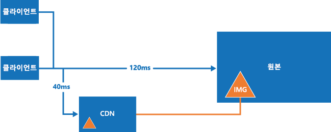

# <a name="content-delivery-network"></a><span data-ttu-id="6d6f0-103">Content Delivery Network</span><span class="sxs-lookup"><span data-stu-id="6d6f0-103">Content Delivery Network</span></span>
[!INCLUDE [header](../_includes/header.md)]

<span data-ttu-id="6d6f0-104">Microsoft Azure Content Delivery Network(CDN)는 개발자에게 Azure 또는 기타 위치에서 호스트되는 고대역폭 콘텐츠를 제공하기 위한 글로벌 솔루션을 제공합니다.</span><span class="sxs-lookup"><span data-stu-id="6d6f0-104">The Microsoft Azure Content Delivery Network (CDN) offers developers a global solution for delivering high-bandwidth content that is hosted in Azure or any other location.</span></span> <span data-ttu-id="6d6f0-105">CDN을 사용하여 Azure Blob Storage, 웹 응용 프로그램, 가상 머신, 응용 프로그램 폴더 또는 기타 HTTP/HTTPS 위치에서 로드된 공개적으로 사용 가능한 개체를 캐시할 수 있습니다.</span><span class="sxs-lookup"><span data-stu-id="6d6f0-105">Using the CDN, you can cache publicly available objects loaded from Azure blob storage, a web application, virtual machine, application folder, or other HTTP/HTTPS location.</span></span> <span data-ttu-id="6d6f0-106">전략적 위치에 CDN 캐시를 보유하여 사용자에게 콘텐츠를 배달하기 위해 최대 대역폭을 제공할 수 있습니다.</span><span class="sxs-lookup"><span data-stu-id="6d6f0-106">The CDN cache can be held at strategic locations to provide maximum bandwidth for delivering content to users.</span></span> <span data-ttu-id="6d6f0-107">CDN은 일반적으로 이미지, 스타일 시트, 문서, 파일, 클라이언트쪽 스크립트 및 HTML 페이지와 같은 정적 콘텐츠를 제공하기 위해 사용됩니다.</span><span class="sxs-lookup"><span data-stu-id="6d6f0-107">The CDN is typically used for delivering static content such as images, style sheets, documents, files, client-side scripts, and HTML pages.</span></span>

<span data-ttu-id="6d6f0-108">또한 지정된 입력을 기반으로 하는 PDF 보고서 또는 그래프와 같은 동적 콘텐츠를 제공하기 위해 CDN을 캐시로 사용할 수 있습니다. 여러 사용자가 동일한 입력 값을 제공하는 경우 결과는 동일해야 합니다.</span><span class="sxs-lookup"><span data-stu-id="6d6f0-108">You can also use the CDN as a cache for serving dynamic content, such as a PDF report or graph based on specified inputs; if the same input values are provided by different users the result should be the same.</span></span>

<span data-ttu-id="6d6f0-109">CDN을 사용하는 주요 이점은 대기 시간이 짧고 응용 프로그램이 호스팅되는 데이터 센터와 관련하여 지리적 위치에 관계 없이 사용자에게 콘텐츠를 빠르게 제공할 수 있다는 점입니다.</span><span class="sxs-lookup"><span data-stu-id="6d6f0-109">The major advantages of using the CDN are lower latency and faster delivery of content to users irrespective of their geographical location in relation to the datacenter where the application is hosted.</span></span>  



<span data-ttu-id="6d6f0-111">CDN를 사용하면 콘텐츠에 액세스하고 콘텐츠를 전달하는 데 필요한 프로세스를 줄여주므로 응용 프로그램에 대한 부하를 줄입니다.</span><span class="sxs-lookup"><span data-stu-id="6d6f0-111">Using the CDN should also help to reduce the load on application because it is relieved of the processing required to access and deliver the content.</span></span> <span data-ttu-id="6d6f0-112">이렇게 부하가 감소하므로 특정 수준의 성능 및 가용성을 달성하는 데 필요한 처리 리소스를 줄여 호스팅 비용을 최소화할 뿐만 아니라 응용 프로그램의 성능과 확장성도 높일 수 있습니다.</span><span class="sxs-lookup"><span data-stu-id="6d6f0-112">This reduction in load can help to increase the performance and scalability of the application, as well as minimizing hosting costs by reducing the processing resources required to achieve a specific level of performance and availability.</span></span>

## <a name="how-and-why-a-cdn-is-used"></a><span data-ttu-id="6d6f0-113">CDN 사용 방법 및 사용 이유</span><span class="sxs-lookup"><span data-stu-id="6d6f0-113">How and why a CDN is used</span></span>
<span data-ttu-id="6d6f0-114">일반적인 CDN의 용도는 다음과 같습니다.</span><span class="sxs-lookup"><span data-stu-id="6d6f0-114">Typical uses for a CDN include:</span></span>  

* <span data-ttu-id="6d6f0-115">웹 사이트에서 종종 클라이언트 응용 프로그램에 대한 정적 리소스를 제공합니다.</span><span class="sxs-lookup"><span data-stu-id="6d6f0-115">Delivering static resources for client applications, often from a website.</span></span> <span data-ttu-id="6d6f0-116">이미지, 스타일 시트, 문서, 파일, 클라이언트쪽 스크립트, HTML 페이지, HTML 조각 또는 서버가 각 요청에 대해 수정할 필요가 없는 기타 콘텐츠 등이 이러한 리소스에 해당할 수 있습니다.</span><span class="sxs-lookup"><span data-stu-id="6d6f0-116">These resources can be images, style sheets, documents, files, client-side scripts, HTML pages, HTML fragments, or any other content that the server does not need to modify for each request.</span></span> <span data-ttu-id="6d6f0-117">응용 프로그램이 런타임 시 항목을 만들고 CDN에서 사용할 수 있게 만들 수 있지만(현재 뉴스 헤드라인 목록 작성을 통해) 각 요청에 대해서는 그렇게 할 수 없습니다.</span><span class="sxs-lookup"><span data-stu-id="6d6f0-117">The application can create items at runtime and make them available to the CDN (for example, by creating a list of current news headlines), but it does not do so for each request.</span></span>
* <span data-ttu-id="6d6f0-118">휴대폰 및 태블릿 컴퓨터와 같은 장치에 공용 정적 및 공유 콘텐츠를 전달합니다.</span><span class="sxs-lookup"><span data-stu-id="6d6f0-118">Delivering public static and shared content to devices such as mobile phones and tablet computers.</span></span> <span data-ttu-id="6d6f0-119">응용 프로그램 자체는 다양한 장치에서 실행되는 클라이언트에 API를 제공하는 웹 서비스입니다.</span><span class="sxs-lookup"><span data-stu-id="6d6f0-119">The application itself is a web service that offers an API to clients running on the various devices.</span></span> <span data-ttu-id="6d6f0-120">또한 클라이언트가 CDN 클라이언트 UI를 생성하는 데 사용할 정적 데이터 집합을 (웹 서비스를 통해) 제공할 수 있습니다.</span><span class="sxs-lookup"><span data-stu-id="6d6f0-120">The CDN can also deliver static datasets (via the web service) for the clients to use, perhaps to generate the client UI.</span></span> <span data-ttu-id="6d6f0-121">예를 들어, CDN은 JSON 또는 XML 문서를 배포하는 데 사용할 수 있습니다.</span><span class="sxs-lookup"><span data-stu-id="6d6f0-121">For example, the CDN could be used to distribute JSON or XML documents.</span></span>
* <span data-ttu-id="6d6f0-122">어떠한 전용 계산 리소스 필요 없이 공용 정적 콘텐츠만으로 구성된 전체 웹 사이트를 클라이언트에 제공합니다.</span><span class="sxs-lookup"><span data-stu-id="6d6f0-122">Serving entire websites that consist of only public static content to clients, without requiring any dedicated compute resources.</span></span>
* <span data-ttu-id="6d6f0-123">주문 시 비디오 파일을 클라이언트에 스트리밍합니다.</span><span class="sxs-lookup"><span data-stu-id="6d6f0-123">Streaming video files to the client on demand.</span></span> <span data-ttu-id="6d6f0-124">비디오는 CDN 연결을 제공하는 전역적으로 위치한 데이터 센터에서 짧은 대기 시간 및 안정적인 연결 이점을 얻을 수 있습니다.</span><span class="sxs-lookup"><span data-stu-id="6d6f0-124">Video benefits from the low latency and reliable connectivity available from the globally located datacenters that offer CDN connections.</span></span> <span data-ttu-id="6d6f0-125">Microsoft AMS(Azure Media Services)는 Azure CDN에 통합되어 향후 배포를 위해 CDN에 직접 콘텐츠를 배달합니다.</span><span class="sxs-lookup"><span data-stu-id="6d6f0-125">Microsoft Azure Media Services (AMS) integrates with Azure CDN to deliver content directly to the CDN for further distribution.</span></span> <span data-ttu-id="6d6f0-126">자세한 내용은 [스트리밍 끝점 개요](/azure/media-services/media-services-streaming-endpoints-overview)를 참조하세요.</span><span class="sxs-lookup"><span data-stu-id="6d6f0-126">For more information, see [Streaming endpoints overview](/azure/media-services/media-services-streaming-endpoints-overview).</span></span>
* <span data-ttu-id="6d6f0-127">일반적으로 사용자, 특히 응용 프로그램을 호스팅하는 데이터 센터에서 멀리 떨어진 사용자의 환경을 개선합니다.</span><span class="sxs-lookup"><span data-stu-id="6d6f0-127">Generally improving the experience for users, especially those located far from the datacenter hosting the application.</span></span> <span data-ttu-id="6d6f0-128">이러한 사용자는 대기 시간이 길어지는 문제가 생길 수 있습니다.</span><span class="sxs-lookup"><span data-stu-id="6d6f0-128">These users might otherwise suffer higher latency.</span></span> <span data-ttu-id="6d6f0-129">웹 응용 프로그램에 있는 콘텐츠의 총 크기에서 상당 부분이 정적으로, 여러 데이터 센터에 응용 프로그램을 배포하기 위한 요구 사항을 제거하면서 성능 및 전반적인 사용자 환경을 유지 관리하는 데 CDN 사용이 도움이 됩니다.</span><span class="sxs-lookup"><span data-stu-id="6d6f0-129">A large proportion of the total size of the content in a web application is often static, and using the CDN can help to maintain performance and overall user experience while eliminating the requirement to deploy the application to multiple data centers.</span></span>
* <span data-ttu-id="6d6f0-130">IoT(사물 인터넷) 솔루션을 지원하는 응용 프로그램에 대한 부하 증가를 처리합니다.</span><span class="sxs-lookup"><span data-stu-id="6d6f0-130">Handling the growing load on applications that support IoT (Internet of Things) solutions.</span></span> <span data-ttu-id="6d6f0-131">응용 프로그램이 각 장치에 대해 브로드캐스트 메시지를 처리하고 펌웨어 업데이트 배포를 직접 관리해야 하는 경우 관련된 수많은 장치 및 어플라이언스의 해당 응용 프로그램에 과부하가 걸릴 수 있습니다.</span><span class="sxs-lookup"><span data-stu-id="6d6f0-131">The huge numbers of such devices and appliances involved could easily overwhelm an application if it was required to process broadcast messages and manage firmware update distribution directly to each device.</span></span>
* <span data-ttu-id="6d6f0-132">응용 프로그램을 확장할 필요 없이 필요 시 최대치 및 급격한 증가에 대처하여 그에 따른 실행 비용의 증가를 방지합니다.</span><span class="sxs-lookup"><span data-stu-id="6d6f0-132">Coping with peaks and surges in demand without requiring the application to scale, avoiding the consequent increased running costs.</span></span> <span data-ttu-id="6d6f0-133">예를 들어 특정 라우터 모델과 같은 하드웨어 장치 또는 스마트 TV와 같은 소비자 장치에 대한 운영 체제 업데이트를 릴리스할 때는 짧은 기간 동안 수백만 명의 사용자 및 장치가 이를 다운로드하므로 최고치의 수요가 발생하게 됩니다.</span><span class="sxs-lookup"><span data-stu-id="6d6f0-133">For example, when an update to an operating system is released for a hardware device such as a specific model of router, or for a consumer device such as a smart TV, there will be a huge peak in demand as it is downloaded by millions of users and devices over a short period.</span></span>

<span data-ttu-id="6d6f0-134">다음 목록에서는 여러 지리적 위치에서 첫 번째 바이트까지의 중간 시간 값의 예를 보여줍니다.</span><span class="sxs-lookup"><span data-stu-id="6d6f0-134">The following list shows examples of the median time to first byte from various geographic locations.</span></span> <span data-ttu-id="6d6f0-135">대상 웹 역할은 Azure West US에 배포됩니다.</span><span class="sxs-lookup"><span data-stu-id="6d6f0-135">The target web role is deployed to Azure West US.</span></span> <span data-ttu-id="6d6f0-136">CDN으로 인한 대폭적인 증가와 CDN 노드까지의 근접도 간에는 큰 상관관계가 있습니다.</span><span class="sxs-lookup"><span data-stu-id="6d6f0-136">There is a strong correlation between greater boost due to the CDN and proximity to a CDN node.</span></span> <span data-ttu-id="6d6f0-137">Azure CDN 노드 위치의 전체 목록은 [Azure CDN(Content Delivery Network) 노드 위치](/azure/cdn/cdn-pop-locations/)를 참조하세요.</span><span class="sxs-lookup"><span data-stu-id="6d6f0-137">A complete list of Azure CDN node locations is available at [Azure Content Delivery Network (CDN) Node Locations](/azure/cdn/cdn-pop-locations/).</span></span>

|  | <span data-ttu-id="6d6f0-138">첫 번째 바이트(원점)까지 시간(ms)</span><span class="sxs-lookup"><span data-stu-id="6d6f0-138">Time (ms) to First Byte (Origin)</span></span> | <span data-ttu-id="6d6f0-139">첫 번째(CDN)까지 시간(ms)</span><span class="sxs-lookup"><span data-stu-id="6d6f0-139">Time (ms) to First (CDN)</span></span> | <span data-ttu-id="6d6f0-140">%CDN 시간 개선</span><span class="sxs-lookup"><span data-stu-id="6d6f0-140">%CDN time improvement</span></span> |
| --- | --- | --- | --- |
| <span data-ttu-id="6d6f0-141">\*산호세, 캘리포니아</span><span class="sxs-lookup"><span data-stu-id="6d6f0-141">\*San Jose, CA</span></span> |<span data-ttu-id="6d6f0-142">47.5</span><span class="sxs-lookup"><span data-stu-id="6d6f0-142">47.5</span></span> |<span data-ttu-id="6d6f0-143">46.5</span><span class="sxs-lookup"><span data-stu-id="6d6f0-143">46.5</span></span> |<span data-ttu-id="6d6f0-144">2%</span><span class="sxs-lookup"><span data-stu-id="6d6f0-144">2%</span></span> |
| <span data-ttu-id="6d6f0-145">\*\*덜레스, 버지니아</span><span class="sxs-lookup"><span data-stu-id="6d6f0-145">\*\*Dulles, VA</span></span> |<span data-ttu-id="6d6f0-146">109</span><span class="sxs-lookup"><span data-stu-id="6d6f0-146">109</span></span> |<span data-ttu-id="6d6f0-147">40.5</span><span class="sxs-lookup"><span data-stu-id="6d6f0-147">40.5</span></span> |<span data-ttu-id="6d6f0-148">169%</span><span class="sxs-lookup"><span data-stu-id="6d6f0-148">169%</span></span> |
| <span data-ttu-id="6d6f0-149">부에노스아이레스, 아르헨티나</span><span class="sxs-lookup"><span data-stu-id="6d6f0-149">Buenos Aires, AR</span></span> |<span data-ttu-id="6d6f0-150">210</span><span class="sxs-lookup"><span data-stu-id="6d6f0-150">210</span></span> |<span data-ttu-id="6d6f0-151">151</span><span class="sxs-lookup"><span data-stu-id="6d6f0-151">151</span></span> |<span data-ttu-id="6d6f0-152">39%</span><span class="sxs-lookup"><span data-stu-id="6d6f0-152">39%</span></span> |
| <span data-ttu-id="6d6f0-153">\*런던, 영국</span><span class="sxs-lookup"><span data-stu-id="6d6f0-153">\*London, UK</span></span> |<span data-ttu-id="6d6f0-154">195</span><span class="sxs-lookup"><span data-stu-id="6d6f0-154">195</span></span> |<span data-ttu-id="6d6f0-155">44</span><span class="sxs-lookup"><span data-stu-id="6d6f0-155">44</span></span> |<span data-ttu-id="6d6f0-156">343%</span><span class="sxs-lookup"><span data-stu-id="6d6f0-156">343%</span></span> |
| <span data-ttu-id="6d6f0-157">상하이, 중국</span><span class="sxs-lookup"><span data-stu-id="6d6f0-157">Shanghai, CN</span></span> |<span data-ttu-id="6d6f0-158">242</span><span class="sxs-lookup"><span data-stu-id="6d6f0-158">242</span></span> |<span data-ttu-id="6d6f0-159">206</span><span class="sxs-lookup"><span data-stu-id="6d6f0-159">206</span></span> |<span data-ttu-id="6d6f0-160">17%</span><span class="sxs-lookup"><span data-stu-id="6d6f0-160">17%</span></span> |
| <span data-ttu-id="6d6f0-161">\*싱가포르</span><span class="sxs-lookup"><span data-stu-id="6d6f0-161">\*Singapore</span></span> |<span data-ttu-id="6d6f0-162">214</span><span class="sxs-lookup"><span data-stu-id="6d6f0-162">214</span></span> |<span data-ttu-id="6d6f0-163">74</span><span class="sxs-lookup"><span data-stu-id="6d6f0-163">74</span></span> |<span data-ttu-id="6d6f0-164">189%</span><span class="sxs-lookup"><span data-stu-id="6d6f0-164">189%</span></span> |
| <span data-ttu-id="6d6f0-165">\*도쿄, 일본</span><span class="sxs-lookup"><span data-stu-id="6d6f0-165">\*Tokyo, JP</span></span> |<span data-ttu-id="6d6f0-166">163</span><span class="sxs-lookup"><span data-stu-id="6d6f0-166">163</span></span> |<span data-ttu-id="6d6f0-167">48</span><span class="sxs-lookup"><span data-stu-id="6d6f0-167">48</span></span> |<span data-ttu-id="6d6f0-168">204%</span><span class="sxs-lookup"><span data-stu-id="6d6f0-168">204%</span></span> |
| <span data-ttu-id="6d6f0-169">서울, 한국</span><span class="sxs-lookup"><span data-stu-id="6d6f0-169">Seoul, KR</span></span> |<span data-ttu-id="6d6f0-170">190</span><span class="sxs-lookup"><span data-stu-id="6d6f0-170">190</span></span> |<span data-ttu-id="6d6f0-171">190</span><span class="sxs-lookup"><span data-stu-id="6d6f0-171">190</span></span> |<span data-ttu-id="6d6f0-172">0%</span><span class="sxs-lookup"><span data-stu-id="6d6f0-172">0%</span></span> |

<span data-ttu-id="6d6f0-173">\* 동일한 도시에 Azure CDN 노드가 있습니다.</span><span class="sxs-lookup"><span data-stu-id="6d6f0-173">\* Has an Azure CDN node in the same city.</span></span>  
<span data-ttu-id="6d6f0-174">\*\* 인접한 도시에 Azure CDN 노드가 있습니다.</span><span class="sxs-lookup"><span data-stu-id="6d6f0-174">\*\* Has an Azure CDN node in a neighboring city.</span></span>  

## <a name="challenges"></a><span data-ttu-id="6d6f0-175">과제</span><span class="sxs-lookup"><span data-stu-id="6d6f0-175">Challenges</span></span>
<span data-ttu-id="6d6f0-176">CDN을 사용하려고 계획할 때 고려해야 할 몇 가지 과제가 있습니다.</span><span class="sxs-lookup"><span data-stu-id="6d6f0-176">There are several challenges to take into account when planning to use the CDN:</span></span>  

* <span data-ttu-id="6d6f0-177">**배포**.</span><span class="sxs-lookup"><span data-stu-id="6d6f0-177">**Deployment**.</span></span> <span data-ttu-id="6d6f0-178">CDN이 콘텐츠를 가져올 원본 위치 및 둘 이상의 저장소 시스템에 콘텐츠를 배포해야 하는지 여부(예: CDN과 대체 위치)를 결정합니다.</span><span class="sxs-lookup"><span data-stu-id="6d6f0-178">Decide the origin from which the CDN fetches the content, and whether you need to deploy the content in more than one storage system (such as in the CDN and an alternative location).</span></span>

  <span data-ttu-id="6d6f0-179">응용 프로그램 배포 메커니즘은 ASPX 페이지 등과 같은 응용 프로그램 파일 배포 뿐만 아니라 정적 콘텐츠 및 리소스 배포를 위한 프로세스도 고려해야 합니다.</span><span class="sxs-lookup"><span data-stu-id="6d6f0-179">Your application deployment mechanism must take into account the process for deploying static content and resources as well as deploying the application files, such as ASPX pages.</span></span> <span data-ttu-id="6d6f0-180">예를 들어 Azure Blob Storage에 콘텐츠를 로드하는 별도의 단계를 구현해야 할 수 있습니다.</span><span class="sxs-lookup"><span data-stu-id="6d6f0-180">For example, you may need to implement a separate step to load content into Azure blob storage.</span></span>
* <span data-ttu-id="6d6f0-181">**버전 관리 및 캐시 제어**.</span><span class="sxs-lookup"><span data-stu-id="6d6f0-181">**Versioning and cache-control**.</span></span> <span data-ttu-id="6d6f0-182">정적 콘텐츠를 업데이트하고 새 버전을 배포하는 방법을 고려합니다.</span><span class="sxs-lookup"><span data-stu-id="6d6f0-182">Consider how you will update static content and deploy new versions.</span></span> <span data-ttu-id="6d6f0-183">새 버전의 자산을 사용할 수 있게 되면 Azure Portal을 사용하여 CDN 콘텐츠를 [삭제](/azure/cdn/cdn-purge-endpoint/)할 수 있습니다.</span><span class="sxs-lookup"><span data-stu-id="6d6f0-183">The CDN content may be [purged](/azure/cdn/cdn-purge-endpoint/) using the Azure portal when new versions of your assets are available.</span></span> <span data-ttu-id="6d6f0-184">이는 웹 브라우저에서 발생하는 것과 같이 클라이언트 쪽 캐싱을 관리하는 작업과 비슷한 문제입니다.</span><span class="sxs-lookup"><span data-stu-id="6d6f0-184">This is a similar challenge to managing client-side caching, such as that which occurs in a web browser.</span></span>
* <span data-ttu-id="6d6f0-185">**테스트**.</span><span class="sxs-lookup"><span data-stu-id="6d6f0-185">**Testing**.</span></span> <span data-ttu-id="6d6f0-186">로컬로 또는 스테이징 환경에서 응용 프로그램을 개발하고 테스트를 수행할 때 CDN 설정의 로컬 테스트를 수행하는 것은 어려울 수 있습니다.</span><span class="sxs-lookup"><span data-stu-id="6d6f0-186">It can be difficult to perform local testing of your CDN settings when developing and testing an application locally or in a staging environment.</span></span>
* <span data-ttu-id="6d6f0-187">**SEO(검색 엔진 최적화)**.</span><span class="sxs-lookup"><span data-stu-id="6d6f0-187">**Search engine optimization (SEO)**.</span></span> <span data-ttu-id="6d6f0-188">CDN을 사용하는 경우 이미지 및 문서와 같은 콘텐츠는 다른 도메인에서 제공됩니다.</span><span class="sxs-lookup"><span data-stu-id="6d6f0-188">Content such as images and documents are served from a different domain when you use the CDN.</span></span> <span data-ttu-id="6d6f0-189">이 콘텐츠에 대한 SEO에 영향을 미칠 수 있습니다.</span><span class="sxs-lookup"><span data-stu-id="6d6f0-189">This can have an effect on SEO for this content.</span></span>
* <span data-ttu-id="6d6f0-190">**콘텐츠 보안**.</span><span class="sxs-lookup"><span data-stu-id="6d6f0-190">**Content security**.</span></span> <span data-ttu-id="6d6f0-191">Azure CDN 등의 많은 CDN 서비스가 현재 콘텐츠에 대해 모든 종류의 액세스 제어를 제공하는 것은 아닙니다.</span><span class="sxs-lookup"><span data-stu-id="6d6f0-191">Many CDN services such as Azure CDN do not currently offer any type of access control for the content.</span></span>
* <span data-ttu-id="6d6f0-192">**클라이언트 보안**.</span><span class="sxs-lookup"><span data-stu-id="6d6f0-192">**Client security**.</span></span> <span data-ttu-id="6d6f0-193">클라이언트가 CDN의 리소스에 대한 액세스를 허용하지 않는 환경에서 연결될 수 있습니다.</span><span class="sxs-lookup"><span data-stu-id="6d6f0-193">Clients might connect from an environment that does not allow access to resources on the CDN.</span></span> <span data-ttu-id="6d6f0-194">알려진 원본 집합만 액세스하도록 제한되거나, 페이지 원본 이외의 위치에서는 리소스를 로드할 수 없는 제한된 보안 환경일 수 있습니다.</span><span class="sxs-lookup"><span data-stu-id="6d6f0-194">This could be a security-constrained environment that limits access to only a set of known sources, or one that prevents loading of resources from anything other than the page origin.</span></span> <span data-ttu-id="6d6f0-195">이러한 경우를 처리하는 데 대체 구현이 필요합니다.</span><span class="sxs-lookup"><span data-stu-id="6d6f0-195">A fallback implementation is required to handle these cases.</span></span>
* <span data-ttu-id="6d6f0-196">**복원력**.</span><span class="sxs-lookup"><span data-stu-id="6d6f0-196">**Resilience**.</span></span> <span data-ttu-id="6d6f0-197">CDN은 응용 프로그램에 대한 단일 오류 지점이 될 수 있습니다.</span><span class="sxs-lookup"><span data-stu-id="6d6f0-197">The CDN is a potential single point of failure for an application.</span></span> <span data-ttu-id="6d6f0-198">가용성 SLA가 Blob Storage(콘텐츠를 직접 제공하는 데 사용 가능)보다 더 낮기 때문에 중요한 콘텐츠에 대해 대체 메커니즘을 구현하는 것을 고려해야 할 수 있습니다.</span><span class="sxs-lookup"><span data-stu-id="6d6f0-198">It has a lower availability SLA than blob storage (which can be used to deliver content directly) so you may need to consider implementing a fallback mechanism for critical content.</span></span>

  <span data-ttu-id="6d6f0-199">Azure Portal에서 [실시간](/azure/cdn/cdn-real-time-stats/)으로 [집계 보고서](/azure/cdn/cdn-analyze-usage-patterns/)를 통해 CDN 콘텐츠 가용성, 대역폭, 전송된 데이터, 적중 항목, 캐시 적중률 및 캐시 메트릭을 모니터링할 수 있습니다.</span><span class="sxs-lookup"><span data-stu-id="6d6f0-199">You can monitor your CDN content availability, bandwidth, data transferred, hits, cache hit ratio, and cache metrics from the Azure portal in [real-time](/azure/cdn/cdn-real-time-stats/) and [aggregate reports](/azure/cdn/cdn-analyze-usage-patterns/).</span></span>

<span data-ttu-id="6d6f0-200">다음과 같은 시나리오에서는 CDN이 그다지 유용하지 않을 수 있습니다.</span><span class="sxs-lookup"><span data-stu-id="6d6f0-200">Scenarios where CDN may be less useful include:</span></span>  

* <span data-ttu-id="6d6f0-201">콘텐츠에 적중률이 낮으면 유효한 동안 몇 번만 액세스될 수 있습니다(TTL(Time-To-Live) 설정에 따라 결정됨).</span><span class="sxs-lookup"><span data-stu-id="6d6f0-201">If the content has a low hit rate, it might be accessed only few times while it is valid (determined by its time-to-live setting).</span></span> <span data-ttu-id="6d6f0-202">항목을 처음 다운로드하면 원본에서 CDN까지, 그리고 CDN에서 고객까지 두 개의 트래잭션 비용이 발생합니다.</span><span class="sxs-lookup"><span data-stu-id="6d6f0-202">The first time an item is downloaded you incur two transaction charges from the origin to the CDN, and then from the CDN to the customer.</span></span>
* <span data-ttu-id="6d6f0-203">대기업 또는 공급망 에코시스템 등과 같이 데이터가 비공개인 경우입니다.</span><span class="sxs-lookup"><span data-stu-id="6d6f0-203">If the data is private, such as for large enterprises or supply chain ecosystems.</span></span>

## <a name="general-guidelines-and-good-practices"></a><span data-ttu-id="6d6f0-204">일반적인 지침과 모범 사례</span><span class="sxs-lookup"><span data-stu-id="6d6f0-204">General guidelines and good practices</span></span>
<span data-ttu-id="6d6f0-205">CDN 사용은 응용 프로그램에 대한 부하를 최소화하고 가용성과 성능을 극대화하는 좋은 방법입니다.</span><span class="sxs-lookup"><span data-stu-id="6d6f0-205">Using the CDN is a good way to minimize the load on your application, and maximize availability and performance.</span></span> <span data-ttu-id="6d6f0-206">따라서 응용 프로그램이 사용하는 모든 적절한 콘텐츠 및 리소스에서 이 전략을 채택할지를 고려합니다.</span><span class="sxs-lookup"><span data-stu-id="6d6f0-206">Consider adopting this strategy for all of the appropriate content and resources your application uses.</span></span> <span data-ttu-id="6d6f0-207">CDN을 사용하는 전략을 설계할 때 다음 섹션에 있는 요소를 고려합니다.</span><span class="sxs-lookup"><span data-stu-id="6d6f0-207">Consider the points in the following sections when designing your strategy to use the CDN:</span></span>  

### <a name="origin"></a><span data-ttu-id="6d6f0-208">원본</span><span class="sxs-lookup"><span data-stu-id="6d6f0-208">Origin</span></span>
<span data-ttu-id="6d6f0-209">CDN을 통해 콘텐츠를 배포하려면 CDN 서비스가 콘텐츠에 액세스하고 콘텐츠를 캐시하는 데 사용하는 HTTP 및/또는 HTTPS 끝점을 지정해야 합니다.</span><span class="sxs-lookup"><span data-stu-id="6d6f0-209">Deploying content through the CDN simply requires you to specify an HTTP and/or HTTPS endpoint that the CDN service will use to access and cache the content.</span></span>

<span data-ttu-id="6d6f0-210">끝점은 CDN을 통해 전달하려는 정적 콘텐츠를 보유하는 Azure Blob Storage 컨테이너를 지정할 수 있습니다.</span><span class="sxs-lookup"><span data-stu-id="6d6f0-210">The endpoint can specify an Azure blob storage container that holds the static content you want to deliver through the CDN.</span></span> <span data-ttu-id="6d6f0-211">컨테이너는 공용으로 표시되어야 합니다.</span><span class="sxs-lookup"><span data-stu-id="6d6f0-211">The container must be marked as public.</span></span> <span data-ttu-id="6d6f0-212">공용 읽기 액세스 권한이 있는 공용 컨테이너의 BLOB만 CDN을 통해 사용할 수 있습니다.</span><span class="sxs-lookup"><span data-stu-id="6d6f0-212">Only blobs in a public container that have public read access are available through the CDN.</span></span>

<span data-ttu-id="6d6f0-213">끝점은 응용 프로그램의 계산 계층(예: 웹 역할 또는 가상 머신) 중 하나의 루트에 **cdn** 이라는 폴더를 지정할 수 있습니다.</span><span class="sxs-lookup"><span data-stu-id="6d6f0-213">The endpoint can specify a folder named **cdn** in the root of one of application’s compute layers (such as a web role or a virtual machine).</span></span> <span data-ttu-id="6d6f0-214">ASPX 페이지 등의 동적 리소스를 포함한 리소스에 대한 요청의 결과가 CDN에 캐시됩니다.</span><span class="sxs-lookup"><span data-stu-id="6d6f0-214">The results from requests for resources, including dynamic resources such as ASPX pages, will be cached on the CDN.</span></span> <span data-ttu-id="6d6f0-215">캐시 시간은 최소 300초입니다.</span><span class="sxs-lookup"><span data-stu-id="6d6f0-215">The minimum cache period is 300 seconds.</span></span> <span data-ttu-id="6d6f0-216">시간이 짧아지면 콘텐츠가 CDN에 배포되지 않도록 방지됩니다(자세한 내용은 *캐시 제어* 제목 참조).</span><span class="sxs-lookup"><span data-stu-id="6d6f0-216">Any shorter period prevents the content from being deployed to the CDN (for more information, see the following heading *Cache control* below).</span></span>

<span data-ttu-id="6d6f0-217">Azure Web Apps를 사용하는 경우 CDN 인스턴스를 만들 때 사이트를 선택하면 해당 사이트의 루트 폴더로 끝점이 설정됩니다.</span><span class="sxs-lookup"><span data-stu-id="6d6f0-217">If you are using Azure Web Apps, the endpoint is set to the root folder of the site by selecting the site when creating the CDN instance.</span></span> <span data-ttu-id="6d6f0-218">사이트의 모든 콘텐츠는 CDN을 통해 사용할 수 있습니다.</span><span class="sxs-lookup"><span data-stu-id="6d6f0-218">All of the content for the site will be available through the CDN.</span></span>

<span data-ttu-id="6d6f0-219">대부분의 경우 응용 프로그램의 계산 계층 중 하나에 있는 폴더의 CDN 끝점을 가리키면 더 많은 유연성과 제어 기능이 제공됩니다.</span><span class="sxs-lookup"><span data-stu-id="6d6f0-219">In most cases, pointing your CDN endpoint at a folder within one of the compute layers of your application offers more flexibility and control.</span></span> <span data-ttu-id="6d6f0-220">예를 들어, 현재와 미래의 라우팅 요구 사항을 쉽게 관리할 수 있게 해주며 축소판 이미지와 같은 정적 콘텐츠를 동적으로 생성할 수 있습니다.</span><span class="sxs-lookup"><span data-stu-id="6d6f0-220">For instance, it makes it easier to manage current and future routing requirements, and dynamically generate static content such as image thumbnails.</span></span>

<span data-ttu-id="6d6f0-221">ASPX 페이지와 같은 동적 원본에서 콘텐츠를 제공할 때 캐시에서 개체를 구별하기 위해 [쿼리 문자열](/azure/cdn/cdn-query-string/)을 사용할 수 있습니다.</span><span class="sxs-lookup"><span data-stu-id="6d6f0-221">You can use [query strings](/azure/cdn/cdn-query-string/) to differentiate objects in the cache when content is delivered from dynamic sources, such as ASPX pages.</span></span> <span data-ttu-id="6d6f0-222">그러나 이 동작은 CDN 끝점을 지정할 때 Azure Portal에서 설정을 통해 비활성화할 수 있습니다.</span><span class="sxs-lookup"><span data-stu-id="6d6f0-222">However, this behavior can be disabled by a setting in the Azure portal when you specify the CDN endpoint.</span></span> <span data-ttu-id="6d6f0-223">Blob Storage에서 콘텐츠를 제공하는 경우 쿼리 문자열은 문자열 리터럴로 처리됩니다. 따라서 이름이 같지만 쿼리 문자열이 서로 다른 두 항목은 CDN에 개별 항목으로 저장됩니다.</span><span class="sxs-lookup"><span data-stu-id="6d6f0-223">When delivering content from blob storage, query strings are treated as string literals so two items that have the same name but different query strings are stored as separate items on the CDN.</span></span>

<span data-ttu-id="6d6f0-224">스크립트 및 기타 콘텐츠 등의 리소스에 대한 URL 다시 쓰기를 활용하면 CDN 원본 폴더에 파일이 이동되지 않도록 할 수 있습니다.</span><span class="sxs-lookup"><span data-stu-id="6d6f0-224">You can utilize URL rewriting for resources, such as scripts and other content, to avoid moving your files to the CDN origin folder.</span></span>

<span data-ttu-id="6d6f0-225">Azure Storage Blob을 사용하여 CDN에 사용할 콘텐츠를 보관하면 BLOB에 있는 리소스의 URL은 컨테이너 및 BLOB 이름에 대해 대/소문자를 구분합니다.</span><span class="sxs-lookup"><span data-stu-id="6d6f0-225">When using Azure storage blobs to hold content for the CDN, the URL of the resources in blobs is case-sensitive for the container and blob name.</span></span>

<span data-ttu-id="6d6f0-226">사용자 지정 원본 또는 Azure Web Apps를 사용하는 경우 리소스에 대한 링크에서 CDN 인스턴스의 경로를 지정합니다.</span><span class="sxs-lookup"><span data-stu-id="6d6f0-226">When using custom origins or Azure Web Apps, you specify the path to the CDN instance in the links to resources.</span></span> <span data-ttu-id="6d6f0-227">예를 들어, 다음은 CDN을 통해 제공될 사이트의 **Images** 폴더에 있는 이미지 파일을 지정합니다.</span><span class="sxs-lookup"><span data-stu-id="6d6f0-227">For example, the following specifies an image file in the **Images** folder of the site that will be delivered through the CDN:</span></span>

```XML

```

### <a name="deployment"></a><span data-ttu-id="6d6f0-228">배포</span><span class="sxs-lookup"><span data-stu-id="6d6f0-228">Deployment</span></span>
<span data-ttu-id="6d6f0-229">정적 콘텐츠가 응용 프로그램 배포 패키지 또는 프로세스에 포함되지 않은 경우 응용 프로그램과 별도로 프로비전 및 배포해야 할 수 있습니다.</span><span class="sxs-lookup"><span data-stu-id="6d6f0-229">Static content may need to be provisioned and deployed independently from the application if you do not include it in the application deployment package or process.</span></span> <span data-ttu-id="6d6f0-230">따라서 이 작업이 응용 프로그램 구성 요소와 정적 리소스 콘텐츠를 관리하는 데 사용할 버전 관리 방법에 어떤 영향을 주게 될지 고려해야 합니다.</span><span class="sxs-lookup"><span data-stu-id="6d6f0-230">Consider how this will affect the versioning approach you use to manage both the application components and the static resource content.</span></span>

<span data-ttu-id="6d6f0-231">스크립트 및 CSS 파일에 대한 묶음(파일 하나에 여러 파일 결합) 및 축소(공백, 줄바꿈 문자, 설명 및 기타 문자 등의 불필요한 문자 제거)를 처리하는 방법을 고려해야 합니다.</span><span class="sxs-lookup"><span data-stu-id="6d6f0-231">Consider how bundling (combining several files into one file) and minification (removing unnecessary characters such as white space, new line characters, comments, and other characters) for script and CSS files will be handled.</span></span> <span data-ttu-id="6d6f0-232">클라이언트에서 로드 시간을 줄일 수 있으며 CDN을 통한 콘텐츠 제공과 호환되는 일반적으로 사용되는 기법입니다.</span><span class="sxs-lookup"><span data-stu-id="6d6f0-232">These are commonly used techniques that can reduce load times for clients, and are compatible with delivering content through the CDN.</span></span> <span data-ttu-id="6d6f0-233">자세한 내용은 [묶음 및 축소](http://www.asp.net/mvc/tutorials/mvc-4/bundling-and-minification)를 참조하세요.</span><span class="sxs-lookup"><span data-stu-id="6d6f0-233">For more information, see [Bundling and Minification](http://www.asp.net/mvc/tutorials/mvc-4/bundling-and-minification).</span></span>

<span data-ttu-id="6d6f0-234">추가적인 위치에 콘텐츠를 배포해야 하는 경우, 이 작업이 배포 프로세스의 추가 단계가 됩니다.</span><span class="sxs-lookup"><span data-stu-id="6d6f0-234">If you need to deploy the content to an additional location, this will be an extra step in the deployment process.</span></span> <span data-ttu-id="6d6f0-235">일정한 간격으로 또는 이벤트에 대한 응답으로 응용 프로그램이 CDN에 대해 콘텐츠를 업데이트하는 경우 CDN의 끝점을 비롯한 추가적인 위치에 업데이트된 콘텐츠를 저장해야 합니다.</span><span class="sxs-lookup"><span data-stu-id="6d6f0-235">If the application updates the content for the CDN, perhaps at regular intervals or in response to an event, it must store the updated content in any additional locations as well as the endpoint for the CDN.</span></span>

<span data-ttu-id="6d6f0-236">Visual Studio의 로컬 Azure 에뮬레이터에 있는 응용 프로그램에는 CDN 끝점을 설정할 수 없습니다.</span><span class="sxs-lookup"><span data-stu-id="6d6f0-236">You cannot set up a CDN endpoint for an application in the local Azure emulator in Visual Studio.</span></span> <span data-ttu-id="6d6f0-237">이 제한은 단위 테스트, 기능 테스트 및 최종 배포 전 테스트에 적용됩니다.</span><span class="sxs-lookup"><span data-stu-id="6d6f0-237">This restriction will affect unit testing, functional testing, and final pre-deployment testing.</span></span> <span data-ttu-id="6d6f0-238">따라서 대체 메커니즘을 구현하여 이를 허용해야 합니다.</span><span class="sxs-lookup"><span data-stu-id="6d6f0-238">You must allow for this by implementing an alternative mechanism.</span></span> <span data-ttu-id="6d6f0-239">예를 들어 사용자 지정 응용 프로그램 또는 유틸리티를 사용하여 CDN에 콘텐츠를 미리 배포하고 캐시된 기간 동안 테스트를 수행할 수 있습니다.</span><span class="sxs-lookup"><span data-stu-id="6d6f0-239">For example, you could pre-deploy the content to the CDN using a custom application or utility, and perform testing during the period in which it is cached.</span></span> <span data-ttu-id="6d6f0-240">또는 컴파일 지시문이나 전역 상수를 사용하여 응용 프로그램이 리소스를 로드하는 위치를 제어합니다.</span><span class="sxs-lookup"><span data-stu-id="6d6f0-240">Alternatively, use compile directives or global constants to control from where the application loads the resources.</span></span> <span data-ttu-id="6d6f0-241">예를 들어, 디버그 모드에서 실행 중일 때는 클라이언트 쪽 스크립트 번들 또는 로컬 폴더의 기타 콘텐츠 등과 같은 로컬 리소스를 로드하고 릴리스 모드에서 실행 중일 때는 CDN을 사용할 수 있습니다.</span><span class="sxs-lookup"><span data-stu-id="6d6f0-241">For example, when running in debug mode it could load resources such as client-side script bundles and other content from a local folder, and use the CDN when running in release mode.</span></span>

<span data-ttu-id="6d6f0-242">CDN이 지원하기를 원하는 압축 방식을 고려합니다.</span><span class="sxs-lookup"><span data-stu-id="6d6f0-242">Consider which compression approach you want your CDN to support:</span></span>

* <span data-ttu-id="6d6f0-243">원본 서버에서 [압축을 사용하도록 설정](/azure/cdn/cdn-improve-performance/)할 수 있습니다. 이 경우 CDN이 기본적으로 압축을 지원하며 클라이언트에 zip 또는 gzip 형식으로 압축된 콘텐츠를 전달합니다.</span><span class="sxs-lookup"><span data-stu-id="6d6f0-243">You can [enable compression](/azure/cdn/cdn-improve-performance/) on your origin server, in which case the CDN will support compression by default and deliver compressed content to clients in a format such as zip or gzip.</span></span> <span data-ttu-id="6d6f0-244">응용 프로그램 폴더를 CDN 끝점으로 사용할 때 서버는 자동으로 웹 브라우저 또는 다른 유형의 클라이언트에 직접 제공할 때와 동일한 방식으로 일부 콘텐츠를 압축할 수 있습니다.</span><span class="sxs-lookup"><span data-stu-id="6d6f0-244">When using an application folder as the CDN endpoint, the server may compress some content automatically in the same way as when delivering it directly to a web browser or other type of client.</span></span> <span data-ttu-id="6d6f0-245">형식은 클라이언트에서 보낸 요청의 **Accept-Encoding** 헤더 값에 따라 다릅니다.</span><span class="sxs-lookup"><span data-stu-id="6d6f0-245">The format depends on the value of the **Accept-Encoding** header in the request sent by the client.</span></span> <span data-ttu-id="6d6f0-246">Azure에서 기본 메커니즘은 CPU 사용률이 50% 미만일 때 자동으로 콘텐츠를 압축하는 것입니다.</span><span class="sxs-lookup"><span data-stu-id="6d6f0-246">In Azure the default mechanism is to automatically compress content when CPU utilization is below 50%.</span></span> <span data-ttu-id="6d6f0-247">클라우드 서비스를 사용하여 응용 프로그램을 호스트하는 경우 설정을 변경하면 IIS에서 동적 출력의 압축을 사용하는 시작 작업을 사용해야 할 수 있습니다.</span><span class="sxs-lookup"><span data-stu-id="6d6f0-247">If you are using a cloud service to host the application, changing the settings may require using a startup task to turn on compression of dynamic output in IIS.</span></span> <span data-ttu-id="6d6f0-248">자세한 내용은 [웹 역할을 통해 Microsoft Azure CDN에서 gzip 압축 사용](http://blogs.msdn.com/b/avkashchauhan/archive/2012/03/05/enableing-gzip-compression-with-windows-azure-cdn-through-web-role.aspx)을 참조하세요.</span><span class="sxs-lookup"><span data-stu-id="6d6f0-248">See [Enabling gzip compression with Microsoft Azure CDN through a Web Role](http://blogs.msdn.com/b/avkashchauhan/archive/2012/03/05/enableing-gzip-compression-with-windows-azure-cdn-through-web-role.aspx) for more information.</span></span>
* <span data-ttu-id="6d6f0-249">CDN 에지 서버에서 직접 압축을 사용하도록 설정할 수 있습니다. 이 경우 CDN이 파일을 압축하여 최종 사용자에게 제공합니다.</span><span class="sxs-lookup"><span data-stu-id="6d6f0-249">You can enable compression directly on CDN edge servers, in which case the CDN will compress the files and serve it to end users.</span></span> <span data-ttu-id="6d6f0-250">자세한 내용은 [Azure CDN 압축](/azure/cdn/cdn-improve-performance/)을 참조하세요.</span><span class="sxs-lookup"><span data-stu-id="6d6f0-250">For more information, see [Azure CDN Compression](/azure/cdn/cdn-improve-performance/).</span></span>

### <a name="routing-and-versioning"></a><span data-ttu-id="6d6f0-251">라우팅 및 버전 관리</span><span class="sxs-lookup"><span data-stu-id="6d6f0-251">Routing and versioning</span></span>
<span data-ttu-id="6d6f0-252">다양한 시간에 여러 CDN 인스턴스를 사용해야 합니다.</span><span class="sxs-lookup"><span data-stu-id="6d6f0-252">You may need to use different CDN instances at various times.</span></span> <span data-ttu-id="6d6f0-253">예를 들어 응용 프로그램의 새 버전을 배포할 때 새 CDN을 사용하고 이전 버전에 대한 이전 CDN(이전 형식의 콘텐츠 포함)를 유지하려 할 수 있습니다.</span><span class="sxs-lookup"><span data-stu-id="6d6f0-253">For example, when you deploy a new version of the application you may want to use a new CDN and retain the old CDN (holding content in an older format) for previous versions.</span></span> <span data-ttu-id="6d6f0-254">Azure Blob Storage를 콘텐츠 원본으로 사용하는 경우 별도의 저장소 계정 또는 컨테이너를 만들고 CDN 끝점이 이를 가리키도록 할 수 있습니다.</span><span class="sxs-lookup"><span data-stu-id="6d6f0-254">If you use Azure blob storage as the content origin, you can create a separate storage account or a separate container and point the CDN endpoint to it.</span></span> <span data-ttu-id="6d6f0-255">응용 프로그램 내에서 cdn 루트 폴더를 CDN 끝점으로 사용하는 경우 URL 다시 쓰기 기술을 사용하여 다른 폴더로 요청을 지정할 수 있습니다.</span><span class="sxs-lookup"><span data-stu-id="6d6f0-255">If you use the cdn root folder within the application as the CDN endpoint, you can use URL rewriting techniques to direct requests to a different folder.</span></span>

<span data-ttu-id="6d6f0-256">Azure Blob Storage에서 콘텐츠를 검색할 때 쿼리 문자열이 리소스 이름(Blob 이름)의 일부이므로 CDN의 리소스에 대한 링크에서 응용 프로그램의 서로 다른 버전을 표시하기 위해 쿼리 문자열을 사용하지 않습니다.</span><span class="sxs-lookup"><span data-stu-id="6d6f0-256">Do not use the query string to denote different versions of the application in links to resources on the CDN because, when retrieving content from Azure blob storage, the query string is part of the resource name (the blob name).</span></span> <span data-ttu-id="6d6f0-257">이 방법은 클라이언트가 리소스를 캐시하는 방법에도 영향을 줄 수 있습니다.</span><span class="sxs-lookup"><span data-stu-id="6d6f0-257">This approach can also affect how the client caches resources.</span></span>

<span data-ttu-id="6d6f0-258">CDN에 이전 리소스가 캐시된 경우에는 응용 프로그램을 업데이트할 때 정적 콘텐츠의 새 버전을 배포하는 것이 어려울 수 있습니다.</span><span class="sxs-lookup"><span data-stu-id="6d6f0-258">Deploying new versions of static content when you update an application can be a challenge if the previous resources are cached on the CDN.</span></span> <span data-ttu-id="6d6f0-259">자세한 내용은 *캐시 제어* 섹션을 참조하세요.</span><span class="sxs-lookup"><span data-stu-id="6d6f0-259">For more information, see the section *Cache control*).</span></span>

<span data-ttu-id="6d6f0-260">국가별로 CDN 콘텐츠 액세스를 제한하는 것이 좋습니다.</span><span class="sxs-lookup"><span data-stu-id="6d6f0-260">Consider restricting the CDN content access by country.</span></span> <span data-ttu-id="6d6f0-261">Azure CDN을 사용하면 원본의 국가에 따라 요청을 필터링하고 전달되는 내용을 제한할 수 있습니다.</span><span class="sxs-lookup"><span data-stu-id="6d6f0-261">Azure CDN allows you to filter requests based on the country of origin and restrict the content delivered.</span></span> <span data-ttu-id="6d6f0-262">자세한 내용은 [국가별로 콘텐츠에 대한 액세스 제한](/azure/cdn/cdn-restrict-access-by-country/)을 참조하세요.</span><span class="sxs-lookup"><span data-stu-id="6d6f0-262">For more information, see [Restrict access to your content by country](/azure/cdn/cdn-restrict-access-by-country/).</span></span>

### <a name="cache-control"></a><span data-ttu-id="6d6f0-263">캐시 제어</span><span class="sxs-lookup"><span data-stu-id="6d6f0-263">Cache control</span></span>
<span data-ttu-id="6d6f0-264">시스템 내에서 캐싱을 관리하는 방법을 고려합니다.</span><span class="sxs-lookup"><span data-stu-id="6d6f0-264">Consider how to manage caching within the system.</span></span> <span data-ttu-id="6d6f0-265">예를 들어, 폴더를 CDN 원점으로 사용하는 경우 콘텐츠를 생성하는 페이지의 캐시 가능성 및 특정 폴더의 모든 리소스에 대해 콘텐츠 만료 시간을 지정할 수 있습니다.</span><span class="sxs-lookup"><span data-stu-id="6d6f0-265">For example, when using a folder as the CDN origin you can specify the cacheability of pages that generate the content, and the content expiry time for all the resources in a specific folder.</span></span> <span data-ttu-id="6d6f0-266">표준 HTTP 헤더를 사용하여 CDN 및 클라이언트에 대한 캐시 속성을 지정할 수도 있습니다.</span><span class="sxs-lookup"><span data-stu-id="6d6f0-266">You can also specify cache properties for the CDN, and for the client using standard HTTP headers.</span></span> <span data-ttu-id="6d6f0-267">서버와 클라이언트에서 이미 캐싱을 관리 중이어도 CDN을 사용하면 콘텐츠 캐시 방법과 위치를 더 잘 파악하는 데 도움이 됩니다.</span><span class="sxs-lookup"><span data-stu-id="6d6f0-267">Although you should already be managing caching on the server and client, using the CDN will help to make you more aware of how your content is cached, and where.</span></span>

<span data-ttu-id="6d6f0-268">개체를 CDN에서 사용할 수 없도록 하려면 원본(Blob 컨테이너 또는 응용 프로그램 *cdn* 루트 폴더)에서 삭제하거나 CDN 끝점을 제거 또는 삭제하거나, Blob Storage인 경우 컨테이너 또는 Blob를 비공개로 만들 수 있습니다.</span><span class="sxs-lookup"><span data-stu-id="6d6f0-268">To prevent objects from being available on the CDN you can delete them from the origin (blob container or application *cdn* root folder), remove or delete the CDN endpoint, or, in the case of blob storage, make the container or blob private.</span></span> <span data-ttu-id="6d6f0-269">그러나 항목은 해당 TTL(Time-to-Live)이 만료된 경우에만 CDN에서 제거됩니다.</span><span class="sxs-lookup"><span data-stu-id="6d6f0-269">However, items will be removed from the CDN only when their time-to-live expires.</span></span> <span data-ttu-id="6d6f0-270">캐시 만료 시간을 지정하지 않으면(예: Blob Storage에서 콘텐츠를 로드할 때) 최대 7일 동안 CDN에 캐시됩니다.</span><span class="sxs-lookup"><span data-stu-id="6d6f0-270">If no cache expiry period is specified (such as when content is loaded from blob storage), it is cached on the CDN for up to seven days.</span></span>  <span data-ttu-id="6d6f0-271">수동으로 [CDN 끝점을 삭제](/azure/cdn/cdn-purge-endpoint/)할 수도 있습니다.</span><span class="sxs-lookup"><span data-stu-id="6d6f0-271">You can also manually [purge a CDN endpoint](/azure/cdn/cdn-purge-endpoint/).</span></span>

<span data-ttu-id="6d6f0-272">웹 응용 프로그램에서 web.config 파일의 *system.webServer/staticContent* 섹션에 있는 *clientCache* 요소를 사용하여 모든 콘텐츠에 대한 캐싱 및 만료를 설정할 수 있습니다.</span><span class="sxs-lookup"><span data-stu-id="6d6f0-272">In a web application, you can set the caching and expiry for all content by using the *clientCache* element in the *system.webServer/staticContent* section of the web.config file.</span></span> <span data-ttu-id="6d6f0-273">폴더에 web.config 파일을 배치하면 해당 폴더의 파일 및 모든 하위 폴더의 파일에 적용됩니다.</span><span class="sxs-lookup"><span data-stu-id="6d6f0-273">Remember that when you place a web.config file in a folder it affects the files in that folder and all subfolders.</span></span>

<span data-ttu-id="6d6f0-274">동적으로 CDN에 대한 콘텐츠를 만드는 경우(예를 들어 응용 프로그램 코드에서) 각 페이지에서 *Cache.SetExpires* 속성을 지정하도록 합니다.</span><span class="sxs-lookup"><span data-stu-id="6d6f0-274">If you create the content for the CDN dynamically (in your application code for example), ensure that you specify the *Cache.SetExpires* property on each page.</span></span> <span data-ttu-id="6d6f0-275">CDN은 *공용*의 기본 캐시 가능성 설정을 사용하는 페이지의 출력을 캐시하지 않습니다.</span><span class="sxs-lookup"><span data-stu-id="6d6f0-275">The CDN will not cache the output from pages that use the default cacheability setting of *public*.</span></span>  <span data-ttu-id="6d6f0-276">콘텐츠가 취소되지 않고 아주 짧은 간격으로 응용 프로그램에서 다시 로드되지 않도록 캐시 만료 기간을 적절한 값으로 설정합니다.</span><span class="sxs-lookup"><span data-stu-id="6d6f0-276">Set the cache expiry period to a suitable value to ensure that the content is not discarded and reloaded from the application at very short intervals.</span></span>  

### <a name="security"></a><span data-ttu-id="6d6f0-277">보안</span><span class="sxs-lookup"><span data-stu-id="6d6f0-277">Security</span></span>
<span data-ttu-id="6d6f0-278">CDN은 CDN에서 제공하는 인증서를 사용하여 HTTPS(SSL)를 통해서 뿐만 아니라 HTTP를 통해서도 콘텐츠를 배달할 수 있습니다.</span><span class="sxs-lookup"><span data-stu-id="6d6f0-278">The CDN can deliver content over HTTPS (SSL), by using the certificate provided by the CDN, as well as over standard HTTP.</span></span> <span data-ttu-id="6d6f0-279">혼합 콘텐츠에 대한 브라우저 경고를 방지하려면 HTTPS를 사용하여 HTTPS를 통해 로드된 페이지에 표시되는 정적 콘텐츠를 요청해야 할 수 있습니다.</span><span class="sxs-lookup"><span data-stu-id="6d6f0-279">To avoid browser warnings about mixed content, you might need to use HTTPS to request static content that is displayed in pages loaded through HTTPS.</span></span>

<span data-ttu-id="6d6f0-280">CDN을 사용하여 글꼴 파일 같은 정적 자산을 배달하는 경우 *XMLHttpRequest* 호출을 사용하여 다른 도메인에서 이러한 리소스를 요청할 때 동일 원본 정책 문제가 발생할 수 있습니다.</span><span class="sxs-lookup"><span data-stu-id="6d6f0-280">If you deliver static assets such as font files by using the CDN, you might encounter same-origin policy issues if you use an *XMLHttpRequest* call to request these resources from a different domain.</span></span> <span data-ttu-id="6d6f0-281">적절한 응답 헤더를 설정하도록 웹 서버를 구성하지 않으면 많은 웹 브라우저에서 크로스-원본 자원 공유(CORS)를 차단합니다.</span><span class="sxs-lookup"><span data-stu-id="6d6f0-281">Many web browsers prevent cross-origin resource sharing (CORS) unless the web server is configured to set the appropriate response headers.</span></span> <span data-ttu-id="6d6f0-282">다음 방법 중 하나를 사용하여 CORS를 지원하도록 CDN을 구성할 수 있습니다.</span><span class="sxs-lookup"><span data-stu-id="6d6f0-282">You can configure the CDN to support CORS by using one of the following methods:</span></span>

* <span data-ttu-id="6d6f0-283">CDN 규칙 엔진을 사용하여 응답에 CORS 헤더를 추가합니다.</span><span class="sxs-lookup"><span data-stu-id="6d6f0-283">Use the CDN rules engine to add CORS headers to the responses.</span></span> <span data-ttu-id="6d6f0-284">와일드카드와 여러 특정 허용 원본이 둘 다 지원되므로 일반적으로 이 메서드가 사용하기에 가장 적합합니다.</span><span class="sxs-lookup"><span data-stu-id="6d6f0-284">This method is usually the best one to use because both wildcard and multiple specific-allowed origins are supported.</span></span> <span data-ttu-id="6d6f0-285">자세한 내용은 [CORS에서 Azure CDN 사용](https://docs.microsoft.com/en-us/azure/cdn/cdn-cors)을 참조하세요.</span><span class="sxs-lookup"><span data-stu-id="6d6f0-285">For more information, see [Using Azure CDN with CORS](https://docs.microsoft.com/en-us/azure/cdn/cdn-cors).</span></span> 
* <span data-ttu-id="6d6f0-286">서비스 속성에 *CorsRule*을 추가합니다.</span><span class="sxs-lookup"><span data-stu-id="6d6f0-286">Add a *CorsRule* to the service properties.</span></span> <span data-ttu-id="6d6f0-287">콘텐츠를 배달하는 원본이 Azure Blob Storage인 경우 이 메서드를 사용할 수 있습니다.</span><span class="sxs-lookup"><span data-stu-id="6d6f0-287">You can use this method if the origin from which you are delivering content is Azure blob storage.</span></span> <span data-ttu-id="6d6f0-288">규칙에서는 CORS 요청에 허용되는 원본, GET 등의 허용되는 메서드 및 규칙의 최대 보존 기간(초) (클라이언트가 원본 콘텐츠를 로드한 후 연결된 리소스를 요청해야 하는 기간)을 지정할 수 있습니다.</span><span class="sxs-lookup"><span data-stu-id="6d6f0-288">The rule can specify the allowed origins for CORS requests, the allowed methods such as GET, and the maximum age in seconds for the rule (the period within which the client must request the linked resources after loading the original content).</span></span> <span data-ttu-id="6d6f0-289">CDN에서 사용하도록 저장소의 CORS를 설정할 경우 허용 원본 목록에 '*' 와일드카드만 지원됩니다.</span><span class="sxs-lookup"><span data-stu-id="6d6f0-289">When you set CORS on Storage to use with CDN, only the ‘*’ wildcard is supported for the allowed origins list.</span></span> <span data-ttu-id="6d6f0-290">자세한 내용은 [Azure Storage 서비스에 대한 크로스-원본 자원 공유(CORS) 지원](http://msdn.microsoft.com/library/azure/dn535601.aspx)을 참조하세요.</span><span class="sxs-lookup"><span data-stu-id="6d6f0-290">For more information, see [Cross-Origin Resource Sharing (CORS) Support for the Azure Storage Services](http://msdn.microsoft.com/library/azure/dn535601.aspx).</span></span>
* <span data-ttu-id="6d6f0-291">모든 응답에 대해 *Access-Control-Allow-Origin*을 설정하도록 응용 프로그램 구성 파일의 아웃바운드 규칙을 구성합니다.</span><span class="sxs-lookup"><span data-stu-id="6d6f0-291">Configure outbound rules in the application configuration file to set an *Access-Control-Allow-Origin* header on all responses.</span></span> <span data-ttu-id="6d6f0-292">원본 서버에서 IIS를 실행하는 경우 이 메서드를 사용할 수 있습니다.</span><span class="sxs-lookup"><span data-stu-id="6d6f0-292">You can use this method if the origin server is running IIS.</span></span> <span data-ttu-id="6d6f0-293">CDN에서 이 메서드를 사용할 경우 허용 원본 목록에 '*' 와일드카드만 지원됩니다.</span><span class="sxs-lookup"><span data-stu-id="6d6f0-293">When you use this method with CDN, only the ‘*’ wildcard is supported for the allowed origins list.</span></span> <span data-ttu-id="6d6f0-294">다시 쓰기 규칙 사용에 대한 자세한 내용은 [URL 다시 쓰기 모듈](http://www.iis.net/learn/extensions/url-rewrite-module)을 참조하세요.</span><span class="sxs-lookup"><span data-stu-id="6d6f0-294">For more information about using rewrite rules, see [URL Rewrite Module](http://www.iis.net/learn/extensions/url-rewrite-module).</span></span>

### <a name="custom-domains"></a><span data-ttu-id="6d6f0-295">사용자 지정 도메인</span><span class="sxs-lookup"><span data-stu-id="6d6f0-295">Custom domains</span></span>
<span data-ttu-id="6d6f0-296">Azure CDN을 사용하면 [사용자 지정 도메인 이름](/azure/cdn/cdn-map-content-to-custom-domain/)을 지정하고 그 이름을 사용하여 CDN을 통해 리소스에 액세스할 수 있습니다.</span><span class="sxs-lookup"><span data-stu-id="6d6f0-296">The Azure CDN allows you to specify a [custom domain name](/azure/cdn/cdn-map-content-to-custom-domain/) and use it to access resources through the CDN.</span></span> <span data-ttu-id="6d6f0-297">또한 DNS에서 *CNAME* 레코드를 사용하여 사용자 지정 하위 도메인 이름을 설정할 수도 있습니다.</span><span class="sxs-lookup"><span data-stu-id="6d6f0-297">You can also set up a custom subdomain name using a *CNAME* record in your DNS.</span></span> <span data-ttu-id="6d6f0-298">이 방법을 사용하면 추가적인 계층을 추상화 및 제어할 수 있습니다.</span><span class="sxs-lookup"><span data-stu-id="6d6f0-298">Using this approach can provide an additional layer of abstraction and control.</span></span>

<span data-ttu-id="6d6f0-299">*CNAME*을 사용하는 경우 CDN이 자체 단일 SSL 인증서를 사용하기 때문에 SSL을 사용할 수 없고 이 인증서는 사용자 지정 도메인/하위 도메인 이름이 일치하지 않습니다.</span><span class="sxs-lookup"><span data-stu-id="6d6f0-299">If you use a *CNAME*, you cannot use SSL because the CDN uses its own single SSL certificate, and this certificate will not match your custom domain/subdomain names.</span></span>

### <a name="cdn-fallback"></a><span data-ttu-id="6d6f0-300">CDN 대체</span><span class="sxs-lookup"><span data-stu-id="6d6f0-300">CDN fallback</span></span>
<span data-ttu-id="6d6f0-301">응용 프로그램이 CDN의 오류 또는 일시적인 중단에 대처하는 방법을 고려합니다.</span><span class="sxs-lookup"><span data-stu-id="6d6f0-301">Consider how your application will cope with a failure or temporary unavailability of the CDN.</span></span> <span data-ttu-id="6d6f0-302">클라이언트 응용 프로그램은 이전 요청 중에 로컬로 캐시(클라이언트에)된 리소스의 복사본을 사용하거나, CDN을 사용할 수 없는 경우 오류를 감지하고 대신 원본(리소스가 있는 응용 프로그램 폴더 또는 Azure Blob 컨테이너)의 리소스를 요청하는 코드를 포함할 수 있습니다.</span><span class="sxs-lookup"><span data-stu-id="6d6f0-302">Client applications may be able to use copies of the resources that were cached locally (on the client) during previous requests, or you can include code that detects failure and instead requests resources from the origin (the application folder or Azure blob container that holds the resources) if the CDN is unavailable.</span></span>

<span data-ttu-id="6d6f0-303">아래 예제는 Razor 보기에서 [Tag Helpers](https://docs.microsoft.com/en-us/aspnet/core/mvc/views/tag-helpers/intro)를 사용하는 대체(Fallback) 메커니즘을 보여 줍니다.</span><span class="sxs-lookup"><span data-stu-id="6d6f0-303">The example below shows the fallback mechanisms using [Tag Helpers](https://docs.microsoft.com/en-us/aspnet/core/mvc/views/tag-helpers/intro) in a Razor view.</span></span>

```HTML
...
<link rel="stylesheet" href="https://[your-cdn-endpoint].azureedge.net/lib/bootstrap/dist/css/bootstrap.min.css"
      asp-fallback-href="~/lib/bootstrap/dist/css/bootstrap.min.css"
      asp-fallback-test-class="sr-only" asp-fallback-test-property="position" asp-fallback-test-value="absolute"/>
<link rel="stylesheet" href="~/css/site.min.css" asp-append-version="true"/>
...
<script src="https://[your-cdn-endpoint].azureedge.net/lib/jquery/dist/jquery-2.2.0.min.js"
        asp-fallback-src="~/lib/jquery/dist/jquery.min.js"
        asp-fallback-test="window.jQuery">
</script>
<script src="https://[your-cdn-endpoint].azureedge.net/lib/bootstrap/dist/js/bootstrap.min.js"
        asp-fallback-src="~/lib/bootstrap/dist/js/bootstrap.min.js"
        asp-fallback-test="window.jQuery && window.jQuery.fn && window.jQuery.fn.modal">
</script>
...
```

### <a name="search-engine-optimization"></a><span data-ttu-id="6d6f0-304">검색 엔진 최적화</span><span class="sxs-lookup"><span data-stu-id="6d6f0-304">Search engine optimization</span></span>
<span data-ttu-id="6d6f0-305">SEO가 응용 프로그램에서 중요하게 여겨지는 경우 다음 작업을 수행합니다.</span><span class="sxs-lookup"><span data-stu-id="6d6f0-305">If SEO is an important consideration in your application, perform the following tasks:</span></span>

* <span data-ttu-id="6d6f0-306">각 페이지 또는 리소스에 *Rel* canonical 헤더를 포함합니다.</span><span class="sxs-lookup"><span data-stu-id="6d6f0-306">Include a *Rel* canonical header in each page or resource.</span></span>
* <span data-ttu-id="6d6f0-307">*CNAME* 하위 도메인 레코드를 사용하고 이 이름을 사용하여 리소스에 액세스합니다.</span><span class="sxs-lookup"><span data-stu-id="6d6f0-307">Use a *CNAME* subdomain record and access the resources using this name.</span></span>
* <span data-ttu-id="6d6f0-308">응용 프로그램 자체의 국가 또는 지역과 다른 CDN의 IP 주소가 미치는 영향을 고려해야 합니다.</span><span class="sxs-lookup"><span data-stu-id="6d6f0-308">Consider the impact of the fact that the IP address of the CDN may be a country or region that differs from that of the application itself.</span></span>
* <span data-ttu-id="6d6f0-309">Azure Blob Storage를 원본으로 사용하는 경우 CDN의 리소스를 응용 프로그램 폴더에 있는 것과 동일한 파일 구조로 유지합니다.</span><span class="sxs-lookup"><span data-stu-id="6d6f0-309">When using Azure blob storage as the origin, maintain the same file structure for resources on the CDN as in the application folders.</span></span>

### <a name="monitoring-and-logging"></a><span data-ttu-id="6d6f0-310">모니터링 및 로깅</span><span class="sxs-lookup"><span data-stu-id="6d6f0-310">Monitoring and logging</span></span>
<span data-ttu-id="6d6f0-311">CDN을 응용 프로그램 모니터링 전략의 일부로 포함시켜 오류 또는 대기 시간 연장 문제의 발생을 감지 및 측정합니다.</span><span class="sxs-lookup"><span data-stu-id="6d6f0-311">Include the CDN as part of your application monitoring strategy to detect and measure failures or extended latency occurrences.</span></span>  <span data-ttu-id="6d6f0-312">모니터링은 Azure Portal 사이트에 있는 CDN 프로필 관리자에서 사용할 수 있습니다.</span><span class="sxs-lookup"><span data-stu-id="6d6f0-312">Monitoring is available from the CDN profile manager located on the Azure portal site.</span></span>

<span data-ttu-id="6d6f0-313">CDN에 로깅을 사용하고 이 로그를 일상적인 작업의 일부로 모니터링합니다.</span><span class="sxs-lookup"><span data-stu-id="6d6f0-313">Enable logging for the CDN and monitor this log as part of your daily operations.</span></span>

<span data-ttu-id="6d6f0-314">사용 패턴에 대한 CDN 트래픽을 분석하는 것이 좋습니다.</span><span class="sxs-lookup"><span data-stu-id="6d6f0-314">Consider analyzing the CDN traffic for usage patterns.</span></span> <span data-ttu-id="6d6f0-315">Azure Portal은 다음을 모니터링할 수 있는 도구를 제공합니다.</span><span class="sxs-lookup"><span data-stu-id="6d6f0-315">The Azure portal provides tools that enable you to monitor:</span></span>

* <span data-ttu-id="6d6f0-316">대역폭,</span><span class="sxs-lookup"><span data-stu-id="6d6f0-316">Bandwidth,</span></span>
* <span data-ttu-id="6d6f0-317">전송된 데이터,</span><span class="sxs-lookup"><span data-stu-id="6d6f0-317">Data Transferred,</span></span>
* <span data-ttu-id="6d6f0-318">적중 횟수(상태 코드),</span><span class="sxs-lookup"><span data-stu-id="6d6f0-318">Hits (status codes),</span></span>
* <span data-ttu-id="6d6f0-319">캐시 상태,</span><span class="sxs-lookup"><span data-stu-id="6d6f0-319">Cache Status,</span></span>
* <span data-ttu-id="6d6f0-320">캐시 적중률 및</span><span class="sxs-lookup"><span data-stu-id="6d6f0-320">Cache HIT Ratio, and</span></span>
* <span data-ttu-id="6d6f0-321">IPV4/IPV6 요청 비율</span><span class="sxs-lookup"><span data-stu-id="6d6f0-321">Ratio of IPV4/IPV6 requests.</span></span>

<span data-ttu-id="6d6f0-322">자세한 내용은 [CDN 사용 패턴 분석](/azure/cdn/cdn-analyze-usage-patterns/)을 참조하세요.</span><span class="sxs-lookup"><span data-stu-id="6d6f0-322">For more information, see [Analyze CDN usage patterns](/azure/cdn/cdn-analyze-usage-patterns/).</span></span>

### <a name="cost-implications"></a><span data-ttu-id="6d6f0-323">비용 영향</span><span class="sxs-lookup"><span data-stu-id="6d6f0-323">Cost implications</span></span>
<span data-ttu-id="6d6f0-324">CDN에서의 아웃바운드 데이터 전송 요금이 청구됩니다.</span><span class="sxs-lookup"><span data-stu-id="6d6f0-324">You are charged for outbound data transfers from the CDN.</span></span>  <span data-ttu-id="6d6f0-325">또한 Blob Storage를 사용하여 자산을 호스트하는 경우 CDN이 응용 프로그램에서 데이터를 로드할 때 저장소 트랜잭션에 대한 요금이 청구됩니다.</span><span class="sxs-lookup"><span data-stu-id="6d6f0-325">Additionally, if you're using blob storage to host your assets, you are charged for storage transactions when the CDN loads data from your application.</span></span> <span data-ttu-id="6d6f0-326">콘텐츠의 유효성을 보장할 수 있는 현실적인 캐시 만료 기간을 설정해야 하지만 기간이 너무 짧아서 응용 프로그램 또는 Blob Storage에서 CDN으로 콘텐츠를 반복적으로 다시 로드하지 않도록 합니다.</span><span class="sxs-lookup"><span data-stu-id="6d6f0-326">Set realistic cache expiry periods for content to ensure freshness, but not so short as to cause repeated reloading of content from the application or blob storage to the CDN.</span></span>

<span data-ttu-id="6d6f0-327">거의 다운로드하지 않는 항목은 서버 부하가 눈에 띄게 감소되지 않으면서 두 개의 트랜잭션 비용이 발생하게 됩니다.</span><span class="sxs-lookup"><span data-stu-id="6d6f0-327">Items that are rarely downloaded will incur the two transaction charges without providing any significant reduction in server load.</span></span>

### <a name="bundling-and-minification"></a><span data-ttu-id="6d6f0-328">묶음 및 축소</span><span class="sxs-lookup"><span data-stu-id="6d6f0-328">Bundling and minification</span></span>
<span data-ttu-id="6d6f0-329">묶음 및 축소를 사용하여 CDN에 저장된 JavaScript 코드 및 HTML 페이지와 같은 리소스의 크기를 줄입니다.</span><span class="sxs-lookup"><span data-stu-id="6d6f0-329">Use bundling and minification to reduce the size of resources such as JavaScript code and HTML pages stored in the CDN.</span></span> <span data-ttu-id="6d6f0-330">이 전략은 클라이언트에 이러한 항목을 다운로드하는 데 걸리는 시간을 줄이는 데 도움이 됩니다.</span><span class="sxs-lookup"><span data-stu-id="6d6f0-330">This strategy can help to reduce the time taken to download these items to the client.</span></span>

<span data-ttu-id="6d6f0-331">묶음 및 축소는 ASP.NET을 통해 처리할 수 있습니다.</span><span class="sxs-lookup"><span data-stu-id="6d6f0-331">Bundling and minification can be handled by ASP.NET.</span></span> <span data-ttu-id="6d6f0-332">MVC 프로젝트에서 *BundleConfig.cs*에 번들을 정의합니다.</span><span class="sxs-lookup"><span data-stu-id="6d6f0-332">In an MVC project, you define your bundles in *BundleConfig.cs*.</span></span> <span data-ttu-id="6d6f0-333">축소된 스크립트 번들에 대한 참조는 일반적으로 뷰 클래스의 코드에 있는 *Script.Render* 메서드를 호출하여 작성합니다.</span><span class="sxs-lookup"><span data-stu-id="6d6f0-333">A reference to the minified script bundle is created by calling the *Script.Render* method, typically in code in the view class.</span></span> <span data-ttu-id="6d6f0-334">이 참조에는 번들의 콘텐츠를 바탕으로 하는 해시가 포함된 쿼리 문자열이 들어 있습니다.</span><span class="sxs-lookup"><span data-stu-id="6d6f0-334">This reference contains a query string that includes a hash, which is based on the content of the bundle.</span></span> <span data-ttu-id="6d6f0-335">번들 콘텐츠가 변경되면 생성된 해시도 변경됩니다.</span><span class="sxs-lookup"><span data-stu-id="6d6f0-335">If the bundle contents change, the generated hash will also change.</span></span>  

<span data-ttu-id="6d6f0-336">기본적으로 Azure CDN 인스턴스는 *쿼리 문자열 상태* 설정이 비활성화되어 있습니다.</span><span class="sxs-lookup"><span data-stu-id="6d6f0-336">By default, Azure CDN instances have the *Query String Status* setting disabled.</span></span> <span data-ttu-id="6d6f0-337">업데이트된 스크립트 번들을 CDN에서 적절히 처리하도록 하기 위해서는 CDN 인스턴스에 대해 *쿼리 문자열 상태* 설정을 사용해야 합니다.</span><span class="sxs-lookup"><span data-stu-id="6d6f0-337">In order for updated script bundles to be handled properly by the CDN, you must enable the *Query String Status* setting for the CDN instance.</span></span> <span data-ttu-id="6d6f0-338">설정이 적용되기 전에 한 시간 이상이 걸릴 수 있습니다.</span><span class="sxs-lookup"><span data-stu-id="6d6f0-338">Note that it may take an hour or more before the setting takes effect.</span></span>

### <a name="features"></a><span data-ttu-id="6d6f0-339">기능</span><span class="sxs-lookup"><span data-stu-id="6d6f0-339">Features</span></span>

<span data-ttu-id="6d6f0-340">Azure에는 여러 CDN 제품이 있습니다.</span><span class="sxs-lookup"><span data-stu-id="6d6f0-340">Azure has several CDN products.</span></span> <span data-ttu-id="6d6f0-341">CDN을 선택하면 각 제품이 지원하는 기능을 고려합니다.</span><span class="sxs-lookup"><span data-stu-id="6d6f0-341">When selecting a CDN, consider the features that each product supports.</span></span> <span data-ttu-id="6d6f0-342">자세한 내용은 [Azure CDN 기능][cdn-features]을 참조하세요.</span><span class="sxs-lookup"><span data-stu-id="6d6f0-342">See [Azure CDN Features][cdn-features] for details.</span></span> <span data-ttu-id="6d6f0-343">고려할 수 있는 프리미엄 기능에는 다음이 포함됩니다.</span><span class="sxs-lookup"><span data-stu-id="6d6f0-343">Premium features that you may wish to consider include:</span></span>

- <span data-ttu-id="6d6f0-344">**[규칙 엔진](/azure/cdn/cdn-rules-engine)**.</span><span class="sxs-lookup"><span data-stu-id="6d6f0-344">**[Rules engine](/azure/cdn/cdn-rules-engine)**.</span></span> <span data-ttu-id="6d6f0-345">규칙 엔진을 사용하면 특정 유형의 콘텐츠 전달 차단과 같이 HTTP 요청이 처리되는 방식을 사용자 지정하여 캐싱 정책을 정의하고 HTTP 헤더를 수정할 수 있습니다.</span><span class="sxs-lookup"><span data-stu-id="6d6f0-345">The rules engine allows you to customize how HTTP requests are handled, such as blocking the delivery of certain types of content, defining a caching policy, and modifying HTTP headers.</span></span> 

- <span data-ttu-id="6d6f0-346">**[실시간 통계](/azure/cdn/cdn-real-time-stats)**.</span><span class="sxs-lookup"><span data-stu-id="6d6f0-346">**[Real-time statistics](/azure/cdn/cdn-real-time-stats)**.</span></span> <span data-ttu-id="6d6f0-347">대역폭, 캐시 상태 및 CDN 프로필에 대한 동시 연결과 같은 실시간 데이터를 모니터링하고 [실시간 경고](/azure/cdn/cdn-real-time-alerts)를 수신합니다.</span><span class="sxs-lookup"><span data-stu-id="6d6f0-347">Monitor real-time data, such as bandwidth, cache statuses, and concurrent connections to your CDN profile, and receive [real-time alerts](/azure/cdn/cdn-real-time-alerts).</span></span> 


## <a name="rules-engine-url-rewriting-example"></a><span data-ttu-id="6d6f0-348">규칙 엔진 URL 다시 쓰기 예제</span><span class="sxs-lookup"><span data-stu-id="6d6f0-348">Rules engine URL rewriting example</span></span>

<span data-ttu-id="6d6f0-349">다음 다이어그램에서는 CDN을 사용할 때 [URL 다시 쓰기](https://technet.microsoft.com/library/ee215194.aspx)를 수행하는 방법을 보여 줍니다.</span><span class="sxs-lookup"><span data-stu-id="6d6f0-349">The following diagram demonstrates how to perform [URL rewriting](https://technet.microsoft.com/library/ee215194.aspx) when using the CDN.</span></span> <span data-ttu-id="6d6f0-350">캐시된 콘텐츠에 대한 CDN의 요청은 리소스 유형(예: 스크립트 및 이미지)에 따라 응용 프로그램 루트 내의 특정 폴더로 리디렉션됩니다.</span><span class="sxs-lookup"><span data-stu-id="6d6f0-350">Requests from the CDN for content that is cached are redirected to specific folders within the application root based on the type of the resource (such as scripts and images).</span></span>  


<span data-ttu-id="6d6f0-352">다시 쓰기 규칙은 다음 리디렉션을 수행합니다.</span><span class="sxs-lookup"><span data-stu-id="6d6f0-352">These rewrite rules perform the following redirections:</span></span>

* <span data-ttu-id="6d6f0-353">첫 번째 규칙을 사용하면 리소스의 파일 이름에 버전을 포함할 수 있으며, 그런 다음 이 이름은 무시됩니다.</span><span class="sxs-lookup"><span data-stu-id="6d6f0-353">The first rule allows you to embed a version in the file name of a resource, which is then ignored.</span></span> <span data-ttu-id="6d6f0-354">예를 들어 *Filename_v123.jpg*를 *Filename.jpg*로 다시 씁니다.</span><span class="sxs-lookup"><span data-stu-id="6d6f0-354">For example, *Filename_v123.jpg* is rewritten as *Filename.jpg*.</span></span>
* <span data-ttu-id="6d6f0-355">다음 4개의 규칙에서는 웹 역할의 루트에 있는 *cdn** 폴더에 리소스를 저장하지 않을 경우 요청을 리디렉션하는 방법을 보여 줍니다.</span><span class="sxs-lookup"><span data-stu-id="6d6f0-355">The next four rules show how to redirect requests if you do not want to store the resources in a folder named *cdn** in the root of the web role.</span></span> <span data-ttu-id="6d6f0-356">규칙이 *cdn/Images*, *cdn/Content*, *cdn/Scripts* 및 *cdn/bundles* URL을 웹 역할의 해당 루트 폴더에 매핑합니다.</span><span class="sxs-lookup"><span data-stu-id="6d6f0-356">The rules map the *cdn/Images*, *cdn/Content*, *cdn/Scripts*, and *cdn/bundles* URLs to their respective root folders in the web role.</span></span>

<span data-ttu-id="6d6f0-357">URL 다시 쓰기를 사용하면 리소스 묶음에 대한 변경을 수행해야 합니다.</span><span class="sxs-lookup"><span data-stu-id="6d6f0-357">Note that using URL rewriting requires you to make some changes to the bundling of resources.</span></span>     

## <a name="more-information"></a><span data-ttu-id="6d6f0-358">자세한 정보</span><span class="sxs-lookup"><span data-stu-id="6d6f0-358">More information</span></span>
* [<span data-ttu-id="6d6f0-359">Azure CDN</span><span class="sxs-lookup"><span data-stu-id="6d6f0-359">Azure CDN</span></span>](https://azure.microsoft.com/services/cdn/)
* [<span data-ttu-id="6d6f0-360">Azure CDN(콘텐츠 배달 네트워크) 설명서</span><span class="sxs-lookup"><span data-stu-id="6d6f0-360">Azure Content Delivery Network (CDN) Documentation</span></span>](https://azure.microsoft.com/documentation/services/cdn/)
* [<span data-ttu-id="6d6f0-361">Azure CDN 사용</span><span class="sxs-lookup"><span data-stu-id="6d6f0-361">Using Azure CDN</span></span>](/azure/cdn/cdn-create-new-endpoint/)
* <span data-ttu-id="6d6f0-362">[Azure CDN과 클라우드 서비스 통합](/azure/cdn/cdn-cloud-service-with-cdn/)(https://azure.microsoft.com/blog/2011/03/18/best-practices-for-the-windows-azure-content-delivery-network/)</span><span class="sxs-lookup"><span data-stu-id="6d6f0-362">[Integrate a cloud service with Azure CDN](/azure/cdn/cdn-cloud-service-with-cdn/)(https://azure.microsoft.com/blog/2011/03/18/best-practices-for-the-windows-azure-content-delivery-network/)</span></span>


<!-- links -->

[cdn-features]: /azure/cdn/cdn-overview#azure-cdn-features
