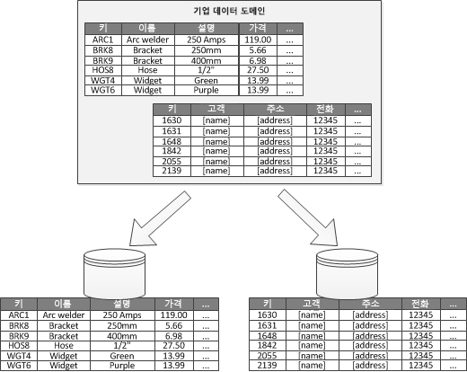
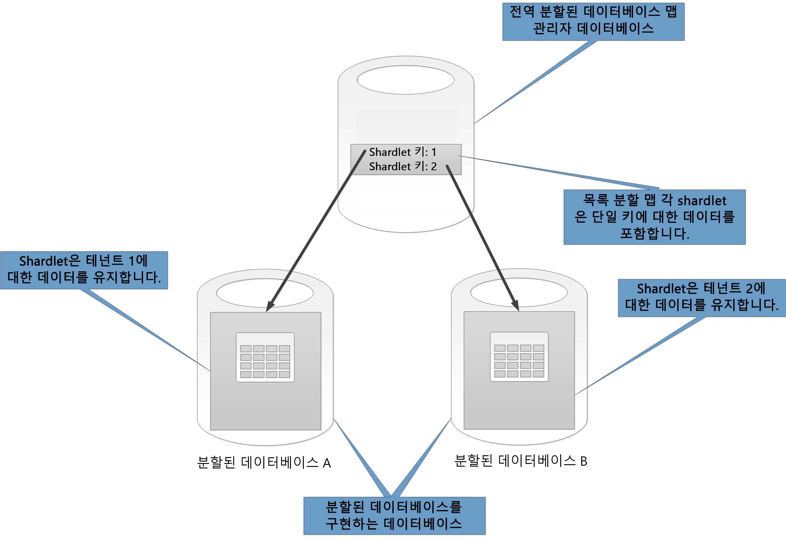
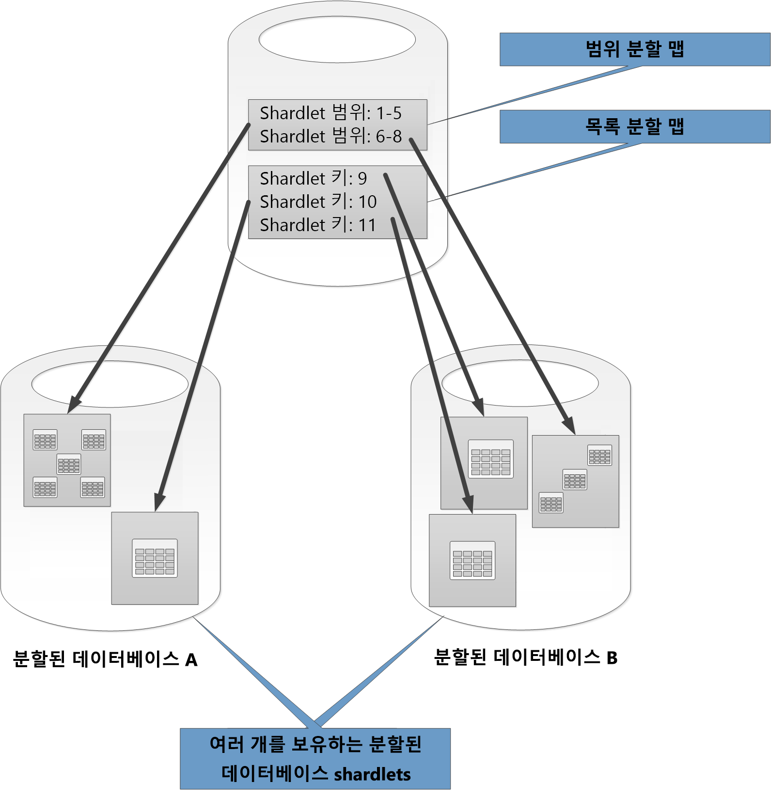

# 데이터 분할Data partitioning

대부분의 대규모 솔루션은 데이터를 개별적으로 관리하고 액세스할 수 있는 별도의 파티션으로 나눕니다.In many large-scale solutions, data is divided into separate partitions that can be managed and accessed separately. 분할 전략은 부정적인 영향을 최소화하고 이점을 극대화하도록 신중하게 선택해야 합니다.The partitioning strategy must be chosen carefully to maximize the benefits while minimizing adverse effects. 분할을 통해 확장성을 향상시키고 경합을 줄여 성능을 최적화할 수 있습니다.Partitioning can help improve scalability, reduce contention, and optimize performance. 분할의 또 다른 장점은 사용 패턴에 따라 데이터를 나누는 메커니즘을 제공할 수 있다는 점입니다.Another benefit of partitioning is that it can provide a mechanism for dividing data by the pattern of use. 예를 들어 더 오래되고 더 비활성(콜드)인 데이터를 더 저렴한 데이터 저장소에 보관할 수 있습니다.For example, you can archive older, less active (cold) data in cheaper data storage.

## 데이터를 분할하는 이유Why partition data?
대부분의 클라우드 응용 프로그램 및 서비스는 데이터를 해당 작업의 일부로 저장하고 검색합니다.Most cloud applications and services store and retrieve data as part of their operations. 응용 프로그램에서 사용하는 데이터 저장소의 디자인은 시스템의 성능, 처리량 및 확장성에 중요한 영향을 미칠 수 있습니다.The design of the data stores that an application uses can have a significant bearing on the performance, throughput, and scalability of a system. 대규모 시스템에 일반적으로 적용되는 기술 중 하나는 데이터를 별도의 파티션으로 나누는 것입니다.One technique that is commonly applied in large-scale systems is to divide the data into separate partitions.

> 이 문서에서 용어 *분할*은 데이터를 별도의 데이터 저장소에 물리적으로 나누는 프로세스를 의미합니다.In this article, the term *partitioning* means the process of physically dividing data into separate data stores. SQL Server 테이블 분할과는 다릅니다.It is not the same as SQL Server table partitioning.

데이터를 분할하면 다양한 이점을 제공할 수 있습니다.Partitioning data can offer a number of benefits. 예를 들면, 다음을 위해 적용할 수 있습니다.For example, it can be applied in order to:

* **확장성 향상**.**Improve scalability**. 단일 데이터베이스 시스템을 확장하면 결국 물리적 하드웨어 한도에 도달하게 됩니다.When you scale up a single database system, it will eventually reach a physical hardware limit. 각각 별도의 서버에 호스트되어 있는 여러 파티션에 데이터를 나누면 시스템을 거의 무제한으로 확장할 수 있습니다.If you divide data across multiple partitions, each of which is hosted on a separate server, you can scale out the system almost indefinitely.
* **성능 향상**.**Improve performance**. 각 파티션에 대한 데이터 액세스 작업은 더 작은 볼륨의 데이터에 대해 발생합니다.Data access operations on each partition take place over a smaller volume of data. 데이터를 적절하게 분할함으로써 더 효율적인 시스템을 만들 수 있습니다.Provided that the data is partitioned in a suitable way, partitioning can make your system more efficient. 둘 이상의 파티션에 영향을 주는 작업은 병렬로 실행할 수 있습니다.Operations that affect more than one partition can run in parallel. 각 파티션은 네트워크 대기 시간을 최소화하기 위해 해당 파티션이 사용되는 응용 프로그램 가까이 둘 수 있습니다.Each partition can be located near the application that uses it to minimize network latency.
* **가용성 향상**.**Improve availability**. 데이터를 여러 서버에 분리하면 단일 장애 지점이 발생하지 않습니다.Separating data across multiple servers avoids a single point of failure. 서버에 오류가 발생하거나 계획된 유지 관리를 수행 중인 경우 해당 파티션의 데이터만 사용할 수 없게 됩니다.If a server fails, or is undergoing planned maintenance, only the data in that partition is unavailable. 다른 파티션에 대한 작업은 계속 진행할 수 있습니다.Operations on other partitions can continue. 파티션 수를 늘리면 사용할 수 없는 데이터의 비율이 줄어 단일 서버 오류의 상대적 영향이 줄어듭니다.Increasing the number of partitions reduces the relative impact of a single server failure by reducing the percentage of data that will be unavailable. 각 파티션을 복제하면 작업에 영향을 미치는 단일 파티션 오류가 발생할 가능성을 더 줄일 수 있습니다.Replicating each partition can further reduce the chance of a single partition failure affecting operations. 또한 가용성이 지속적이고 높아야 하는 중요 데이터와 가용성 요구 사항이 더 낮은, 덜 중요한 데이터(예: 로그 파일)를 분리할 수도 있습니다.It also makes it possible to separate critical data that must be continually and highly available from low-value data that has lower availability requirements (log files, for example).
* **보안 기능 향상**.**Improve security**. 데이터 특성 및 분할 방법에 따라 중요한 데이터 및 중요하지 않은 데이터를 다른 파티션, 다른 서버나 데이터 저장소로 분리할 수 있습니다.Depending on the nature of the data and how it is partitioned, it might be possible to separate sensitive and non-sensitive data into different partitions, and therefore into different servers or data stores. 그러면 특별히 보안 기능을 중요 데이터에 최적화할 수 있습니다.Security can then be specifically optimized for the sensitive data.
* **유연한 운영**.**Provide operational flexibility**. 분할을 수행하면 작업을 미세 조정하고, 관리 효율성을 극대화하며, 비용을 최소화할 수 있는 기회가 늘어납니다.Partitioning offers many opportunities for fine tuning operations, maximizing administrative efficiency, and minimizing cost. 예를 들어 각 파티션의 데이터 중요도에 따라 관리, 모니터링, 백업 및 복원, 기타 관리 작업에 다양한 전략을 정의할 수 있습니다.For example, you can define different strategies for management, monitoring, backup and restore, and other administrative tasks based on the importance of the data in each partition.
* **사용 패턴에 맞게 데이터 저장소 조정**.**Match the data store to the pattern of use**. 분할은 데이터 저장소에서 제공하는 기본 제공 기능 및 비용에 따라 각 파티션을 다양한 유형의 데이터 저장소에 배포할 수 있습니다.Partitioning allows each partition to be deployed on a different type of data store, based on cost and the built-in features that data store offers. 예를 들어 대용량 이진 데이터는 BLOB 데이터 저장소에 저장할 수 있으며, 더 구조화된 데이터는 문서 데이터베이스에 보관할 수 있습니다.For example, large binary data can be stored in a blob data store, while more structured data can be held in a document database. e자세한 내용은 패턴 및 사례 지침의 [Polyglot 솔루션 빌드]와 Microsoft 웹 사이트의 [확장성이 뛰어난 솔루션에 대한 데이터 액세스: SQL, NoSQL 및 Polyglot 지속성 사용] 을 참조하세요.For more information, see [Building a polyglot solution] in the patterns & practices guide and [Data access for highly-scalable solutions: Using SQL, NoSQL, and polyglot persistence] on the Microsoft website.

일부 시스템에서는 분할이 장점이 아닌 비용으로 간주되어 구현되지 않습니다.Some systems do not implement partitioning because it is considered a cost rather than an advantage. 이러한 원리에 대한 일반적인 이유는 다음과 같습니다.Common reasons for this rationale include:

* 대부분의 데이터 저장소 시스템은 파티션 간 조인을 지원하지 않으며, 분할된 시스템의 참조 무결성을 유지 관리하기 어려울 수 있습니다.Many data storage systems do not support joins across partitions, and it can be difficult to maintain referential integrity in a partitioned system. 분할 계층의 응용 프로그램 코드에 조인 및 무결성 검사를 구현해야 하는 경우가 종종 발생하는데, 이로 인해 I/O 및 응용 프로그램의 복잡성이 높아질 수 있습니다.It is frequently necessary to implement joins and integrity checks in application code (in the partitioning layer), which can result in additional I/O and application complexity.
* 파티션을 유지 관리하는 작업이 항상 간단한 것은 아닙니다.Maintaining partitions is not always a trivial task. 데이터가 일시적인 시스템에서는 파티션을 주기적으로 리밸런스하여 경합 및 핫스팟을 줄여야 합니다.In a system where the data is volatile, you might need to rebalance partitions periodically to reduce contention and hot spots.
* 일부 일반 도구에서는 기본적으로 분할된 데이터를 사용할 수 없습니다.Some common tools do not work naturally with partitioned data.

## 파티션 디자인Designing partitions
데이터는 수평적, 수직적 또는 기능적으로 다양하게 분할할 수 있습니다.Data can be partitioned in different ways: horizontally, vertically, or functionally. 데이터를 분할하는 이유 및 데이터가 사용되는 응용 프로그램과 서비스 요구 사항에 따라 선택하는 전략이 달라집니다.The strategy you choose depends on the reason for partitioning the data, and the requirements of the applications and services that will use the data.

> [!NOTE]
> 이 지침에 설명된 파티션 구성표는 기본적인 데이터 저장소 기술과 무관하게 설명되어 있습니다.The partitioning schemes described in this guidance are explained in a way that is independent of the underlying data storage technology. 관계형 및 NoSQL 데이터베이스를 포함하여 다양한 유형의 데이터 저장소에 적용할 수 있습니다.They can be applied to many types of data stores, including relational and NoSQL databases.
>
>

### 분할 전략Partitioning strategies
다음은 일반적인 세 가지 데이터 분할 전략입니다.The three typical strategies for partitioning data are:

* **행 분할**(일반적으로 *분할*이라고 함).**Horizontal partitioning** (often called *sharding*). 이 전략에서 각 파티션은 그 자체로 데이터 저장소이지만 모든 파티션에 동일한 스키마가 있습니다.In this strategy, each partition is a data store in its own right, but all partitions have the same schema. 각 파티션을 *분할된 데이터베이스*라고 하며, 데이터의 특정 하위 집합(예: 전자 상거래 응용 프로그램에서 특정 고객 집합의 모든 주문)이 있습니다.Each partition is known as a *shard* and holds a specific subset of the data, such as all the orders for a specific set of customers in an e-commerce application.
* **수직 분할**.**Vertical partitioning**. 이 전략에서는 각 파티션에 데이터 저장소의 항목 필드 하위 집합이 보관됩니다.In this strategy, each partition holds a subset of the fields for items in the data store. 필드는 해당 사용 패턴에 따라 구분됩니다.The fields are divided according to their pattern of use. 예를 들어 자주 액세스되는 필드가 하나의 수직 분할에 배치되고 덜 자주 액세스되는 필드가 또 다른 수직 분할에 배치됩니다.For example, frequently accessed fields might be placed in one vertical partition and less frequently accessed fields in another.
* **기능 분할**.**Functional partitioning**. 이 전략에서는 시스템의 제한된 컨텍스트별로 데이터가 사용되는 방법에 따라 데이터를 집계합니다.In this strategy, data is aggregated according to how it is used by each bounded context in the system. 예를 들어 청구 및 제품 재고 관리를 위한 별도의 비즈니스 기능을 구현하는 전자 상거래 시스템에서 청구서 데이터와 제품 재고 데이터를 각각 다른 파티션에 저장할 수 있습니다.For example, an e-commerce system that implements separate business functions for invoicing and managing product inventory might store invoice data in one partition and product inventory data in another.

중요한 점은 여기 설명된 3가지 전략을 결합할 수 있다는 것입니다.It’s important to note that the three strategies described here can be combined. 모든 전략은 함께 사용할 수 있으므로 파티션 구성표를 디자인할 때 모두 고려하는 것이 좋습니다.They are not mutually exclusive, and we recommend that you consider them all when you design a partitioning scheme. 예를 들어, 데이터를 분할된 데이터베이스에 나눈 후 각각의 분할된 데이터베이스에서 수직 분할을 사용하여 데이터를 더 세분화할 수 있습니다.For example, you might divide data into shards and then use vertical partitioning to further subdivide the data in each shard. 마찬가지로, 기능 파티션에 있는 데이터도 수직 분할이 가능한 분할된 데이터베이스로 나눌 수 있습니다.Similarly, the data in a functional partition can be split into shards (which can also be vertically partitioned).

그러나 각 전략의 서로 다른 요구 사항으로 인해 다양한 충돌 문제를 일으킬 수 있습니다.However, the differing requirements of each strategy can raise a number of conflicting issues. 시스템의 전체 데이터 처리 성능 목표를 충족하는 파티션 구성표를 디자인할 때 이러한 모든 요구 사항을 평가하고 균형을 유지해야 합니다.You must evaluate and balance all of these when designing a partitioning scheme that meets the overall data processing performance targets for your system. 다음 섹션에서는 각 전략을 더 자세히 살펴봅니다.The following sections explore each of the strategies in more detail.

### 행 분할(분할)Horizontal partitioning (sharding)
그림 1에서는 행 분할 또는 분할의 개요를 보여줍니다.Figure 1 shows an overview of horizontal partitioning or sharding. 이 예에서는 제품 재고 데이터가 제품 키에 따라 분할된 데이터베이스로 나뉩니다.In this example, product inventory data is divided into shards based on the product key. 각각의 분할된 데이터베이스에는 연속된 분할 키 범위(A-G 및 H-Z)별로 데이터가 사전순으로 정렬되어 있습니다.Each shard holds the data for a contiguous range of shard keys (A-G and H-Z), organized alphabetically.

*그림 1. 파티션 키에 따라 데이터를 수평으로 분할**Figure 1. Horizontally partitioning (sharding) data based on a partition key*

분할을 사용하면 더 많은 컴퓨터에 부하를 분산하여 경합을 줄이고 성능을 향상시킬 수 있습니다.Sharding helps you spread the load over more computers, which reduces contention and improves performance. 추가 서버에서 실행되는 분할된 데이터베이스를 더 추가하여 시스템을 확장할 수 있습니다.You can scale the system out by adding further shards that run on additional servers.

이 분할 전략을 구현할 때 가장 중요한 요소는 분할 키를 선택하는 것입니다.The most important factor when implementing this partitioning strategy is the choice of sharding key. 시스템이 작동된 후에는 키를 변경하기 어려울 수 있습니다.It can be difficult to change the key after the system is in operation. 키는 분할된 데이터베이스의 워크로드가 최대한 균등하도록 데이터를 분할해야 합니다.The key must ensure that data is partitioned so that the workload is as even as possible across the shards.

여러 개의 분할된 데이터베이스에 비슷한 양의 데이터가 포함될 필요는 없습니다.Note that different shards do not have to contain similar volumes of data. 그러나 요청 수는 균형을 이루어야 합니다.Rather, the more important consideration is to balance the number of requests. 용량은 매우 크지만 각 항목에 대한 액세스 작업 수가 적은 분할된 데이터베이스가 있습니다.Some shards might be very large, but each item is the subject of a low number of access operations. 용량은 작지만 각 항목이 더 자주 액세스될 수 있는 분할된 데이터베이스도 있습니다.Other shards might be smaller, but each item is accessed much more frequently. 하나의 분할된 데이터베이스가 해당 분할된 데이터베이스를 호스트하는 데 사용되는 데이터 저장소의 확장 한도(용량 및 처리 리소스 측면)를 초과하지 않아야 합니다.It is also important to ensure that a single shard does not exceed the scale limits (in terms of capacity and processing resources) of the data store that's being used to host that shard.

분할 구성표를 사용하려면 성능 및 가용성에 영향을 미칠 수 있는 핫스팟이나 핫 파티션을 만들지 않아야 합니다.If you use a sharding scheme, avoid creating hotspots (or hot partitions) that can affect performance and availability. 예를 들어 고객 이름의 첫 문자 대신 고객 ID의 해시를 사용하면 많이 사용되거나 덜 사용되는 이니셜 문자로 발생하는 분산 불균형을 방지할 수 있습니다.For example, if you use a hash of a customer identifier instead of the first letter of a customer’s name, you prevent the unbalanced distribution that results from common and less common initial letters. 이는 파티션 간에 데이터를 더 균등하게 분산하는 데 도움이 되는 일반적인 방법입니다.This is a typical technique that helps distribute data more evenly across partitions.

대용량의 분할된 데이터베이스를 더 작은 부분으로 분할하거나, 작은 분할된 데이터베이스를 대규모 파티션으로 병합하거나, 파티션 집합에 저장된 데이터를 설명하는 스키마를 변경해야 하는 향후 요구 사항을 최소화하는 분할 키를 선택합니다.Choose a sharding key that minimizes any future requirements to split large shards into smaller pieces, coalesce small shards into larger partitions, or change the schema that describes the data stored in a set of partitions. 이러한 작업에는 시간이 많이 소요될 수 있으며 작업이 수행되는 동안 하나 이상의 분할된 데이터베이스를 오프라인 상태로 설정해야 할 수 있습니다.These operations can be very time consuming, and might require taking one or more shards offline while they are performed.

분할된 데이터베이스가 복제된 경우 일부 복제본은 다른 복제본을 분할, 병합 또는 재구성하는 동안 온라인 상태를 유지할 수 있습니다.If shards are replicated, it might be possible to keep some of the replicas online while others are split, merged, or reconfigured. 그러나 재구성을 수행하는 동안에는 분할된 데이터베이스의 데이터에 수행할 수 있는 작업을 제한해야 할 수 있습니다.However, the system might need to limit the operations that can be performed on the data in these shards while the reconfiguration is taking place. 예를 들어 분할된 데이터베이스를 재구성하는 동안 발생할 수 있는 불일치 범위를 제한하기 위해 복제본의 데이터를 읽기 전용으로 표시할 수 있습니다.For example, the data in the replicas can be marked as read-only to limit the scope of inconsistences that might occur while shards are being restructured.

> 다양한 고려 사항에 대한 자세한 내용 및 참고 자료, 행 분할을 구현하는 데이터 저장소를 디자인하는 올바른 실행 방법은 [분할 패턴]을 참조하세요.For more detailed information and guidance about many of these considerations, and good practice techniques for designing data stores that implement horizontal partitioning, see [Sharding pattern].
>
>

### 수직 분할Vertical partitioning
수직 분할은 가장 많이 액세스하는 항목을 가져오는 것과 연관된 I/O 및 성능 저하를 줄이기 위해 가장 많이 사용됩니다.The most common use for vertical partitioning is to reduce the I/O and performance costs associated with fetching the items that are accessed most frequently. 그림 2에서 수직 분할의 예제를 보여 줍니다.Figure 2 shows an example of vertical partitioning. 이 예제에서는 각 데이터 항목의 여러 속성을 여러 파티션에 보관합니다.In this example, different properties for each data item are held in different partitions. 하나의 파티션은 제품의 이름, 설명 및 가격 정보를 포함하여 더 자주 액세스되는 데이터를 보관합니다.One partition holds data that is accessed more frequently, including the name, description, and price information for products. 또 다른 파티션은 재고량 및 마지막으로 주문한 날짜를 보관합니다.Another holds the volume in stock and the last ordered date.

*그림 2. 사용 패턴에 따라 데이터를 수직으로 분할**Figure 2. Vertically partitioning data by its pattern of use*

이 예제에서는 응용 프로그램이 고객에게 제품 세부 정보를 표시할 때 제품 이름, 설명 및 가격을 정기적으로 쿼리합니다.In this example, the application regularly queries the product name, description, and price when displaying the product details to customers. 재고 수준과 제조업체에서 제품을 마지막으로 주문한 날짜를 별도의 파티션에 보관하는데, 이는 이 두 항목을 일반적으로 함께 사용하기 때문입니다.The stock level and date when the product was last ordered from the manufacturer are held in a separate partition because these two items are commonly used together.

이러한 파티션 구성표는 상대적으로 이동 속도가 느린 데이터(제품 이름, 설명 및 가격)와 동적인 데이터(재고 수준 및 마지막으로 주문한 날짜)를 분리할 수 있다는 추가 장점이 있습니다.This partitioning scheme has the added advantage that the relatively slow-moving data (product name, description, and price) is separated from the more dynamic data (stock level and last ordered date). 자주 액세스하는 응용 프로그램의 경우 이동 속도가 느린 데이터를 메모리에서 캐시하는 것이 도움이 될 수 있습니다.An application might find it beneficial to cache the slow-moving data in memory if it is frequently accessed.

이러한 분할 전략을 사용하는 또 다른 일반 시나리오는 중요 데이터의 보안을 최대화하는 경우입니다.Another typical scenario for this partitioning strategy is to maximize the security of sensitive data. 예를 들어 신용 카드 번호와 보안 확인 번호를 별도의 파티션에 저장하여 이를 수행할 수 있습니다.For example, you can do this by storing credit card numbers and the corresponding card security verification numbers in separate partitions.

수직 분할은 데이터에 필요한 동시 액세스의 양을 줄일 수도 있습니다.Vertical partitioning can also reduce the amount of concurrent access that's needed to the data.

> 수직 분할은 데이터 저장소에서 엔터티 수준으로 수행되며, 특히 엔터티를 부분적으로 정규화하여 *범위가 넓은* 항목을 *범위가 좁은* 항목 집합으로 분할합니다.Vertical partitioning operates at the entity level within a data store, partially normalizing an entity to break it down from a *wide* item to a set of *narrow* items. HBase 및 Cassandra와 같은 열 기반 데이터 저장소에 가장 적합합니다.It is ideally suited for column-oriented data stores such as HBase and Cassandra. 열 컬렉션의 데이터가 변경될 가능성이 없는 경우 SQL Server의 열 저장소를 사용할 수도 있습니다.If the data in a collection of columns is unlikely to change, you can also consider using column stores in SQL Server.
>
>

### 기능 분할Functional partitioning
응용 프로그램의 각 고유 비즈니스 또는 서비스의 제한된 컨텍스트를 식별할 수 있는 시스템의 경우 기능 분할을 사용하면 격리 및 데이터 액세스 성능을 향상할 수 있습니다.For systems where it is possible to identify a bounded context for each distinct business area or service in the application, functional partitioning provides a technique for improving isolation and data access performance. 기능 분할의 또 다른 일반적인 용도는 읽기/쓰기 데이터와 보고용으로 사용된 읽기 전용 데이터를 분리하는 것입니다.Another common use of functional partitioning is to separate read-write data from read-only data that's used for reporting purposes. 그림 3에서는 재고 데이터와 고객 데이터를 분리하는 기능 분할의 개요를 보여줍니다.Figure 3 shows an overview of functional partitioning where inventory data is separated from customer data.

*그림 3. 제한된 컨텍스트 또는 하위 도메인별로 데이터를 기능적으로 분할**Figure 3. Functionally partitioning data by bounded context or subdomain*

이러한 분할 전략은 시스템의 여러 부분에서 데이터 액세스 경합을 줄일 수 있습니다.This partitioning strategy can help reduce data access contention across different parts of a system.

## 확장성을 위한 파티션 디자인Designing partitions for scalability
데이터가 분산되어 최대 확장성을 달성하도록 각 파티션의 크기 및 워크로드를 고려하여 부하를 분산해야 합니다.It's vital to consider size and workload for each partition and balance them so that data is distributed to achieve maximum scalability. 그러나 데이터 분할도 수행하여 단일 파티션 저장소의 확장 한도를 초과하지 않도록 해야 합니다.However, you must also partition the data so that it does not exceed the scaling limits of a single partition store.

확장성을 위해 파티션을 디자인하는 경우 다음 단계를 따르세요.Follow these steps when designing partitions for scalability:

1. 응용 프로그램을 분석하여 데이터 액세스 패턴(예: 각 쿼리에서 반환된 결과 집합의 크기, 액세스 빈도, 고유 대기 시간, 서버 쪽 계산 처리 요구 사항)을 파악합니다.Analyze the application to understand the data access patterns, such as the size of the result set returned by each query, the frequency of access, the inherent latency, and the server-side compute processing requirements. 대부분의 경우 소수의 주요 엔터티에서 대부분의 처리 리소스를 요청합니다.In many cases, a few major entities will demand most of the processing resources.
2. 이 분석을 사용하여 현재 및 미래의 확장성 목표(예: 데이터 크기 및 워크로드)를 결정합니다.Use this analysis to determine the current and future scalability targets, such as data size and workload. 그런 다음 확장성 목표에 맞도록 데이터를 파티션에 분산합니다.Then distribute the data across the partitions to meet the scalability target. 행 분할 전략의 경우 분산이 균등하도록 적절한 분할 키를 선택하는 것이 중요합니다.In the horizontal partitioning strategy, choosing the appropriate shard key is important to make sure distribution is even. 자세한 내용은 [분할 패턴]을 참조하세요.For more information, see the [Sharding pattern].
3. 각 파티션에 사용할 수 있는 리소스가 데이터 크기 및 처리량 관점에서 확장성 요구 사항을 충분히 처리할 수 있어야 합니다.Make sure that the resources available to each partition are sufficient to handle the scalability requirements in terms of data size and throughput. 예를 들어 파티션을 호스트하는 노드에서 노드가 제공하는 저장소 공간 용량, 처리 능력 또는 네트워크 대역폭을 엄격하게 제한할 수 있습니다.For example, the node that's hosting a partition might impose a hard limit on the amount of storage space, processing power, or network bandwidth that it provides. 데이터 저장 및 처리 요구 사항이 이러한 제한을 초과할 가능성이 있는 경우 분할 전략을 세분화하거나 데이터를 더 분할해야 할 수 있습니다.If the data storage and processing requirements are likely to exceed these limits, it might be necessary to refine your partitioning strategy or split data out further. 한 가지 확장성 접근법을 예로 들면, 로깅 데이터와 핵심 응용 프로그램 기능을 분리할 수 있습니다.For example, one scalability approach might be to separate logging data from the core application features. 별도의 데이터 저장소를 사용하여 전체 데이터 저장소 요구 사항이 노드의 확장 한도를 초과하지 않도록 할 수 있습니다.You do this by using separate data stores to prevent the total data storage requirements from exceeding the scaling limit of the node. 전체 데이터 저장소 수가 노드 한도를 초과하는 경우 별도의 저장소 노드를 사용해야 할 수 있습니다.If the total number of data stores exceeds the node limit, it might be necessary to use separate storage nodes.
4. 사용 중인 시스템을 모니터링하여 데이터를 예상대로 분산하고 있는지, 파티션에서 부과된 부하를 처리할 수 있는지를 확인합니다.Monitor the system under use to verify that the data is distributed as expected and that the partitions can handle the load that is imposed on them. 이 사용법은 분석에서 예상한 사용법과 다를 수 있습니다.It's possible that the usage does not match the usage that's anticipated by the analysis. 이 경우 파티션을 리밸런스할 수도 있습니다.In that case, it might be possible to rebalance the partitions. 실패하는 경우 필요한 균형을 맞추기 위해 시스템 일부를 다시 디자인해야 할 수도 있습니다.Failing that, it might be necessary to redesign some parts of the system to gain the required balance.

일부 클라우드 환경에서는 인프라 경계를 기준으로 리소스를 할당합니다.Note that some cloud environments allocate resources in terms of infrastructure boundaries. 선택한 경계에 대한 제한이 데이터 저장소, 처리 능력 및 대역폭 측면에서 예상되는 데이터 볼륨 증가에 맞게 충분한 공간을 제공해야 합니다.Ensure that the limits of your selected boundary provide enough room for any anticipated growth in the volume of data, in terms of data storage, processing power, and bandwidth.

예를 들어 Azure 테이블 저장소를 사용하는 경우 사용 중인 분할된 데이터베이스에서 요청을 처리하는 데 단일 파티션에 사용할 수 있는 것보다 더 많은 리소스가 필요할 수 있습니다.For example, if you use Azure table storage, a busy shard might require more resources than are available to a single partition to handle requests. (특정 기간에 단일 파티션에서 처리할 수 있는 요청 볼륨은 제한되어 있습니다.(There is a limit to the volume of requests that can be handled by a single partition in a particular period of time. 자세한 내용은 Microsoft 웹 사이트의 [Azure 저장소 확장성 및 성능 목표] 페이지를 참조하세요.)See the page [Azure storage scalability and performance targets] on the Microsoft website for more details.)

 이러한 경우 부하를 분산하기 위해 분할된 데이터베이스를 다시 분할해야 할 수 있습니다.If this is the case, the shard might need to be repartitioned to spread the load. 해당 테이블의 총 크기 또는 처리량이 저장소 계정 용량을 초과하면 추가 저장소 계정을 만들어 해당 계정에 테이블을 분산해야 할 수도 있습니다.If the total size or throughput of these tables exceeds the capacity of a storage account, it might be necessary to create additional storage accounts and spread the tables across these accounts. 저장소 계정 수가 구독에 사용할 수 있는 계정 수를 초과하면 여러 구독을 사용해야 할 수 있습니다.If the number of storage accounts exceeds the number of accounts that are available to a subscription, then it might be necessary to use multiple subscriptions.

## 쿼리 성능을 위한 파티션 디자인Designing partitions for query performance
일반적으로 더 작은 데이터 집합을 사용하고 병렬 쿼리를 실행하여 쿼리 성능을 높일 수 있습니다.Query performance can often be boosted by using smaller data sets and by running parallel queries. 각 파티션에는 전체 데이터 집합의 일부분이 포함됩니다.Each partition should contain a small proportion of the entire data set. 이렇게 볼륨이 감소하면서 쿼리 성능이 개선될 수 있습니다.This reduction in volume can improve the performance of queries. 그러나 분할은 데이터베이스를 적절하게 디자인하고 구성하는 작업에 대한 대안이 아닙니다.However, partitioning is not an alternative for designing and configuring a database appropriately. 예를 들어, 관계형 데이터베이스를 사용하는 경우 필수 인덱스가 있어야 합니다.For example, make sure that you have the necessary indexes in place if you are using a relational database.

쿼리 성능을 위해 파티션을 디자인하는 경우 다음 단계를 따릅니다.Follow these steps when designing partitions for query performance:

1. 다음과 같이 응용 프로그램 요구 사항 및 성능을 검토합니다.Examine the application requirements and performance:
   * 비즈니스 요구 사항을 사용하여 항상 신속하게 수행해야 하는 중요 쿼리를 결정합니다.Use the business requirements to determine the critical queries that must always perform quickly.
   * 시스템을 모니터링하여 느리게 수행되는 쿼리를 식별합니다.Monitor the system to identify any queries that perform slowly.
   * 가장 자주 수행되는 쿼리를 설정합니다.Establish which queries are performed most frequently. 각 쿼리의 단일 인스턴스 비용은 매우 적을 수 있지만 누적된 리소스 사용이 매우 클 수 있습니다.A single instance of each query might have minimal cost, but the cumulative consumption of resources could be significant. 해당 쿼리로 검색한 데이터를 별도의 파티션 또는 캐시로 분리하면 유용할 수 있습니다.It might be beneficial to separate the data that's retrieved by these queries into a distinct partition, or even a cache.
2. 성능 저하를 초래하는 데이터를 분할합니다.Partition the data that is causing slow performance:
   * 쿼리 응답 시간이 목표 범위에 해당하도록 각 파티션 크기를 제한합니다.Limit the size of each partition so that the query response time is within target.
   * 행 분할을 구현 중인 경우 응용 프로그램에서 파티션을 쉽게 찾을 수 있도록 분할 키를 디자인합니다.Design the shard key so that the application can easily find the partition if you are implementing horizontal partitioning. 이렇게 하면 쿼리가 모든 분할을 검색할 필요가 없습니다.This prevents the query from having to scan through every partition.
   * 파티션의 위치를 고려합니다.Consider the location of a partition. 가능한 경우 응용 프로그램 및 액세스하는 사용자와 지리적으로 가까운 파티션에 데이터를 보관하도록 합니다.If possible, try to keep data in partitions that are geographically close to the applications and users that access it.
3. 엔터티에 처리량 및 쿼리 성능 요구 사항이 있는 경우 해당 엔터티를 기반으로 기능 분할을 사용합니다.If an entity has throughput and query performance requirements, use functional partitioning based on that entity. 기능 분할을 사용해도 요구 사항을 충족할 수 없는 경우 행 분할도 적용합니다.If this still doesn't satisfy the requirements, apply horizontal partitioning as well. 대부분의 경우 단일 분할 전략으로 충분하지만, 일부의 경우 두 전략을 결합하는 것이 더 효율적입니다.In most cases a single partitioning strategy will suffice, but in some cases it is more efficient to combine both strategies.
4. 성능 개선을 위해 여러 파티션에서 병렬로 실행되는 비동기 쿼리를 사용하는 것이 좋습니다.Consider using asynchronous queries that run in parallel across partitions to improve performance.

## 가용성을 위한 파티션 디자인Designing partitions for availability
데이터를 분할하면 전체 데이터 집합에 단일 실패 지점이 구성되지 않도록 하고, 데이터 집합의 개별 하위 집합을 독립적으로 관리할 수 있도록 하여 응용 프로그램의 가용성을 향상시킬 수 있습니다.Partitioning data can improve the availability of applications by ensuring that the entire dataset does not constitute a single point of failure and that individual subsets of the dataset can be managed independently. 중요 데이터가 포함된 파티션을 복제해도 가용성을 향상시킬 수 있습니다.Replicating partitions that contain critical data can also improve availability.

파티션을 디자인하고 구현할 때 다음과 같이 가용성에 영향을 미치는 요소를 고려합니다.When designing and implementing partitions, consider the following factors that affect availability:

* **비즈니스 운영에 대한 데이터의 중요도****How critical the data is to business operations**. 일부 데이터는 청구서 세부 정보 또는 은행 거래 내역과 같이 중요한 사업 정보를 포함할 수 있습니다.Some data might include critical business information such as invoice details or bank transactions. 기타 데이터는 중요도가 낮은 작동 데이터(예: 로그 파일, 성능 추적 등)를 포함할 수 있습니다.Other data might include less critical operational data, such as log files, performance traces, and so on. 각 유형의 데이터를 식별한 후 다음을 수행하는 것이 좋습니다.After identifying each type of data, consider:
  * 적절한 백업 계획을 사용하여 중요 데이터를 가용성이 높은 파티션에 저장합니다.Storing critical data in highly-available partitions with an appropriate backup plan.
  * 각 데이터 집합의 다양한 중요도에 따라 별도의 관리 및 모니터링 메커니즘 또는 프로시저를 설정합니다.Establishing separate management and monitoring mechanisms or procedures for the different criticalities of each dataset. 적절한 빈도로 함께 백업할 수 있도록 중요도 수준이 동일한 데이터를 같은 파티션에 배치합니다.Place data that has the same level of criticality in the same partition so that it can be backed up together at an appropriate frequency. 예를 들어 은행 거래 내역 데이터가 있는 파티션은 로깅 또는 추적 정보가 있는 파티션보다 더 자주 백업해야 합니다.For example, partitions that hold data for bank transactions might need to be backed up more frequently than partitions that hold logging or trace information.
* **개별 파티션을 관리하는 방법****How individual partitions can be managed**. 파티션을 독립적으로 관리 및 유지 관리할 수 있도록 디자인하면 몇 가지 이점이 있습니다.Designing partitions to support independent management and maintenance provides several advantages. 예: For example:
  * 하나의 파티션이 실패하는 경우 다른 파티션에 있는 데이터에 액세스하는 응용 프로그램 인스턴스에 영향을 주지 않고 파티션을 독립적으로 복구할 수 있습니다.If a partition fails, it can be recovered independently without affecting instances of applications that access data in other partitions.
  * 데이터를 지리적 영역에 따라 분할하면 각 지역에서 사용량이 적은 시간에 예약된 유지 관리 작업을 수행할 수 있습니다.Partitioning data by geographical area allows scheduled maintenance tasks to occur at off-peak hours for each location. 이 기간 동안 계획된 모든 유지 관리 작업을 완료할 수 있도록 파티션이 너무 크지 않도록 합니다.Ensure that partitions are not too big to prevent any planned maintenance from being completed during this period.
* **파티션 간 중요 데이터를 복제하는지 여부****Whether to replicate critical data across partitions**. 이 전략은 가용성과 성능을 향상시킬 수 있는 반면 일관성 문제가 발생할 수 있습니다.This strategy can improve availability and performance, although it can also introduce consistency issues. 파티션의 데이터를 변경하여 모든 복제본을 동기화하는 데 시간이 걸립니다.It takes time for changes made to data in a partition to be synchronized with every replica. 이 기간에는 다양한 파티션에 서로 다른 데이터 값이 포함됩니다.During this period, different partitions will contain different data values.

## 분할이 디자인 및 개발에 미치는 영향에 대한 이해Understanding how partitioning affects design and development
분할을 사용하면 시스템 디자인 및 개발이 더 복잡해집니다.Using partitioning adds complexity to the design and development of your system. 초기 시스템에 하나의 파티션만 포함되어 있는 경우에도 시스템 디자인의 기본적인 부분으로 분할하는 것이 좋습니다.Consider partitioning as a fundamental part of system design even if the system initially only contains a single partition. 시스템에서 성능 및 확장성 문제가 나타나기 시작할 때 분할을 추가 작업으로 처리하면 이미 유지 관리할 라이브 시스템이 있으므로 복잡성이 증가합니다.If you address partitioning as an afterthought, when the system starts to suffer performance and scalability issues, the complexity increases because you already have a live system to maintain.

이러한 환경에서 분할을 통합하기 위해 시스템을 업데이트하면 데이터 액세스 논리를 수정해야 합니다.If you update the system to incorporate partitioning in this environment, it necessitates modifying the data access logic. 일반적으로 사용자는 시스템을 계속 사용할 수 있을 것으로 예상하지만 여러 파티션에 분산할 수 있도록 기존의 대용량 데이터도 마이그레이션해야 합니다.It can also involve migrating large quantities of existing data to distribute it across partitions, often while users expect to be able to continue using the system.

일부 경우에는 초기 데이터 집합이 작아 단일 서버로 쉽게 처리할 수 있기 때문에 분할을 중요하게 고려하지 않습니다.In some cases, partitioning is not considered important because the initial dataset is small and can be easily handled by a single server. 이는 초기의 크기 이상으로 확장될 것으로 예상되지 않는 시스템은 해당될 수 있지만, 대부분의 상용 시스템은 사용자 수가 증가함에 따라 확장해야 합니다.This might be true in a system that is not expected to scale beyond its initial size, but many commercial systems need to expand as the number of users increases. 일반적으로 이러한 확장은 데이터 볼륨이 늘어나면서 함께 발생합니다.This expansion is typically accompanied by a growth in the volume of data.

또한 분할이 항상 대용량 데이터 저장소의 기능은 아니라는 점을 이해해야 합니다.It's also important to understand that partitioning is not always a function of large data stores. 예를 들어, 수백 개의 동시 클라이언트에서 작은 데이터 저장소에 과도하게 액세스할 수 있습니다.For example, a small data store might be heavily accessed by hundreds of concurrent clients. 이러한 상황에서 데이터를 분할하면 경합을 줄이고 처리량을 향상시키는 데 도움이 될 수 있습니다.Partitioning the data in this situation can help to reduce contention and improve throughput.

데이터 파티션 구성표를 설계할 때 다음 사항을 고려하세요.Consider the following points when you design a data partitioning scheme:

* **가능한 경우 가장 많이 사용되는 데이터베이스 작업에 대한 데이터를 각 파티션에 함께 보관하여 파티션 간 데이터 액세스 작업을 최소화합니다**.**Where possible, keep data for the most common database operations together in each partition to minimize cross-partition data access operations**. 여러 파티션에서 수행되는 쿼리는 단일 파티션에서만 수행되는 쿼리보다 시간이 더 걸릴 수 있지만, 파티션을 하나의 쿼리 집합에 최적화하면 다른 쿼리 집합에 부정적인 영향을 미칠 수 있습니다.Querying across partitions can be more time-consuming than querying only within a single partition, but optimizing partitions for one set of queries might adversely affect other sets of queries. 파티션 간 쿼리가 불가피한 경우 병렬 쿼리를 실행하고 응용 프로그램 내에서 결과를 집계하여 쿼리 시간을 최소화합니다.When you can't avoid querying across partitions, minimize query time by running parallel queries and aggregating the results within the application. 이 방법은 하나의 쿼리에서 결과를 얻어 다음 쿼리에 사용해야 하는 경우와 같이 일부 경우에서는 사용할 수 없습니다.This approach might not be possible in some cases, such as when it's necessary to obtain a result from one query and use it in the next query.
* **쿼리에서 상대적으로 정적인 참조 데이터(예: 우편 번호 테이블 또는 제품 목록)를 사용하는 경우 다른 파티션에서 별도로 조회해야 하는 작업 요구 사항을 줄이도록 해당 데이터를 모든 파티션에 복제하는 것이 좋습니다**.**If queries make use of relatively static reference data, such as postal code tables or product lists, consider replicating this data in all of the partitions to reduce the requirement for separate lookup operations in different partitions**. 또한 이 방법은 참조 데이터가 시스템 전체에서 트래픽이 많이 발생하는 "핫" 데이터 집합이 될 가능성을 줄일 수 있습니다.This approach can also reduce the likelihood of the reference data becoming a "hot" dataset that is subject to heavy traffic from across the entire system. 그러나 이 방법은 이 참조 데이터에 발생할 수 있는 모든 변경 사항을 동기화하는 것과 관련된 추가 비용이 있습니다.However,   there is an additional cost associated with synchronizing any changes that might occur to this reference data.
* **가능하면 수직 파티션과 기능 파티션 간 참조 무결성 요구 사항을 최소화하도록 합니다**.**Where possible, minimize requirements for referential integrity across vertical and functional partitions**. 이 구성표에서는 데이터를 업데이트하고 사용할 때 응용 프로그램 자체에서 파티션 간 참조 무결성을 유지 관리합니다.In these schemes, the application itself is responsible for maintaining referential integrity across partitions when data is updated and consumed. 여러 파티션에서 데이터를 조인해야 하는 쿼리는 일반적으로 응용 프로그램이 키 및 외래 키를 기반으로 연속 쿼리를 수행해야 하기 때문에 동일한 파티션의 데이터만 조인하는 쿼리보다 실행 속도가 느립니다.Queries that must join data across multiple partitions run more slowly than queries that join data only within the same partition because the application typically needs to perform consecutive queries based on a key and then on a foreign key. 대신, 관련 데이터를 복제하거나 비정규화하는 것이 좋습니다.Instead, consider replicating or de-normalizing the relevant data. 파티션 간 조인이 필요한 경우 쿼리 시간을 최소화하려면 파티션에 병렬 쿼리를 실행하고 응용 프로그램으로 데이터를 조인합니다.To minimize the query time where cross-partition joins are necessary, run parallel queries over the partitions and join the data within the application.
* **파티션 구성표가 파티션 간 데이터 일관성에 미칠 수 있는 영향을 고려합니다.****Consider the effect that the partitioning scheme might have on the data consistency across partitions.** 강력한 일관성이 실제로 필요한지 여부를 평가합니다.Evaluate whether strong consistency is actually a requirement. 일반적으로 클라우드에서는 강력한 일관성 대신 최종 일관성을 구현합니다.Instead, a common approach in the cloud is to implement eventual consistency. 각 파티션에 있는 데이터가 개별적으로 업데이트되고, 응용 프로그램 논리를 사용하여 업데이트를 모두 성공적으로 완료할 수 있도록 합니다.The data in each partition is updated separately, and the application logic ensures that the updates are all completed successfully. 또한 최종적으로 일치하는 작업이 실행되는 동안 데이터 쿼리에서 발생할 수 있는 불일치를 처리합니다.It also handles the inconsistencies that can arise from querying data while an eventually consistent operation is running. 최종 일관성을 구현하는 방법에 대한 자세한 내용은 [데이터 일관성 입문서]를 참조하세요.For more information about implementing eventual consistency, see the [Data consistency primer].
* **쿼리가 올바른 파티션을 찾는 방법을 고려합니다**.**Consider how queries locate the correct partition**. 쿼리가 필요한 데이터를 찾기 위해 모든 파티션을 검색해야 하는 경우에는 여러 개의 병렬 쿼리가 실행될 때에도 성능에 상당한 영향을 미치게 됩니다.If a query must scan all partitions to locate the required data, there is a significant impact on performance, even when multiple parallel queries are running. 수직 분할 및 기능 분할 전략과 함께 사용되는 쿼리는 기본적으로 파티션을 지정할 수 있습니다.Queries that are used with vertical and functional partitioning strategies can naturally specify the partitions. 그러나 행 분할을 사용하면 모든 분할된 데이터베이스에 동일한 스키마가 있기 때문에 항목을 찾기 어려울 수 있습니다.However, horizontal partitioning (sharding) can make locating an item difficult because every shard has the same schema. 일반적인 분할 솔루션은 특정 항목의 데이터에 대해 분할된 데이터베이스 위치를 조회하는 데 사용할 수 있는 맵을 유지 관리하는 것입니다.A typical solution for sharding is to maintain a map that can be used to look up the shard location for specific items of data. 이 맵은 투명한 분할을 지원하는 경우 응용 프로그램의 분할 논리에서 구현하거나 데이터 저장소에서 유지 관리할 수 있습니다.This map can be implemented in the sharding logic of the application, or maintained by the data store if it supports transparent sharding.
* **행 분할 전략을 사용하는 경우에는 주기적으로 분할된 데이터베이스를 리밸런스합니다**.**When using a horizontal partitioning strategy, consider periodically rebalancing the shards**. 이렇게 하면 크기 및 워크로드에 따라 데이터를 균등하게 분산하여 핫스팟을 최소화하고, 쿼리 성능을 최대화하며, 실제 저장소 제한 사항을 해결할 수 있습니다.This helps distribute the data evenly by size and by workload to minimize hotspots, maximize query performance, and work around physical storage limitations. 그러나 이 작업은 흔히 사용자 지정 도구 또는 프로세스를 사용해야 하는 복잡한 작업입니다.However, this is a complex task that often requires the use of a custom tool or process.
* **각 파티션을 복제하면 실패를 방지할 수 있는 추가 보호 기능을 제공합니다**.**If you replicate each partition, it provides additional protection against failure**. 하나의 복제본이 실패하면 제대로 작동되는 복사본으로 쿼리를 전송하면 됩니다.If a single replica fails, queries can be directed towards a working copy.
* **분할 전략의 물리적 한도에 도달하면 확장성을 다른 수준으로 확장해야 합니다**.**If you reach the physical limits of a partitioning strategy, you might need to extend the scalability to a different level**. 예를 들어 분할을 데이터베이스 수준에서 수행하는 경우 파티션을 여러 데이터베이스에 배치 또는 복제해야 할 수 있습니다.For example, if partitioning is at the database level, you might need to locate or replicate partitions in multiple databases. 데이터베이스 수준에서 이미 분할을 수행하고 있으며 물리적 한도가 문제인 경우에는 파티션을 여러 호스트 계정에 배치하거나 복제해야 합니다.If partitioning is already at the database level, and physical limitations are an issue, it might mean that you need to locate or replicate partitions in multiple hosting accounts.
* **트랜잭션이 여러 파티션에 있는 데이터에 액세스하지 않도록 합니다**.**Avoid transactions that access data in multiple partitions**. 데이터가 단일 파티션에 있는 경우에만 일부 데이터 저장소가 데이터를 수정하는 작업에 대해 트랜잭션 일관성 및 무결성을 구현합니다.Some data stores implement transactional consistency and integrity for operations that modify data, but only when the data is located in a single partition. 여러 파티션에서 트랜잭션 지원이 필요한 경우에는 대부분의 분할 시스템이 기본 지원을 제공하지 않기 때문에 응용 프로그램 논리의 일부로 트랜잭션 지원을 구현해야 할 수 있습니다.If you need transactional support across multiple partitions, you will probably need to implement this as part of your application logic because most partitioning systems do not provide native support.

모든 데이터 저장소에는 몇 가지 운영 관리 및 모니터링 활동이 필요합니다.All data stores require some operational management and monitoring activity. 이러한 작업에는 데이터 로드, 데이터 백업 및 복원, 데이터 재구성 및 시스템이 올바르고 효율적으로 수행되도록 보증하는 일까지 포함됩니다.The tasks can range from loading data, backing up and restoring data, reorganizing data, and ensuring that the system is performing correctly and efficiently.

운영 관리에 영향을 주는 다음 요인을 고려하도록 합니다.Consider the following factors that affect operational management:

* **데이터를 분할할 때 적절한 관리 및 운영 작업을 구현하는 방법**.**How to implement appropriate management and operational tasks when the data is partitioned**. 이러한 작업에는 백업 및 복원, 데이터 보관, 시스템 모니터링 및 기타 관리 작업이 포함될 수 있습니다.These tasks might include backup and restore, archiving data, monitoring the system, and other administrative tasks. 예를 들어, 백업 및 복원 작업 중 논리적 일관성을 유지 관리하기 어려울 수 있습니다.For example, maintaining logical consistency during backup and restore operations can be a challenge.
* **데이터를 여러 파티션으로 로드하는 방법 및 다른 원본에서 보낸 새 데이터를 추가하는 방법**.**How to load the data into multiple partitions and add new data that's arriving from other sources**. 일부 도구 및 유틸리티는 분할된 데이터 작업(예: 데이터를 올바른 파티션으로 로드)을 지원하지 않을 수 있습니다.Some tools and utilities might not support sharded data operations such as loading data into the correct partition. 즉, 새로운 도구 및 유틸리티를 만들거나 가져와야 할 수 있습니다.This means that you might have to create or obtain new tools and utilities.
* **데이터를 정기적으로 보관하고 삭제하는 방법**.**How to archive and delete the data on a regular basis**. 파티션이 과도하게 늘어나는 것을 방지하기 위해 데이터를 정기적으로(주로 월별) 보관하고 삭제해야 합니다.To prevent the excessive growth of partitions, you need to archive and delete data on a regular basis (perhaps monthly). 다른 보관 스키마와 일치하도록 데이터를 변환해야 할 수 있습니다.It might be necessary to transform the data to match a different archive schema.
* **데이터 무결성 문제를 찾는 방법**.**How to locate data integrity issues**. 데이터 무결성 문제(예: 다른 파티션의 누락된 정보를 참조하는 파티션 데이터)를 찾을 수 있도록 정기적인 프로세스를 실행하는 것이 좋습니다.Consider running a periodic process to locate any data integrity issues such as data in one partition that references missing information in another. 프로세스에서 이러한 문제를 자동으로 수정하거나 운영자가 직접 문제를 해결하도록 경고를 보낼 수 있습니다.The process can either attempt to fix these issues automatically or raise an alert to an operator to correct the problems manually. 예를 들어 전자 상거래 응용 프로그램에서 한 파티션에는 주문 정보가 있고 다른 파티션에는 각 주문을 구성하는 품목이 있을 수 있습니다.For example, in an e-commerce application, order information might be held in one partition but the line items that constitute each order might be held in another. 주문 프로세스에서는 데이터를 다른 파티션에 추가해야 합니다.The process of placing an order needs to add data to other partitions. 이 프로세스가 실패하면 해당 주문이 없는 품목이 저장될 수 있습니다.If this process fails, there might be line items stored for which there is no corresponding order.

다양한 데이터 저장소 기술은 일반적으로 자체 기능을 제공하여 분할을 지원합니다.Different data storage technologies typically provide their own features to support partitioning. 다음 섹션에서는 Azure 응용 프로그램에서 일반적으로 사용하는 데이터 저장소에서 구현하는 옵션을 요약합니다.The following sections summarize the options that are implemented by data stores commonly used by Azure applications. 또한 해당 기능을 최대한 활용할 수 있는 응용 프로그램을 디자인하는 데 필요한 고려 사항을 설명합니다.They also describe considerations for designing applications that can best take advantage of these features.

## Azure SQL Database 분할 전략Partitioning strategies for Azure SQL Database
Azure SQL Database는 클라우드에서 실행되는 관계형 DaaS(Database-as-a-Service)입니다.Azure SQL Database is a relational database-as-a-service that runs in the cloud. Microsoft SQL Server를 기반으로 합니다.It is based on Microsoft SQL Server. 관계형 데이터베이스는 정보를 테이블로 나누고, 각 테이블에는 엔터티에 대한 정보가 일련의 행으로 보관됩니다.A relational database divides information into tables, and each table holds information about entities as a series of rows. 각 행에는 엔터티의 개별 필드에 대한 데이터가 있는 열이 포함되어 있습니다.Each row contains columns that hold the data for the individual fields of an entity. SQL Database 생성 및 사용에 대한 자세한 설명서는 Microsoft 웹 사이트의 [Azure SQL Database 정의] 페이지에 있습니다.The page [What is Azure SQL Database?] on the Microsoft website provides detailed documentation about creating and using SQL databases.

## Elastic Database를 사용하는 행 분할Horizontal partitioning with Elastic Database
단일 SQL 데이터베이스에는 포함할 수 있는 데이터 볼륨에 대한 제한이 있습니다.A single SQL database has a limit to the volume of data that it can contain. 처리량은 아키텍처 요소 및 지원되는 동시 연결 수에 의해 제약을 받습니다.Throughput is constrained by architectural factors and the number of concurrent connections that it supports. SQL Database의 Elastic Database 기능은 SQL Database에 수평적 확장을 지원합니다.The Elastic Database feature of SQL Database supports horizontal scaling for a SQL database. Elastic Database를 사용하면 여러 SQL 데이터베이스에 분산되어 있는 분할된 데이터베이스로 데이터를 분할할 수 있습니다.Using Elastic Database, you can partition your data into shards that are spread across multiple SQL databases. 처리해야 하는 데이터 볼륨이 늘거나 줄어들면 분할된 데이터베이스를 추가 또는 제거할 수도 있습니다.You can also add or remove shards as the volume of data that you need to handle grows and shrinks. 또한 Elastic Database를 사용하면 여러 데이터베이스에 부하를 분산하여 경합을 줄일 수 있습니다.Using Elastic Database can also help reduce contention by distributing the load across databases.

> [!NOTE]
> Elastic Database는 Azure SQL Database의 페더레이션 기능을 대체합니다.Elastic Database is a replacement for the Federations feature of Azure SQL Database. 기존의 SQL Database 페더레이션 설치는 페더레이션 마이그레이션 유틸리티를 사용하여 Elastic Database로 마이그레이션할 수 있습니다.Existing SQL Database Federation installations can be migrated to Elastic Database by using the Federations migration utility. 또는 해당 시나리오가 Elastic Database에서 제공하는 기능에 기본적으로 적합하지 않은 경우 분할 메커니즘을 직접 구현할 수 있습니다.Alternatively, you can implement your own sharding mechanism if your scenario does not lend itself naturally to the features that are provided by Elastic Database.
>
>

각 분할된 데이터베이스는 SQL 데이터베이스로 구현됩니다.Each shard is implemented as a SQL database. 분할된 데이터베이스에는 두 개 이상의 데이터 집합(*shardlet*이라고 함)을 보관할 수 있습니다.A shard can hold more than one dataset (referred to as a *shardlet*). 각 데이터베이스는 포함된 shardlet을 설명하는 메타데이터를 유지 관리합니다.Each database maintains metadata that describes the shardlets that it contains. Shardlet은 단일 데이터 항목이거나 동일한 shardlet 키를 공유하는 항목 그룹일 수 있습니다.A shardlet can be a single data item, or it can be a group of items that share the same shardlet key. 예를 들어 다중 테넌트 응용 프로그램에서 데이터를 분할 중인 경우 테넌트 ID가 shardlet 키가 될 수 있으며, 지정된 테넌트에 대한 모든 데이터가 동일한 shardlet의 일부로 보관될 수 있습니다.For example, if you are sharding data in a multitenant application, the shardlet key can be the tenant ID, and all data for a given tenant can be held as part of the same shardlet. 기타 테넌트에 대한 데이터는 다른 shardlet에 보관됩니다.Data for other tenants would be held in different shardlets.

데이터 집합을 shardlet 키와 연결하는 작업은 프로그래머가 담당합니다.It is the programmer's responsibility to associate a dataset with a shardlet key. 별도의 SQL 데이터베이스는 전역 분할된 데이터베이스 맵 관리자 역할을 합니다.A separate SQL database acts as a global shard map manager. 이 데이터베이스에는 시스템의 모든 분할된 데이터베이스 및 shardlet 목록이 포함됩니다.This database contains a list of all the shards and shardlets in the system. 데이터에 액세스하는 클라이언트 응용 프로그램에서 먼저 전역 분할된 데이터베이스 맵 관리자 데이터베이스에 연결하여 로컬로 캐시되는 분할된 데이터베이스 맵 복사본(분할된 데이터베이스 및 shardlet 나열)을 가져옵니다.A client application that accesses data connects first to the global shard map manager database to obtain a copy of the shard map (listing shards and shardlets), which it then caches locally.

그런 다음 응용 프로그램에서 이 정보를 사용하여 데이터 요청을 적절한 분할된 데이터베이스로 라우팅합니다.The application then uses this information to route data requests to the appropriate shard. 이 기능은 Azure SQL Database Elastic Database 클라이언트 라이브러리에 포함된 일련의 API에 포함되어 있으며, NuGet 패키지로 제공됩니다.This functionality is hidden behind a series of APIs that are contained in the Azure SQL Database Elastic Database Client Library, which is available as a NuGet package. Elastic Database에 대한 더 포괄적인 소개는 Microsoft 웹 사이트의 [ 기능 개요] 페이지에서 제공합니다.The page [Elastic Database features overview] on the Microsoft website provides a more comprehensive introduction to Elastic Database.

> [!NOTE]
> 전역 분할된 데이터베이스 맵 관리자 데이터베이스를 복제하여 대기 시간을 줄이고 가용성을 향상시킬 수 있습니다.You can replicate the global shard map manager database to reduce latency and improve availability. 프리미엄 가격 책정 계층 중 하나를 사용하여 데이터베이스를 구현하면 활성 지역 복제를 구성하여 다른 지역에 있는 데이터베이스에 지속적으로 데이터를 복사할 수 있습니다.If you implement the database by using one of the Premium pricing tiers, you can configure active geo-replication to continuously copy data to databases in different regions. 사용자의 각 해당 지역에 데이터베이스 복사본을 만듭니다.Create a copy of the database in each region in which users are based. 그런 다음 이 복사본에 연결하여 분할된 데이터베이스 맵을 가져오도록 응용 프로그램을 구성합니다.Then configure your application to connect to this copy to obtain the shard map.
>
> 또 다른 방법은 Azure SQL 데이터 동기화 또는 Azure Data Factory 파이프라인을 사용하여 여러 지역에 분할된 데이터베이스 맵 관리자 데이터베이스를 복제하는 것입니다.An alternative approach is to use Azure SQL Data Sync or an Azure Data Factory pipeline to replicate the shard map manager database across regions. 이러한 형태의 복제는 정기적으로 실행되며, 분할된 데이터베이스 맵이 드물게 변경되는 경우 더 적합합니다.This form of replication runs periodically and is more suitable if the shard map changes infrequently. 또한 분할된 데이터베이스 맵 관리자 데이터베이스는 프리미엄 가격 책정 계층을 사용하여 만들지 않아도 됩니다.Additionally, the shard map manager database does not have to be created by using a Premium pricing tier.
>
>

Elastic Database는 다음과 같이 shardlet에 데이터를 매핑하고 분할된 데이터베이스에 저장할 수 있는 두 가지 구성표를 제공합니다.Elastic Database provides two schemes for mapping data to shardlets and storing them in shards:

* **목록 분할된 데이터베이스 맵** 은 단일 키와 shardlet 간의 연결을 보여 줍니다.A **list shard map** describes an association between a single key and a shardlet. 예를 들어 다중 테넌트 시스템에서 각 테넌트에 대한 데이터를 고유 키와 연결하고 자체 shardlet에 저장할 수 있습니다.For example, in a multitenant system, the data for each tenant can be associated with a unique key and stored in its own shardlet. 프라이버시 및 격리를 보장하려면(즉, 한 테넌트가 다른 테넌트에게 제공되는 데이터 저장소 리소스를 사용하지 않도록 하려면) 자체 분할된 데이터베이스에 각 shardlet을 보관하면 됩니다.To guarantee privacy and isolation (that is, to prevent one tenant from exhausting the data storage resources available to others), each shardlet can be held within its own shard.

*그림 4. 목록 분할된 데이터베이스 맵을 사용하여 테넌트 데이터를 별도의 분할된 데이터베이스에 저장**Figure 4. Using a list shard map to store tenant data in separate shards*

* **범위 분할된 데이터베이스 맵** 은 연속된 키 값의 집합과 shardlet 간 연결을 보여 줍니다.A **range shard map** describes an association between a set of contiguous key values and a shardlet. 앞에서 설명한 다중 테넌트 예에서 전용 shardlet을 구현하는 대신, 동일한 shardlet 내에서 테넌트(각각 자체 키가 있음) 집합에 대한 데이터를 그룹화할 수 있습니다.In the multitenant example described previously, as an alternative to implementing dedicated shardlets, you can group the data for a set of tenants (each with their own key) within the same shardlet. 이 구성표는 테넌트가 데이터 저장소 리소스를 공유하기 때문에 첫 번째 방법보다 비용이 적게 들지만 데이터 프라이버시 및 격리 수준이 떨어질 위험도 만듭니다.This scheme is less expensive than the first (because tenants share data storage resources), but it also creates a risk of reduced data privacy and isolation.

*그림 5. 범위 분할된 데이터베이스 맵을 사용하여 테넌트 범위에 대한 데이터를 분할된 데이터베이스에 저장**Figure 5. Using a range shard map to store data for a range of tenants in a shard*

하나의 분할된 데이터베이스에 여러 shardlet의 데이터가 포함될 수 있습니다.Note that a single shard can contain the data for several shardlets. 예를 들어 목록 shardlet을 사용하여 연속되지 않은 다양한 테넌트 데이터를 동일한 분할된 데이터베이스에 저장할 수 있습니다.For example, you can use list shardlets to store data for different non-contiguous tenants in the same shard. 전역 분할된 데이터베이스 맵 관리자 데이터베이스에서 다양한 맵을 통해 처리할 예정인 경우에도 동일한 분할된 데이터베이스에서 범위 shardlet과 목록 shardlet을 혼합할 수도 있습니다.You can also mix range shardlets and list shardlets in the same shard, although they will be addressed through different maps in the global shard map manager database. (전역 분할된 데이터베이스 맵 관리자 데이터베이스에 분할된 데이터베이스 맵이 여러 개 포함될 수 있음). 그림 6에서는 이러한 방법을 보여 줍니다.(The global shard map manager database can contain multiple shard maps.) Figure 6 depicts this approach.

*그림 6. 여러 분할된 데이터베이스 맵 구현**Figure 6. Implementing multiple shard maps*

구현하는 파티션 구성표는 시스템 성능과 상당한 관계가 있을 수 있습니다.The partitioning scheme that you implement can have a significant bearing on the performance of your system. 분할된 데이터베이스를 추가하거나 제거해야 하는 속도 또는 분할된 데이터베이스에 다시 분할해야 하는 데이터 속도에도 영향을 미칠 수 있습니다.It can also affect the rate at which shards have to be added or removed, or the rate at which data must be repartitioned across shards. Elastic Database를 사용하여 데이터를 분할하는 경우 다음 사항을 고려하세요.Consider the following points when you use Elastic Database to partition data:

* 함께 사용되는 데이터를 동일한 분할된 데이터베이스에 그룹화하여 작업이 여러 분할된 데이터베이스에 보관된 데이터에 액세스할 필요가 없도록 합니다.Group data that is used together in the same shard, and avoid operations that need to access data that's held in multiple shards. Elastic Database에서 분할된 데이터베이스는 그 자체가 SQL Database이며, Azure SQL Database는 데이터베이스 간 조인을 지원하지 않는다는 점에 유의합니다. 이는 클라이언트 쪽에서 수행해야 합니다.Keep in mind that with Elastic Database, a shard is a SQL database in its own right, and Azure SQL Database does not support cross-database joins (which have to be performed on the client side). 또한 Azure SQL Database에서는 하나의 데이터베이스에 있는 참조 무결성 제한 사항, 트리거 및 저장 프로시저에서 다른 데이터베이스의 개체를 참조할 수 없습니다.Remember also that in Azure SQL Database, referential integrity constraints, triggers, and stored procedures in one database cannot reference objects in another. 따라서 분할된 데이터베이스 간 종속성이 있는 시스템을 디자인하지 않도록 합니다.Therefore, don't design a system that has dependencies between shards. 반면, SQL 데이터베이스는 쿼리 및 기타 작업에서 자주 사용하는 참조 데이터 복사본을 보관하는 테이블을 포함할 수 있습니다.A SQL database can, however, contain tables that hold copies of reference data frequently used by queries and other operations. 이러한 테이블은 특정 shardlet에 속하지 않아도 됩니다.These tables do not have to belong to any specific shardlet. 해당 데이터를 여러 개의 분할된 데이터베이스에 복제하면 여러 데이터베이스에 있는 데이터를 조인할 필요성을 없앨 수 있습니다.Replicating this data across shards can help remove the need to join data that spans databases. 원칙적으로 복제 작업을 최소화하고 오래될 가능성을 줄이려면 이러한 데이터가 정적이거나 이동 속도가 느려야 합니다.Ideally, such data should be static or slow-moving to minimize the replication effort and reduce the chances of it becoming stale.

  > [!NOTE]
  > SQL Database는 데이터베이스 간 조인을 지원하지 않지만 Elastic Database API를 사용하면 분할된 데이터베이스 간 쿼리를 수행할 수 있습니다.Although SQL Database does not support cross-database joins, you can perform cross-shard queries with the Elastic Database API. 이러한 쿼리는 분할된 데이터베이스 맵에서 참조하는 모든 shardlet에 보관된 데이터를 통해 투명하게 반복할 수 있습니다.These queries can transparently iterate through the data held in all the shardlets that are referenced by a shard map. Elastic Database API는 분할된 데이터베이스 간 쿼리를 일련의 개별 쿼리(데이터베이스당 하나)로 분할한 다음 해당 결과를 병합합니다.The Elastic Database API breaks cross-shard queries down into a series of individual queries (one for each database) and then merges the results. 자세한 내용은 Microsoft 웹 사이트의 [다중 분할된 데이터베이스 쿼리] 페이지를 참조하세요.For more information, see the page [Multi-shard querying] on the Microsoft website.
  >
  >
* 동일한 분할된 데이터베이스 맵에 속하는 shardlet에 저장된 데이터는 스키마가 동일해야 합니다.The data stored in shardlets that belong to the same shard map should have the same schema. 예를 들면, 테넌트 데이터가 포함된 일부 shardlet과 제품 정보가 포함된 기타 shardlet을 가리키는 목록 분할된 데이터베이스 맵을 만들지 않도록 합니다.For example, don't create a list shard map that points to some shardlets containing tenant data and other shardlets containing product information. 이 규칙은 Elastic Database에는 적용되지 않지만 데이터 관리에 적용되며, 각 shardlet에 다른 스키마가 있는 경우 쿼리가 매우 복잡해집니다.This rule is not enforced by Elastic Database, but data management and querying becomes very complex if each shardlet has a different schema. 위 예제에서는 두 개의 목록 분할된 데이터베이스 맵을 만들어야 하는데, 하나는 테넌트 데이터를 참조하고 다른 하나는 제품 정보를 가리킵니다.In the example just cited, a good solution is to create two list shard maps: one that references tenant data and another that points to product information. 서로 다른 shardlet에 속하는 데이터를 동일한 분할된 데이터베이스에 저장할 수 있습니다.Remember that the data belonging to different shardlets can be stored in the same shard.

  > [!NOTE]
  > Elastic Database API의 분할된 데이터베이스 간 쿼리 기능은 동일한 스키마를 포함하는 분할된 데이터베이스 맵의 각 shardlet에 따라 다릅니다.The cross-shard query functionality of the Elastic Database API depends on each shardlet in the shard map containing the same schema.
  >
  >
* 트랜잭션 작업은 동일한 분할된 데이터베이스에 보관된 데이터에만 지원되며, 분할된 데이터베이스 간에는 지원되지 않습니다.Transactional operations are only supported for data that's held within the same shard, and not across shards. shardlet이 동일한 분할된 데이터베이스의 일부인 경우 트랜잭션이 여러 shardlet에 걸쳐 있을 수 있습니다.Transactions can span shardlets as long as they are part of the same shard. 따라서 비즈니스 논리에서 여러 트랜잭션을 수행해야 하는 경우 동일한 분할된 데이터베이스에 영향 받는 데이터를 저장하거나 최종 일관성을 구현합니다.Therefore, if your business logic needs to perform transactions, either store the affected data in the same shard or implement eventual consistency. 자세한 내용은 [데이터 일관성 입문서]를 참조하세요.For more information, see the [Data consistency primer].
* 분할된 데이터베이스는 분할된 데이터베이스의 데이터에 액세스하는 사용자 가까이 배치합니다(즉, 분할된 데이터베이스의 지리적 위치 지정).Place shards close to the users that access the data in those shards (in other words, geo-locate the shards). 이 전략은 대기 시간을 줄이는 데 도움이 됩니다.This strategy helps reduce latency.
* 고도로 활성(핫스팟)인 분할된 데이터베이스와 상대적으로 비활성인 분할된 데이터베이스를 혼합하지 않도록 합니다.Avoid having a mixture of highly active (hotspots) and relatively inactive shards. 분할된 데이터베이스 간에 부하를 균등하게 분산하려고 합니다.Try to spread the load evenly across shards. 이를 위해 shardlet 키를 해시해야 할 수 있습니다.This might require hashing the shardlet keys.
* 분할된 데이터베이스의 지리적 위치를 지정하는 경우 해시된 키가 해당 데이터에 액세스하는 사용자 가까이 저장된 분할된 데이터베이스에서 보관하는 shardlet으로 매핑되도록 합니다.If you are geo-locating shards, make sure that the hashed keys map to shardlets held in shards stored close to the users that access that data.
* 현재 제한된 SQL 데이터 형식(*int, bigint, varbinary,* 및 *uniqueidentifier*) 집합만 shardlet 키로 지원됩니다.Currently, only a limited set of SQL data types are supported as shardlet keys; *int, bigint, varbinary,* and *uniqueidentifier*. SQL *int* 및 *bigint* 형식은 C#의 *int* 및 *long* 데이터 형식에 해당하며 범위가 같습니다.The SQL *int* and *bigint* types correspond to the *int* and *long* data types in C#, and have the same ranges. SQL *varbinary* 형식은 C#의 *바이트* 배열을 사용하여 처리할 수 있으며, SQL *uniqueidentier* 형식은 .NET Framework의 *Guid* 클래스에 해당합니다.The SQL *varbinary* type can be handled by using a *Byte* array in C#, and the SQL *uniqueidentier* type corresponds to the *Guid* class in the .NET Framework.

Elastic Database는 이름에서 알 수 있듯이 데이터 볼륨이 늘거나 줄어들면 시스템에서 분할된 데이터베이스를 추가하거나 제거할 수 있습니다.As the name implies, Elastic Database makes it possible for a system to add and remove shards as the volume of data shrinks and grows. Azure SQL Database Elastic Database 클라이언트 라이브러리의 API를 사용하면 응용 프로그램으로 분할된 데이터베이스를 동적으로 만들고 삭제하며 분할된 데이터베이스 맵 관리자를 투명하게 업데이트할 수 있습니다.The APIs in the Azure SQL Database Elastic Database client library enable an application to create and delete shards dynamically (and transparently update the shard map manager). 그러나 분할된 데이터베이스를 제거하는 것도 분할된 데이터베이스에 있는 모든 데이터를 삭제해야 하는 삭제 작업입니다.However, removing a shard is a destructive operation that also requires deleting all the data in that shard.

응용 프로그램에서 하나의 분할된 데이터베이스를 두 개의 분할된 데이터베이스로 분할하거나 분할된 데이터베이스를 결합해야 하는 경우 Elastic Database에서 분할/병합 서비스를 별도로 제공합니다.If an application needs to split a shard into two separate shards or combine shards, Elastic Database provides a separate split-merge service. 이 서비스는 클라우드 호스티드 서비스(개발자가 만들어야 함)에서 실행되며, 분할된 데이터베이스 간에 데이터를 안전하게 마이그레이션합니다.This service runs in a cloud-hosted service (which must be created by the developer) and migrates data safely between shards. 자세한 내용은 Microsoft 웹 사이트에서 [Elastic Database 분할/병합 도구를 사용하여 확장하기] 항목을 참조하세요.For more information, see the topic [Scaling using the Elastic Database split-merge tool] on the Microsoft website.

## Azure Storage 분할 전략Partitioning strategies for Azure Storage
Azure Storage는 데이터 관리를 위한 다음 네 가지 추상화를 제공합니다.Azure storage provides four abstractions for managing data:

* Blob Storage는 구조화되지 않은 개체 데이터를 저장합니다.Blob Storage stores unstructured object data. Blob은 문서, 미디어 파일 또는 응용 프로그램 설치 프로그램 등 모든 종류의 텍스트 또는 이진 데이터일 수 있습니다.A blob can be any type of text or binary data, such as a document, media file, or application installer. Blob 저장소를 개체 저장소라고도 합니다.Blob storage is also referred to as Object storage.
* Table Storage는 구조화된 데이터 집합을 저장합니다.Table Storage stores structured datasets. 테이블 저장소는 신속한 개발과 대량 데이터에 대한 빠른 액세스를 가능하게 하는 NoSQL 키-특성 데이터 저장소입니다.Table storage is a NoSQL key-attribute data store, which allows for rapid development and fast access to large quantities of data.
* Queue Storage는 워크플로 처리 및 클라우드 서비스 구성 요소 사이의 통신을 위한 안정적인 메시지를 제공합니다.Queue Storage provides reliable messaging for workflow processing and for communication between components of cloud services.
* File Storage는 표준 SMB 프로토콜을 사용하여 레거시 응용 프로그램을 위한 공유 저장소를 제공합니다.File Storage offers shared storage for legacy applications using the standard SMB protocol. Azure 가상 머신 및 클라우드 서비스는 탑재된 공유를 통해 여러 응용 프로그램 구성 요소에서 파일 데이터를 공유할 수 있으며 온-프레미스 응용 프로그램은 파일 서비스 REST API를 통해 공유의 파일 데이터에 액세스할 수 있습니다.Azure virtual machines and cloud services can share file data across application components via mounted shares, and on-premises applications can access file data in a share via the File service REST API.

기본적으로 테이블 저장소 및 Blob 저장소는 각각 구조적 및 비구조적 데이터를 보관하기 위해 최적화된 키-값 저장소입니다.Table storage and blob storage are essentially key-value stores that are optimized to hold structured and unstructured data respectively. 저장소 큐는 느슨하게 연결된 확장 가능 응용 프로그램을 구축할 수 있는 메커니즘을 제공합니다.Storage queues provide a mechanism for building loosely coupled, scalable applications. Table Storage, 파일 저장소, Blob Storage 및 저장소 큐는 Azure Storage 계정의 컨텍스트 내에 만들어집니다.Table storage, file storage, blob storage, and storage queues are created within the context of an Azure storage account. Storage 계정은 다음과 같이 세가지 형태의 중복성을 지원합니다.Storage accounts support three forms of redundancy:

* **로컬 중복 저장소**는 단일 데이터 센터 내에서 세 개의 데이터 복사본을 유지 관리합니다.**Locally redundant storage**, which maintains three copies of data within a single datacenter. 이 형태의 중복성은 하드웨어 오류를 방지하지만 전체 데이터 센터를 포괄하는 재해는 방지하지 못합니다.This form of redundancy protects against hardware failure but not against a disaster that encompasses the entire datacenter.
* **영역 중복 저장소**는 3개의 데이터 복사본을 유지 관리하는데, 동일한 지역(또는 지리적으로 가까운 두 지역)에 있는 여러 데이터 센터에 분산됩니다.**Zone-redundant storage**, which maintains three copies of data spread across different datacenters within the same region (or across two geographically close regions). 이 형태의 중복성은 단일 데이터 센터 내에서 발생하는 재해는 방지할 수 있지만 전체 지역에 영향을 미치는 대규모 네트워크 연결 해제는 방지할 수 없습니다.This form of redundancy can protect against disasters that occur within a single datacenter, but cannot protect against large-scale network disconnects that affect an entire region. 영역 중복 저장소는 블록 Blob에만 사용할 수 있습니다.Note that zone-redundant storage is currently only available for block blobs.
* **지역 중복 저장소**는 6개의 데이터 복사본을 유지 관리하는데, 세 개의 복사본은 한 지역(해당 지역)에 있고 다른 세 개의 복사본은 원격 지역에 있습니다.**Geo-redundant storage**, which maintains six copies of data: three copies in one region (your local region), and another three copies in a remote region. 이러한 형태의 중복성은 최고 수준의 재해 방지 기능을 제공합니다.This form of redundancy provides the highest level of disaster protection.

Microsoft는 Azure Storage에 대한 확장성 목표를 게시했습니다.Microsoft has published scalability targets for Azure Storage. 자세한 내용은 Microsoft 웹 사이트의 [Azure Storage 확장성 및 성능 목표] 페이지를 참조하세요.For more information, see the page [Azure Storage scalability and performance targets] on the Microsoft website. 현재 총 저장소 계정 용량은 500TB 이하여야 합니다.Currently, the total storage account capacity cannot exceed 500 TB. 이 용량은 저장소 큐에 보관된 미해결 메시지 외에도 Table Storage, 파일 저장소 및 Blob Storage에 보관된 데이터의 크기를 포함합니다.(This includes the size of data that's held in table storage, file storage and blob storage, as well as outstanding messages that are held in storage queue).

저장소 계정에 대한 최대 요청 속도(1KB 엔터티, Blob 또는 메시지 크기 가정)는 초당 20,000개 요청입니다.The maximum request rate for a storage account (assuming a 1-KB entity, blob, or message size) is 20,000 requests per second. 저장소 계정에는 파일 공유당 최대 1,000 IOPS(8KB 크기)가 있습니다.A storage account has a maximum of 1000 IOPS (8 KB in size) per file share. 시스템에서 이러한 제한을 초과할 가능성이 있으면 부하를 여러 저장소 계정에 분할하는 것이 좋습니다.If your system is likely to exceed these limits, consider partitioning the load across multiple storage accounts. 하나의 Azure 구독으로 최대 200개의 저장소 계정을 만들 수 있습니다.A single Azure subscription can create up to 200 storage accounts. 그러나 시간이 지남에 따라 이러한 제한이 변경될 수 있습니다.However, note that these limits might change over time.

## Azure 테이블 저장소 분할Partitioning Azure table storage
Azure 테이블 저장소는 분할을 중심으로 디자인하여 저장한 키-값입니다.Azure table storage is a key-value store that's designed around partitioning. 모든 엔터티가 파티션에 저장되고 파티션은 Azure 테이블 저장소에서 내부적으로 관리합니다.All entities are stored in a partition, and partitions are managed internally by Azure table storage. 테이블에 저장된 각 엔터티는 다음과 같이 두 개의 부분 키를 제공해야 합니다.Each entity that's stored in a table must provide a two-part key that includes:

* **파티션 키**.**The partition key**. 이 키는 Azure 테이블 저장소에서 엔터티를 배치할 파티션을 결정하는 문자열 값입니다.This is a string value that determines in which partition Azure table storage will place the entity. 파티션 키가 동일한 모든 엔터티가 동일한 파티션에 저장됩니다.All entities with the same partition key will be stored in the same partition.
* **행 키**.**The row key**. 이 키는 파티션 내에서 엔터티를 식별하는 다른 문자열 값입니다.This is another string value that identifies the entity within the partition. 파티션 내의 모든 엔터티는 이 키에 따라 어휘순 및 오름차순으로 정렬됩니다.All entities within a partition are sorted lexically, in ascending order, by this key. 파티션 키와 행 키의 조합은 엔터티별로 고유해야 하며 길이가 1KB 이하여야 합니다.The partition key/row key combination must be unique for each entity and cannot exceed 1 KB in length.

엔터티의 나머지 데이터는 응용 프로그램 정의 필드로 구성됩니다.The remainder of the data for an entity consists of application-defined fields. 특정 스키마가 적용되지 않으며, 각 행에 서로 다른 응용 프로그램 정의 필드 집합이 포함될 수 있습니다.No particular schemas are enforced, and each row can contain a different set of application-defined fields. 유일한 제한 사항은 엔터티의 최대 크기(파티션 키 및 행 키 포함)이며 현재 1MB입니다.The only limitation is that the maximum size of an entity (including the partition and row keys) is currently 1 MB. 테이블의 최대 크기는 200TB지만 이 수치는 나중에 변경될 수 있습니다.The maximum size of a table is 200 TB, although these figures might change in the future. (해당 제한 사항에 대한 최신 정보는 Microsoft 웹 사이트의 [Azure Storage 확장성 및 성능 목표] 페이지를 확인하세요.)(Check the page [Azure Storage scalability and performance targets] on the Microsoft website for the most recent information about these limits.)

이 용량을 초과하는 엔터티를 저장하려면 엔터티를 여러 테이블로 분할하는 것이 좋습니다.If you are attempting to store entities that exceed this capacity, then consider splitting them into multiple tables. 수직 분할을 사용하여 함께 액세스할 가능성이 높은 그룹으로 필드를 나눕니다.Use vertical partitioning to divide the fields into the groups that are most likely to be accessed together.

그림 7에서는 가상의 전자 상거래 응용 프로그램에 대한 저장소 계정(Contoso 데이터) 예의 논리 구조를 보여 줍니다.Figure 7 shows the logical structure of an example storage account (Contoso Data) for a fictitious e-commerce application. 저장소 계정에는 3개의 테이블(고객 정보, 제품 정보, 주문 정보)이 포함됩니다.The storage account contains three tables: Customer Info, Product Info, and Order Info. 각 테이블에는 여러 개의 파티션이 있습니다.Each table has multiple partitions.

고객 정보 테이블에서 데이터는 고객이 있는 도시에 따라 분할되고 행 키에는 고객 ID가 포함됩니다.In the Customer Info table, the data is partitioned according to the city in which the customer is located, and the row key contains the customer ID. 제품 정보 테이블에서 제품은 제품 범주별로 분할되고 행 키에는 제품 번호가 포함됩니다.In the Product Info table, the products are partitioned by product category, and the row key contains the product number. 주문 정보 테이블에서 주문은 주문한 날짜에 따라 분할되고, 행 키는 주문을 받은 시간을 지정합니다.In the Order Info table, the orders are partitioned by the date on which they were placed, and the row key specifies the time the order was received. 각 파티션의 행 키에 따라 모든 데이터가 정렬됩니다.Note that all data is ordered by the row key in each partition.

*그림 7. 저장소 계정 예의 테이블 및 파티션**Figure 7. The tables and partitions in an example storage account*

> [!NOTE]
> Azure 테이블 저장소는 각 엔터티에 타임스탬프 필드도 추가합니다.Azure table storage also adds a timestamp field to each entity. 타임스탬프 필드는 테이블 저장소에서 유지 관리하며, 엔터티를 수정하여 파티션에 다시 기록할 때마다 업데이트됩니다.The timestamp field is maintained by table storage and is updated each time the entity is modified and written back to a partition. 테이블 저장소 서비스는 이 필드를 사용하여 낙관적 동시성을 구현합니다.The table storage service uses this field to implement optimistic concurrency. 응용 프로그램에서 엔터티를 테이블 저장소에 다시 기록할 때마다 테이블 저장소 서비스가 기록되는 엔터티의 타임스탬프 값을 테이블 저장소에 보관된 값과 비교합니다.(Each time an application writes an entity back to table storage, the table storage service compares the value of the timestamp in the entity that's being written with the value that's held in table storage. 값이 서로 다르면 엔터티를 검색한 후 응용 프로그램에서 엔터티를 수정한 것이며, 쓰기 작업이 실패한 것을 의미합니다.If the values are different, it means that another application must have modified the entity since it was last retrieved, and the write operation fails. 자신의 코드에서 이 필드를 수정하지 말고 새 엔터티를 만들 때 이 필드에 값을 지정하지 마세요.Don't modify this field in your own code, and don't specify a value for this field when you create a new entity.
>
>

Azure 테이블 저장소는 파티션 키를 사용하여 데이터 저장 방식을 결정합니다.Azure table storage uses the partition key to determine how to store the data. 이전에 사용되지 않은 파티션 키를 사용하여 엔터티를 테이블에 추가하면 Azure 테이블 저장소에서 이 엔터티를 위한 새 파티션을 만듭니다.If an entity is added to a table with a previously unused partition key, Azure table storage creates a new partition for this entity. 파티션 키가 동일한 기타 엔터티도 동일한 파티션에 저장됩니다.Other entities with the same partition key will be stored in the same partition.

이 메커니즘은 자동 확장 전략을 효과적으로 구현합니다.This mechanism effectively implements an automatic scale-out strategy. 단일 파티션에서 데이터를 검색하는 쿼리가 신속하게 실행될 수 있도록 각 파티션은 Azure 데이터 센터의 단일 서버에 저장됩니다.Each partition is stored on a single server in an Azure datacenter to help ensure that queries that retrieve data from a single partition run quickly. 그러나 다양한 파티션이 여러 서버에 분산될 수 있습니다.However, different partitions can be distributed across multiple servers. 또한 해당 파티션의 크기를 제한하는 경우 하나의 서버에서 여러 파티션을 호스팅할 수 있습니다.Additionally, a single server can host multiple partitions if these partitions are limited in size.

Azure 테이블 저장소에 엔터티를 디자인할 때 다음 사항을 고려하세요.Consider the following points when you design your entities for Azure table storage:

* 파티션 키 및 행 키 값은 데이터에 액세스하는 방식에 따라 선택해야 합니다.The selection of partition key and row key values should be driven by the way in which the data is accessed. 대부분의 쿼리를 지원하는 파티션 키/행 키 조합을 선택합니다.Choose a partition key/row key combination that supports the majority of your queries. 가장 효율적인 쿼리는 파티션 키와 행 키를 지정하여 데이터를 검색합니다.The most efficient queries retrieve data by specifying the partition key and the row key. 파티션 키와 행 키의 범위를 지정하는 쿼리는 하나의 파티션을 검색하여 완료할 수 있습니다.Queries that specify a partition key and a range of row keys can be completed by scanning a single partition. 이 방법은 데이터를 행 키 순서대로 보관하기 때문에 상대적으로 빠릅니다.This is relatively fast because the data is held in row key order. 쿼리가 검색할 파티션을 지정하지 않는 경우 파티션 키는 모든 파티션에서 데이터를 검색하기 위해 Azure 테이블 저장소가 필요할 수 있습니다.If queries don't specify which partition to scan, the partition key might require Azure table storage to scan every partition for your data.

  > [!TIP]
  > 엔터티에 하나의 기본 키가 있으면 이를 파티션 키로 사용하고 빈 문자열을 행 키로 지정합니다.If an entity has one natural key, then use it as the partition key and specify an empty string as the row key. 엔터티에 두 속성을 구성하는 복합 키가 있으면 가장 느리게 변경되는 속성을 파티션 키로 선택하고 다른 속성을 행 키로 선택합니다.If an entity has a composite key comprising two properties, select the slowest changing property as the partition key and the other as the row key. 엔터티에 키 속성이 세 개 이상 있으면 속성 연결을 사용하여 파티션 키와 행 키를 제공합니다.If an entity has more than two key properties, use a concatenation of properties to provide the partition and row keys.
  >
  >
* 파티션 키 및 행 키가 아닌 필드를 사용하여 데이터를 조회하는 쿼리를 정기적으로 수행하는 경우 [인덱스 테이블 패턴]을 구현하는 것이 좋습니다.If you regularly perform queries that look up data by using fields other than the partition and row keys, consider implementing the [index table pattern].
* 단조 증가 또는 감소 형식을 사용하여 파티션 키를 생성하고(예: "0001", "0002", "0003" 등) 각 파티션에 제한된 볼륨의 데이터만 포함된 경우 Azure 테이블 저장소는 해당 파티션을 동일한 서버에서 물리적으로 함께 그룹화할 수 있습니다.If you generate partition keys by using a monotonic increasing or decreasing sequence (such as "0001", "0002", "0003", and so on) and each partition only contains a limited amount of data, then Azure table storage can physically group these partitions together on the same server. 이 메커니즘에서는 응용 프로그램이 파티션(범위 쿼리)의 연속된 범위에서 쿼리를 수행할 가능성이 가장 높으며 이러한 경우에 최적화된 것으로 가정합니다.This mechanism assumes that the application is most likely to perform queries across a contiguous range of partitions (range queries) and is optimized for this case. 그러나 이 방법은 새 엔터티를 삽입할 때마다 연속된 범위의 한 쪽 또는 다른 쪽 끝에 집중될 가능성이 있으므로 단일 서버에 초점을 맞춘 핫스팟이 발생할 수 있습니다.However, this approach can lead to hotspots focused on a single server because all insertions of new entities are likely to be concentrated at one end or the other of the contiguous ranges. 또한 확장성이 떨어질 수 있습니다.It can also reduce scalability. 서버 간 부하를 더 균등하게 분산하려면 파티션 키를 해시하여 시퀀스를 더 무작위로 만드는 것이 좋습니다.To spread the load more evenly across servers, consider hashing the partition key to make the sequence more random.
* Azure 테이블 저장소는 동일한 파티션에 속하는 엔터티에 대한 트랜잭션 작업을 지원합니다.Azure table storage supports transactional operations for entities that belong to the same partition. 즉, 응용 프로그램이 다중 삽입, 업데이트, 삭제, 바꾸기 또는 병합 작업을 원자 단위(트랜잭션의 엔터티가 100개 이하이고 요청 페이로드가 4MB 이하인 경우)로 수행할 수 있습니다.This means that an application can perform multiple insert, update, delete, replace, or merge operations as an atomic unit (as long as the transaction doesn't include more than 100 entities and the payload of the request doesn't exceed 4 MB). 여러 파티션에 분산된 작업은 트랜잭션이 아니며, [데이터 일관성 입문서]에 설명된 대로 최종 일관성을 구현해야 할 수 있습니다.Operations that span multiple partitions are not transactional, and might require you to implement eventual consistency as described by the [Data consistency primer]. 테이블 저장소 및 트랜잭션에 대한 자세한 내용은 Microsoft 웹 사이트의 [엔터티 그룹 트랜잭션 수행] 페이지를 참조하세요.For more information about table storage and transactions, go to the page [Performing entity group transactions] on the Microsoft website.
* 다음과 같은 이유로 파티션 키의 세분성에 주의합니다.Give careful attention to the granularity of the partition key because of the following reasons:
  * 모든 엔터티에 동일한 파티션 키를 사용하면 테이블 저장소 서비스에서 하나의 서버에 보관되는 하나의 큰 파티션을 만들게 됩니다.Using the same partition key for every entity causes the table storage service to create a single large partition that's held on one server. 이렇게 하면 파티션이 확장되는 것을 방지하는 대신 단일 서버에 부하가 집중됩니다.This prevents it from scaling out and instead focuses the load on a single server. 결과적으로 이 방법은 적은 수의 엔터티를 관리하는 시스템에만 적합합니다.As a result, this approach is only suitable for systems that manage a small number of entities. 그러나 이 방법은 모든 엔터티가 엔터티 그룹 트랜잭션에 참여할 수 있도록 보장합니다.However, this approach does ensure that all entities can participate in entity group transactions.
  * 모든 엔터티에 고유 파티션 키를 사용하면 테이블 저장소 서비스에서 각 엔터티에 대해 별도의 파티션을 만들어 다수(엔터티 크기에 따라 다름)의 작은 파티션이 생길 가능성이 있습니다.Using a unique partition key for every entity causes the table storage service to create a separate partition for each entity, possibly resulting in a large number of small partitions (depending on the size of the entities). 이 방법은 단일 파티션 키를 사용하는 방법보다 확장성이 뛰어나지만 엔터티 그룹 트랜잭션을 수행할 수 없습니다.This approach is more scalable than using a single partition key, but entity group transactions are not possible. 또한 엔터티를 두 개 이상 가져오는 쿼리에 두 개 이상의 서버를 읽는 작업이 포함될 수 있습니다.Also, queries that fetch more than one entity might involve reading from more than one server. 그러나 응용 프로그램에서 범위 쿼리를 수행한 다음 단조 시퀀스를 사용하여 파티션 키를 생성하면 해당 쿼리를 최적화하는 데 도움이 될 수 있습니다.However, if the application performs range queries, then using a monotonic sequence to generate the partition keys might help to optimize these queries.
  * 엔터티 하위 집합에서 파티션 키를 공유하면 동일한 파티션에서 관련 엔터티를 그룹화할 수 있습니다.Sharing the partition key across a subset of entities makes it possible for you to group related entities in the same partition. 관련 엔터티가 포함된 작업은 엔터티 그룹 트랜잭션을 사용하여 수행할 수 있으며, 관련 엔터티 집합을 가져오는 쿼리는 단일 서버에 액세스하여 처리할 수 있습니다.Operations that involve related entities can be performed by using entity group transactions, and queries that fetch a set of related entities can be satisfied by accessing a single server.

Azure 테이블 저장소에서 데이터를 분할하는 방법에 대한 자세한 내용은 Microsoft 웹 사이트의 [Azure 저장소 테이블 설계 가이드] 를 참조하세요.For additional information about partitioning data in Azure table storage, see the article [Azure storage table design guide] on the Microsoft website.

## Azure Blob 저장소 분할Partitioning Azure blob storage
Azure Blob Storage를 사용하면 현재 블록 Blob은 최대 5TB, 페이지 Blob은 최대 1TB 크기의 LOB(Large Binary Object)을 보유할 수 있습니다.Azure blob storage makes it possible to hold large binary objects--currently up to 5 TB in size for block blobs or 1 TB for page blobs. (최신 정보는 Microsoft 웹 사이트의 [Azure Storage 확장성 및 성능 목표] 페이지를 참조하세요.) 블록 Blob은 대용량 데이터를 신속하게 업로드 또는 다운로드해야 하는 스트리밍과 같은 시나리오에 사용합니다.(For the most recent information, go to the page [Azure Storage scalability and performance targets] on the Microsoft website.) Use block blobs in scenarios such as streaming where you need to upload or download large volumes of data quickly. 페이지 Blob은 데이터 일부에 직렬 액세스가 아닌 랜덤 액세스가 필요한 응용 프로그램에 사용됩니다.Use page blobs for applications that require random rather than serial access to parts of the data.

각 Blob(블록 또는 페이지)은 Azure 저장소 계정의 컨테이너에 보관됩니다.Each blob (either block or page) is held in a container in an Azure storage account. 컨테이너를 사용하여 보안 요구 사항이 동일한 관련 Blob을 그룹화할 수 있습니다.You can use containers to group related blobs that have the same security requirements. 해당 그룹화는 물리적이 아니라 논리적입니다.This grouping is logical rather than physical. 컨테이너 내에 있는 각 Blob에는 고유의 이름이 있습니다.Inside a container, each blob has a unique name.

Blob의 파티션 키는 계정 이름 + 컨테이너 이름 + Blob 이름입니다.The partition key for a blob is account name + container name + blob name. 즉, Blob의 부하에 필요한 경우 각 Blob에 자체 파티션을 둘 수 있습니다.This means each blob can have its own partition if load on the blob demands it. 액세스를 확장하기 위해 blob을 여러 서버에 분산시킬 수 있지만 단일 blob은 단일 서버에 의해서만 처리될 수 있습니다.Blobs can be distributed across many servers in order to scale out access to them, but a single blob can only be served by a single server. 

단일 블록(블록 Blob) 또는 페이지(페이지 Blob)를 기록하는 작업은 원자성이 있지만 여러 블록, 페이지 또는 Blob에 분산된 작업은 그렇지 않습니다.The actions of writing a single block (block blob) or page (page blob) are atomic, but operations that span blocks, pages, or blobs are not. 여러 블록, 페이지 및 Blob에서 쓰기 작업을 수행할 때 일관성을 유지해야 하는 경우에는 Blob 임대를 사용하여 쓰기 잠금을 제거합니다.If you need to ensure consistency when performing write operations across blocks, pages, and blobs, take out a write lock by using a blob lease.

Azure Blob Storage는 Blob별 초당 60MB 또는 초당 500개 요청의 최대 전송 속도를 목표로 합니다.Azure blob storage targets transfer rates of up to 60 MB per second or 500 requests per second for each blob. 이 한도를 초과할 것으로 예상되고 Blob 데이터가 상대적으로 정적인 경우에는 Azure Content Delivery Network를 사용하여 Blob을 복제하는 것이 좋습니다.If you anticipate surpassing these limits, and the blob data is relatively static, then consider replicating blobs by using the Azure Content Delivery Network. 자세한 내용은 Microsoft 웹 사이트의 [Azure에 콘텐츠 배달 네트워크] 페이지를 참조하세요.For more information, see the page [Azure Content Delivery Network] on the Microsoft website. 추가 참고 자료 및 고려 사항은 [Azure 콘텐츠 배달 네트워크 사용]을 참조하세요.For additional guidance and considerations, see [Using Azure Content Delivery Network].

## Azure 저장소 큐 분할Partitioning Azure storage queues
Azure 저장소 큐를 사용하면 프로세스 간에 비동기 메시징을 구현할 수 있습니다.Azure storage queues enable you to implement asynchronous messaging between processes. Azure 저장소 계정에는 큐가 개수에 관계없이 포함될 수 있으며 각 큐에는 메시지가 개수에 관계없이 포함될 수 있습니다.An Azure storage account can contain any number of queues, and each queue can contain any number of messages. 유일한 제한은 저장소 계정에서 사용 가능한 공간입니다.The only limitation is the space that's available in the storage account. 개별 메시지의 최대 크기는 64KB입니다.The maximum size of an individual message is 64 KB. 이보다 큰 메시지가 필요한 경우 Azure Service Bus 큐를 사용하는 것이 좋습니다.If you require messages bigger than this, then consider using Azure Service Bus queues instead.

각 저장소 큐에는 저장소 큐가 포함된 저장소 계정 내에서 고유한 이름이 있습니다.Each storage queue has a unique name within the storage account that contains it. Azure 파티션 큐는 이름을 기반으로 합니다.Azure partitions queues based on the name. 동일한 큐의 모든 메시지는 단일 서버에서 제어하는 동일한 파티션에 저장됩니다.All messages for the same queue are stored in the same partition, which is controlled by a single server. 부하 분산을 위해 큐마다 다른 서버에서 관리할 수 있습니다.Different queues can be managed by different servers to help balance the load. 서버에 대한 큐 할당이 응용 프로그램 및 사용자에게 투명합니다.The allocation of queues to servers is transparent to applications and users.

 규모가 큰 응용 프로그램에서 응용 프로그램의 모든 인스턴스에 동일한 저장소 큐를 사용하면 큐를 호스트하는 서버가 핫스팟이 될 수 있으므로 동일한 저장소 큐를 사용하지 않습니다.In a large-scale application, don't use the same storage queue for all instances of the application because this approach might cause the server that's hosting the queue to become a hotspot. 대신 응용 프로그램 기능 영역별로 다른 큐를 사용합니다.Instead, use different queues for different functional areas of the application. Azure 저장소 큐는 트랜잭션을 지원하지 않으므로 다른 큐에 메시지를 보내는 작업이 메시징 일관성에 거의 영향을 주지 않아야 합니다.Azure storage queues do not support transactions, so directing messages to different queues should have little impact on messaging consistency.

Azure 저장소 큐는 초당 최대 2000개의 메시지를 처리할 수 있습니다.An Azure storage queue can handle up to 2,000 messages per second.  이보다 더 빠른 속도로 메시지를 처리해야 하는 경우에는 다중 큐를 만드는 것이 좋습니다.If you need to process messages at a greater rate than this, consider creating multiple queues. 예를 들어 전역 응용 프로그램에서는 별도의 저장소 계정에 별도의 저장소 큐를 만들어 각 지역에서 실행되는 응용 프로그램 인스턴스를 처리합니다.For example, in a global application, create separate storage queues in separate storage accounts to handle application instances that are running in each region.

## Azure Service Bus 분할 전략Partitioning strategies for Azure Service Bus
Azure Service Bus는 메시지 브로커를 사용하여 Service Bus 큐 또는 토픽으로 전송된 메시지를 처리합니다.Azure Service Bus uses a message broker to handle messages that are sent to a Service Bus queue or topic. 기본적으로 큐 또는 토픽으로 전송된 모든 메시지를 동일한 메시지 브로커 프로세스로 처리합니다.By default, all messages that are sent to a queue or topic are handled by the same message broker process. 이 아키텍처는 전체 메시지 큐 처리량을 제한할 수 있습니다.This architecture can place a limitation on the overall throughput of the message queue. 그러나 큐 또는 토픽을 만들 때 분할할 수도 있습니다.However, you can also partition a queue or topic when it is created. 큐 또는 토픽 설명의 *EnablePartitioning* 속성을 *true*로 설정하여 처리량을 분할할 수 있습니다.You do this by setting the *EnablePartitioning* property of the queue or topic description to *true*.

분할된 큐 또는 토픽은 여러 조각으로 나뉘며 각 조각은 별도의 메시지 저장소 및 메시지 브로커에서 지원합니다.A partitioned queue or topic is divided into multiple fragments, each of which is backed by a separate message store and message broker. Service Bus는 이러한 조각을 만들고 관리하는 작업을 담당합니다.Service Bus takes responsibility for creating and managing these fragments. 응용 프로그램에서 분할된 큐 또는 항목에 메시지를 게시하면 Service Bus가 해당 큐 또는 항목의 조각에 메시지를 할당합니다.When an application posts a message to a partitioned queue or topic, Service Bus assigns the message to a fragment for that queue or topic. 큐 또는 구독에서 응용 프로그램으로 메시지가 전송되면 Service Bus에서 사용 가능한 다음 메시지가 있는지 각 조각을 확인한 다음 처리를 위해 응용 프로그램에 전달합니다.When an application receives a message from a queue or subscription, Service Bus checks each fragment for the next available message and then passes it to the application for processing.

이러한 구조는 여러 메시지 브로커와 메시지 저장소에 부하를 분산하여 확장성을 높이고 가용성을 향상시키는 데 도움이 됩니다.This structure helps distribute the load across message brokers and message stores, increasing scalability and improving availability. 하나의 조각에 대한 메시지 브로커 또는 메시지 저장소를 일시적으로 사용할 수 없는 경우 Service Bus는 나머지 사용 가능한 조각 중 하나에서 메시지를 검색할 수 있습니다.If the message broker or message store for one fragment is temporarily unavailable, Service Bus can retrieve messages from one of the remaining available fragments.

Service Bus에서 조각에 메시지를 할당하는 방법은 다음과 같습니다.Service Bus assigns a message to a fragment as follows:

* 메시지가 세션에 속하는 경우 * SessionId*  속성 값이 동일한 모든 메시지를 동일한 조각으로 전송합니다.If the message belongs to a session, all messages with the same value for the * SessionId*  property are sent to the same fragment.
* 메시지가 세션에 속하지 않지만 발신자가 *PartitionKey* 속성 값을 지정한 경우 *PartitionKey* 값이 동일한 모든 메시지를 동일한 조각으로 전송합니다.If the message does not belong to a session, but the sender has specified a value for the *PartitionKey* property, then all messages with the same *PartitionKey* value are sent to the same fragment.

  > [!NOTE]
  > *SessionId* 및 *PartitionKey* 속성이 모두 지정된 경우, 동일한 값으로 설정되어야 하며 그러지 않으면 메시지가 거부됩니다.If the *SessionId* and *PartitionKey* properties are both specified, then they must be set to the same value or the message will be rejected.
  >
  >
* 메시지에 *SessionId* 및 *PartitionKey* 속성이 지정되어 있지 않지만 중복 검색을 사용할 수 있는 경우 *MessageId* 속성을 사용합니다.If the *SessionId* and *PartitionKey* properties for a message are not specified, but duplicate detection is enabled, the *MessageId* property will be used. *MessageId*가 동일한 모든 메시지를 동일한 조각으로 이동합니다.All messages with the same *MessageId* will be directed to the same fragment.
* 메시지에 *SessionId, PartitionKey* 또는 *MessageId* 속성이 포함되지 않은 경우에는 Service Bus에서 순차적으로 메시지를 조각에 할당합니다.If messages do not include a *SessionId, PartitionKey,* or *MessageId* property, then Service Bus assigns messages to fragments sequentially. 조각을 사용할 수 없는 경우 Service Bus가 다음 단계로 이동합니다.If a fragment is unavailable, Service Bus will move on to the next. 즉, 메시징 인프라에 일시적인 오류가 발생해도 메시지 송신 작업이 실패하지 않습니다.This means that a temporary fault in the messaging infrastructure does not cause the message-send operation to fail.

Service Bus 메시지 큐 또는 토픽을 분할할지 여부 또는 분할하는 방법을 결정할 때 다음 사항을 고려하세요.Consider the following points when deciding if or how to partition a Service Bus message queue or topic:

* Service Bus 큐 및 항목은 Service Bus 네임스페이스 범위 내에서 만들어집니다.Service Bus queues and topics are created within the scope of a Service Bus namespace. Service Bus는 현재 네임스페이스당 최대 100개의 분할된 큐 또는 항목을 허용합니다.Service Bus currently allows up to 100 partitioned queues or topics per namespace.
* 각 Service Bus 네임스페이스는 사용할 수 있는 리소스에 할당량(예: 토픽당 구독 수, 초당 동시 전송 및 수신 요청 수, 설정 가능한 최대 동시 연결 수)을 적용합니다.Each Service Bus namespace imposes quotas on the available resources, such as the number of subscriptions per topic, the number of concurrent send and receive requests per second, and the maximum number of concurrent connections that can be established. 해당 할당량은 Microsoft 웹 사이트의 [Service Bus 할당량]페이지에 설명되어 있습니다.These quotas are documented on the Microsoft website on the page [Service Bus quotas]. 해당 값을 초과할 것으로 예상되는 경우에는 자체 큐 및 항목을 사용하여 네임스페이스를 추가로 만들어 해당 네임스페이스에 작업을 분산합니다.If you expect to exceed these values, then create additional namespaces with their own queues and topics, and spread the work across these namespaces. 예를 들면, 전역 응용 프로그램에서 각 지역에 별도의 네임스페이스를 만들고 응용 프로그램 인스턴스에서 가장 가까운 네임스페이스에 있는 큐 및 항목을 사용하도록 구성합니다.For example, in a global application, create separate namespaces in each region and configure application instances to use the queues and topics in the nearest namespace.
* 트랜잭션의 일부로 전송되는 메시지는 파티션 키를 지정해야 합니다.Messages that are sent as part of a transaction must specify a partition key. 이는 *SessionId*, *PartitionKey* 또는 *MessageId* 속성이 될 수 있습니다.This can be a *SessionId*, *PartitionKey*, or *MessageId* property. 동일한 트랜잭션의 일부로 전송되는 모든 메시지는 동일한 메시지 브로커 프로세스로 처리해야 하기 때문에 동일한 파티션 키를 지정해야 합니다.All messages that are sent as part of the same transaction must specify the same partition key because they must be handled by the same message broker process. 동일한 트랜잭션에서 다른 큐 또는 항목으로 메시지를 보낼 수 없습니다.You cannot send messages to different queues or topics within the same transaction.
* 분할된 큐 및 토픽은 유휴 상태가 될 때 자동으로 삭제되도록 구성할 수 없습니다.Partitioned queues and topics can't be configured to be automatically deleted when they become idle.
* 플랫폼 간 또는 하이브리드 솔루션을 구축하는 경우 현재 분할된 큐 및 토픽을 AMQP(고급 메시지 큐 프로토콜)와 함께 사용할 수 없습니다.Partitioned queues and topics can't currently be used with the Advanced Message Queuing Protocol (AMQP) if you are building cross-platform or hybrid solutions.

## Cosmos DB에 대한 분할 전략Partitioning strategies for Cosmos DB

Azure Cosmos DB는 [Azure Cosmos DB SQL API][cosmosdb-sql-api]를 사용하여 JSON 문서를 저장할 수 있는 NoSQL 데이터베이스입니다.Azure Cosmos DB is a NoSQL database that can store JSON documents using the [Azure Cosmos DB SQL API][cosmosdb-sql-api]. Cosmos DB 데이터베이스의 문서는 개체 또는 데이터의 다른 부분에 대한 JSON 직렬화 표현입니다.A document in a Cosmos DB database is a JSON-serialized representation of an object or other piece of data. 모든 문서에 고유의 ID가 있어야 한다는 점 이외에는 고정 스키마가 적용되지 않습니다.No fixed schemas are enforced except that every document must contain a unique ID.

문서는 컬렉션으로 구성됩니다.Documents are organized into collections. 관련 문서를 한 컬렉션에 함께 그룹화할 수 있습니다.You can group related documents together in a collection. 예를 들어 블로그 게시물을 유지 관리하는 시스템에서 각 블로그 게시물 내용을 컬렉션에 문서로 저장할 수 있습니다.For example, in a system that maintains blog postings, you can store the contents of each blog post as a document in a collection. 또한 주체 종류별로 컬렉션을 만들 수도 있습니다.You can also create collections for each subject type. 또는 여러 저자가 자신의 블로그 게시물을 제어하고 관리하는 시스템과 같은 다중 테넌트 응용 프로그램에서 저자에 따라 블로그를 분할하고 저자별로 별도의 컬렉션을 만들 수 있습니다.Alternatively, in a multitenant application, such as a system where different authors control and manage their own blog posts, you can partition blogs by author and create separate collections for each author. 컬렉션에 할당된 저장소 공간은 탄력적이며 필요에 따라 줄이거나 늘릴 수 있습니다.The storage space that's allocated to collections is elastic and can shrink or grow as needed.

Cosmos DB는 응용 프로그램 정의 파티션 키에 따라 데이터의 자동 분할을 지원합니다.Cosmos DB supports automatic partitioning of data based on an application-defined partition key. *논리 파티션*은 단일 파티션 키 값에 대한 모든 데이터를 저장하는 파티션입니다.A *logical partition* is a partition that stores all the data for a single partition key value. 파티션 키에 동일한 값을 공유하는 모든 문서는 동일한 논리 파티션 내에 배치됩니다.All documents that share the same value for the partition key are placed within the same logical partition. Cosmos DB는 파티션 키의 해시에 따라 값을 배포합니다.Cosmos DB distributes values according to hash of the partition key. 논리 파티션의 최대 크기는 10GB입니다.A logical partition has a maximum size of 10 GB. 따라서 파티션 키를 선택하는 것은 디자인 타임에서 중요한 사항입니다.Therefore, the choice of the partition key is an important decision at design time. 다양한 범위의 값 및 액세스 패턴을 가진 속성을 선택합니다.Choose a property with a wide range of values and even access patterns. 자세한 내용은 [Azure Cosmos DB의 파티션 및 규모 감축](/azure/cosmos-db/partition-data)을 참조하세요.For more information, see [Partition and scale in Azure Cosmos DB](/azure/cosmos-db/partition-data).

> [!NOTE]
> 각 Cosmos DB 데이터베이스에는 리소스의 양을 결정하는 *성능 수준*이 있습니다.Each Cosmos DB database has a *performance level* that determines the amount of resources it gets. 성능 수준은 RU(*요청 단위*) 비율 한도와 연관되어 있습니다.A performance level is associated with a *request unit* (RU) rate limit. RU 비율 한도는 해당 컬렉션에 예약되어 배타적으로 사용할 수 있는 리소스 볼륨을 지정합니다.The RU rate limit specifies the volume of resources that's reserved and available for exclusive use by that collection. 컬렉션 비용은 해당 컬렉션에 대해 선택한 성능 수준에 따라 달라집니다.The cost of a collection depends on the performance level that's selected for that collection. 성능 수준 및 RU 비율 한도가 높을수록 금액도 높아집니다.The higher the performance level (and RU rate limit) the higher the charge. 컬렉션의 성능 수준은 Azure 포털을 사용하여 조정할 수 있습니다.You can adjust the performance level of a collection by using the Azure portal. 자세한 내용은 [Azure Cosmos DB의 요청 단위][cosmos-db-ru]를 참조하세요.For more information, see [Request Units in Azure Cosmos DB][cosmos-db-ru].
>
>

Cosmos DB에서 제공하는 분할 메커니즘으로 충분하지 않은 경우 응용 프로그램 수준에서 데이터를 분할해야 할 수 있습니다.If the paritioning mechanism that Cosmos DB provides is not sufficient, you may need to shard the data at the application level. 문서 컬렉션은 단일 데이터베이스 내에서 데이터를 분할하는 기본 메커니즘을 제공합니다.Document collections provide a natural mechanism for partitioning data within a single database. 분할을 구현하는 가장 간단한 방법은 분할된 데이터베이스별로 컬렉션을 만드는 것입니다.The simplest way to implement sharding is to create a collection for each shard. 컨테이너는 하나 이상의 서버에 걸쳐 있을 수 있는 논리적 리소스입니다.Containers are logical resources and can span one or more servers. 고정 크기 컨테이너는 최대 제한 10GB 및 10,000RU/s 처리량을 설정할 수 있습니다.Fixed-size containers have a maximum limit of 10 GB and 10,000 RU/s throughput. 무제한 컨테이너에는 최대 저장소 크기가 적용되지 않지만 파티션 키를 지정해야 합니다.Unlimited containers do not have a maximum sotrage size, but must specify a partition key. 클라이언트 응용 프로그램은 응용 프로그램 분할을 사용하여 요청을 적절한 분할된 데이터베이스로 직접 보내야 합니다. 이 작업은 일반적으로 분할 키를 정의하는 데이터의 일부 특성을 기반으로 고유한 매핑 메커니즘을 구현하여 수행됩니다.With application sharding, the client application must direct requests to the appropriate shard, usually by implementing its own mapping mechanism based on some attributes of the data that define the shard key. 

모든 데이터베이스는 Cosmos DB 데이터베이스 계정의 컨텍스트에서 만들어집니다.All databases are created in the context of a Cosmos DB database account. 단일 계정은 여러 개의 데이터베이스를 포함할 수 있으며, 데이터베이스를 만들 영역을 지정합니다.A single account can contain several databases, and it specifies in which regions the databases are created. 각 계정에도 자체 액세스 제어가 적용됩니다.Each account also enforces its own access control. Cosmos DB 계정을 사용하여 분할된 데이터베이스에 액세스해야 하는 사용자와 가까운 곳으로 분할된 데이터베이스(데이터베이스 내 컬렉션)의 지역을 지정하여 해당 사용자만 연결할 수 있도록 하는 제한을 적용할 수 있습니다.You can use Cosmos DB accounts to geo-locate shards (collections within databases) close to the users who need to access them, and enforce restrictions so that only those users can connect to them.

Cosmos DB SQL API를 사용하여 데이터를 분할하는 방법을 결정할 때 다음 사항을 고려하세요.Consider the following points when deciding how to partition data with the Cosmos DB SQL API:

* **Cosmos DB 데이터베이스에 사용할 수 있는 리소스에는 계정의 할당량 한도가 적용됩니다**.**The resources available to a Cosmos DB database are subject to the quota limitations of the account**. 각 데이터베이스는 다수의 컬렉션을 보관할 수 있으며 각 컬렉션은 해당 컬렉션에 대한 RU 비율 한도(예약된 처리량)를 제어하는 성능 수준과 연관이 있습니다.Each database can hold a number of collections, and each collection is associated with a performance level that governs the RU rate limit (reserved throughput) for that collection. 자세한 내용은 [Azure 구독 및 서비스 제한, 할당량 및 제약 조건][azure-limits]을 참조하세요.For more information, see [Azure subscription and service limits, quotas, and constraints][azure-limits].
* **각 문서에는 해당 문서가 보관된 컬렉션 내에서 이 문서를 고유하게 식별하는 데 사용할 수 있는 특성이 있어야 합니다**.**Each document must have an attribute that can be used to uniquely identify that document within the collection in which it is held**. 이 특성은 문서를 보관하는 컬렉션을 정의하는 분할 키와는 다릅니다.This attribute is different from the shard key, which defines which collection holds the document. 컬렉션에는 수많은 문서가 포함될 수 있습니다.A collection can contain a large number of documents. 이론적으로 문서 ID의 최대 길이만으로 제한할 수 있습니다.In theory, it's limited only by the maximum length of the document ID. 문서 ID는 255자 이하여야 합니다.The document ID can be up to 255 characters.
* **문서에 대한 모든 작업은 트랜잭션 컨텍스트 내에서 수행됩니다. 트랜잭션은 이 문서가 포함된 컬렉션으로 범위가 지정됩니다.****All operations against a document are performed within the context of a transaction. Transactions are scoped to the collection in which the document is contained.** 하나의 작업이 실패하면 이미 수행된 작업이 롤백됩니다.If an operation fails, the work that it has performed is rolled back. 문서는 작업 대상인 반면, 모든 변경 내용은 스냅숏 수준 격리가 적용됩니다.While a document is subject to an operation, any changes that are made are subject to snapshot-level isolation. 예를 들어 이 메커니즘은 새 문서를 만드는 요청이 실패하면 동시에 데이터베이스를 쿼리하는 다른 사용자에게 문서의 일부가 표시되지 않으며 해당 문서를 제거하도록 합니다.This mechanism guarantees that if, for example, a request to create a new document fails, another user who's querying the database simultaneously will not see a partial document that is then removed.
* **데이터베이스 쿼리도 컬렉션 수준으로 범위가 지정됩니다**.**Database queries are also scoped to the collection level**. 단일 쿼리는 하나의 컬렉션에서만 데이터를 검색할 수 있습니다.A single query can retrieve data from only one collection. 여러 컬렉션에서 데이터를 검색해야 하는 경우 각 컬렉션을 개별적으로 쿼리하고 응용 프로그램 코드에서 결과를 병합해야 합니다.If you need to retrieve data from multiple collections, you must query each collection individually and merge the results in your application code.
* **Cosmos DB는 문서와 함께 모두 컬렉션에 저장할 수 있는 프로그래밍 가능 항목을 지원합니다**.**Cosmos DB supports programmable items that can all be stored in a collection alongside documents**. 여기에는 저장 프로시저, 사용자 정의 함수, 트리거(JavaScript로 작성)가 포함됩니다.These include stored procedures, user-defined functions, and triggers (written in JavaScript). 해당 항목은 동일한 컬렉션 내의 모든 문서에 액세스할 수 있습니다.These items can access any document within the same collection. 또한 이러한 항목은 앰비언트 트랜잭션 범위 내에서 실행되거나(문서에 수행된 만들기, 삭제 또는 바꾸기 작업의 결과로 발생하는 트리거의 경우), 새 트랜잭션을 시작하여(명시적 클라이언트 요청의 결과로 실행되는 저장 프로시저의 경우) 실행됩니다.Furthermore, these items run either inside the scope of the ambient transaction (in the case of a trigger that fires as the result of a create, delete, or replace operation performed against a document), or by starting a new transaction (in the case of a stored procedure that is run as the result of an explicit client request). 프로그래밍 가능 항목의 코드에서 예외가 발생하면 트랜잭션이 롤백됩니다.If the code in a programmable item throws an exception, the transaction is rolled back. 문서 간 무결성 및 일관성을 유지하기 위해 저장 프로시저 및 트리거를 사용할 수 있지만 해당 문서가 모두 동일한 컬렉션에 포함되어야 합니다.You can use stored procedures and triggers to maintain integrity and consistency between documents, but these documents must all be part of the same collection.
* **데이터베이스에 보관하려는 컬렉션이 컬렉션 성능 수준에 따라 정의된 처리량 한도를 초과할 가능성이 없도록 해야 합니다**.**The collections that you intend to hold in the databases should be unlikely to exceed the throughput limits defined by the performance levels of the collections**. 자세한 내용은 [Azure Cosmos DB의 요청 단위][cosmos-db-ru]를 참조하세요.For more information, see [Request Units in Azure Cosmos DB][cosmos-db-ru]. 이러한 한도에 도달할 것으로 예상되는 경우 계정이 다른 여러 데이터베이스에 컬렉션을 분할하여 컬렉션당 부하를 줄이는 것이 좋습니다.If you anticipate reaching these limits, consider splitting collections across databases in different accounts to reduce the load per collection.

## Azure Search 분할 전략Partitioning strategies for Azure Search
데이터를 검색할 수 있는 기능은 흔히 다양한 웹 응용 프로그램에서 제공하는 기본 탐색 메서드입니다.The ability to search for data is often the primary method of navigation and exploration that's provided by many web applications. 이를 통해 검색 조건 조합 기반의 리소스(예: 전자 상거래 응용 프로그램의 제품)를 신속하게 찾을 수 있습니다.It helps users find resources quickly (for example, products in an e-commerce application) based on combinations of search criteria. Azure Search 서비스는 웹 콘텐츠에 대해 전체 텍스트 검색 기능을 제공하며, 자동 완성, 근사한 쿼리 제안 및 패싯 탐색과 같은 기능이 포함됩니다.The Azure Search service provides full-text search capabilities over web content, and includes features such as type-ahead, suggested queries based on near matches, and faceted navigation. 해당 기능에 대한 전체 설명은 Microsoft 웹 사이트의 [Azure Search란?] 페이지에 있습니다.A full description of these capabilities is available on the page [What is Azure Search?] on the Microsoft website.

Azure Search는 검색 가능 콘텐츠를 JSON 문서로 데이터베이스에 저장합니다.Azure Search stores searchable content as JSON documents in a database. 해당 문서에서 검색 가능한 필드를 지정하고 Azure Search에 이러한 정의를 제공하는 인덱스를 정의합니다.You define indexes that specify the searchable fields in these documents and provide these definitions to Azure Search. 사용자가 검색 요청을 제출하면 Azure Search에서 적절한 인덱스를 사용하여 일치하는 항목을 찾습니다.When a user submits a search request, Azure Search uses the appropriate indexes to find matching items.

경합을 줄이기 위해 Azure Search에 사용되는 저장소를 최대 1, 2, 3, 4, 6 또는 12개의 파티션으로 나눌 수 있으며 각 파티션은 최대 6번 복제할 수 있습니다.To reduce contention, the storage that's used by Azure Search can be divided into 1, 2, 3, 4, 6, or 12 partitions, and each partition can be replicated up to 6 times. 파티션 수를 복제본 수로 곱한 결과를 SU(*검색 단위*)라고 합니다.The product of the number of partitions multiplied by the number of replicas is called the *search unit* (SU). Azure Search의 단일 인스턴스에는 최대 36개의 SU를 포함할 수 있습니다(12개의 파티션이 있는 데이터베이스는 최대 3개의 복제본만 지원).A single instance of Azure Search can contain a maximum of 36 SUs (a database with 12 partitions only supports a maximum of 3 replicas).

해당 서비스에 할당되는 SU별로 청구됩니다.You are billed for each SU that is allocated to your service. 검색 가능 콘텐츠의 볼륨이 증가하거나 검색 요청 비율이 늘어나면 기존의 Azure Search 인스턴스에 SU를 추가하여 추가된 부하를 처리할 수 있습니다.As the volume of searchable content increases or the rate of search requests grows, you can add SUs to an existing instance of Azure Search to handle the extra load. Azure Search 자체에서 문서를 여러 파티션에 균등하게 분산합니다.Azure Search itself distributes the documents evenly across the partitions. 수동 분할 전략은 현재 지원되지 않습니다.No manual partitioning strategies are currently supported.

각 파티션은 최대 1,500만 개의 문서를 포함하거나 300GB의 저장소 공간을 차지할 수 있습니다(더 낮은 쪽).Each partition can contain a maximum of 15 million documents or occupy 300 GB of storage space (whichever is smaller). 최대 50개의 인덱스를 만들 수 있습니다.You can create up to 50 indexes. 서비스 성능은 문서의 복잡성, 사용 가능한 인덱스, 네트워크 대기 시간이 미치는 영향에 따라 달라집니다.The performance of the service varies and depends on the complexity of the documents, the available indexes, and the effects of network latency. 단일 복제본(1SU)은 평균적으로 초당 15개의 쿼리를 처리할 수 있지만, 처리량을 더 정밀하게 측정하려면 자체 데이터를 사용하여 벤치마킹을 수행하는 것이 좋습니다.On average, a single replica (1 SU) should be able to handle 15 queries per second (QPS), although we recommend performing benchmarking with your own data to obtain a more precise measure of throughput. 자세한 내용은 Microsoft 웹 사이트의 [Azure Search의 서비스 제한 사항] 페이지를 참조하세요.For more information, see the page [Service limits in Azure Search] on the Microsoft website.

> [!NOTE]
> 제한된 데이터 형식 집합을 검색 가능 문서로 저장할 수 있으며, 문자열, 부울, 숫자 데이터, 날짜/시간 데이터 및 일부 지리적 데이터가 여기에 포함됩니다.You can store a limited set of data types in searchable documents, including strings, Booleans, numeric data, datetime data, and some geographical data. 자세한 내용은 Microsoft 웹 사이트의 [지원되는 데이터 형식(Azure Search)] 페이지를 참조하세요.For more details, see the page [Supported data types (Azure Search)] on the Microsoft website.
>
>

Azure Search에서 서비스의 각 인스턴스에 데이터를 분할하는 방법은 제한적으로만 제어할 수 있습니다.You have limited control over how Azure Search partitions data for each instance of the service. 그러나 전역 환경에서 다음 전략 중 하나를 사용하여 서비스 자체를 분할하면 성능을 개선하고 대기 시간 및 경합을 추가로 줄일 수 있습니다.However, in a global environment you might be able to improve performance and reduce latency and contention further by partitioning the service itself using either of the following strategies:

* 각 지리적 지역에 Azure Search 인스턴스를 만들고 클라이언트 응용 프로그램이 가장 가까이에서 사용할 수 있는 인스턴스로 향하도록 합니다.Create an instance of Azure Search in each geographic region, and ensure that client applications are directed towards the nearest available instance. 이 전략에서는 모든 서비스 인스턴스에서 검색 가능 콘텐츠에 대한 모든 업데이트를 적시에 복제해야 합니다.This strategy requires that any updates to searchable content are replicated in a timely manner across all instances of the service.
* 2계층 Azure Search를 만듭니다.Create two tiers of Azure Search:

  * 해당 지역에서 사용자가 가장 자주 액세스하는 데이터가 있는 각 지역의 로컬 서비스.A local service in each region that contains the data that's most frequently accessed by users in that region. 사용자가 빠르지만 제한된 결과를 위해 로컬 서비스로 직접 요청을 보낼 수 있습니다.Users can direct requests here for fast but limited results.
  * 모든 데이터를 포함하는 글로벌 서비스.A global service that encompasses all the data. 사용자가 느리지만 더 완전한 결과를 위해 글로벌 서비스로 직접 요청을 보낼 수 있습니다.Users can direct requests here for slower but more complete results.

이 방법은 검색 중인 데이터의 지역별 편차가 큰 경우 가장 적합합니다.This approach is most suitable when there is a significant regional variation in the data that's being searched.

## Azure Redis Cache 분할 전략Partitioning strategies for Azure Redis Cache
Azure Redis Cache는 Redis 키/값 데이터 저장소를 기반으로 하는 클라우드에 공유 캐싱 서비스를 제공합니다.Azure Redis Cache provides a shared caching service in the cloud that's based on the Redis key-value data store. 이름에서 알 수 있듯이 Azure Redis Cache는 캐싱 솔루션을 위한 것입니다.As its name implies, Azure Redis Cache is intended as a caching solution. 영구적 데이터 저장소가 아니라 데이터를 일시적으로 보관하는 용도로만 사용합니다.Use it only for holding transient data and not as a permanent data store. Azure Redis Cache를 활용하는 응용 프로그램은 캐시를 사용할 수 없는 경우에도 계속 작동될 수 있어야 합니다.Applications that utilize Azure Redis Cache should be able to continue functioning if the cache is unavailable. Azure Redis Cache는 주/보조 복제를 지원하여 고가용성을 제공하지만 현재 최대 캐시 크기가 53GB로 제한됩니다.Azure Redis Cache supports primary/secondary replication to provide high availability, but currently limits the maximum cache size to 53 GB. 이보다 더 많은 공간이 필요한 경우 캐시를 추가로 만들어야 합니다.If you need more space than this, you must create additional caches. 자세한 내용은 Microsoft 웹 사이트의 [Azure Redis Cache] 페이지를 참조하세요.For more information, go to the page [Azure Redis Cache] on the Microsoft website.

Redis 데이터 저장소를 분할하려면 데이터를 Redis 서비스의 여러 인스턴스에 분할해야 합니다.Partitioning a Redis data store involves splitting the data across instances of the Redis service. 각 인스턴스는 단일 파티션으로 구성됩니다.Each instance constitutes a single partition. Azure Redis Cache는 Redis 서비스를 외관 뒤에 추상화하여 직접 노출하지 않습니다.Azure Redis Cache abstracts the Redis services behind a façade and does not expose them directly. 분할을 구현하는 가장 간단한 방법은 다수의 Azure Redis Cache 인스턴스를 만들어 데이터를 분산하는 것입니다.The simplest way to implement partitioning is to create multiple Azure Redis Cache instances and spread the data across them.

각 데이터 항목은 저장할 캐시를 지정하는 식별자(파티션 키)와 연결할 수 있습니다.You can associate each data item with an identifier (a partition key) that specifies which cache stores the data item. 클라이언트 응용 프로그램 논리에 이 식별자를 사용하여 요청을 적절한 파티션으로 라우트할 수 있습니다.The client application logic can then use this identifier to route requests to the appropriate partition. 이 구성표는 매우 간단하지만 파티션 구성표가 변경되면(예: Azure Redis Cache 인스턴스를 추가로 만드는 경우) 클라이언트 응용 프로그램을 다시 구성해야 할 수 있습니다.This scheme is very simple, but if the partitioning scheme changes (for example, if additional Azure Redis Cache instances are created), client applications might need to be reconfigured.

기본 Redis(Azure Redis Cache 아님)는 Redis 클러스터링을 기반으로 서버 쪽 분할을 지원합니다.Native Redis (not Azure Redis Cache) supports server-side partitioning based on Redis clustering. 이 방법에서 해싱 메커니즘을 사용하여 데이터를 여러 서버에 균등하게 나눌 수 있습니다.In this approach, you can divide the data evenly across servers by using a hashing mechanism. 각 Redis 서버는 파티션에서 보관하는 해시 키 범위를 설명하는 메타데이터를 저장하고 다른 서버의 파티션에 있는 해시 키에 대한 정보도 포함합니다.Each Redis server stores metadata that describes the range of hash keys that the partition holds, and also contains information about which hash keys are located in the partitions on other servers.

클라이언트 응용 프로그램은 단순히 참여하는 Redis 서버(대부분 가장 가까운 서버) 중 하나로 요청을 보냅니다.Client applications simply send requests to any of the participating Redis servers (probably the closest one). Redis 서버는 클라이언트 요청을 검사합니다.The Redis server examines the client request. 로컬로 해결할 수 있는 경우 요청된 작업을 수행합니다.If it can be resolved locally, it performs the requested operation. 그렇지 않으면 요청을 적절한 서버로 전송합니다.Otherwise it forwards the request on to the appropriate server.

이 모델은 Redis 클러스터링을 사용하여 구현되며, Redis 웹 사이트의 [Redis 클러스터 자습서] 페이지에 설명되어 있습니다.This model is implemented by using Redis clustering, and is described in more detail on the [Redis cluster tutorial] page on the Redis website. Redis 클러스터링은 클라이언트 응용 프로그램에 대해 투명합니다.Redis clustering is transparent to client applications. 클라이언트를 다시 구성하지 않고도 Redis 서버를 클러스터 및 다시 분할될 수 있는 데이터에 추가할 수 있습니다.Additional Redis servers can be added to the cluster (and the data can be re-partitioned) without requiring that you reconfigure the clients.

> [!IMPORTANT]
> Azure Redis Cache는 현재 Redis 클러스터링을 지원하지 않습니다.Azure Redis Cache does not currently support Redis clustering. Azure에서 이 방법을 구현하려면 Azure 가상 머신 집합에 Redis를 설치하고 수동으로 구성하여 자체 Redis 서버를 구현해야 합니다.If you want to implement this approach with Azure, then you must implement your own Redis servers by installing Redis on a set of Azure virtual machines and configuring them manually. Microsoft 웹 사이트의 [Azure의 CentOS Linux VM에서 Redis 실행] 페이지는 Azure VM으로 실행하는 Redis 노드를 빌드하고 구성하는 방법을 보여 주는 예제를 안내합니다.The page [Running Redis on a CentOS Linux VM in Azure] on the Microsoft website walks through an example that shows you how to build and configure a Redis node running as an Azure VM.
>
>

Redis 웹 사이트의 [분할: 여러 Redis 인스턴스 간에 데이터를 분할하는 방법] 페이지는 Redis와 분할을 구현하는 자세한 정보를 제공합니다.The page [Partitioning: how to split data among multiple Redis instances] on the Redis website provides more information about implementing partitioning with Redis. 이 섹션의 나머지 부분에서는 클라이언트 쪽 또는 프록시 기반 분할을 구현하는 것으로 가정합니다.The remainder of this section assumes that you are implementing client-side or proxy-assisted partitioning.

Azure Redis Cache를 사용하여 데이터를 분할하는 방법을 결정할 때 다음 사항을 고려하세요.Consider the following points when deciding how to partition data with Azure Redis Cache:

* Azure Redis Cache는 영구적 데이터 저장소 역할을 하기 위한 것이 아니므로, 구현하는 분할 구성표에 관계없이 응용 프로그램 코드는 캐시가 아닌 위치에서 데이터를 검색할 수 있어야 합니다.Azure Redis Cache is not intended to act as a permanent data store, so whatever partitioning scheme you implement, your application code must be able to retrieve data from a location that's not the cache.
* 자주 액세스되는 데이터는 동일한 파티션에서 함께 보관해야 합니다.Data that is frequently accessed together should be kept in the same partition. Redis는 데이터 구조화를 위해 고도로 최적화된 다양한 메커니즘을 제공하는 강력한 키-값 저장소입니다.Redis is a powerful key-value store that provides several highly optimized mechanisms for structuring data. 이러한 메커니즘은 다음 중 하나일 수 있습니다.These mechanisms can be one of the following:

  * 간단한 문자열(길이 512MB 이하의 이진 데이터)Simple strings (binary data up to 512 MB in length)
  * 목록(큐 및 스택의 역할을 할 수 있음)과 같은 집계 형식Aggregate types such as lists (which can act as queues and stacks)
  * 집합(정렬 및 정렬되지 않음)Sets (ordered and unordered)
  * 해시(관련 필드(예: 개체의 필드를 나타내는 항목)를 함께 그룹화할 수 있음)Hashes (which can group related fields together, such as the items that represent the fields in an object)
* 집계 형식을 사용하면 키가 동일한 다수의 관련 값을 연결할 수 있습니다.The aggregate types enable you to associate many related values with the same key. Redis 키는 포함된 데이터 항목이 아닌 목록, 집합 또는 해시를 식별합니다.A Redis key identifies a list, set, or hash rather than the data items that it contains. 해당 형식은 모두 Azure Redis Cache와 함께 사용할 수 있으며, Redis 웹 사이트의 [데이터 형식] 페이지에 설명되어 있습니다.These types are all available with Azure Redis Cache and are described by the [Data types] page on the Redis website. 예를 들어 고객의 주문을 추적하는 전자 상거래 시스템 일부에서 고객 ID를 사용하여 키가 지정된 Redis 해시에 각 고객의 세부 정보를 저장할 수 있습니다.For example, in part of an e-commerce system that tracks the orders that are placed by customers, the details of each customer can be stored in a Redis hash that is keyed by using the customer ID. 각 해시에는 고객의 주문 ID 컬렉션이 보관될 수 있습니다.Each hash can hold a collection of order IDs for the customer. 별도의 Redis 집합은 주문 ID를 사용하여 키가 지정되고 해시로 다시 구조화된 주문을 보관할 수 있습니다.A separate Redis set can hold the orders, again structured as hashes, and keyed by using the order ID. 그림 8에서는 이러한 구조를 보여줍니다.Figure 8 shows this structure. Redi는 어떤 형태의 참조 무결성도 구현하지 않으므로, 고객과 주문 간 관계를 유지 관리하는 것은 개발자의 책임입니다.Note that Redis does not implement any form of referential integrity, so it is the developer's responsibility to maintain the relationships between customers and orders.

*그림 8. 고객 주문 및 세부 정보를 기록하기 위해 제안된 Redis 저장소의 구조**Figure 8. Suggested structure in Redis storage for recording customer orders and their details*

> [!NOTE]
> Redis의 모든 키는 이진 데이터 값(예: Redis 문자열)이며 최대 512MB의 데이터를 포함할 수 있습니다.In Redis, all keys are binary data values (like Redis strings) and can contain up to 512 MB of data. 이론적으로 하나의 키가 거의 모든 정보를 포함할 수 있습니다.In theory, a key can contain almost any information. 그러나 데이터 형식을 설명하고 엔터티를 식별하면서도 지나치게 길지 않은 일관된 명명 규칙을 키에 채택하는 것이 좋습니다.However, we recommend adopting a consistent naming convention for keys that is descriptive of the type of data and that identifies the entity, but is not excessively long. 일반적인 방법은 "entity_type:ID" 형식의 키를 사용하는 것입니다.A common approach is to use keys of the form "entity_type:ID". 예를 들어 "customer:99"는 ID가 99인 고객에 대한 키를 나타내는 데 사용할 수 있습니다.For example, you can use "customer:99" to indicate the key for a customer with the ID 99.
>
>

* 동일한 데이터베이스의 다양한 집계에 대한 관련 정보를 저장하여 수직 분할을 구현할 수 있습니다.You can implement vertical partitioning by storing related information in different aggregations in the same database. 예를 들어 전자 상거래 응용 프로그램에서 자주 액세스하는 제품 정보를 하나의 Redis 해시에 저장하고 덜 자주 사용하는 세부 정보를 다른 해시에 저장할 수 있습니다.For example, in an e-commerce application, you can store commonly accessed information about products in one Redis hash and less frequently used detailed information in another.
  두 해시 모두 동일한 제품 ID를 키의 일부로 사용할 수 있습니다.Both hashes can use the same product ID as part of the key. 예를 들어 제품 정보에 대해서는 "product: *nn*"(여기서 *nn*은 제품 ID) 및 세부 데이터에 대해서는 "product_details: *nn*"을 사용할 수 있습니다.For example, you can use "product: *nn*" (where *nn* is the product ID) for the product information and "product_details: *nn*" for the detailed data. 이 전략은 대부분의 쿼리에서 검색할 가능성이 있는 데이터의 볼륨을 줄이는 데 도움이 됩니다.This strategy can help reduce the volume of data that most queries are likely to retrieve.
* Redis 데이터 저장소를 다시 분할할 수 있지만 복잡하고 시간이 많이 걸리는 작업입니다.You can repartition a Redis data store, but keep in mind that it's a complex and time-consuming task. Redis 클러스터링은 데이터를 자동으로 다시 분할할 수 있지만 Azure Redis Cache에는 이 기능을 사용할 수 없습니다.Redis clustering can repartition data automatically, but this capability is not available with Azure Redis Cache. 따라서 파티션 구성표를 디자인할 때 시간이 지남에 따라 예상되는 데이터 증가를 허용할 수 있도록 각 파티션에 충분한 여유 공간을 남기려고 합니다.Therefore, when you design your partitioning scheme, try to leave sufficient free space in each partition to allow for expected data growth over time. 단, Azure Redis Cache는 데이터를 일시적으로 캐시하기 위한 것이며 캐시에 보관된 데이터의 수명은 제한되어 있으며 TTL(time-to-live) 값으로 지정됩니다.However, remember that Azure Redis Cache is intended to cache data temporarily, and that data held in the cache can have a limited lifetime specified as a time-to-live (TTL) value. 상대적으로 일시적인 데이터는 TTL이 짧을 수 있지만 정적 데이터는 TTL이 훨씬 더 길 수 있습니다.For relatively volatile data, the TTL can be short, but for static data the TTL can be a lot longer. 데이터의 볼륨이 캐시를 채울 가능성이 높은 경우 수명이 긴 데이터를 캐시에 많이 저장하지 마세요.Avoid storing large amounts of long-lived data in the cache if the volume of this data is likely to fill the cache. 공간이 부족한 경우 Azure Redis Cache에서 데이터를 제거하도록 하는 제거 정책을 지정할 수 있습니다.You can specify an eviction policy that causes Azure Redis Cache to remove data if space is at a premium.

  > [!NOTE]
  > Azure Redis Cache를 사용하는 경우 적절한 가격 책정 계층을 선택하여 최대 캐시 크기(250MB~53GB)를 지정합니다.When you use Azure Redis cache, you specify the maximum size of the cache (from 250 MB to 53 GB) by selecting the appropriate pricing tier. 그러나 Azure Redis Cache를 만든 후에는 크기를 늘리거나 줄일 수 없습니다.However, after an Azure Redis Cache has been created, you cannot increase (or decrease) its size.
  >
  >
* Redis 배치 및 트랜잭션은 여러 연결에 걸쳐 있을 수 없으므로 배치 또는 트랜잭션의 영향을 받는 모든 데이터를 동일한 데이터베이스(분할된 데이터베이스)에 보관해야 합니다.Redis batches and transactions cannot span multiple connections, so all data that is affected by a batch or transaction should be held in the same database (shard).

  > [!NOTE]
  > Redis 트랜잭션의 작업 시퀀스는 원자성이 없어도 됩니다.A sequence of operations in a Redis transaction is not necessarily atomic. 트랜잭션을 작성하는 명령은 실행하기 전에 확인하고 큐에서 대기합니다.The commands that compose a transaction are verified and queued before they run. 이 단계에서 오류가 발생하면 전체 큐가 삭제됩니다.If an error occurs during this phase, the entire queue is discarded. 그러나 트랜잭션을 성공적으로 제출한 후 큐에 대기 중인 명령이 순서대로 실행됩니다.However, after the transaction has been successfully submitted, the queued commands run in sequence. 실패한 명령이 있으면 해당 명령만 실행을 중지합니다.If any command fails, only that command stops running. 큐에 있는 이전 및 이후의 모든 명령은 수행됩니다.All previous and subsequent commands in the queue are performed. 자세한 내용은 Redis 웹 사이트의 [트랜잭션] 페이지를 참조하세요.For more information, go to the [Transactions] page on the Redis website.
  >
  >
* Redis는 제한된 수의 원자성 작업을 지원합니다.Redis supports a limited number of atomic operations. 다중 키 및 값을 지원하는 이 유형의 작업에는 MGET 및 MSET 작업만 해당합니다.The only operations of this type that support multiple keys and values are MGET and MSET operations. MGET 작업은 지정된 키 목록의 값 컬렉션을 반환하고 MSET 작업은 지정된 키 목록의 값 컬렉션을 저장합니다.MGET operations return a collection of values for a specified list of keys, and MSET operations store a collection of values for a specified list of keys. 이러한 작업을 사용해야 하는 경우 MSET 및 MGET 명령을 사용하여 참조하는 키/값 쌍을 동일한 데이터베이스에 저장해야 합니다.If you need to use these operations, the key-value pairs that are referenced by the MSET and MGET commands must be stored within the same database.

## Azure Service Fabric 분할 전략Partitioning Strategies for Azure Service Fabric
Azure Service Fabric은 클라우드에서 배포 응용 프로그램에 대해 런타임을 제공하는 마이크로 서비스 플랫폼입니다.Azure Service Fabric is a microservices platform that provides a runtime for distributed applications in the cloud. Service Fabric은 .Net 게스트 실행 파일, 상태 저장 및 상태 비저장 서비스, 컨테이너를 지원합니다.Service Fabric supports .Net guest executables, stateful and stateless services, and containers. 상태 저장 서비스는 Service Fabric 클러스터 내의 키/값 컬렉션에 데이터를 영구적으로 저장하기 위한 [신뢰할 수 있는 컬렉션][service-fabric-reliable-collections]을 제공합니다.Stateful services provide a [reliable collection][service-fabric-reliable-collections] to persistently store data in a key-value collection within the Service Fabric cluster. 신뢰할 수 있는 컬렉션에서 키 분할 전략에 대한 자세한 내용은 [Azure Service Fabric에서 신뢰할 수 있는 컬렉션에 대한 지침 및 권장 사항]을 참조하세요.For more information about strategies for partioning keys in a reliable collection, see [guidelines and recommendations for reliable collections in Azure Service Fabric].

### 자세한 정보More information
* [Azure Service Fabric 개요]는 Azure Service Fabric에 대한 소개입니다.[Overview of Azure Service Fabric] is an introduction to Azure Service Fabric.
* [Service Fabric Reliable Services 분할]에서는 Azure Service Fabric의 Reliable Services에 대한 자세한 정보를 제공합니다.[Partition Service Fabric reliable services] provides more information about reliable services in Azure Service Fabric.

## Azure Event Hubs 분할 전략Partitioning strategies for Azure Event Hubs

[Azure Event Hubs][event-hubs]는 대규모로 데이터 스트리밍을 수행할 수 있게 디자인되었으며, 수평적 크기 조정을 위해 서비스에 분할 기능이 기본적으로 제공됩니다.[Azure Event Hubs][event-hubs] is designed for data streaming at massive scale, and partitioning is built into the service to enable horizontal scaling. 각 소비자는 메시지 스트림의 특정 파티션만 읽습니다.Each consumer only reads a specific partition of the message stream. 

이벤트 게시자는 이벤트를 게시하는 파티션이 아니라 파티션 키만 인식합니다.The event publisher is only aware of its partition key, not the partition to which the events are published. 이렇게 키와 파티션을 분리하면 발신자가 다운스트림 처리에 대해 너무 많이 알 필요가 없습니다.This decoupling of key and partition insulates the sender from needing to know too much about the downstream processing. (이벤트를 지정된 파티션에 직접 전송할 수도 있지만 일반적으로는 권장되지 않습니다.)(It's also possible send events directly to a given partition, but generally that's not recommended.)  

파티션 수를 선택할 때는 장기적인 크기 조정을 고려하세요.Consider long-term scale when you select the partition count. 이벤트 허브를 만든 후에는 파티션 수를 변경할 수 없습니다.After an event hub is created, you can't change the number of partitions. 

Event Hubs에서 파티션을 사용하는 방법에 대한 자세한 내용은 [Event Hubs란?]을 참조하세요.For more information about using partitions in Event Hubs, see [What is Event Hubs?].

가용성과 일관성 간의 절충에 대한 고려 사항은 [Event Hubs의 가용성 및 일관성]을 참조하세요.For considerations about trade-offs between availability and consistency, see [Availability and consistency in Event Hubs].

## 파티션 리밸런싱Rebalancing partitions
시스템이 오래되고 사용 패턴을 더 잘 이해하게 되면 파티션 구성표를 조정해야 할 수 있습니다.As a system matures and you understand the usage patterns better, you might have to adjust the partitioning scheme. 예를 들어 개인 파티션이 불균형적인 트래픽 볼륨을 끌어들이기 시작하고 치열하게 되어 과도한 경합을 발생시킬 수 있습니다.For example, individual partitions might start attracting a disproportionate volume of traffic and become hot, leading to excessive contention. 또한 일부 파티션에서 데이터 볼륨을 과소 평가하여 해당 파티션의 저장소 용량 한도에 근접했을 수 있습니다.Additionally, you might have underestimated the volume of data in some partitions, causing you to approach the limits of the storage capacity in these partitions. 원인이 무엇이든 파티션을 종종 리밸런스하여 부하를 더 균등하게 분산해야 합니다.Whatever the cause, it is sometimes necessary to rebalance partitions to spread the load more evenly.

일부의 경우 데이터를 서버에 할당하는 방식을 공개적으로 노출하지 않는 데이터 저장소 시스템은 사용 가능한 리소스 한도 내에서 파티션을 자동으로 리밸런스할 수 있습니다.In some cases, data storage systems that don't publicly expose how data is allocated to servers can automatically rebalance partitions within the limits of the resources available. 다른 상황에서는 리밸런싱이 다음 두 단계로 구성되는 관리 작업입니다.In other situations, rebalancing is an administrative task that consists of two stages:

1. 새 분할 전략을 결정하여 다음을 확인합니다.Determining the new partitioning strategy to ascertain:
   * 분할(결합도 가능)이 필요할 수 있는 파티션.Which partitions might need to be split (or possibly combined).
   * 새 파티션 키를 디자인하여 새 파티션에 데이터를 할당하는 방법.How to allocate data to these new partitions by designing new partition keys.
2. 영향 받는 데이터를 기존 파티션 구성표에서 새 파티션 집합으로 마이그레이션합니다.Migrating the affected data from the old partitioning scheme to the new set of partitions.

> [!NOTE]
> 데이터베이스 컬렉션을 서버로 매핑하는 작업은 투명하지만 여전히 Cosmos DB 계정의 저장소 용량 및 처리량 한도에 도달할 수 있습니다.The mapping of database collections to servers is transparent, but you can still reach the storage capacity and throughput limits of a Cosmos DB account. 이 경우 파티션 구성표를 다시 디자인하고 데이터를 마이그레이션해야 할 수도 있습니다.If this happens, you might need to redesign your partitioning scheme and migrate the data.
>
>

데이터 저장소 기술 및 데이터 저장소 시스템의 디자인에 따라 데이터를 사용하는 동안에도 파티션 간에 마이그레이션할 수도 있습니다(온라인 마이그레이션).Depending on the data storage technology and the design of your data storage system, you might be able to migrate data between partitions while they are in use (online migration). 이러한 작업을 할 수 없는 경우 데이터를 재배치하는 동안 영향 받는 파티션을 일시적으로 사용할 수 없도록 설정해야 할 수 있습니다(오프라인 마이그레이션).If this isn't possible, you might need to make the affected partitions temporarily unavailable while the data is relocated (offline migration).

## 오프라인 마이그레이션Offline migration
오프라인 마이그레이션은 경합이 발생할 가능성을 줄이기 때문에 가장 단순한 방법일 것입니다.Offline migration is arguably the simplest approach because it reduces the chances of contention occurring. 데이터를 이동 및 재구성하는 동안 변경해서는 안 됩니다.Don't make any changes to the data while it is being moved and restructured.

이 프로세스는 개념적으로 다음과 같은 단계를 포함합니다.Conceptually, this process includes the following steps:

1. 분할된 데이터베이스를 오프라인으로 표시Mark the shard offline.
2. 데이터를 새 분할된 데이터베이스로 분할/병합 및 이동Split-merge and move the data to the new shards.
3. 데이터 확인Verify the data.
4. 새 분할된 데이터베이스를 온라인으로 설정Bring the new shards online.
5. 이전 분할된 데이터베이스 제거Remove the old shard.

일부 가용성을 유지하기 위해 1단계에서 원래의 분할된 데이터베이스를 사용할 수 없음으로 표시하지 않고 읽기 전용으로 표시할 수 있습니다.To retain some availability, you can mark the original shard as read-only in step 1 rather than making it unavailable. 그러면 데이터를 이동하는 동안 응용 프로그램에서 데이터를 읽을 수 있지만 변경하지는 못합니다.This allows applications to read the data while it is being moved but not to change it.

## 온라인 마이그레이션Online migration
온라인 마이그레이션은 수행하기 더 복잡하지만 전체 프로시저 동안 데이터가 사용 가능 상태로 유지되기 때문에 사용자를 덜 방해합니다.Online migration is more complex to perform but less disruptive to users because data remains available during the entire procedure. 프로세스는 원래의 분할된 데이터베이스를 오프라인으로 표시(단계 1)하지 않는 것을 제외하면 오프라인 마이그레이션에 사용된 프로세스와 유사합니다.The process is similar to that used by offline migration, except that the original shard is not marked offline (step 1). 마이그레이션 프로세스의 세분성(예: 항목별 또는 분할된 데이터베이스별 수행 여부)에 따라 클라이언트 응용 프로그램의 데이터 액세스 코드에서 두 위치(원래의 분할된 데이터베이스 및 새 분할된 데이터베이스)에 보관된 데이터의 읽기 및 쓰기를 처리해야 할 수 있습니다.Depending on the granularity of the migration process (for example, whether it's done item by item or shard by shard), the data access code in the client applications might have to handle reading and writing data that's held in two locations (the original shard and the new shard).

온라인 마이그레이션을 지원하는 솔루션의 예는 Microsoft 웹 사이트의 [Elastic Database 분할/병합 도구를 사용하여 확장하기] 문서를 참조하세요.For an example of a solution that supports online migration, see the article [Scaling using the Elastic Database split-merge tool] on the Microsoft website.

## 관련 패턴 및 지침Related patterns and guidance
데이터 일관성을 구현하기 위한 전략을 고려하는 경우 다음 패턴이 시나리오와 관련이 있을 수도 있습니다.When considering strategies for implementing data consistency, the following patterns might also be relevant to your scenario:

* Microsoft 웹 사이트의 [데이터 일관성 입문서] 페이지에서 클라우드와 같은 분산 환경에서 일관성을 유지 관리할 수 있는 전략을 설명합니다.The [Data consistency primer] page on the Microsoft website describes strategies for maintaining consistency in a distributed environment such as the cloud.
* Microsoft 웹 사이트의 [데이터 분할 참고 자료] 페이지에는 분산 솔루션의 다양한 조건을 충족하는 파티션을 디자인하는 방법에 대한 일반 개요가 있습니다.The [Data partitioning guidance] page on the Microsoft website provides a general overview of how to design partitions to meet various criteria in a distributed solution.
* Microsoft 웹 사이트에 설명된 [분할 패턴] 은 데이터 분할에 많이 사용되는 몇 가지 전략을 요약합니다.The [sharding pattern] as described on the Microsoft website summarizes some common strategies for sharding data.
* Microsoft 웹 사이트에 설명된 [인덱스 테이블 패턴] 은 데이터에 대한 보조 인덱스를 만드는 방법을 보여 줍니다.The [index table pattern] as described on the Microsoft website illustrates how to create secondary indexes over data. 이 방법을 사용하면 응용 프로그램에서 컬렉션의 기본 키를 참조하지 않는 쿼리를 사용하여 데이터를 신속하게 검색할 수 있습니다.An application can quickly retrieve data with this approach, by using queries that do not reference the primary key of a collection.
* Microsoft 웹 사이트에 설명된 [구체화된 뷰 패턴] 은 빠른 쿼리 작업을 지원하도록 데이터를 요약하고 미리 채워진 뷰 생성 방법을 설명합니다.The [materialized view pattern] as described on the Microsoft website describes how to generate pre-populated views that summarize data to support fast query operations. 이 방법은 요약되는 데이터가 포함된 파티션을 여러 사이트에 분산하는 경우 분할된 데이터 저장소에서 유용할 수 있습니다.This approach can be useful in a partitioned data store if the partitions that contain the data being summarized are distributed across multiple sites.
* Microsoft 웹 사이트의 [Azure 콘텐츠 배달 네트워크 사용] 문서에는 Azure에서 CDN을 구성하고 사용하는 방법에 대한 추가 참고 자료가 있습니다.The [Using Azure Content Delivery Network] article on the Microsoft website provides additional guidance on configuring and using Content Delivery Network with Azure.

## 자세한 정보More information
* Microsoft 웹 사이트의 [Azure SQL Database 정의] 페이지에는 SQL Database를 만들고 사용하는 방법을 설명하는 자세한 설명서가 있습니다.The page [What is Azure SQL Database?] on the Microsoft website provides detailed documentation that describes how to create and use SQL databases.
* Elastic Database에 대한 포괄적인 소개는 Microsoft 웹 사이트의 [ 기능 개요] 페이지에서 제공합니다.The page [Elastic Database features overview] on the Microsoft website provides a comprehensive introduction to Elastic Database.
* Microsoft 웹 사이트의 [Elastic Database 분할/병합 도구를 사용하여 확장하기] 페이지에는 분할/병합 서비스를 사용하여 Elastic Database 분할된 데이터베이스를 관리하는 방법에 대한 내용이 있습니다.The page [Scaling using the Elastic Database split-merge tool] on the Microsoft website contains information about using the split-merge service to manage Elastic Database shards.
* Microsoft 웹 사이트의 [Azure Storage 확장성 및 성능 목표](https://msdn.microsoft.com/library/azure/dn249410.aspx) 페이지에는 Azure Storage의 현재 크기 조정 및 처리량 한도가 설명되어 있습니다.The page [Azure storage scalability and performance targets](https://msdn.microsoft.com/library/azure/dn249410.aspx) on the Microsoft website documents the current sizing and throughput limits of Azure Storage.
* Microsoft 웹 사이트의 [엔터티 그룹 트랜잭션 수행] 페이지에는 Azure 테이블 저장소에 저장된 엔터티에 트랜잭션 작업을 구현하는 방법에 대한 자세한 정보가 있습니다.The page [Performing entity group transactions] on the Microsoft website provides detailed information about implementing transactional operations over entities that are stored in Azure table storage.
* Microsoft 웹 사이트의 [Azure Storage 테이블 설계 가이드] 는 Azure 테이블 저장소에서 데이터를 분할하는 방법에 대한 자세한 내용을 포함합니다.The article [Azure Storage table design guide] on the Microsoft website contains detailed information about partitioning data in Azure table storage.
* Microsoft 웹 사이트의 [Azure 콘텐츠 배달 네트워크 사용] 페이지에서는 Azure Content Delivery Network를 사용하여 Azure Blob 저장소에 보관된 데이터를 복제하는 방법을 설명합니다.The page [Using Azure Content Delivery Network] on the Microsoft website describes how to replicate data that's held in Azure blob storage by using the Azure Content Delivery Network.
* Microsoft 웹 사이트의 [Azure Search란?] 페이지에는 Azure Search에서 사용할 수 있는 기능에 대한 전체 설명이 있습니다.The page [What is Azure Search?] on the Microsoft website provides a full description of the capabilities that are available in Azure Search.
* Microsoft 웹 사이트의 [Azure Search의 서비스 제한 사항] 페이지에는 Azure Search의 각 인스턴스 용량에 대한 정보가 있습니다.The page [Service limits in Azure Search] on the Microsoft website contains information about the capacity of each instance of Azure Search.
* Microsoft 웹 사이트의 [지원되는 데이터 형식(Azure Search)] 페이지에는 검색 가능한 문서 및 인덱스에서 사용할 수 있는 데이터 형식이 요약되어 있습니다.The page [Supported data types (Azure Search)] on the Microsoft website summarizes the data types that you can use in searchable documents and indexes.
* Microsoft 웹 사이트의 [Azure Redis Cache] 페이지에는 Azure Redis Cache가 소개되어 있습니다.The page [Azure Redis Cache] on the Microsoft website provides an introduction to Azure Redis Cache.
* Redis 웹 사이트의 [분할: 여러 Redis 인스턴스 간에 데이터를 분할하는 방법] 페이지에는 Redis를 사용하여 분할을 구현하는 방법에 대한 내용이 있습니다.The [Partitioning: how to split data among multiple Redis instances] page on the Redis website provides information about how to implement partitioning with Redis.
* Microsoft 웹 사이트의 [Azure의 CentOS Linux VM에서 Redis 실행] 페이지는 Azure VM으로 실행하는 Redis 노드를 빌드하고 구성하는 방법을 보여 주는 예제를 안내합니다.The page [Running Redis on a CentOS Linux VM in Azure] on the Microsoft website walks through an example that shows you how to build and configure a Redis node running as an Azure VM.
* Redis 웹 사이트의 [데이터 형식] 페이지에서는 Redis 및 Azure Redis Cache에 사용할 수 있는 데이터 형식을 설명합니다.The [Data types] page on the Redis website describes the data types that are available with Redis and Azure Redis Cache.

[Event Hubs의 가용성 및 일관성]: /azure/event-hubs/event-hubs-availability-and-consistency
[azure-limits]: /azure/azure-subscription-service-limits
[Azure에 콘텐츠 배달 네트워크]: /azure/cdn/cdn-overview
[Azure Redis Cache]: http://azure.microsoft.com/services/cache/
[Azure Storage Scalability and Performance Targets]: /azure/storage/storage-scalability-targets
[Azure Storage Table Design Guide]: /azure/storage/storage-table-design-guide
[Polyglot 솔루션 빌드]: https://msdn.microsoft.com/library/dn313279.aspx
[cosmos-db-ru]: /azure/cosmos-db/request-units
[확장성이 뛰어난 솔루션에 대한 데이터 액세스: SQL, NoSQL 및 Polyglot 지속성 사용]: https://msdn.microsoft.com/library/dn271399.aspx
[데이터 일관성 입문서]: http://aka.ms/Data-Consistency-Primer
[Data Partitioning Guidance]: https://msdn.microsoft.com/library/dn589795.aspx
[Data Types]: http://redis.io/topics/data-types
[cosmosdb-sql-api]: /azure/cosmos-db/sql-api-introduction
[ 기능 개요]: /azure/sql-database/sql-database-elastic-scale-introduction
[event-hubs]: /azure/event-hubs
[Federations Migration Utility]: https://code.msdn.microsoft.com/vstudio/Federations-Migration-ce61e9c1
[Azure Service Fabric에서 신뢰할 수 있는 컬렉션에 대한 지침 및 권장 사항]: /azure/service-fabric/service-fabric-reliable-services-reliable-collections-guidelines
[Index Table Pattern]: http://aka.ms/Index-Table-Pattern
[Materialized View Pattern]: http://aka.ms/Materialized-View-Pattern
[다중 분할된 데이터베이스 쿼리]: /azure/sql-database/sql-database-elastic-scale-multishard-querying
[Azure Service Fabric 개요]: /azure/service-fabric/service-fabric-overview
[Service Fabric Reliable Services 분할]: /azure/service-fabric/service-fabric-concepts-partitioning
[분할: 여러 Redis 인스턴스 간에 데이터를 분할하는 방법]: http://redis.io/topics/partitioning
[Performing Entity Group Transactions]: https://msdn.microsoft.com/library/azure/dd894038.aspx
[Redis 클러스터 자습서]: http://redis.io/topics/cluster-tutorial
[Azure의 CentOS Linux VM에서 Redis 실행]: http://blogs.msdn.com/b/tconte/archive/2012/06/08/running-redis-on-a-centos-linux-vm-in-windows-azure.aspx
[Elastic Database 분할/병합 도구를 사용하여 확장하기]: /azure/sql-database/sql-database-elastic-scale-overview-split-and-merge
[Azure 콘텐츠 배달 네트워크 사용]: /azure/cdn/cdn-create-new-endpoint
[Service Bus 할당량]: /azure/service-bus-messaging/service-bus-quotas
[service-fabric-reliable-collections]: /azure/service-fabric/service-fabric-reliable-services-reliable-collections
[Azure Search의 서비스 제한 사항]:  /azure/search/search-limits-quotas-capacity
[분할 패턴]: http://aka.ms/Sharding-Pattern
[지원되는 데이터 형식(Azure Search)]:  https://msdn.microsoft.com/library/azure/dn798938.aspx
[트랜잭션]: http://redis.io/topics/transactions
[Event Hubs란?]: /azure/event-hubs/event-hubs-what-is-event-hubs
[Azure Search란?]: /azure/search/search-what-is-azure-search
[Azure SQL Database 정의]: /azure/sql-database/sql-database-technical-overview
