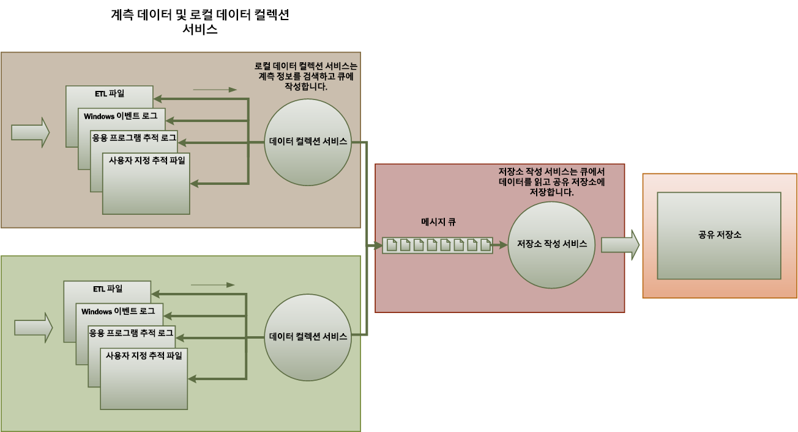
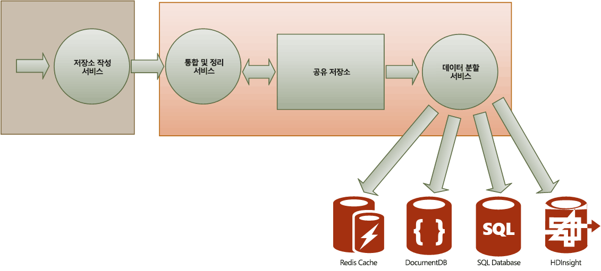

# <a name="monitoring-and-diagnostics"></a><span data-ttu-id="3947c-103">모니터링 및 진단</span><span class="sxs-lookup"><span data-stu-id="3947c-103">Monitoring and diagnostics</span></span>
[!INCLUDE [header](../_includes/header.md)]

<span data-ttu-id="3947c-104">클라우드에서 실행되는 분산 응용 프로그램 및 서비스는 특성상, 많은 이동 부분으로 구성되는 복잡한 소프트웨어입니다.</span><span class="sxs-lookup"><span data-stu-id="3947c-104">Distributed applications and services running in the cloud are, by their nature, complex pieces of software that comprise many moving parts.</span></span> <span data-ttu-id="3947c-105">프로덕션 환경에서는 사용자가 시스템을 활용하는 방식과 리소스 사용률을 추적하고, 시스템의 상태 및 성능을 전반적으로 모니터링할 수 있어야 합니다.</span><span class="sxs-lookup"><span data-stu-id="3947c-105">In a production environment, it's important to be able to track the way in which users utilize your system, trace resource utilization, and generally monitor the health and performance of your system.</span></span> <span data-ttu-id="3947c-106">이 정보를 진단 보조 기능으로 사용하여 문제를 검색하고 수정할 수 있으며 잠재적 문제를 발견하여 이 문제가 발생하지 않도록 할 수도 있습니다.</span><span class="sxs-lookup"><span data-stu-id="3947c-106">You can use this information as a diagnostic aid to detect and correct issues, and also to help spot potential problems and prevent them from occurring.</span></span>

## <a name="monitoring-and-diagnostics-scenarios"></a><span data-ttu-id="3947c-107">모니터링 및 진단 시나리오</span><span class="sxs-lookup"><span data-stu-id="3947c-107">Monitoring and diagnostics scenarios</span></span>
<span data-ttu-id="3947c-108">모니터링을 사용하여 시스템이 잘 작동하는지 파악할 수 있습니다.</span><span class="sxs-lookup"><span data-stu-id="3947c-108">You can use monitoring to gain an insight into how well a system is functioning.</span></span> <span data-ttu-id="3947c-109">모니터링은 서비스 품질 대상 유지 관리의 중요한 부분입니다.</span><span class="sxs-lookup"><span data-stu-id="3947c-109">Monitoring is a crucial part of maintaining quality-of-service targets.</span></span> <span data-ttu-id="3947c-110">모니터링 데이터를 수집하는 일반적인 시나리오는 다음과 같습니다.</span><span class="sxs-lookup"><span data-stu-id="3947c-110">Common scenarios for collecting monitoring data include:</span></span>

* <span data-ttu-id="3947c-111">시스템이 정상 상태를 유지하도록 보장합니다.</span><span class="sxs-lookup"><span data-stu-id="3947c-111">Ensuring that the system remains healthy.</span></span>
* <span data-ttu-id="3947c-112">시스템 및 구성 요소의 가용성을 추적합니다.</span><span class="sxs-lookup"><span data-stu-id="3947c-112">Tracking the availability of the system and its component elements.</span></span>
* <span data-ttu-id="3947c-113">작업 볼륨이 증가함에 따라 시스템의 처리량이 예기치 않게 저하되지 않도록 성능을 유지 관리합니다.</span><span class="sxs-lookup"><span data-stu-id="3947c-113">Maintaining performance to ensure that the throughput of the system does not degrade unexpectedly as the volume of work increases.</span></span>
* <span data-ttu-id="3947c-114">시스템이 고객과 합의된 모든 SLA(서비스 수준 계약)를 충족하도록 보장합니다.</span><span class="sxs-lookup"><span data-stu-id="3947c-114">Guaranteeing that the system meets any service-level agreements (SLAs) established with customers.</span></span>
* <span data-ttu-id="3947c-115">개인 정보를 보호하고 시스템, 사용자 및 해당 데이터의 보안을 보장합니다.</span><span class="sxs-lookup"><span data-stu-id="3947c-115">Protecting the privacy and security of the system, users, and their data.</span></span>
* <span data-ttu-id="3947c-116">감사 또는 규제 목적으로 수행되는 작업을 추적합니다.</span><span class="sxs-lookup"><span data-stu-id="3947c-116">Tracking the operations that are performed for auditing or regulatory purposes.</span></span>
* <span data-ttu-id="3947c-117">시스템의 일상 사용량을 모니터링하고 해결하지 않을 경우 문제로 발생할 수 있는 추세를 발견합니다.</span><span class="sxs-lookup"><span data-stu-id="3947c-117">Monitoring the day-to-day usage of the system and spotting trends that might lead to problems if they're not addressed.</span></span>
* <span data-ttu-id="3947c-118">초기 보고서 및 가능한 원인, 수정, 후속 소프트웨어 업데이트, 배포 등에 대한 분석에서 발생한 문제를 추적합니다.</span><span class="sxs-lookup"><span data-stu-id="3947c-118">Tracking issues that occur, from initial report through to analysis of possible causes, rectification, consequent software updates, and deployment.</span></span>
* <span data-ttu-id="3947c-119">작업을 추적하고 소프트웨어 릴리스를 디버그합니다.</span><span class="sxs-lookup"><span data-stu-id="3947c-119">Tracing operations and debugging software releases.</span></span>

> [!NOTE]
> <span data-ttu-id="3947c-120">이 목록은 포괄적이지 않습니다.</span><span class="sxs-lookup"><span data-stu-id="3947c-120">This list is not intended to be comprehensive.</span></span> <span data-ttu-id="3947c-121">이 문서는 모니터링을 수행할 가장 일반적인 상황인 이러한 시나리오에 초점을 맞춥니다.</span><span class="sxs-lookup"><span data-stu-id="3947c-121">This document focuses on these scenarios as the most common situations for performing monitoring.</span></span> <span data-ttu-id="3947c-122">일반적이지 않거나 사용자 환경에 따른 다른 시나리오가 있을 수 있습니다.</span><span class="sxs-lookup"><span data-stu-id="3947c-122">There might be others that are less common or are specific to your environment.</span></span>
> 
> 

<span data-ttu-id="3947c-123">다음 섹션에서는 이러한 시나리오를 자세히 설명합니다.</span><span class="sxs-lookup"><span data-stu-id="3947c-123">The following sections describe these scenarios in more detail.</span></span> <span data-ttu-id="3947c-124">각 시나리오에 대한 정보는 다음과 같은 형식으로 설명합니다.</span><span class="sxs-lookup"><span data-stu-id="3947c-124">The information for each scenario is discussed in the following format:</span></span>

1. <span data-ttu-id="3947c-125">시나리오에 대한 간략한 개요</span><span class="sxs-lookup"><span data-stu-id="3947c-125">A brief overview of the scenario</span></span>
2. <span data-ttu-id="3947c-126">이 시나리오의 일반적인 요구 사항</span><span class="sxs-lookup"><span data-stu-id="3947c-126">The typical requirements of this scenario</span></span>
3. <span data-ttu-id="3947c-127">시나리오를 지원하는 데 필요한 원시 계측 데이터 및 이러한 정보의 가능한 출처</span><span class="sxs-lookup"><span data-stu-id="3947c-127">The raw instrumentation data that's required to support the scenario, and possible sources of this information</span></span>
4. <span data-ttu-id="3947c-128">이 원시 데이터를 분석 및 결합하여 유의미한 진단 정보를 생성할 수 있는 방법</span><span class="sxs-lookup"><span data-stu-id="3947c-128">How this raw data can be analyzed and combined to generate meaningful diagnostic information</span></span>

## <a name="health-monitoring"></a><span data-ttu-id="3947c-129">상태 모니터링</span><span class="sxs-lookup"><span data-stu-id="3947c-129">Health monitoring</span></span>
<span data-ttu-id="3947c-130">시스템이 실행 중이며 요청을 처리할 수 있는 경우 시스템의 상태는 정상입니다.</span><span class="sxs-lookup"><span data-stu-id="3947c-130">A system is healthy if it is running and capable of processing requests.</span></span> <span data-ttu-id="3947c-131">상태 모니터링의 목적은 시스템의 모든 구성 요소가 예상대로 작동하는지 확인할 수 있도록 시스템의 현재 상태에 대한 스냅숏을 생성하는 것입니다.</span><span class="sxs-lookup"><span data-stu-id="3947c-131">The purpose of health monitoring is to generate a snapshot of the current health of the system so that you can verify that all components of the system are functioning as expected.</span></span>

### <a name="requirements-for-health-monitoring"></a><span data-ttu-id="3947c-132">상태 모니터링을 위한 요구 사항</span><span class="sxs-lookup"><span data-stu-id="3947c-132">Requirements for health monitoring</span></span>
<span data-ttu-id="3947c-133">시스템의 특정 부분의 상태가 정상이 아닌 것으로 간주되는 경우 신속하게(몇 초 안에) 운영자가 경고를 받아야 합니다.</span><span class="sxs-lookup"><span data-stu-id="3947c-133">An operator should be alerted quickly (within a matter of seconds) if any part of the system is deemed to be unhealthy.</span></span> <span data-ttu-id="3947c-134">운영자는 시스템에서 정상적으로 작동하고 있는 부분과 문제가 있는 분을 확인할 수 있어야 합니다.</span><span class="sxs-lookup"><span data-stu-id="3947c-134">The operator should be able to ascertain which parts of the system are functioning normally, and which parts are experiencing problems.</span></span> <span data-ttu-id="3947c-135">신호등 시스템을 통해 시스템 상태를 강조 표시할 수 있습니다.</span><span class="sxs-lookup"><span data-stu-id="3947c-135">System health can be highlighted through a traffic-light system:</span></span>

* <span data-ttu-id="3947c-136">비정상(시스템이 중지됨)이면 빨간색</span><span class="sxs-lookup"><span data-stu-id="3947c-136">Red for unhealthy (the system has stopped)</span></span>
* <span data-ttu-id="3947c-137">부분적으로 정상(시스템이 실행되지만 기능이 축소됨)이면 노란색</span><span class="sxs-lookup"><span data-stu-id="3947c-137">Yellow for partially healthy (the system is running with reduced functionality)</span></span>
* <span data-ttu-id="3947c-138">완전히 정상이면 녹색</span><span class="sxs-lookup"><span data-stu-id="3947c-138">Green for completely healthy</span></span>

<span data-ttu-id="3947c-139">포괄적인 상태 모니터링 시스템을 통해 운영자는 시스템을 드릴다운하여 하위 시스템 및 구성 요소의 상태를 볼 수 있습니다.</span><span class="sxs-lookup"><span data-stu-id="3947c-139">A comprehensive health-monitoring system enables an operator to drill down through the system to view the health status of subsystems and components.</span></span> <span data-ttu-id="3947c-140">예를 들어 전체 시스템이 부분적으로 정상인 것으로 표시되는 경우 운영자는 자세히 조사하여 현재 사용할 수 없는 기능을 확인할 수 있어야 합니다.</span><span class="sxs-lookup"><span data-stu-id="3947c-140">For example, if the overall system is depicted as partially healthy, the operator should be able to zoom in and determine which functionality is currently unavailable.</span></span>

### <a name="data-sources-instrumentation-and-data-collection-requirements"></a><span data-ttu-id="3947c-141">데이터 소스, 계측 및 데이터 수집 요구 사항</span><span class="sxs-lookup"><span data-stu-id="3947c-141">Data sources, instrumentation, and data-collection requirements</span></span>
<span data-ttu-id="3947c-142">상태 모니터링을 지원하는 데 필요한 원시 데이터는 다음의 결과로 생성될 수 있습니다.</span><span class="sxs-lookup"><span data-stu-id="3947c-142">The raw data that's required to support health monitoring can be generated as a result of:</span></span>

* <span data-ttu-id="3947c-143">사용자 요청 실행 추적</span><span class="sxs-lookup"><span data-stu-id="3947c-143">Tracing execution of user requests.</span></span> <span data-ttu-id="3947c-144">이 정보를 사용하여 성공한 요청, 실패한 요청 및 각 요청에 걸리는 시간을 확인할 수 있습니다.</span><span class="sxs-lookup"><span data-stu-id="3947c-144">This information can be used to determine which requests have succeeded, which have failed, and how long each request takes.</span></span>
* <span data-ttu-id="3947c-145">가상 사용자 모니터링.</span><span class="sxs-lookup"><span data-stu-id="3947c-145">Synthetic user monitoring.</span></span> <span data-ttu-id="3947c-146">이 프로세스는 사용자가 수행한 단계를 시뮬레이션하고 미리 정의된 일련의 단계를 따릅니다.</span><span class="sxs-lookup"><span data-stu-id="3947c-146">This process simulates the steps performed by a user and follows a predefined series of steps.</span></span> <span data-ttu-id="3947c-147">각 단계의 결과를 캡처해야 합니다.</span><span class="sxs-lookup"><span data-stu-id="3947c-147">The results of each step should be captured.</span></span>
* <span data-ttu-id="3947c-148">예외, 장애 및 경고 기록</span><span class="sxs-lookup"><span data-stu-id="3947c-148">Logging exceptions, faults, and warnings.</span></span> <span data-ttu-id="3947c-149">이 정보는 응용 프로그램 코드에 포함된 추적 문의 결과로 캡처할 수 있고 시스템에서 참조하는 서비스의 이벤트 로그에서 정보를 검색하여 캡처할 수도 있습니다.</span><span class="sxs-lookup"><span data-stu-id="3947c-149">This information can be captured as a result of trace statements embedded into the application code, as well as retrieving information from the event logs of any services that the system references.</span></span>
* <span data-ttu-id="3947c-150">시스템에서 사용하는 타사 서비스의 상태를 모니터링합니다.</span><span class="sxs-lookup"><span data-stu-id="3947c-150">Monitoring the health of any third-party services that the system uses.</span></span> <span data-ttu-id="3947c-151">이 모니터링을 위해 이러한 서비스가 제공하는 상태 데이터를 검색하고 구문 분석해야 할 수 있습니다.</span><span class="sxs-lookup"><span data-stu-id="3947c-151">This monitoring might require retrieving and parsing health data that these services supply.</span></span> <span data-ttu-id="3947c-152">이 정보는 다양한 형식을 취할 수 있습니다.</span><span class="sxs-lookup"><span data-stu-id="3947c-152">This information might take a variety of formats.</span></span>
* <span data-ttu-id="3947c-153">끝점 모니터링.</span><span class="sxs-lookup"><span data-stu-id="3947c-153">Endpoint monitoring.</span></span> <span data-ttu-id="3947c-154">이 메커니즘에 대해서는 "가용성 모니터링" 섹션에서 자세히 설명합니다.</span><span class="sxs-lookup"><span data-stu-id="3947c-154">This mechanism is described in more detail in the "Availability monitoring" section.</span></span>
* <span data-ttu-id="3947c-155">백그라운드 CPU 사용률 또는 I/O(네트워크 포함) 활동과 같은 주변 성능 정보 수집</span><span class="sxs-lookup"><span data-stu-id="3947c-155">Collecting ambient performance information, such as background CPU utilization or I/O (including network) activity.</span></span>

### <a name="analyzing-health-data"></a><span data-ttu-id="3947c-156">상태 데이터 분석</span><span class="sxs-lookup"><span data-stu-id="3947c-156">Analyzing health data</span></span>
<span data-ttu-id="3947c-157">상태 모니터링의 주요 초점은 시스템이 실행 중인지 여부를 신속하게 나타내는 것입니다.</span><span class="sxs-lookup"><span data-stu-id="3947c-157">The primary focus of health monitoring is to quickly indicate whether the system is running.</span></span> <span data-ttu-id="3947c-158">중요한 구성 요소의 상태가 비정상으로 검색되는 경우 즉시 데이터에 대한 핫 분석이 경고를 트리거할 수 있습니다.</span><span class="sxs-lookup"><span data-stu-id="3947c-158">Hot analysis of the immediate data can trigger an alert if a critical component is detected as unhealthy.</span></span> <span data-ttu-id="3947c-159">예를 들어 연속된 일련의 ping에 응답하지 않는 경우가 있습니다. 그러면 운영자는 적절한 정정 작업을 할 수 있습니다.</span><span class="sxs-lookup"><span data-stu-id="3947c-159">(It fails to respond to a consecutive series of pings, for example.) The operator can then take the appropriate corrective action.</span></span>

<span data-ttu-id="3947c-160">고급 시스템에는 최근 및 현재 워크로드에 대한 콜드 분석을 수행하는 예측 요소가 포함될 수 있습니다.</span><span class="sxs-lookup"><span data-stu-id="3947c-160">A more advanced system might include a predictive element that performs a cold analysis over recent and current workloads.</span></span> <span data-ttu-id="3947c-161">콜드 분석은 추세를 발견하고 시스템의 정상 상태가 유지될지 아니면 추가 리소스가 필요할지 여부를 결정합니다.</span><span class="sxs-lookup"><span data-stu-id="3947c-161">A cold analysis can spot trends and determine whether the system is likely to remain healthy or whether the system will need additional resources.</span></span> <span data-ttu-id="3947c-162">이 예측 요소는 다음과 같은 중요 성능 메트릭을 기반으로 해야 합니다.</span><span class="sxs-lookup"><span data-stu-id="3947c-162">This predictive element should be based on critical performance metrics, such as:</span></span>

* <span data-ttu-id="3947c-163">각 서비스 또는 하위 시스템으로 전달되는 요청의 비율입니다.</span><span class="sxs-lookup"><span data-stu-id="3947c-163">The rate of requests directed at each service or subsystem.</span></span>
* <span data-ttu-id="3947c-164">이러한 요청의 응답 시간입니다.</span><span class="sxs-lookup"><span data-stu-id="3947c-164">The response times of these requests.</span></span>
* <span data-ttu-id="3947c-165">각 서비스에 대해 유입되거나 유출되는 데이터의 양입니다.</span><span class="sxs-lookup"><span data-stu-id="3947c-165">The volume of data flowing into and out of each service.</span></span>

<span data-ttu-id="3947c-166">메트릭의 값이 정의된 임계값을 초과하는 경우 시스템에서는 운영자나 크기 자동 조정 기능(사용할 수 있는 경우)이 시스템 상태 유지에 필요한 예방 조치를 취할 수 있도록 경고를 발생시킬 수 있습니다.</span><span class="sxs-lookup"><span data-stu-id="3947c-166">If the value of any metric exceeds a defined threshold, the system can raise an alert to enable an operator or autoscaling (if available) to take the preventative actions necessary to maintain system health.</span></span> <span data-ttu-id="3947c-167">이러한 조치에는 리소스를 추가하거나, 장애가 발생한 하나 이상의 서비스를 다시 시작하거나, 우선 순위가 낮은 요청에 제한을 적용하는 작업 등이 포함될 수 있습니다.</span><span class="sxs-lookup"><span data-stu-id="3947c-167">These actions might involve adding resources, restarting one or more services that are failing, or applying throttling to lower-priority requests.</span></span>

## <a name="availability-monitoring"></a><span data-ttu-id="3947c-168">가용성 모니터링</span><span class="sxs-lookup"><span data-stu-id="3947c-168">Availability monitoring</span></span>
<span data-ttu-id="3947c-169">시스템이 진정으로 정상 상태가 되려면 시스템을 구성하는 구성 요소 및 하위 시스템이 사용 가능해야 합니다.</span><span class="sxs-lookup"><span data-stu-id="3947c-169">A truly healthy system requires that the components and subsystems that compose the system are available.</span></span> <span data-ttu-id="3947c-170">가용성 모니터링은 상태 모니터링과 밀접하게 관련됩니다.</span><span class="sxs-lookup"><span data-stu-id="3947c-170">Availability monitoring is closely related to health monitoring.</span></span> <span data-ttu-id="3947c-171">하지만 상태 모니터링은 시스템 현재 상태를 즉시 보여 주고 가용성 모니터링은 시스템 및 구성 요소의 가용성을 추적하여 시스템 작동 시간 관련 통계를 생성할 수 있습니다.</span><span class="sxs-lookup"><span data-stu-id="3947c-171">But whereas health monitoring provides an immediate view of the current health of the system, availability monitoring is concerned with tracking the availability of the system and its components to generate statistics about the uptime of the system.</span></span>

<span data-ttu-id="3947c-172">많은 시스템에서 예를 들어 데이터베이스와 같은 일부 구성 요소는 중복성이 기본적으로 제공되어 심각한 장애가 발생하거나 연결이 끊어지는 경우 신속한 장애 조치(failover)가 가능하도록 구성되었습니다.</span><span class="sxs-lookup"><span data-stu-id="3947c-172">In many systems, some components (such as a database) are configured with built-in redundancy to permit rapid failover in the event of a serious fault or loss of connectivity.</span></span> <span data-ttu-id="3947c-173">사용자가 이러한 장애가 발생한 것을 인식하지 못하는 것이 가장 좋지만</span><span class="sxs-lookup"><span data-stu-id="3947c-173">Ideally, users should not be aware that such a failure has occurred.</span></span> <span data-ttu-id="3947c-174">가용성 모니터링 측면에서 원인을 확인하고 재발을 방지하기 위한 교정 조치를 취하기 위해 최대한 많은 장애 관련 정보를 수집해야 합니다.</span><span class="sxs-lookup"><span data-stu-id="3947c-174">But from an availability monitoring perspective, it's necessary to gather as much information as possible about such failures to determine the cause and take corrective actions to prevent them from recurring.</span></span>

<span data-ttu-id="3947c-175">가용성을 추적하는 데 필요한 데이터는 다양한 하위 수준 요소에 따라 달라질 수 있습니다.</span><span class="sxs-lookup"><span data-stu-id="3947c-175">The data that's required to track availability might depend on a number of lower-level factors.</span></span> <span data-ttu-id="3947c-176">이러한 많은 요소는 응용 프로그램, 시스템 및 환경과 관련될 수 있습니다.</span><span class="sxs-lookup"><span data-stu-id="3947c-176">Many of these factors might be specific to the application, system, and environment.</span></span> <span data-ttu-id="3947c-177">효과적인 모니터링 시스템은 이러한 하위 수준 요소에 해당하는 가용성 데이터를 캡처하고 집계하여 시스템의 전반적인 상태를 알려줍니다.</span><span class="sxs-lookup"><span data-stu-id="3947c-177">An effective monitoring system captures the availability data that corresponds to these low-level factors and then aggregates them to give an overall picture of the system.</span></span> <span data-ttu-id="3947c-178">예를 들어 전자 상거래 시스템에서 고객이 주문할 수 있도록 하는 비즈니스 기능은 주문 세부 정보가 저장되는 리포지토리 및 주문 대금 결제를 위해 화폐 거래를 처리하는 결제 시스템에 종속될 수 있습니다.</span><span class="sxs-lookup"><span data-stu-id="3947c-178">For example, in an e-commerce system, the business functionality that enables a customer to place orders might depend on the repository where order details are stored and the payment system that handles the monetary transactions for paying for these orders.</span></span> <span data-ttu-id="3947c-179">따라서 시스템에서 주문하는 부분의 가용성은 해당 리포지토리 및 결제 하위 시스템 기능의 가용성입니다.</span><span class="sxs-lookup"><span data-stu-id="3947c-179">The availability of the order-placement part of the system is therefore a function of the availability of the repository and the payment subsystem.</span></span>

### <a name="requirements-for-availability-monitoring"></a><span data-ttu-id="3947c-180">가용성 모니터링을 위한 요구 사항</span><span class="sxs-lookup"><span data-stu-id="3947c-180">Requirements for availability monitoring</span></span>
<span data-ttu-id="3947c-181">운영자는 또한 각 시스템 및 하위 시스템의 가용성 기록을 보고 이 정보를 이용하여 하나 이상의 하위 시스템에서 주기적으로 장애가 발생하는 원인이 될 수 있는 추세를 발견할 수 있어야 합니다.</span><span class="sxs-lookup"><span data-stu-id="3947c-181">An operator should also be able to view the historical availability of each system and subsystem, and use this information to spot any trends that might cause one or more subsystems to periodically fail.</span></span> <span data-ttu-id="3947c-182">예를 들어 하루 중 처리량이 가장 많은 특정 시간대에 서비스 장애가 발생하는지 확인합니다.</span><span class="sxs-lookup"><span data-stu-id="3947c-182">(Do services start to fail at a particular time of day that corresponds to peak processing hours?)</span></span>

<span data-ttu-id="3947c-183">모니터링 솔루션은 각 하위 시스템의 가용성 또는 비가용성에 대한 즉시 보기 및 기록 보기를 제공해야 합니다.</span><span class="sxs-lookup"><span data-stu-id="3947c-183">A monitoring solution should provide an immediate and historical view of the availability or unavailability of each subsystem.</span></span> <span data-ttu-id="3947c-184">또한 하나 이상의 서비스가 실패하거나 사용자가 서비스에 연결할 수 없을 때 신속하게 운영자에게 경고를 보낼 수 있어야 합니다.</span><span class="sxs-lookup"><span data-stu-id="3947c-184">It should also be capable of quickly alerting an operator when one or more services fail or when users can't connect to services.</span></span> <span data-ttu-id="3947c-185">이렇게 되려면 각 서비스를 모니터링하는 것뿐만 아니라 서비스와 통신하려고 시도할 때 각 사용자가 수행하는 작업이 실패하는 경우 해당 작업을 검사하는 것도 포함됩니다.</span><span class="sxs-lookup"><span data-stu-id="3947c-185">This is a matter of not only monitoring each service, but also examining the actions that each user performs if these actions fail when they attempt to communicate with a service.</span></span> <span data-ttu-id="3947c-186">어느 정도까지는, 특정 수준의 연결 장애는 정상이며 일시적인 오류가 원인일 수 있습니다.</span><span class="sxs-lookup"><span data-stu-id="3947c-186">To some extent, a degree of connectivity failure is normal and might be due to transient errors.</span></span> <span data-ttu-id="3947c-187">하지만 시스템에서 특정 기간 동안 지정된 하위 시스템에 대한 연결 장애가 발생한 횟수에 대해 경고를 발생시킬 수 있게 하면 유용할 수 있습니다.</span><span class="sxs-lookup"><span data-stu-id="3947c-187">But it might be useful to allow the system to raise an alert for the number of connectivity failures to a specified subsystem that occur during a specific period.</span></span>

### <a name="data-sources-instrumentation-and-data-collection-requirements"></a><span data-ttu-id="3947c-188">데이터 소스, 계측 및 데이터 수집 요구 사항</span><span class="sxs-lookup"><span data-stu-id="3947c-188">Data sources, instrumentation, and data-collection requirements</span></span>
<span data-ttu-id="3947c-189">상태 모니터링의 경우와 마찬가지로 가용성 모니터링을 지원하는 데 필요한 원시 데이터는 가상 사용자 모니터링 및 예외, 장애, 경고 기록의 결과로 생성될 수 있습니다.</span><span class="sxs-lookup"><span data-stu-id="3947c-189">As with health monitoring, the raw data that's required to support availability monitoring can be generated as a result of synthetic user monitoring and logging any exceptions, faults, and warnings that might occur.</span></span> <span data-ttu-id="3947c-190">또한 끝점 모니터링을 수행하여 가용성 데이터를 가져올 수도 있습니다.</span><span class="sxs-lookup"><span data-stu-id="3947c-190">In addition, availability data can be obtained from performing endpoint monitoring.</span></span> <span data-ttu-id="3947c-191">응용 프로그램은 각각이 시스템 내의 기능 영역에 대한 액세스를 테스트하는 상태 끝점을 하나 이상 노출할 수 있습니다.</span><span class="sxs-lookup"><span data-stu-id="3947c-191">The application can expose one or more health endpoints, each testing access to a functional area within the system.</span></span> <span data-ttu-id="3947c-192">모니터링 시스템은 정의된 일정에 따라 각 끝점을 ping하고 결과(성공 또는 실패)를 수집할 수 있습니다.</span><span class="sxs-lookup"><span data-stu-id="3947c-192">The monitoring system can ping each endpoint by following a defined schedule and collect the results (success or fail).</span></span>

<span data-ttu-id="3947c-193">모든 시간 제한, 네트워크 연결 실패 및 연결 재시도가 기록되어야 합니다.</span><span class="sxs-lookup"><span data-stu-id="3947c-193">All timeouts, network connectivity failures, and connection retry attempts must be recorded.</span></span> <span data-ttu-id="3947c-194">모든 데이터에 타임스탬프를 지정해야 합니다.</span><span class="sxs-lookup"><span data-stu-id="3947c-194">All data should be time-stamped.</span></span>

<a name="analyzing-availability-data"></a>

### <a name="analyzing-availability-data"></a><span data-ttu-id="3947c-195">가용성 데이터 분석</span><span class="sxs-lookup"><span data-stu-id="3947c-195">Analyzing availability data</span></span>
<span data-ttu-id="3947c-196">다음 유형의 분석을 지원하려면 계측 데이터를 집계하고 서로 연관지어야 합니다.</span><span class="sxs-lookup"><span data-stu-id="3947c-196">The instrumentation data must be aggregated and correlated to support the following types of analysis:</span></span>

* <span data-ttu-id="3947c-197">시스템 및 하위 시스템의 즉각적인 가용성</span><span class="sxs-lookup"><span data-stu-id="3947c-197">The immediate availability of the system and subsystems.</span></span>
* <span data-ttu-id="3947c-198">시스템 및 하위 시스템의 가용성 실패율.</span><span class="sxs-lookup"><span data-stu-id="3947c-198">The availability failure rates of the system and subsystems.</span></span> <span data-ttu-id="3947c-199">운영자가 장애와 특정 활동을 서로 연관 짓는 것(시스템 장애 시 어떤 상황이었는지 확인하는 것)이 가장 좋습니다.</span><span class="sxs-lookup"><span data-stu-id="3947c-199">Ideally, an operator should be able to correlate failures with specific activities: what was happening when the system failed?</span></span>
* <span data-ttu-id="3947c-200">지정된 기간 동안 시스템 또는 하위 시스템의 실패율 및 장애 발생 시점의 시스템 로드(예: 사용자 요청 개수) 등에 대한 기록 보기</span><span class="sxs-lookup"><span data-stu-id="3947c-200">A historical view of failure rates of the system or any subsystems across any specified period, and the load on the system (number of user requests, for example) when a failure occurred.</span></span>
* <span data-ttu-id="3947c-201">시스템 또는 하위 시스템을 사용할 수 없는 이유.</span><span class="sxs-lookup"><span data-stu-id="3947c-201">The reasons for unavailability of the system or any subsystems.</span></span> <span data-ttu-id="3947c-202">예를 들어 그 이유는 서비스가 실행되지 않거나, 연결이 끊어지거나, 연결되었지만 시간이 초과했거나, 연결되었지만 오류가 반환되었기 때문일 수 있습니다.</span><span class="sxs-lookup"><span data-stu-id="3947c-202">For example, the reasons might be service not running, connectivity lost, connected but timing out, and connected but returning errors.</span></span>

<span data-ttu-id="3947c-203">다음 수식을 사용하여 일정 기간에 대한 서비스 가용률을 계산할 수 있습니다.</span><span class="sxs-lookup"><span data-stu-id="3947c-203">You can calculate the percentage availability of a service over a period of time by using the following formula:</span></span>

```
%Availability =  ((Total Time – Total Downtime) / Total Time ) * 100
```

<span data-ttu-id="3947c-204">이는 SLA 용도로 유용합니다.</span><span class="sxs-lookup"><span data-stu-id="3947c-204">This is useful for SLA purposes.</span></span> <span data-ttu-id="3947c-205">[SLA 모니터링](#SLA-monitoring)에 대해서는 이 가이드 뒷부분에서 자세히 설명합니다. *가동 중지 시간*의 정의는 서비스에 따라 다릅니다.</span><span class="sxs-lookup"><span data-stu-id="3947c-205">([SLA monitoring](#SLA-monitoring) is described in more detail later in this guidance.) The definition of *downtime* depends on the service.</span></span> <span data-ttu-id="3947c-206">예를 들어 Visual Studio Team Services 빌드 서비스는 가동 중지 시간을 정의하며 이는 빌드 서비스를 사용할 수 없는 총 누적 시간(분)입니다.</span><span class="sxs-lookup"><span data-stu-id="3947c-206">For example, Visual Studio Team Services Build Service defines downtime as the period (total accumulated minutes) during which Build Service is unavailable.</span></span> <span data-ttu-id="3947c-207">1분 내내 고객이 시작한 작업을 수행하기 위한, 빌드 서비스에 대한 모든 연속 HTTP 요청이 오류 코드를 발생시키거나 응답을 반환하지 않는 경우 해당 시간(분)을 사용할 수 없는 것으로 간주합니다.</span><span class="sxs-lookup"><span data-stu-id="3947c-207">A minute is considered unavailable if all continuous HTTP requests to Build Service to perform customer-initiated operations throughout the minute either result in an error code or do not return a response.</span></span>

## <a name="performance-monitoring"></a><span data-ttu-id="3947c-208">성능 모니터링</span><span class="sxs-lookup"><span data-stu-id="3947c-208">Performance monitoring</span></span>
<span data-ttu-id="3947c-209">사용자 수가 증가하여 시스템에 부하가 점점 커지면 이러한 사용자가 액세스하는 데이터 집합의 크기가 커지고 하나 이상의 구성 요소에서 장애가 발생할 가능성이 높아집니다.</span><span class="sxs-lookup"><span data-stu-id="3947c-209">As the system is placed under more and more stress (by increasing the volume of users), the size of the datasets that these users access grows and the possibility of failure of one or more components becomes more likely.</span></span> <span data-ttu-id="3947c-210">대부분의 경우 구성 요소 오류가 발생하기 전에 성능이 저하됩니다.</span><span class="sxs-lookup"><span data-stu-id="3947c-210">Frequently, component failure is preceded by a decrease in performance.</span></span> <span data-ttu-id="3947c-211">이러한 저하를 검색할 수 있는 경우 상황을 해결하기 위한 사전 대응적인 조치를 취할 수 있습니다.</span><span class="sxs-lookup"><span data-stu-id="3947c-211">If you're able detect such a decrease, you can take proactive steps to remedy the situation.</span></span>

<span data-ttu-id="3947c-212">시스템 성능은 다양한 요소에 따라 달라집니다.</span><span class="sxs-lookup"><span data-stu-id="3947c-212">System performance depends on a number of factors.</span></span> <span data-ttu-id="3947c-213">각 요소는 일반적으로 초당 데이터베이스 트랜잭션 수 또는 지정된 시간 프레임 내에 성공적으로 처리된 네트워크 요청의 볼륨과 같은 KPI(핵심 성과 지표)를 통해 측정됩니다.</span><span class="sxs-lookup"><span data-stu-id="3947c-213">Each factor is typically measured through key performance indicators (KPIs), such as the number of database transactions per second or the volume of network requests that are successfully serviced in a specified time frame.</span></span> <span data-ttu-id="3947c-214">이러한 KPI 중 일부는 다른 메트릭의 조합에서 파생될 수 있지만 특정 성능 척도로 사용할 수 있습니다.</span><span class="sxs-lookup"><span data-stu-id="3947c-214">Some of these KPIs might be available as specific performance measures, whereas others might be derived from a combination of metrics.</span></span>

> [!NOTE]
> <span data-ttu-id="3947c-215">성능이 낮은지 양호한지 결정하려면 시스템이 실행할 수 있어야 하는 성능의 수준을 이해해야 합니다.</span><span class="sxs-lookup"><span data-stu-id="3947c-215">Determining poor or good performance requires that you understand the level of performance at which the system should be capable of running.</span></span> <span data-ttu-id="3947c-216">이렇게 하려면 시스템이 일반적인 부하 상태에서 작동하는 동안 시스템을 관찰하고 일정 기간 동안 각 KPI에 대한 데이터를 캡처해야 합니다.</span><span class="sxs-lookup"><span data-stu-id="3947c-216">This requires observing the system while it's functioning under a typical load and capturing the data for each KPI over a period of time.</span></span> <span data-ttu-id="3947c-217">그러려면 테스트 환경의 시뮬레이트된 부하 상태에서 시스템을 실행하고 시스템을 프로덕션 환경에 배포하기 전에 적절한 데이터를 수집해야 합니다.</span><span class="sxs-lookup"><span data-stu-id="3947c-217">This might involve running the system under a simulated load in a test environment and gathering the appropriate data before deploying the system to a production environment.</span></span>
> 
> <span data-ttu-id="3947c-218">또한 성능을 목적으로 한 모니터링이 시스템에 부담이 되지 않도록 해야 합니다.</span><span class="sxs-lookup"><span data-stu-id="3947c-218">You should also ensure that monitoring for performance purposes does not become a burden on the system.</span></span> <span data-ttu-id="3947c-219">성능 모니터링 프로세스가 수집하는 데이터에 대한 세부 수준을 동적으로 조정할 수 있습니다.</span><span class="sxs-lookup"><span data-stu-id="3947c-219">You might be able to dynamically adjust the level of detail for the data that the performance monitoring process gathers.</span></span>
> 
> 

### <a name="requirements-for-performance-monitoring"></a><span data-ttu-id="3947c-220">성능 모니터링을 위한 요구 사항</span><span class="sxs-lookup"><span data-stu-id="3947c-220">Requirements for performance monitoring</span></span>
<span data-ttu-id="3947c-221">시스템 성능을 검사하려면 운영자가 일반적으로 다음을 포함하는 정보를 확인할 수 있어야 합니다.</span><span class="sxs-lookup"><span data-stu-id="3947c-221">To examine system performance, an operator typically needs to see information that includes:</span></span>

* <span data-ttu-id="3947c-222">사용자 요청에 대한 응답률</span><span class="sxs-lookup"><span data-stu-id="3947c-222">The response rates for user requests.</span></span>
* <span data-ttu-id="3947c-223">동시 사용자 요청 수</span><span class="sxs-lookup"><span data-stu-id="3947c-223">The number of concurrent user requests.</span></span>
* <span data-ttu-id="3947c-224">네트워크 트래픽 볼륨</span><span class="sxs-lookup"><span data-stu-id="3947c-224">The volume of network traffic.</span></span>
* <span data-ttu-id="3947c-225">비즈니스 트랜잭션이 완료되는 비율</span><span class="sxs-lookup"><span data-stu-id="3947c-225">The rates at which business transactions are being completed.</span></span>
* <span data-ttu-id="3947c-226">요청에 대한 평균 처리 시간</span><span class="sxs-lookup"><span data-stu-id="3947c-226">The average processing time for requests.</span></span>

<span data-ttu-id="3947c-227">운영자가 다음과 같은 상관 관계를 발견할 수 있도록 도구를 제공하면 유용할 수 있습니다.</span><span class="sxs-lookup"><span data-stu-id="3947c-227">It can also be helpful to provide tools that enable an operator to help spot correlations, such as:</span></span>

* <span data-ttu-id="3947c-228">동시 사용자 수와 요청 대기 시간(사용자가 요청을 보낸 후 요청 처리가 시작될 때까지 걸리는 시간) 비교</span><span class="sxs-lookup"><span data-stu-id="3947c-228">The number of concurrent users versus request latency times (how long it takes to start processing a request after the user has sent it).</span></span>
* <span data-ttu-id="3947c-229">동시 사용자 수와 평균 응답 시간(요청 처리가 시작된 후 완료될 때까지 걸리는 시간) 비교</span><span class="sxs-lookup"><span data-stu-id="3947c-229">The number of concurrent users versus the average response time (how long it takes to complete a request after it has started processing).</span></span>
* <span data-ttu-id="3947c-230">요청의 양과 처리 오류 수 비교</span><span class="sxs-lookup"><span data-stu-id="3947c-230">The volume of requests versus the number of processing errors.</span></span>

<span data-ttu-id="3947c-231">운영자는 이러한 상위 수준 기능 정보와 함께 시스템의 각 구성 요소에 대한 세부적인 성능 보기를 구할 수 있어야 합니다.</span><span class="sxs-lookup"><span data-stu-id="3947c-231">Along with this high-level functional information, an operator should be able to obtain a detailed view of the performance for each component in the system.</span></span> <span data-ttu-id="3947c-232">이 데이터는 일반적으로 다음과 같은 정보를 추적하는 하위 수준 성능 카운터를 통해 제공됩니다.</span><span class="sxs-lookup"><span data-stu-id="3947c-232">This data is typically provided through low-level performance counters that track information such as:</span></span>

* <span data-ttu-id="3947c-233">메모리 사용률</span><span class="sxs-lookup"><span data-stu-id="3947c-233">Memory utilization.</span></span>
* <span data-ttu-id="3947c-234">스레드 수</span><span class="sxs-lookup"><span data-stu-id="3947c-234">Number of threads.</span></span>
* <span data-ttu-id="3947c-235">CPU 처리 시간</span><span class="sxs-lookup"><span data-stu-id="3947c-235">CPU processing time.</span></span>
* <span data-ttu-id="3947c-236">요청 큐 길이</span><span class="sxs-lookup"><span data-stu-id="3947c-236">Request queue length.</span></span>
* <span data-ttu-id="3947c-237">디스크 또는 네트워크 I/O 비율 및 오류</span><span class="sxs-lookup"><span data-stu-id="3947c-237">Disk or network I/O rates and errors.</span></span>
* <span data-ttu-id="3947c-238">쓰거나 읽어 들인 바이트 수</span><span class="sxs-lookup"><span data-stu-id="3947c-238">Number of bytes written or read.</span></span>
* <span data-ttu-id="3947c-239">미들웨어 표시기(예: 큐 길이)</span><span class="sxs-lookup"><span data-stu-id="3947c-239">Middleware indicators, such as queue length.</span></span>

<span data-ttu-id="3947c-240">모든 시각화에서 운영자는 기간을 지정할 수 있어야 합니다.</span><span class="sxs-lookup"><span data-stu-id="3947c-240">All visualizations should allow an operator to specify a time period.</span></span> <span data-ttu-id="3947c-241">표시되는 데이터는 현재 상황 및/또는 성능 기록 보기의 스냅숏일 수 있습니다.</span><span class="sxs-lookup"><span data-stu-id="3947c-241">The displayed data might be a snapshot of the current situation and/or a historical view of the performance.</span></span>

<span data-ttu-id="3947c-242">운영자는 지정된 시간 간격으로 지정된 값에 대한 성능 측정을 기반으로 경고를 발생시킬 수 있어야 합니다.</span><span class="sxs-lookup"><span data-stu-id="3947c-242">An operator should be able to raise an alert based on any performance measure for any specified value during any specified time interval.</span></span>

### <a name="data-sources-instrumentation-and-data-collection-requirements"></a><span data-ttu-id="3947c-243">데이터 소스, 계측 및 데이터 수집 요구 사항</span><span class="sxs-lookup"><span data-stu-id="3947c-243">Data sources, instrumentation, and data-collection requirements</span></span>
<span data-ttu-id="3947c-244">상위 수준 성능 데이터(처리량, 동시 사용자 수, 비즈니스 트랜잭션 수, 오류 비율 등)는 사용자 요청이 도착하여 시스템에 전달되면 이에 대한 진행률을 모니터링하여 수집할 수 있습니다.</span><span class="sxs-lookup"><span data-stu-id="3947c-244">You can gather high-level performance data (throughput, number of concurrent users, number of business transactions, error rates, and so on) by monitoring the progress of users' requests as they arrive and pass through the system.</span></span> <span data-ttu-id="3947c-245">그러려면 응용 프로그램 코드의 주요 요소에서 추적 문을 타이밍 정보와 통합해야 합니다.</span><span class="sxs-lookup"><span data-stu-id="3947c-245">This involves incorporating tracing statements at key points in the application code, together with timing information.</span></span> <span data-ttu-id="3947c-246">모든 장애, 예외 및 경고는 발생시킨 요청과의 상관 관계를 설정하도록 충분한 데이터와 함께 캡처해야 합니다.</span><span class="sxs-lookup"><span data-stu-id="3947c-246">All faults, exceptions, and warnings should be captured with sufficient data for correlating them with the requests that caused them.</span></span> <span data-ttu-id="3947c-247">IIS(인터넷 정보 서비스) 로그는 또 하나의 유용한 원본입니다.</span><span class="sxs-lookup"><span data-stu-id="3947c-247">The Internet Information Services (IIS) log is another useful source.</span></span>

<span data-ttu-id="3947c-248">가능하면 응용 프로그램에 사용되는 외부 시스템에 대한 성능 데이터도 캡처해야 합니다.</span><span class="sxs-lookup"><span data-stu-id="3947c-248">If possible, you should also capture performance data for any external systems that the application uses.</span></span> <span data-ttu-id="3947c-249">이러한 외부 시스템은 고유한 성능 카운터나 성능 데이터를 요청하는 기타 기능을 제공할 수 있습니다.</span><span class="sxs-lookup"><span data-stu-id="3947c-249">These external systems might provide their own performance counters or other features for requesting performance data.</span></span> <span data-ttu-id="3947c-250">이렇게 할 수 없는 경우에는 외부 시스템에 대해 수행된 각 요청의 시작 시간과 종료 시간과 같은 정보를 작업 상태(성공, 실패 또는 경고)와 함께 기록합니다.</span><span class="sxs-lookup"><span data-stu-id="3947c-250">If this is not possible, record information such as the start time and end time of each request made to an external system, together with the status (success, fail, or warning) of the operation.</span></span> <span data-ttu-id="3947c-251">예를 들어 요청의 시간을 계산하는 데 스톱워치 접근 방식을 사용할 수 있습니다. 즉, 요청이 시작되면 타이머를 시작하고 요청이 완료되면 타이머를 중지합니다.</span><span class="sxs-lookup"><span data-stu-id="3947c-251">For example, you can use a stopwatch approach to time requests: start a timer when the request starts and then stop the timer when the request finishes.</span></span>

<span data-ttu-id="3947c-252">시스템의 개별 구성 요소에 대한 하위 수준 성능 데이터는 Windows 성능 카운터, Azure 진단 등과 같은 기능 및 서비스를 통해 사용할 수 있습니다.</span><span class="sxs-lookup"><span data-stu-id="3947c-252">Low-level performance data for individual components in a system might be available through features and services such as Windows performance counters and Azure Diagnostics.</span></span>

### <a name="analyzing-performance-data"></a><span data-ttu-id="3947c-253">성능 데이터 분석</span><span class="sxs-lookup"><span data-stu-id="3947c-253">Analyzing performance data</span></span>
<span data-ttu-id="3947c-254">분석 작업의 상당 부분은 사용자 요청 유형 및/또는 전송된 각 요청을 받는 하위 시스템이나 서비스를 기준으로 성능 데이터를 집계하는 작업으로 구성됩니다.</span><span class="sxs-lookup"><span data-stu-id="3947c-254">Much of the analysis work consists of aggregating performance data by user request type and/or the subsystem or service to which each request is sent.</span></span> <span data-ttu-id="3947c-255">사용자 요청은 예를 들어 쇼핑 카트에 항목을 추가 또는 전자 상거래 시스템에서 체크 아웃 프로세스를 수행하는 것입니다.</span><span class="sxs-lookup"><span data-stu-id="3947c-255">An example of a user request is adding an item to a shopping cart or performing the checkout process in an e-commerce system.</span></span>

<span data-ttu-id="3947c-256">다른 일반적인 요구 사항은 선택한 백분위수로 성능 데이터를 요약하는 것입니다.</span><span class="sxs-lookup"><span data-stu-id="3947c-256">Another common requirement is summarizing performance data in selected percentiles.</span></span> <span data-ttu-id="3947c-257">예를 들어 운영자가 요청 중 99퍼센트, 요청 중 95퍼센트, 요청 중 70퍼센트 등에 해당하는 응답 시간을 결정할 수 있습니다.</span><span class="sxs-lookup"><span data-stu-id="3947c-257">For example, an operator might determine the response times for 99 percent of requests, 95 percent of requests, and 70 percent of requests.</span></span> <span data-ttu-id="3947c-258">각 백분위수에 대한 SLA 목표 또는 기타 목표를 설정할 수 있습니다.</span><span class="sxs-lookup"><span data-stu-id="3947c-258">There might be SLA targets or other goals set for each percentile.</span></span> <span data-ttu-id="3947c-259">결과는 즉각적인 문제를 검색할 수 있도록 거의 실시간으로 보고해야 합니다.</span><span class="sxs-lookup"><span data-stu-id="3947c-259">The ongoing results should be reported in near real time to help detect immediate issues.</span></span> <span data-ttu-id="3947c-260">또한 통계 용도로 장기간에 걸쳐 집계하여 지속적으로 보고해야 합니다.</span><span class="sxs-lookup"><span data-stu-id="3947c-260">The results should also be aggregated over the longer time for statistical purposes.</span></span>

<span data-ttu-id="3947c-261">성능에 영향을 주는 대기 시간 문제가 있는 경우 운영자는 각 요청에서 수행하는 각 단계의 대기 시간을 검사하여 병목 상태의 원인을 신속하게 식별할 수 있어야 합니다.</span><span class="sxs-lookup"><span data-stu-id="3947c-261">In the case of latency issues affecting performance, an operator should be able to quickly identify the cause of the bottleneck by examining the latency of each step that each request performs.</span></span> <span data-ttu-id="3947c-262">따라서, 성능 데이터는 각 단계에 대한 성능 척도와 특정 요청을 연계시킬 수 있는 상관 관계를 설정하는 수단을 제공해야 합니다.</span><span class="sxs-lookup"><span data-stu-id="3947c-262">The performance data must therefore provide a means of correlating performance measures for each step to tie them to a specific request.</span></span>

<span data-ttu-id="3947c-263">시각화 요구에 따라 원시 데이터의 뷰를 포함하는 데이터 큐브를 생성하고 저장하는 것이 유용할 수 있습니다.</span><span class="sxs-lookup"><span data-stu-id="3947c-263">Depending on the visualization requirements, it might be useful to generate and store a data cube that contains views of the raw data.</span></span> <span data-ttu-id="3947c-264">이 데이터 큐브는 복잡한 임시 쿼리 및 성능 정보의 분석을 허용할 수 있습니다.</span><span class="sxs-lookup"><span data-stu-id="3947c-264">This data cube can allow complex ad hoc querying and analysis of the performance information.</span></span>

## <a name="security-monitoring"></a><span data-ttu-id="3947c-265">보안 모니터링</span><span class="sxs-lookup"><span data-stu-id="3947c-265">Security monitoring</span></span>
<span data-ttu-id="3947c-266">중요한 데이터가 포함된 모든 상용 시스템은 보안 구조를 구현해야 합니다.</span><span class="sxs-lookup"><span data-stu-id="3947c-266">All commercial systems that include sensitive data must implement a security structure.</span></span> <span data-ttu-id="3947c-267">보안 메커니즘의 복잡도는 일반적으로 데이터의 민감도의 기능입니다.</span><span class="sxs-lookup"><span data-stu-id="3947c-267">The complexity of the security mechanism is usually a function of the sensitivity of the data.</span></span> <span data-ttu-id="3947c-268">사용자가 인증되어야 하는 시스템에서 다음을 기록해야 합니다.</span><span class="sxs-lookup"><span data-stu-id="3947c-268">In a system that requires users to be authenticated, you should record:</span></span>

* <span data-ttu-id="3947c-269">실패 또는 성공한 모든 로그인 시도</span><span class="sxs-lookup"><span data-stu-id="3947c-269">All sign-in attempts, whether they fail or succeed.</span></span>
* <span data-ttu-id="3947c-270">인증된 사용자가 수행한 모든 작업 및 액세스하는 모든 리소스에 대한 세부 정보입니다.</span><span class="sxs-lookup"><span data-stu-id="3947c-270">All operations performed by--and the details of all resources accessed by--an authenticated user.</span></span>
* <span data-ttu-id="3947c-271">사용자가 세션을 종료하고 로그아웃한 경우</span><span class="sxs-lookup"><span data-stu-id="3947c-271">When a user ends a session and signs out.</span></span>

<span data-ttu-id="3947c-272">모니터링은 시스템에 대한 공격을 검색하는 데 도움을 줄 수 있습니다.</span><span class="sxs-lookup"><span data-stu-id="3947c-272">Monitoring might be able to help detect attacks on the system.</span></span> <span data-ttu-id="3947c-273">예를 들어 실패한 로그인 시도가 많다면 이는 무차별 암호 대입 공격(brute force attack)을 나타낼 수 있습니다.</span><span class="sxs-lookup"><span data-stu-id="3947c-273">For example, a large number of failed sign-in attempts might indicate a brute-force attack.</span></span> <span data-ttu-id="3947c-274">DDos(배포된 서비스 거부) 공격의 결과로 요청의 수가 예기치 않게 급증한 것일 수 있습니다.</span><span class="sxs-lookup"><span data-stu-id="3947c-274">An unexpected surge in requests might be the result of a distributed denial-of-service (DDoS) attack.</span></span> <span data-ttu-id="3947c-275">이러한 요청의 출처에 관계없이 모든 리소스에 대한 모든 요청을 모니터링할 수 있도록 준비해야 합니다.</span><span class="sxs-lookup"><span data-stu-id="3947c-275">You must be prepared to monitor all requests to all resources regardless of the source of these requests.</span></span> <span data-ttu-id="3947c-276">로그인 취약성을 가진 시스템은 사용자의 실제 로그인을 요구하지 않고 실수로 리소스를 외부에 노출할 수 있습니다.</span><span class="sxs-lookup"><span data-stu-id="3947c-276">A system that has a sign-in vulnerability might accidentally expose resources to the outside world without requiring a user to actually sign in.</span></span>

### <a name="requirements-for-security-monitoring"></a><span data-ttu-id="3947c-277">보안 모니터링을 위한 요구 사항</span><span class="sxs-lookup"><span data-stu-id="3947c-277">Requirements for security monitoring</span></span>
<span data-ttu-id="3947c-278">보안 모니터링의 가장 중요한 측면은 운영자가 신속하게 다음을 수행할 수 있게 만드는 것입니다.</span><span class="sxs-lookup"><span data-stu-id="3947c-278">The most critical aspects of security monitoring should enable an operator to quickly:</span></span>

* <span data-ttu-id="3947c-279">인증되지 않은 엔터티에 의한 침투 시도 검색</span><span class="sxs-lookup"><span data-stu-id="3947c-279">Detect attempted intrusions by an unauthenticated entity.</span></span>
* <span data-ttu-id="3947c-280">액세스 권한을 부여받지 않은 엔터티에 의한 데이터 작업 수행 시도 식별</span><span class="sxs-lookup"><span data-stu-id="3947c-280">Identify attempts by entities to perform operations on data for which they have not been granted access.</span></span>
* <span data-ttu-id="3947c-281">시스템 또는 시스템의 일부분이 외부 또는 내부로부터 공격을 당하는지 여부 확인</span><span class="sxs-lookup"><span data-stu-id="3947c-281">Determine whether the system, or some part of the system, is under attack from outside or inside.</span></span> <span data-ttu-id="3947c-282">(예: 인증받은 악의적인 사용자가 시스템을 중단시키려고 시도할 수 있음)</span><span class="sxs-lookup"><span data-stu-id="3947c-282">(For example, a malicious authenticated user might be attempting to bring the system down.)</span></span>

<span data-ttu-id="3947c-283">이러한 요구 사항을 지원하기 위해 운영자는 다음 사항에 대해 알림을 받아야 합니다.</span><span class="sxs-lookup"><span data-stu-id="3947c-283">To support these requirements, an operator should be notified:</span></span>

* <span data-ttu-id="3947c-284">지정 기간 내에 하나의 계정에서 로그인 시도 실패가 반복되는 경우</span><span class="sxs-lookup"><span data-stu-id="3947c-284">If one account makes repeated failed sign-in attempts within a specified period.</span></span>
* <span data-ttu-id="3947c-285">지정 기간 동안 한 인증된 계정이 금지된 리소스에 대한 액세스를 반복적으로 시도하는 경우</span><span class="sxs-lookup"><span data-stu-id="3947c-285">If one authenticated account repeatedly tries to access a prohibited resource during a specified period.</span></span>
* <span data-ttu-id="3947c-286">지정 기간 동안 인증되지 않았거나 허가되지 않은 요청이 여러 건 발생하는 경우</span><span class="sxs-lookup"><span data-stu-id="3947c-286">If a large number of unauthenticated or unauthorized requests occur during a specified period.</span></span>

<span data-ttu-id="3947c-287">운영자에게 제공되는 정보에는 각 요청에 대한 출처의 호스트 주소가 포함되어야 합니다.</span><span class="sxs-lookup"><span data-stu-id="3947c-287">The information that's provided to an operator should include the host address of the source for each request.</span></span> <span data-ttu-id="3947c-288">특정 주소 범위에서 보안 위반이 주기적으로 발생하는 경우 해당 호스트는 차단될 수 있습니다.</span><span class="sxs-lookup"><span data-stu-id="3947c-288">If security violations regularly arise from a particular range of addresses, these hosts might be blocked.</span></span>

<span data-ttu-id="3947c-289">시스템 보안을 유지하는 데 핵심적인 부분은 일상적인 패턴에서 벗어난 작업을 신속하게 감지하는 능력입니다.</span><span class="sxs-lookup"><span data-stu-id="3947c-289">A key part in maintaining the security of a system is being able to quickly detect actions that deviate from the usual pattern.</span></span> <span data-ttu-id="3947c-290">실패한/성공한 로그인 요청 횟수와 같은 정보를 시각적으로 표시하여 일상적이지 않은 시간에 활동이 급격히 증가하는지 여부를 검색하는 데 도움을 줄 수 있습니다.</span><span class="sxs-lookup"><span data-stu-id="3947c-290">Information such as the number of failed and/or successful sign-in requests can be displayed visually to help detect whether there is a spike in activity at an unusual time.</span></span> <span data-ttu-id="3947c-291">예를 들어 근무일은 오전 9시에 시작되는데 사용자가 오전 3시에 로그인하여 다수의 작업을 수행한 경우 등입니다.</span><span class="sxs-lookup"><span data-stu-id="3947c-291">(An example of this activity is users signing in at 3:00 AM and performing a large number of operations when their working day starts at 9:00 AM).</span></span> <span data-ttu-id="3947c-292">이 정보는 시간 기반 자동 크기 조정을 구성하는 데에도 유용하게 사용할 수 있습니다.</span><span class="sxs-lookup"><span data-stu-id="3947c-292">This information can also be used to help configure time-based autoscaling.</span></span> <span data-ttu-id="3947c-293">예를 들어 다수의 사용자가 정기적으로 특정 시간에 로그인하는 것이 관찰되는 경우 운영자는 해당 작업 볼륨을 처리하는 추가 인증 서비스를 시작한 다음 최대 사용 시간이 지나면 이 추가 서비스를 종료하도록 설정할 수 있습니다.</span><span class="sxs-lookup"><span data-stu-id="3947c-293">For example, if an operator observes that a large number of users regularly sign in at a particular time of day, the operator can arrange to start additional authentication services to handle the volume of work, and then shut down these additional services when the peak has passed.</span></span>

### <a name="data-sources-instrumentation-and-data-collection-requirements"></a><span data-ttu-id="3947c-294">데이터 소스, 계측 및 데이터 수집 요구 사항</span><span class="sxs-lookup"><span data-stu-id="3947c-294">Data sources, instrumentation, and data-collection requirements</span></span>
<span data-ttu-id="3947c-295">보안은 대부분의 분산 시스템의 포괄적인 측면입니다.</span><span class="sxs-lookup"><span data-stu-id="3947c-295">Security is an all-encompassing aspect of most distributed systems.</span></span> <span data-ttu-id="3947c-296">관련 데이터는 시스템 전체의 여러 지점에서 생성될 수 있습니다.</span><span class="sxs-lookup"><span data-stu-id="3947c-296">The pertinent data is likely to be generated at multiple points throughout a system.</span></span> <span data-ttu-id="3947c-297">응용 프로그램, 네트워크 장비, 서버, 방화벽, 바이러스 백신 소프트웨어 및 기타 침입 방지 요소에서 발생하는 이벤트로 인한 보안 관련 정보를 수집하기 위해 SIEM(보안 정보 및 이벤트 관리) 접근 방식을 채택해야 할 수 있습니다.</span><span class="sxs-lookup"><span data-stu-id="3947c-297">You should consider adopting a Security Information and Event Management (SIEM) approach to gather the security-related information that results from events raised by the application, network equipment, servers, firewalls, antivirus software, and other intrusion-prevention elements.</span></span>

<span data-ttu-id="3947c-298">보안 모니터링은 응용 프로그램의 일부로 제공되지 않는 도구에서 제공되는 데이터를 통합할 수 있습니다.</span><span class="sxs-lookup"><span data-stu-id="3947c-298">Security monitoring can incorporate data from tools that are not part of your application.</span></span> <span data-ttu-id="3947c-299">이러한 도구에는 외부 에이전시의 포트 검색 활동을 식별하는 유틸리티 또는 응용 프로그램 및 데이터에 대한 인증되지 않은 액세스 시도를 검색하는 네트워크 필터가 포함될 수 있습니다.</span><span class="sxs-lookup"><span data-stu-id="3947c-299">These tools can include utilities that identify port-scanning activities by external agencies, or network filters that detect attempts to gain unauthenticated access to your application and data.</span></span>

<span data-ttu-id="3947c-300">모든 경우에 수집된 데이터는 관리자가 공격의 특성을 확인하고 적합한 대응 조치를 취할 수 있게 해야 합니다.</span><span class="sxs-lookup"><span data-stu-id="3947c-300">In all cases, the gathered data must enable an administrator to determine the nature of any attack and take the appropriate countermeasures.</span></span>

### <a name="analyzing-security-data"></a><span data-ttu-id="3947c-301">보안 데이터 분석</span><span class="sxs-lookup"><span data-stu-id="3947c-301">Analyzing security data</span></span>
<span data-ttu-id="3947c-302">보안 모니터링의 특성은 데이터가 발생하는 원본의 다양성입니다.</span><span class="sxs-lookup"><span data-stu-id="3947c-302">A feature of security monitoring is the variety of sources from which the data arises.</span></span> <span data-ttu-id="3947c-303">다양한 형식과 세부 정보 수준으로 인해 캡처된 데이터를 일관된 정보 스레드로 묶으려면 복잡한 데이터 분석이 필요한 경우가 많습니다.</span><span class="sxs-lookup"><span data-stu-id="3947c-303">The different formats and level of detail often require complex analysis of the captured data to tie it together into a coherent thread of information.</span></span> <span data-ttu-id="3947c-304">간단한 경우(예: 실패한 로그인 여러 번 검색 또는 중요한 리소스에 무단 액세스하려는 시도 반복)와 달리, 보안 데이터에 대해 복잡한 자동화 처리를 수행하는 것이 불가능할 수 있습니다.</span><span class="sxs-lookup"><span data-stu-id="3947c-304">Apart from the simplest of cases (such as detecting a large number of failed sign-ins, or repeated attempts to gain unauthorized access to critical resources), it might not be possible to perform any complex automated processing of security data.</span></span> <span data-ttu-id="3947c-305">이런 때는 대신 전문가의 수동 분석이 가능하도록 보안 리포지토리에 이 데이터를 원래 형식으로 쓰고 타임스태프를 지정하는 것이 더 습니다.</span><span class="sxs-lookup"><span data-stu-id="3947c-305">Instead, it might be preferable to write this data, time-stamped but otherwise in its original form, to a secure repository to allow for expert manual analysis.</span></span>

<a name="SLA-monitoring"></a>

## <a name="sla-monitoring"></a><span data-ttu-id="3947c-306">SLA 모니터링</span><span class="sxs-lookup"><span data-stu-id="3947c-306">SLA monitoring</span></span>
<span data-ttu-id="3947c-307">유료 고객을 지원하는 다수의 상용 시스템은 SLA의 형태로 시스템 성능을 보증합니다.</span><span class="sxs-lookup"><span data-stu-id="3947c-307">Many commercial systems that support paying customers make guarantees about the performance of the system in the form of SLAs.</span></span> <span data-ttu-id="3947c-308">기본적으로, SLA는 합의된 시간 프레임 내에 시스템이 중요한 정보의 손실 없이 정의된 작업 볼륨을 처리할 수 있다고 진술합니다.</span><span class="sxs-lookup"><span data-stu-id="3947c-308">Essentially, SLAs state that the system can handle a defined volume of work within an agreed time frame and without losing critical information.</span></span> <span data-ttu-id="3947c-309">SLA 모니터링은 시스템이 측정 가능한 SLA를 충족할 수 있도록 보장하기 위한 것입니다.</span><span class="sxs-lookup"><span data-stu-id="3947c-309">SLA monitoring is concerned with ensuring that the system can meet measurable SLAs.</span></span>

> [!NOTE]
> <span data-ttu-id="3947c-310">SLA 모니터링은 성능 모니터링과 밀접하게 관련되어 있습니다.</span><span class="sxs-lookup"><span data-stu-id="3947c-310">SLA monitoring is closely related to performance monitoring.</span></span> <span data-ttu-id="3947c-311">그러나 성능 모니터링은 시스템이 *최적으로* 작동할 수 있도록 보장하는 것과 관련 있는 반면, SLA 모니터링에는 *최적으로*라는 말이 실제로 의미하는 바를 정의하는 계약 의무가 적용됩니다.</span><span class="sxs-lookup"><span data-stu-id="3947c-311">But whereas performance monitoring is concerned with ensuring that the system functions *optimally*, SLA monitoring is governed by a contractual obligation that defines what *optimally* actually means.</span></span>
> 
> 

<span data-ttu-id="3947c-312">SLA는 흔히 다음과 같은 조건으로 정의됩니다.</span><span class="sxs-lookup"><span data-stu-id="3947c-312">SLAs are often defined in terms of:</span></span>

* <span data-ttu-id="3947c-313">전체 시스템 가용성.</span><span class="sxs-lookup"><span data-stu-id="3947c-313">Overall system availability.</span></span> <span data-ttu-id="3947c-314">예를 들어 조직이 시스템의 가용 시간을 99.9퍼센트로 보장하는 경우입니다.</span><span class="sxs-lookup"><span data-stu-id="3947c-314">For example, an organization might guarantee that the system will be available for 99.9 percent of the time.</span></span> <span data-ttu-id="3947c-315">이 비율은 연간 가동 중지 시간 9시간 이하 또는 주당 약 10분과 같습니다.</span><span class="sxs-lookup"><span data-stu-id="3947c-315">This equates to no more than 9 hours of downtime per year, or approximately 10 minutes a week.</span></span>
* <span data-ttu-id="3947c-316">작업 처리량.</span><span class="sxs-lookup"><span data-stu-id="3947c-316">Operational throughput.</span></span> <span data-ttu-id="3947c-317">이 측면은 종종 하나 이상의 중요 최고 수위 표시로 표현됩니다(예: 시스템이 최대 100,000개의 동시 사용자 요청을 지원하거나 10,000개의 동시 비즈니스 트랜잭션을 처리할 수 있다는 보장).</span><span class="sxs-lookup"><span data-stu-id="3947c-317">This aspect is often expressed as one or more high-water marks, such as guaranteeing that the system can support up to 100,000 concurrent user requests or handle 10,000 concurrent business transactions.</span></span>
* <span data-ttu-id="3947c-318">작업 응답 시간.</span><span class="sxs-lookup"><span data-stu-id="3947c-318">Operational response time.</span></span> <span data-ttu-id="3947c-319">시스템의 요청 처리 비율과 관련하여 보장할 수도 있습니다.</span><span class="sxs-lookup"><span data-stu-id="3947c-319">The system might also make guarantees for the rate at which requests are processed.</span></span> <span data-ttu-id="3947c-320">예를 들어 모든 비즈니스 트랜잭션의 99퍼센트를 2초 내에 완료하거나 어떠한 트랜잭션도 10초 이내에 완료되도록 보장합니다.</span><span class="sxs-lookup"><span data-stu-id="3947c-320">An example is that 99 percent of all business transactions will finish within 2 seconds, and no single transaction will take longer than 10 seconds.</span></span>

> [!NOTE]
> <span data-ttu-id="3947c-321">상용 시스템에 대한 일부 계약에는 고객 지원 관련 SLA가 포함되기도 합니다.</span><span class="sxs-lookup"><span data-stu-id="3947c-321">Some contracts for commercial systems might also include SLAs for customer support.</span></span> <span data-ttu-id="3947c-322">예를 들어 모든 지원 센터 요청에 대한 응답에 5분 이내의 시간이 소요되며 모든 문제의 99퍼센트를 영업일 기준 1일 이내에 완벽하게 해결되도록 보장합니다.</span><span class="sxs-lookup"><span data-stu-id="3947c-322">An example is that all help-desk requests will elicit a response within 5 minutes, and that 99 percent of all problems will be fully addressed within 1 working day.</span></span> <span data-ttu-id="3947c-323">효과적인 [문제 추적](#issue-tracking) (이 섹션 뒷부분에서 설명함)이 이러한 SLA를 충족하는 데 핵심입니다.</span><span class="sxs-lookup"><span data-stu-id="3947c-323">Effective [issue tracking](#issue-tracking) (described later in this section) is key to meeting SLAs such as these.</span></span>
> 
> 

### <a name="requirements-for-sla-monitoring"></a><span data-ttu-id="3947c-324">SLA 모니터링을 위한 요구 사항</span><span class="sxs-lookup"><span data-stu-id="3947c-324">Requirements for SLA monitoring</span></span>
<span data-ttu-id="3947c-325">최상위 수준에서 운영자는 시스템이 합의된 SLA를 충족하는지 여부를 한눈에 확인할 수 있어야 합니다.</span><span class="sxs-lookup"><span data-stu-id="3947c-325">At the highest level, an operator should be able to determine at a glance whether the system is meeting the agreed SLAs or not.</span></span> <span data-ttu-id="3947c-326">충족하지 않는 경우에는 운영자가 기본 요소를 드릴다운하고 검사하여 성능이 표준에 미치지 못하는 이유를 확인할 수 있어야 합니다.</span><span class="sxs-lookup"><span data-stu-id="3947c-326">And if not, the operator should be able to drill down and examine the underlying factors to determine the reasons for substandard performance.</span></span>

<span data-ttu-id="3947c-327">시각적으로 표시할 수 있는 일반적인 상위 수준 표시기에는 다음이 포함됩니다.</span><span class="sxs-lookup"><span data-stu-id="3947c-327">Typical high-level indicators that can be depicted visually include:</span></span>

* <span data-ttu-id="3947c-328">서비스 작동 시간 백분율</span><span class="sxs-lookup"><span data-stu-id="3947c-328">The percentage of service uptime.</span></span>
* <span data-ttu-id="3947c-329">응용 프로그램 처리량(초당 성공한 트랜잭션 및/또는 작업 수를 기준으로 측정함)</span><span class="sxs-lookup"><span data-stu-id="3947c-329">The application throughput (measured in terms of successful transactions and/or operations per second).</span></span>
* <span data-ttu-id="3947c-330">성공/실패한 응용 프로그램 요청 수</span><span class="sxs-lookup"><span data-stu-id="3947c-330">The number of successful/failing application requests.</span></span>
* <span data-ttu-id="3947c-331">응용 프로그램 및 시스템 장애, 예외, 경고 수</span><span class="sxs-lookup"><span data-stu-id="3947c-331">The number of application and system faults, exceptions, and warnings.</span></span>

<span data-ttu-id="3947c-332">이러한 표시기는 모두 지정된 기간을 기준으로 필터링할 수 있어야 합니다.</span><span class="sxs-lookup"><span data-stu-id="3947c-332">All of these indicators should be capable of being filtered by a specified period of time.</span></span>

<span data-ttu-id="3947c-333">클라우드 응용 프로그램은 다수의 하위 시스템 및 구성 요소로 구성되는 경우가 있습니다.</span><span class="sxs-lookup"><span data-stu-id="3947c-333">A cloud application will likely comprise a number of subsystems and components.</span></span> <span data-ttu-id="3947c-334">운영자는 상위 수준 표시기를 선택하여 기본 요소의 상태에서 작성되는 방식을 확인할 수 있어야 합니다.</span><span class="sxs-lookup"><span data-stu-id="3947c-334">An operator should be able to select a high-level indicator and see how it's composed from the health of the underlying elements.</span></span> <span data-ttu-id="3947c-335">예를 들어 전체 시스템의 작동 시간이 허용되는 값 미만으로 떨어지는 경우 운영자는 자세히 조사하여 이 장애를 야기하는 요소를 확인할 수 있어야 합니다.</span><span class="sxs-lookup"><span data-stu-id="3947c-335">For example, if the uptime of the overall system falls below an acceptable value, an operator should be able to zoom in and determine which elements are contributing to this failure.</span></span>

> [!NOTE]
> <span data-ttu-id="3947c-336">시스템 작동 시간을 신중하게 정의해야 합니다.</span><span class="sxs-lookup"><span data-stu-id="3947c-336">System uptime needs to be defined carefully.</span></span> <span data-ttu-id="3947c-337">중복성을 사용하여 최대 가용성을 보장하는 시스템에서는 요소의 개별 인스턴스에서 장애가 발생했지만 시스템은 계속 작동할 수 있습니다.</span><span class="sxs-lookup"><span data-stu-id="3947c-337">In a system that uses redundancy to ensure maximum availability, individual instances of elements might fail, but the system can remain functional.</span></span> <span data-ttu-id="3947c-338">상태 모니터링에 의해 표시되는 시스템 작동 시간은 반드시 시스템이 실제로 중지되었는지 여부를 나타낼 필요 없이 각 요소의 집계 작동 시간을 나타내야 합니다.</span><span class="sxs-lookup"><span data-stu-id="3947c-338">System uptime as presented by health monitoring should indicate the aggregate uptime of each element and not necessarily whether the system has actually halted.</span></span> <span data-ttu-id="3947c-339">또한 장애를 격리할 수 있습니다.</span><span class="sxs-lookup"><span data-stu-id="3947c-339">Additionally, failures might be isolated.</span></span> <span data-ttu-id="3947c-340">따라서 특정 시스템을 사용할 수 없는 경우에도 시스템의 나머지 부분은 기능이 감소되기는 해도 여전히 사용 가능할 수 있습니다.</span><span class="sxs-lookup"><span data-stu-id="3947c-340">So even if a specific system is unavailable, the remainder of the system might remain available, although with decreased functionality.</span></span> <span data-ttu-id="3947c-341">예를 들어 전자 상거래 시스템에서 시스템의 장애로 인해 고객이 주문할 수 없지만 제품 카탈로그를 찾아볼 수는 있습니다.</span><span class="sxs-lookup"><span data-stu-id="3947c-341">(In an e-commerce system, a failure in the system might prevent a customer from placing orders, but the customer might still be able to browse the product catalog.)</span></span>
> 
> 

<span data-ttu-id="3947c-342">경고를 보낼 목적으로, 시스템은 상위 수준 표시기가 지정 임계값을 초과하는 경우 이벤트를 발생시킬 수 있어야 합니다.</span><span class="sxs-lookup"><span data-stu-id="3947c-342">For alerting purposes, the system should be able to raise an event if any of the high-level indicators exceed a specified threshold.</span></span> <span data-ttu-id="3947c-343">상위 수준 표시기를 구성하는 다양한 요소에 대한 하위 수준 세부 정보를 경고 시스템에 대한 컨텍스트 데이터로 사용할 수 있어야 합니다.</span><span class="sxs-lookup"><span data-stu-id="3947c-343">The lower-level details of the various factors that compose the high-level indicator should be available as contextual data to the alerting system.</span></span>

### <a name="data-sources-instrumentation-and-data-collection-requirements"></a><span data-ttu-id="3947c-344">데이터 소스, 계측 및 데이터 수집 요구 사항</span><span class="sxs-lookup"><span data-stu-id="3947c-344">Data sources, instrumentation, and data-collection requirements</span></span>
<span data-ttu-id="3947c-345">SLA 모니터링을 지원하는 데 필요한 원시 데이터는 성능 모니터링과 상태 및 가용성 모니터링의 일부 측면과 함께, 성능 모니터링에 필요한 원시 데이터와 비슷합니다.</span><span class="sxs-lookup"><span data-stu-id="3947c-345">The raw data that's required to support SLA monitoring is similar to the raw data that's required for performance monitoring, together with some aspects of health and availability monitoring.</span></span> <span data-ttu-id="3947c-346">자세한 내용은 해당 섹션을 참조하세요. 다음과 같은 방법으로 이 데이터를 캡처할 수 있습니다.</span><span class="sxs-lookup"><span data-stu-id="3947c-346">(See those sections for more details.) You can capture this data by:</span></span>

* <span data-ttu-id="3947c-347">끝점 모니터링 수행</span><span class="sxs-lookup"><span data-stu-id="3947c-347">Performing endpoint monitoring.</span></span>
* <span data-ttu-id="3947c-348">예외, 장애 및 경고 기록</span><span class="sxs-lookup"><span data-stu-id="3947c-348">Logging exceptions, faults, and warnings.</span></span>
* <span data-ttu-id="3947c-349">사용자 요청 실행 추적</span><span class="sxs-lookup"><span data-stu-id="3947c-349">Tracing the execution of user requests.</span></span>
* <span data-ttu-id="3947c-350">시스템에서 사용하는 타사 서비스의 가용성 모니터링</span><span class="sxs-lookup"><span data-stu-id="3947c-350">Monitoring the availability of any third-party services that the system uses.</span></span>
* <span data-ttu-id="3947c-351">성능 메트릭 및 카운터 사용</span><span class="sxs-lookup"><span data-stu-id="3947c-351">Using performance metrics and counters.</span></span>

<span data-ttu-id="3947c-352">모든 데이터에 타이밍 계산 및 타임스탬프를 지정해야 합니다.</span><span class="sxs-lookup"><span data-stu-id="3947c-352">All data must be timed and time-stamped.</span></span>

### <a name="analyzing-sla-data"></a><span data-ttu-id="3947c-353">SLA 데이터 분석</span><span class="sxs-lookup"><span data-stu-id="3947c-353">Analyzing SLA data</span></span>
<span data-ttu-id="3947c-354">시스템의 전반적인 성능에 대한 보기를 생성할 수 있도록 계측 데이터를 집계해야 합니다.</span><span class="sxs-lookup"><span data-stu-id="3947c-354">The instrumentation data must be aggregated to generate a picture of the overall performance of the system.</span></span> <span data-ttu-id="3947c-355">집계된 데이터는 또한 기본 하위 시스템 성능을 검사할 수 있도록 드릴 다운을 지원해야 합니다.</span><span class="sxs-lookup"><span data-stu-id="3947c-355">Aggregated data must also support drill-down to enable examination of the performance of the underlying subsystems.</span></span> <span data-ttu-id="3947c-356">예를 들어 다음을 수행할 수 있어야 합니다.</span><span class="sxs-lookup"><span data-stu-id="3947c-356">For example, you should be able to:</span></span>

* <span data-ttu-id="3947c-357">지정된 기간 동안의 총 사용자 요청 수를 계산하고 이 요청의 성공 및 실패 비율을 확인합니다.</span><span class="sxs-lookup"><span data-stu-id="3947c-357">Calculate the total number of user requests during a specified period and determine the success and failure rate of these requests.</span></span>
* <span data-ttu-id="3947c-358">사용자 요청 응답 시간을 결합하여 시스템 응답 시간 전체 보기를 생성합니다.</span><span class="sxs-lookup"><span data-stu-id="3947c-358">Combine the response times of user requests to generate an overall view of system response times.</span></span>
* <span data-ttu-id="3947c-359">사용자 요청 진행률을 분석하여 요청의 전체 응답 시간을 해당 요청 내의 개별 작업 항목의 응답 시간으로 나눕니다.</span><span class="sxs-lookup"><span data-stu-id="3947c-359">Analyze the progress of user requests to break down the overall response time of a request into the response times of the individual work items in that request.</span></span>  
* <span data-ttu-id="3947c-360">특정 기간에 대한 시스템 전체 가용성을 작동 시간의 백분율로 결정합니다.</span><span class="sxs-lookup"><span data-stu-id="3947c-360">Determine the overall availability of the system as a percentage of uptime for any specific period.</span></span>
* <span data-ttu-id="3947c-361">시스템의 개별 구성 요소 및 서비스의 가용 시간 백분율을 분석합니다.</span><span class="sxs-lookup"><span data-stu-id="3947c-361">Analyze the percentage time availability of the individual components and services in the system.</span></span> <span data-ttu-id="3947c-362">이렇게 하려면 타사 서비스에서 구문 분석 로그를 생성해야 할 수 있습니다.</span><span class="sxs-lookup"><span data-stu-id="3947c-362">This might involve parsing logs that third-party services have generated.</span></span>

<span data-ttu-id="3947c-363">다수의 상용 시스템에서는 합의된 SLA와 비교하여 지정 기간(일반적으로 월 단위)에 대한 실제 성능 수치를 보고해야 합니다.</span><span class="sxs-lookup"><span data-stu-id="3947c-363">Many commercial systems are required to report real performance figures against agreed SLAs for a specified period, typically a month.</span></span> <span data-ttu-id="3947c-364">해당 기간 동안 SLA가 충족되지 않은 경우 이 정보를 사용하여 고객에 대한 크레딧 또는 다른 형태의 상환을 계산할 수 있습니다.</span><span class="sxs-lookup"><span data-stu-id="3947c-364">This information can be used to calculate credits or other forms of repayments for customers if the SLAs are not met during that period.</span></span> <span data-ttu-id="3947c-365">[가용성 데이터 분석](#analyzing-availability-data) 섹션에서 설명하는 기술을 사용하여 서비스에 대한 가용성을 계산할 수 있습니다.</span><span class="sxs-lookup"><span data-stu-id="3947c-365">You can calculate availability for a service by using the technique described in the section [Analyzing availability data](#analyzing-availability-data).</span></span>

<span data-ttu-id="3947c-366">내부 용도로, 조직은 서비스 장애를 야기한 인시던트의 개수와 특성을 추적할 수도 있습니다.</span><span class="sxs-lookup"><span data-stu-id="3947c-366">For internal purposes, an organization might also track the number and nature of incidents that caused services to fail.</span></span> <span data-ttu-id="3947c-367">이러한 문제를 신속하게 해결하거나 완전히 제거하는 방법을 알아두면 가동 중지 시간을 줄이고 SLA를 충족하는 데 도움이 됩니다.</span><span class="sxs-lookup"><span data-stu-id="3947c-367">Learning how to resolve these issues quickly, or eliminate them completely, will help to reduce downtime and meet SLAs.</span></span>

## <a name="auditing"></a><span data-ttu-id="3947c-368">감사</span><span class="sxs-lookup"><span data-stu-id="3947c-368">Auditing</span></span>
<span data-ttu-id="3947c-369">응용 프로그램의 특성에 따라 사용자의 작업을 감사하고 모든 데이터 액세스를 기록하는 데 요구 사항을 지정하는 법적 규정 또는 기타 법률 규정이 있을 수 있습니다.</span><span class="sxs-lookup"><span data-stu-id="3947c-369">Depending on the nature of the application, there might be statutory or other legal regulations that specify requirements for auditing users' operations and recording all data access.</span></span> <span data-ttu-id="3947c-370">감사는 고객과 특정 요청을 연결하는 증거를 제공할 수 있습니다.</span><span class="sxs-lookup"><span data-stu-id="3947c-370">Auditing can provide evidence that links customers to specific requests.</span></span> <span data-ttu-id="3947c-371">거부 없음은 많은 e-비즈니스 시스템에서 응용 프로그램 또는 서비스를 담당하는 조직과 고객 사이의 신뢰를 유지하는 데 도움을 주는 중요한 요소입니다.</span><span class="sxs-lookup"><span data-stu-id="3947c-371">Non-repudiation is an important factor in many e-business systems to help maintain trust be between a customer and the organization that's responsible for the application or service.</span></span>

### <a name="requirements-for-auditing"></a><span data-ttu-id="3947c-372">감사를 위한 요구 사항</span><span class="sxs-lookup"><span data-stu-id="3947c-372">Requirements for auditing</span></span>
<span data-ttu-id="3947c-373">분석가는 사용자의 작업을 다시 생성할 수 있도록 사용자가 수행하는 비즈니스 작업 시퀀스를 추적할 수 있어야 합니다.</span><span class="sxs-lookup"><span data-stu-id="3947c-373">An analyst must be able to trace the sequence of business operations that users are performing so that you can reconstruct users' actions.</span></span> <span data-ttu-id="3947c-374">이 기능은 단순히 기록으로만 필요할 수도 있고 법정 조사의 일부로 필요할 수도 있습니다.</span><span class="sxs-lookup"><span data-stu-id="3947c-374">This might be necessary simply as a matter of record, or as part of a forensic investigation.</span></span>

<span data-ttu-id="3947c-375">감사 정보는 매우 중요합니다.</span><span class="sxs-lookup"><span data-stu-id="3947c-375">Audit information is highly sensitive.</span></span> <span data-ttu-id="3947c-376">감사 정보는 시스템 사용자 및 이러한 사용자가 수행 중인 작업을 식별하는 데이터가 포함될 수 있습니다.</span><span class="sxs-lookup"><span data-stu-id="3947c-376">It will likely include data that identifies the users of the system, together with the tasks that they're performing.</span></span> <span data-ttu-id="3947c-377">이러한 이유로 감사 정보는 그래픽 작업의 드릴다운을 지원하는 대화형 시스템이 아니라 신뢰할 수 있는 분석가만 사용 가능한 보고서 형태가 될 가능성이 매우 높습니다.</span><span class="sxs-lookup"><span data-stu-id="3947c-377">For this reason, audit information will most likely take the form of reports that are available only to trusted analysts rather than as an interactive system that supports drill-down of graphical operations.</span></span> <span data-ttu-id="3947c-378">분석가는 다양한 보고서를 생성할 수 있어야 합니다.</span><span class="sxs-lookup"><span data-stu-id="3947c-378">An analyst should be able to generate a range of reports.</span></span> <span data-ttu-id="3947c-379">예를 들어 보고서는 지정된 시간 프레임에 발생하는 모든 사용자 활동을 나열하거나, 단일 사용자의 활동을 연대순으로 설명하거나, 하나 이상의 리소스에 대해 수행되는 시퀀스 작업을 나열할 수 있어야 합니다.</span><span class="sxs-lookup"><span data-stu-id="3947c-379">For example, reports might list all users' activities occurring during a specified time frame, detail the chronology of activity for a single user, or list the sequence of operations performed against one or more resources.</span></span>

### <a name="data-sources-instrumentation-and-data-collection-requirements"></a><span data-ttu-id="3947c-380">데이터 소스, 계측 및 데이터 수집 요구 사항</span><span class="sxs-lookup"><span data-stu-id="3947c-380">Data sources, instrumentation, and data-collection requirements</span></span>
<span data-ttu-id="3947c-381">감사 대상 정보의 기본 출처에는 다음이 포함될 수 있습니다.</span><span class="sxs-lookup"><span data-stu-id="3947c-381">The primary sources of information for auditing can include:</span></span>

* <span data-ttu-id="3947c-382">사용자 인증을 관리하는 보안 시스템</span><span class="sxs-lookup"><span data-stu-id="3947c-382">The security system that manages user authentication.</span></span>
* <span data-ttu-id="3947c-383">사용자 활동을 기록하는 추적 로그</span><span class="sxs-lookup"><span data-stu-id="3947c-383">Trace logs that record user activity.</span></span>
* <span data-ttu-id="3947c-384">식별할 수 있거나 식별할 수 없는 모든 네트워크 요청을 추적하는 보안 로그</span><span class="sxs-lookup"><span data-stu-id="3947c-384">Security logs that track all identifiable and unidentifiable network requests.</span></span>

<span data-ttu-id="3947c-385">감사 데이터의 형식과 이 데이터가 저장되는 방식은 규제 요구 사항에 의해 결정될 수 있습니다.</span><span class="sxs-lookup"><span data-stu-id="3947c-385">The format of the audit data and the way in which it's stored might be driven by regulatory requirements.</span></span> <span data-ttu-id="3947c-386">예를 들어 어떤 방식으로든 데이터를 지우는 것이 불가능할 수 있습니다.</span><span class="sxs-lookup"><span data-stu-id="3947c-386">For example, it might not be possible to clean the data in any way.</span></span> <span data-ttu-id="3947c-387">(원래 형식으로 기록되어야 합니다.) 변조를 방지하기 위해 데이터가 보관된 리포지토리에 대한 액세스를 보호해야 합니다.</span><span class="sxs-lookup"><span data-stu-id="3947c-387">(It must be recorded in its original format.) Access to the repository where it's held must be protected to prevent tampering.</span></span>

### <a name="analyzing-audit-data"></a><span data-ttu-id="3947c-388">감사 데이터 분석</span><span class="sxs-lookup"><span data-stu-id="3947c-388">Analyzing audit data</span></span>
<span data-ttu-id="3947c-389">분석가는 원래 형식의 원시 데이터 그 자체에 액세스할 수 있어야 합니다.</span><span class="sxs-lookup"><span data-stu-id="3947c-389">An analyst must be able to access the raw data in its entirety, in its original form.</span></span> <span data-ttu-id="3947c-390">일반적인 감사 보고서를 생성하기 위한 요구 사항과 별도로, 이 데이터의 분석에 사용되는 도구는 특수화되어 시스템 외부에 보관될 가능성이 높습니다.</span><span class="sxs-lookup"><span data-stu-id="3947c-390">Aside from the requirement to generate common audit reports, the tools for analyzing this data are likely to be specialized and kept external to the system.</span></span>

## <a name="usage-monitoring"></a><span data-ttu-id="3947c-391">사용 모니터링</span><span class="sxs-lookup"><span data-stu-id="3947c-391">Usage monitoring</span></span>
<span data-ttu-id="3947c-392">사용 모니터링은 응용 프로그램의 기능 및 구성 요소가 사용되는 방법을 추적합니다.</span><span class="sxs-lookup"><span data-stu-id="3947c-392">Usage monitoring tracks how the features and components of an application are used.</span></span> <span data-ttu-id="3947c-393">운영자는 수집된 데이터를 사용할 수 있습니다.</span><span class="sxs-lookup"><span data-stu-id="3947c-393">An operator can use the gathered data to:</span></span>

* <span data-ttu-id="3947c-394">매우 많이 사용되는 기능을 확인하고 시스템의 모든 잠재적인 핫스팟을 결정합니다.</span><span class="sxs-lookup"><span data-stu-id="3947c-394">Determine which features are heavily used and determine any potential hotspots in the system.</span></span> <span data-ttu-id="3947c-395">트래픽이 많은 요소의 경우 기능 분할이나 복제를 통해 보다 균등하게 부하를 분산하면 유리합니다.</span><span class="sxs-lookup"><span data-stu-id="3947c-395">High-traffic elements might benefit from functional partitioning or even replication to spread the load more evenly.</span></span> <span data-ttu-id="3947c-396">또한 운영자는 이 정보를 사용하여 자주 사용되지 않는 기능, 이후 버전의 시스템에서 사용 중지하거나 대체할 후보가 될 수 있는 기능 등을 확인할 수도 있습니다.</span><span class="sxs-lookup"><span data-stu-id="3947c-396">An operator can also use this information to ascertain which features are infrequently used and are possible candidates for retirement or replacement in a future version of the system.</span></span>
* <span data-ttu-id="3947c-397">시스템에서 정상적으로 사용 중인 작업 이벤트에 대한 정보를 가져옵니다.</span><span class="sxs-lookup"><span data-stu-id="3947c-397">Obtain information about the operational events of the system under normal use.</span></span> <span data-ttu-id="3947c-398">예를 들어 전자 상거래 사이트에서 거래 개수 및 해당 거래를 담당하는 고객 수에 대한 통계 정보를 기록할 수 있습니다.</span><span class="sxs-lookup"><span data-stu-id="3947c-398">For example, in an e-commerce site, you can record the statistical information about the number of transactions and the volume of customers that are responsible for them.</span></span> <span data-ttu-id="3947c-399">고객 수가 증가함에 따라 용량을 계획하는 데 이 정보를 사용할 수 있습니다.</span><span class="sxs-lookup"><span data-stu-id="3947c-399">This information can be used for capacity planning as the number of customers grows.</span></span>
* <span data-ttu-id="3947c-400">시스템의 성능이나 기능에 대한 사용자의 만족도를 (간접적으로) 감지합니다.</span><span class="sxs-lookup"><span data-stu-id="3947c-400">Detect (possibly indirectly) user satisfaction with the performance or functionality of the system.</span></span> <span data-ttu-id="3947c-401">예를 들어 전자 상거래 시스템에서 다수의 고객이 정기적으로 쇼핑 카트를 취소한다면 이는 체크 아웃 기능에 문제가 있기 때문일 수 있습니다.</span><span class="sxs-lookup"><span data-stu-id="3947c-401">For example, if a large number of customers in an e-commerce system regularly abandon their shopping carts, this might be due to a problem with the checkout functionality.</span></span>
* <span data-ttu-id="3947c-402">대금 청구 정보를 생성합니다.</span><span class="sxs-lookup"><span data-stu-id="3947c-402">Generate billing information.</span></span> <span data-ttu-id="3947c-403">상용 응용 프로그램 또는 다중 테넌트 서비스는 고객이 사용하는 리소스에 대해 고객에게 청구할 수 있습니다.</span><span class="sxs-lookup"><span data-stu-id="3947c-403">A commercial application or multitenant service might charge customers for the resources that they use.</span></span>
* <span data-ttu-id="3947c-404">할당량을 적용합니다.</span><span class="sxs-lookup"><span data-stu-id="3947c-404">Enforce quotas.</span></span> <span data-ttu-id="3947c-405">다중 테넌트 시스템에서 사용자가 지정 기간 동안 처리 시간 또는 리소스 사용 유료 할당량을 초과하는 경우 이 사용자의 액세스 권한이 제한되거나 처리가 제한될 수 있습니다.</span><span class="sxs-lookup"><span data-stu-id="3947c-405">If a user in a multitenant system exceeds their paid quota of processing time or resource usage during a specified period, their access can be limited or processing can be throttled.</span></span>

### <a name="requirements-for-usage-monitoring"></a><span data-ttu-id="3947c-406">사용 모니터링을 위한 요구 사항</span><span class="sxs-lookup"><span data-stu-id="3947c-406">Requirements for usage monitoring</span></span>
<span data-ttu-id="3947c-407">시스템 사용량을 검사하려면 운영자가 일반적으로 다음을 포함한 정보를 확인할 수 있어야 합니다.</span><span class="sxs-lookup"><span data-stu-id="3947c-407">To examine system usage, an operator typically needs to see information that includes:</span></span>

* <span data-ttu-id="3947c-408">각 하위 시스템에서 처리되어 각 리소스로 전달되는 요청의 수</span><span class="sxs-lookup"><span data-stu-id="3947c-408">The number of requests that are processed by each subsystem and directed to each resource.</span></span>
* <span data-ttu-id="3947c-409">각 사용자가 수행 중인 작업</span><span class="sxs-lookup"><span data-stu-id="3947c-409">The work that each user is performing.</span></span>
* <span data-ttu-id="3947c-410">각 사용자가 차지한 데이터 저장소 볼륨</span><span class="sxs-lookup"><span data-stu-id="3947c-410">The volume of data storage that each user occupies.</span></span>
* <span data-ttu-id="3947c-411">각 사용자가 액세스 중인 리소스</span><span class="sxs-lookup"><span data-stu-id="3947c-411">The resources that each user is accessing.</span></span>

<span data-ttu-id="3947c-412">운영자는 그래프도 생성할 수 있어야 합니다.</span><span class="sxs-lookup"><span data-stu-id="3947c-412">An operator should also be able to generate graphs.</span></span> <span data-ttu-id="3947c-413">예를 들어 그래프에는 리소스가 가장 부족한 사용자, 가장 자주 액세스되는 리소스 또는 시스템 기능이 표시될 수 있습니다.</span><span class="sxs-lookup"><span data-stu-id="3947c-413">For example, a graph might display the most resource-hungry users, or the most frequently accessed resources or system features.</span></span>

### <a name="data-sources-instrumentation-and-data-collection-requirements"></a><span data-ttu-id="3947c-414">데이터 소스, 계측 및 데이터 수집 요구 사항</span><span class="sxs-lookup"><span data-stu-id="3947c-414">Data sources, instrumentation, and data-collection requirements</span></span>
<span data-ttu-id="3947c-415">비교적 높은 수준에서 사용 추적을 수행할 수 있습니다.</span><span class="sxs-lookup"><span data-stu-id="3947c-415">Usage tracking can be performed at a relatively high level.</span></span> <span data-ttu-id="3947c-416">각 요청의 시작 시간과 종료 시간 및 요청의 특성(해당 리소스에 따라 읽기, 쓰기 등)을 확인할 수 있습니다.</span><span class="sxs-lookup"><span data-stu-id="3947c-416">It can note the start and end times of each request and the nature of the request (read, write, and so on, depending on the resource in question).</span></span> <span data-ttu-id="3947c-417">이러한 정보는 다음 방법을 통해 얻을 수 있습니다.</span><span class="sxs-lookup"><span data-stu-id="3947c-417">You can obtain this information by:</span></span>

* <span data-ttu-id="3947c-418">사용자 활동 추적</span><span class="sxs-lookup"><span data-stu-id="3947c-418">Tracing user activity.</span></span>
* <span data-ttu-id="3947c-419">각 리소스의 사용률을 측정하는 성능 카운터 캡처</span><span class="sxs-lookup"><span data-stu-id="3947c-419">Capturing performance counters that measure the utilization for each resource.</span></span>
* <span data-ttu-id="3947c-420">각 사용자의 리소스 사용을 모니터링합니다.</span><span class="sxs-lookup"><span data-stu-id="3947c-420">Monitoring the resource consumption by each user.</span></span>

<span data-ttu-id="3947c-421">또한 계량의 목적으로, 특정 작업을 담당하는 사용자 및 이러한 작업에 사용되는 리소스를 식별할 수 있어야 합니다.</span><span class="sxs-lookup"><span data-stu-id="3947c-421">For metering purposes, you also need to be able to identify which users are responsible for performing which operations, and the resources that these operations utilize.</span></span> <span data-ttu-id="3947c-422">청구할 수 있을 정도로 충분히 자세한 정보를 수집해야 합니다.</span><span class="sxs-lookup"><span data-stu-id="3947c-422">The gathered information should be detailed enough to enable accurate billing.</span></span>

<a name="issue-tracking"></a>

## <a name="issue-tracking"></a><span data-ttu-id="3947c-423">문제 추적</span><span class="sxs-lookup"><span data-stu-id="3947c-423">Issue tracking</span></span>
<span data-ttu-id="3947c-424">시스템에서 예기치 않은 이벤트나 동작이 발생하는 경우 고객 및 다른 사용자가 문제를 보고할 수 있습니다.</span><span class="sxs-lookup"><span data-stu-id="3947c-424">Customers and other users might report issues if unexpected events or behavior occurs in the system.</span></span> <span data-ttu-id="3947c-425">문제 추적은 이러한 문제를 관리하고, 시스템의 기본 문제를 해결하기 위한 작업을 이러한 문제와 연결하고, 가능한 해결 방법을 고객에게 알리는 기능입니다.</span><span class="sxs-lookup"><span data-stu-id="3947c-425">Issue tracking is concerned with managing these issues, associating them with efforts to resolve any underlying problems in the system, and informing customers of possible resolutions.</span></span>

### <a name="requirements-for-issue-tracking"></a><span data-ttu-id="3947c-426">문제 추적을 위한 요구 사항</span><span class="sxs-lookup"><span data-stu-id="3947c-426">Requirements for issue tracking</span></span>
<span data-ttu-id="3947c-427">운영자는 사용자가 보고하는 문제의 세부 정보를 기록하고 보고할 수 있는 별도 시스템을 사용하여 문제 추적을 수행하는 경우가 많습니다.</span><span class="sxs-lookup"><span data-stu-id="3947c-427">Operators often perform issue tracking by using a separate system that enables them to record and report the details of problems that users report.</span></span> <span data-ttu-id="3947c-428">이러한 세부 정보에는 사용자가 수행하려고 시도한 작업, 문제의 증상, 이벤트 시퀀스, 발생한 오류 또는 경고 메시지가 포함될 수 있습니다.</span><span class="sxs-lookup"><span data-stu-id="3947c-428">These details can include the tasks that the user was trying to perform, symptoms of the problem, the sequence of events, and any error or warning messages that were issued.</span></span>

### <a name="data-sources-instrumentation-and-data-collection-requirements"></a><span data-ttu-id="3947c-429">데이터 소스, 계측 및 데이터 수집 요구 사항</span><span class="sxs-lookup"><span data-stu-id="3947c-429">Data sources, instrumentation, and data-collection requirements</span></span>
<span data-ttu-id="3947c-430">문제 추적 데이터의 초기 데이터 출처는 처음에 문제를 보고한 사용자입니다.</span><span class="sxs-lookup"><span data-stu-id="3947c-430">The initial data source for issue-tracking data is the user who reported the issue in the first place.</span></span> <span data-ttu-id="3947c-431">사용자는 다음과 같은 추가 데이터를 제공할 수 있습니다.</span><span class="sxs-lookup"><span data-stu-id="3947c-431">The user might be able to provide additional data such as:</span></span>

* <span data-ttu-id="3947c-432">크래시 덤프(응용 프로그램에 사용자 데스크톱에서 실행되는 구성 요소가 포함되는 경우)</span><span class="sxs-lookup"><span data-stu-id="3947c-432">A crash dump (if the application includes a component that runs on the user's desktop).</span></span>
* <span data-ttu-id="3947c-433">화면 스냅숏</span><span class="sxs-lookup"><span data-stu-id="3947c-433">A screen snapshot.</span></span>
* <span data-ttu-id="3947c-434">사용자 위치 등의 다른 환경 정보와 함께 오류가 발생한 날짜/시간</span><span class="sxs-lookup"><span data-stu-id="3947c-434">The date and time when the error occurred, together with any other environmental information such as the user's location.</span></span>

<span data-ttu-id="3947c-435">이 정보를 사용하여 디버깅 작업에 공급하고 소프트웨어 향후 릴리스에 대한 백로그를 생성하는 데 도움을 줄 수 있습니다.</span><span class="sxs-lookup"><span data-stu-id="3947c-435">This information can be used to help the debugging effort and help construct a backlog for future releases of the software.</span></span>

### <a name="analyzing-issue-tracking-data"></a><span data-ttu-id="3947c-436">문제 추적 데이터 분석</span><span class="sxs-lookup"><span data-stu-id="3947c-436">Analyzing issue-tracking data</span></span>
<span data-ttu-id="3947c-437">여러 사용자가 동일한 문제를 보고할 수 있습니다.</span><span class="sxs-lookup"><span data-stu-id="3947c-437">Different users might report the same problem.</span></span> <span data-ttu-id="3947c-438">문제 추적 시스템은 공통적인 보고서를 함께 연결합니다.</span><span class="sxs-lookup"><span data-stu-id="3947c-438">The issue-tracking system should associate common reports.</span></span>

<span data-ttu-id="3947c-439">각 문제 보고서에 대해 디버깅 작업의 진행 상황을 기록해야 합니다.</span><span class="sxs-lookup"><span data-stu-id="3947c-439">The progress of the debugging effort should be recorded against each issue report.</span></span> <span data-ttu-id="3947c-440">문제가 해결되면 고객이 이러한 해결 방법에 대해 알림을 받을 수 있습니다.</span><span class="sxs-lookup"><span data-stu-id="3947c-440">When the problem is resolved, the customer can be informed of the solution.</span></span>

<span data-ttu-id="3947c-441">사용자가 문제 추적 시스템에 알려진 해결 방법이 있는 문제를 보고하는 경우 운영자는 해당 사용자에게 해결 방법을 즉시 알릴 수 있어야 합니다.</span><span class="sxs-lookup"><span data-stu-id="3947c-441">If a user reports an issue that has a known solution in the issue-tracking system, the operator should be able to inform the user of the solution immediately.</span></span>

## <a name="tracing-operations-and-debugging-software-releases"></a><span data-ttu-id="3947c-442">작업 추적 및 소프트웨어 릴리스 디버그</span><span class="sxs-lookup"><span data-stu-id="3947c-442">Tracing operations and debugging software releases</span></span>
<span data-ttu-id="3947c-443">문제를 보고할 때 사용자는 자신의 작업에 미치는 직접적인 영향만 인식하는 경우가 많습니다.</span><span class="sxs-lookup"><span data-stu-id="3947c-443">When a user reports an issue, the user is often only aware of the immediate impact that it has on their operations.</span></span> <span data-ttu-id="3947c-444">사용자는 시스템을 유지 관리하는 운영자에게 사용자 자신의 경험에서 나온 결과만 보고할 수 있습니다.</span><span class="sxs-lookup"><span data-stu-id="3947c-444">The user can only report the results of their own experience back to an operator who is responsible for maintaining the system.</span></span> <span data-ttu-id="3947c-445">이러한 경험은 일반적으로 하나 이상의 근본적인 문제의 가시적 증상일 뿐입니다.</span><span class="sxs-lookup"><span data-stu-id="3947c-445">These experiences are usually just a visible symptom of one or more fundamental problems.</span></span> <span data-ttu-id="3947c-446">많은 경우 분석가가 기본 작업을 연대순으로 심도 있게 분석하여 문제의 근본 원인을 파악해야 합니다.</span><span class="sxs-lookup"><span data-stu-id="3947c-446">In many cases, an analyst will need to dig through the chronology of the underlying operations to establish the root cause of the problem.</span></span> <span data-ttu-id="3947c-447">이 프로세스를 *근본 원인 분석*이라고 합니다.</span><span class="sxs-lookup"><span data-stu-id="3947c-447">This process is called *root cause analysis*.</span></span>

> [!NOTE]
> <span data-ttu-id="3947c-448">근본 원인 분석 결과, 응용 프로그램의 설계에서 비효율성이 발견될 수 있습니다.</span><span class="sxs-lookup"><span data-stu-id="3947c-448">Root cause analysis might uncover inefficiencies in the design of an application.</span></span> <span data-ttu-id="3947c-449">이런 경우에는 영향을 받은 요소를 다시 작업해서 후속 릴리스의 일부로 배포할 수 있습니다.</span><span class="sxs-lookup"><span data-stu-id="3947c-449">In these situations, it might be possible to rework the affected elements and deploy them as part of a subsequent release.</span></span> <span data-ttu-id="3947c-450">이 프로세스는 세심하게 제어해야 하며, 업데이트된 구성 요소를 면밀하게 모니터링해야 합니다.</span><span class="sxs-lookup"><span data-stu-id="3947c-450">This process requires careful control, and the updated components should be monitored closely.</span></span>
> 
> 

### <a name="requirements-for-tracing-and-debugging"></a><span data-ttu-id="3947c-451">추적 및 디버깅을 위한 요구 사항</span><span class="sxs-lookup"><span data-stu-id="3947c-451">Requirements for tracing and debugging</span></span>
<span data-ttu-id="3947c-452">예기치 않은 이벤트 및 기타 문제를 추적하려면 분석가가 이 문제의 근원을 추적하고 발생한 이벤트 시퀀스를 다시 생성할 수 있도록 모니터링 데이터가 세부 정보를 포함하여 충분한 정보를 제공하는 것이 매우 중요합니다.</span><span class="sxs-lookup"><span data-stu-id="3947c-452">For tracing unexpected events and other problems, it's vital that the monitoring data provides enough information to enable an analyst to trace back to the origins of these issues and reconstruct the sequence of events that occurred.</span></span> <span data-ttu-id="3947c-453">이 정보는 분석가가 모든 문제의 근본 원인을 진단할 수 있도록 충분해야 합니다.</span><span class="sxs-lookup"><span data-stu-id="3947c-453">This information must be sufficient to enable an analyst to diagnose the root cause of any problems.</span></span> <span data-ttu-id="3947c-454">개발자는 문제 재발을 방지하기 위해 필요한 사항을 수정할 수 있습니다.</span><span class="sxs-lookup"><span data-stu-id="3947c-454">A developer can then make the necessary modifications to prevent them from recurring.</span></span>

### <a name="data-sources-instrumentation-and-data-collection-requirements"></a><span data-ttu-id="3947c-455">데이터 소스, 계측 및 데이터 수집 요구 사항</span><span class="sxs-lookup"><span data-stu-id="3947c-455">Data sources, instrumentation, and data-collection requirements</span></span>
<span data-ttu-id="3947c-456">문제 해결에는 고객이 특정 요청을 하는 경우 시스템 내에서 이루어지는 논리 흐름을 설명하는 트리를 작성하는 작업 도중에 호출되는 모든 메서드 및 해당 매개 변수를 추적하는 작업이 필요할 수 있습니다.</span><span class="sxs-lookup"><span data-stu-id="3947c-456">Troubleshooting can involve tracing all the methods (and their parameters) invoked as part of an operation to build up a tree that depicts the logical flow through the system when a customer makes a specific request.</span></span> <span data-ttu-id="3947c-457">이 흐름의 결과로 시스템에서 생성하는 예외 및 경고는 캡처하고 기록해야 합니다.</span><span class="sxs-lookup"><span data-stu-id="3947c-457">Exceptions and warnings that the system generates as a result of this flow need to be captured and logged.</span></span>

<span data-ttu-id="3947c-458">디버깅을 지원하기 위해 시스템은 운영자가 시스템의 중요 지점에서 상태 정보를 캡처할 수 있게 하는 후크를 제공할 수 있습니다.</span><span class="sxs-lookup"><span data-stu-id="3947c-458">To support debugging, the system can provide hooks that enable an operator to capture state information at crucial points in the system.</span></span> <span data-ttu-id="3947c-459">또는 선택한 작업을 진행하는 자세한 단계별 정보를 제공할 수 있습니다.</span><span class="sxs-lookup"><span data-stu-id="3947c-459">Or, the system can deliver detailed step-by-step information as selected operations progress.</span></span> <span data-ttu-id="3947c-460">이 세부 수준으로 데이터를 캡처하는 작업은 시스템에 부하를 더할 수 있으며 임시 프로세스여야 합니다.</span><span class="sxs-lookup"><span data-stu-id="3947c-460">Capturing data at this level of detail can impose an additional load on the system and should be a temporary process.</span></span> <span data-ttu-id="3947c-461">운영자는 아주 특수한 일련의 이벤트가 발생할 때나 시스템에 하나 이상의 요소를 새로 릴리스하면서 이 요소가 예상대로 작동하는지 확인하기 위해 세심하게 모니터링해야 할 때 주로 이 프로세스를 사용합니다.</span><span class="sxs-lookup"><span data-stu-id="3947c-461">An operator uses this process mainly when a highly unusual series of events occurs and is difficult to replicate, or when a new release of one or more elements into a system requires careful monitoring to ensure that the elements function as expected.</span></span>

## <a name="the-monitoring-and-diagnostics-pipeline"></a><span data-ttu-id="3947c-462">모니터링 및 진단 파이프라인</span><span class="sxs-lookup"><span data-stu-id="3947c-462">The monitoring and diagnostics pipeline</span></span>
<span data-ttu-id="3947c-463">대규모 분산 시스템을 모니터링하는 것은 상당한 과제입니다.</span><span class="sxs-lookup"><span data-stu-id="3947c-463">Monitoring a large-scale distributed system poses a significant challenge.</span></span> <span data-ttu-id="3947c-464">이전 섹션에서 설명한 각 시나리오를 별개로 고려해서는 안 됩니다.</span><span class="sxs-lookup"><span data-stu-id="3947c-464">Each of the scenarios described in the previous section should not necessarily be considered in isolation.</span></span> <span data-ttu-id="3947c-465">각 상황에 필요한 모니터링 데이터와 진단 데이터는 처리 및 표시 방식이 서로 다를 수는 있지만 상당히 중복될 가능성이 있습니다.</span><span class="sxs-lookup"><span data-stu-id="3947c-465">There is likely to be a significant overlap in the monitoring and diagnostic data that's required for each situation, although this data might need to be processed and presented in different ways.</span></span> <span data-ttu-id="3947c-466">이러한 이유로, 모니터링 및 진단에 대한 전체적인 뷰를 확인해야 합니다.</span><span class="sxs-lookup"><span data-stu-id="3947c-466">For these reasons, you should take a holistic view of monitoring and diagnostics.</span></span>

<span data-ttu-id="3947c-467">전체 모니터링 및 진단 프로세스를 그림 1에 나오는 단계를 구성하는 파이프라인으로 그려 볼 수 있습니다.</span><span class="sxs-lookup"><span data-stu-id="3947c-467">You can envisage the entire monitoring and diagnostics process as a pipeline that comprises the stages shown in Figure 1.</span></span>


<span data-ttu-id="3947c-469">*그림 1. 모니터링 및 진단 파이프라인의 단계*</span><span class="sxs-lookup"><span data-stu-id="3947c-469">*Figure 1. The stages in the monitoring and diagnostics pipeline*</span></span>

<span data-ttu-id="3947c-470">그림 1에서는 모니터링 및 진단을 위한 데이터를 다양한 데이터 소스에서 가져올 수 있는 방법을 보여 줍니다.</span><span class="sxs-lookup"><span data-stu-id="3947c-470">Figure 1 highlights how the data for monitoring and diagnostics can come from a variety of data sources.</span></span> <span data-ttu-id="3947c-471">계측 및 수집 단계는 데이터를 캡처할 원본을 식별하고, 캡처할 데이터, 데이터 캡처 방법, 쉽게 검사할 수 있도록 이 데이터의 형식을 지정하는 방법 등을 결정하는 작업과 관련이 있습니다.</span><span class="sxs-lookup"><span data-stu-id="3947c-471">The instrumentation and collection stages are concerned with identifying the sources from where the data needs to be captured, determining which data to capture, how to capture it, and how to format this data so that it can be easily examined.</span></span> <span data-ttu-id="3947c-472">분석/진단 단계에서는 원시 데이터를 가져와 이 데이터를 사용하여 운영자가 시스템 상태를 확인하는 데 사용 가능한 유의미한 정보를 생성합니다.</span><span class="sxs-lookup"><span data-stu-id="3947c-472">The analysis/diagnosis stage takes the raw data and uses it to generate meaningful information that an operator can use to determine the state of the system.</span></span> <span data-ttu-id="3947c-473">운영자는 이 정보를 사용하여 취할 수 있는 조치에 대한 의사 결정을 내릴 수 있으며 결과를 다시 계측 및 수집 단계로 공급할 수 있습니다.</span><span class="sxs-lookup"><span data-stu-id="3947c-473">The operator can use this information to make decisions about possible actions to take, and then feed the results back into the instrumentation and collection stages.</span></span> <span data-ttu-id="3947c-474">시각화/경고 단계에서는 시스템 상태에 대한 사용 가능한 뷰를 표시합니다.</span><span class="sxs-lookup"><span data-stu-id="3947c-474">The visualization/alerting stage phase presents a consumable view of the system state.</span></span> <span data-ttu-id="3947c-475">이 뷰는 일련의 대시보드를 사용해 실시간에 가깝게 정보를 표시할 수 있으며</span><span class="sxs-lookup"><span data-stu-id="3947c-475">It can display information in near real time by using a series of dashboards.</span></span> <span data-ttu-id="3947c-476">장기적인 추세를 식별하는 데 유용할 수 있는 데이터 기록 보기를 제공하는 보고서, 그래프 및 차트를 생성할 수 있습니다.</span><span class="sxs-lookup"><span data-stu-id="3947c-476">And it can generate reports, graphs, and charts to provide a historical view of the data that can help identify long-term trends.</span></span> <span data-ttu-id="3947c-477">이 정보가 KPI가 허용 범위를 초과할 수 있음을 나타내는 경우 이 단계에서도 운영자에게 경고를 트리거할 수 있습니다.</span><span class="sxs-lookup"><span data-stu-id="3947c-477">If information indicates that a KPI is likely to exceed acceptable bounds, this stage can also trigger an alert to an operator.</span></span> <span data-ttu-id="3947c-478">일부 경우, 자동 크기 조정과 같은 정정 작업을 시도하는 자동화된 프로세스를 트리거하는 데 경고를 사용할 수도 있습니다.</span><span class="sxs-lookup"><span data-stu-id="3947c-478">In some cases, an alert can also be used to trigger an automated process that attempts to take corrective actions, such as autoscaling.</span></span>

<span data-ttu-id="3947c-479">이러한 단계는 병렬로 단계가 수행되는 연속 흐름 프로세스를 구성합니다.</span><span class="sxs-lookup"><span data-stu-id="3947c-479">Note that these steps constitute a continuous-flow process where the stages are happening in parallel.</span></span> <span data-ttu-id="3947c-480">모든 단계를 동적으로 구성할 수 있으면 가장 좋습니다.</span><span class="sxs-lookup"><span data-stu-id="3947c-480">Ideally, all the phases should be dynamically configurable.</span></span> <span data-ttu-id="3947c-481">일부 경우, 특히 시스템을 새로 배포했거나 시스템에서 문제가 발생할 때 더 자주 확장 데이터를 수집해야 할 수 있습니다.</span><span class="sxs-lookup"><span data-stu-id="3947c-481">At some points, especially when a system has been newly deployed or is experiencing problems, it might be necessary to gather extended data on a more frequent basis.</span></span> <span data-ttu-id="3947c-482">다른 경우에는 기본 수준의 필수 정보 캡처로 되돌아가 시스템이 제대로 작동하고 있는지 확인할 수 있어야 합니다.</span><span class="sxs-lookup"><span data-stu-id="3947c-482">At other times, it should be possible to revert to capturing a base level of essential information to verify that the system is functioning properly.</span></span>

<span data-ttu-id="3947c-483">또한 전체 모니터링 프로세스를 피드백의 결과에 따라 미세하게 조정하고 개선하는 지속적인 라이브 솔루션으로 고려해야 합니다.</span><span class="sxs-lookup"><span data-stu-id="3947c-483">Additionally, the entire monitoring process should be considered a live, ongoing solution that's subject to fine-tuning and improvements as a result of feedback.</span></span> <span data-ttu-id="3947c-484">예를 들어 처음 시작할 때는 시스템 상태를 확인하기 위해 많은 요소를 측정했습니다.</span><span class="sxs-lookup"><span data-stu-id="3947c-484">For example, you might start with measuring many factors to determine system health.</span></span> <span data-ttu-id="3947c-485">시간이 지남에 따라 분석을 거쳐 관련성 없는 측정값을 취소하면서 조정하게 되며 이에 따라 백그라운드 노이즈를 최소화하며 필요한 데이터에 더 정확히 초점을 맞출 수 있게 됩니다.</span><span class="sxs-lookup"><span data-stu-id="3947c-485">Analysis over time might lead to a refinement as you discard measures that aren't relevant, enabling you to more precisely focus on the data that you need while minimizing background noise.</span></span>

## <a name="sources-of-monitoring-and-diagnostic-data"></a><span data-ttu-id="3947c-486">모니터링 및 진단 데이터의 소스</span><span class="sxs-lookup"><span data-stu-id="3947c-486">Sources of monitoring and diagnostic data</span></span>
<span data-ttu-id="3947c-487">모니터링 프로세스에서 사용하는 정보는 그림 1에 나온 것처럼 여러 원본에서 올 수 있습니다.</span><span class="sxs-lookup"><span data-stu-id="3947c-487">The information that the monitoring process uses can come from several sources, as illustrated in Figure 1.</span></span> <span data-ttu-id="3947c-488">응용 프로그램 수준에서 이 정보는 시스템의 코드에 통합된 추적 로그에서 가져옵니다.</span><span class="sxs-lookup"><span data-stu-id="3947c-488">At the application level, information comes from trace logs incorporated into the code of the system.</span></span> <span data-ttu-id="3947c-489">개발자는 코드 전체의 제어 흐름을 추적하기 위한 표준 접근 방식을 따라야 합니다.</span><span class="sxs-lookup"><span data-stu-id="3947c-489">Developers should follow a standard approach for tracking the flow of control through their code.</span></span> <span data-ttu-id="3947c-490">예를 들어 메서드로 들어갈 때 메서드 이름, 현재 시간, 각 매개 변수의 값, 기타 영구 정보 등을 지정하는 추적 메시지를 내보낼 수 있습니다.</span><span class="sxs-lookup"><span data-stu-id="3947c-490">For example, an entry to a method can emit a trace message that specifies the name of the method, the current time, the value of each parameter, and any other pertinent information.</span></span> <span data-ttu-id="3947c-491">진입 시간과 종료 시간을 기록하는 것도 유용합니다.</span><span class="sxs-lookup"><span data-stu-id="3947c-491">Recording the entry and exit times can also prove useful.</span></span>

<span data-ttu-id="3947c-492">모든 예외 및 경고를 기록해야 하며 모든 중첩된 예외 및 경고에 대한 전체 추적 내용을 보존해야 합니다.</span><span class="sxs-lookup"><span data-stu-id="3947c-492">You should log all exceptions and warnings, and ensure that you retain a full trace of any nested exceptions and warnings.</span></span> <span data-ttu-id="3947c-493">코드를 실행하는 사용자를 식별하는 정보도 작업 상관 관계 정보와 함께 캡처(시스템 전체적으로 전달되는 과정에서 요청을 추적하기 위해)하고</span><span class="sxs-lookup"><span data-stu-id="3947c-493">Ideally, you should also capture information that identifies the user who is running the code, together with activity correlation information (to track requests as they pass through the system).</span></span> <span data-ttu-id="3947c-494">메시지 큐, 데이터베이스, 파일 및 다른 종속 서비스와 같은 모든 리소스에 대한 액세스 시도를 기록하는 것이 가장 좋습니다.</span><span class="sxs-lookup"><span data-stu-id="3947c-494">And you should log attempts to access all resources such as message queues, databases, files, and other dependent services.</span></span> <span data-ttu-id="3947c-495">이 정보는 계량 및 감사 용도로 사용할 수 있습니다.</span><span class="sxs-lookup"><span data-stu-id="3947c-495">This information can be used for metering and auditing purposes.</span></span>

<span data-ttu-id="3947c-496">많은 응용 프로그램이 네트워크를 통해 데이터 저장소에 액세스하는 등의 일반적인 작업을 수행하는 데 라이브러리 및 프레임워크를 활용합니다.</span><span class="sxs-lookup"><span data-stu-id="3947c-496">Many applications make use of libraries and frameworks to perform common tasks such as accessing a data store or communicating over a network.</span></span> <span data-ttu-id="3947c-497">이 프레임워크는 고유한 추적 메시지뿐만 아니라 트랜잭션 속도와 데이터 전송 성공 및 실패와 같은 원시 진단 정보도 제공하도록 구성될 수 있습니다.</span><span class="sxs-lookup"><span data-stu-id="3947c-497">These frameworks might be configurable to provide their own trace messages and raw diagnostic information, such as transaction rates and data transmission successes and failures.</span></span>

> [!NOTE]
> <span data-ttu-id="3947c-498">많은 최신 프레임워크에서 성능 및 추적 이벤트를 자동으로 게시합니다.</span><span class="sxs-lookup"><span data-stu-id="3947c-498">Many modern frameworks automatically publish performance and trace events.</span></span> <span data-ttu-id="3947c-499">이 정보를 캡처하도록 하려면 정보를 검색하여 처리 및 분석할 수 있는 위치에 저장할 수 있는 수단을 제공하기만 하면 됩니다.</span><span class="sxs-lookup"><span data-stu-id="3947c-499">Capturing this information is simply a matter of providing a means to retrieve and store it where it can be processed and analyzed.</span></span>
> 
> 

<span data-ttu-id="3947c-500">응용 프로그램이 실행되는 운영 체제는 I/O 비율, 메모리 사용률, CPU 사용량과 같은 시스템 전체의 하위 수준 정보의 출처가 될 수 있습니다.</span><span class="sxs-lookup"><span data-stu-id="3947c-500">The operating system where the application is running can be a source of low-level system-wide information, such as performance counters that indicate I/O rates, memory utilization, and CPU usage.</span></span> <span data-ttu-id="3947c-501">예를 들어 파일을 올바르게 열지 못하는 경우와 같은 운영 체제 오류도 보고할 수 있습니다.</span><span class="sxs-lookup"><span data-stu-id="3947c-501">Operating system errors (such as the failure to open a file correctly) might also be reported.</span></span>

<span data-ttu-id="3947c-502">또한 시스템을 실행하는 기본 인프라 및 구성 요소도 고려해야 합니다.</span><span class="sxs-lookup"><span data-stu-id="3947c-502">You should also consider the underlying infrastructure and components on which your system runs.</span></span> <span data-ttu-id="3947c-503">가상 머신, 가상 네트워크 및 저장소 서비스는 모두 인프라 수준의 중요 성능 카운터 및 다른 진단 데이터의 소스가 될 수 있습니다.</span><span class="sxs-lookup"><span data-stu-id="3947c-503">Virtual machines, virtual networks, and storage services can all be sources of important infrastructure-level performance counters and other diagnostic data.</span></span>

<span data-ttu-id="3947c-504">응용 프로그램에서 웹 서버나 데이터베이스 관리 시스템 같은 다른 외부 서비스를 사용하는 경우 이러한 서비스가 고유한 추적 정보, 로그 및 성능 카운터를 게시할 수 있습니다.</span><span class="sxs-lookup"><span data-stu-id="3947c-504">If your application uses other external services, such as a web server or database management system, these services might publish their own trace information, logs, and performance counters.</span></span> <span data-ttu-id="3947c-505">SQL Server 데이터베이스에 대해 수행되는 작업을 추적하는 SQL Server 동적 관리 뷰, 웹 서버에 대한 요청을 기록하는 IIS 추적 로그 등을 예로 들 수 있습니다.</span><span class="sxs-lookup"><span data-stu-id="3947c-505">Examples include SQL Server Dynamic Management Views for tracking operations performed against a SQL Server database, and IIS trace logs for recording requests made to a web server.</span></span>

<span data-ttu-id="3947c-506">시스템의 구성 요소가 수정되고 새로운 버전이 배포됨에 따라 문제, 이벤트, 메트릭 등이 어느 버전에서 비롯된 것인지 식별할 수 있어야 합니다.</span><span class="sxs-lookup"><span data-stu-id="3947c-506">As the components of a system are modified and new versions are deployed, it's important to be able to attribute issues, events, and metrics to each version.</span></span> <span data-ttu-id="3947c-507">특정 버전의 구성 요소에서 발생한 문제를 신속하게 추적하고 수정할 수 있도록 이 정보를 다시 릴리스 파이프라인에 연계해야 합니다.</span><span class="sxs-lookup"><span data-stu-id="3947c-507">This information should be tied back to the release pipeline so that problems with a specific version of a component can be tracked quickly and rectified.</span></span>

<span data-ttu-id="3947c-508">보안 문제는 시스템의 어느 지점에서나 발생할 수 있습니다.</span><span class="sxs-lookup"><span data-stu-id="3947c-508">Security issues might occur at any point in the system.</span></span> <span data-ttu-id="3947c-509">예를 들어 사용자가 잘못된 사용자 ID나 암호로 로그인하려고 시도할 수 있습니다.</span><span class="sxs-lookup"><span data-stu-id="3947c-509">For example, a user might attempt to sign in with an invalid user ID or password.</span></span> <span data-ttu-id="3947c-510">인증된 사용자가 리소스를 무단으로 액세스하려고 시도할 수 있습니다.</span><span class="sxs-lookup"><span data-stu-id="3947c-510">An authenticated user might try to obtain unauthorized access to a resource.</span></span> <span data-ttu-id="3947c-511">또는 사용자가 암호화된 정보에 액세스하기 위해 잘못되었거나 오래된 키를 제공할 수 있습니다.</span><span class="sxs-lookup"><span data-stu-id="3947c-511">Or a user might provide an invalid or outdated key to access encrypted information.</span></span> <span data-ttu-id="3947c-512">성공한 요청 및 실패한 요청에 대한 보안 관련 정보는 항상 로그에 기록해야 합니다.</span><span class="sxs-lookup"><span data-stu-id="3947c-512">Security-related information for successful and failing requests should always be logged.</span></span>

<span data-ttu-id="3947c-513">[응용 프로그램 계측](#instrumenting-an-application) 섹션에 캡처해야 하는 정보에 대한 추가 지침이 포함되어 있습니다.</span><span class="sxs-lookup"><span data-stu-id="3947c-513">The section [Instrumenting an application](#instrumenting-an-application) contains more guidance on the information that you should capture.</span></span> <span data-ttu-id="3947c-514">그러나 이 정보를 수집하는 데 다양한 전략을 사용할 수 있습니다.</span><span class="sxs-lookup"><span data-stu-id="3947c-514">But you can use a variety of strategies to gather this information:</span></span>

* <span data-ttu-id="3947c-515">**응용 프로그램/시스템 모니터링**.</span><span class="sxs-lookup"><span data-stu-id="3947c-515">**Application/system monitoring**.</span></span> <span data-ttu-id="3947c-516">이 전략은 응용 프로그램, 응용 프로그램 프레임워크, 운영 체제 및 인프라 내에 있는 내부 원본을 사용합니다.</span><span class="sxs-lookup"><span data-stu-id="3947c-516">This strategy uses internal sources within the application, application frameworks, operating system, and infrastructure.</span></span> <span data-ttu-id="3947c-517">응용 프로그램 코드가 클라이언트 요청 수명 주기 동안 중요 지점에서 고유한 모니터링 데이터를 생성할 수 있습니다.</span><span class="sxs-lookup"><span data-stu-id="3947c-517">The application code can generate its own monitoring data at notable points during the lifecycle of a client request.</span></span> <span data-ttu-id="3947c-518">응용 프로그램에 상황에 따라 선택적으로 사용 또는 사용 안 함으로 설정될 수 있는 추적 문을 포함할 수 있습니다.</span><span class="sxs-lookup"><span data-stu-id="3947c-518">The application can include tracing statements that might be selectively enabled or disabled as circumstances dictate.</span></span> <span data-ttu-id="3947c-519">진단 프레임워크를 사용하여 진단을 동적으로 삽입하는 것도 가능합니다.</span><span class="sxs-lookup"><span data-stu-id="3947c-519">It might also be possible to inject diagnostics dynamically by using a diagnostics framework.</span></span> <span data-ttu-id="3947c-520">이러한 프레임워크에는 일반적으로 코드 내의 다양한 계측 지점에 연결하여 이 지점에서 추적 데이터를 캡처할 수 있는 플러그 인이 있습니다.</span><span class="sxs-lookup"><span data-stu-id="3947c-520">These frameworks typically provide plug-ins that can attach to various instrumentation points in your code and capture trace data at these points.</span></span>
  
    <span data-ttu-id="3947c-521">또한 코드 및/또는 기본 인프라가 중요 지점에서 이벤트를 발생시킬 수도 있습니다.</span><span class="sxs-lookup"><span data-stu-id="3947c-521">Additionally, your code and/or the underlying infrastructure might raise events at critical points.</span></span> <span data-ttu-id="3947c-522">이러한 이벤트를 수신 대기하도록 구성된 모니터링 에이전트가 이벤트 정보를 기록할 수 있습니다.</span><span class="sxs-lookup"><span data-stu-id="3947c-522">Monitoring agents that are configured to listen for these events can record the event information.</span></span>
* <span data-ttu-id="3947c-523">**실제 사용자 모니터링**.</span><span class="sxs-lookup"><span data-stu-id="3947c-523">**Real user monitoring**.</span></span> <span data-ttu-id="3947c-524">이 접근 방식은 사용자와 응용 프로그램 사이의 상호 작용을 기록하고 각 요청과 응답의 흐름을 관찰합니다.</span><span class="sxs-lookup"><span data-stu-id="3947c-524">This approach records the interactions between a user and the application and observes the flow of each request and response.</span></span> <span data-ttu-id="3947c-525">이 정보에는 두 가지 목적이 있을 수 있습니다. 첫째, 이 정보를 사용하여 각 사용자의 사용 현황을 계량할 수 있습니다. 둘째, 이 정보를 사용하여 사용자가 적절한 서비스 품질(예: 빠른 응답 시간, 짧은 대기 시간, 최소한의 오류)을 받고 있는지 여부를 확인할 수 있습니다.</span><span class="sxs-lookup"><span data-stu-id="3947c-525">This information can have a two-fold purpose: it can be used for metering usage by each user, and it can be used to determine whether users are receiving a suitable quality of service (for example, fast response times, low latency, and minimal errors).</span></span> <span data-ttu-id="3947c-526">캡처된 데이터를 사용하여 가장 자주 장애가 발생하는 영역을 식별할 수 있습니다.</span><span class="sxs-lookup"><span data-stu-id="3947c-526">You can use the captured data to identify areas of concern where failures occur most often.</span></span> <span data-ttu-id="3947c-527">또한 데이터를 사용하여 응용 프로그램의 핫스팟이나 다른 형태의 병목 상태로 인한 시스템 속도 저하가 일어나는 요소를 식별할 수 있습니다.</span><span class="sxs-lookup"><span data-stu-id="3947c-527">You can also use the data to identify elements where the system slows down, possibly due to hotspots in the application or some other form of bottleneck.</span></span> <span data-ttu-id="3947c-528">이 접근 방식을 주의 깊게 구현한다면 디버깅 및 테스트 용도로 응용 프로그램에서 사용자의 흐름을 다시 생성할 수 있습니다.</span><span class="sxs-lookup"><span data-stu-id="3947c-528">If you implement this approach carefully, it might be possible to reconstruct users' flows through the application for debugging and testing purposes.</span></span>
  
  > [!IMPORTANT]
  > <span data-ttu-id="3947c-529">실제 사용자를 모니터링하여 캡처되는 데이터는 기밀 자료가 포함될 수 있기 때문에 매우 중요한 데이터로 간주해야 합니다.</span><span class="sxs-lookup"><span data-stu-id="3947c-529">You should consider the data that's captured by monitoring real users to be highly sensitive because it might include confidential material.</span></span> <span data-ttu-id="3947c-530">캡처된 데이터를 저장하는 경우 안전하게 저장합니다.</span><span class="sxs-lookup"><span data-stu-id="3947c-530">If you save captured data, store it securely.</span></span> <span data-ttu-id="3947c-531">이 데이터를 성능 모니터링이나 디버깅 목적으로 사용하는 경우에는 먼저 개인 식별이 가능한 모든 정보를 제거해야 합니다.</span><span class="sxs-lookup"><span data-stu-id="3947c-531">If you want to use the data for performance monitoring or debugging purposes, strip out all personally identifiable information first.</span></span>
  > 
  > 
* <span data-ttu-id="3947c-532">**가상 사용자 모니터링**.</span><span class="sxs-lookup"><span data-stu-id="3947c-532">**Synthetic user monitoring**.</span></span> <span data-ttu-id="3947c-533">이 접근 방식에서는 사용자를 시뮬레이트하는 고유한 테스트 클라이언트를 작성하고 구성 가능하면서도 일반적인 일련의 작업을 수행합니다.</span><span class="sxs-lookup"><span data-stu-id="3947c-533">In this approach, you write your own test client that simulates a user and performs a configurable but typical series of operations.</span></span> <span data-ttu-id="3947c-534">테스트 클라이언트의 성능을 추적하여 시스템 상태를 확인할 수 있습니다.</span><span class="sxs-lookup"><span data-stu-id="3947c-534">You can track the performance of the test client to help determine the state of the system.</span></span> <span data-ttu-id="3947c-535">부하 테스트 작업의 일환으로 테스트 클라이언트 인스턴스를 여러 개 사용하여 부하가 높은 조건에서 시스템이 응답하는 방식뿐만 아니라 이런 조건에서 생성되는 모니터링 출력의 종류도 설정할 수 있습니다.</span><span class="sxs-lookup"><span data-stu-id="3947c-535">You can also use multiple instances of the test client as part of a load-testing operation to establish how the system responds under stress, and what sort of monitoring output is generated under these conditions.</span></span>
  
  > [!NOTE]
  > <span data-ttu-id="3947c-536">메서드 호출 및 응용 프로그램의 다른 중요 부분의 실행을 추적하고 실행 시간을 지정하는 코드를 포함하여 실제 사용자 모니터링 및 가상 사용자 모니터링을 구현할 수 있습니다.</span><span class="sxs-lookup"><span data-stu-id="3947c-536">You can implement real and synthetic user monitoring by including code that traces and times the execution of method calls and other critical parts of an application.</span></span>
  > 
  > 
* <span data-ttu-id="3947c-537">**프로파일링**.</span><span class="sxs-lookup"><span data-stu-id="3947c-537">**Profiling**.</span></span> <span data-ttu-id="3947c-538">이 접근 방식은 응용 프로그램 성능을 모니터링하고 개선하는 것을 주요 목표로 합니다.</span><span class="sxs-lookup"><span data-stu-id="3947c-538">This approach is primarily targeted at monitoring and improving application performance.</span></span> <span data-ttu-id="3947c-539">실제 사용자 모니터링 및 가상 사용자 모니터링의 기능 수준에서 작업하는 것보다 응용 프로그램이 실행될 때 하위 수준 정보를 캡처합니다.</span><span class="sxs-lookup"><span data-stu-id="3947c-539">Rather than operating at the functional level of real and synthetic user monitoring, it captures lower-level information as the application runs.</span></span> <span data-ttu-id="3947c-540">프로파일링은 응용 프로그램의 실행 상태를 주기적으로 샘플링(지정된 시점에 응용 프로그램이 실행 중인 코드 조각 확인)하여 구현할 수 있습니다.</span><span class="sxs-lookup"><span data-stu-id="3947c-540">You can implement profiling by using periodic sampling of the execution state of an application (determining which piece of code that the application is running at a given point in time).</span></span> <span data-ttu-id="3947c-541">또한 코드의 중요 지점(예: 메서드 호출 시작 및 종료)에 프로브를 삽입하고 호출된 메서드, 호출된 시간, 각 호출에 걸린 시간 등을 기록하는 계측을 사용할 수 있습니다.</span><span class="sxs-lookup"><span data-stu-id="3947c-541">You can also use instrumentation that inserts probes into the code at important junctures (such as the start and end of a method call) and records which methods were invoked, at what time, and how long each call took.</span></span> <span data-ttu-id="3947c-542">그런 다음 이 데이터를 분석하여 응용 프로그램의 어느 부분이 성능 문제를 발생시킬 수 있는지 확인할 수 있습니다.</span><span class="sxs-lookup"><span data-stu-id="3947c-542">You can then analyze this data to determine which parts of the application might cause performance problems.</span></span>
* <span data-ttu-id="3947c-543">**끝점 모니터링**.</span><span class="sxs-lookup"><span data-stu-id="3947c-543">**Endpoint monitoring**.</span></span> <span data-ttu-id="3947c-544">이 기술은 특히 모니터링을 사용할 수 있도록 응용 프로그램에서 노출하는 하나 이상의 진단 끝점을 사용합니다.</span><span class="sxs-lookup"><span data-stu-id="3947c-544">This technique uses one or more diagnostic endpoints that the application exposes specifically to enable monitoring.</span></span> <span data-ttu-id="3947c-545">끝점은 응용 프로그램 코드에 대한 경로를 제공하며 시스템 상태에 대한 정보를 반환할 수 있습니다.</span><span class="sxs-lookup"><span data-stu-id="3947c-545">An endpoint provides a pathway into the application code and can return information about the health of the system.</span></span> <span data-ttu-id="3947c-546">여러 끝점이 이 기능의 다양한 측면에 집중할 수 있습니다.</span><span class="sxs-lookup"><span data-stu-id="3947c-546">Different endpoints can focus on various aspects of the functionality.</span></span> <span data-ttu-id="3947c-547">이러한 끝점에 정기적으로 요청을 보내고 응답을 시뮬레이션하는 고유한 진단 클라이언트를 작성할 수 있습니다.</span><span class="sxs-lookup"><span data-stu-id="3947c-547">You can write your own diagnostics client that sends periodic requests to these endpoints and assimilate the responses.</span></span> <span data-ttu-id="3947c-548">자세한 내용은 [상태 끝점 모니터링 패턴](../patterns/health-endpoint-monitoring.md)을 참조하세요.</span><span class="sxs-lookup"><span data-stu-id="3947c-548">For more information, see the [Health Endpoint Monitoring Pattern](../patterns/health-endpoint-monitoring.md).</span></span>

<span data-ttu-id="3947c-549">최대한 검사할 수 있도록 이러한 기술을 조합하여 사용해야 합니다.</span><span class="sxs-lookup"><span data-stu-id="3947c-549">For maximum coverage, you should use a combination of these techniques.</span></span>

<a name="instrumenting-an-application"></a>

## <a name="instrumenting-an-application"></a><span data-ttu-id="3947c-550">응용 프로그램 계측</span><span class="sxs-lookup"><span data-stu-id="3947c-550">Instrumenting an application</span></span>
<span data-ttu-id="3947c-551">계측은 모니터링 프로세스의 중요한 부분입니다.</span><span class="sxs-lookup"><span data-stu-id="3947c-551">Instrumentation is a critical part of the monitoring process.</span></span> <span data-ttu-id="3947c-552">애초에 결정을 뒷받침할 수 있는 데이터를 캡처하는 경우에만 시스템 성능 및 상태에 대해 유의미한 결정을 내릴 수 있습니다.</span><span class="sxs-lookup"><span data-stu-id="3947c-552">You can make meaningful decisions about the performance and health of a system only if you first capture the data that enables you to make these decisions.</span></span> <span data-ttu-id="3947c-553">계측을 사용하여 수집하는 정보는 추적(및 디버깅)을 수동으로 수행하기 위해 원격 프로덕션 서버에 로그인하지 않고도 성능을 평가하고 문제를 진단하고 결정을 내릴 수 있을 정도로 충분해야 합니다.</span><span class="sxs-lookup"><span data-stu-id="3947c-553">The information that you gather by using instrumentation should be sufficient to enable you to assess performance, diagnose problems, and make decisions without requiring you to sign in to a remote production server to perform tracing (and debugging) manually.</span></span> <span data-ttu-id="3947c-554">계측 데이터는 일반적으로 추적 로그에 기록된 정보와 메트릭으로 구성됩니다.</span><span class="sxs-lookup"><span data-stu-id="3947c-554">Instrumentation data typically comprises metrics and information that's written to trace logs.</span></span>

<span data-ttu-id="3947c-555">추적 로그의 내용은 응용 프로그램이 작성하는 텍스트 데이터의 결과이거나, 추적 이벤트의 결과로 생성되는 이진 데이터(응용 프로그램에서 ETW(Windows용 이벤트 추적)를 사용중인 경우)일 수 있습니다.</span><span class="sxs-lookup"><span data-stu-id="3947c-555">The contents of a trace log can be the result of textual data that's written by the application or binary data that's created as the result of a trace event (if the application is using Event Tracing for Windows--ETW).</span></span> <span data-ttu-id="3947c-556">웹 서버와 같은 인프라 일부에서 발생하는 이벤트를 기록하는 시스템 로그에서 생성될 수도 있습니다.</span><span class="sxs-lookup"><span data-stu-id="3947c-556">They can also be generated from system logs that record events arising from parts of the infrastructure, such as a web server.</span></span> <span data-ttu-id="3947c-557">텍스트 로그 메시지는 사용자가 읽을 수 있도록 설계되는 경우가 많지만 자동화된 시스템에서 쉽게 구문 분석할 수 있는 형식으로도 작성해야 합니다.</span><span class="sxs-lookup"><span data-stu-id="3947c-557">Textual log messages are often designed to be human-readable, but they should also be written in a format that enables an automated system to parse them easily.</span></span>

<span data-ttu-id="3947c-558">또한 로그를 분류해야 합니다.</span><span class="sxs-lookup"><span data-stu-id="3947c-558">You should also categorize logs.</span></span> <span data-ttu-id="3947c-559">모든 추적 데이터를 단일 로그에 쓰지 말고, 개별 로그를 사용하여 시스템의 다양한 운영 측면에서 나온 추적 출력을 기록해야 합니다.</span><span class="sxs-lookup"><span data-stu-id="3947c-559">Don't write all trace data to a single log, but use separate logs to record the trace output from different operational aspects of the system.</span></span> <span data-ttu-id="3947c-560">이렇게 하면 길이가 긴 단일 파일을 처리할 필요 없이 적절한 로그에서 읽어 로그 메시지를 신속하게 필터링할 수 있습니다.</span><span class="sxs-lookup"><span data-stu-id="3947c-560">You can then quickly filter log messages by reading from the appropriate log rather than having to process a single lengthy file.</span></span> <span data-ttu-id="3947c-561">예를 들어 감사 정보와 디버깅 데이터의 경우처럼 보안 요구 사항이 서로 다른 정보를 동일한 로그에 쓰면 안 됩니다.</span><span class="sxs-lookup"><span data-stu-id="3947c-561">Never write information that has different security requirements (such as audit information and debugging data) to the same log.</span></span>

> [!NOTE]
> <span data-ttu-id="3947c-562">로그 파일은 파일 시스템의 파일로 구현하거나 Blob과 같은 다른 형식으로 Blob 저장소에 보관할 수 있습니다.</span><span class="sxs-lookup"><span data-stu-id="3947c-562">A log might be implemented as a file on the file system, or it might be held in some other format, such as a blob in blob storage.</span></span> <span data-ttu-id="3947c-563">로그 정보는 또한 테이블의 행과 같이 보다 구조적인 저장소에 보관할 수도 있습니다.</span><span class="sxs-lookup"><span data-stu-id="3947c-563">Log information might also be held in more structured storage, such as rows in a table.</span></span>
> 
> 

<span data-ttu-id="3947c-564">일반적으로 메트릭은 특정 시점에 시스템의 일부 측면이나 리소스를 측정한 값 또는 개수로, 관련 태그나 차원을 하나 이상 가집니다(*샘플*이라고 하는 경우도 있음).</span><span class="sxs-lookup"><span data-stu-id="3947c-564">Metrics will generally be a measure or count of some aspect or resource in the system at a specific time, with one or more associated tags or dimensions (sometimes called a *sample*).</span></span> <span data-ttu-id="3947c-565">메트릭의 단일 인스턴스는 일반적으로 별개로는 유용하지 않습니다.</span><span class="sxs-lookup"><span data-stu-id="3947c-565">A single instance of a metric is usually not useful in isolation.</span></span> <span data-ttu-id="3947c-566">대신 시간이 지남에 따라 여러 메트릭을 캡처해야 합니다.</span><span class="sxs-lookup"><span data-stu-id="3947c-566">Instead, metrics have to be captured over time.</span></span> <span data-ttu-id="3947c-567">기록해야 할 메트릭이 어느 것이며 얼마나 자주 기록해야 하는지를 중요한 문제로 고려해야 합니다.</span><span class="sxs-lookup"><span data-stu-id="3947c-567">The key issue to consider is which metrics you should record and how frequently.</span></span> <span data-ttu-id="3947c-568">메트릭용으로 데이터를 생성할 때 많은 경우 시스템에 상당한 부하를 더할 수 있습니다. 반면, 메트릭을 드물게 캡처하면 중요한 이벤트를 발생시키는 상황을 놓칠 수 있습니다.</span><span class="sxs-lookup"><span data-stu-id="3947c-568">Generating data for metrics too often can impose a significant additional load on the system, whereas capturing metrics infrequently might cause you to miss the circumstances that lead to a significant event.</span></span> <span data-ttu-id="3947c-569">고려 사항은 메트릭마다 다릅니다.</span><span class="sxs-lookup"><span data-stu-id="3947c-569">The considerations will vary from metric to metric.</span></span> <span data-ttu-id="3947c-570">예를 들어 서버의 CPU 사용률은 초마다 크게 다를 수 있지만 높은 사용률은 몇 분에 걸쳐 오래 지속되는 경우에만 문제가 됩니다.</span><span class="sxs-lookup"><span data-stu-id="3947c-570">For example, CPU utilization on a server might vary significantly from second to second, but high utilization becomes an issue only if it's long-lived over a number of minutes.</span></span>

<a name="information-for-correlating-data"></a>

### <a name="information-for-correlating-data"></a><span data-ttu-id="3947c-571">데이터 상관 관계를 설정하기 위한 정보</span><span class="sxs-lookup"><span data-stu-id="3947c-571">Information for correlating data</span></span>
<span data-ttu-id="3947c-572">쉽게 개별 시스템 수준 성능 카운터를 모니터링하고, 리소스에 대한 메트릭을 캡처하고, 다양한 로그 파일에서 응용 프로그램 추적 정보를 가져올 수 있습니다.</span><span class="sxs-lookup"><span data-stu-id="3947c-572">You can easily monitor individual system-level performance counters, capture metrics for resources, and obtain application trace information from various log files.</span></span> <span data-ttu-id="3947c-573">그러나 일부 형태의 모니터링에서는 다수의 원본에서 검색한 데이터의 상관 관계를 설정할 수 있도록 모니터링 파이프라인에 분석 및 진단 단계가 필요합니다.</span><span class="sxs-lookup"><span data-stu-id="3947c-573">But some forms of monitoring require the analysis and diagnostics stage in the monitoring pipeline to correlate the data that's retrieved from several sources.</span></span> <span data-ttu-id="3947c-574">이 데이터는 몇 가지 원시 데이터 형태를 취할 수 있으며, 이러한 다양한 형태를 매핑할 수 있도록 분석 프로세스에 충분한 계측 데이터가 제공되어야 합니다.</span><span class="sxs-lookup"><span data-stu-id="3947c-574">This data might take several forms in the raw data, and the analysis process must be provided with sufficient instrumentation data to be able to map these different forms.</span></span> <span data-ttu-id="3947c-575">예를 들어 응용 프로그램 프레임워크 수준에서 작업은 스레드 ID로 식별될 수 있습니다.</span><span class="sxs-lookup"><span data-stu-id="3947c-575">For example, at the application framework level, a task might be identified by a thread ID.</span></span> <span data-ttu-id="3947c-576">응용 프로그램 내에서는 같은 작업이 해당 작업을 수행하는 사용자의 사용자 ID와 연결될 수 있습니다.</span><span class="sxs-lookup"><span data-stu-id="3947c-576">Within an application, the same work might be associated with the user ID for the user who is performing that task.</span></span>

<span data-ttu-id="3947c-577">또한 비동기 작업에서 여러 명의 사용자를 위한 작업을 수행하는 데 동일 스레드를 다시 사용할 수 있기 때문에 스레드와 사용자 요청 사이에 1:1 매핑이 되지 않을 수도 있습니다.</span><span class="sxs-lookup"><span data-stu-id="3947c-577">Also, there's unlikely to be a 1:1 mapping between threads and user requests, because asynchronous operations might reuse the same threads to perform operations on behalf of more than one user.</span></span> <span data-ttu-id="3947c-578">문제를 더 복잡하게 만드는 것은, 실행이 시스템 전체에서 진행되는 동안 단일 요청이 여러 스레드에 의해 처리될 수도 있다는 점입니다.</span><span class="sxs-lookup"><span data-stu-id="3947c-578">To complicate matters further, a single request might be handled by more than one thread as execution flows through the system.</span></span> <span data-ttu-id="3947c-579">가능하면 요청 컨텍스트의 일부로 시스템을 통해 전파되어 있는 고유한 작업 ID와 각 요청을 연결하는 것이 좋습니다.</span><span class="sxs-lookup"><span data-stu-id="3947c-579">If possible, associate each request with a unique activity ID that's propagated through the system as part of the request context.</span></span> <span data-ttu-id="3947c-580">(작업 ID를 생성하여 추적 정보에 포함시키는 기술은 추적 데이터를 캡처하는 데 사용되는 기술에 따라 달라집니다.)</span><span class="sxs-lookup"><span data-stu-id="3947c-580">(The technique for generating and including activity IDs in trace information depends on the technology that's used to capture the trace data.)</span></span>

<span data-ttu-id="3947c-581">모든 모니터링 데이터에 동일한 방식으로 타임스탬프를 지정해야 합니다.</span><span class="sxs-lookup"><span data-stu-id="3947c-581">All monitoring data should be time-stamped in the same way.</span></span> <span data-ttu-id="3947c-582">일관성을 위해 모든 날짜와 시간은 협정 세계시를 사용하여 기록합니다.</span><span class="sxs-lookup"><span data-stu-id="3947c-582">For consistency, record all dates and times by using Coordinated Universal Time.</span></span> <span data-ttu-id="3947c-583">이렇게 하면 이벤트의 시퀀스를 보다 쉽게 추적할 수 있습니다.</span><span class="sxs-lookup"><span data-stu-id="3947c-583">This will help you more easily trace sequences of events.</span></span>

> [!NOTE]
> <span data-ttu-id="3947c-584">다른 표준 시간대 및 네트워크에서 작동 중인 컴퓨터는 동기화될 수 없습니다.</span><span class="sxs-lookup"><span data-stu-id="3947c-584">Computers operating in different time zones and networks might not be synchronized.</span></span> <span data-ttu-id="3947c-585">타임스탬프만 사용하여 여러 컴퓨터에 걸쳐 있는 계측 데이터 상관 관계를 설정하지 마세요.</span><span class="sxs-lookup"><span data-stu-id="3947c-585">Don't depend on using time stamps alone for correlating instrumentation data that spans multiple machines.</span></span>
> 
> 

### <a name="information-to-include-in-the-instrumentation-data"></a><span data-ttu-id="3947c-586">계측 데이터에 포함할 정보</span><span class="sxs-lookup"><span data-stu-id="3947c-586">Information to include in the instrumentation data</span></span>
<span data-ttu-id="3947c-587">수집해야 할 계측 데이터를 결정할 때는 다음 사항을 고려하세요.</span><span class="sxs-lookup"><span data-stu-id="3947c-587">Consider the following points when you're deciding which instrumentation data you need to collect:</span></span>

* <span data-ttu-id="3947c-588">추적 이벤트에 의해 캡처되는 정보는 컴퓨터 및 사용자가 읽을 수 있어야 합니다.</span><span class="sxs-lookup"><span data-stu-id="3947c-588">Make sure that information captured by trace events is machine and human readable.</span></span> <span data-ttu-id="3947c-589">이 정보가 여러 시스템의 로그 데이터에 대한 자동화된 처리를 용이하게 하고 로그를 읽는 운영 및 엔지니어링 직원에게 일관성을 제공하기 위해서는 잘 정의된 스키마를 채택합니다.</span><span class="sxs-lookup"><span data-stu-id="3947c-589">Adopt well-defined schemas for this information to facilitate automated processing of log data across systems, and to provide consistency to operations and engineering staff reading the logs.</span></span> <span data-ttu-id="3947c-590">배포 환경, 프로세스를 실행하는 컴퓨터, 프로세스에 대한 세부 정보, 호출 스택과 같은 환경 정보를 포함합니다.</span><span class="sxs-lookup"><span data-stu-id="3947c-590">Include environmental information, such as the deployment environment, the machine on which the process is running, the details of the process, and the call stack.</span></span>  
* <span data-ttu-id="3947c-591">프로파일링은 시스템에 상당한 오버헤드를 줄 수 있으므로 필요한 경우에만 사용하도록 설정해야 합니다.</span><span class="sxs-lookup"><span data-stu-id="3947c-591">Enable profiling only when necessary because it can impose a significant overhead on the system.</span></span> <span data-ttu-id="3947c-592">계측을 사용한 프로파일링은 이벤트(예: 메서드 호출)가 발생할 때마다 이벤트를 기록하지만 샘플링은 선택한 이벤트만 기록합니다.</span><span class="sxs-lookup"><span data-stu-id="3947c-592">Profiling by using instrumentation records an event (such as a method call) every time it occurs, whereas sampling records only selected events.</span></span> <span data-ttu-id="3947c-593">선택은 시간 기반(*n*초마다 한 번) 또는 빈도 기반(*n*요청마다 한 번)으로 이루어질 수 있습니다.</span><span class="sxs-lookup"><span data-stu-id="3947c-593">The selection can be time-based (once every *n* seconds), or frequency-based (once every *n* requests).</span></span> <span data-ttu-id="3947c-594">이벤트가 매우 자주 발생하는 경우에는 계측에 의한 프로파일링은 너무 많은 부담을 야기하고 전체 성능에 영향을 미칠 수 있습니다.</span><span class="sxs-lookup"><span data-stu-id="3947c-594">If events occur very frequently, profiling by instrumentation might cause too much of a burden and itself affect overall performance.</span></span> <span data-ttu-id="3947c-595">이 경우에는 샘플링 접근 방식이 더 좋을 수 있습니다.</span><span class="sxs-lookup"><span data-stu-id="3947c-595">In this case, the sampling approach might be preferable.</span></span> <span data-ttu-id="3947c-596">그러나 이벤트의 빈도가 낮을 때는 샘플링이 이벤트를 놓칠 수 있습니다.</span><span class="sxs-lookup"><span data-stu-id="3947c-596">However, if the frequency of events is low, sampling might miss them.</span></span> <span data-ttu-id="3947c-597">이 경우에는 계측이 더 나은 접근 방식일 수 있습니다.</span><span class="sxs-lookup"><span data-stu-id="3947c-597">In this case, instrumentation might be the better approach.</span></span>
* <span data-ttu-id="3947c-598">개발자나 관리자가 각 요청의 원본을 확인할 수 있도록 충분한 컨텍스트를 제공합니다.</span><span class="sxs-lookup"><span data-stu-id="3947c-598">Provide sufficient context to enable a developer or administrator to determine the source of each request.</span></span> <span data-ttu-id="3947c-599">여기에는 특정 요청 인스턴스를 식별하는 일부 형태의 작업 ID가 포함될 수 있습니다.</span><span class="sxs-lookup"><span data-stu-id="3947c-599">This might include some form of activity ID that identifies a specific instance of a request.</span></span> <span data-ttu-id="3947c-600">또한 이 작업과 수행된 계산 작업 및 사용된 리소스 사이의 상관 관계를 설정하는 데 사용할 수 있는 정보도 포함될 수 있습니다.</span><span class="sxs-lookup"><span data-stu-id="3947c-600">It might also include information that can be used to correlate this activity with the computational work performed and the resources used.</span></span> <span data-ttu-id="3947c-601">이 작업은 프로세스 및 컴퓨터의 경계를 넘을 수 있습니다.</span><span class="sxs-lookup"><span data-stu-id="3947c-601">Note that this work might cross process and machine boundaries.</span></span> <span data-ttu-id="3947c-602">계량을 위해 컨텍스트에는 요청을 발생시킨 고객에 대한 참조가 포함되어야 합니다(직접적으로 또는 다른 상호 관련 정보를 통해 간접적으로).</span><span class="sxs-lookup"><span data-stu-id="3947c-602">For metering, the context should also include (either directly or indirectly via other correlated information) a reference to the customer who caused the request to be made.</span></span> <span data-ttu-id="3947c-603">이 컨텍스트는 모니터링 데이터를 캡처한 시점의 응용 프로그램 상태에 대한 귀중한 정보를 제공합니다.</span><span class="sxs-lookup"><span data-stu-id="3947c-603">This context provides valuable information about the application state at the time that the monitoring data was captured.</span></span>
* <span data-ttu-id="3947c-604">모든 요청 및 이러한 요청이 발생한 위치나 지역을 기록합니다.</span><span class="sxs-lookup"><span data-stu-id="3947c-604">Record all requests, and the locations or regions from which these requests are made.</span></span> <span data-ttu-id="3947c-605">이 정보는 위치별 핫스팟이 있는지 여부를 결정하는 데 도움을 줄 수 있습니다.</span><span class="sxs-lookup"><span data-stu-id="3947c-605">This information can assist in determining whether there are any location-specific hotspots.</span></span> <span data-ttu-id="3947c-606">이 정보는 응용 프로그램 또는 응용 프로그램에서 사용하는 데이터를 다시 분할할지 여부를 결정하는 데에도 유용한 역할을 할 수 있습니다.</span><span class="sxs-lookup"><span data-stu-id="3947c-606">This information can also be useful in determining whether to repartition an application or the data that it uses.</span></span>
* <span data-ttu-id="3947c-607">예외의 세부 정보를 주의 깊게 기록하고 캡처합니다.</span><span class="sxs-lookup"><span data-stu-id="3947c-607">Record and capture the details of exceptions carefully.</span></span> <span data-ttu-id="3947c-608">예외 처리가 제대로 이루어지지 않아 중요한 디버그 정보가 손실되는 경우가 많습니다.</span><span class="sxs-lookup"><span data-stu-id="3947c-608">Often, critical debug information is lost as a result of poor exception handling.</span></span> <span data-ttu-id="3947c-609">내부 예외 및 기타 컨텍스트 정보를 비롯하여 응용 프로그램에서 발생한 예외의 전체 세부 정보를 캡처합니다.</span><span class="sxs-lookup"><span data-stu-id="3947c-609">Capture the full details of exceptions that the application throws, including any inner exceptions and other context information.</span></span> <span data-ttu-id="3947c-610">가능한 경우 호출 스택을 포함합니다.</span><span class="sxs-lookup"><span data-stu-id="3947c-610">Include the call stack if possible.</span></span>
* <span data-ttu-id="3947c-611">응용 프로그램의 다양한 요소에 의해 캡처되는 데이터는 이벤트를 분석하고 이벤트와 사용자 요청 사이의 상관 관계를 설정하는 데 도움이 될 수 있으므로 이 데이터의 일관성을 유지합니다.</span><span class="sxs-lookup"><span data-stu-id="3947c-611">Be consistent in the data that the different elements of your application capture, because this can assist in analyzing events and correlating them with user requests.</span></span> <span data-ttu-id="3947c-612">시스템의 다양한 부분을 구현하는 개발자들이 모두 동일한 접근 방식을 채택하도록 하지 말고, 포괄적이고 구성 가능한 로깅 패키지를 사용하여 정보를 수집하는 것이 좋습니다.</span><span class="sxs-lookup"><span data-stu-id="3947c-612">Consider using a comprehensive and configurable logging package to gather information, rather than depending on developers to adopt the same approach as they implement different parts of the system.</span></span> <span data-ttu-id="3947c-613">수행되는 I/O의 볼륨, 네트워크 이용률, 요청 수, 메모리 사용, CPU 사용률과 같은 주요 성능 카운터에서 데이터를 수집합니다.</span><span class="sxs-lookup"><span data-stu-id="3947c-613">Gather data from key performance counters, such as the volume of I/O being performed, network utilization, number of requests, memory use, and CPU utilization.</span></span> <span data-ttu-id="3947c-614">일부 인프라 서비스는 데이터베이스 연결 수, 트랜잭션이 수행되는 속도, 성공/실패한 트랜잭션 수 같은 고유한 특정 성능 카운터를 제공할 수 있습니다.</span><span class="sxs-lookup"><span data-stu-id="3947c-614">Some infrastructure services might provide their own specific performance counters, such as the number of connections to a database, the rate at which transactions are being performed, and the number of transactions that succeed or fail.</span></span> <span data-ttu-id="3947c-615">응용 프로그램도 고유한 특정 성능 카운터를 정의할 수 있습니다.</span><span class="sxs-lookup"><span data-stu-id="3947c-615">Applications might also define their own specific performance counters.</span></span>
* <span data-ttu-id="3947c-616">데이터베이스 시스템, 웹 서비스 또는 인프라의 일부인 기타 시스템 수준 서비스와 같은 외부 서비스에 대해 수행된 모든 호출을 기록합니다.</span><span class="sxs-lookup"><span data-stu-id="3947c-616">Log all calls made to external services, such as database systems, web services, or other system-level services that are part of the infrastructure.</span></span> <span data-ttu-id="3947c-617">각 호출을 수행하는 데 걸린 시간 및 호출 성공 또는 실패에 대한 정보를 기록합니다.</span><span class="sxs-lookup"><span data-stu-id="3947c-617">Record information about the time taken to perform each call, and the success or failure of the call.</span></span> <span data-ttu-id="3947c-618">가능하면 발생하는 일시적 오류와 관련해 모든 재시도 및 실패에 대한 정보를 캡처합니다.</span><span class="sxs-lookup"><span data-stu-id="3947c-618">If possible, capture information about all retry attempts and failures for any transient errors that occur.</span></span>

### <a name="ensuring-compatibility-with-telemetry-systems"></a><span data-ttu-id="3947c-619">원격 분석 시스템 호환성 보장</span><span class="sxs-lookup"><span data-stu-id="3947c-619">Ensuring compatibility with telemetry systems</span></span>
<span data-ttu-id="3947c-620">많은 경우에 계측에서 나오는 정보는 일련의 이벤트로 생성되고 처리와 분석을 위해 별도의 원격 분석 시스템으로 전달됩니다.</span><span class="sxs-lookup"><span data-stu-id="3947c-620">In many cases, the information that instrumentation produces is generated as a series of events and passed to a separate telemetry system for processing and analysis.</span></span> <span data-ttu-id="3947c-621">원격 분석 시스템은 일반적으로 특정 응용 프로그램이나 기술에 대해 독립적이지만 정보는 대개 스키마에 정의된 특정 형식을 따라야 합니다.</span><span class="sxs-lookup"><span data-stu-id="3947c-621">A telemetry system is typically independent of any specific application or technology, but it expects information to follow a specific format that's usually defined by a schema.</span></span> <span data-ttu-id="3947c-622">스키마는 원격 분석 시스템이 수집할 수 있는 데이터 필드와 유형을 정의하는 계약을 효과적으로 지정합니다.</span><span class="sxs-lookup"><span data-stu-id="3947c-622">The schema effectively specifies a contract that defines the data fields and types that the telemetry system can ingest.</span></span> <span data-ttu-id="3947c-623">스키마는 다양한 플랫폼 및 장치에서 도달하는 데이터를 허용할 수 있도록 일반화해야 합니다.</span><span class="sxs-lookup"><span data-stu-id="3947c-623">The schema should be generalized to allow for data arriving from a range of platforms and devices.</span></span>

<span data-ttu-id="3947c-624">공통 스키마는 모든 계측 이벤트에 공통인 필드(예: 이벤트 이름, 이벤트 시간, 보낸 사람의 IP 주소) 및 다른 이벤트와 상관 관계를 설정하는 데 필요한 세부 정보(사용자 ID, 장치 ID, 응용 프로그램 ID)를 포함해야 합니다.</span><span class="sxs-lookup"><span data-stu-id="3947c-624">A common schema should include fields that are common to all instrumentation events, such as the event name, the event time, the IP address of the sender, and the details that are required for correlating with other events (such as a user ID, a device ID, and an application ID).</span></span> <span data-ttu-id="3947c-625">이벤트를 발생시킬 수 있는 장치 수에는 제한이 없으므로 스키마는 장치 유형에 종속되어서는 안 됩니다.</span><span class="sxs-lookup"><span data-stu-id="3947c-625">Remember that any number of devices might raise events, so the schema should not depend on the device type.</span></span> <span data-ttu-id="3947c-626">또한 동일한 응용 프로그램에 대한 이벤트가 여러 개의 다양한 장치에서 발생할 수 있으며, 응용 프로그램이 로밍 또는 다른 형태의 장치 간 배포를 지원할 수도 있습니다.</span><span class="sxs-lookup"><span data-stu-id="3947c-626">Additionally, various devices might raise events for the same application; the application might support roaming or some other form of cross-device distribution.</span></span>

<span data-ttu-id="3947c-627">스키마는 여러 응용 프로그램 사이에 공통되는 특정 시나리오와 관련된 도메인 필드를 포함할 수도 있습니다.</span><span class="sxs-lookup"><span data-stu-id="3947c-627">The schema might also include domain fields that are relevant to a particular scenario that's common across different applications.</span></span> <span data-ttu-id="3947c-628">이는 예외, 응용 프로그램 시작/종료 이벤트, 웹 서비스 API 호출의 성공 및/또는 실패에 대한 정보일 수 있습니다.</span><span class="sxs-lookup"><span data-stu-id="3947c-628">This might be information about exceptions, application start and end events, and success and/or failure of web service API calls.</span></span> <span data-ttu-id="3947c-629">동일한 도메인 필드 집합을 사용하는 모든 응용 프로그램이 동일한 이벤트 집합을 내보내서 일련의 일반 보고서 및 분석을 작성할 수 있게 해야 합니다.</span><span class="sxs-lookup"><span data-stu-id="3947c-629">All applications that use the same set of domain fields should emit the same set of events, enabling a set of common reports and analytics to be built.</span></span>

<span data-ttu-id="3947c-630">마지막으로 스키마는 응용 프로그램별 이벤트의 세부 정보를 캡처하기 위한 사용자 지정 필드를 포함할 수 있습니다.</span><span class="sxs-lookup"><span data-stu-id="3947c-630">Finally, a schema might contain custom fields for capturing the details of application-specific events.</span></span>

### <a name="best-practices-for-instrumenting-applications"></a><span data-ttu-id="3947c-631">응용 프로그램 계측 모범 사례</span><span class="sxs-lookup"><span data-stu-id="3947c-631">Best practices for instrumenting applications</span></span>
<span data-ttu-id="3947c-632">다음은 클라우드에서 실행되는 분산 응용 프로그램을 계측하기 위한 모범 사례를 요약한 목록입니다.</span><span class="sxs-lookup"><span data-stu-id="3947c-632">The following list summarizes best practices for instrumenting a distributed application running in the cloud.</span></span>

* <span data-ttu-id="3947c-633">로그를 쉽게 읽고 구문 분석할 수 있도록 만듭니다.</span><span class="sxs-lookup"><span data-stu-id="3947c-633">Make logs easy to read and easy to parse.</span></span> <span data-ttu-id="3947c-634">가능한 경우 구조화된 로깅을 사용합니다.</span><span class="sxs-lookup"><span data-stu-id="3947c-634">Use structured logging where possible.</span></span> <span data-ttu-id="3947c-635">간결하고 설명적인 로그 메시지를 사용합니다.</span><span class="sxs-lookup"><span data-stu-id="3947c-635">Be concise and descriptive in log messages.</span></span>
* <span data-ttu-id="3947c-636">모든 로그에서 원본을 식별하고 각 로그 레코드가 작성될 때 컨텍스트와 타이밍 정보를 제공합니다.</span><span class="sxs-lookup"><span data-stu-id="3947c-636">In all logs, identify the source and provide context and timing information as each log record is written.</span></span>
* <span data-ttu-id="3947c-637">모든 타임스탬프에 대해 동일한 표준 시간대 및 형식을 사용합니다.</span><span class="sxs-lookup"><span data-stu-id="3947c-637">Use the same time zone and format for all time stamps.</span></span> <span data-ttu-id="3947c-638">이렇게 하면 다양한 지리적인 지역에서 실행되는 하드웨어 및 서비스의 작업에 대한 이벤트의 상관 관계를 설정하는 데 도움이 됩니다.</span><span class="sxs-lookup"><span data-stu-id="3947c-638">This will help to correlate events for operations that span hardware and services running in different geographic regions.</span></span>
* <span data-ttu-id="3947c-639">로그를 분류하고 적절한 로그 파일에 메시지를 씁니다.</span><span class="sxs-lookup"><span data-stu-id="3947c-639">Categorize logs and write messages to the appropriate log file.</span></span>
* <span data-ttu-id="3947c-640">시스템에 대한 중요 정보나 사용자에 대한 개인 정보를 공개하지 않습니다.</span><span class="sxs-lookup"><span data-stu-id="3947c-640">Do not disclose sensitive information about the system or personal information about users.</span></span> <span data-ttu-id="3947c-641">로그에 기록되기 전에 이 정보를 삭제하지만, 관련 세부 정보는 보존해야 합니다.</span><span class="sxs-lookup"><span data-stu-id="3947c-641">Scrub this information before it's logged, but ensure that the relevant details are retained.</span></span> <span data-ttu-id="3947c-642">예를 들어 데이터베이스 연결 문자열에서 ID와 암호를 제거하지만, 분석가가 시스템이 올바른 데이터베이스에 액세스하는지 확인할 수 있도록 나머지 정보는 로그에 씁니다.</span><span class="sxs-lookup"><span data-stu-id="3947c-642">For example, remove the ID and password from any database connection strings, but write the remaining information to the log so that an analyst can determine that the system is accessing the correct database.</span></span> <span data-ttu-id="3947c-643">모든 심각한 예외를 로그에 기록하지만, 하위 수준의 예외 및 경고에 대해서는 관리자가 로깅을 설정 및 해제할 수 있도록 합니다.</span><span class="sxs-lookup"><span data-stu-id="3947c-643">Log all critical exceptions, but enable the administrator to turn logging on and off for lower levels of exceptions and warnings.</span></span> <span data-ttu-id="3947c-644">또한 모든 재시도 논리 정보를 캡처하고 로그에 기록합니다.</span><span class="sxs-lookup"><span data-stu-id="3947c-644">Also, capture and log all retry logic information.</span></span> <span data-ttu-id="3947c-645">이 데이터는 시스템의 일시적인 상태를 모니터링하는 데 유용할 수 있습니다.</span><span class="sxs-lookup"><span data-stu-id="3947c-645">This data can be useful in monitoring the transient health of the system.</span></span>
* <span data-ttu-id="3947c-646">외부 웹 서비스 또는 데이터베이스에 대한 요청과 같은 프로세스 호출을 추적합니다.</span><span class="sxs-lookup"><span data-stu-id="3947c-646">Trace out of process calls, such as requests to external web services or databases.</span></span>
* <span data-ttu-id="3947c-647">보안 요구 사항이 서로 다른 메시지를 동일한 로그 파일에 혼합하지 마세요.</span><span class="sxs-lookup"><span data-stu-id="3947c-647">Don't mix log messages with different security requirements in the same log file.</span></span> <span data-ttu-id="3947c-648">예를 들어 디버그 정보와 감사 정보를 동일한 로그에 쓰지 않습니다.</span><span class="sxs-lookup"><span data-stu-id="3947c-648">For example, don't write debug and audit information to the same log.</span></span>
* <span data-ttu-id="3947c-649">감사 이벤트를 제외하고, 모든 로깅 호출은 자체 유도(fire-and-forget) 작업이어야 하며 비즈니스 작업의 진행을 차단해서는 안 됩니다.</span><span class="sxs-lookup"><span data-stu-id="3947c-649">With the exception of auditing events, make sure that all logging calls are fire-and-forget operations that do not block the progress of business operations.</span></span> <span data-ttu-id="3947c-650">감사 이벤트는 비즈니스에 매우 중요하고 비즈니스 작업의 기본적인 부분으로 분류될 수 있기 때문에 예외입니다.</span><span class="sxs-lookup"><span data-stu-id="3947c-650">Auditing events are exceptional because they are critical to the business and can be classified as a fundamental part of business operations.</span></span>
* <span data-ttu-id="3947c-651">로깅은 확장 가능해야 하며 구체적인 대상에 대한 직접적인 종속성이 없어야 합니다.</span><span class="sxs-lookup"><span data-stu-id="3947c-651">Make sure that logging is extensible and does not have any direct dependencies on a concrete target.</span></span> <span data-ttu-id="3947c-652">예를 들어 *System.Diagnostics.Trace*를 사용하여 정보를 쓰는 대신, 로깅 메서드를 노출하며 적절한 수단을 통해 구현할 수 있는 추상 인터페이스(예: *ILogger*)를 정의합니다.</span><span class="sxs-lookup"><span data-stu-id="3947c-652">For example, rather than writing information by using *System.Diagnostics.Trace*, define an abstract interface (such as *ILogger*) that exposes logging methods and that can be implemented through any appropriate means.</span></span>
* <span data-ttu-id="3947c-653">모든 로깅은 유사 시 대기이며 연속 오류를 트리거하지 않아야 합니다.</span><span class="sxs-lookup"><span data-stu-id="3947c-653">Make sure that all logging is fail-safe and never triggers any cascading errors.</span></span> <span data-ttu-id="3947c-654">로깅은 예외를 발생시켜서는 안 됩니다.</span><span class="sxs-lookup"><span data-stu-id="3947c-654">Logging must not throw any exceptions.</span></span>
* <span data-ttu-id="3947c-655">계측을 지속적으로 반복 프로세스로 취급하고 문제가 있을 때뿐만 아니라 정기적으로 로그를 검토합니다.</span><span class="sxs-lookup"><span data-stu-id="3947c-655">Treat instrumentation as an ongoing iterative process and review logs regularly, not just when there is a problem.</span></span>

## <a name="collecting-and-storing-data"></a><span data-ttu-id="3947c-656">데이터 수집 및 저장</span><span class="sxs-lookup"><span data-stu-id="3947c-656">Collecting and storing data</span></span>
<span data-ttu-id="3947c-657">모니터링 프로세스의 수집 단계는 계측에서 생성된 정보를 검색하고, 이 데이터를 분석/진단 단계에서 더 쉽게 사용할 수 있도록 형식을 지정하여 변환된 데이터를 안정적인 저장소에 저장하는 과정입니다.</span><span class="sxs-lookup"><span data-stu-id="3947c-657">The collection stage of the monitoring process is concerned with retrieving the information that instrumentation generates, formatting this data to make it easier for the analysis/diagnosis stage to consume, and saving the transformed data in reliable storage.</span></span> <span data-ttu-id="3947c-658">분산 시스템의 여러 부분에서 수집하는 계측 데이터는 다양한 형식을 사용해 다양한 위치에 보관할 수 있습니다.</span><span class="sxs-lookup"><span data-stu-id="3947c-658">The instrumentation data that you gather from different parts of a distributed system can be held in a variety of locations and with varying formats.</span></span> <span data-ttu-id="3947c-659">예를 들어 응용 프로그램 코드가 추적 로그 파일을 생성하고 응용 프로그램 이벤트 로그 데이터를 생성할 수 있으며, 응용 프로그램이 사용하는 인프라의 주요 측면을 모니터링하는 성능 카운터는 다른 기술을 통해 캡처할 수 있습니다.</span><span class="sxs-lookup"><span data-stu-id="3947c-659">For example, your application code might generate trace log files and generate application event log data, whereas performance counters that monitor key aspects of the infrastructure that your application uses can be captured through other technologies.</span></span> <span data-ttu-id="3947c-660">응용 프로그램에 사용되는 타사 구성 요소 및 서비스는 별도의 추적 파일, Blob 저장소 또는 사용자 지정 데이터 저장소를 사용하여 다양한 형식으로 계측 정보를 제공할 수 있습니다.</span><span class="sxs-lookup"><span data-stu-id="3947c-660">Any third-party components and services that your application uses might provide instrumentation information in different formats, by using separate trace files, blob storage, or even a custom data store.</span></span>

<span data-ttu-id="3947c-661">데이터 수집은 계측 데이터를 생성하는 응용 프로그램에서 자율적으로 실행할 수 있는 수집 서비스를 통해 수행되는 경우가 많습니다.</span><span class="sxs-lookup"><span data-stu-id="3947c-661">Data collection is often performed through a collection service that can run autonomously from the application that generates the instrumentation data.</span></span> <span data-ttu-id="3947c-662">그림 2에서는 이 아키텍처의 예를 보여 주며 여기서는 계측 데이터 수집 하위 시스템이 강조 표시되어 있습니다.</span><span class="sxs-lookup"><span data-stu-id="3947c-662">Figure 2 illustrates an example of this architecture, highlighting the instrumentation data-collection subsystem.</span></span>


<span data-ttu-id="3947c-664">*그림 2. 계측 데이터 수집*</span><span class="sxs-lookup"><span data-stu-id="3947c-664">*Figure 2. Collecting instrumentation data*</span></span>

<span data-ttu-id="3947c-665">이 그림은 간략한 뷰입니다.</span><span class="sxs-lookup"><span data-stu-id="3947c-665">Note that this is a simplified view.</span></span> <span data-ttu-id="3947c-666">수집 서비스는 반드시 단일 프로세스는 아니며 다음 섹션의 설명대로 다양한 컴퓨터에서 실행 중인 많은 구성 부분으로 이루어질 수 있습니다.</span><span class="sxs-lookup"><span data-stu-id="3947c-666">The collection service is not necessarily a single process and might comprise many constituent parts running on different machines, as described in the following sections.</span></span> <span data-ttu-id="3947c-667">또한 일부 원격 분석 데이터를 신속하게 분석해야 하는 경우 수집 서비스 외부에서 작동하는 로컬 구성 요소가 즉시 분석 작업을 수행할 수 있습니다. 참고로, 신속한 분석을 핫 분석이라고 하며 이 문서 뒷부분에 나오는 [핫, 웜, 콜드 분석 지원](#supporting-hot-warm-and-cold-analysis) 섹션에서 자세히 설명합니다.</span><span class="sxs-lookup"><span data-stu-id="3947c-667">Additionally, if the analysis of some telemetry data must be performed quickly (hot analysis, as described in the section [Supporting hot, warm, and cold analysis](#supporting-hot-warm-and-cold-analysis) later in this document), local components that operate outside the collection service might perform the analysis tasks immediately.</span></span> <span data-ttu-id="3947c-668">그림 2에서는 선택한 이벤트에 대해 이러한 상황을 보여 줍니다.</span><span class="sxs-lookup"><span data-stu-id="3947c-668">Figure 2 depicts this situation for selected events.</span></span> <span data-ttu-id="3947c-669">분석 처리 후 결과는 시각화 및 경고 하위 시스템에 직접 보낼 수 있습니다.</span><span class="sxs-lookup"><span data-stu-id="3947c-669">After analytical processing, the results can be sent directly to the visualization and alerting subsystem.</span></span> <span data-ttu-id="3947c-670">웜 또는 콜드 분석 대상 데이터는 처리를 대기하는 동안 저장소에 보관됩니다.</span><span class="sxs-lookup"><span data-stu-id="3947c-670">Data that's subjected to warm or cold analysis is held in storage while it awaits processing.</span></span>

<span data-ttu-id="3947c-671">Azure 응용 프로그램 및 서비스의 경우 Azure 진단을 사용하면 데이터를 캡처할 수 있습니다.</span><span class="sxs-lookup"><span data-stu-id="3947c-671">For Azure applications and services, Azure Diagnostics provides one possible solution for capturing data.</span></span> <span data-ttu-id="3947c-672">Azure 진단은 각 계산 노드에 대한 다음 소스에서 데이터를 수집하고 이를 집계한 다음 Azure Storage에 업로드합니다.</span><span class="sxs-lookup"><span data-stu-id="3947c-672">Azure Diagnostics gathers data from the following sources for each compute node, aggregates it, and then uploads it to Azure Storage:</span></span>

* <span data-ttu-id="3947c-673">IIS 로그</span><span class="sxs-lookup"><span data-stu-id="3947c-673">IIS logs</span></span>
* <span data-ttu-id="3947c-674">IIS 실패한 요청 로그</span><span class="sxs-lookup"><span data-stu-id="3947c-674">IIS Failed Request logs</span></span>
* <span data-ttu-id="3947c-675">Windows 이벤트 로그</span><span class="sxs-lookup"><span data-stu-id="3947c-675">Windows event logs</span></span>
* <span data-ttu-id="3947c-676">성능 카운터</span><span class="sxs-lookup"><span data-stu-id="3947c-676">Performance counters</span></span>
* <span data-ttu-id="3947c-677">크래시 덤프</span><span class="sxs-lookup"><span data-stu-id="3947c-677">Crash dumps</span></span>
* <span data-ttu-id="3947c-678">Azure 진단 인프라 로그</span><span class="sxs-lookup"><span data-stu-id="3947c-678">Azure Diagnostics infrastructure logs</span></span>  
* <span data-ttu-id="3947c-679">사용자 지정 오류 로그</span><span class="sxs-lookup"><span data-stu-id="3947c-679">Custom error logs</span></span>
* <span data-ttu-id="3947c-680">.NET EventSource</span><span class="sxs-lookup"><span data-stu-id="3947c-680">.NET EventSource</span></span>
* <span data-ttu-id="3947c-681">매니페스트 기반 ETW</span><span class="sxs-lookup"><span data-stu-id="3947c-681">Manifest-based ETW</span></span>

<span data-ttu-id="3947c-682">자세한 내용은 [Azure: 원격 분석 기본 사항 및 문제 해결](http://social.technet.microsoft.com/wiki/contents/articles/18146.windows-azure-telemetry-basics-and-troubleshooting.aspx)문서를 참조하세요.</span><span class="sxs-lookup"><span data-stu-id="3947c-682">For more information, see the article [Azure: Telemetry Basics and Troubleshooting](http://social.technet.microsoft.com/wiki/contents/articles/18146.windows-azure-telemetry-basics-and-troubleshooting.aspx).</span></span>

### <a name="strategies-for-collecting-instrumentation-data"></a><span data-ttu-id="3947c-683">계측 데이터 수집 전략</span><span class="sxs-lookup"><span data-stu-id="3947c-683">Strategies for collecting instrumentation data</span></span>
<span data-ttu-id="3947c-684">클라우드의 탄력적인 특성을 고려하고 시스템의 모든 노드에서 원격 분석 데이터를 수동 검색할 필요가 없도록 하기 위해 데이터를 하나의 중앙 위치로 전송하여 통합해야 합니다.</span><span class="sxs-lookup"><span data-stu-id="3947c-684">Considering the elastic nature of the cloud, and to avoid the necessity of manually retrieving telemetry data from every node in the system, you should arrange for the data to be transferred to a central location and consolidated.</span></span> <span data-ttu-id="3947c-685">여러 데이터 센터에 걸쳐 있는 시스템에서는 먼저 데이터를 수집 및 통합하여 지역별로 저장한 다음 지역별 데이터를 단일 중앙 시스템에 집계하는 것이 유용할 수 있습니다.</span><span class="sxs-lookup"><span data-stu-id="3947c-685">In a system that spans multiple datacenters, it might be useful to first collect, consolidate, and store data on a region-by-region basis, and then aggregate the regional data into a single central system.</span></span>

<span data-ttu-id="3947c-686">대역폭 사용을 최적화하려면 덜 긴급한 데이터를 청크 단위로 일괄 작업으로 전송할 수 있습니다.</span><span class="sxs-lookup"><span data-stu-id="3947c-686">To optimize the use of bandwidth, you can elect to transfer less urgent data in chunks, as batches.</span></span> <span data-ttu-id="3947c-687">그러나 데이터를 무기한 지연해서는 안 되며, 특히 시간이 중요한 정보가 포함된 경우는 더욱 그렇습니다.</span><span class="sxs-lookup"><span data-stu-id="3947c-687">However, the data must not be delayed indefinitely, especially if it contains time-sensitive information.</span></span>

#### <a name="pulling-and-pushing-instrumentation-data"></a><span data-ttu-id="3947c-688">*계측 데이터 끌어오기 밀어넣기*</span><span class="sxs-lookup"><span data-stu-id="3947c-688">*Pulling and pushing instrumentation data*</span></span>
<span data-ttu-id="3947c-689">계측 데이터 수집 하위 시스템은 다양한 로그 및 각 응용 프로그램 인스턴스에 대한 다른 원본으로부터 능동적으로 계측 데이터를 수신( *끌어오기 모델*)할 수 있습니다.</span><span class="sxs-lookup"><span data-stu-id="3947c-689">The instrumentation data-collection subsystem can actively retrieve instrumentation data from the various logs and other sources for each instance of the application (the *pull model*).</span></span> <span data-ttu-id="3947c-690">또는 각 응용 프로그램 인스턴스를 구성하는 구성 요소로부터 전송되는 데이터를 대기하는 수동적 수신기의 역할( *밀어넣기 모델*)을 할 수 있습니다.</span><span class="sxs-lookup"><span data-stu-id="3947c-690">Or, it can act as a passive receiver that waits for the data to be sent from the components that constitute each instance of the application (the *push model*).</span></span>

<span data-ttu-id="3947c-691">끌어오기 모델을 구현하는 한 가지 접근 방식은 각 응용 프로그램 인스턴스와 함께 로컬에서 실행되는 모니터링 에이전트를 사용하는 것입니다.</span><span class="sxs-lookup"><span data-stu-id="3947c-691">One approach to implementing the pull model is to use monitoring agents that run locally with each instance of the application.</span></span> <span data-ttu-id="3947c-692">모니터링 에이전트는 로컬 노드에서 수집된 원격 분석 데이터를 주기적으로 검색(끌어오기)한 후 응용 프로그램의 모든 인스턴스가 공유하는 중앙 저장소에 이 정보를 직접 쓰는 별도의 프로세스입니다.</span><span class="sxs-lookup"><span data-stu-id="3947c-692">A monitoring agent is a separate process that periodically retrieves (pulls) telemetry data collected at the local node and writes this information directly to centralized storage that all instances of the application share.</span></span> <span data-ttu-id="3947c-693">Azure 진단을 구현하는 메커니즘입니다.</span><span class="sxs-lookup"><span data-stu-id="3947c-693">This is the mechanism that Azure Diagnostics implements.</span></span> <span data-ttu-id="3947c-694">Azure 웹 또는 작업자 역할의 각 인스턴스는 로컬에 저장된 진단 정보 및 다른 추적 정보를 캡처하도록 구성할 수 있습니다.</span><span class="sxs-lookup"><span data-stu-id="3947c-694">Each instance of an Azure web or worker role can be configured to capture diagnostic and other trace information that's stored locally.</span></span> <span data-ttu-id="3947c-695">나란히 함께 실행되는 모니터링 에이전트는 지정 데이터의 각 인스턴스를 Azure Storage에 복사합니다.</span><span class="sxs-lookup"><span data-stu-id="3947c-695">The monitoring agent that runs alongside each instance copies the specified data to Azure Storage.</span></span> <span data-ttu-id="3947c-696">[Azure Cloud Services 및 Virtual Machines에서 진단 사용](/azure/cloud-services/cloud-services-dotnet-diagnostics) 문서에서 이 프로세스에 대한 자세한 내용을 제공합니다.</span><span class="sxs-lookup"><span data-stu-id="3947c-696">The article [Enabling Diagnostics in Azure Cloud Services and Virtual Machines](/azure/cloud-services/cloud-services-dotnet-diagnostics) provides more details on this process.</span></span> <span data-ttu-id="3947c-697">IIS 로그, 크래시 덤프 및 사용자 지정 오류 로그와 같은 일부 요소는 Blob 저장소에 기록됩니다.</span><span class="sxs-lookup"><span data-stu-id="3947c-697">Some elements, such as IIS logs, crash dumps, and custom error logs, are written to blob storage.</span></span> <span data-ttu-id="3947c-698">Windows 이벤트 로그, ETW 이벤트 및 성능 카운터의 데이터는 테이블 저장소에 기록됩니다.</span><span class="sxs-lookup"><span data-stu-id="3947c-698">Data from the Windows event log, ETW events, and performance counters is recorded in table storage.</span></span> <span data-ttu-id="3947c-699">그림 3에서는 이 메커니즘을 보여 줍니다.</span><span class="sxs-lookup"><span data-stu-id="3947c-699">Figure 3 illustrates this mechanism.</span></span>


<span data-ttu-id="3947c-701">*그림 3. 모니터링 에이전트를 사용하여 정보 끌어오기 및 공유 저장소에 쓰기*</span><span class="sxs-lookup"><span data-stu-id="3947c-701">*Figure 3. Using a monitoring agent to pull information and write to shared storage*</span></span>

> [!NOTE]
> <span data-ttu-id="3947c-702">모니터링 에이전트를 사용하는 것은 자연스럽게 데이터 원본에서 끌어온 계측 데이터를 캡처하는 데 가장 적합합니다.</span><span class="sxs-lookup"><span data-stu-id="3947c-702">Using a monitoring agent is ideally suited to capturing instrumentation data that's naturally pulled from a data source.</span></span> <span data-ttu-id="3947c-703">예를 들어 SQL Server 동적 관리 뷰에서 가져온 정보 또는 Azure Service Bus 큐 길이 정보입니다.</span><span class="sxs-lookup"><span data-stu-id="3947c-703">An example is information from SQL Server Dynamic Management Views or the length of an Azure Service Bus queue.</span></span>
> 
> 

<span data-ttu-id="3947c-704">단일 위치에서 제한된 수의 노드에서 실행되는 소규모 응용 프로그램에 대한 원격 분석 데이터는 방금 설명한 접근 방식을 사용하여 최적으로 저장할 수 있습니다.</span><span class="sxs-lookup"><span data-stu-id="3947c-704">It's feasible to use the approach just described to store telemetry data for a small-scale application running on a limited number of nodes in a single location.</span></span> <span data-ttu-id="3947c-705">그러나 복잡하고 확장성이 뛰어난 전역 클라우드 응용 프로그램은 수백 개의 웹 및 작업자 역할, 분할된 데이터베이스 및 기타 서비스에서 대량의 데이터를 생성할 수 있습니다.</span><span class="sxs-lookup"><span data-stu-id="3947c-705">However, a complex, highly scalable, global cloud application might generate huge volumes of data from hundreds of web and worker roles, database shards, and other services.</span></span> <span data-ttu-id="3947c-706">이렇게 대량의 데이터가 쏟아지면 단일 중앙 위치에서 사용할 수 있는 I/O 대역폭이 쉽게 압도될 수 있습니다.</span><span class="sxs-lookup"><span data-stu-id="3947c-706">This flood of data can easily overwhelm the I/O bandwidth available with a single, central location.</span></span> <span data-ttu-id="3947c-707">따라서 원격 분석 솔루션은 시스템 확장에 따른 병목 상태를 유발하지 않도록 확장할 수 있어야 합니다.</span><span class="sxs-lookup"><span data-stu-id="3947c-707">Therefore, your telemetry solution must be scalable to prevent it from acting as a bottleneck as the system expands.</span></span> <span data-ttu-id="3947c-708">시스템 일부에서 장애가 발생하는 경우 중요한 모니터링 정보(예: 감사 및 청구 데이터)가 손실되는 위험을 줄이기 위해 일정 수준의 중복성을 포함하는 것이 좋습니다.</span><span class="sxs-lookup"><span data-stu-id="3947c-708">Ideally, your solution should incorporate a degree of redundancy to reduce the risks of losing important monitoring information (such as auditing or billing data) if part of the system fails.</span></span>

<span data-ttu-id="3947c-709">이러한 문제를 해결하기 위해 그림 4와 같이 큐를 구현할 수 있습니다.</span><span class="sxs-lookup"><span data-stu-id="3947c-709">To address these issues, you can implement queuing, as shown in Figure 4.</span></span> <span data-ttu-id="3947c-710">이 아키텍처에서는 로컬 모니터링 에이전트(적절하게 구성할 수 있는 경우) 또는 사용자 지정 데이터 수집 서비스(구성할 수 없는 경우)가 큐에 데이터를 게시합니다.</span><span class="sxs-lookup"><span data-stu-id="3947c-710">In this architecture, the local monitoring agent (if it can be configured appropriately) or custom data-collection service (if not) posts data to a queue.</span></span> <span data-ttu-id="3947c-711">비동기식으로 실행되는 별도의 프로세스(그림 4의 저장소 쓰기 서비스)가 이 큐의 데이터를 사용하여 공유 저장소에 씁니다.</span><span class="sxs-lookup"><span data-stu-id="3947c-711">A separate process running asynchronously (the storage writing service in Figure 4) takes the data in this queue and writes it to shared storage.</span></span> <span data-ttu-id="3947c-712">메시지 큐는 게시되고 나면 큐에 대기 중인 데이터가 손실되지 않도록 하는 의미 체계를 "한 번 이상" 제공하므로 이 시나리오에 적합합니다.</span><span class="sxs-lookup"><span data-stu-id="3947c-712">A message queue is suitable for this scenario because it provides "at least once" semantics that help ensure that queued data will not be lost after it's posted.</span></span> <span data-ttu-id="3947c-713">저장소 쓰기 서비스는 별도의 작업자 역할을 사용하여 구현할 수 있습니다.</span><span class="sxs-lookup"><span data-stu-id="3947c-713">You can implement the storage writing service by using a separate worker role.</span></span>



<span data-ttu-id="3947c-715">*그림 4. 큐를 사용하여 계측 데이터 버퍼링*</span><span class="sxs-lookup"><span data-stu-id="3947c-715">*Figure 4. Using a queue to buffer instrumentation data*</span></span>

<span data-ttu-id="3947c-716">로컬 데이터 수집 서비스는 데이터가 수신되는 즉시 큐에 데이터를 추가할 수 있습니다.</span><span class="sxs-lookup"><span data-stu-id="3947c-716">The local data-collection service can add data to a queue immediately after it's received.</span></span> <span data-ttu-id="3947c-717">큐가 버퍼 역할을 하며 저장소 쓰기 서비스가 고유한 속도로 데이터를 검색하고 쓸 수 있습니다.</span><span class="sxs-lookup"><span data-stu-id="3947c-717">The queue acts as a buffer, and the storage writing service can retrieve and write the data at its own pace.</span></span> <span data-ttu-id="3947c-718">기본적으로 큐는 선입선출 방식으로 작동합니다.</span><span class="sxs-lookup"><span data-stu-id="3947c-718">By default, a queue operates on a first-in, first-out basis.</span></span> <span data-ttu-id="3947c-719">더 빨리 처리해야 하는 데이터가 포함된 메시지의 경우 우선 순위를 지정하여 해당 메시지의 큐 대기 시간을 단축할 수 있습니다.</span><span class="sxs-lookup"><span data-stu-id="3947c-719">But you can prioritize messages to accelerate them through the queue if they contain data that must be handled more quickly.</span></span> <span data-ttu-id="3947c-720">자세한 내용은 [우선 순위 큐](https://msdn.microsoft.com/library/dn589794.aspx) (영문) 패턴을 참조하세요.</span><span class="sxs-lookup"><span data-stu-id="3947c-720">For more information, see the [Priority Queue](https://msdn.microsoft.com/library/dn589794.aspx) pattern.</span></span> <span data-ttu-id="3947c-721">또는 필요한 분석 처리의 형식에 따라, 다른 채널(예: Service Bus 토픽)을 사용하여 데이터를 다른 대상에 전달할 수도 있습니다.</span><span class="sxs-lookup"><span data-stu-id="3947c-721">Alternatively, you can use different channels (such as Service Bus topics) to direct data to different destinations depending on the form of analytical processing that's required.</span></span>

<span data-ttu-id="3947c-722">확장성을 위해 저장소 쓰기 서비스 인스턴스를 여러 개 실행할 수 있습니다.</span><span class="sxs-lookup"><span data-stu-id="3947c-722">For scalability, you can run multiple instances of the storage writing service.</span></span> <span data-ttu-id="3947c-723">고용량의 이벤트가 있는 경우 이벤트 허브를 사용하여 처리 및 저장을 위해 데이터를 다양한 계산 리소스로 디스패치할 수 있습니다.</span><span class="sxs-lookup"><span data-stu-id="3947c-723">If there is a high volume of events, you can use an event hub to dispatch the data to different compute resources for processing and storage.</span></span>

<a name="consolidating-instrumentation-data"></a>

#### <a name="consolidating-instrumentation-data"></a><span data-ttu-id="3947c-724">*계측 데이터 통합*</span><span class="sxs-lookup"><span data-stu-id="3947c-724">*Consolidating instrumentation data*</span></span>
<span data-ttu-id="3947c-725">응용 프로그램의 단일 인스턴스에서 데이터 수집 서비스가 검색한 계측 데이터는 해당 인스턴스의 상태와 성능을 국지적으로 확인할 수 있는 뷰를 제공합니다.</span><span class="sxs-lookup"><span data-stu-id="3947c-725">The instrumentation data that the data-collection service retrieves from a single instance of an application gives a localized view of the health and performance of that instance.</span></span> <span data-ttu-id="3947c-726">시스템의 전반적인 상태를 평가하기 위해서는 데이터의 일부 측면을 로컬 뷰에 통합해야 합니다.</span><span class="sxs-lookup"><span data-stu-id="3947c-726">To assess the overall health of the system, it's necessary to consolidate some aspects of the data in the local views.</span></span> <span data-ttu-id="3947c-727">이를 수행하려면 먼저 데이터를 저장해야 하지만 일부 경우에는 데이터를 수집과 함께 통합될 수도 있습니다.</span><span class="sxs-lookup"><span data-stu-id="3947c-727">You can perform this after the data has been stored, but in some cases, you can also achieve it as the data is collected.</span></span> <span data-ttu-id="3947c-728">계측 데이터를 공유 저장소에 직접 기록하는 대신, 데이터를 결합하고 필터 및 정리 프로세스의 역할을 하는 별도의 데이터 통합 서비스에 계측 데이터를 전달할 수 있습니다.</span><span class="sxs-lookup"><span data-stu-id="3947c-728">Rather than being written directly to shared storage, the instrumentation data can pass through a separate data consolidation service that combines data and acts as a filter and cleanup process.</span></span> <span data-ttu-id="3947c-729">예를 들어 작업 ID와 같은 동일한 상관 관계 정보를 포함하는 계측 데이터를 통합할 수 있습니다.</span><span class="sxs-lookup"><span data-stu-id="3947c-729">For example, instrumentation data that includes the same correlation information such as an activity ID can be amalgamated.</span></span> <span data-ttu-id="3947c-730">(사용자가 하나의 노드에서 비즈니스 작업 수행을 시작한 후에 노드 장애 발생 시 또는 부하 분산 구성 방식에 따라 다른 노드로 전송하는 것이 가능합니다.) 이 프로세스는 중복된 데이터를 감지하고 제거할 수도 있습니다(원격 분석 서비스가 저장소에서 계측 데이터를 밀어내는 데 메시지 큐를 사용하는 경우 항상 가능함).</span><span class="sxs-lookup"><span data-stu-id="3947c-730">(It's possible that a user starts performing a business operation on one node and then gets transferred to another node in the event of node failure, or depending on how load balancing is configured.) This process can also detect and remove any duplicated data (always a possibility if the telemetry service uses message queues to push instrumentation data out to storage).</span></span> <span data-ttu-id="3947c-731">그림 5에서는 이 구조의 예를 보여 줍니다.</span><span class="sxs-lookup"><span data-stu-id="3947c-731">Figure 5 illustrates an example of this structure.</span></span>


<span data-ttu-id="3947c-733">*그림 5. 별도 서비스를 사용하여 계측 데이터 통합 및 정리*</span><span class="sxs-lookup"><span data-stu-id="3947c-733">*Figure 5. Using a separate service to consolidate and clean up instrumentation data*</span></span>

### <a name="storing-instrumentation-data"></a><span data-ttu-id="3947c-734">계측 데이터 저장</span><span class="sxs-lookup"><span data-stu-id="3947c-734">Storing instrumentation data</span></span>
<span data-ttu-id="3947c-735">앞에서는 계측 데이터가 저장되는 방식을 보여 주는 다소 간략한 뷰에 대해 설명했습니다.</span><span class="sxs-lookup"><span data-stu-id="3947c-735">The previous discussions have depicted a rather simplistic view of the way in which instrumentation data is stored.</span></span> <span data-ttu-id="3947c-736">실제로는 각 정보 유형이 사용될 방식에 가장 적합한 기술을 사용하여 다양한 유형의 정보를 저장하는 것이 좋습니다.</span><span class="sxs-lookup"><span data-stu-id="3947c-736">In reality, it can make sense to store the different types of information by using technologies that are most appropriate to the way in which each type is likely to be used.</span></span>

<span data-ttu-id="3947c-737">예를 들어 Azure Blob 및 테이블 저장소는 액세스하는 방식에 있어 몇 가지 유사점이 있습니다.</span><span class="sxs-lookup"><span data-stu-id="3947c-737">For example, Azure blob and table storage have some similarities in the way in which they're accessed.</span></span> <span data-ttu-id="3947c-738">하지만 이들 저장소를 사용하여 수행할 수 있는 작업에 제한이 있으며 저장하는 데이터의 세분성은 상당히 다릅니다.</span><span class="sxs-lookup"><span data-stu-id="3947c-738">But they have limitations in the operations that you can perform by using them, and the granularity of the data that they hold is quite different.</span></span> <span data-ttu-id="3947c-739">자세한 분석 작업을 수행해야 하거나 데이터에 대한 전체 텍스트 검색 기능이 필요한 경우에는 특정 유형의 쿼리 및 데이터 액세스에 최적화된 기능을 제공하는 데이터 저장소를 사용하는 것이 더 적합할 수 있습니다.</span><span class="sxs-lookup"><span data-stu-id="3947c-739">If you need to perform more analytical operations or require full-text search capabilities on the data, it might be more appropriate to use data storage that provides capabilities that are optimized for specific types of queries and data access.</span></span> <span data-ttu-id="3947c-740">예: </span><span class="sxs-lookup"><span data-stu-id="3947c-740">For example:</span></span>

* <span data-ttu-id="3947c-741">성능 카운터 데이터는 SQL 데이터베이스에 저장하여 임시 분석을 가능하도록 만들 수 있습니다.</span><span class="sxs-lookup"><span data-stu-id="3947c-741">Performance counter data can be stored in a SQL database to enable ad hoc analysis.</span></span>
* <span data-ttu-id="3947c-742">추적 로그는 Azure Cosmos DB에 저장하는 것이 더 효율적일 수 있습니다.</span><span class="sxs-lookup"><span data-stu-id="3947c-742">Trace logs might be better stored in Azure Cosmos DB.</span></span>
* <span data-ttu-id="3947c-743">보안 정보는 HDFS에 쓸 수 있습니다.</span><span class="sxs-lookup"><span data-stu-id="3947c-743">Security information can be written to HDFS.</span></span>
* <span data-ttu-id="3947c-744">전체 텍스트 검색이 필요한 정보는 탄력적 검색(다양한 인덱싱을 사용하여 검색 속도를 높일 수도 있음)을 사용하여 저장할 수 있습니다.</span><span class="sxs-lookup"><span data-stu-id="3947c-744">Information that requires full-text search can be stored through Elasticsearch (which can also speed searches by using rich indexing).</span></span>

<span data-ttu-id="3947c-745">주기적으로 공유 저장소, 파티션에서 데이터를 검색하고 목적에 따라 데이터를 필터링한 다음 그림 6에 나온 것처럼 적절한 데이터 저장소 집합에 이 데이터를 쓰는 추가 서비스를 구현할 수 있습니다.</span><span class="sxs-lookup"><span data-stu-id="3947c-745">You can implement an additional service that periodically retrieves the data from shared storage, partitions and filters the data according to its purpose, and then writes it to an appropriate set of data stores as shown in Figure 6.</span></span> <span data-ttu-id="3947c-746">이 접근 방식 대신, 이 기능을 통합 및 정리 프로세스에 포함하고 데이터를 중간 공유 저장소 영역에 저장하지 않고 검색되면 바로 이 저장소에 쓰는 방법을 택할 수도 있습니다.</span><span class="sxs-lookup"><span data-stu-id="3947c-746">An alternative approach is to include this functionality in the consolidation and cleanup process and write the data directly to these stores as it's retrieved rather than saving it in an intermediate shared storage area.</span></span> <span data-ttu-id="3947c-747">각 접근 방식은 모두 장점과 단점이 있습니다.</span><span class="sxs-lookup"><span data-stu-id="3947c-747">Each approach has its advantages and disadvantages.</span></span> <span data-ttu-id="3947c-748">별도의 분할 서비스를 구현하면 통합 및 정리 서비스에 주는 부하를 줄이고 필요한 경우(공유 저장소에 보존되는 데이터의 양에 따라) 분할된 데이터 중 적어도 일부를 다시 생성하도록 만듭니다.</span><span class="sxs-lookup"><span data-stu-id="3947c-748">Implementing a separate partitioning service lessens the load on the consolidation and cleanup service, and it enables at least some of the partitioned data to be regenerated if necessary (depending on how much data is retained in shared storage).</span></span> <span data-ttu-id="3947c-749">그러나 추가 리소스가 사용됩니다.</span><span class="sxs-lookup"><span data-stu-id="3947c-749">However, it consumes additional resources.</span></span> <span data-ttu-id="3947c-750">또한 계측 데이터가 각 응용 프로그램 인스턴스에서 검색되는 시점과 이 데이터가 조치 가능한 정보로 변환되는 시점 사이에 지연이 발생할 수 있습니다.</span><span class="sxs-lookup"><span data-stu-id="3947c-750">Also, there might be a delay between the receipt of instrumentation data from each application instance and the conversion of this data into actionable information.</span></span>



<span data-ttu-id="3947c-752">*그림 6. 분석 및 저장소 요구 사항에 따라 데이터 분할*</span><span class="sxs-lookup"><span data-stu-id="3947c-752">*Figure 6. Partitioning data according to analytical and storage requirements*</span></span>

<span data-ttu-id="3947c-753">동일한 계측 데이터가 두 가지 이상의 목적을 위해 필요할 수 있습니다.</span><span class="sxs-lookup"><span data-stu-id="3947c-753">The same instrumentation data might be required for more than one purpose.</span></span> <span data-ttu-id="3947c-754">예를 들어 성능 카운터를 사용하여 시간 경과에 따른 시스템 기록 보기를 제공할 수 있습니다.</span><span class="sxs-lookup"><span data-stu-id="3947c-754">For example, performance counters can be used to provide a historical view of system performance over time.</span></span> <span data-ttu-id="3947c-755">이 정보를 다른 사용 현황 데이터와 결합하여 고객의 청구 정보를 생성할 수 있습니다.</span><span class="sxs-lookup"><span data-stu-id="3947c-755">This information might be combined with other usage data to generate customer billing information.</span></span> <span data-ttu-id="3947c-756">이런 경우 청구 정보를 보관하는 장기 저장소 역할을 할 수 있는 문서 데이터베이스, 복잡한 성능 분석을 처리하기 위한 다차원 저장소 등과 같은 두 개 이상의 대상에 동일 데이터를 전송할 수 있습니다.</span><span class="sxs-lookup"><span data-stu-id="3947c-756">In these situations, the same data might be sent to more than one destination, such as a document database that can act as a long-term store for holding billing information, and a multidimensional store for handling complex performance analytics.</span></span>

<span data-ttu-id="3947c-757">또한 데이터가 어느 정도로 긴급하게 필요한지에 대해서도 고려해야 합니다.</span><span class="sxs-lookup"><span data-stu-id="3947c-757">You should also consider how urgently the data is required.</span></span> <span data-ttu-id="3947c-758">경고용 정보를 제공하는 데이터는 신속하게 액세스할 수 있어야 하므로 빠른 데이터 저장소에 보관하고 경고 시스템이 수행하는 쿼리를 최적화할 수 있게 인덱싱하거나 구조화해야 합니다.</span><span class="sxs-lookup"><span data-stu-id="3947c-758">Data that provides information for alerting must be accessed quickly, so it should be held in fast data storage and indexed or structured to optimize the queries that the alerting system performs.</span></span> <span data-ttu-id="3947c-759">일부 경우에 각 노드의 데이터를 수집하는 원격 분석 서비스가 데이터 형식을 지정해 로컬에서 데이터를 저장함으로써 경고 시스템의 로컬 인스턴스가 문제를 신속하게 알릴 수 있게 만드는 것이 필요할 수도 있습니다.</span><span class="sxs-lookup"><span data-stu-id="3947c-759">In some cases, it might be necessary for the telemetry service that gathers the data on each node to format and save data locally so that a local instance of the alerting system can quickly notify you of any issues.</span></span> <span data-ttu-id="3947c-760">다른 목적을 위해 필요한 경우 동일한 데이터를 이전 다이어그램에 표시된 저장소 쓰기 서비스로 디스패치하고 중앙에서 저장할 수도 있습니다.</span><span class="sxs-lookup"><span data-stu-id="3947c-760">The same data can be dispatched to the storage writing service shown in the previous diagrams and stored centrally if it's also required for other purposes.</span></span>

<span data-ttu-id="3947c-761">보다 심도 있는 분석, 보고, 장기 추세 포착 등을 위해 사용되는 정보는 덜 긴급하므로 데이터 마이닝과 임시 쿼리를 지원하는 방식으로 저장할 수 있습니다.</span><span class="sxs-lookup"><span data-stu-id="3947c-761">Information that's used for more considered analysis, for reporting, and for spotting historical trends is less urgent and can be stored in a manner that supports data mining and ad hoc queries.</span></span> <span data-ttu-id="3947c-762">자세한 내용은 이 문서 뒷부분에 나오는 [핫, 웜, 콜드 분석 지원](#supporting-hot-warm-and-cold-analysis) 을 섹션을 참조하세요.</span><span class="sxs-lookup"><span data-stu-id="3947c-762">For more information, see the section [Supporting hot, warm, and cold analysis](#supporting-hot-warm-and-cold-analysis) later in this document.</span></span>

#### <a name="log-rotation-and-data-retention"></a><span data-ttu-id="3947c-763">*로그 회전 및 데이터 보존*</span><span class="sxs-lookup"><span data-stu-id="3947c-763">*Log rotation and data retention*</span></span>
<span data-ttu-id="3947c-764">계측에서는 상당한 양의 데이터가 생성될 수 있습니다.</span><span class="sxs-lookup"><span data-stu-id="3947c-764">Instrumentation can generate considerable volumes of data.</span></span> <span data-ttu-id="3947c-765">이러한 데이터는 원시 로그 파일, 추적 파일, 각 노드에서 캡처되는 기타 정보뿐만 아니라 공유 저장소에 보관되는 이 데이터의 통합, 정리, 분할된 뷰에 이르기까지 다양한 장소에 보관될 수 있습니다.</span><span class="sxs-lookup"><span data-stu-id="3947c-765">This data can be held in several places, starting with the raw log files, trace files, and other information captured at each node to the consolidated, cleaned, and partitioned view of this data held in shared storage.</span></span> <span data-ttu-id="3947c-766">일부 경우, 데이터가 처리 및 전송된 후에 원시 원본 데이터를 각 노드에서 제거할 수 있습니다.</span><span class="sxs-lookup"><span data-stu-id="3947c-766">In some cases, after the data has been processed and transferred, the original raw source data can be removed from each node.</span></span> <span data-ttu-id="3947c-767">다른 경우에는 원시 정보를 저장해야 하거나 저장해 두면 유용할 수 있습니다.</span><span class="sxs-lookup"><span data-stu-id="3947c-767">In other cases, it might be necessary or simply useful to save the raw information.</span></span> <span data-ttu-id="3947c-768">예를 들어 디버깅 용도로 생성된 데이터는 원시 형태로 사용할 수 있도록 두면 가장 좋을 수도 있지만 버그 수정 후에 빨리 삭제될 수 있습니다.</span><span class="sxs-lookup"><span data-stu-id="3947c-768">For example, data that's generated for debugging purposes might be best left available in its raw form but can then be discarded quickly after any bugs have been rectified.</span></span>

<span data-ttu-id="3947c-769">성능 데이터는 비교적 수명이 길게 유지되므로 성능 추세를 발견하고 용량을 계획하는 데 사용될 수 있습니다.</span><span class="sxs-lookup"><span data-stu-id="3947c-769">Performance data often has a longer life so that it can be used for spotting performance trends and for capacity planning.</span></span> <span data-ttu-id="3947c-770">이 데이터에 대한 통합 보기는 일반적으로 빠른 액세스가 가능하도록 온라인에서 일정 기간 동안 유지됩니다.</span><span class="sxs-lookup"><span data-stu-id="3947c-770">The consolidated view of this data is usually kept online for a finite period to enable fast access.</span></span> <span data-ttu-id="3947c-771">그 이후에 보관되거나 삭제됩니다.</span><span class="sxs-lookup"><span data-stu-id="3947c-771">After that, it can be archived or discarded.</span></span> <span data-ttu-id="3947c-772">계량 및 고객 대금 청구용으로 수집되는 데이터는 무기한 저장해야 할 수 있습니다.</span><span class="sxs-lookup"><span data-stu-id="3947c-772">Data gathered for metering and billing customers might need to be saved indefinitely.</span></span> <span data-ttu-id="3947c-773">또한 감사 및 보안 목적으로 수집되는 정보도 규제 요구 사항에 따라 보관 및 저장해야 할 수 있습니다.</span><span class="sxs-lookup"><span data-stu-id="3947c-773">Additionally, regulatory requirements might dictate that information collected for auditing and security purposes also needs to be archived and saved.</span></span> <span data-ttu-id="3947c-774">이 데이터도 중요한 데이터이므로 암호화하거나 변조할 수 없도록 보호해야 할 수 있습니다.</span><span class="sxs-lookup"><span data-stu-id="3947c-774">This data is also sensitive and might need to be encrypted or otherwise protected to prevent tampering.</span></span> <span data-ttu-id="3947c-775">사용자 암호 또는 ID 사기에 사용될 수 있는 기타 정보는 절대로 기록해서는 안 됩니다.</span><span class="sxs-lookup"><span data-stu-id="3947c-775">You should never record users' passwords or other information that might be used to commit identity fraud.</span></span> <span data-ttu-id="3947c-776">이러한 세부 정보는 저장 전에 데이터에서 삭제해야 합니다.</span><span class="sxs-lookup"><span data-stu-id="3947c-776">Such details should be scrubbed from the data before it's stored.</span></span>

#### <a name="down-sampling"></a><span data-ttu-id="3947c-777">*저해상도로 처리*</span><span class="sxs-lookup"><span data-stu-id="3947c-777">*Down-sampling*</span></span>
<span data-ttu-id="3947c-778">장기 추세를 파악할 수 있도록 기록 데이터를 저장하면 유용한 경우가 많습니다.</span><span class="sxs-lookup"><span data-stu-id="3947c-778">It's useful to store historical data so you can spot long-term trends.</span></span> <span data-ttu-id="3947c-779">이전 데이터 전체를 저장하지 않고 데이터를 저해상도로 처리하여 해상도를 줄이고 저장소 비용을 절약할 수 있습니다.</span><span class="sxs-lookup"><span data-stu-id="3947c-779">Rather than saving old data in its entirety, it might be possible to down-sample the data to reduce its resolution and save storage costs.</span></span> <span data-ttu-id="3947c-780">예를 들어 분 단위 성능 지표를 저장하지 않고 1개월이 넘은 데이터를 통합하여 시간 단위 보기를 만들 수 있습니다.</span><span class="sxs-lookup"><span data-stu-id="3947c-780">As an example, rather than saving minute-by-minute performance indicators, you can consolidate data that's more than a month old to form an hour-by-hour view.</span></span>

### <a name="best-practices-for-collecting-and-storing-logging-information"></a><span data-ttu-id="3947c-781">로깅 정보 수집 및 저장 모범 사례</span><span class="sxs-lookup"><span data-stu-id="3947c-781">Best practices for collecting and storing logging information</span></span>
<span data-ttu-id="3947c-782">다음은 로깅 정보를 캡처하고 저장하기 위한 모범 사례를 요약한 목록입니다.</span><span class="sxs-lookup"><span data-stu-id="3947c-782">The following list summarizes best practices for capturing and storing logging information:</span></span>

* <span data-ttu-id="3947c-783">모니터링 에이전트나 데이터 수집 서비스는 Out of Process 서비스로 실행해야 하며 간단하게 배포할 수 있어야 합니다.</span><span class="sxs-lookup"><span data-stu-id="3947c-783">The monitoring agent or data-collection service should run as an out-of-process service and should be simple to deploy.</span></span>
* <span data-ttu-id="3947c-784">모니터링 에이전트나 데이터 수집 서비스에서 나오는 모든 출력은 컴퓨터, 운영 체제 또는 네트워크 프로토콜과 관계없는 독립적인 형식이어야 합니다.</span><span class="sxs-lookup"><span data-stu-id="3947c-784">All output from the monitoring agent or data-collection service should be an agnostic format that's independent of the machine, operating system, or network protocol.</span></span> <span data-ttu-id="3947c-785">예를 들어 ETL/ETW 대신 JSON, MessagePack 또는 Protobuf와 같은 자체 설명적 형식으로 정보를 내보냅니다.</span><span class="sxs-lookup"><span data-stu-id="3947c-785">For example, emit information in a self-describing format such as JSON, MessagePack, or Protobuf rather than ETL/ETW.</span></span> <span data-ttu-id="3947c-786">표준 형식을 사용하면 시스템에서 처리 파이프라인을 생성할 수 있으며 합의된 형식으로 데이터를 읽고 변환하고 전송하는 구성 요소를 쉽게 통합할 수 있습니다.</span><span class="sxs-lookup"><span data-stu-id="3947c-786">Using a standard format enables the system to construct processing pipelines; components that read, transform, and send data in the agreed format can be easily integrated.</span></span>
* <span data-ttu-id="3947c-787">모니터링 및 데이터 수집 프로세스는 장애 발생 시 안전해야 하며 연속 오류 조건을 트리거해서는 안 됩니다.</span><span class="sxs-lookup"><span data-stu-id="3947c-787">The monitoring and data-collection process must be fail-safe and must not trigger any cascading error conditions.</span></span>
* <span data-ttu-id="3947c-788">정보를 데이터 싱크로 보내는 데 일시적인 장애가 발생하는 경우 모니터링 에이전트나 데이터 수집 서비스는 최신 정보가 먼저 전송되도록 원격 분석 데이터 순서를 변경할 준비가 되어 있어야 합니다.</span><span class="sxs-lookup"><span data-stu-id="3947c-788">In the event of a transient failure in sending information to a data sink, the monitoring agent or data-collection service should be prepared to reorder telemetry data so that the newest information is sent first.</span></span> <span data-ttu-id="3947c-789">(모니터링 에이전트/데이터 수집 서비스는 자체 판단에 따라 오래된 데이터를 삭제하거나 로컬에 저장했다가 나중에 확인을 위해 전송하도록 선택할 수 있습니다.)</span><span class="sxs-lookup"><span data-stu-id="3947c-789">(The monitoring agent/data-collection service might elect to drop the older data, or save it locally and transmit it later to catch up, at its own discretion.)</span></span>

## <a name="analyzing-data-and-diagnosing-issues"></a><span data-ttu-id="3947c-790">데이터 분석 및 문제 진단</span><span class="sxs-lookup"><span data-stu-id="3947c-790">Analyzing data and diagnosing issues</span></span>
<span data-ttu-id="3947c-791">모니터링 및 진단 프로세스의 중요한 한 부분은 수집된 데이터를 분석하여 시스템의 전반적인 상태를 파악하는 것입니다.</span><span class="sxs-lookup"><span data-stu-id="3947c-791">An important part of the monitoring and diagnostics process is analyzing the gathered data to obtain a picture of the overall well-being of the system.</span></span> <span data-ttu-id="3947c-792">고유한 KPI 및 성능 메트릭을 정의해 둬야 하며, 분석 요구 사항에 부합하려면 수집된 데이터를 어떻게 구조화할 수 있는지 이해해야 합니다.</span><span class="sxs-lookup"><span data-stu-id="3947c-792">You should have defined your own KPIs and performance metrics, and it's important to understand how you can structure the data that has been gathered to meet your analysis requirements.</span></span> <span data-ttu-id="3947c-793">다양한 메트릭과 로그 파일에서 캡처한 데이터는 이벤트 시퀀스를 추적하는 데 있어서 키가 될 수 있고 발생하는 문제를 진단하는 데에도 유용하므로 이 데이터의 상관 관계를 설정하는 방법을 이해하는 것도 중요합니다.</span><span class="sxs-lookup"><span data-stu-id="3947c-793">It's also important to understand how the data that's captured in different metrics and log files is correlated, because this information can be key to tracking a sequence of events and help diagnose problems that arise.</span></span>

<span data-ttu-id="3947c-794">[계측 데이터 통합](#consolidating-instrumentation-data)섹션에 설명된 대로 시스템의 각 부분에 대한 데이터는 대체로 로컬로 캡처되지만 일반적으로 시스템에 속한 다른 사이트에서 생성된 데이터와 결합해야 합니다.</span><span class="sxs-lookup"><span data-stu-id="3947c-794">As described in the section [Consolidating instrumentation data](#consolidating-instrumentation-data), the data for each part of the system is typically captured locally, but it generally needs to be combined with data generated at other sites that participate in the system.</span></span> <span data-ttu-id="3947c-795">이 정보는 세심하게 상관 관계를 설정해야 데이터가 정확히 결합될 수 있습니다.</span><span class="sxs-lookup"><span data-stu-id="3947c-795">This information requires careful correlation to ensure that data is combined accurately.</span></span> <span data-ttu-id="3947c-796">예를 들어 작업에 대한 사용 현황 데이터가 사용자가 연결하는 웹 사이트를 호스트하는 노드, 이 작업 도중에 액세스되는 별도의 서비스를 실행하는 노드 및 추가 노드에 보관되는 데이터 저장소 등에 걸쳐 있을 수 있습니다.</span><span class="sxs-lookup"><span data-stu-id="3947c-796">For example, the usage data for an operation might span a node that hosts a website to which a user connects, a node that runs a separate service accessed as part of this operation, and data storage held on another node.</span></span> <span data-ttu-id="3947c-797">이 정보를 함께 연결하여 작업에 대한 리소스 및 처리 사용량 전체 보기를 제공해야 합니다.</span><span class="sxs-lookup"><span data-stu-id="3947c-797">This information needs to be tied together to provide an overall view of the resource and processing usage for the operation.</span></span> <span data-ttu-id="3947c-798">데이터가 캡처된 노드에서 일부 데이터 사전 처리 및 필터링이 발생할 수 있으며, 중앙 노드에서는 집계 및 형식 지정이 발생할 가능성이 높습니다.</span><span class="sxs-lookup"><span data-stu-id="3947c-798">Some pre-processing and filtering of data might occur on the node on which the data is captured, whereas aggregation and formatting are more likely to occur on a central node.</span></span>

<a name="supporting-hot-warm-and-cold-analysis"></a>

### <a name="supporting-hot-warm-and-cold-analysis"></a><span data-ttu-id="3947c-799">핫, 웜, 콜드 분석 지원</span><span class="sxs-lookup"><span data-stu-id="3947c-799">Supporting hot, warm, and cold analysis</span></span>
<span data-ttu-id="3947c-800">시각화, 보고 및 경고의 용도로 데이터를 분석하고 데이터 형식을 다시 지정하는 것은 고유한 일련의 리소스를 사용하는 복잡한 프로세스일 수 있습니다.</span><span class="sxs-lookup"><span data-stu-id="3947c-800">Analyzing and reformatting data for visualization, reporting, and alerting purposes can be a complex process that consumes its own set of resources.</span></span> <span data-ttu-id="3947c-801">일부 형태의 모니터링은 시간이 매우 중요하여 즉각적인 데이터 분석이 적용되어야 합니다.</span><span class="sxs-lookup"><span data-stu-id="3947c-801">Some forms of monitoring are time-critical and require immediate analysis of data to be effective.</span></span> <span data-ttu-id="3947c-802">이것을 *핫(hot) 분석*이라고 합니다.</span><span class="sxs-lookup"><span data-stu-id="3947c-802">This is known as *hot analysis*.</span></span> <span data-ttu-id="3947c-803">경고를 위해 필요한 분석, 보안 모니터링의 일부 측면(예: 시스템 공격 검색) 등을 예로 들 수 있습니다.</span><span class="sxs-lookup"><span data-stu-id="3947c-803">Examples include the analyses that are required for alerting and some aspects of security monitoring (such as detecting an attack on the system).</span></span> <span data-ttu-id="3947c-804">이러한 목적으로 필요한 데이터는 빨리 사용할 수 있고 효율적인 처리가 가능하도록 구조화되어야 합니다.</span><span class="sxs-lookup"><span data-stu-id="3947c-804">Data that's required for these purposes must be quickly available and structured for efficient processing.</span></span> <span data-ttu-id="3947c-805">일부 경우 데이터가 보관되어 있는 개별 노드로 분석 처리를 이동해야 할 수도 있습니다.</span><span class="sxs-lookup"><span data-stu-id="3947c-805">In some cases, it might be necessary to move the analysis processing to the individual nodes where the data is held.</span></span>

<span data-ttu-id="3947c-806">시간의 중요성이 비교적 낮은 다른 형태의 분석이 있으며, 여기서는 원시 데이터를 수신한 후에 일부 계산 및 집계가 필요할 수 있습니다.</span><span class="sxs-lookup"><span data-stu-id="3947c-806">Other forms of analysis are less time-critical and might require some computation and aggregation after the raw data has been received.</span></span> <span data-ttu-id="3947c-807">이를 *웜 분석*이라고 합니다.</span><span class="sxs-lookup"><span data-stu-id="3947c-807">This is called *warm analysis*.</span></span> <span data-ttu-id="3947c-808">성능 분석이 이 범주에 속하는 경우가 많습니다.</span><span class="sxs-lookup"><span data-stu-id="3947c-808">Performance analysis often falls into this category.</span></span> <span data-ttu-id="3947c-809">이 분석의 경우, 격리된 단일 성능 이벤트는 통계적 중요성이 낮습니다.</span><span class="sxs-lookup"><span data-stu-id="3947c-809">In this case, an isolated, single performance event is unlikely to be statistically significant.</span></span> <span data-ttu-id="3947c-810">(급격한 변동이나 결함으로 인해 발생할 수 있습니다.) 일련의 이벤트에서 나온 데이터는 시스템 성능에 대해 신뢰성 높은 보기를 제공해야 합니다.</span><span class="sxs-lookup"><span data-stu-id="3947c-810">(It might be caused by a sudden spike or glitch.) The data from a series of events should provide a more reliable picture of system performance.</span></span>

<span data-ttu-id="3947c-811">웜(warm) 분석은 상태 문제를 진단하는 데에도 사용할 수 있습니다.</span><span class="sxs-lookup"><span data-stu-id="3947c-811">Warm analysis can also be used to help diagnose health issues.</span></span> <span data-ttu-id="3947c-812">상태 이벤트는 일반적으로 핫 분석을 통하여 처리되며 즉시 경고를 발생시킬 수 있습니다.</span><span class="sxs-lookup"><span data-stu-id="3947c-812">A health event is typically processed through hot analysis and can raise an alert immediately.</span></span> <span data-ttu-id="3947c-813">운영자는 웜 경로의 데이터를 검사하여 상태 이벤트의 원인을 자세히 살펴볼 수 있어야 합니다.</span><span class="sxs-lookup"><span data-stu-id="3947c-813">An operator should be able to drill into the reasons for the health event by examining the data from the warm path.</span></span> <span data-ttu-id="3947c-814">이 데이터에는 상태 이벤트를 발생시킨 문제를 야기한 이벤트에 대한 정보가 있어야 합니다.</span><span class="sxs-lookup"><span data-stu-id="3947c-814">This data should contain information about the events leading up to the issue that caused the health event.</span></span>

<span data-ttu-id="3947c-815">일부 유형의 모니터링은 더 많은 장기 데이터를 생성합니다.</span><span class="sxs-lookup"><span data-stu-id="3947c-815">Some types of monitoring generate more long-term data.</span></span> <span data-ttu-id="3947c-816">나중에 미리 정의된 일정에 따라 이 분석을 수행할 수 있습니다.</span><span class="sxs-lookup"><span data-stu-id="3947c-816">This analysis can be performed at a later date, possibly according to a predefined schedule.</span></span> <span data-ttu-id="3947c-817">일부 경우에는 분석에서 일정 기간 동안 캡처된 대용량 데이터에 대해 복잡한 필터링을 수행해야 할 수도 있습니다.</span><span class="sxs-lookup"><span data-stu-id="3947c-817">In some cases, the analysis might need to perform complex filtering of large volumes of data captured over a period of time.</span></span> <span data-ttu-id="3947c-818">이를 *콜드 분석*이라고 합니다.</span><span class="sxs-lookup"><span data-stu-id="3947c-818">This is called *cold analysis*.</span></span> <span data-ttu-id="3947c-819">주요 요구 사항은 캡처된 데이터를 안전하게 저장하는 것입니다.</span><span class="sxs-lookup"><span data-stu-id="3947c-819">The key requirement is that the data is stored safely after it has been captured.</span></span> <span data-ttu-id="3947c-820">예를 들어 사용 모니터링 및 감사에는 정기적인 시점의 시스템 상태를 정확히 파악할 수 있는 보기가 필요합니다. 그러나 이러한 상태 정보는 수집된 후에 즉시 제공되어야 할 필요는 없습니다.</span><span class="sxs-lookup"><span data-stu-id="3947c-820">For example, usage monitoring and auditing require an accurate picture of the state of the system at regular points in time, but this state information does not have to be available for processing immediately after it has been gathered.</span></span>

<span data-ttu-id="3947c-821">또한 운영자는 콜드 분석을 사용하여 예측 상태 분석용으로 데이터를 제공할 수 있습니다.</span><span class="sxs-lookup"><span data-stu-id="3947c-821">An operator can also use cold analysis to provide the data for predictive health analysis.</span></span> <span data-ttu-id="3947c-822">운영자는 지정된 기간에 걸쳐 기록 정보를 수집하고 사용하여 현재 상태 데이터(핫 경로에서 검색)와 함께 사용하여 곧 상태 문제를 일으킬 수 있는 추세를 발견할 수 있습니다.</span><span class="sxs-lookup"><span data-stu-id="3947c-822">The operator can gather historical information over a specified period and use it in conjunction with the current health data (retrieved from the hot path) to spot trends that might soon cause health issues.</span></span> <span data-ttu-id="3947c-823">이러한 경우에 정정 작업을 수행할 수 있도록 경고를 발생시켜야 할 수 있습니다.</span><span class="sxs-lookup"><span data-stu-id="3947c-823">In these cases, it might be necessary to raise an alert so that corrective action can be taken.</span></span>

### <a name="correlating-data"></a><span data-ttu-id="3947c-824">데이터 상관 관계 설정</span><span class="sxs-lookup"><span data-stu-id="3947c-824">Correlating data</span></span>
<span data-ttu-id="3947c-825">계측에서 캡처된 데이터는 시스템 상태에 대한 스냅숏을 제공할 수 있지만, 분석의 목적은 이 데이터를 조치 가능한 데이터로 만드는 것입니다.</span><span class="sxs-lookup"><span data-stu-id="3947c-825">The data that instrumentation captures can provide a snapshot of the system state, but the purpose of analysis is to make this data actionable.</span></span> <span data-ttu-id="3947c-826">예: </span><span class="sxs-lookup"><span data-stu-id="3947c-826">For example:</span></span>

* <span data-ttu-id="3947c-827">특정 시간에 시스템 수준에서 집중적인 I/O 부하가 발생한 원인은 무엇인가요?</span><span class="sxs-lookup"><span data-stu-id="3947c-827">What has caused an intense I/O loading at the system level at a specific time?</span></span>
* <span data-ttu-id="3947c-828">데이터베이스 작업의 수가 많아서일까요?</span><span class="sxs-lookup"><span data-stu-id="3947c-828">Is it the result of a large number of database operations?</span></span>
* <span data-ttu-id="3947c-829">이 결과가 데이터베이스 응답 시간, 초당 트랜잭션 수, 동일한 지점의 응용 프로그램 응답 시간 등에 반영되나요?</span><span class="sxs-lookup"><span data-stu-id="3947c-829">Is this reflected in the database response times, the number of transactions per second, and application response times at the same juncture?</span></span>

<span data-ttu-id="3947c-830">만약 그렇다면 이 부하를 줄일 수 있는 한 가지 수정 조치는 더 많은 서버에 데이터를 분할하는 것입니다.</span><span class="sxs-lookup"><span data-stu-id="3947c-830">If so, one remedial action that might reduce the load might be to shard the data over more servers.</span></span> <span data-ttu-id="3947c-831">또한 시스템 어느 수준에서나 장애로 인해 예외가 발생할 수 있습니다.</span><span class="sxs-lookup"><span data-stu-id="3947c-831">In addition, exceptions can arise as a result of a fault in any level of the system.</span></span> <span data-ttu-id="3947c-832">한 수준의 예외는 위 수준에서 다른 장애를 트리거하는 경우가 많습니다.</span><span class="sxs-lookup"><span data-stu-id="3947c-832">An exception in one level often triggers another fault in the level above.</span></span>

<span data-ttu-id="3947c-833">이러한 이유로 인해 각 수준에서 다양한 유형의 모니터링 데이터의 상관 관계를 설정하여 시스템 및 시스템에서 실행되는 응용 프로그램의 상태에 대한 전체 보기를 제공할 수 있어야 합니다.</span><span class="sxs-lookup"><span data-stu-id="3947c-833">For these reasons, you need to be able to correlate the different types of monitoring data at each level to produce an overall view of the state of the system and the applications that are running on it.</span></span> <span data-ttu-id="3947c-834">그러면 이 정보를 사용하여 시스템이 양호하게 작동하는지 여부에 대해 결정하고 시스템 품질 향상을 위해 할 수 있는 일을 확인할 수 있습니다.</span><span class="sxs-lookup"><span data-stu-id="3947c-834">You can then use this information to make decisions about whether the system is functioning acceptably or not, and determine what can be done to improve the quality of the system.</span></span>

<span data-ttu-id="3947c-835">[데이터 상관 관계를 설정하기 위한 정보](#information-for-correlating-data)섹션에 설명된 대로, 원시 계측 데이터에 이벤트 상관 관계 설정에 필요한 집계를 지원할 수 있도록 충분한 컨텍스트 및 작업 ID 정보를 포함해야 합니다.</span><span class="sxs-lookup"><span data-stu-id="3947c-835">As described in the section [Information for correlating data](#information-for-correlating-data), you must ensure that the raw instrumentation data includes sufficient context and activity ID information to support the required aggregations for correlating events.</span></span> <span data-ttu-id="3947c-836">또한 이 데이터는 다양한 형식으로 보관할 수 있으며 분석을 위해 표준화된 형식으로 변환하려면 이 정보를 구문 분석해야 할 수도 있습니다.</span><span class="sxs-lookup"><span data-stu-id="3947c-836">Additionally, this data might be held in different formats, and it might be necessary to parse this information to convert it into a standardized format for analysis.</span></span>

### <a name="troubleshooting-and-diagnosing-issues"></a><span data-ttu-id="3947c-837">문제 해결 및 문제 진단</span><span class="sxs-lookup"><span data-stu-id="3947c-837">Troubleshooting and diagnosing issues</span></span>
<span data-ttu-id="3947c-838">진단을 위해서는 장애나 예기치 않은 동작(근본 원인 분석 수행 포함)의 원인을 확인할 수 있는 기능이 필요합니다.</span><span class="sxs-lookup"><span data-stu-id="3947c-838">Diagnosis requires the ability to determine the cause of faults or unexpected behavior, including performing root cause analysis.</span></span> <span data-ttu-id="3947c-839">필요한 정보에는 일반적으로 다음이 포함됩니다.</span><span class="sxs-lookup"><span data-stu-id="3947c-839">The information that's required typically includes:</span></span>

* <span data-ttu-id="3947c-840">지정된 기간 동안 전체 시스템 또는 지정된 하위 시스템에 대한 이벤트 로그 및 추적에서 가져온 자세한 정보</span><span class="sxs-lookup"><span data-stu-id="3947c-840">Detailed information from event logs and traces, either for the entire system or for a specified subsystem during a specified time window.</span></span>
* <span data-ttu-id="3947c-841">지정된 기간 동안 시스템 또는 지정된 하위 시스템 내부에서 발생하는 특정 수준의 예외 및 장애에서 발생한 전체 스택 추적</span><span class="sxs-lookup"><span data-stu-id="3947c-841">Complete stack traces resulting from exceptions and faults of any specified level that occur within the system or a specified subsystem during a specified period.</span></span>
* <span data-ttu-id="3947c-842">지정된 기간 동안 시스템 내의 임의의 위치 또는 지정된 하위 시스템에 대해 실패한 프로세스의 크래시 덤프</span><span class="sxs-lookup"><span data-stu-id="3947c-842">Crash dumps for any failed processes either anywhere in the system or for a specified subsystem during a specified time window.</span></span>
* <span data-ttu-id="3947c-843">지정된 기간 동안 모든 사용자가 수행하거나 일부 선택된 사용자를 위해 수행되는 작업을 기록하는 활동 로그</span><span class="sxs-lookup"><span data-stu-id="3947c-843">Activity logs recording the operations that are performed either by all users or for selected users during a specified period.</span></span>

<span data-ttu-id="3947c-844">문제 해결을 목적으로 데이터를 분석하는 데는 종종 시스템 아키텍처 및 솔루션을 구성하는 다양한 구성 요소와 관련된 기술에 대한 심도 있는 이해가 필요합니다.</span><span class="sxs-lookup"><span data-stu-id="3947c-844">Analyzing data for troubleshooting purposes often requires a deep technical understanding of the system architecture and the various components that compose the solution.</span></span> <span data-ttu-id="3947c-845">결과적으로 데이터를 해석하고 문제 원인을 파악하며 문제를 해결하기 위한 적절한 전략을 제안하기 위해 상당 수준의 수동 작업이 필요할 때가 많습니다.</span><span class="sxs-lookup"><span data-stu-id="3947c-845">As a result, a large degree of manual intervention is often required to interpret the data, establish the cause of problems, and recommend an appropriate strategy to correct them.</span></span> <span data-ttu-id="3947c-846">이 정보의 복사본을 원래 형식으로 저장해서 전문가의 콜드 분석을 위해 제공하는 것이 적절할 수도 있습니다.</span><span class="sxs-lookup"><span data-stu-id="3947c-846">It might be appropriate simply to store a copy of this information in its original format and make it available for cold analysis by an expert.</span></span>

## <a name="visualizing-data-and-raising-alerts"></a><span data-ttu-id="3947c-847">데이터 시각화 및 경고 발생</span><span class="sxs-lookup"><span data-stu-id="3947c-847">Visualizing data and raising alerts</span></span>
<span data-ttu-id="3947c-848">모든 모니터링 시스템에서 중요한 측면은 운영자가 추세나 문제를 신속하게 발견할 수 있는 방식으로 데이터를 표시하는 기능입니다.</span><span class="sxs-lookup"><span data-stu-id="3947c-848">An important aspect of any monitoring system is the ability to present the data in such a way that an operator can quickly spot any trends or problems.</span></span> <span data-ttu-id="3947c-849">또한 주의를 요하는 중대한 이벤트가 발생한 경우 이를 신속하게 운영자에게 알리는 기능도 중요합니다.</span><span class="sxs-lookup"><span data-stu-id="3947c-849">Also important is the ability to quickly inform an operator if a significant event has occurred that might require attention.</span></span>

<span data-ttu-id="3947c-850">데이터는 대시보드, 경고 및 보고를 사용한 시각화를 포함하여 여러 형태로 표시할 수 있습니다.</span><span class="sxs-lookup"><span data-stu-id="3947c-850">Data presentation can take several forms, including visualization by using dashboards, alerting, and reporting.</span></span>

### <a name="visualization-by-using-dashboards"></a><span data-ttu-id="3947c-851">대시보드를 사용한 시각화</span><span class="sxs-lookup"><span data-stu-id="3947c-851">Visualization by using dashboards</span></span>
<span data-ttu-id="3947c-852">데이터를 시각화하는 가장 일반적인 방법은 정보를 일련의 차트, 그래프 또는 일부 다른 일러스트레이션으로 표시할 수 있는 대시보드를 사용하는 것입니다.</span><span class="sxs-lookup"><span data-stu-id="3947c-852">The most common way to visualize data is to use dashboards that can display information as a series of charts, graphs, or some other illustration.</span></span> <span data-ttu-id="3947c-853">이러한 항목을 매개 변수화할 수 있으며 분석가는 특정 상황에 대해 중요한 매개 변수(예: 기간)를 선택할 수 있어야 합니다.</span><span class="sxs-lookup"><span data-stu-id="3947c-853">These items can be parameterized, and an analyst should be able to select the important parameters (such as the time period) for any specific situation.</span></span>

<span data-ttu-id="3947c-854">대시보드는 계층적으로 구성될 수 있습니다.</span><span class="sxs-lookup"><span data-stu-id="3947c-854">Dashboards can be organized hierarchically.</span></span> <span data-ttu-id="3947c-855">최상위 대시보드가 시스템의 각 측면에 대한 전체 보기를 제공할 수 있지만 운영자의 세부 정보 드릴 다운을 지원하는 기능을 포함합니다.</span><span class="sxs-lookup"><span data-stu-id="3947c-855">Top-level dashboards can give an overall view of each aspect of the system but enable an operator to drill down to the details.</span></span> <span data-ttu-id="3947c-856">예를 들어 시스템에 대한 전체적인 디스크 I/O를 설명하는 대시보드에서 분석가는 각 개별 디스크의 I/O 비율을 보고 하나 이상의 특정 장치가 불균형한 트래픽 볼륨의 원인인지 여부를 확인할 수 있어야 합니다.</span><span class="sxs-lookup"><span data-stu-id="3947c-856">For example, a dashboard that depicts the overall disk I/O for the system should allow an analyst to view the I/O rates for each individual disk to ascertain whether one or more specific devices account for a disproportionate volume of traffic.</span></span> <span data-ttu-id="3947c-857">대시보드에 이 I/O를 생성하는 각 요청의 출처(사용자 또는 작업)와 같은 관련 정보도 표시되는 것이 가장 좋습니다.</span><span class="sxs-lookup"><span data-stu-id="3947c-857">Ideally, the dashboard should also display related information, such as the source of each request (the user or activity) that's generating this I/O.</span></span> <span data-ttu-id="3947c-858">그러면 이 정보를 사용하여 여러 장치에서 부하를 더 균등하게 분산할지 여부(및 방법)와 장치가 추가되면 시스템 성능이 향상될지 여부를 결정할 수 있습니다.</span><span class="sxs-lookup"><span data-stu-id="3947c-858">This information can then be used to determine whether (and how) to spread the load more evenly across devices, and whether the system would perform better if more devices were added.</span></span>

<span data-ttu-id="3947c-859">대시보드는 색 구분 또는 다른 시각 신호를 사용하여 비정상으로 보이거나 예상 범위를 벗어난 값을 나타낼 수도 있습니다.</span><span class="sxs-lookup"><span data-stu-id="3947c-859">A dashboard might also use color-coding or some other visual cues to indicate values that appear anomalous or that are outside an expected range.</span></span> <span data-ttu-id="3947c-860">이전 예제에서는 다음과 같이 사용되었습니다.</span><span class="sxs-lookup"><span data-stu-id="3947c-860">Using the previous example:</span></span>

* <span data-ttu-id="3947c-861">장기간에 걸쳐 I/O 비율이 최대 용량에 근접하는 디스크(핫 디스크)를 빨간색으로 강조 표시할 수 있습니다.</span><span class="sxs-lookup"><span data-stu-id="3947c-861">A disk with an I/O rate that's approaching its maximum capacity over an extended period (a hot disk) can be highlighted in red.</span></span>
* <span data-ttu-id="3947c-862">짧은 기간에 주기적으로 I/O 비율이 최대 한도에서 실행되는 디스크(웜 디스크)는 노란색으로 강조 표시할 수 있습니다.</span><span class="sxs-lookup"><span data-stu-id="3947c-862">A disk with an I/O rate that periodically runs at its maximum limit over short periods (a warm disk) can be highlighted in yellow.</span></span>
* <span data-ttu-id="3947c-863">정상적인 사용 현황을 보이는 디스크는 녹색으로 표시할 수 있습니다.</span><span class="sxs-lookup"><span data-stu-id="3947c-863">A disk that's exhibiting normal usage can be displayed in green.</span></span>

<span data-ttu-id="3947c-864">대시보드 시스템이 효율적으로 작동하려면 작업에 사용할 원시 데이터가 있어야 합니다.</span><span class="sxs-lookup"><span data-stu-id="3947c-864">Note that for a dashboard system to work effectively, it must have the raw data to work with.</span></span> <span data-ttu-id="3947c-865">고유한 대시보드 시스템을 작성하거나 다른 조직에서 개발한 대시보드를 사용하려는 경우에는 수집해야 할 계측 데이터, 세분성의 정도, 대시보드에서 사용할 수 있도록 데이터의 형식을 지정하는 방식 등을 이해해야 합니다.</span><span class="sxs-lookup"><span data-stu-id="3947c-865">If you are building your own dashboard system, or using a dashboard developed by another organization, you must understand which instrumentation data you need to collect, at what levels of granularity, and how it should be formatted for the dashboard to consume.</span></span>

<span data-ttu-id="3947c-866">좋은 대시보드는 정보를 표시하는 것에만 그치지 않고 분석가가 해당 정보에 대한 임시 질문도 할 수 있습니다.</span><span class="sxs-lookup"><span data-stu-id="3947c-866">A good dashboard does not only display information, it also enables an analyst to pose ad hoc questions about that information.</span></span> <span data-ttu-id="3947c-867">일부 시스템에서는 운영자가 이러한 작업을 수행하고 기본 데이터를 탐색하는 데 사용할 수 있는 관리 도구를 제공합니다.</span><span class="sxs-lookup"><span data-stu-id="3947c-867">Some systems provide management tools that an operator can use to perform these tasks and explore the underlying data.</span></span> <span data-ttu-id="3947c-868">또는 이 정보를 보관하는 데 사용되는 리포지토리에 따라 이 데이터를 직접 쿼리할 수도 있고 아니면 추가 분석 및 보고를 위해 이 데이터를 Microsoft Excel과 같은 도구로 가져올 수도 있습니다.</span><span class="sxs-lookup"><span data-stu-id="3947c-868">Alternatively, depending on the repository that's used to hold this information, it might be possible to query this data directly, or import it into tools such as Microsoft Excel for further analysis and reporting.</span></span>

> [!NOTE]
> <span data-ttu-id="3947c-869">이 정보는 상업적으로 중요할 수 있으므로 권한 있는 직원만 대시보드에 액세스할 수 있게 해야 합니다.</span><span class="sxs-lookup"><span data-stu-id="3947c-869">You should restrict access to dashboards to authorized personnel, because this information might be commercially sensitive.</span></span> <span data-ttu-id="3947c-870">또한 대시보드에 대한 기본 데이터를 사용자가 변경하지 못하도록 보호해야 합니다.</span><span class="sxs-lookup"><span data-stu-id="3947c-870">You should also protect the underlying data for dashboards to prevent users from changing it.</span></span>
> 
> 

### <a name="raising-alerts"></a><span data-ttu-id="3947c-871">경고 발생</span><span class="sxs-lookup"><span data-stu-id="3947c-871">Raising alerts</span></span>
<span data-ttu-id="3947c-872">경고는 계측 데이터를 분석 및 모니터링하고 중대한 이벤트가 감지되는 경우 알림을 생성하는 프로세스입니다.</span><span class="sxs-lookup"><span data-stu-id="3947c-872">Alerting is the process of analyzing the monitoring and instrumentation data and generating a notification if a significant event is detected.</span></span>

<span data-ttu-id="3947c-873">경고는 시스템의 정상 상태, 응답성, 보안을 유지하는데 도움이 됩니다.</span><span class="sxs-lookup"><span data-stu-id="3947c-873">Alerting helps ensure that the system remains healthy, responsive, and secure.</span></span> <span data-ttu-id="3947c-874">경고는 모든 시스템에서 성능, 가용성, 개인 정보 보호를 보장하는 중요한 부분이며 해당 데이터에 대해 즉시 조치를 취해야 할 수 있습니다.</span><span class="sxs-lookup"><span data-stu-id="3947c-874">It's an important part of any system that makes performance, availability, and privacy guarantees to the users where the data might need to be acted on immediately.</span></span> <span data-ttu-id="3947c-875">운영자는 경고를 트리거한 이벤트에 대한 알림을 받아야 할 수 있습니다.</span><span class="sxs-lookup"><span data-stu-id="3947c-875">An operator might need to be notified of the event that triggered the alert.</span></span> <span data-ttu-id="3947c-876">경고는 자동 크기 조정과 같은 시스템 기능을 호출하는 데에도 사용될 수 있습니다.</span><span class="sxs-lookup"><span data-stu-id="3947c-876">Alerting can also be used to invoke system functions such as autoscaling.</span></span>

<span data-ttu-id="3947c-877">경고는 일반적으로 다음 계측 데이터에 종속됩니다.</span><span class="sxs-lookup"><span data-stu-id="3947c-877">Alerting usually depends on the following instrumentation data:</span></span>

* <span data-ttu-id="3947c-878">보안 이벤트.</span><span class="sxs-lookup"><span data-stu-id="3947c-878">Security events.</span></span> <span data-ttu-id="3947c-879">이벤트 로그에 인증 및/또는 권한 부여 실패가 반복적으로 발생하는 것으로 나타난다면 시스템이 공격을 받고 있을 수 있으며 이 경우 운영자는 알림을 받아야 합니다.</span><span class="sxs-lookup"><span data-stu-id="3947c-879">If the event logs indicate that repeated authentication and/or authorization failures are occurring, the system might be under attack and an operator should be informed.</span></span>
* <span data-ttu-id="3947c-880">성능 메트릭.</span><span class="sxs-lookup"><span data-stu-id="3947c-880">Performance metrics.</span></span> <span data-ttu-id="3947c-881">특정 성능 메트릭이 지정된 임계값을 초과하는 경우 시스템이 신속하게 응답해야 합니다.</span><span class="sxs-lookup"><span data-stu-id="3947c-881">The system must quickly respond if a particular performance metric exceeds a specified threshold.</span></span>
* <span data-ttu-id="3947c-882">가용성 정보.</span><span class="sxs-lookup"><span data-stu-id="3947c-882">Availability information.</span></span> <span data-ttu-id="3947c-883">장애가 검색되면 신속하게 하나 이상의 하위 시스템을 다시 시작하거나 백업 리소스로 장애 조치(failover)를 수행해야 할 수 있습니다.</span><span class="sxs-lookup"><span data-stu-id="3947c-883">If a fault is detected, it might be necessary to quickly restart one or more subsystems, or fail over to a backup resource.</span></span> <span data-ttu-id="3947c-884">하위 시스템에서 발생하는 반복적인 장애는 보다 심각한 문제를 나타낼 수 있습니다.</span><span class="sxs-lookup"><span data-stu-id="3947c-884">Repeated faults in a subsystem might indicate more serious concerns.</span></span>

<span data-ttu-id="3947c-885">운영자는 메일, 호출기 장치 또는 SMS 문자 메시지와 같은 다양한 배달 채널을 사용하여 경고 정보를 받을 수 있습니다.</span><span class="sxs-lookup"><span data-stu-id="3947c-885">Operators might receive alert information by using many delivery channels such as email, a pager device, or an SMS text message.</span></span> <span data-ttu-id="3947c-886">경고에는 상황이 어느 정도 심각한지에 대한 표시도 포함될 수 있습니다.</span><span class="sxs-lookup"><span data-stu-id="3947c-886">An alert might also include an indication of how critical a situation is.</span></span> <span data-ttu-id="3947c-887">많은 경고 시스템이 구독자 그룹을 지원하며 동일 그룹의 구성원인 모든 운영자가 동일한 경고 집합을 받을 수 있습니다.</span><span class="sxs-lookup"><span data-stu-id="3947c-887">Many alerting systems support subscriber groups, and all operators who are members of the same group can receive the same set of alerts.</span></span>

<span data-ttu-id="3947c-888">경고 시스템을 사용자 지정할 수 있어야 하며 기본 계측 데이터의 적절한 값을 매개 변수로 제공할 수 있습니다.</span><span class="sxs-lookup"><span data-stu-id="3947c-888">An alerting system should be customizable, and the appropriate values from the underlying instrumentation data can be provided as parameters.</span></span> <span data-ttu-id="3947c-889">이렇게 하면 운영자가 데이터를 필터링하여 관심 있는 임계값이나 값 조합에 초점을 맞출 수 있습니다.</span><span class="sxs-lookup"><span data-stu-id="3947c-889">This approach enables an operator to filter data and focus on those thresholds or combinations of values that are of interest.</span></span> <span data-ttu-id="3947c-890">경우에 따라 원시 계측 데이터를 경고 시스템에 제공할 수 있습니다.</span><span class="sxs-lookup"><span data-stu-id="3947c-890">Note that in some cases, the raw instrumentation data can be provided to the alerting system.</span></span> <span data-ttu-id="3947c-891">일부 상황에서는 집계된 데이터를 제공하는 것이 더 적절할 수 있습니다.</span><span class="sxs-lookup"><span data-stu-id="3947c-891">In other situations, it might be more appropriate to supply aggregated data.</span></span> <span data-ttu-id="3947c-892">예를 들어 노드에 대한 CPU 사용률이 최근 10분 동안 90퍼센트를 초과한 경우 경고를 트리거할 수 있습니다.</span><span class="sxs-lookup"><span data-stu-id="3947c-892">(For example, an alert can be triggered if the CPU utilization for a node has exceeded 90 percent over the last 10 minutes).</span></span> <span data-ttu-id="3947c-893">경고 시스템에 제공되는 세부 정보는 적절한 요약 및 컨텍스트 정보도 포함해야 합니다.</span><span class="sxs-lookup"><span data-stu-id="3947c-893">The details provided to the alerting system should also include any appropriate summary and context information.</span></span> <span data-ttu-id="3947c-894">이러한 데이터는 가양성 이벤트로 인해 경고가 발생하는 가능성을 줄입니다.</span><span class="sxs-lookup"><span data-stu-id="3947c-894">This data can help reduce the possibility that false-positive events will trip an alert.</span></span>

### <a name="reporting"></a><span data-ttu-id="3947c-895">보고</span><span class="sxs-lookup"><span data-stu-id="3947c-895">Reporting</span></span>
<span data-ttu-id="3947c-896">보고는 시스템 전체 보기를 생성하기 위해 사용됩니다.</span><span class="sxs-lookup"><span data-stu-id="3947c-896">Reporting is used to generate an overall view of the system.</span></span> <span data-ttu-id="3947c-897">현재 정보 외에도 기록 데이터를 통합할 수 있습니다.</span><span class="sxs-lookup"><span data-stu-id="3947c-897">It might incorporate historical data in addition to current information.</span></span> <span data-ttu-id="3947c-898">보고 요구 사항은 운영 보고와 보안 보고 등 광범위한 두 가지 범주로 구분됩니다.</span><span class="sxs-lookup"><span data-stu-id="3947c-898">Reporting requirements themselves fall into two broad categories: operational reporting and security reporting.</span></span>

<span data-ttu-id="3947c-899">운영 보고에는 일반적으로 다음 측면이 포함됩니다.</span><span class="sxs-lookup"><span data-stu-id="3947c-899">Operational reporting typically includes the following aspects:</span></span>

* <span data-ttu-id="3947c-900">지정된 기간 동안 전체 시스템 또는 지정된 하위 시스템의 리소스 사용률을 이해하도록 사용할 수 있는 통계 집계</span><span class="sxs-lookup"><span data-stu-id="3947c-900">Aggregating statistics that you can use to understand resource utilization of the overall system or specified subsystems during a specified time window</span></span>
* <span data-ttu-id="3947c-901">지정된 기간 동안 전체 시스템 또는 지정된 하위 시스템에 대한 리소스 사용 추세 파악</span><span class="sxs-lookup"><span data-stu-id="3947c-901">Identifying trends in resource usage for the overall system or specified subsystems during a specified period</span></span>
* <span data-ttu-id="3947c-902">지정된 기간 동안 시스템 전체 또는 지정된 하위 시스템에서 발생한 예외 모니터링</span><span class="sxs-lookup"><span data-stu-id="3947c-902">Monitoring the exceptions that have occurred throughout the system or in specified subsystems during a specified period</span></span>
* <span data-ttu-id="3947c-903">배포된 리소스를 기준으로 응용 프로그램의 효율성을 결정하고 성능에 불필요한 영향을 미치지 않고도 리소스 볼륨(및 관련 비용)을 줄일 수 있는지 여부 파악</span><span class="sxs-lookup"><span data-stu-id="3947c-903">Determining the efficiency of the application in terms of the deployed resources, and understanding whether the volume of resources (and their associated cost) can be reduced without affecting performance unnecessarily</span></span>

<span data-ttu-id="3947c-904">보안 보고는 고객의 시스템 사용을 추적합니다.</span><span class="sxs-lookup"><span data-stu-id="3947c-904">Security reporting is concerned with tracking customers' use of the system.</span></span> <span data-ttu-id="3947c-905">다음을 포함할 수 있습니다.</span><span class="sxs-lookup"><span data-stu-id="3947c-905">It can include:</span></span>

* <span data-ttu-id="3947c-906">사용자 작업 감사</span><span class="sxs-lookup"><span data-stu-id="3947c-906">Auditing user operations.</span></span> <span data-ttu-id="3947c-907">이렇게 하려면 각 사용자가 수행하는 개별 요청을 날짜 및 시간과 함께 기록해야 합니다.</span><span class="sxs-lookup"><span data-stu-id="3947c-907">This requires recording the individual requests that each user performs, together with dates and times.</span></span> <span data-ttu-id="3947c-908">데이터는 관리자가 사용자가 지정 기간 동안 수행한 작업 시퀀스를 신속하게 다시 생성할 수 있도록 구성되어야 합니다.</span><span class="sxs-lookup"><span data-stu-id="3947c-908">The data should be structured to enable an administrator to quickly reconstruct the sequence of operations that a user performs over a specified period.</span></span>
* <span data-ttu-id="3947c-909">사용자에 의한 리소스 사용 추적</span><span class="sxs-lookup"><span data-stu-id="3947c-909">Tracking resource use by user.</span></span> <span data-ttu-id="3947c-910">이렇게 하려면 사용자의 각 요청이 시스템을 구성하는 다양한 리소스에 액세스하는 방법 및 액세스 기간을 기록해야 합니다.</span><span class="sxs-lookup"><span data-stu-id="3947c-910">This requires recording how each request for a user accesses the various resources that compose the system, and for how long.</span></span> <span data-ttu-id="3947c-911">관리자는 이 데이터를 사용하여 (예: 청구 목적으로) 지정된 기간 동안 사용자에 대한 사용률 보고서를 생성할 수 있어야 합니다.</span><span class="sxs-lookup"><span data-stu-id="3947c-911">An administrator must be able to use this data to generate a utilization report by user over a specified period, possibly for billing purposes.</span></span>

<span data-ttu-id="3947c-912">대부분의 경우 정의된 일정에 따라 일괄 처리 프로세스에서 보고서를 생성할 수 있습니다.</span><span class="sxs-lookup"><span data-stu-id="3947c-912">In many cases, batch processes can generate reports according to a defined schedule.</span></span> <span data-ttu-id="3947c-913">(대기 시간은 일반적으로 문제가 아닙니다.) 하지만 필요한 경우 임시로 생성할 수도 있어야 합니다.</span><span class="sxs-lookup"><span data-stu-id="3947c-913">(Latency is not normally an issue.) But they should also be available for generation on an ad hoc basis if needed.</span></span> <span data-ttu-id="3947c-914">예를 들어 Azure SQL Database와 같은 관계형 데이터베이스에 데이터를 저장하는 경우 SQL Server Reporting Services와 같은 도구를 사용하여 데이터를 추출하여 형식을 지정하고 이를 일련의 보고서로 제공할 수 있습니다.</span><span class="sxs-lookup"><span data-stu-id="3947c-914">As an example, if you are storing data in a relational database such as Azure SQL Database, you can use a tool such as SQL Server Reporting Services to extract and format data and present it as a set of reports.</span></span>

## <a name="related-patterns-and-guidance"></a><span data-ttu-id="3947c-915">관련 패턴 및 지침</span><span class="sxs-lookup"><span data-stu-id="3947c-915">Related patterns and guidance</span></span>
* <span data-ttu-id="3947c-916">[자동 크기 조정 지침](../best-practices/auto-scaling.md) 에서는 운영자가 지속적으로 시스템 성능을 모니터링하고 리소스 추가 또는 제거에 대한 결정을 내려야 하는 필요성을 줄여 관리 오버헤드를 낮추는 방법을 설명합니다.</span><span class="sxs-lookup"><span data-stu-id="3947c-916">[Autoscaling guidance](../best-practices/auto-scaling.md) describes how to decrease management overhead by reducing the need for an operator to continually monitor the performance of a system and make decisions about adding or removing resources.</span></span>
* <span data-ttu-id="3947c-917">[상태 끝점 모니터링 패턴](https://msdn.microsoft.com/library/dn589789.aspx) 에서는 외부 도구가 노출된 끝점을 통해 정기적인 간격으로 액세스할 수 있는 기능 검사를 응용 프로그램 내부에 구현하는 방법을 설명합니다.</span><span class="sxs-lookup"><span data-stu-id="3947c-917">[Health Endpoint Monitoring Pattern](https://msdn.microsoft.com/library/dn589789.aspx) describes how to implement functional checks within an application that external tools can access through exposed endpoints at regular intervals.</span></span>
* <span data-ttu-id="3947c-918">[우선 순위 큐](https://msdn.microsoft.com/library/dn589794.aspx) 패턴에서는 긴급한 요청을 수신하여 덜 긴급한 메시지보다 먼저 처리할 수 있도록 큐에 대기 중인 메시지의 우선 순위를 지정하는 방법을 보여 줍니다.</span><span class="sxs-lookup"><span data-stu-id="3947c-918">[Priority Queue Pattern](https://msdn.microsoft.com/library/dn589794.aspx) shows how to prioritize queued messages so that urgent requests are received and can be processed before less urgent messages.</span></span>

## <a name="more-information"></a><span data-ttu-id="3947c-919">자세한 정보</span><span class="sxs-lookup"><span data-stu-id="3947c-919">More information</span></span>
* [<span data-ttu-id="3947c-920">Microsoft Azure Storage 모니터링, 진단 및 문제 해결</span><span class="sxs-lookup"><span data-stu-id="3947c-920">Monitor, diagnose, and troubleshoot Microsoft Azure Storage</span></span>](/azure/storage/storage-monitoring-diagnosing-troubleshooting)
* [<span data-ttu-id="3947c-921">Azure: 원격 분석 기본 사항 및 문제 해결</span><span class="sxs-lookup"><span data-stu-id="3947c-921">Azure: Telemetry Basics and Troubleshooting</span></span>](http://social.technet.microsoft.com/wiki/contents/articles/18146.windows-azure-telemetry-basics-and-troubleshooting.aspx)
* [<span data-ttu-id="3947c-922">Azure Cloud Services 및 Virtual Machines에서 진단 사용</span><span class="sxs-lookup"><span data-stu-id="3947c-922">Enabling Diagnostics in Azure Cloud Services and Virtual Machines</span></span>](/azure/cloud-services/cloud-services-dotnet-diagnostics)
* <span data-ttu-id="3947c-923">[Azure Redis Cache](https://azure.microsoft.com/services/cache/), [Azure Cosmos DB](https://azure.microsoft.com/services/cosmos-db/) 및 [HDInsight](https://azure.microsoft.com/services/hdinsight/)</span><span class="sxs-lookup"><span data-stu-id="3947c-923">[Azure Redis Cache](https://azure.microsoft.com/services/cache/), [Azure Cosmos DB](https://azure.microsoft.com/services/cosmos-db/), and [HDInsight](https://azure.microsoft.com/services/hdinsight/)</span></span>
* [<span data-ttu-id="3947c-924">Service Bus 큐를 사용하는 방법</span><span class="sxs-lookup"><span data-stu-id="3947c-924">How to use Service Bus queues</span></span>](/azure/service-bus-messaging/service-bus-dotnet-get-started-with-queues)
* [<span data-ttu-id="3947c-925">Azure Virtual Machines의 SQL Server Business Intelligence</span><span class="sxs-lookup"><span data-stu-id="3947c-925">SQL Server business intelligence in Azure Virtual Machines</span></span>](/azure/virtual-machines/windows/sqlclassic/virtual-machines-windows-classic-ps-sql-bi)
* <span data-ttu-id="3947c-926">[경고 알림 받기](/azure/monitoring-and-diagnostics/insights-receive-alert-notifications) 및 [서비스 상태 추적](/azure/monitoring-and-diagnostics/insights-service-health)</span><span class="sxs-lookup"><span data-stu-id="3947c-926">[Receive alert notifications](/azure/monitoring-and-diagnostics/insights-receive-alert-notifications) and [Track service health](/azure/monitoring-and-diagnostics/insights-service-health)</span></span>
* [<span data-ttu-id="3947c-927">Application Insights</span><span class="sxs-lookup"><span data-stu-id="3947c-927">Application Insights</span></span>](/azure/application-insights/app-insights-overview)

