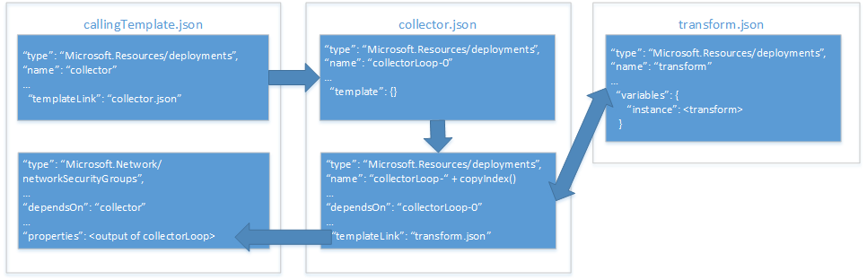

# <a name="implement-a-property-transformer-and-collector-in-an-azure-resource-manager-template"></a><span data-ttu-id="b31e8-103">Azure Resource Manager 템플릿에서 속성 변환기 및 수집기 구현</span><span class="sxs-lookup"><span data-stu-id="b31e8-103">Implement a property transformer and collector in an Azure Resource Manager template</span></span>

<span data-ttu-id="b31e8-104">[Azure Resource Manager 템플릿에서 개체를 매개 변수로 사용][objects-as-parameters]에서는 리소스 속성 값을 개체에 저장하고, 배포 중에 리소스에 적용하는 방법을 배웠습니다.</span><span class="sxs-lookup"><span data-stu-id="b31e8-104">In [use an object as a parameter in an Azure Resource Manager template][objects-as-parameters], you learned how to store resource property values in an object and apply them to a resource during deployment.</span></span> <span data-ttu-id="b31e8-105">이 방법은 매개 변수를 관리하는 매우 유용한 방법이지만, 여전히 템플릿에서 개체의 속성을 사용할 때마다 리소스 속성에 매핑해야 합니다.</span><span class="sxs-lookup"><span data-stu-id="b31e8-105">While this is a very useful way to manage your parameters, it still requires you to map the object's properties to resource properties each time you use it in your template.</span></span>

<span data-ttu-id="b31e8-106">이 문제를 해결하기 위해 개체 배열을 반복하고 리소스에 필요한 JSON 스키마로 변환하는 속성 변형 및 수집기 템플릿을 구현할 수 있습니다.</span><span class="sxs-lookup"><span data-stu-id="b31e8-106">To work around this, you can implement a property transform and collector template that iterates your object array and transforms it into the JSON schema expected by the resource.</span></span>

> [!IMPORTANT]
> <span data-ttu-id="b31e8-107">이 방법을 사용하려면 Resource Manager 템플릿 및 함수를 깊이 있게 이해해야 합니다.</span><span class="sxs-lookup"><span data-stu-id="b31e8-107">This approach requires that you have a deep understanding of Resource Manager templates and functions.</span></span>

<span data-ttu-id="b31e8-108">[NSG(네트워크 보안 그룹)][nsg]를 배포하는 예제로 속성 수집기 및 변환기를 구현하는 방법을 살펴보겠습니다.</span><span class="sxs-lookup"><span data-stu-id="b31e8-108">Let's take a look at how we can implement a property collector and transformer with an example that deploys a [network security group (NSG)][nsg].</span></span> <span data-ttu-id="b31e8-109">아래 다이어그램은 템플릿과 해당 템플릿 내의 리소스 간 관계를 보여 줍니다.</span><span class="sxs-lookup"><span data-stu-id="b31e8-109">The diagram below shows the relationship between our templates and our resources within those templates:</span></span>



<span data-ttu-id="b31e8-111">**호출 템플릿**에는 다음 두 리소스가 포함됩니다.</span><span class="sxs-lookup"><span data-stu-id="b31e8-111">Our **calling template** includes two resources:</span></span>
* <span data-ttu-id="b31e8-112">**수집기 템플릿**을 호출하는 템플릿 링크</span><span class="sxs-lookup"><span data-stu-id="b31e8-112">a template link that invokes our **collector template**.</span></span>
* <span data-ttu-id="b31e8-113">배포할 NSG 리소스</span><span class="sxs-lookup"><span data-stu-id="b31e8-113">the NSG resource to deploy.</span></span>

<span data-ttu-id="b31e8-114">**수집기 템플릿**에는 다음 두 리소스가 포함됩니다.</span><span class="sxs-lookup"><span data-stu-id="b31e8-114">Our **collector template** includes two resources:</span></span>
* <span data-ttu-id="b31e8-115">**앵커** 리소스</span><span class="sxs-lookup"><span data-stu-id="b31e8-115">an **anchor** resource.</span></span>
* <span data-ttu-id="b31e8-116">복사 루프에서 변환 템플릿을 호출하는 템플릿 링크</span><span class="sxs-lookup"><span data-stu-id="b31e8-116">a template link that invokes the transform template in a copy loop.</span></span>

<span data-ttu-id="b31e8-117">**변환 템플릿**에는 단일 리소스가 포함되어 있습니다. 이 템플릿은 `source` JSON을 **주 템플릿**의 NSG 리소스에 필요한 JSON 스키마로 변환하는 변수를 포함하는 빈 템플릿입니다.</span><span class="sxs-lookup"><span data-stu-id="b31e8-117">Our **transform template** includes a single resource: an empty template with a variable that transforms our `source` JSON to the JSON schema expected by our NSG resource in the **main template**.</span></span>

## <a name="parameter-object"></a><span data-ttu-id="b31e8-118">매개 변수 개체</span><span class="sxs-lookup"><span data-stu-id="b31e8-118">Parameter object</span></span>

<span data-ttu-id="b31e8-119">개체의 `securityRules` 매개 변수 개체를 [매개 변수로 사용][objects-as-parameters]할 것입니다.</span><span class="sxs-lookup"><span data-stu-id="b31e8-119">We'll be using our `securityRules` parameter object from [objects as parameters][objects-as-parameters].</span></span> <span data-ttu-id="b31e8-120">**변환 템플릿**은 `securityRules` 배열의 각 개체를 **호출 템플릿**의 NSG에 필요한 JSON 스키마로 변환합니다.</span><span class="sxs-lookup"><span data-stu-id="b31e8-120">Our **transform template** will transform each object in the `securityRules` array into the JSON schema expected by the NSG resource in our **calling template**.</span></span>

```json
{
    "$schema": "https://schema.management.azure.com/schemas/2015-01-01/deploymentParameters.json#",
    "contentVersion": "1.0.0.0",
    "parameters":{ 
      "networkSecurityGroupsSettings": {
      "value": {
          "securityRules": [
            {
              "name": "RDPAllow",
              "description": "allow RDP connections",
              "direction": "Inbound",
              "priority": 100,
              "sourceAddressPrefix": "*",
              "destinationAddressPrefix": "10.0.0.0/24",
              "sourcePortRange": "*",
              "destinationPortRange": "3389",
              "access": "Allow",
              "protocol": "Tcp"
            },
            {
              "name": "HTTPAllow",
              "description": "allow HTTP connections",
              "direction": "Inbound",
              "priority": 200,
              "sourceAddressPrefix": "*",
              "destinationAddressPrefix": "10.0.1.0/24",
              "sourcePortRange": "*",
              "destinationPortRange": "80",
              "access": "Allow",
              "protocol": "Tcp"
            }
          ]
        }
      }
    }
  }
```

<span data-ttu-id="b31e8-121">먼저 **변환 템플릿**을 살펴보겠습니다.</span><span class="sxs-lookup"><span data-stu-id="b31e8-121">Let's look at our **transform template** first.</span></span>

## <a name="transform-template"></a><span data-ttu-id="b31e8-122">변환 템플릿</span><span class="sxs-lookup"><span data-stu-id="b31e8-122">Transform template</span></span>

<span data-ttu-id="b31e8-123">**변환 템플릿**에는 **수집기 템플릿**에서 전달되는 다음 두 매개 변수가 포함되어 있습니다.</span><span class="sxs-lookup"><span data-stu-id="b31e8-123">Our **transform template** includes two parameters that are passed from the **collector template**:</span></span> 
* <span data-ttu-id="b31e8-124">`source`는 속성 배열에서 속성 값 개체 중 하나를 수신하는 개체입니다.</span><span class="sxs-lookup"><span data-stu-id="b31e8-124">`source` is an object that receives one of the property value objects from the property array.</span></span> <span data-ttu-id="b31e8-125">이 예제에서 `"securityRules"` 배열의 각 개체는 한 번에 하나의 전달됩니다.</span><span class="sxs-lookup"><span data-stu-id="b31e8-125">In our example, each object from the `"securityRules"` array will be passed in one at a time.</span></span>
* <span data-ttu-id="b31e8-126">`state`는 모든 이전 변환의 연결된 결과를 수신하는 배열입니다.</span><span class="sxs-lookup"><span data-stu-id="b31e8-126">`state` is an array that receives the concatenated results of all the previous transforms.</span></span> <span data-ttu-id="b31e8-127">변환된 JSON의 컬렉션입니다.</span><span class="sxs-lookup"><span data-stu-id="b31e8-127">This is the collection of transformed JSON.</span></span>

<span data-ttu-id="b31e8-128">매개 변수는 다음과 같습니다.</span><span class="sxs-lookup"><span data-stu-id="b31e8-128">Our parameters look like this:</span></span>

```json
{
  "$schema": "http://schema.management.azure.com/schemas/2015-01-01/deploymentTemplate.json#",
  "contentVersion": "1.0.0.0",
  "parameters": {
    "source": { "type": "object" },
    "state": {
      "type": "array",
      "defaultValue": [ ]
    }
  },
```

<span data-ttu-id="b31e8-129">템플릿은 `instance`라는 변수도 정의합니다.</span><span class="sxs-lookup"><span data-stu-id="b31e8-129">Our template also defines a variable named `instance`.</span></span> <span data-ttu-id="b31e8-130">이 변수는 `source` 개체를 필요한 JSON 스키마로 실제로 변환합니다.</span><span class="sxs-lookup"><span data-stu-id="b31e8-130">It performs the actual tranform of our `source` object into the required JSON schema:</span></span>

```json
  "variables": {
    "instance": [
      {
        "name": "[parameters('source').name]",
        "properties":{
            "description": "[parameters('source').description]",
            "protocol": "[parameters('source').protocol]",
            "sourcePortRange": "[parameters('source').sourcePortRange]",
            "destinationPortRange": "[parameters('source').destinationPortRange]",
            "sourceAddressPrefix": "[parameters('source').sourceAddressPrefix]",
            "destinationAddressPrefix": "[parameters('source').destinationAddressPrefix]",
            "access": "[parameters('source').access]",
            "priority": "[parameters('source').priority]",
            "direction": "[parameters('source').direction]"            
        }
      }
    ]

  },
```

<span data-ttu-id="b31e8-131">마지막으로 템플릿의 `output`은 `state` 매개 변수의 수집된 변환을 `instance` 변수가 수행하는 현재 변환에 연결합니다.</span><span class="sxs-lookup"><span data-stu-id="b31e8-131">Finally, the `output` of our template concatenates the collected transforms of our `state` parameter with the current transform performed by our `instance` variable:</span></span>

```json
  "outputs": {
    "collection": {
      "type": "array",
      "value": "[concat(parameters('state'), variables('instance'))]"
    }
```

<span data-ttu-id="b31e8-132">다음으로, **수집기 템플릿**이 매개 변수 값을 전달하는 방법을 살펴보겠습니다.</span><span class="sxs-lookup"><span data-stu-id="b31e8-132">Next, let's take a look at our **collector template** to see how it passes in our parameter values.</span></span>

## <a name="collector-template"></a><span data-ttu-id="b31e8-133">수집기 템플릿</span><span class="sxs-lookup"><span data-stu-id="b31e8-133">Collector template</span></span>

<span data-ttu-id="b31e8-134">**수집기 템플릿**에는 다음 3가지 매개 변수가 포함되어 있습니다.</span><span class="sxs-lookup"><span data-stu-id="b31e8-134">Our **collector template** includes three parameters:</span></span>
* <span data-ttu-id="b31e8-135">`source`는 완전한 매개 변수 개체 배열입니다.</span><span class="sxs-lookup"><span data-stu-id="b31e8-135">`source` is our complete parameter object array.</span></span> <span data-ttu-id="b31e8-136">이 개체는 **호출 템플릿**에 의해 전달됩니다.</span><span class="sxs-lookup"><span data-stu-id="b31e8-136">It's passed in by the **calling template**.</span></span> <span data-ttu-id="b31e8-137">이 개체는 **변환 템플릿**에서 `source` 매개 변수와 같은 이름을 가지지만, 이미 알려져 있는 한 가지 주요 차이점이 있습니다. 완전한 배열이지만, 이 배열의 요소를 한 번에 하나씩만 **변환 템플릿**에 전달한다는 것입니다.</span><span class="sxs-lookup"><span data-stu-id="b31e8-137">This has the same name as the `source` parameter in our **transform template** but there is one key difference that you may have already noticed: this is the complete array, but we only pass one element of this array to the **transform template** at a time.</span></span>
* <span data-ttu-id="b31e8-138">`transformTemplateUri`는 **변환 템플릿**의 URI입니다.</span><span class="sxs-lookup"><span data-stu-id="b31e8-138">`transformTemplateUri` is the URI of our **transform template**.</span></span> <span data-ttu-id="b31e8-139">여기서는 템플릿 재사용을 위해 매개 변수로 정의합니다.</span><span class="sxs-lookup"><span data-stu-id="b31e8-139">We're defining it as a parameter here for template reusability.</span></span>
* <span data-ttu-id="b31e8-140">`state`는 **변환 템플릿**에 전달하는 배열로, 처음에는 빈 상태입니다.</span><span class="sxs-lookup"><span data-stu-id="b31e8-140">`state` is an initially empty array that we pass to our **transform template**.</span></span> <span data-ttu-id="b31e8-141">복사 루프가 완료되면 변환된 매개 변수 개체 컬렉션이 저장됩니다.</span><span class="sxs-lookup"><span data-stu-id="b31e8-141">It stores the collection of transformed parameter objects when the copy loop is complete.</span></span>

<span data-ttu-id="b31e8-142">매개 변수는 다음과 같습니다.</span><span class="sxs-lookup"><span data-stu-id="b31e8-142">Our parameters look like this:</span></span>

```json
  "parameters": {
    "source": { "type": "array" },
    "transformTemplateUri": { "type": "string" },
    "state": {
      "type": "array",
      "defaultValue": [ ]
    }
``` 

<span data-ttu-id="b31e8-143">다음으로, `count`라는 변수를 정의합니다.</span><span class="sxs-lookup"><span data-stu-id="b31e8-143">Next, we define a variable named `count`.</span></span> <span data-ttu-id="b31e8-144">해당 값은 `source` 매개 변수 개체 배열의 길이를 갖습니다.</span><span class="sxs-lookup"><span data-stu-id="b31e8-144">Its value is the length of the `source` parameter object array:</span></span>

```json
  "variables": {
    "count": "[length(parameters('source'))]"
  },
```

<span data-ttu-id="b31e8-145">예상할 수 있는 것처럼, 이 변수는 복사 루프의 반복 횟수에 사용합니다.</span><span class="sxs-lookup"><span data-stu-id="b31e8-145">As you might suspect, we use it for the number of iterations in our copy loop.</span></span>

<span data-ttu-id="b31e8-146">이제 리소스를 살펴보겠습니다.</span><span class="sxs-lookup"><span data-stu-id="b31e8-146">Now let's take a look at our resources.</span></span> <span data-ttu-id="b31e8-147">다음 두 리소스를 정의합니다.</span><span class="sxs-lookup"><span data-stu-id="b31e8-147">We define two resources:</span></span>
* <span data-ttu-id="b31e8-148">`loop-0`는 복사 루프의 0부터 시작하는 리소스입니다.</span><span class="sxs-lookup"><span data-stu-id="b31e8-148">`loop-0` is the zero-based resource for our copy loop.</span></span>
* <span data-ttu-id="b31e8-149">`loop-`는 `copyIndex(1)` 함수의 결과와 연결되어, `1`부터 시작하는 리소스의 고유한 반복 기반 이름을 생성합니다.</span><span class="sxs-lookup"><span data-stu-id="b31e8-149">`loop-` is concatenated with the result of the `copyIndex(1)` function to generate a unique iteration-based name for our resource, starting with `1`.</span></span>

<span data-ttu-id="b31e8-150">리소스는 다음과 같습니다.</span><span class="sxs-lookup"><span data-stu-id="b31e8-150">Our resources look like this:</span></span>

```json
  "resources": [
    {
      "type": "Microsoft.Resources/deployments",
      "apiVersion": "2015-01-01",
      "name": "loop-0",
      "properties": {
        "mode": "Incremental",
        "parameters": { },
        "template": {
          "$schema": "http://schema.management.azure.com/schemas/2015-01-01/deploymentTemplate.json#",
          "contentVersion": "1.0.0.0",
          "parameters": { },
          "variables": { },
          "resources": [ ],
          "outputs": {
            "collection": {
              "type": "array",
              "value": "[parameters('state')]"
            }
          }
        }
      }
    },
    {
      "type": "Microsoft.Resources/deployments",
      "apiVersion": "2015-01-01",
      "name": "[concat('loop-', copyindex(1))]",
      "copy": {
        "name": "iterator",
        "count": "[variables('count')]",
        "mode": "serial"
      },
      "dependsOn": [
        "loop-0"
      ],
      "properties": {
        "mode": "Incremental",
        "templateLink": { "uri": "[parameters('transformTemplateUri')]" },
        "parameters": {
          "source": { "value": "[parameters('source')[copyindex()]]" },
          "state": { "value": "[reference(concat('loop-', copyindex())).outputs.collection.value]" }
        }
      }
    }
  ],
```

<span data-ttu-id="b31e8-151">중첩 템플릿에서 **변환 템플릿**에 전달하는 매개 변수를 좀 더 자세히 살펴보겠습니다.</span><span class="sxs-lookup"><span data-stu-id="b31e8-151">Let's take a closer look at the parameters we're passing to our **transform template** in the nested template.</span></span> <span data-ttu-id="b31e8-152">앞서 설명한 대로 `source` 매개 변수는 `source` 매개 변수 개체 배열에 현재 개체를 전달합니다.</span><span class="sxs-lookup"><span data-stu-id="b31e8-152">Recall from earlier that our `source` parameter passes the current object in the `source` parameter object array.</span></span> <span data-ttu-id="b31e8-153">`state` 매개 변수는 컬렉션이 발생하는 위치입니다. 이 매개 변수는 `reference()` 함수가 매개 변수 없이 `copyIndex()` 함수를 사용하여 이전 연결된 템플릿 개체의 `name`을 참조한다는 사실을 토대로, 복사 루프의 이전 반복에 대한 출력을 가져온 후 현재 반복으로 전달합니다.</span><span class="sxs-lookup"><span data-stu-id="b31e8-153">The `state` parameter is where the collection happens, because it takes the output of the previous iteration of our copy loop&mdash;notice that the `reference()` function uses the `copyIndex()` function with no parameter to reference the `name` of our previous linked template object&mdash;and passes it to the current iteration.</span></span>

<span data-ttu-id="b31e8-154">마지막으로 템플릿의 `output`은 **변환 템플릿** 마지막 반복의 `output`을 반환합니다.</span><span class="sxs-lookup"><span data-stu-id="b31e8-154">Finally, the `output` of our template returns the `output` of the last iteration of our **transform template**:</span></span>

```json
  "outputs": {
    "result": {
      "type": "array",
      "value": "[reference(concat('loop-', variables('count'))).outputs.collection.value]"
    }
  }
```
<span data-ttu-id="b31e8-155">**변환 템플릿** 마지막 반복의 `output`을 **호출 템플릿**에 반환하는 것은 간단해 보이지 않을 수 있습니다. 이러한 항목은 `source` 매개 변수에 저장한 것으로 보이기 때문입니다.</span><span class="sxs-lookup"><span data-stu-id="b31e8-155">It may seem counterintuitive to return the `output` of the last iteration of our **transform template** to our **calling template** because it appeared we were storing it in our `source` parameter.</span></span> <span data-ttu-id="b31e8-156">그렇지만 변환된 속성 개체의 완전한 배열을 포함하는 것이 바로 **변환 템플릿** 마지막 반복이며, 반환하려는 항목은 바로 이것입니다.</span><span class="sxs-lookup"><span data-stu-id="b31e8-156">However, remember that it's the last iteration of our **transform template** that holds the complete array of transformed property objects, and that's what we want to return.</span></span>

<span data-ttu-id="b31e8-157">마지막으로 **호출 템플릿**에서 **수집기 템플릿**을 호출하는 방법을 살펴보겠습니다.</span><span class="sxs-lookup"><span data-stu-id="b31e8-157">Finally, let's take a look at how to call the **collector template** from our **calling template**.</span></span>

## <a name="calling-template"></a><span data-ttu-id="b31e8-158">호출 템플릿</span><span class="sxs-lookup"><span data-stu-id="b31e8-158">Calling template</span></span>

<span data-ttu-id="b31e8-159">**호출 템플릿**은 `networkSecurityGroupsSettings`라는 단일 매개 변수를 정의합니다.</span><span class="sxs-lookup"><span data-stu-id="b31e8-159">Our **calling template** defines a single parameter named `networkSecurityGroupsSettings`:</span></span>

```json
...
"parameters": {
    "networkSecurityGroupsSettings": {
        "type": "object"
    }
```

<span data-ttu-id="b31e8-160">다음으로, 이 템플릿은 `collectorTemplateUri`라는 단일 변수를 정의합니다.</span><span class="sxs-lookup"><span data-stu-id="b31e8-160">Next, our template defines a single variable named `collectorTemplateUri`:</span></span>

```json
"variables": {
    "collectorTemplateUri": "[uri(deployment().properties.templateLink.uri, 'collector.template.json')]"
  }
```

<span data-ttu-id="b31e8-161">예상한 것처럼 이것은 연결된 템플릿 리소스에서 사용되는 **수집기 템플릿**의 URI입니다.</span><span class="sxs-lookup"><span data-stu-id="b31e8-161">As you would expect, this is the URI for the **collector template** that will be used by our linked template resource:</span></span>

```json
{
    "apiVersion": "2015-01-01",
    "name": "collector",
    "type": "Microsoft.Resources/deployments",
    "properties": {
        "mode": "Incremental",
        "templateLink": {
            "uri": "[variables('linkedTemplateUri')]",
            "contentVersion": "1.0.0.0"
        },
        "parameters": {
            "source" : {"value": "[parameters('networkSecurityGroupsSettings').securityRules]"},
            "transformTemplateUri": { "value": "[uri(deployment().properties.templateLink.uri, 'transform.json')]"}
        }
    }
}
```

<span data-ttu-id="b31e8-162">다음 두 매개 변수를 **수집기 템플릿**에 전달합니다.</span><span class="sxs-lookup"><span data-stu-id="b31e8-162">We pass two parameters to the **collector template**:</span></span>
* <span data-ttu-id="b31e8-163">`source`는 이 속성 개체 배열입니다.</span><span class="sxs-lookup"><span data-stu-id="b31e8-163">`source` is our property object array.</span></span> <span data-ttu-id="b31e8-164">이 예제에서는 `networkSecurityGroupsSettings` 매개 변수입니다.</span><span class="sxs-lookup"><span data-stu-id="b31e8-164">In our example, it's our `networkSecurityGroupsSettings` parameter.</span></span>
* <span data-ttu-id="b31e8-165">`transformTemplateUri`는 **수집기 템플릿**의 URI로 방금 정의한 변수입니다.</span><span class="sxs-lookup"><span data-stu-id="b31e8-165">`transformTemplateUri` is the variable we just defined with the URI of our **collector template**.</span></span>

<span data-ttu-id="b31e8-166">마지막으로, `Microsoft.Network/networkSecurityGroups` 리소스는 `collector` 연결된 템플릿 리소스의 `output`을 해당 `securityRules` 속성에 직접 할당합니다.</span><span class="sxs-lookup"><span data-stu-id="b31e8-166">Finally, our `Microsoft.Network/networkSecurityGroups` resource directly assigns the `output` of the `collector` linked template resource to its `securityRules` property:</span></span>

```json
    {
      "apiVersion": "2015-06-15",
      "type": "Microsoft.Network/networkSecurityGroups",
      "name": "networkSecurityGroup1",
      "location": "[resourceGroup().location]",
      "properties": {
        "securityRules": "[reference('firstResource').outputs.result.value]"
      }
    }
  ],
  "outputs": {
      "instance":{
          "type": "array",
          "value": "[reference('firstResource').outputs.result.value]"
      }

  }
```

## <a name="next-steps"></a><span data-ttu-id="b31e8-167">다음 단계</span><span class="sxs-lookup"><span data-stu-id="b31e8-167">Next steps</span></span>

* <span data-ttu-id="b31e8-168">이 기법은 [템플릿 구성 요소 프로젝트](https://github.com/mspnp/template-building-blocks) 및 [Azure 참조 아키텍처](/azure/architecture/reference-architectures/)에서도 구현됩니다.</span><span class="sxs-lookup"><span data-stu-id="b31e8-168">This technique is implemented in the [template building blocks project](https://github.com/mspnp/template-building-blocks) and the [Azure reference architectures](/azure/architecture/reference-architectures/).</span></span> <span data-ttu-id="b31e8-169">이러한 참조 아키텍처를 사용하여 고유한 아키텍처를 만들거나 참조 아키텍처 중 하나를 배포할 수 있습니다.</span><span class="sxs-lookup"><span data-stu-id="b31e8-169">You can use these to create your own architecture or deploy one of our reference architectures.</span></span>

<!-- links -->
[objects-as-parameters]: ./objects-as-parameters.md
[resource-manager-linked-template]: /azure/azure-resource-manager/resource-group-linked-templates
[resource-manager-variables]: /azure/azure-resource-manager/resource-group-template-functions-deployment
[nsg]: /azure/virtual-network/virtual-networks-nsg
