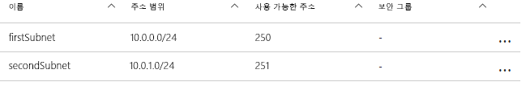
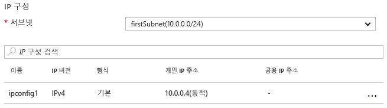

# <a name="update-a-resource-in-an-azure-resource-manager-template"></a>Azure Resource Manager 템플릿의 리소스 업데이트

배포하는 동안 리소스를 업데이트해야 하는 몇 가지 시나리오가 있습니다. 다른 종속 리소스를 만들 때까지 리소스에 대한 모든 속성을 지정할 수는 없을 때 이 시나리오가 발생할 수 있습니다. 예를 들어 부하 분산 장치에 대한 백 엔드 풀을 만드는 경우 VM(가상 머신)의 NIC(네트워크 인터페이스)를 업데이트하여 백 엔드 풀에 포함할 수 있습니다. 또한 Resource Manager는 배포 동안 리소스를 업데이트하도록 지원하지만 오류를 피하고 배포가 업데이트로 처리되도록 템플릿을 적절히 디자인해야 합니다.

첫째, 리소스를 만들려면 템플릿에서 리소스를 한 번 참조한 후, 나중에 업데이트할 때 같은 이름으로 리소스를 참조해야 합니다. 그러나 두 리소스가 템플릿에서 같은 이름을 갖는 경우 Resource Manager는 예외를 throw합니다. 이 오류를 방지하려면 `Microsoft.Resources/deployments` 리소스 형식을 사용하여 하위 템플릿으로 연결 또는 포함된 두 번째 템플릿에 업데이트된 리소스를 지정합니다.

둘째, 중첩된 템플릿에서 변경할 기존 속성의 이름 또는 추가할 속성의 새 이름을 지정해야 합니다. 또한 원래 속성 및 원래 값도 함께 지정해야 합니다. 원래 속성 및 값을 제공하지 못하면 Resource Manager는 사용자가 새 리소스를 만들려고 한다고 가정하고 원래 리소스를 삭제합니다.

## <a name="example-template"></a>예제 템플릿

이 내용을 설명하는 예제 템플릿을 살펴보겠습니다. 템플릿은 `firstSubnet`이라는 서브넷이 있는 `firstVNet`이라는 VNet(가상 네트워크)을 배포합니다. 그런 후 `nic1`라는 가상 NIC(네트워크 인터페이스)를 배포하고 해당 서브넷에 연결합니다. 그런 다음 `secondSubnet`이라는 두 번째 서브넷을 추가하여 `updateVNet`라는 배포 리소스에 `firstVNet` 리소스를 업데이트하는 중첩된 템플릿이 포함됩니다. 

```json
{
  "$schema": "https://schema.management.azure.com/schemas/2015-01-01/deploymentTemplate.json#",
  "contentVersion": "1.0.0.0",
  "parameters": {},
  "resources": [
      {
      "apiVersion": "2016-03-30",
      "name": "firstVNet",
      "location":"[resourceGroup().location]",
      "type": "Microsoft.Network/virtualNetworks",
      "properties": {
          "addressSpace":{"addressPrefixes": [
              "10.0.0.0/22"
          ]},
          "subnets":[              
              {
                  "name":"firstSubnet",
                  "properties":{
                    "addressPrefix":"10.0.0.0/24"
                  }
              }
            ]
      }
    },
    {
        "apiVersion": "2015-06-15",
        "type":"Microsoft.Network/networkInterfaces",
        "name":"nic1",
        "location":"[resourceGroup().location]",
        "dependsOn": [
            "firstVNet"
        ],
        "properties": {
            "ipConfigurations":[
                {
                    "name":"ipconfig1",
                    "properties": {
                        "privateIPAllocationMethod":"Dynamic",
                        "subnet": {
                            "id": "[concat(resourceId('Microsoft.Network/virtualNetworks','firstVNet'),'/subnets/firstSubnet')]"
                        }
                    }
                }
            ]
        }
    },
    {
      "apiVersion": "2015-01-01",
      "type": "Microsoft.Resources/deployments",
      "name": "updateVNet",
      "dependsOn": [
          "nic1"
      ],
      "properties": {
        "mode": "Incremental",
        "parameters": {},
        "template": {
          "$schema": "http://schema.management.azure.com/schemas/2015-01-01/deploymentTemplate.json#",
          "contentVersion": "1.0.0.0",
          "parameters": {},
          "variables": {},
          "resources": [
              {
                  "apiVersion": "2016-03-30",
                  "name": "firstVNet",
                  "location":"[resourceGroup().location]",
                  "type": "Microsoft.Network/virtualNetworks",
                  "properties": {
                      "addressSpace": "[reference('firstVNet').addressSpace]",
                      "subnets":[
                          {
                              "name":"[reference('firstVNet').subnets[0].name]",
                              "properties":{
                                  "addressPrefix":"[reference('firstVNet').subnets[0].properties.addressPrefix]"
                                  }
                          },
                          {
                              "name":"secondSubnet",
                              "properties":{
                                  "addressPrefix":"10.0.1.0/24"
                                  }
                          }
                     ]
                  }
              }
          ],
          "outputs": {}
          }
        }
    }
  ],
  "outputs": {}
}
```

먼저 `firstVNet` 리소스의 리소스 개체를 살펴보겠습니다. 중첩된 템플릿에서 `firstVNet`에 대한 설정을 지정합니다. Resource Manager는 같은 템플릿 내에서 같은 배포 이름을 허용하지 않으며 중첩된 템플릿은 다른 템플릿으로 간주되기 때문입니다. `firstSubnet` 리소스에 대한 값을 지정하여 Resource Manager에 기존 리소스를 삭제한 후 다시 배포하는 대신, 업데이트하도록 지시합니다. 마지막으로, `secondSubnet`에 대한 새 설정이 이 업데이트 동안 선택됩니다.

## <a name="try-the-template"></a>템플릿 시도

이 템플릿으로 실험하려면 다음 단계를 따릅니다.

1.  Azure Portal로 이동하여 **+** 아이콘을 선택하고 **템플릿 배포** 리소스 종류를 검색하고 선택합니다.
2.  **템플릿 배포** 페이지로 이동한 후 **만들기** 단추를 선택합니다. 그러면 **사용자 지정 배포** 블레이드가 열립니다.
3.  **편집** 아이콘을 선택합니다.
4.  비어 있는 템플릿을 삭제합니다.
5.  샘플 템플릿을 복사하여 오른쪽 창에 붙여 넣습니다.
6.  **저장** 단추를 선택합니다.
7.  **사용자 지정 배포**창으로 돌아오지만 이번에는 일부 드롭다운 상자가 표시됩니다. 구독을 선택하고, 새로 만들거나 기존 리소스 그룹을 사용하고, 위치를 선택합니다. 사용 약관을 검토하고 **동의함** 단추를 클릭합니다.
8.  **구입** 단추를 선택합니다.

배포가 완료된 후 포털에서 지정한 리소스 그룹을 엽니다. `firstVNet`라는 가상 네트워크와 `nic1`라는 NIC가 표시됩니다. `firstVNet`을 클릭한 후 `subnets`를 클릭합니다. 처음에 만들어진 `firstSubnet`이 표시된 후 `updateVNet` 리소스에 추가된 `secondSubnet`이 표시됩니다. 



그런 후 리소스 그룹으로 다시 이동하고 `nic1`을 클릭한 후 `IP configurations`를 클릭합니다. `IP configurations` 섹션에서 `subnet`은 `firstSubnet (10.0.0.0/24)`으로 설정되어 있습니다. 



원래 `firstVNet`이 다시 생성되지 않고 업데이트되었습니다. `firstVNet`이 다시 생성되었으면 `nic1`이 `firstVNet`에 연결되지 않았을 것입니다.

## <a name="next-steps"></a>다음 단계

* 이 기법은 [템플릿 구성 요소 프로젝트](https://github.com/mspnp/template-building-blocks) 및 [Azure 참조 아키텍처](/azure/architecture/reference-architectures/)에서도 구현됩니다. 이러한 참조 아키텍처를 사용하여 고유한 아키텍처를 만들거나 참조 아키텍처 중 하나를 배포할 수 있습니다.
