# 거버넌스 디자인 지침: 여러 팀을 위해 Azure에서 새로운 개발

이 지침의 목적은 Azure에서 리소스 거버넌스 모델을 디자인하기 위한 프로세스를 익히도록 돕는 데 있습니다.  가상의 거버넌스 요구 사항 집합을 살펴본 다음, 해당 요구 사항을 충족하는 몇 가지 예제 구현을 수행합니다. 

요구 사항은 다음과 같습니다.
* Azure에서 다른 리소스 액세스 요구 사항이 있는 여러 팀에 대한 ID 관리입니다. ID 관리 시스템은 다음 사용자의 ID를 저장합니다.
  1. **구독** 소유권을 담당하는 조직의 개인입니다.
  2. 온-프레미스 네트워크를 Azure 가상 네트워크에 연결하는 데 사용된 **공유 인프라 리소스**를 담당하는 조직의 개인입니다. 
  3. **워크로드** 관리를 담당하는 조직의 개인 2명입니다. 
* 여러 **환경**에 대해 지원합니다. 앞서 살펴본 것처럼 환경은 비슷한 관리 및 보안 요구를 사용한 리소스의 논리적 그룹화입니다. 다음 세 가지 환경이 필요합니다.
  1. 다른 환경의 워크로드에서 공유하는 리소스를 포함하는 **공유 인프라 환경**입니다. 예를 들어 온-프레미스에 연결을 제공하는 게이트웨이 서브넷이 있는 가상 네트워크입니다.
  2. 가장 제한적인 보안 정책이 있는 **프로덕션 환경**입니다. 내부 또는 외부 연결 워크로드를 포함할 수 있습니다.
  3. 개념 증명 및 테스트 작업에 대한 **개발 환경**입니다. 이 환경에는 프로덕션 환경과 다른 보안, 준수 및 비용 정책이 있습니다.
* 기본적으로 사용자가 사용 권한이 없는 **최소 권한의 사용 권한 모델**입니다. 모델은 다음을 지원해야 합니다.
  * 리소스 액세스 권한을 할당할 권한이 있는 구독 범위에서 신뢰할 수 있는 단일 사용자입니다.
  * 각 워크로드 소유자는 기본적으로 리소스에 대한 액세스가 거부됩니다. 리소스 액세스 권한은 구독 범위에서 신뢰할 수 있는 단일 사용자가 명시적으로 부여합니다.
  * 공유 인프라 소유자에게 제한된 공유 인프라 리소스에 대한 액세스 관리입니다.  
  * 워크로드 소유자에게 제한된 각 워크로드에 대한 액세스 관리입니다.
  * [기본 제공 RBAC 역할][rbac-built-in-roles]만 사용합니다. 사용자 지정 RBAC 역할이 없습니다.
* 워크로드 소유자 이름, 환경 또는 둘 다의 추적 비용입니다. 

## ID 관리

거버넌스 모델에 대한 ID 관리를 디자인할 수 있기 전에 이 모델이 포함하는 네 개의 주요 영역을 이해하는 것이 중요합니다.

* 관리: 사용자 ID를 만들고 편집하고 삭제하기 위한 프로세스 및 도구입니다.
* 인증: 사용자 이름 및 암호 같은 자격 증명의 유효성을 검사하여 사용자 ID를 확인합니다.
* 권한 부여: 인증된 사용자에게 액세스가 허용된 리소스 또는 인증된 사용자가 수행할 권한이 있는 작업을 결정합니다.
* 감사: 사용자 ID와 관련된 보안 문제를 검색하려면 주기적으로 로그 및 기타 정보를 검토합니다. 여기에는 의심스러운 사용 패턴 검토, 사용자 권한이 정확한지 확인하기 위한 주기적인 검토 및 기타 기능이 포함됩니다.

ID에 대해 Azure에서 신뢰하는 유일한 서비스는 Azure AD(Active Directory)입니다. Azure AD에 사용자를 추가하고 위에 나열된 모든 기능에 대해 Azure AD를 사용하겠습니다. Azure AD를 구성하는 방법을 살펴보기 전에 이러한 서비스에 대한 액세스를 관리하는 데 사용되는 권한 있는 계정을 이해하는 것이 중요합니다.

조직이 Azure 계정에 등록한 경우 아직 조직의 Office 365와 같은 다른 Microsoft 서비스 사용과 연결된 Azure AD 테넌트가 없다면 적어도 1명 이상의 Azure **계정 소유자**가 할당되고 Azure AD **테넌트**가 만들어졌습니다. Azure AD 테넌트에 대한 모든 권한이 있는 **전역 관리자**가 만들어졌을 때 연결됐습니다. 

Azure 계정 소유자와 Azure AD 전역 관리자의 사용자 ID 모두는 Microsoft에서 관리하는 보안성이 높은 ID 시스템에 저장됩니다. Azure 계정 소유자는 구독 만들기, 업데이트 및 삭제 권한이 있습니다. Azure AD 전역 관리자는 Azure AD에서 많은 작업을 수행할 권한이 있지만 이 디자인 지침의 경우 사용자 ID의 생성 및 삭제에 대해 집중적으로 살펴보겠습니다. 

> [!NOTE]
> 사용자 계정과 연결된 기존 Office 365 또는 Intune 라이선스가 있는 경우 조직에는 이미 기존 Azure AD 테넌트가 있을 수 있습니다.

Azure 계정 소유자는 구독 만들기, 업데이트 및 삭제 권한이 있습니다. 

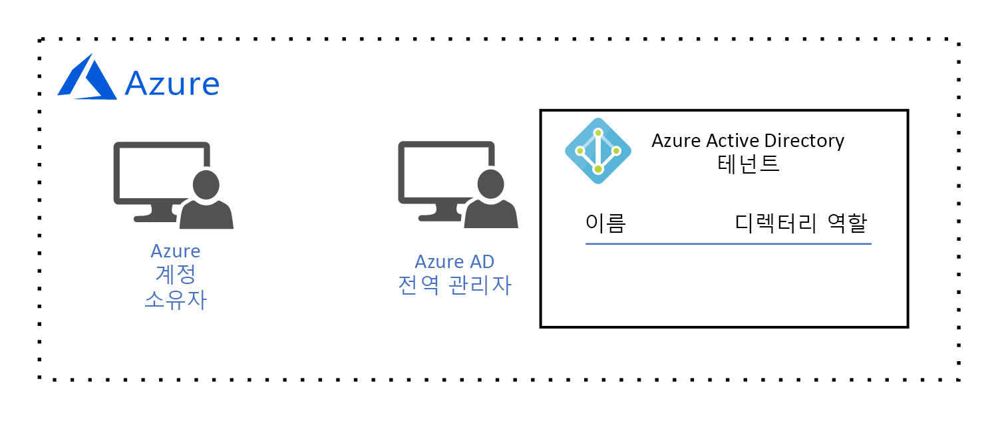
*그림 1. Azure 계정 관리자 및 Azure AD 전역 관리자가 있는 Azure 계정.*

Azure AD **전역 관리자**는 사용자 계정을 만들 권한이 있습니다.  

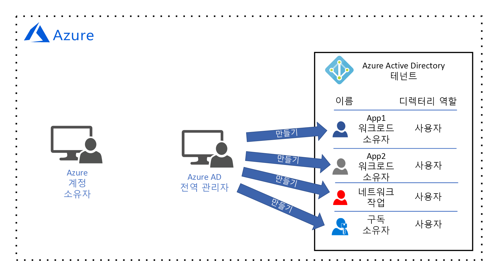
*그림 2. Azure AD 전역 관리자는 테넌트에서 필요한 사용자 계정을 만듭니다.*

처음 두 계정, **App1 워크로드 소유자** 및 **App2 워크로드 소유자**는 각각 워크로드 관리를 담당하는 조직의 개인과 연결돼 있습니다. **네트워크 작업** 계정은 공유 인프라 리소스를 담당하는 개인이 소유합니다. 마지막으로 **구독 소유자** 계정은 구독 소유권을 담당하는 개인과 연결되어 있습니다.

## 최소 권한의 리소스 액세스 권한 모델

ID 관리 시스템 및 사용자 계정이 생성됐으므로 최소 권한의 사용 권한 모델을 지원하려면 RBAC(역할 기반 액세스 컨트롤) 역할을 각 계정에 적용하는 방법을 결정해야 합니다.

다른 요구 사항은 워크로드 소유자가 소유하지 않은 다른 모든 작업에 대한 관리 액세스 권한을 갖도록 각 워크로드와 연결된 리소스가 서로 격리되는 것입니다. [Azure RBAC의 기본 제공 역할][rbac-built-in-roles]만 사용하여 이 모델을 구현하기 위한 요구 사항이 있습니다.

각 RBAC 역할은 Azure에서 **구독**, **리소스 그룹** 및 개별 **리소스**의 3개 범위 중 하나에 적용됩니다. 역할은 더 낮은 범위에서 상속됩니다. 예를 들어 구독 수준에서 사용자에 게 [기본 제공 소유자 역할][rbac-built-in-owner]이 할당되는 경우 해당 역할은 재정의되지 않는 한 리소스 그룹 및 개별 리소스 수준에서 해당 사용자에게 할당됩니다.

따라서 최소 권한 액세스 모델을 만들려면 특정 유형의 사용자가 이러한 세 가지 범위 각각에서 수행하도록 허용된 작업을 결정해야 합니다. 예를 들어 요구 사항은 워크로드 소유자가 다른 리소스를 제외한 해당 워크로드와 연결된 리소스에 대해서만 액세스를 관리할 권한을 갖는 것입니다. 구독 범위에서 [기본 제공 소유자 역할][rbac-built-in-owner]을 할당해야 하는 경우 각 워크로드 소유자에게 모든 작업에 대한 관리 액세스가 있습니다.

이 개념을 좀 더 잘 이해하려면 두 사용 권한 모델 예제에 대해 살펴보겠습니다. 첫 번째 예제에서 모델은 리소스 그룹을 만들려면 서비스 관리자만 신뢰합니다. 두 번째 예제에서 모델은 구독 범위에서 각 워크로드 소유자에게 기본 제공 소유자 역할을 할당합니다. 

두 예제에서는 구독 범위에서 [기본 제공 소유자 역할][rbac-built-in-owner]이 할당된 구독 서비스 관리자가 있습니다. [기본 제공 소유자 역할][rbac-built-in-owner]은 리소스에 대한 액세스 관리를 비롯한 모든 사용 권한을 부여합니다.
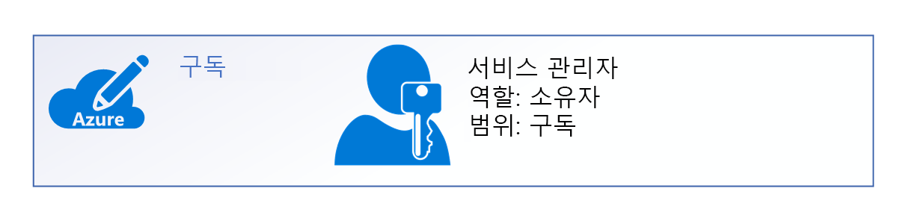
*그림 3. 기본 제공 소유자 역할이 할당된 서비스 관리자가 있는 구독입니다.* 

1. 첫 번째 예제에서 구독 범위에서 아무런 권한이 없는 **워크로드 소유자 A**는 기본적으로 리소스 액세스 관리 권한이 없습니다. 이 사용자는 해당 워크로드에 대한 리소스를 배포하고 관리하려 합니다. 리소스 그룹 만들기를 요청하려면 **서비스 관리자**에게 문의해야 합니다.
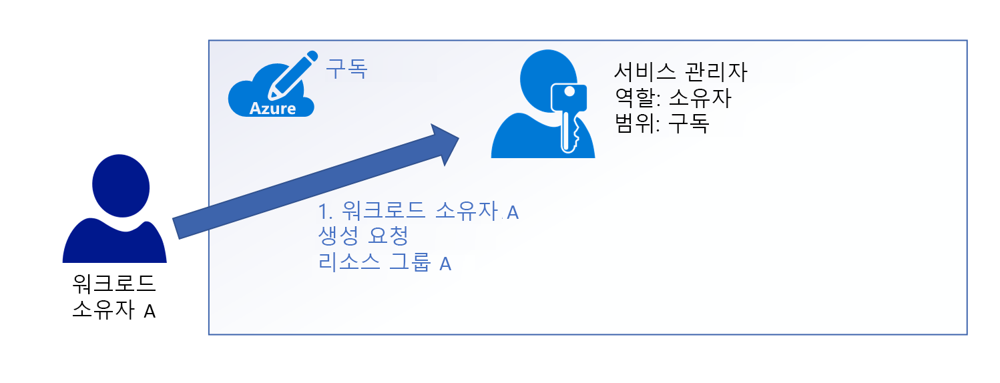  

2. **서비스 관리자**는 해당 요청을 검토한 후, **리소스 그룹 A**를 만듭니다. 이 시점에서 **워크로드 소유자**는 아직 어떤 작업도 수행할 권한이 없습니다.
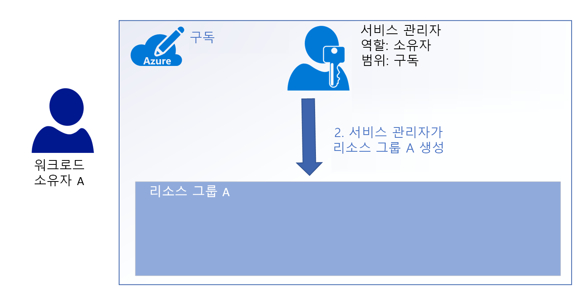

3. **서비스 관리자**는 **워크로드 소유자 A**를 **리소스 그룹 A**에 추가하고 [기본 제공 기여자 역할](/azure/role-based-access-control/built-in-roles#contributor)을 할당합니다. 기여자 역할은 액세스 권한 관리를 제외하고 **리소스 그룹 A**에 대한 모든 권한을 부여합니다.
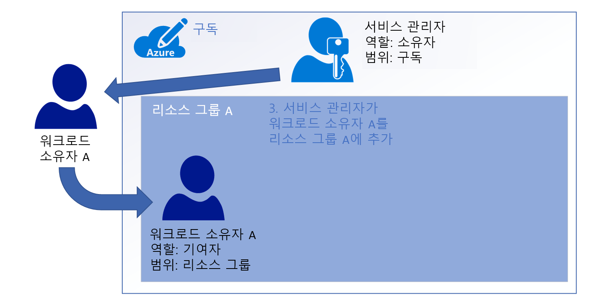

4. **워크로드 소유자 A**에게는 CPU 및 네트워크 트래픽 모니터링 데이터를 워크로드에 대한 용량 계획의 일부로 보려면 한 쌍의 팀 멤버에 대해 요구 사항이 있다고 가정합시다. **작업 소유자 A**에게는 기여자 역할이 할당됐기 때문에 **리소스 그룹 A**에 사용자를 추가할 권한이 없습니다. 이 요청을 **서비스 관리자**에게 보내야 합니다.
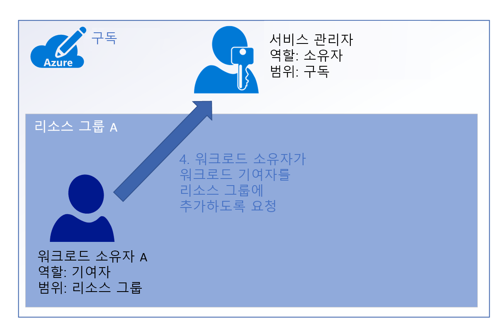

5. **서비스 관리자**는 요청을 검토하고 두 **워크로드 기여자** 사용자를 **리소스 그룹 A**에 추가합니다. 이러한 두 사용자 누구도 리소스를 관리할 권한이 필요치 않으므로 [기본 제공 판독기 역할](/azure/role-based-access-control/built-in-roles#contributor)이 할당됩니다. 
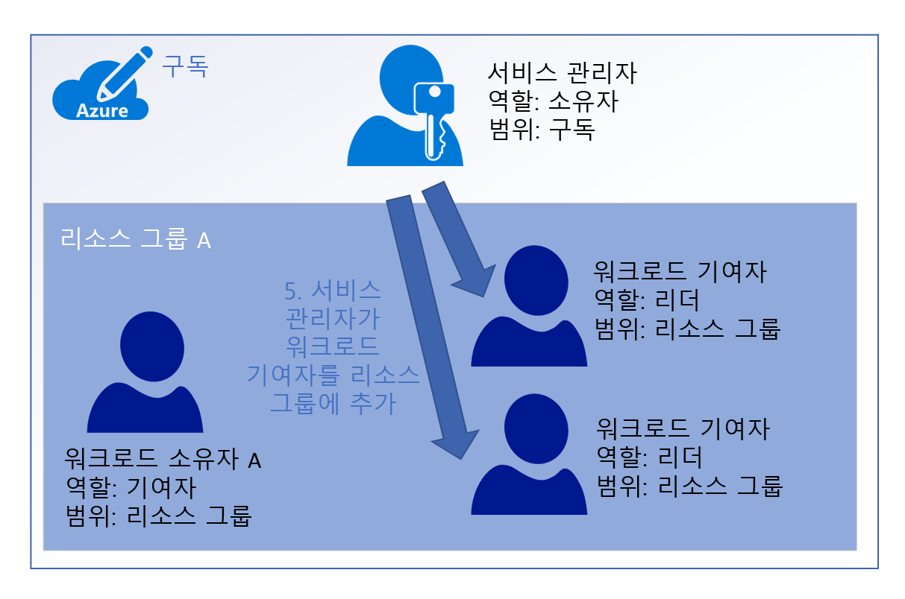

6. 다음으로 **워크로드 소유자 B**는 리소스 그룹이 해당 워크로드에 대한 리소스를 포함할 것을 요구합니다. **워크로드 소유자 A**와 마찬가지로 **워크로드 소유자 B**는 처음에 구독 범위에서 작업을 수행할 권한이 없으므로 요청을 **서비스 관리자**에게 보내야 합니다. 
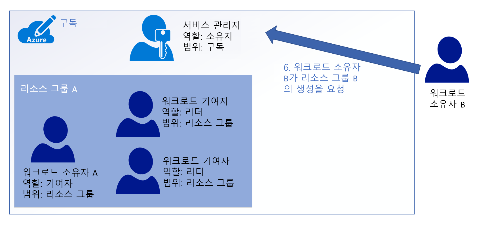

7. **서비스 관리자**는 해당 요청을 검토한 후, **리소스 그룹 B**를 만듭니다. 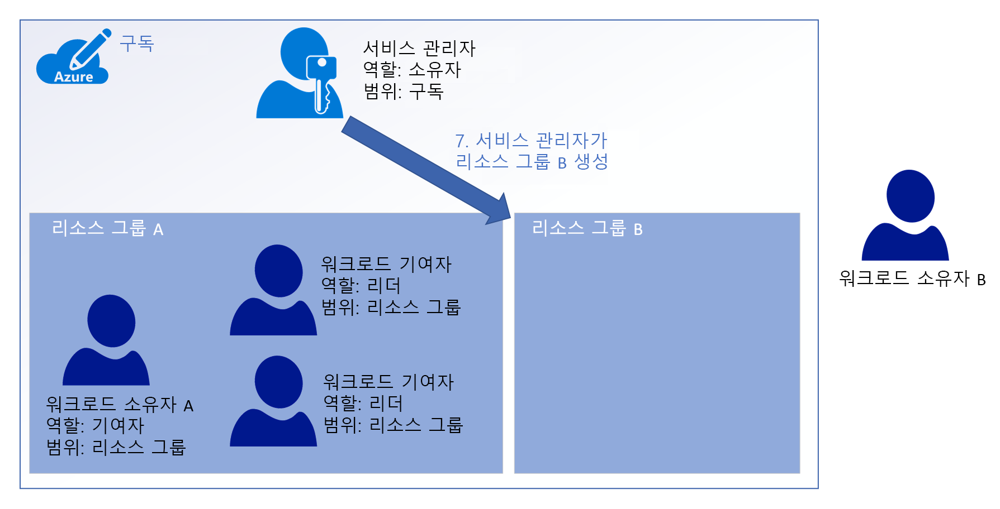

8. **서비스 관리자**는 **워크로드 소유자 B**를 **리소스 그룹 B**에 추가하고 [기본 제공 기여자 역할](https://docs.microsoft.com/en-us/azure/role-based-access-control/built-in-roles#contributor)을 할당합니다. 

이 시점에서 각 워크로드 소유자는 해당 고유 리소스 그룹에서 격리됩니다. 워크로드 소유자 또는 팀 멤버 중 누구도 다른 모든 리소스에서 관리 액세스 권한이 없습니다. 

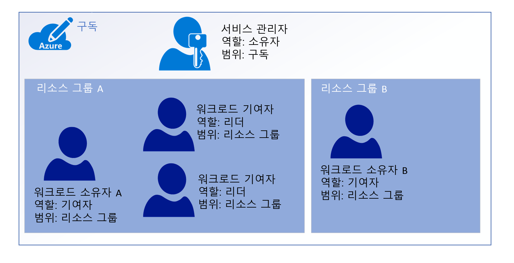
*그림 4. 해당 리소스 그룹 자체와 격리된 두 워크로드 소유자가 있는 구독입니다.*

이 모델은 최소 권한 모델입니다 - 각 사용자에게 올바른 리소스 관리 범위에서 올바른 사용 권한이 할당됩니다.

그러나 이 예제의 모든 작업을 **서비스 관리자**가 수행한 것은 좋습니다. 이 예제는 간단하며, 워크로드 소유자가 두 명밖에 없었기 때문에 문제처럼 보이지 않을 수 있는 반면 대규모 조직의 경우에 이런 문제 유형이 발생한다는 것은 쉽게 상상할 수 있습니다. 예를 들어 **서비스 관리자**는 요청의 큰 백로그가 있는 병목 상태가 되어 결국 지연될 수 있습니다.  

**서비스 관리자**가 수행하는 작업의 수를 줄여주는 두 번째 예제를 살펴보겠습니다. 

1. 이 모델에서 **워크로드 소유자 A**에게는 고유한 리소스 그룹인 **리소스 그룹 A**를 만들 수 있도록 구독 범위에서 [기본 제공 소유자 역할][rbac-built-in-owner]이 할당되었습니다. 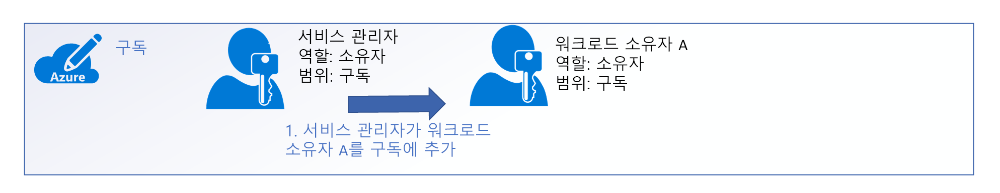

2. **리소스 그룹 A**를 만들면 **워크로드 소유자 A**는 기본적으로 추가되고 구독 범위에서 [기본 제공 소유자][rbac-built-in-owner] 역할을 상속받습니다.
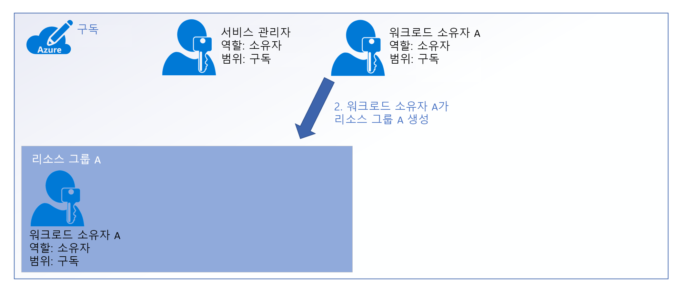

3. [기본 제공 소유자 역할][rbac-built-in-owner]은 리소스 그룹에 대한 액세스를 관리하는 사용 권한을 **워크로드 소유자 A**에게 부여합니다. **워크로드 소유자 A**는 두 명의 **워크로드 기여자**를 추가하고 이들 각각에 [기본 제공 읽기 역할][rbac-built-in-owner]을 할당합니다. 
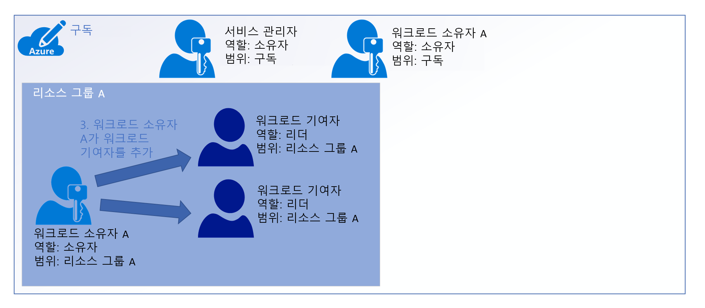

4. **서비스 관리자**는 이제 **워크로드 소유자 B**를 기본 제공 소유자 역할이 있는 구독에 추가합니다. 
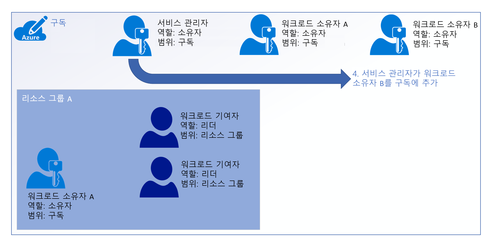

5. **워크로드 소유자 B**는 **리소스 그룹 B**를 만들고 기본적으로 추가됩니다. 다시 **워크로드 소유자 B**는 구독 범위에서 기본 제공 소유자 역할을 상속합니다.
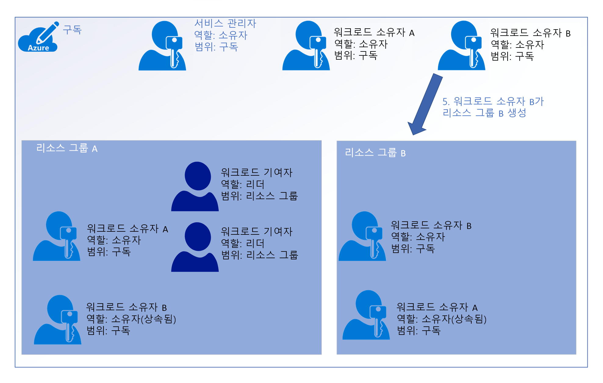

이 모델에서 **서비스 관리자**는 개별 워크로드 소유자 각각에 대한 관리 액세스의 위임으로 인해 첫 번째 예제에서 보다 더 적은 작업을 수행했습니다.

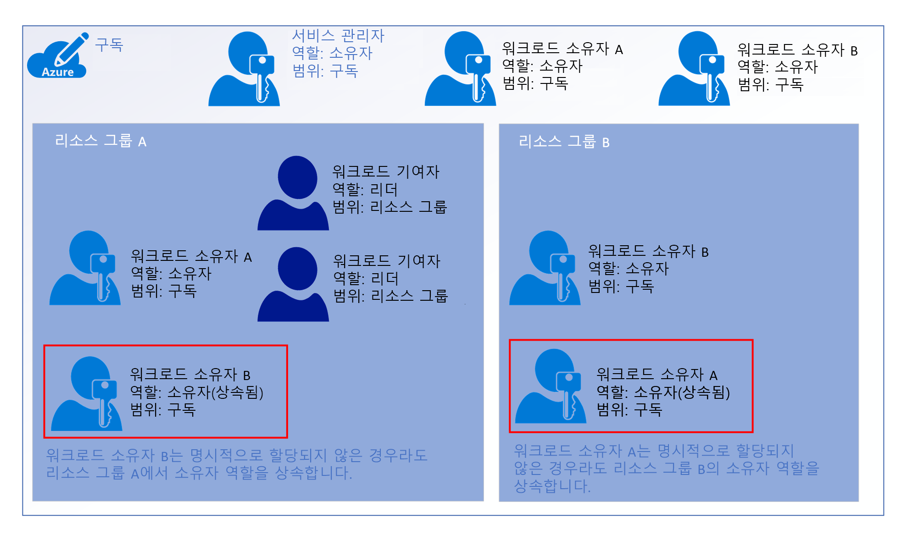
*그림 5. 기본 제공 소유자 역할이 모두 할당된 서비스 관리자 및 두 명의 워크로드 소유자가 있는 구독입니다.*

그러나 **워크로드 소유자 A** 및 **워크로드 소유자 B** 둘 다에게 구독 범위에서 기본 제공 소유자 역할이 할당됐기 때문에 이들 각자는 서로의 리소스 그룹에 대해 기본 제공 소유자 역할을 상속받았습니다. 즉, 서로의 리소스에 대한 모든 권한을 가질 뿐 아니라, 서로의 리소스 그룹에 대한 관리 액세스 위임할 수도 있습니다. 예를 들어 **워크로드 소유자 B**는 **리소스 그룹 A**에 다른 모든 사용자를 추가할 권한이 있으며 기본 제공 소유자 역할을 포함하여 모든 역할을 할당할 수 있습니다.

요구 사항과 각 예제를 비교하면 두 예제 모두 두 워크로드 소유자에 대한 리소스 액세스 권한을 부여할 권한이 있는 구독 범위에서 신뢰할 수 있는 단일 사용자를 지원한다는 것을 확인합니다. 두 워크로드 소유자 각자는 기본적으로 리소스 관리에 대한 액세스 권한이 없었으며 명시적으로 **서비스 관리자**에게 해당 권한을 할당하도록 요구했습니다. 그러나 첫 번째 예제만 어떤 워크로드 소유자도 다른 모든 워크로드의 리소스에 대해 액세스할 수 없도록 각 워크로드와 연결된 리소스가 서로에게서 격리되어야 하는 요구 사항을 지원합니다.

## 리소스 관리 모델

최소 권한의 사용 권한 모델을 디자인했으므로 이러한 거버넌스 모델로 이동해 몇 가지 실제적인 응용 프로그램을 살펴보겠습니다. 다음 세 가지 환경을 지원해야 한다는 요구 사항을 기억하십시오.
1. **공유 인프라:** 모든 워크 로드에서 공유하는 단일 리소스 그룹입니다. 이들은 네트워크 게이트웨이, 방화벽 및 보안 서비스 같은 리소스입니다.  
2. **개발:** 여러 비프로덕션 준비 워크로드를 나타내는 여러 리소스 그룹입니다. 이러한 리소스는 개념 증명, 테스트 및 다른 개발자 활동에 사용됩니다. 이러한 리소스에는 개발자 민첩성 향상을 허용하기 때문에 더 관대한 거버넌스 모델이 있을 수 있습니다.
3. **프로덕션:** 여러 프로덕션 워크로드를 나타내는 여러 리소스 그룹입니다. 이러한 리소스는 개인 및 공용 연결 응용 프로그램 아티팩트를 호스트하는 데 사용됩니다. 이러한 리소스에는 일반적으로 리소스, 응용 프로그램 코드 및 데이터를 무단 액세스로부터 보호하려면 가장 강력한 거버넌스 및 보안 모델이 있습니다.

이러한 세 가지 환경 각각의 경우 **워크로드 소유자**, **환경** 또는 둘 다에 의한 비용 데이터 추적 요구 사항이 있습니다. 즉, **공유 인프라**의 지속적인 비용, **개발** 및 **프로덕션** 환경 모두에서 개인에 의해 발생한 비용 및 마지막으로 **개발** 및 **프로덕션**의 전반적인 비용에 대해 알고 싶습니다. 

리소스가 **구독** 및 **리소스 그룹**, 두 수준으로 구분된다는 것을 이미 알게 됐습니다. 따라서 첫 번째로 **구독**으로 환경을 구성하는 방법을 결정합니다. 단일 구독 또는 여러 구독 등의 두 가지 가능성만 있습니다. 

이러한 모델 각각의 예를 살펴보기 전에 Azure에서 구독에 대한 관리 구조를 검토해봅시다. 

구독을 담당하는 조직의 개인이 있으며 이 사용자가 Azure AD 테넌트의 **구독 소유자**를 소유한다는 것을 요구 사항에서 회수합니다. 그러나 이 계정에서는 구독을 만들 권한이 없습니다. **Azure 계정 소유자**만 이 작업을 수행할 권한이 있습니다. 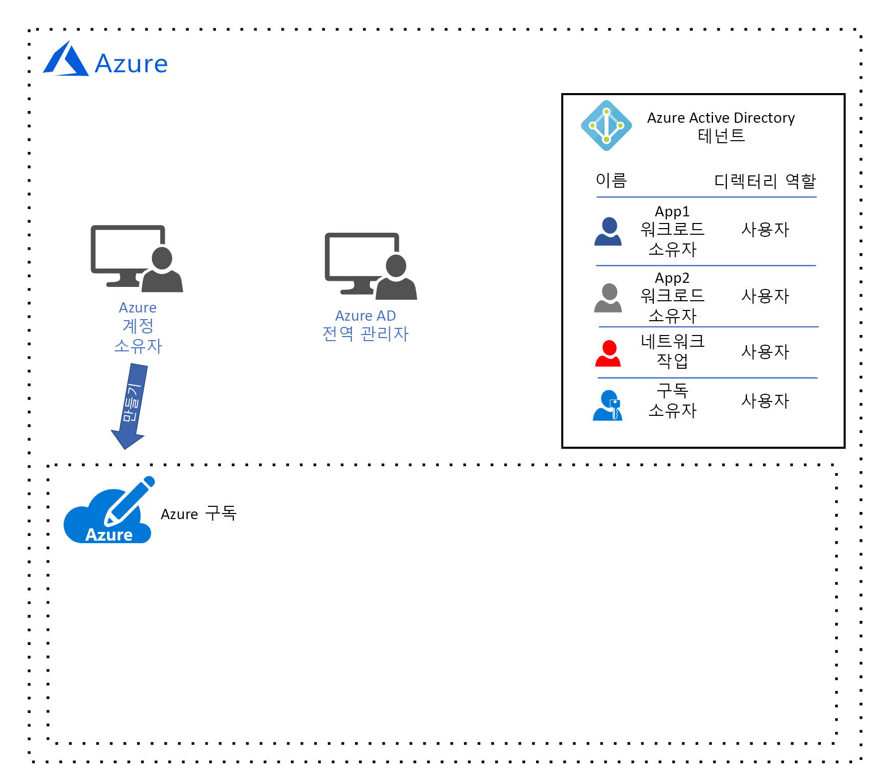
*그림 6. Azure 계정 소유자가 구독을 만듭니다.*

구독을 만들었으면 **Azure 계정 소유자**는 **구독 소유자** 계정을 **소유자** 역할이 있는 구독에 추가할 수 있습니다.

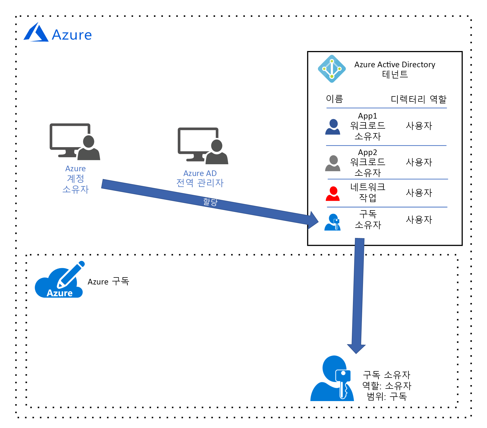
*그림 7. Azure 계정 소유자는 **구독 소유자** 사용자 계정을 **소유자** 역할이 있는 구독에 추가합니다.*

**구독 소유자**는 이제 **리소스 그룹**을 만들고 리소스 액세스 관리를 위임할 수 있습니다.

먼저, 단일 구독을 사용하여 예제 리소스 관리 모델을 살펴봅시다. 첫 번째로 세 가지 환경에 리소스 그룹을 정렬하는 방법을 결정합니다. 다음 두 가지 옵션이 있습니다.
1. 단일 리소스 그룹에 각 환경을 정렬합니다. 모든 공유 인프라 리소스를 단일 **공유 인프라** 리소스 그룹에 배포합니다. 개발 워크로드와 연결된 모든 리소스를 단일 **개발** 리소스 그룹에 배포합니다. 프로덕션 워크로드와 연결된 모든 리소스를 **프로덕션** 환경에 대한 단일 **프로덕션** 리소스 그룹에 배포합니다. 
2. 각 세 환경과 리소스 그룹을 정렬하려면 명명 규칙 및 태그를 사용하여 별도 리소스 그룹과 워크로드를 정렬합니다.  

첫 번째 옵션 평가로 시작합시다. 기본 제공 **기여자** 또는 **판독기** 역할을 사용하여 리소스 그룹을 만들고 이 그룹에 사용자를 추가하는 단일 구독 서비스 관리자를 통해 이전 섹션에서 논의한 사용 권한 모델을 사용할 예정입니다. 

1. 배포된 첫 번째 리소스 그룹은 **공유 인프라** 환경을 나타냅니다. **구독 소유자**는 **netops-shared-rg**라는 공유 인프라 리소스에 대한 리소스 그룹을 만듭니다. 
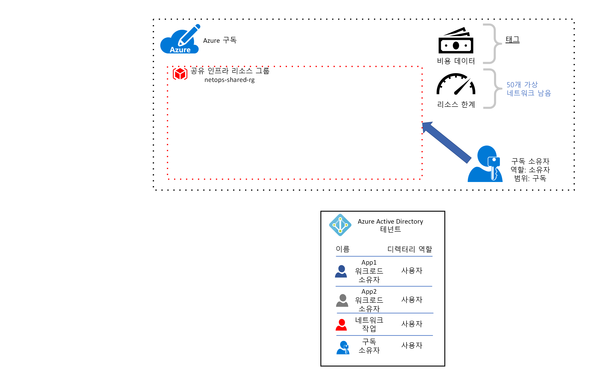
2. **구독 소유자**는 **네트워크 작업 사용자** 계정을 리소스 그룹에 추가하고 **기여자** 역할을 할당합니다. 
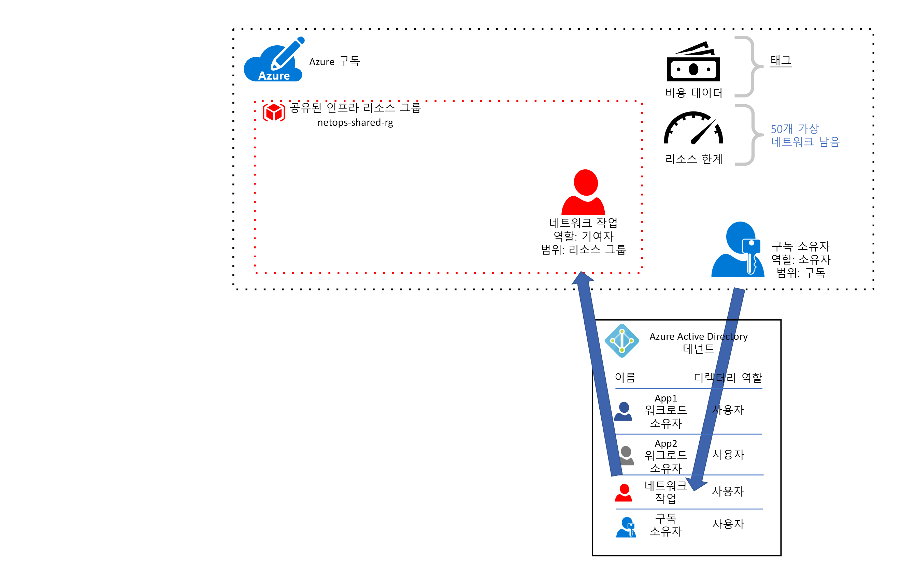
3. **네트워크 작업 사용자**는 [VPN 게이트웨이](/azure/vpn-gateway/vpn-gateway-about-vpngateways)를 만들고 온-프레미스 VPN 어플라이언스에 연결하도록 구성합니다. **네트워크 작업** 사용자는 한 쌍의 [태그](/azure/azure-resource-manager/resource-group-using-tags)를 각 리소스, *environment:shared* 및 *managedBy:netOps*에 적용합니다. **구독 서비스 관리자**가 비용 보고서를 내보내는 경우 비용은 이러한 태그 각각에 맞춰 정렬됩니다. 이렇게 하면 **구독 서비스 관리자**가 *환경* 태그 및 *managedBy* 태그를 사용하여 비용을 피벗할 수 있습니다. **리소스 제한**은 그림의 맨 위 오른쪽에 카운터됩니다. 각 Azure 구독에는 [제한 서비스](/azure/azure-subscription-service-limits)가 있으며, 이러한 제한의 효과를 이해하도록 도우려면 각 구독에 대해 가상 네트워크 제한을 따릅니다. 기본 제한 값은 구독당 50대 가상 네트워크이며 첫 번째 가상 네트워크를 배포한 후 이제 49대를 사용할 수 있습니다.
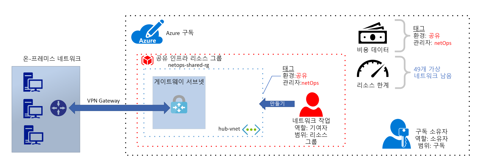
4. 두 개 더 많은 리소스 그룹을 배포하면 첫 번째 그룹은 *prod rg*라고 명명합니다. 이 리소스 그룹은 **프로덕션** 환경에 맞춰 정렬됩니다. 두 번째 그룹은 *dev-rg*라고 명명하며 **개발** 환경에 맞춰 정렬됩니다. 프로덕션 작업와 연결된 모든 리소스는 **프로덕션** 환경에 배포되고 개발 워크로드와 연결된 모든 리소스는 **개발** 환경에 배포됩니다. 이 예에서 두 개의 워크로드를 이러한 두 환경 각각에 배포하므로 모든 Azure 구독 서비스 제한이 발생하지 않습니다. 그러나이 각 리소스 그룹이 리소스 그룹당 800개 리소스라는 제한이 있음을 고려하는 것이 중요합니다. 따라서 각 리소스 그룹에 계속 워크로드를 추가하는 경우 이 제한에 도달될 가능성이 있습니다. 
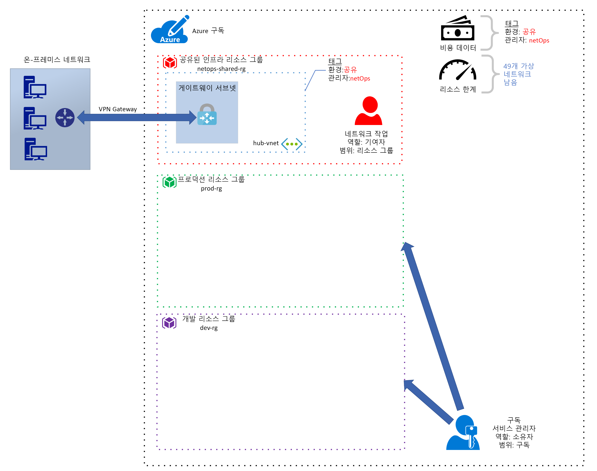
5. 첫 번째 **워크로드 소유자**는 요청을 **구독 서비스 관리자**에게 보내고 **기여자** 역할이 있는 **개발** 및 **프로덕션** 환경 리소스 그룹 각각에 추가됩니다. 앞에서 살펴본 것처럼 **기여자** 역할은 다른 사용자에게 역할을 할당하지 않고 사용자가 모든 작업을 수행하게 합니다. 첫 번째 **워크로드 소유자**는 이제 해당 워크로드와 연결된 리소스를 만들 수 있습니다.
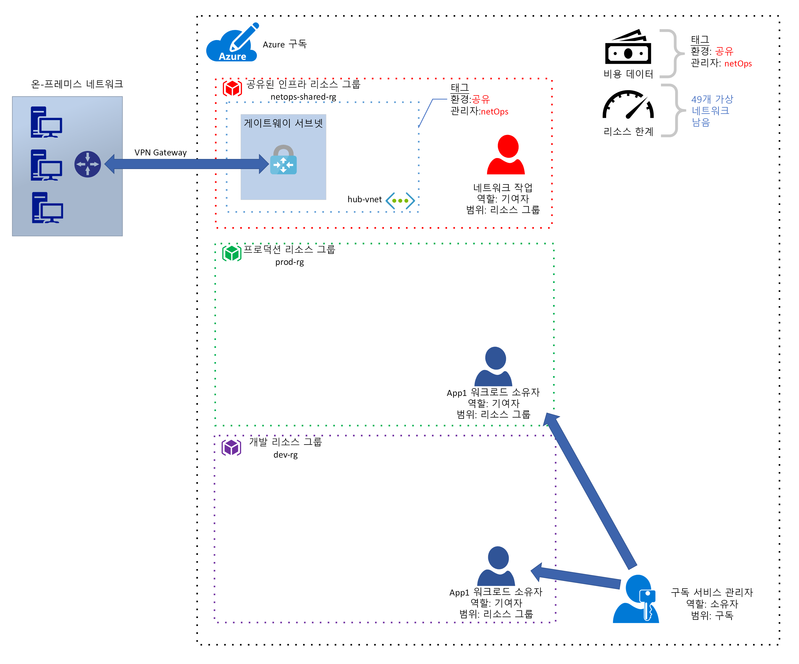
6. 첫 번째 **워크로드 소유자**는 각각에 가상 머신 쌍이 포함된 두 리소스 그룹의 각각에서 가상 네트워크를 만듭니다. 첫 번째 **워크로드 소유자**는 *환경* 및 *managedBy* 태그를 모든 리소스에 적용합니다. Azure 서비스 제한 카운터는 이제 남은 가상 네트워크 47대를 나타내고 있습니다.
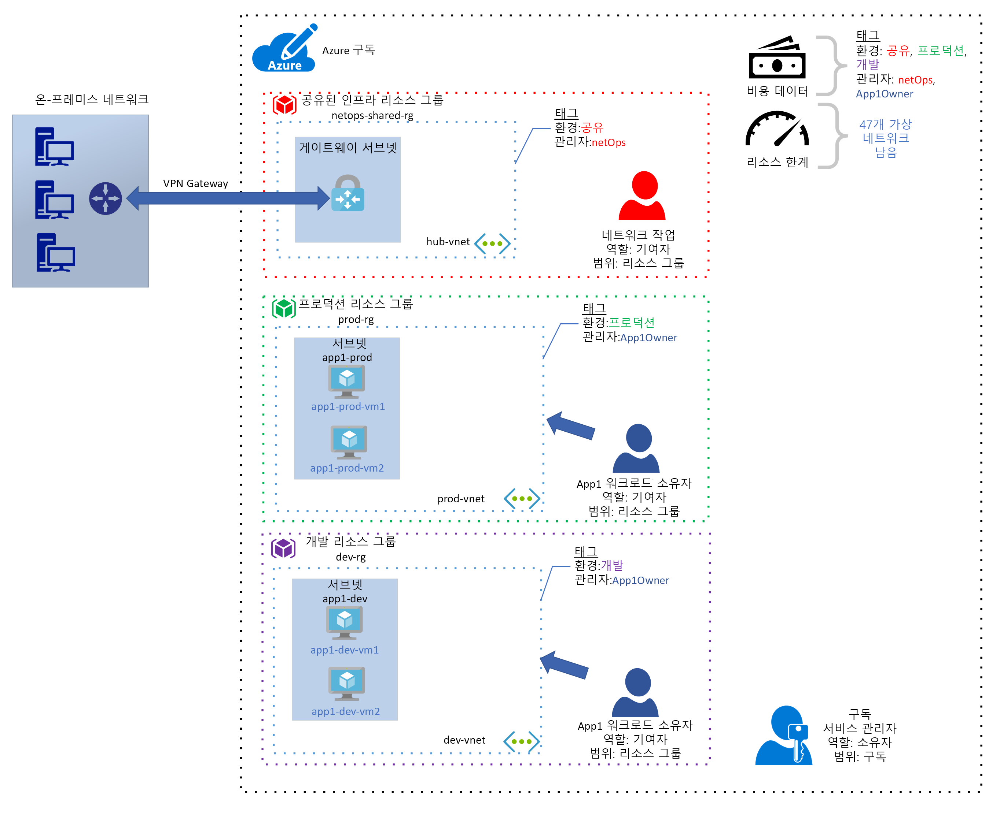
7. 각 가상 네트워크는 생성될 때 온-프레미스에 연결되지 않습니다. 이 유형의 아키텍처에서 각 가상 네트워크는 **공유 인프라** 환경에서 *hub-vnet*에 피어링되어야 합니다. 가상 네트워크 피어링은 두 개의 별도 가상 네트워크 간에 연결을 만들고 두 네트워크 간에 이동하는 네트워크 트래픽을 허용합니다. 가상 네트워크 피어링은 기본적으로 전이적이지 않습니다. 피어링은 연결된 두 가상 네트워크 각각에 지정돼야 하며, 가상 네트워크 중 하나만 피어링을 지정하는 경우 연결이 불완전하게 됩니다. 이 설정의 효과를 설명하려면 첫 번째 **워크로드 소유자**는 **prod-vnet** 및 **hub-vnet** 간에 피어링을 지정합니다. 첫 번째 피어링이 생성됐지만 **hub-vnet**에서 **prod-vnet**까지 보완 피어링이 아직 지정되지 않았기 때문에 트래픽 흐름이 없습니다. 첫 번째 **워크로드 소유자**는 **네트워크 작업** 사용자에게 문의하여 이 보완 피어링 연결을 요청합니다.
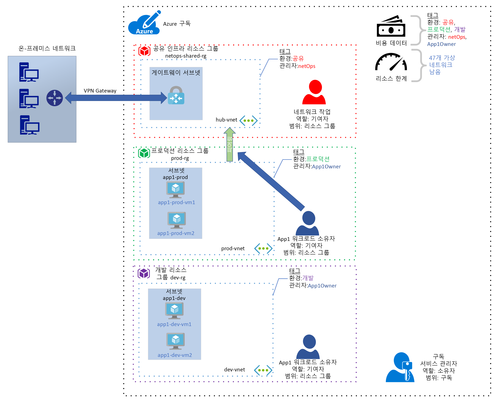
8. **네트워크 작업** 사용자는 이 요청을 검토하고 승인한 다음, **hub-vnet**에 대한 설정에서 피어링을 지정합니다. 피어링 연결이 완료되면 네트워크 트래픽이 두 가상 네트워크 사이를 이동합니다.
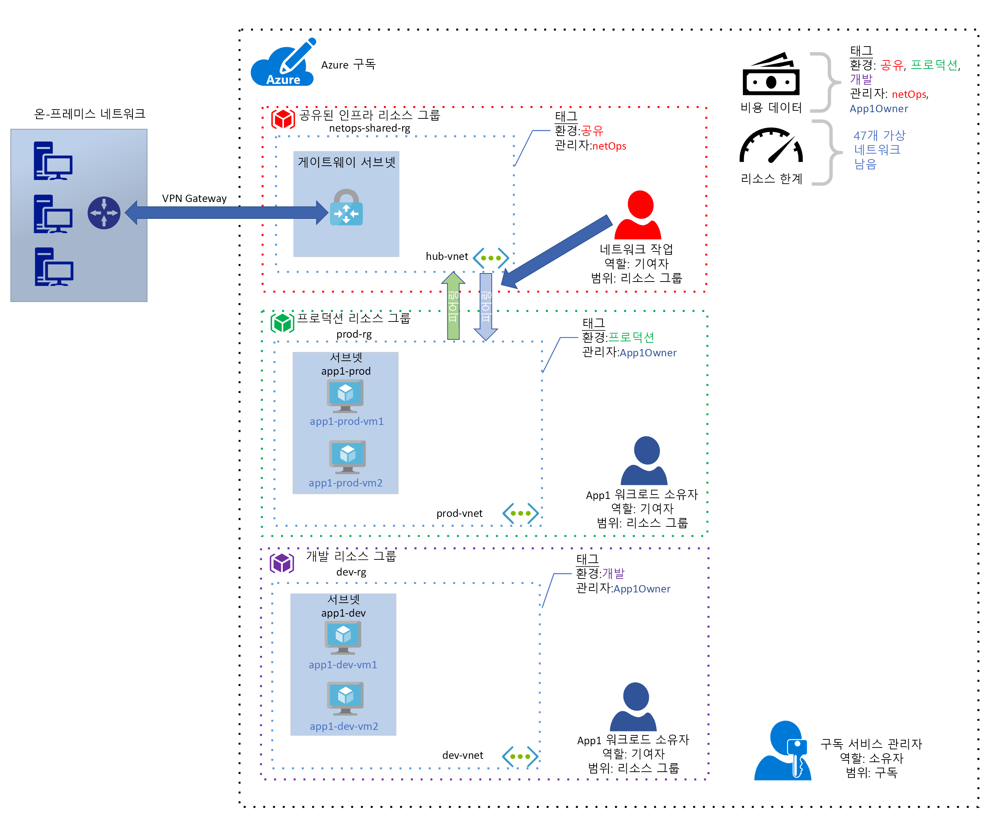
9. 첫 번째 **워크로드 소유자**는 요청을 **구독 서비스 관리자**에게 보내고 **기여자** 역할이 있는 기존의 **개발** 및 **프로덕션** 환경 리소스 그룹에 추가됩니다. 두 번째 **워크로드 소유자**는 각 리소스 그룹의 첫 번째 **워크로드 소유자**와 동일한 권한을 모든 리소스에 대해 갖습니다. 
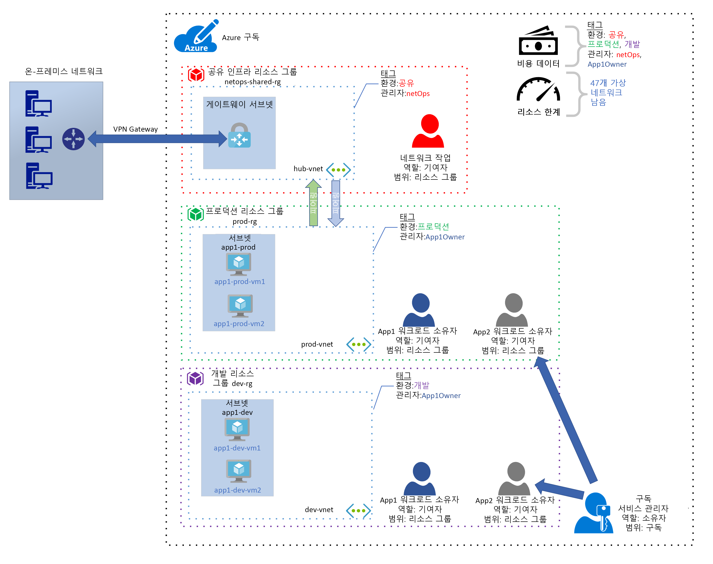
10. 두 번째 **워크로드 소유자**는 **prod-vnet** 가상 네트워크에서 서브넷을 만든 다음, 두 대의 가상 머신을 추가합니다. 두 번째 **워크로드 소유자**는 *환경* 및 *managedBy* 태그를 각 리소스에 적용합니다.
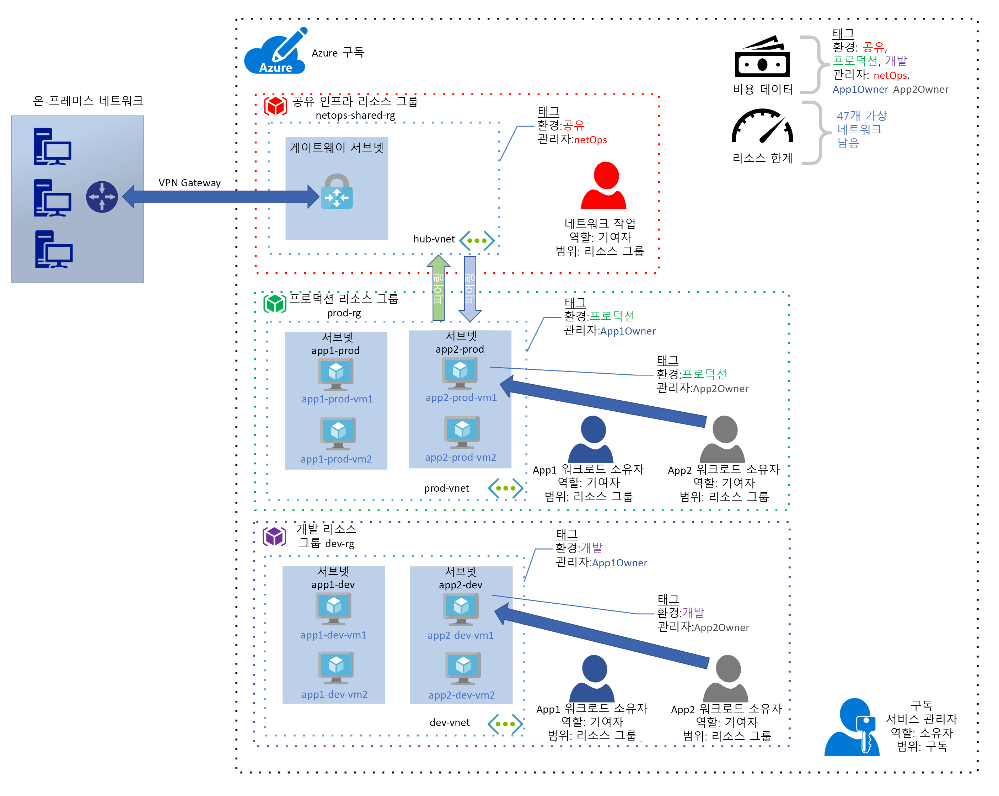 

이 예제 리소스 관리 모델은 세 가지 필수 환경에서 리소스를 관리할 수 있게 합니다. 공유 인프라 리소스는 구독에서 해당 리소스에 액세스할 수 있는 권한이 있는 단일 사용자만 있기 때문에 보호됩니다. 각 워크로드 소유자는 실제 공유 리소스에 대해 아무런 사용 권한이 없이 공유 인프라 리소스를 활용할 수 있습니다. 이 관리 모델은 워크로드 격리에 대한 요구 사항을 충족하지 못합니다 - 두 **워크로드 소유자** 각각은 상대방의 워크로드 리소스에 액세스할 수 있습니다. 

즉시 알 수 없는 이 모델에 대해 다른 중요한 고려 사항이 있습니다. 예제에서 온-프레미스에 연결을 제공하기 위해 **hub-vnet**과 네트워크 피어링 연결을 요청한 것은 **app1 워크로드 소유자**였습니다. **네트워크 작업** 사용자는 해당 워크로드에 배포된 리소스에 기반한 해당 요청을 평가했습니다. **구독 소유자**가 **기여자** 역할이 있는 **app2 워크로드 소유자**를 추가한 경우 **prod-rg** 리소스 그룹에서 모든 리소스에 대한 관리 액세스 권한은 해당 사용자에게 있습니다. 

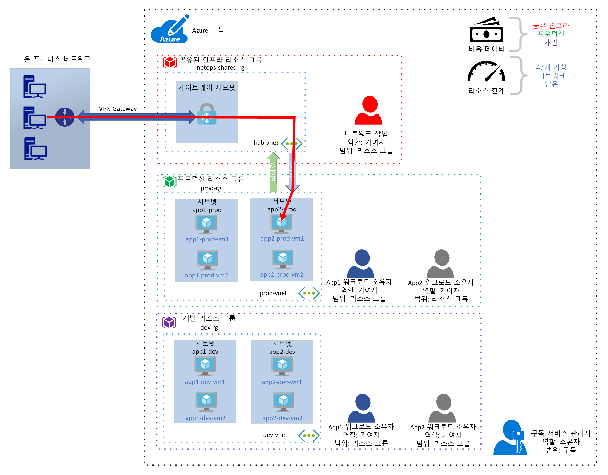

즉, **app2 워크로드 소유자**에게는 **prod-vnet** 가상 네트워크에서 가상 머신을 사용하여 자체 서브넷을 배포할 권한이 있습니다. 기본적으로 해당 가상 머신은 이제 온-프레미스 네트워크에 대한 액세스 권한이 있습니다. **네트워크 작업** 사용자는 해당 머신을 인식하지 못하고 있으며 온-프레미스에 연결을 승인하지 않았습니다.

다음으로, 다양한 환경 및 워크로드에 대한 여러 리소스 그룹을 사용하여 단일 구독에 대해 살펴보겠습니다. 이전 예제에서 각 환경에 대한 리소스는 동일한 리소스 그룹에 있었기 때문에 쉽게 식별할 수 있었습니다. 더 이상 해당 그룹화가 없으므로 해당 기능을 제공하려면 리소스 그룹 명명 규칙에 따라야 합니다. 

1. **공유 인프라** 리소스는 이 모델에서 별도 리소스 그룹이 아직 없으므로 동일하게 유지됩니다. 각 워크로드는 **개발** 및 **프로덕션** 환경 각각에 대해 하나씩, 두 리소스 그룹이 필요합니다. 첫 번째 워크로드의 경우 **구독 소유자**는 두 리소스 그룹을 만듭니다. 첫 번째는 **app1-prod-rg**라고 명명하고 두 번째는 **app1-dev-rg**로 명명합니다. 앞에서 설명한 대로 이 명명 규칙은 리소스를 첫 번째 워크로드 **app1** 및 **dev** 또는 **prod** 환경 중 하나와 연결된 것으로 식별합니다. 다시, *구독* 소유자는 **app1 워크로드 소유자**를 **기여자** 역할이 있는 리소스 그룹에 추가합니다.
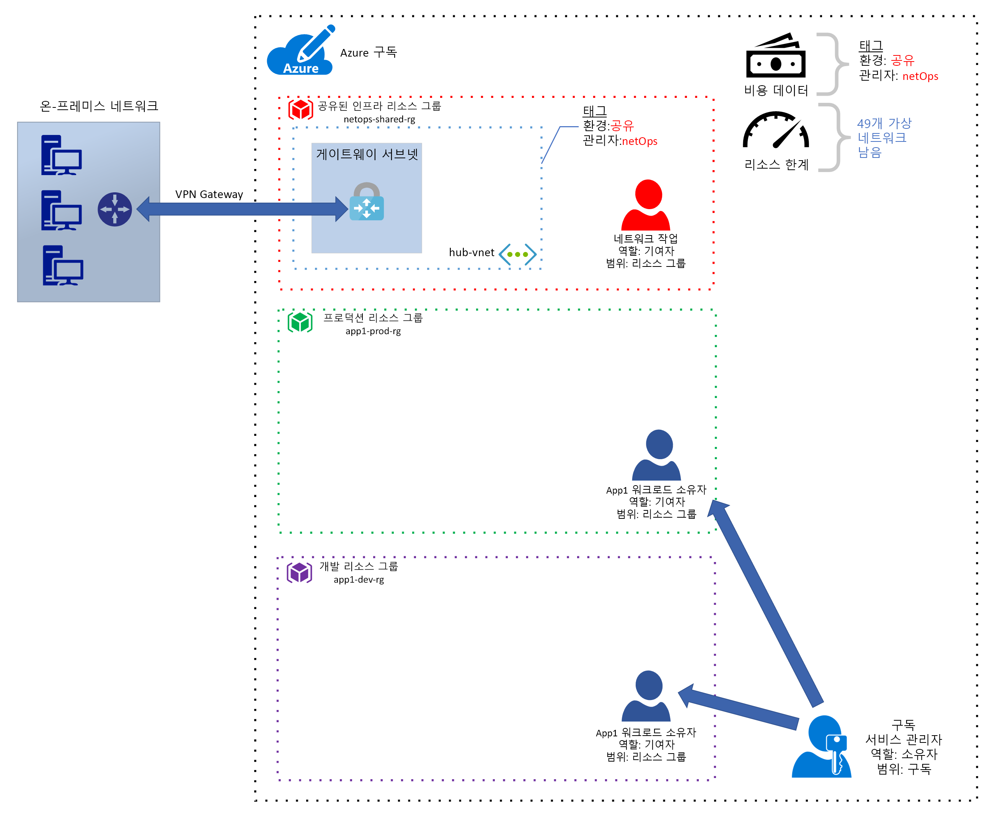
2. 첫 번째 예제와 비슷하게 **app1 워크로드 소유자**는 **app1-prod-vnet**이라는 가상 네트워크를 **프로덕션** 환경에 배포하고 **app1-dev-vnet**이라는 다른 가상 네트워크는 **개발** 환경에 배포합니다. 다시, **app1 워크로드 소유자**는 피어링 연결을 만들려면 **네트워크 작업**에 요청을 전송합니다. **app1 워크로드 소유자**가 첫 번째 예제에서와 동일한 태그를 추가하고 제한 카운터는 구독에 남아 있는 47대 가상 네트워크로 감소됐습니다.

3. **구독 소유자**는 이제 **app2 워크로드 소유자**에 대해 두 리소스 그룹을 만듭니다. **app1 워크로드 소유자**에 대해 동일한 규칙을 따르는 리소스 그룹은 **app2-prod-rg** 및 **app2-dev-rg**로 명명됩니다. **구독** 소유자는 **app2 워크로드 소유자**를 **기여자** 역할이 있는 리소스 그룹 각각에 추가합니다.
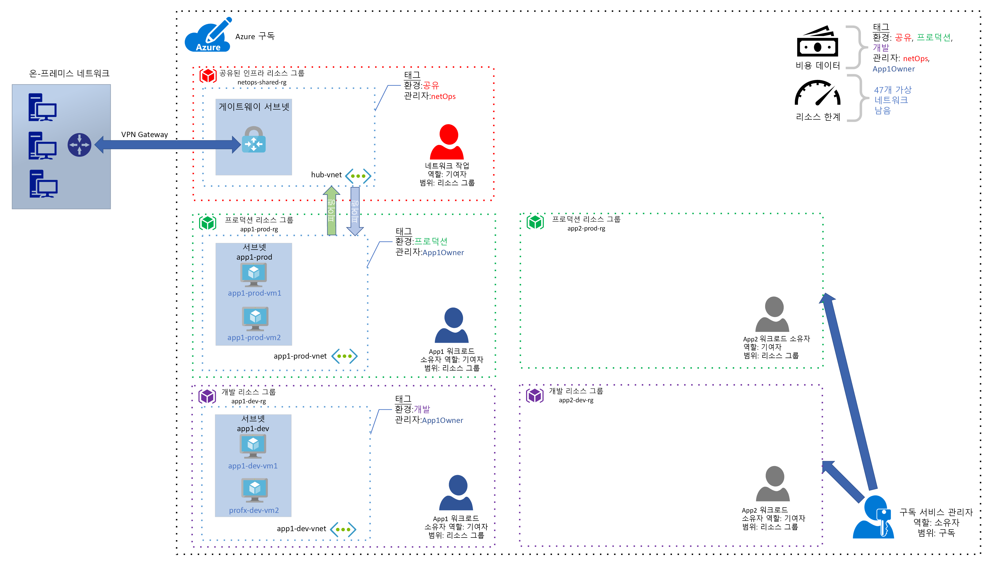
4. *App2 워크로드 소유자*는 동일한 명명 규칙을 사용하여 리소스 그룹에 가상 네트워크와 가상 머신을 배포합니다. 태그가 추가되고 제한 카운터는 *구독*에 남아 있는 45대 가상 네트워크로 감소됐습니다.
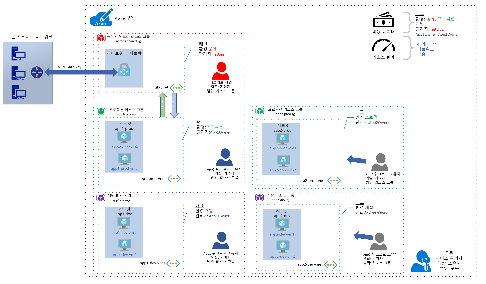
5. *App2 워크로드 소유자*는 *네트워크 작업* 사용자에게 요청을 전송하여 *hub-vnet*으로 *app2-prod-vnet*을 피어링합니다. *네트워크 작업* 사용자는 피어링 연결을 만듭니다.
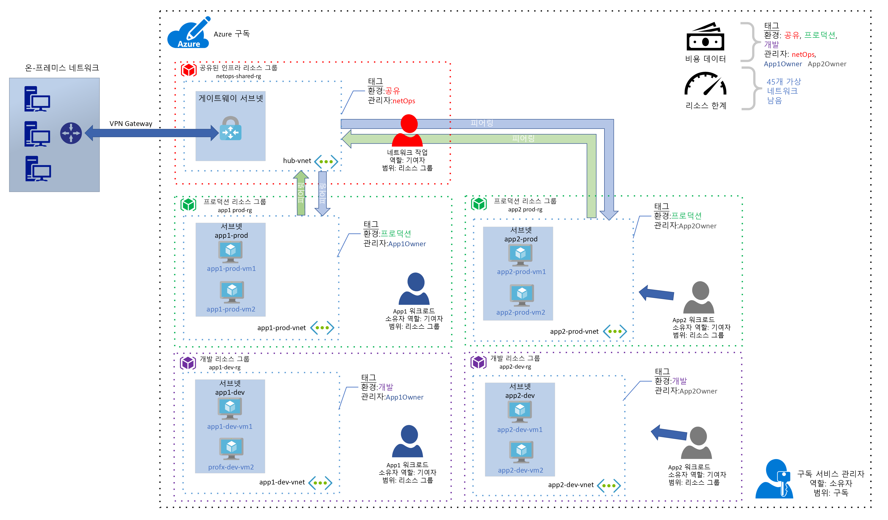

결과 관리 모델은 첫 번째 예제와 유사하며 다음과 같은 몇 가지 주요 차이점이 있습니다.
* 두 워크로드 각각은 워크로드 및 환경에 의해 격리됩니다.
* 이 모델에는 첫 번째 예제 모델보다 두 개 더 많은 가상 네트워크가 필요합니다. 두 워크로드만으로 중요한 차이가 아닐 수 있지만 이 모델에 대한 워크로드 수의 제한은 이론적으로 24입니다. 
* 리소스는 각 환경에 대한 단일 리소스 그룹에서 더 이상 그룹화되지 않습니다. 리소스 그룹화에는 각 환경에 사용된 명명 규칙에 대한 이해가 필요합니다. 
* 피어링된 가상 네트워크 연결 각각은 *네트워크 작업* 사용자에 의해 검토 및 승인됐습니다.

여러 구독을 사용하여 리소스 관리 모델을 살펴봅시다. 이 모델에서는 **공유 서비스** 구독, **프로덕션** 구독 및 마지막으로 **개발** 구독의 세 가지 환경 각각을 별도 구독에 맞춰 정렬하겠습니다. 이 모델에 대한 고려 사항은 워크로드에 맞춰 리소스 그룹을 정렬하는 방법을 결정해야 하는 단일 구독을 사용한 모델과 유사합니다. 각 워크로드에 대한 리소스 그룹의 생성은 워크로드 격리 요구 사항을 충족하는 것으로 이미 결정했으므로 이 예제에서는 해당 모델을 계속 사용하겠습니다.

1. 이 모델에는 *공유 인프라*, *프로덕션* 및 *개발*의 세 가지 *구독*이 있습니다. 이러한 세 가지 구독 각각은 *구독 소유자*를 필요로 하며, 간단한 예제에서는 세 가지 모두에 대해 동일한 사용자 계정을 사용하겠습니다. *공유 인프라* 리소스는 위의 첫 두 가지 예제와 마찬가지로 관리됩니다. 첫 번째 워크로드는 *프로덕션* 환경에서 *app1-rg*, *개발* 환경에서 동일한 이름의 리소스 그룹과 연결됩니다. *app1 워크로드 소유자*는 *기여자* 역할이 포함된 리소스 그룹 각각에 추가됩니다. 
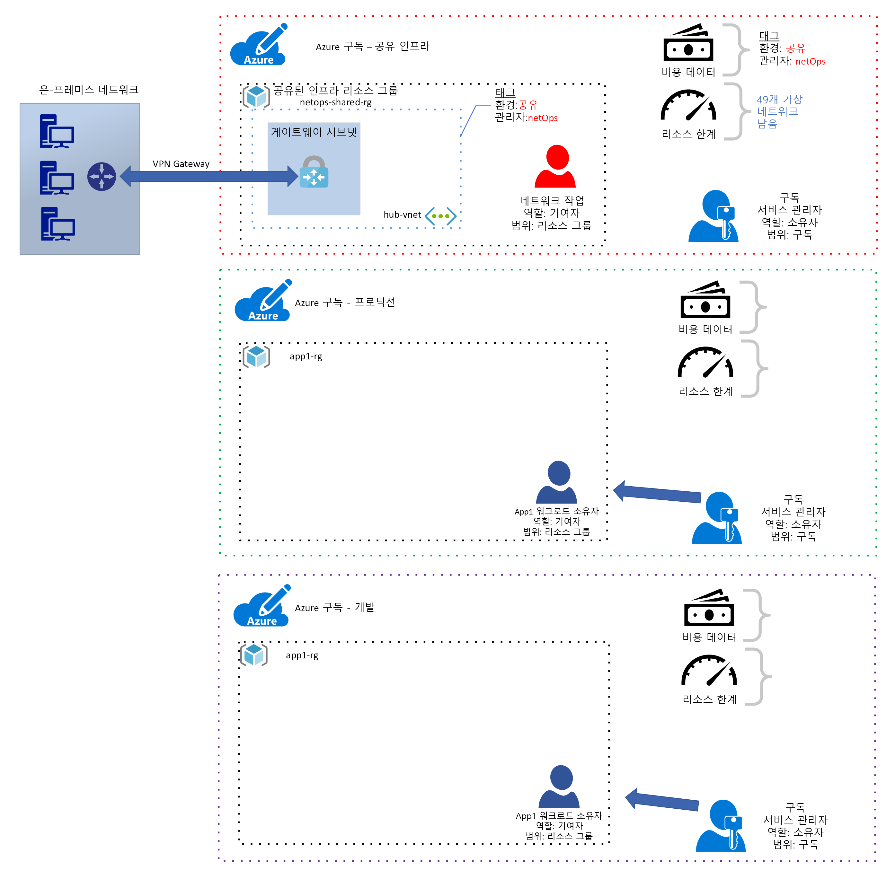
2. 이전 예제에서와 마찬가지로 *app1 워크로드 소유자*는 요청을 만들고 *공유 인프라* 가상 네트워크와 피어링 연결을 요청합니다. *App1 워크로드 소유자*는 *환경* 태그가 더 이상 필요하지 않기 때문에 *managedBy* 태그만 추가합니다. 즉, 리소스는 각 환경에 대해 동일한 *구독*에서 그룹화되어 있으며 *환경* 태그는 중복됩니다. 제한 카운터는 남은 가상 네트워크 49대로 감소됩니다.
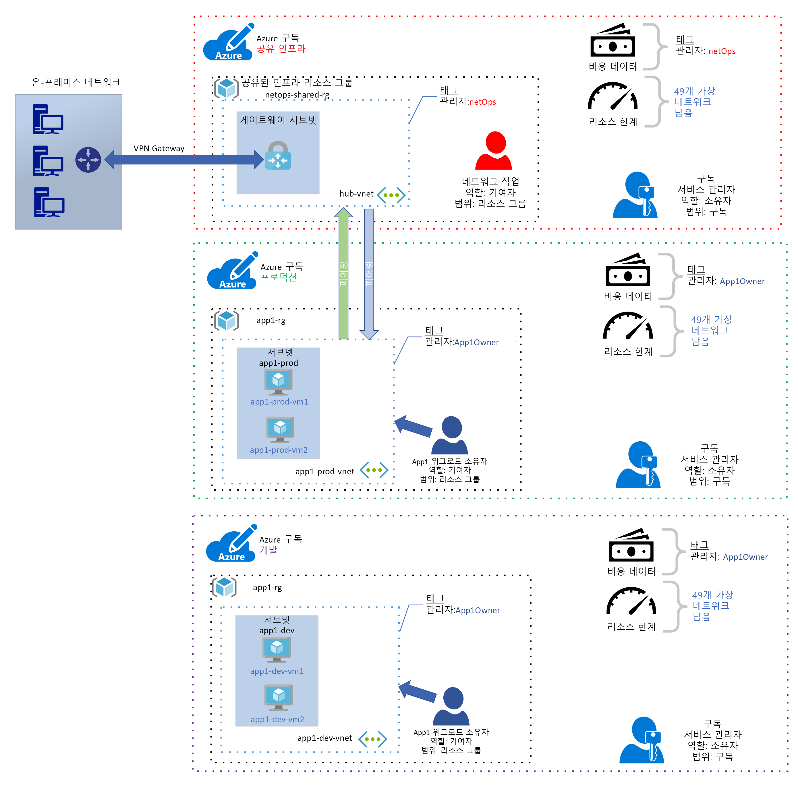
3. 마지막으로 *구독 소유자*는 두 번째 워크로드에 대해 프로세스를 반복하면서 *기여자 역할에서 *app2 워크로드 소유자*를 사용하여 리소스 그룹을 추가합니다. 각 환경 구독에 대한 제한 카운터는 남은 가상 네트워크 48대로 감소됩니다. 

이 관리 모델에는 위의 두 번째 예제의 이점이 있습니다. 그러나 중요한 차이점은 두 개의 *구독*으로 분산되어 있다는 사실 때문에 제한이 사소한 문제라는 것입니다. 단점은 태그에서 추적한 비용 데이터가 세 가지 *구독* 모두에서 집계되어야 한다는 것입니다. 

따라서 요구 사항 우선 순위에 따라 이러한 두 가지 예제 리소스 관리 모델 중에서 하나를 선택할 수 있습니다. 조직이 단일 구독에 대한 서비스 제한에 도달하지 않을 것으로 예상하는 경우 여러 리소스 그룹이 포함된 단일 구독을 사용할 수 있습니다. 반대로, 조직이 많은 워크로드를 예상하는 경우 각 환경에 대해 여러 구독이 더 좋을 수 있습니다.

<!-- ## Summary

## Next steps -->

<!-- links -->

[rbac-built-in-owner]: /azure/role-based-access-control/built-in-roles#owner
[rbac-built-in-roles]: /azure/role-based-access-control/built-in-roles
