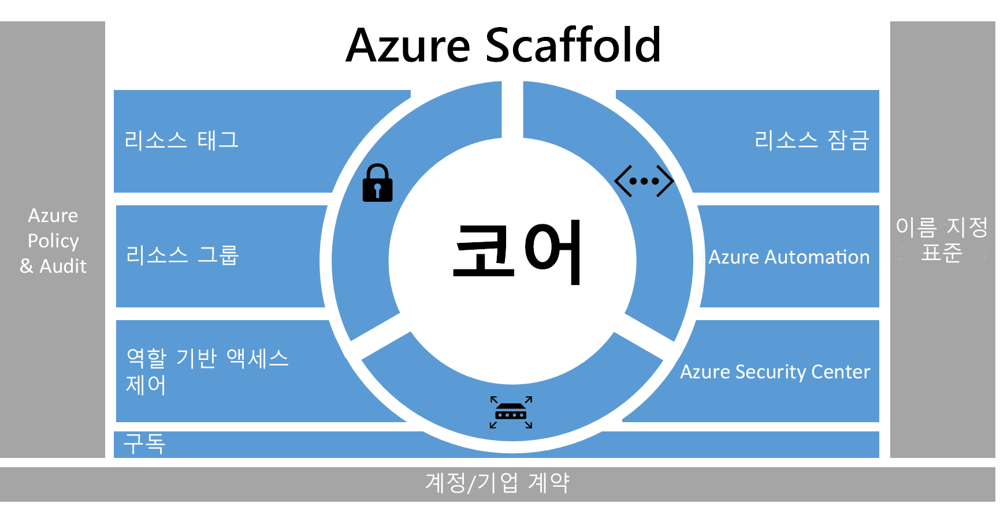
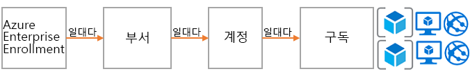
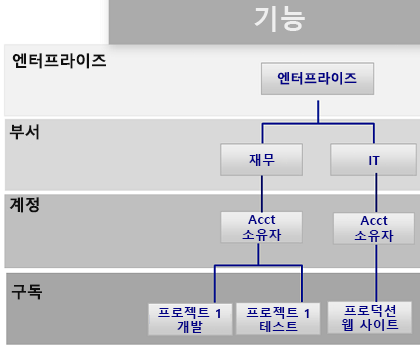
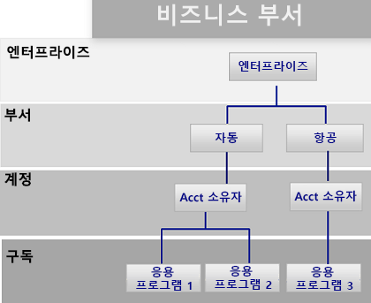
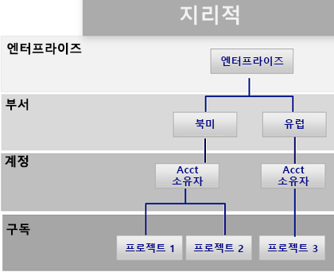
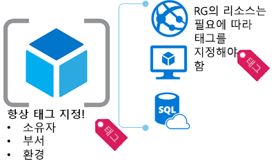
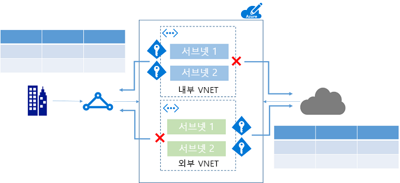

# Azure 엔터프라이즈 스캐폴드 - 규범적 구독 거버넌스Azure enterprise scaffold - prescriptive subscription governance
기업은 민첩성과 유연성을 위해 공용 클라우드 도입을 확대하고 있습니다.Enterprises are increasingly adopting the public cloud for its agility and flexibility. 또한 수익을 창출하고 비즈니스에 맞게 리소스를 최적화하는 클라우드의 장점을 활용하고 있습니다.They are utilizing the cloud's strengths to generate revenue or optimize resources for the business. Microsoft Azure는 광범위한 워크로드 및 응용 프로그램을 처리할 구성 요소와 같이 기업에서 조합할 수 있는 다양한 서비스를 제공합니다.Microsoft Azure provides a multitude of services that enterprises can assemble like building blocks to address a wide array of workloads and applications. 

하지만 대체로 시작점을 찾기가 어렵습니다.But, knowing where to begin is often difficult. Azure를 사용하기로 결정한 후에는 일반적으로 몇 가지 질문을 제기합니다.After deciding to use Azure, a few questions commonly arise:

* "특정 국가에서 데이터 독립성에 대한 법률 요구 사항을 충족하려면 어떻게 해야 하나요?""How do I meet our legal requirements for data sovereignty in certain countries?"
* "누군가가 중요한 시스템을 실수로 변경하지 않도록 보장하려면 어떻게 해야 하나요?""How do I ensure that someone does not inadvertently change a critical system?"
* "내역을 확인하고 정확하게 청구할 수 있도록 모든 리소스가 지원하는 내용을 어떻게 파악하나요?""How do I know what every resource is supporting so I can account for it and bill it back accurately?"

가드 레일이 없는 비어 있는 구독을 전망하는 것은 어렵습니다.The prospect of an empty subscription with no guard rails is daunting. 이 빈 공간은 Azure로의 전환에 방해가 될 수 있습니다.This blank space can hamper your move to Azure.

이 문서는 기술 전문가가 관리에 대한 수요를 해결하고 민첩성에 대한 수요와 균형을 맞추기 위한 시작 지점을 제공합니다.This article provides a starting point for technical professionals to address the need for governance, and balance it with the need for agility. 조직이 자신의 Azure 구독을 구현 및 관리할 수 있도록 안내해 주는 엔터프라이즈 스캐폴드 개념을 소개합니다.It introduces the concept of an enterprise scaffold that guides organizations in implementing and managing their Azure subscriptions. 

## 관리 필요성Need for governance
Azure로 전환하는 경우 기업 내에서 클라우드를 성공적으로 사용하기 위해서는 먼저 관리 항목을 해결해야 합니다.When moving to Azure, you must address the topic of governance early to ensure the successful use of the cloud within the enterprise. 안타깝게도 포괄적인 관리 시스템을 만드는 데 시간과 절차가 따른다는 것은 일부 비즈니스 그룹이 엔터프라이즈 IT 적용 없이 공급업체로 직접 이동하는 것을 의미합니다.Unfortunately, the time and bureaucracy of creating a comprehensive governance system means some business groups go directly to vendors without involving enterprise IT. 이 방법을 사용할 경우 리소스가 제대로 관리되지 않는다면 기업은 취약점에 노출될 수 있습니다.This approach can leave the enterprise open to vulnerabilities if the resources are not properly managed. 공용 클라우드의 특성인 민첩성, 유연성 및 사용량 기반 가격 책정은 고객의 요구(내부 및 외부)를 신속하게 충족시켜야 하는 비즈니스 그룹에 중요합니다.The characteristics of the public cloud - agility, flexibility, and consumption-based pricing - are important to business groups that need to quickly meet the demands of customers (both internal and external). 하지만 엔터프라이즈 IT는 데이터와 시스템이 효과적으로 보호되도록 해야 합니다.But, enterprise IT needs to ensure that data and systems are effectively protected.

실제 상황에서 스캐폴딩은 기본 구조를 만드는 데 사용됩니다.In real life, scaffolding is used to create the basis of the structure. 스캐폴드는 일반적인 개요를 제시하고 보다 영구적인 시스템이 탑재되기 위한 기준점을 제공합니다.The scaffold guides the general outline, and provides anchor points for more permanent systems to be mounted. 엔터프라이즈 스캐폴드는 동일합니다. 환경에 구조를 제공하고 공용 클라우드에 기본 제공되는 서비스에 대한 앵커를 제공하는 Azure 기능과 유연한 컨트롤 집합입니다.An enterprise scaffold is the same: a set of flexible controls and Azure capabilities that provide structure to the environment, and anchors for services built on the public cloud. 이것은 제조사(IT 및 비즈니스 그룹)에 새로운 서비스를 만들고 연결하기 위한 기초를 제공합니다.It provides the builders (IT and business groups) a foundation to create and attach new services.

스캐폴드는 다양한 규모의 클라이언트와 수많은 협력을 통해 수집한 사례를 기반으로 합니다.The scaffold is based on practices we have gathered from many engagements with clients of various sizes. 클라이언트는 클라우드에서 솔루션을 개발하는 작은 조직부터 포천(Fortune)지 선정 500대 기업, 클라우드에서 솔루션을 마이그레이션하고 개발하는 독립 소프트웨어 공급업체까지 다양합니다.Those clients range from small organizations developing solutions in the cloud to Fortune 500 enterprises and independent software vendors who are migrating and developing solutions in the cloud. 엔터프라이즈 스캐폴드는 기존의 IT 워크로드와 기민한 워크로드(예: Azure 기능을 토대로 SaaS(Software-as-a-Service) 응용 프로그램을 작성하는 개발자)를 모두 유연하게 지원하기 위한 "용도로 작성"되었습니다.The enterprise scaffold is "purpose-built" to be flexible to support both traditional IT workloads and agile workloads; such as, developers creating software-as-a-service (SaaS) applications based on Azure capabilities.

엔터프라이즈 스캐폴드는 Azure 내에서 각각의 새로운 구독을 위한 기초로 고안된 것입니다.The enterprise scaffold is intended to be the foundation of each new subscription within Azure. 따라서 관리자는 비즈니스 그룹 및 개발자가 자신의 목표를 신속하게 충족하도록 하면서도 조직의 최소 관리 요구 사항을 충족하도록 할 수 있습니다.It enables administrators to ensure workloads meet the minimum governance requirements of an organization without preventing business groups and developers from quickly meeting their own goals.

> [!IMPORTANT]
> Azure의 성공을 위해서는 관리가 중요합니다.Governance is crucial to the success of Azure. 이 문서는 엔터프라이즈 스캐폴드의 기술적 구현을 대상으로 하지만 구성 요소 간 광범위한 프로세스 및 관계만 언급합니다.This article targets the technical implementation of an enterprise scaffold but only touches on the broader process and relationships between the components. 정책 관리는 위에서 아래로 흐르고 비즈니스가 달성하려는 내용에 따라 결정됩니다.Policy governance flows from the top down and is determined by what the business wants to achieve. 기본적으로 Azure에 대한 관리 모델 생성에는 IT의 역할이 포함되지만 무엇보다도 비즈니스 그룹 리더, 보안 및 위험 관리 역할이 더욱 중요합니다.Naturally, the creation of a governance model for Azure includes representatives from IT, but more importantly it should have strong representation from business group leaders, and security and risk management. 결과적으로 엔터프라이즈 스캐폴드는 비즈니스 위험을 완화하여 조직의 임무와 목표를 용이하게 하는 데 있습니다.In the end, an enterprise scaffold is about mitigating business risk to facilitate an organization's mission and objectives.
> 
> 

다음 이미지는 스캐폴드의 구성 요소를 설명합니다.The following image describes the components of the scaffold. 근본적으로 부서, 계정 및 구독에 대한 견고한 계획을 토대로 합니다.The foundation relies on a solid plan for departments, accounts, and subscriptions. 기본 요소는 Resource Manager 정책 및 강력한 이름 지정 표준으로 구성됩니다.The pillars consist of Resource Manager policies and strong naming standards. 스캐폴드의 나머지 부분은 안전하고 관리하기 쉬운 환경을 가능하게 해주는 코어 Azure 성능과 기능에서 나옵니다.The rest of the scaffold comes from core Azure capabilities and features that enable a secure and manageable environment.

> [!NOTE]
> Azure는 2008년에 도입된 이후로 급속도로 확장되었습니다.Azure has grown rapidly since its introduction in 2008. 이러한 확장으로 인해 Microsoft 엔지니어링 팀은 서비스 관리 및 배포의 접근 방식을 재고해야 했습니다.This growth required Microsoft engineering teams to rethink their approach for managing and deploying services. Azure Resource Manager 모델은 2014년에 도입되어 클래식 배포 모델을 대체합니다.The Azure Resource Manager model was introduced in 2014 and replaces the classic deployment model. Resource Manager를 통해 조직은 Azure 리소스를 보다 쉽게 배포, 구성 및 제어할 수 있습니다.Resource Manager enables organizations to more easily deploy, organize, and control Azure resources. Resource Manager에는 복잡하고 상호 종속적인 솔루션의 신속한 배포를 위한 리소스를 만들 때 유용한 병렬 처리가 포함됩니다.Resource Manager includes parallelization when creating resources for faster deployment of complex, interdependent solutions. 또한 세분화된 액세스 제어와 메타데이터로 리소스에 태그를 지정하는 기능이 포함됩니다.It also includes granular access control, and the ability to tag resources with metadata. Resource Manager 모델을 통해 모든 리소스를 만드는 것이 좋습니다.Microsoft recommends that you create all resources through the Resource Manager model. 엔터프라이즈 스캐폴드는 Resource Manager 모델용으로 명시적으로 설계되었습니다.The enterprise scaffold is explicitly designed for the Resource Manager model.
> 
> 

## 계층 구조 정의Define your hierarchy
스캐폴드의 기본 개념은 Azure Enterprise Enrollment(및 Enterprise Portal)입니다.The foundation of the scaffold is the Azure Enterprise Enrollment (and the Enterprise Portal). 기업 등록 계약은 기업 내에서 Azure 서비스의 모양 및 사용을 정의하며 핵심 관리 구조입니다.The enterprise enrollment defines the shape and use of Azure services within a company and is the core governance structure. 기업계약 내에서 고객은 환경을 부서, 계정, 마지막으로 구독으로 더욱 세분화할 수 있습니다.Within the enterprise agreement, customers are able to further subdivide the environment into departments, accounts, and finally, subscriptions. Azure 구독은 모든 리소스가 포함된 기본 단위입니다.An Azure subscription is the basic unit where all resources are contained. 코어 수, 리소스 등 Azure 내에서 여러 가지 한도도 정의합니다.It also defines several limits within Azure, such as number of cores, resources, etc.

모든 기업은 서로 다르며 이전 이미지의 계층 구조를 통해 회사 내에서 Azure가 구성되는 방식에 상당한 유연성을 허용할 수 있습니다.Every enterprise is different and the hierarchy in the previous image allows for significant flexibility in how Azure is organized within the company. 이 문서에 포함된 지침을 구현하기 전에 사용자의 계층 구조를 모델링하고 대금 청구, 리소스 액세스 및 복잡성에 미치는 영향을 이해해야 합니다.Before implementing the guidance contained in this document, you should model your hierarchy and understand the impact on billing, resource access, and complexity.

Azure Enrollment에 대한 일반적인 세 가지 패턴은 다음과 같습니다.The three common patterns for Azure Enrollments are:

* **기능** 패턴The **functional** pattern
  
    
* **사업부** 패턴The **business unit** pattern 
  
    
* **지리적** 패턴The **geographic** pattern
  
    

구독 수준에서 스캐폴드를 적용하여 엔터프라이즈의 관리 요구 사항을 구독으로 확장합니다.You apply the scaffold at the subscription level to extend the governance requirements of the enterprise into the subscription.

## 이름 지정 표준Naming standards
스캐폴드의 첫 번째 기본 요소는 이름 지정 표준입니다.The first pillar of the scaffold is naming standards. 잘 설계된 이름 지정 표준을 통해 포털, 청구지 및 스크립트 내에서 리소스를 식별할 수 있습니다.Well-designed naming standards enable you to identify resources in the portal, on a bill, and within scripts. 대부분의 경우 온-프레미스 인프라에 대한 이름 지정 표준이 이미 있습니다.Most likely, you already have naming standards for on-premises infrastructure. Azure를 환경에 추가할 경우 이러한 이름 지정 표준을 Azure 리소스에 확장해야 합니다.When adding Azure to your environment, you should extend those naming standards to your Azure resources. 이름 지정 표준은 모든 수준에서 환경의 보다 효율적인 관리를 지원합니다.Naming standard facilitate more efficient management of the environment at all levels.

> [!TIP]
> 명명 규칙:For naming conventions:
> * 가능하다면 [패턴 및 작업 방식 지침](../best-practices/naming-conventions.md)을 검토하고 도입하세요.Review and adopt where possible the [Patterns and Practices guidance](../best-practices/naming-conventions.md). 이 설명서를 통해 의미 있는 이름 지정 표준을 결정할 수 있습니다.This guidance helps you decide on a meaningful naming standard.
> * 리소스 이름에 camelCasing을 사용합니다(예: myResourceGroup 및 vnetNetworkName).Use camelCasing for names of resources (such as myResourceGroup and vnetNetworkName). 참고: 저장소 계정처럼 기타 특수 문자 없이 소문자만 사용할 수 있는 특정 리소스가 있습니다.Note: There are certain resources, such as storage accounts, where the only option is to use lower case (and no other special characters).
> * Azure Resource Manager 정책(다음 섹션에 설명)을 사용하여 이름 지정 표준을 적용하는 것이 좋습니다.Consider using Azure Resource Manager policies (described in the next section) to enforce naming standards.
> 
> 이전 팁은 일관성 있는 명명 규칙을 구현하는 데 도움이 됩니다.The preceding tips help you implement a consistent naming convention.

## 정책 및 감사Policies and auditing
스캐폴드의 두 번째 기본 요소는 [Azure 정책 만들기](/azure/azure-policy/azure-policy-introduction) 및 [활동 로그 감사](/azure/azure-resource-manager/resource-group-audit)에 대한 것입니다.The second pillar of the scaffold involves creating [Azure policies](/azure/azure-policy/azure-policy-introduction) and [auditing the activity log](/azure/azure-resource-manager/resource-group-audit). Resource Manager 정책은 Azure에서 위험을 관리하는 기능을 제공합니다.Resource Manager policies provide you with the ability to manage risk in Azure. 특정 작업을 제한, 적용 또는 감사하여 데이터 독립성을 보장하는 정책을 정의할 수 있습니다.You can define policies that ensure data sovereignty by restricting, enforcing, or auditing certain actions. 

* 정책은 시스템을 **허용하는** 기본값입니다.Policy is a default **allow** system. 리소스에서 작업을 거부 또는 감사하는 리소스에 대한 정책을 정의 및 할당하여 작업을 제어합니다.You control actions by defining and assigning policies to resources that deny or audit actions on resources.
* 정책은 정책 정의 언어(if-then 조건)로 된 정책 정의에 의해 설명됩니다.Policies are described by policy definitions in a policy definition language (if-then conditions).
* JSON(Javascript Object Notation) 형식 파일로 정책을 만듭니다.You create polices with JSON (Javascript Object Notation) formatted files. 정책을 정의한 후에는 특정 범위(구독, 리소스 그룹 또는 리소스)에 지정합니다.After defining a policy, you assign it to a particular scope: subscription, resource group, or resource.

정책에는 사용자의 시나리오에 세분화된 접근을 허용하는 여러 작업이 포함됩니다.Policies have multiple actions that allow for a fine-grained approach to your scenarios. 작업은 다음과 같습니다.The actions are:

* **거부**: 소스 요청을 차단합니다.**Deny**: Blocks the resource request
* **감사**: 요청을 허용하지만 활동 로그에 한 줄을 추가합니다(경고를 제공하거나 runbook을 트리거하는 데 사용할 수 있음).**Audit**: Allows the request but adds a line to the activity log (which can be used to provide alerts or to trigger runbooks)
* **추가**: 지정된 정보를 리소스에 추가합니다.**Append**: Adds specified information to the resource. 예를 들어 리소스에 "CostCenter" 태그가 없는 경우 해당 태그를 기본값과 함께 추가합니다.For example, if there is not a "CostCenter" tag on a resource, add that tag with a default value.

### Resource Manager 정책의 일반적인 사용Common uses of Resource Manager policies
Azure Resource Manager 정책은 Azure 도구 키트에 있는 강력한 도구입니다.Azure Resource Manager policies are a powerful tool in the Azure toolkit. 예기치 않은 비용을 방지하고, 태그 지정을 통해 리소스에 대한 비용 센터를 식별하며 규정 준수 요구 사항을 충족하는지 확인할 수 있습니다.They enable you to avoid unexpected costs, to identify a cost center for resources through tagging, and to ensure that compliancy requirements are met. 정책을 기본 제공 감사 기능과 함께 결합하면 복잡하고 유연한 솔루션을 제작할 수 있습니다.When policies are combined with the built-in auditing features, you can fashion complex and flexible solutions. 회사는 정책을 통해 "기존의 IT" 워크로드와 "기민한" 워크로드(예: 고객 응용 프로그램 개발)를 제어할 수 있습니다.Policies allow companies to provide controls for "Traditional IT" workloads and "Agile" workloads; such as, developing customer applications. 정책에 대해 볼 수 있는 가장 일반적인 패턴은 다음과 같습니다.The most common patterns we see for policies are:

* **지리적 규정 준수/데이터 독립성** - Azure에서는 전 세계에 걸쳐 있는 지역을 제공합니다.**Geo-compliance/data sovereignty** - Azure provides regions across the world. 기업에서는 종종 리소스가 생성되는 위치를 제어하려고 합니다(데이터 독립성이 보장되는지, 리소스의 최종 소비자에 가깝게 리소스가 생성되는지).Enterprises often wish to control where resources are created (whether to ensure data sovereignty or just to ensure resources are created close to the end consumers of the resources).
* **비용 관리** - Azure 구독에는 다양한 유형과 규모의 리소스가 포함될 수 있습니다.**Cost management** - An Azure subscription can contain resources of many types and scale. 기업은 표준 구독을 통해 한 달에 수백 달러 이상을 소비할 수 있는 불필요하게 큰 리소스의 사용을 방지하고 싶어합니다.Corporations often wish to ensure that standard subscriptions avoid using unnecessarily large resources, which can cost hundreds of dollars a month or more.
* **필수 태그를 통한 기본 관리** - 필수 태그는 가장 일반적이고 활용도가 높은 기능 중 하나입니다.**Default governance through required tags** - Requiring tags is one of the most common and highly desired features. Azure Resource Manager 정책을 사용하여 기업은 리소스에 적절하게 태그가 지정되었는지 확인할 수 있습니다.Using Azure Resource Manager Policies enterprises are able to ensure that a resource is appropriately tagged. 가장 일반적인 태그는 부서, 리소스 소유자 및 환경 유형(예: 프로덕션, 테스트 개발)입니다.The most common tags are: Department, Resource Owner, and Environment type (for example - production, test, development)

**예****Examples**

LOB(기간 업무) 응용 프로그램에 대한 "기존의 IT" 구독"Traditional IT" subscription for line-of-business applications

* 모든 리소스에 부서 및 소유자 태그 적용Enforce Department and Owner tags on all resources
* 리소스 생성을 북아메리카 지역으로 제한Restrict resource creation to the North American Region
* G-시리즈 VM 및 HDInsight 클러스터를 만드는 기능 제한Restrict the ability to create G-Series VMs and HDInsight Clusters

클라우드 응용 프로그램을 만드는 사업부를 위한 "기민한" 환경"Agile" Environment for a business unit creating cloud applications

* 데이터 독립성 요구 사항을 충족하기 위해 특정 지역에서만 리소스 생성을 허용합니다.To meet data sovereignty requirements, allow the creation of resources ONLY in a specific region.
* 모든 리소스에서 환경 태그를 적용합니다.Enforce Environment tag on all resources. 태그 없이 리소스가 생성되는 경우 **환경: 알 수 없음** 태그를 리소스에 추가합니다.If a resource is created without a tag, append the **Environment: Unknown** tag to the resource.
* 리소스가 북아메리카 외부에 생성되지만 방지하지 않은 경우 감사합니다.Audit when resources are created outside of North America but do not prevent.
* 비용이 높은 리소스가 생성된 경우 감사합니다.Audit when high-cost resources are created.

> [!TIP]
> 조직 간 Resource Manager 정책의 가장 일반적인 사용은 리소스를 생성할 수 있는 *위치* 및 생성할 수 있는 리소스 *유형*을 제어하는 것입니다.The most common use of Resource Manager policies across organizations is to control *where* resources can be created and *what* types of resources can be created. *위치* 및 *유형*을 제어하는 것 외에도, 많은 기업에서 정책을 사용하여 리소스에 사용량에 따라 요금을 청구할 적절한 메타데이터가 있는지 확인합니다.In addition to providing controls on *where* and *what*, many enterprises use policies to ensure resources have the appropriate metadata to bill back for consumption. 다음과 같은 구독 수준에서 정책을 적용하는 것이 좋습니다.We recommend applying policies at the subscription level for:
> 
> * 지리적 규정 준수/데이터 독립성Geo-compliance/data sovereignty
> * 비용 관리Cost management
> * 필수 태그(청구 대상, 응용 프로그램 소유자 등 비즈니스 요구에 따라 결정)Required tags (Determined by business need, such as BillTo, Application Owner)
> 
> 하위 범위 수준에서 추가 정책을 적용할 수 있습니다.You can apply additional policies at lower levels of scope.
> 
> 

### 감사 - 변경된 내용Audit - what happened?
환경이 작동하는 방식을 보려면 사용자 활동을 감사해야 합니다.To view how your environment is functioning, you need to audit user activity. Azure 내에서 대부분의 리소스 종류는 로그 도구 또는 Azure Log Analytics를 통해 분석할 수 있는 진단 로그를 만듭니다.Most resource types within Azure create diagnostic logs that you can analyze through a log tool or in Azure Log Analytics. 여러 구독 간 활동 로그를 수집하여 부서별 또는 엔터프라이즈 보기를 제공할 수 있습니다.You can gather activity logs across multiple subscriptions to provide a departmental or enterprise view. 감사 레코드는 중요한 진단 도구이면서 Azure 환경에서 이벤트를 트리거하는 필수적인 메커니즘이기도 합니다.Audit records are both an important diagnostic tool and a crucial mechanism to trigger events in the Azure environment.

Resource Manager 배포의 활동 로그를 통해 발생한 **작업**과 작업을 수행한 사람을 결정할 수 있습니다.Activity logs from Resource Manager deployments enable you to determine the **operations** that took place and who performed them. 활동 로그는 Log Analytics와 같은 도구를 사용하여 수집 및 집계할 수 있습니다.Activity logs can be collected and aggregated using tools like Log Analytics.

## 리소스 태그Resource tags
조직의 사용자가 구독에 리소스를 추가함에 따라 리소스를 적절한 부서, 고객 및 환경과 연결하는 것이 더욱 중요해지고 있습니다.As users in your organization add resources to the subscription, it becomes increasingly important to associate resources with the appropriate department, customer, and environment. [태그](/azure/azure-resource-manager/resource-group-using-tags)를 통해 메타데이터를 리소스에 연결할 수 있습니다.You can attach metadata to resources through [tags](/azure/azure-resource-manager/resource-group-using-tags). 태그를 사용하여 리소스 또는 소유자에 대한 정보를 제공합니다.You use tags to provide information about the resource or the owner. 태그를 사용하면 리소스를 다양한 방식으로 집계 및 그룹화할 수 있을 뿐만 아니라 차지백 용도로도 데이터를 사용할 수 있습니다.Tags enable you to not only aggregate and group resources in various ways, but use that data for the purposes of chargeback. 최대 15개의 키:값 쌍으로 리소스 태그를 지정할 수 있습니다.You can tag resources with up to 15 key:value pairs. 

리소스 태그는 유연하며 대부분의 리소스에 연결되어야 합니다.Resource tags are flexible and should be attached to most resources. 일반적인 리소스 태그의 예는 다음과 같습니다.Examples of common resource tags are:

* 청구 대상BillTo
* 부서(또는 사업부)Department (or Business Unit)
* 환경(프로덕션, 준비, 개발)Environment (Production, Stage, Development)
* 계층(웹 계층, 응용 프로그램 계층)Tier (Web Tier, Application Tier)
* 응용 프로그램 소유자Application Owner
* ProjectNameProjectName

태그에 대한 더 많은 예는 [Azure 리소스에 대한 권장되는 명명 규칙](../best-practices/naming-conventions.md)을 참조하세요.For more examples of tags, see [Recommended naming conventions for Azure resources](../best-practices/naming-conventions.md).

> [!TIP]
> 다음에 대한 태그 지정을 규정하는 정책을 만드는 것이 좋습니다.Consider making a policy that mandates tagging for:
> 
> * 리소스 그룹Resource groups
> * StorageStorage
> * Virtual MachinesVirtual Machines
> * 응용 프로그램 서비스 환경/웹 서버Application Service Environments/web servers
> 
> 이 태그 전략은 여러 구독에서 비즈니스, 금융, 보안, 위험 관리 및 전체적인 환경 관리에 대해 필요한 메타데이터를 식별합니다.This tagging strategy identifies across your subscriptions what metadata is needed for the business, finance, security, risk management, and overall management of the environment. 

## 리소스 그룹Resource group
Resource Manager를 통해 리소스를 관리, 청구 또는 자연스런 선호도에 대해 의미 있는 그룹으로 배치할 수 있습니다.Resource Manager enables you to put resources into meaningful groups for management, billing, or natural affinity. 앞서 설명했듯이, Azure에는 두 가지 배포 모델이 있습니다.As mentioned earlier, Azure has two deployment models. 이전 클래식 모델에서는 기본 관리 단위가 구독이었습니다.In the earlier Classic model, the basic unit of management was the subscription. 구독 내에서는 리소스를 분류하기가 어려웠으며 따라서 많은 수의 구독이 생성되었습니다.It was difficult to break down resources within a subscription, which led to the creation of large numbers of subscriptions. Resource Manager 모델을 사용하면서 리소스 그룹이 도입되었습니다.With the Resource Manager model, we saw the introduction of resource groups. 리소스 그룹은 공통 수명 주기를 포함하고 "모든 SQL Server" 또는 "응용 프로그램 A"와 같은 특성을 공유하는 리소스 컨테이너입니다.Resource groups are containers of resources that have a common lifecycle or share an attribute such as "all SQL servers" or "Application A".

리소스 그룹은 서로 포함될 수 없으며 리소스는 하나의 리소스 그룹에만 속할 수 있습니다.Resource groups cannot be contained within each other and resources can only belong to one resource group. 리소스 그룹의 모든 리소스에 특정 작업을 적용할 수 있습니다.You can apply certain actions on all resources in a resource group. 예를 들어 리소스 그룹을 삭제하면 해당 리소스 그룹 내의 모든 리소스가 제거됩니다.For example, deleting a resource group removes all resources within the resource group. 일반적으로 전체 응용 프로그램 또는 관련 시스템을 동일한 리소스 그룹에 배치합니다.Typically, you place an entire application or related system in the same resource group. 예를 들어 Contoso 웹 응용 프로그램이라는 3계층 응용 프로그램은 웹 서버, 응용 프로그램 서버 및 SQL Server를 동일한 리소스 그룹에 포함합니다.For example, a three-tier application called Contoso Web Application would contain the web server, application server and SQL server in the same resource group.

> [!TIP]
> 리소스 그룹을 구성하는 방식은 “기존 IT” 워크로드에서 “기민한 IT” 워크로드까지 다양할 수 있습니다.How you organize your resource groups may vary from "Traditional IT" workloads to "Agile IT" workloads:
> 
> * 가장 일반적으로 "기존 IT" 워크로드는 동일한 수명 주기(예: 응용 프로그램) 내에서 항목별로 그룹화됩니다."Traditional IT" workloads are most commonly grouped by items within the same lifecycle, such as an application. 응용 프로그램별 그룹화를 통해 개별 응용 프로그램 관리가 가능합니다.Grouping by application allows for individual application management.
> * "기민한 IT" 워크로드는 클라우드 응용 프로그램을 접하는 외부 고객에 초점을 둡니다."Agile IT" workloads tend to focus on external customer-facing cloud applications. 리소스 그룹은 배포(예: 웹 계층, 앱 계층) 및 관리 계층을 반영해야 합니다.The resource groups should reflect the layers of deployment (such as Web Tier, App Tier) and management.
> 
> 워크로드를 이해하면 리소스 그룹 전략을 개발하는 데 도움이 됩니다.Understanding your workload helps you develop a resource group strategy.

## 역할 기반 액세스 제어Role-based access control
"누가 리소스에 액세스해야 하는가?"와You probably are asking yourself "who should have access to resources?" "이 액세스를 어떻게 제어할 수 있는가?"라는 의문이 들 수 있습니다.and "how do I control this access?" Azure Portal에 대한 액세스를 허용 또는 거부하고 포털에서 리소스에 대한 액세스를 제어하는 것이 중요합니다.Allowing or disallowing access to the Azure portal, and controlling access to resources in the portal is crucial. 

Azure가 처음으로 릴리스되었을 때 구독에 대한 액세스 제어는 기본적인 관리자 또는 공동 관리자였습니다.When Azure was initially released, access controls to a subscription were basic: Administrator or Co-Administrator. 클래식 모델에서 구독에 대한 액세스에는 포털에 있는 모든 리소스에 대한 액세스를 포함합니다.Access to a subscription in the Classic model implied access to all the resources in the portal. 세분화된 제어가 부족하므로 Azure Enrollment에 합당한 액세스 제어 수준을 제공하기 위해 구독 수가 증가하는 단점이 있었습니다.This lack of fine-grained control led to the proliferation of subscriptions to provide a level of reasonable access control for an Azure Enrollment.

이제 더 이상 구독 수를 늘리지 않아도 됩니다.This proliferation of subscriptions is no longer needed. 역할 기반 액세스 제어를 통해 사용자에게 표준 역할(예: 일반적인 "읽기" 및 "쓰기" 유형 역할).With role-based access control, you can assign users to standard roles (such as common "reader" and "writer" types of roles). 사용자 지정 역할을 정의할 수도 있습니다.You can also define custom roles.

> [!TIP]
> 역할 기반 액세스 제어를 구현하려면To implement role-based access control:
> * AD Connect 도구를 사용하여 기업 ID 저장소(가장 일반적인 Active Directory) 를 Azure Active Directory에 연결합니다.Connect your corporate identity store (most commonly Active Directory) to Azure Active Directory using the AD Connect tool.
> * 관리되는 ID를 사용하여 구독의 관리자/공동 관리자를 제어합니다.Control the Admin/Co-Admin of a subscription using a managed identity. 새 구독 소유자에게 관리자/공동 관리자를 할당하지 **마세요**.**Don't** assign Admin/Co-admin to a new subscription owner. 대신, RBAC 역할을 사용하여 그룹 또는 개인에 **소유자** 권한을 제공하세요.Instead, use RBAC roles to provide **Owner** rights to a group or individual.
> * Active Directory에서 Azure 사용자를 그룹에 추가합니다(예를 들어, 응용 프로그램 X 소유자).Add Azure users to a group (for example, Application X Owners) in Active Directory. 동기화된 그룹을 사용하여 응용 프로그램이 포함된 리소스 그룹을 관리하는 데 필요한 권한을 그룹 구성원에 제공합니다.Use the synced group to provide group members the appropriate rights to manage the resource group containing the application.
> * 예상되는 작업을 수행하는 데 필요한 **최소한의 권한**을 부여하는 원리를 따릅니다.Follow the principle of granting the **least privilege** required to do the expected work. 예: For example:
>   * 배포 그룹: 리소스를 배포만 할 수 있는 그룹입니다.Deployment Group: A group that is only able to deploy resources.
>   * Virtual Machine 관리: 작업을 위해 VM을 다시 시작할 수 있는 그룹입니다.Virtual Machine Management: A group that is able to restart VMs (for operations)
> 
> 이러한 팁은 구독에서 사용자 액세스를 관리하는 데 도움이 됩니다.These tips help you manage user access across your subscription.

## Azure 리소스 잠금Azure resource locks
조직에서 구독에 코어 서비스를 추가함에 따라 해당 서비스를 업무 중단을 방지하는 데 사용할 수 있도록 하는 것이 더욱 중요해집니다.As your organization adds core services to the subscription, it becomes increasingly important to ensure that those services are available to avoid business disruption. [리소스 잠금](/azure/azure-resource-manager/resource-group-lock-resources)을 통해 리소스를 삭제할 경우 응용 프로그램 또는 클라우드 인프라에 상당한 영향을 미치는 높은 가치의 리소스에서 작업을 제한할 수 있습니다.[Resource locks](/azure/azure-resource-manager/resource-group-lock-resources) enable you to restrict operations on high-value resources where modifying or deleting them would have a significant impact on your applications or cloud infrastructure. 잠금은 구독, 리소스 그룹 또는 리소스에 적용할 수 있습니다.You can apply locks to a subscription, resource group, or resource. 일반적으로 가상 네트워크, 게이트웨이 및 저장소 계정과 같은 기본 리소스에 잠금을 적용합니다.Typically, you apply locks to foundational resources such as virtual networks, gateways, and storage accounts. 

리소스 잠금은 현재 두 가지 값(CanNotDelete 및 ReadOnly)을 지원합니다.Resource locks currently support two values: CanNotDelete and ReadOnly. CanNotDelete는 적절한 권한이 있는 사용자가 계속해서 리소스를 읽거나 수정할 수 있지만 삭제할 수 없음을 의미합니다.CanNotDelete means that users (with the appropriate rights) can still read or modify a resource but cannot delete it. ReadOnly는 권한이 있는 사용자가 리소스를 삭제 또는 수정할 수 없음을 의미합니다.ReadOnly means that authorized users can't delete or modify a resource.

관리 잠금을 만들거나 삭제하려면 `Microsoft.Authorization/*` 또는 `Microsoft.Authorization/locks/*` 작업에 대한 액세스 권한이 있어야 합니다.To create or delete management locks, you must have access to `Microsoft.Authorization/*` or `Microsoft.Authorization/locks/*` actions.
기본 제공 역할의 경우 소유자 및 사용자 액세스 관리자에게만 이러한 작업의 권한이 부여됩니다.Of the built-in roles, only Owner and User Access Administrator are granted those actions.

> [!TIP]
> 핵심 네트워크 옵션은 잠금으로 보호되어야 합니다.Core network options should be protected with locks. 게이트웨이를 실수로 삭제할 경우 사이트 간 VPN이 Azure 구독에 미치는 영향이 커집니다.Accidental deletion of a gateway, site-to-site VPN would be disastrous to an Azure subscription. Azure에서는 사용 중인 가상 네트워크를 삭제할 수 없지만 더 많은 제한 사항을 적용하여 예방 조치를 취하는 것이 좋습니다.Azure doesn't allow you to delete a virtual network that is in use, but applying more restrictions is a helpful precaution. 
> 
> * Virtual Network: CanNotDeleteVirtual Network: CanNotDelete
> * 네트워크 보안 그룹: CanNotDeleteNetwork Security Group: CanNotDelete
> * 정책: CanNotDeletePolicies: CanNotDelete
> 
> 적절한 제어를 유지하는 데 정책도 중요합니다.Policies are also crucial to the maintenance of appropriate controls. 사용 중인 정책에 **CanNotDelete** 잠금을 적용하는 것이 좋습니다.We recommend that you apply a **CanNotDelete** lock to polices that are in use.

## 핵심 네트워킹 리소스Core networking resources
리소스에 대한 액세스는 내부(기업 네트워크 내부) 또는 외부(인터넷을 통함)일 수 있습니다.Access to resources can be either internal (within the corporation's network) or external (through the internet). 조직의 사용자가 실수로 리소스를 잘못된 위치에 배치하여 잠재적으로 악의적인 액세스에 노출되기 쉽습니다.It is easy for users in your organization to inadvertently put resources in the wrong spot, and potentially open them to malicious access. 온-프레미스 장치에서 기업은 적절한 제어를 추가하여 Azure 사용자가 합리적인 의사 결정을 내릴 수 있도록 해야 합니다.As with on-premises devices, enterprises must add appropriate controls to ensure that Azure users make the right decisions. 구독 관리를 위해 기본적인 액세스 제어를 제공하는 핵심 리소스를 식별합니다.For subscription governance, we identify core resources that provide basic control of access. 코어 리소스는 다음으로 구성됩니다.The core resources consist of:

* **가상 네트워크**는 서브넷에 대한 컨테이너 개체입니다.**Virtual networks** are container objects for subnets. 반드시 필요한 것은 아니지만 응용 프로그램을 내부 기업 리소스에 연결할 때 주로 사용됩니다.Though not strictly necessary, it is often used when connecting applications to internal corporate resources.
* **네트워크 보안 그룹**은 방화벽과 유사하며 리소스가 네트워크를 통해 "통신"하는 방식에 대한 규칙을 제공합니다.**Network security groups** are similar to a firewall and provide rules for how a resource can "talk" over the network. 서브넷(또는 가상 머신)이 인터넷 또는 동일한 가상 네트워크의 다른 서브넷에 연결할 수 있는지 여부와 그 방식에 대한 세분화된 제어를 제공합니다.They provide granular control over how/if a subnet (or virtual machine) can connect to the Internet or other subnets in the same virtual network.

> [!TIP]
> 네트워킹:For networking:
> * 외부 연결 워크로드 및 내부 연결 워크로드 전용 가상 네트워크를 만듭니다.Create virtual networks dedicated to external-facing workloads and internal-facing workloads. 이 방법을 사용하면 내부 워크로드용으로 만들어진 가상 네트워크를 실수로 외부 연결 공간에 배치할 가능성이 줄어듭니다.This approach reduces the chance of inadvertently placing virtual machines that are intended for internal workloads in an external facing space.
> * 액세스를 제한하도록 네트워크 보안 그룹을 구성합니다.Configure network security groups to limit access. 최소한, 내부 가상 네트워크에서 인터넷에 대한 액세스를 차단하고 외부 가상 네트워크에서 기업 네트워크에 대한 액세스를 차단합니다.At a minimum, block access to the internet from internal virtual networks, and block access to the corporate network from external virtual networks.
> 
> 이러한 팁은 보안 네트워킹 리소스를 구현하는 데 도움이 됩니다.These tips help you implement secure networking resources.

### AutomationAutomation
리소스를 개별적으로 관리하는 것은 시간이 많이 소요될 뿐만 아니라 특정 작업에 대해 오류가 발생하기 쉽습니다.Managing resources individually is both time-consuming and potentially error prone for certain operations. Azure에서는 Azure Automation, Logic Apps, Azure Functions를 비롯한 다양한 자동화 기능을 제공합니다.Azure provides various automation capabilities including Azure Automation, Logic Apps, and Azure Functions. [Azure Automation](/azure/automation/automation-intro)을 통해 관리자는 리소스 관리 시 일반적인 작업을 처리하기 위해 runbook을 만들고 정의할 수 있습니다.[Azure Automation](/azure/automation/automation-intro) enables administrators to create and define runbooks to handle common tasks in managing resources. PowerShell 코드 편집기 또는 그래픽 편집기를 사용하여 runbook을 만듭니다.You create runbooks by using either a PowerShell code editor or a graphical editor. 복잡한 다단계 워크플로를 생성할 수 있습니다.You can produce complex multi-stage workflows. Azure Automation은 사용하지 않는 리소스 종료, 사용자 개입 없이 특정 트리거에 대한 응답으로 리소스 만들기와 같은 일반적인 작업을 처리하는 데 주로 사용됩니다.Azure Automation is often used to handle common tasks such as shutting down unused resources, or creating resources in response to a specific trigger without needing human intervention.

> [!TIP]
> Automation:For automation:
> * Azure Automation 계정을 만들고 [Runbook 갤러리](/azure/automation/automation-runbook-gallery)에서 제공되는 runbook(그래픽 및 명령줄)을 검토합니다.Create an Azure Automation account and review the available runbooks (both graphical and command line) available in the [Runbook Gallery](/azure/automation/automation-runbook-gallery).
> * 사용자 용도에 따라 핵심 runbook을 가져오고 사용자 지정합니다.Import and customize key runbooks for your own use.
> 
> 일반적인 시나리오는 일정에 따라 가상 머신을 시작/종료하는 기능입니다.A common scenario is the ability to Start/Shutdown virtual machines on a schedule. 갤러리에서 제공되는 예제 runbook을 통해 이 시나리오를 처리하고 이를 확장하는 방법을 알 수 있습니다.There are example runbooks that are available in the Gallery that both handle this scenario and teach you how to expand it.
> 
> 

## Azure Security CenterAzure Security Center
아마도 클라우드를 도입하는 데 있어 가장 큰 장애물 중 하나는 보안과 관련된 문제일 것입니다.Perhaps one of the biggest blockers to cloud adoption has been the concerns over security. IT 위험 관리자 및 보안 부서는 Azure에서 리소스가 안전함을 보장해야 합니다.IT risk managers and security departments need to ensure that resources in Azure are secure. 

[Azure Security Center](/azure/security-center/security-center-intro)를 통해 구독에서 리소스 보안 상태를 중앙에서 볼 수 있으며 리소스 손상을 방지하기 위한 권장 사항을 확인할 수 있습니다.The [Azure Security Center](/azure/security-center/security-center-intro) provides a central view of the security status of resources in the subscriptions, and provides recommendations that help prevent compromised resources. 보다 세부적인 정책이 가능합니다. 예를 들어 기업이 직면한 위험에 따라 대비할 수 있도록 특정 리소스 그룹에 정책을 적용할 수 있습니다.It can enable more granular policies (for example, applying policies to specific resource groups that allow the enterprise to tailor their posture to the risk they are addressing). 마지막으로, Azure Security Center는 Microsoft 파트너와 독립 소프트웨어 공급업체가 기능을 강화하기 위해 Azure Security Center에 연결하는 소프트웨어를 만들 수 있는 개방형 플랫폼입니다.Finally, Azure Security Center is an open platform that enables Microsoft partners and independent software vendors to create software that plugs into Azure Security Center to enhance its capabilities. 

> [!TIP]
> Azure Security Center는 기본적으로 각 구독에서 사용하도록 설정됩니다.Azure Security Center is enabled by default in each subscription. 하지만 가상 머신에서 데이터 수집을 설정하여 Azure Security Center에서 해당 에이전트를 설치하고 데이터 수집을 시작하도록 해야 합니다.However, you must enable data collection from virtual machines to allow Azure Security Center to install its agent and begin gathering data.
> 
> 
> 
> 

## 다음 단계Next steps
* 이제 구독 관리에 대해 살펴보았으며 실제 권장 사항에 대해 알아보겠습니다.Now that you have learned about subscription governance, it's time to see these recommendations in practice. [Azure 구독 관리 구현 예제](subscription-governance-examples.md)를 참조하세요.See [Examples of implementing Azure subscription governance](subscription-governance-examples.md).
