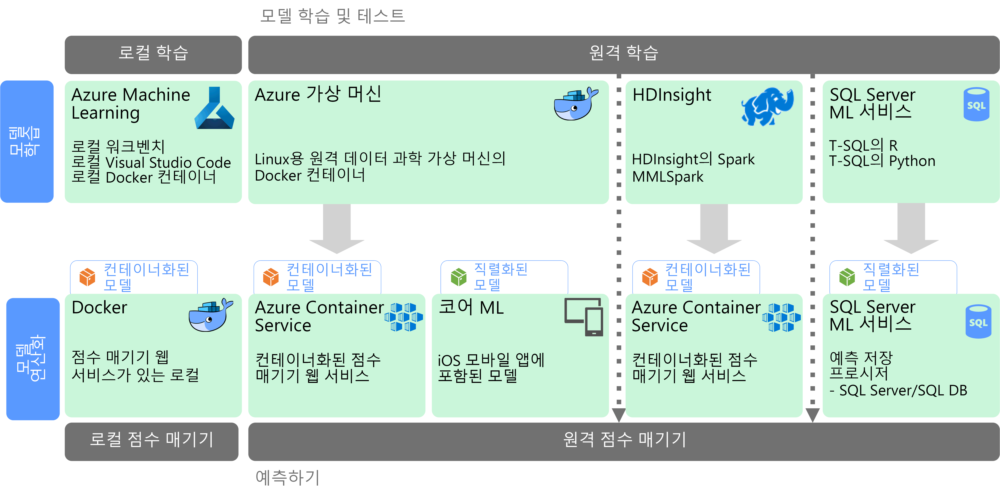

# 대규모 Machine Learning

ML(Machine Learning)은 수학적 알고리즘을 기준으로 예측 모델을 학습하는 데 사용하는 기술입니다. Machine Learning에서는 데이터 필드 간 관계를 분석하여 알 수 없는 값을 예측합니다.

Machine Learning 모델을 만들고 배포하는 과정은 대화형 프로세스입니다.

* 데이터 과학자는 원본 데이터를 탐색하여 *특성* 및 예측 *레이블* 간 관계를 확인합니다.
* 데이터 과학자는 적절한 알고리즘을 기준으로 모델을 학습하고 유효성을 검사하여 예측의 최적 모델을 찾습니다.
* 최적 모델은 웹 서비스 또는 캡슐화된 다른 함수처럼 프로덕션 환경으로 배포됩니다.
* 새 데이터가 수집되면 모델은 주기적으로 다시 학습되어 효율성을 개선해 나갑니다.

대규모 Machine Learning은 두 개의 다른 확장성 문제를 해결합니다. 첫 번째는 학습을 위해 클러스터의 스케일 아웃 기능을 필요로 하는 대규모 데이터 집합에 대해 모델을 학습하는 것입니다. 두 번째 센터는 해당 모델을 사용하는 응용 프로그램의 요구를 충족하도록 확장될 수 있는 방식으로 학습된 모델을 연산화하는 것입니다. 일반적으로 이 작업은 예츠 기능을 웹 서비스로 배포하여 수행한 후 스케일 아웃할 수 있습니다.

데이터가 많을 수록 더 나은 모델이 생성되므로, 대규모 Machine Learning은 강력한 예측 능력을 생성할 수 있다는 장점이 있습니다. 일단 학습된 모델은 뛰어난 상태 비저장 스케일 아웃 웹 서비스로 배포될 수 있습니다. 

## 모델 준비 및 학습

모델 준비 및 학습 단계 동안, 데이터 과학자는 Python 및 R과 같은 언어를 통해 대화형으로 데이터를 탐색함으로써 다음 작업을 수행합니다.

* 대용량 데이터 저장소에서 샘플을 추출합니다.
* 이상값, 중복 및 누락 값을 찾아 처리하여 데이터를 정리합니다.
* 분석 및 시각화를 통해 데이터의 상관 관계 및 관계를 파악합니다.
* 통계 관계의 예측 가능성을 개선하는 새 계산 기능을 생성합니다.
* 예측 알고리즘에 따라 ML 모델을 학습합니다.
* 학습 동안 보류된 데이터를 사용하여 학습된 모델의 유효성을 검사합니다.

이 대화형 분석 및 모델링 단계를 지원하려면 데이터 플랫폼은 데이터 과학자들이 다양한 도구를 사용하여 데이터를 탐색할 수 있도록 해야 합니다. 또한 복잡한 Machine Learning 모델을 학습하려면 많은 양의 대용량 데이터를 집중적으로 처리해야 하므로, 모델 학습을 스케일 아웃할 수 있는 충분한 리소스가 필요합니다.

## 모델 배포 및 소비

모델은 배포할 준비가 되면 웹 서비스로 캡슐화되고, 클라우드, 에지 장치 또는 엔터프라이즈 ML 실행 환경 내에 배포될 수 있습니다. 이 배포 프로세스를 운영화라고 합니다.

## 과제

대규모 Machine Learning은 다음과 같은 몇 가지 문제를 생성합니다.

- 일반적으로 모델을 학습하기 위해서는 많은 데이터가 필요합니다. 특히 심층 학습 모델의 경우는 더 그렇습니다.
- 모델 학습을 시작하기 전부터도 이러한 빅 데이터 집합을 준비해야 합니다.
- 모델 학습 단계에서 빅 데이터 저장소에 액세스해야 합니다. Spark와 같이 데이터 준비에 사용되는 것과 동일한 빅 데이터 클러스터를 사용하여 모델 학습을 수행하는 것이 일반적입니다. 
- 심층 학습과 같은 시나리오의 경우, CPU에서 스케일 아웃을 제공할 수 있는 클러스터가 필요할 뿐만 아니라, 클러스터 자체가 GPU 지원 노드로 구성되어야 합니다.

## Azure의 대규모 Machine Learning

학습 및 운영화에 사용할 ML 서비스를 결정하기 전에, 모델을 학습해야 하는지 또는 미리 작성된 모델로 요구를 충족할 수 있는지를 고려합니다. 대부분의 경우, 미리 작성된 모델을 사용하면 웹 서비스를 호출하거나 ML 라이브러리를 사용하여 기존 모델을 로드하는 정도만 가능합니다. 이러한 옵션에는 다음이 포함됩니다. 

- Microsoft Cognitive Services에서 제공 하는 웹 서비스를 사용합니다.
- Cognitive 도구 키트에서 제공하는 미리 학습된 신경망 모델을 사용합니다.
- iOS 앱용 핵심 ML이 제공하는 직렬화된 모델을 포함합니다. 

미리 작성된 모델이 사용자의 데이터 또는 시나리오에 맞지 않을 경우, Azure에서 Azure Machine Learning, HDInsight(Spark MLlib 및 MMLSpark 포함), Cognitive 도구 키트 및 SQL Machine Learning Services와 같은 옵션을 사용할 수 있습니다. 사용자 지정 모델을 사용하려는 경우, 모델 학습 및 운영화를 포함하는 파이프라인을 디자인해야 합니다. 

Azure의 ML에 대한 기술 선택 목록을 보려면 다음 항목을 참조하세요.

- [Cognitive Services 기술 선택](../technology-choices/cognitive-services.md)
- [Machine Learning 기술 선택](../technology-choices/data-science-and-machine-learning.md)
- [자연어 처리 기술 선택](../technology-choices/natural-language-processing.md)
