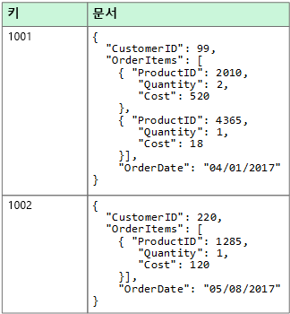
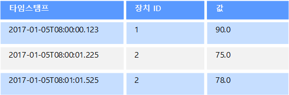
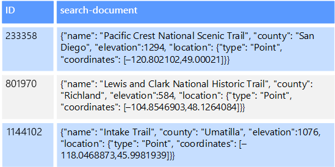

# 비관계형 데이터 및 NoSQLNon-relational data and NoSQL

*비관계형 데이터베이스*는 대부분의 전형적인 데이터베이스 시스템에서 찾을 수 있는 행과 열로 이루어진 테이블 형식 스키마를 사용하지 않는 데이터베이스입니다.A *non-relational database* is a database that does not use the tabular schema of rows and columns found in most traditional database systems. 대신 비관계형 데이터베이스는 저장되는 데이터 형식의 특정 요구 사항에 맞게 최적화된 저장소 모델을 사용합니다.Instead, non-relational databases use a storage model that is optimized for the specific requirements of the type of data being stored. 예를 들어, 데이터는 단순 키/값 쌍, JSON 문서 또는 모서리와 꼭짓점으로 이루어진 그래프로 저장될 수 있습니다.For example, data may be stored as simple key/value pairs, as JSON documents, or as a graph consisting of edges and vertices. 

이러한 모든 데이터 저장소가 갖는 공통점은 [관계형 모델](../relational-data/index.md)을 사용하지 않는다는 것입니다.What all of these data stores have in common is that they don't use a [relational model](../relational-data/index.md). 또한 지원하는 데이터 형식과 데이터를 쿼리할 수 있는 방법도 좀 더 구체적일 수 있습니다.Also, they tend to be more specific in the type of data they support and how data can be queried. 예를 들어, 시계열 데이터 저장소는 시간 기준 데이터 시퀀스에 대한 쿼리에 맞게 최적화되어 있지만, 그래프 데이터 저장소는 엔터티 간에 가중치가 적용된 관계를 탐색하는 데 최적화되어 있습니다.For example, time series data stores are optimized for queries over time-based sequences of data, while graph data stores are optimized for exploring weighted relationships between entities. 두 형식 모두 트랜잭션 데이터의 관리 태스크로는 잘 일반화되지 않습니다.Neither format would generalize well to the task of managing transactional data. 

용어 *NoSQL*은 쿼리에 SQL을 사용하지 않고, 대신 다른 프로그래밍 언어 및 구문을 사용하여 데이터를 쿼리하는 데이터 저장소를 나타냅니다.The term *NoSQL* refers to data stores that do not use SQL for queries, and instead use other programming languages and constructs to query the data. 실제로, 이러한 많은 데이터베이스가 SQL 호환 쿼리를 지원하더라도, "NoSQL"은 "비관계형 데이터베이스"를 의미합니다.In practice, "NoSQL" means "non-relational database," even though many of these databases do support SQL-compatible queries. 그러나 기본 쿼리 실행 전략은 일반적으로 전형적인 RDBMS가 동일한 SQL 쿼리를 실행하는 방식과 매우 다릅니다.However, the underlying query execution strategy is usually very different from the way a traditional RDBMS would execute the same SQL query.

다음 섹션에서는 비관계형 또는 NoSQL 데이터베이스의 주요 범주를 설명합니다.The following sections describe the major categories of non-relational or NoSQL database.

## 문서 데이터 저장소Document data stores
문서 데이터 저장소는 *문서*라고 하는 엔터티에서 명명된 문자열 필드 및 개체 데이터 값의 집합을 관리합니다.A document data store manages a set of named string fields and object data values in an entity referred to as a *document*. 일반적으로 이러한 데이터 저장소는 JSON 문서 형식으로 데이터를 저장합니다.These data stores typically store data in the form of JSON documents. 각 필드 값은 숫자와 같은 스칼라 항목이거나 목록 또는 부모-자식 컬렉션과 같은 복합 요소일 수 있습니다.Each field value could be a scalar item, such as a number, or a compound element, such as a list or a parent-child collection. 문서 필드의 데이터는 XML, YAML, JSON, BSON을 비롯한 다양한 방법으로 인코딩되거나 일반 텍스트로 저장될 수도 있습니다.The data in the fields of a document can be encoded in a variety of ways, including XML, YAML, JSON, BSON, or even stored as plain text. 문서 내의 필드는 저장소 관리 시스템에 표시되므로 응용 프로그램에서 이러한 필드의 값을 사용하여 데이터를 쿼리하고 필터링할 수 있습니다.The fields within documents are exposed to the storage management system, enabling an application to query and filter data by using the values in these fields.  

일반적으로 문서에는 엔터티의 전체 데이터가 포함됩니다.Typically, a document contains the entire data for an entity. 엔터티를 구성하는 항목은 응용 프로그램에 따라 다릅니다.What items constitute an entity are application specific. 예를 들어, 엔터티에는 고객의 세부 정보, 주문 또는 이 두 정보의 조합을 포함할 수 있습니다.For example, an entity could contain the details of a customer, an order, or a combination of both. RDBMS(관계형 데이터베이스 관리 시스템)의 여러 관계형 테이블에 분산된 정보가 단일 문서에 포함될 수도 있습니다.A single document might contain information that would be spread across several relational tables in a relational database management system (RDBMS). 문서 저장소의 모든 문서가 동일한 구조를 가질 필요는 없습니다.A document store does not require that all documents have the same structure. 이 자유 형식 접근 방식은 많은 유연성을 제공합니다.This free-form approach provides a great deal of flexibility. 예를 들어, 비즈니스 요구 사항의 변경에 대한 응답으로, 응용 프로그램은 문서에 다른 데이터를 저장할 수 있습니다.For example, applications can store different data in documents in response to a change in business requirements.  

  

응용 프로그램은 문서 키를 사용하여 문서를 검색할 수 있습니다.The application can retrieve documents by using the document key. 문서 키란 데이터를 균등하게 분산하는 데 사용되는 문서의 고유 식별자로서 종종 해시됩니다.This is a unique identifier for the document, which is often hashed, to help distribute data evenly. 일부 문서 데이터베이스는 자동으로 문서 키를 만듭니다.Some document databases create the document key automatically. 다른 문서 데이터베이스에서는 키로 사용할 문서의 특성을 사용자가 지정할 수 있습니다.Others enable you to specify an attribute of the document to use as the key. 응용 프로그램은 하나 이상의 필드 값을 기반으로 문서를 쿼리할 수도 있습니다.The application can also query documents based on the value of one or more fields. 일부 문서 데이터베이스는 하나 이상의 인덱싱된 필드를 기반으로 문서를 빠르게 조회할 수 있도록 인덱싱을 지원합니다.Some document databases support indexing to facilitate fast lookup of documents based on one or more indexed fields.  

많은 문서 데이터베이스에서는 응용 프로그램에서 전체 문서를 다시 작성하지 않고도 문서의 특정 필드 값을 수정할 수 있는 내부 업데이트를 지원합니다.Many document databases support in-place updates, enabling an application to modify the values of specific fields in a document without rewriting the entire document. 단일 문서의 여러 필드에 대한 읽기 및 쓰기 작업은 일반적으로 원자성입니다.Read and write operations over multiple fields in a single document are usually atomic.

관련 Azure 서비스:Relevant Azure service:  

- [Azure Cosmos DBAzure Cosmos DB](https://azure.microsoft.com/services/cosmos-db/)

## 칼럼 형식 데이터 저장소Columnar data stores
칼럼 형식 또는 열 패밀리 데이터 저장소는 데이터를 열과 행으로 구성합니다.A columnar or column-family data store organizes data into columns and rows. 가장 간단한 형태인 열 패밀리 데이터 저장소는 적어도 개념적으로 관계형 데이터베이스와 매우 유사하게 보일 수 있습니다.In its simplest form, a column-family data store can appear very similar to a relational database, at least conceptually. 열 패밀리 데이터베이스의 이점은 데이터를 저장하는 열 기반 접근법에서 파생된 스파스 데이터를 구조화하기 위한 비정규화된 접근법에 있습니다.The real power of a column-family database lies in its denormalized approach to structuring sparse data, which stems from the column-oriented approach to storing data.  

열 패밀리 데이터 저장소는 행과 열이 있는 표 형식 데이터로 생각할 수 있지만 열은 열 패밀리라는 그룹으로 나뉩니다.You can think of a column-family data store as holding tabular data with rows and columns, but the columns are divided into groups known as column families. 각 열 패밀리는 논리적으로 관련되어 있고 일반적으로 하나의 단위로 검색되거나 조작되는 열 집합을 보유합니다.Each column family holds a set of columns that are logically related and are typically retrieved or manipulated as a unit. 개별적으로 액세스되는 다른 데이터는 별도의 열 패밀리에 저장할 수 있습니다.Other data that is accessed separately can be stored in separate column families. 열 패밀리 내에서 새 열을 동적으로 추가할 수 있고 행은 스파스될 수 있습니다. 즉, 행은 모든 열에 대해 값을 가질 필요가 없습니다.Within a column family, new columns can be added dynamically, and rows can be sparse (that is, a row doesn't need to have a value for every column). 

다음 다이어그램은 `Identity` 및 `Contact Info`의 두 열 패밀리가 있는 예를 보여 줍니다.The following diagram shows an example with two column families, `Identity` and `Contact Info`. 단일 엔터티의 데이터에는 각 열 패밀리에서 동일한 행 키가 있습니다.The data for a single entity has the same row key in each column family. 열 패밀리의 특정 개체에 대한 행이 동적으로 달라질 수 있는 이 구조는 열 패밀리 접근 방식의 중요한 이점이므로 이 데이터 저장소 형식은 다양한 스키마와 함께 데이터를 저장하는 데 매우 적합합니다.This structure, where the rows for any given object in a column family can vary dynamically, is an important benefit of the column-family approach, making this form of data store highly suited for storing data with varying schemas.

키/값 저장소 또는 문서 데이터베이스와 달리 대부분의 열 패밀리 데이터베이스는 해시를 계산하지 않고 키 순서로 데이터를 저장합니다.Unlike a key/value store or a document database, most column-family databases physically store data in key order, rather than by computing a hash. 행 키는 기본 인덱스로 간주되며, 특정 키 또는 키 범위를 통한 키 기반 액세스를 허용합니다.The row key is considered the primary index and enables key-based access via a specific key or a range of keys. 일부 구현을 통해 열 패밀리의 특정 열에 대한 보조 인덱스를 만들 수 있습니다.Some implementations allow you to create secondary indexes over specific columns in a column family. 보조 인덱스를 사용하면 행 키가 아닌 열 값으로 데이터를 검색할 수 있습니다.Secondary indexes let you retrieve data by columns value, rather than row key.

디스크에서 열 패밀리 내의 모든 열은 동일한 파일에 함께 저장되며, 각 파일에는 특정 수의 행이 포함됩니다.On disk, all of the columns within a column family are stored together in the same file, with a certain number of rows in each file. 큰 데이터 집합을 사용할 경우 이 접근법은 한 번에 몇 개의 열만 쿼리될 때 디스크에서 읽어야 하는 데이터 양을 줄임으로써 성능을 높여줍니다.With large data sets, this approach creates a performance benefit by reducing the amount of data that needs to be read from disk when only a few columns are queried together at a time. 

행에 대한 읽기 및 쓰기 작업은 일반적으로 단일 열 패밀리에 대해 원자성이지만 일부 구현은 여러 열 패밀리에 걸쳐 전체 행에 원자성을 제공합니다.Read and write operations for a row are usually atomic within a single column family, although some implementations provide atomicity across the entire row, spanning multiple column families.

관련 Azure 서비스:Relevant Azure service:  

- [HDInsight의 HBaseHBase in HDInsight](/azure/hdinsight/hdinsight-hbase-overview)

## 키/값 데이터 저장소Key/value data stores
키/값 저장소는 기본적으로 큰 해시 테이블입니다.A key/value store is essentially a large hash table. 각 데이터 값을 고유한 키와 연결하고 키/값 저장소는 이 키를 사용하여 적절한 해시 알고리즘을 통해 데이터를 저장합니다.You associate each data value with a unique key, and the key/value store uses this key to store the data by using an appropriate hashing function. 해시 알고리즘은 데이터 저장소 전반에 해시 키가 균등하게 분산되도록 하기 위해 선택됩니다.The hashing function is selected to provide an even distribution of hashed keys across the data storage.

대부분의 키/값 저장소는 간단한 쿼리, 삽입 및 삭제 작업만 지원합니다.Most key/value stores only support simple query, insert, and delete operations. 값을 수정(부분적으로 또는 완전히)하려면 응용 프로그램이 전체 값에 대해 기존 데이터를 덮어써야 합니다.To modify a value (either partially or completely), an application must overwrite the existing data for the entire value. 대부분의 구현에서 단일 값 읽기 또는 쓰기는 원자성 작업입니다.In most implementations, reading or writing a single value is an atomic operation. 값이 클 경우 쓸 때 약간의 시간이 걸릴 수 있습니다.If the value is large, writing may take some time.

응용 프로그램은 임의의 데이터를 값 집합으로 저장할 수 있지만 일부 키/값 저장소는 값의 최대 크기를 제한합니다.An application can store arbitrary data as a set of values, although some key/value stores impose limits on the maximum size of values. 저장된 값은 저장소 시스템 소프트웨어에 불투명합니다.The stored values are opaque to the storage system software. 모든 스키마 정보는 응용 프로그램에서 제공하고 해석해야 합니다.Any schema information must be provided and interpreted by the application. 본질적으로 값은 BLOB이며 키/값 저장소는 키로 값을 검색하거나 저장합니다.Essentially, values are blobs and the key/value store simply retrieves or stores the value by key.

키/값 저장소는 키의 값을 사용하거나 키 범위별로 간단한 조회를 수행하는 응용 프로그램에 대해 최적화되어 있지만, 여러 테이블 간에 데이터를 조인하는 경우처럼 다른 키/값 테이블 사이에서 데이터를 쿼리해야 하는 시스템에는 덜 적절합니다.Key/value stores are highly optimized for applications performing simple lookups using the value of the key, or by a range of keys, but are less suitable for systems that need to query data across different tables of keys/values, such as joining data across multiple tables. 

키/값 저장소는 키에 따라서만 조회를 수행하는 것이 아니라 키 이외의 값별 조회나 필터링이 중요한 시나리오에 대해서도 최적화되어 있지 않습니다.Key/value stores are also not optimized for scenarios where querying or filtering by non-key values is important, rather than performing lookups based only on keys. 예를 들어, 관계형 데이터베이스의 경우 WHERE 절을 사용하여 키가 아닌 열을 필터링함으로써 레코드를 찾을 수 있지만, 키/값 저장소는 일반적으로 값에 대해 이러한 유형의 조회 기능을 제공하지 않으며, 제공한다고 해도 모든 값을 느리게 검색할 수밖에 없습니다.For example, with a relational database, you can find a record by using a WHERE clause to filter the non-key columns, but key/values stores usually do not have this type of lookup capability for values, or if they do it requires a slow scan of all values.

단일 키/값 저장소는 별도의 컴퓨터에 있는 여러 노드에 데이터를 쉽게 배포할 수 있으므로 확장성이 매우 뛰어납니다.A single key/value store can be extremely scalable, as the data store can easily distribute data across multiple nodes on separate machines.

관련 Azure 서비스:Relevant Azure services:  
- [Azure Cosmos DB 테이블 APIAzure Cosmos DB Table API](/azure/cosmos-db/table-introduction)  
- [Azure Redis 캐시(영문)Azure Redis Cache](https://azure.microsoft.com/services/cache/)  
- [Azure Table StorageAzure Table Storage](https://azure.microsoft.com/services/storage/tables/)

## 그래프 데이터 저장소Graph data stores
그래프 데이터 저장소는 노드와 에지, 두 가지 유형의 정보를 관리합니다.A graph data store manages two types of information, nodes and edges. 노드는 엔터티를 나타내고, 에지는 이러한 엔터티 간의 관계를 지정합니다.Nodes represent entities, and edges specify the relationships between these entities. 노드와 에지 모두 테이블의 열과 마찬가지로 해당 노드 또는 에지에 대한 정보를 제공하는 속성을 가질 수 있습니다.Both nodes and edges can have properties that provide information about that node or edge, similar to columns in a table. 에지는 또한 관계의 특성을 나타내는 방향을 가질 수 있습니다.Edges can also have a direction indicating the nature of the relationship.  

그래프 데이터 저장소의 목적은 응용 프로그램이 노드와 에지의 네트워크를 트래버스하는 쿼리를 효율적으로 수행하고 엔터티 간의 관계를 분석할 수 있게 하는 것입니다.The purpose of a graph data store is to allow an application to efficiently perform queries that traverse the network of nodes and edges, and to analyze the relationships between entities. 다음 다이어그램은 그래프로 구성된 조직의 인사 데이터를 보여 줍니다.The following diagram shows an organization's personnel data structured as a graph. 엔터티는 직원 및 부서이며, 에지는 보고 관계 및 직원이 근무하는 부서를 나타냅니다.The entities are employees and departments, and the edges indicate reporting relationships and the department in which employees work. 이 그래프에서 에지의 화살표는 관계 방향을 나타냅니다.In this graph, the arrows on the edges show the direction of the relationships.

이 구조를 통해 "Sarah에게 직접 또는 간접적으로 보고하는 모든 직원 찾기" 또는 "John과 같은 부서에서 근무하는 직원"과 같은 쿼리를 간단하게 수행할 수 있습니다.This structure makes it straightforward to perform queries such as "Find all employees who report directly or indirectly to Sarah" or "Who works in the same department as John?" 엔터티와 관계가 많은 대형 그래프의 경우 매우 복잡한 분석을 매우 신속하게 수행할 수 있습니다.For large graphs with lots of entities and relationships, you can perform very complex analyses very quickly. 많은 그래프 데이터베이스는 관계 네트워크를 효율적으로 트래버스하는 데 사용할 수 있는 쿼리 언어를 제공합니다.Many graph databases provide a query language that you can use to traverse a network of relationships efficiently.  

관련 Azure 서비스:Relevant Azure service:  
- [Azure Cosmos DB Graph APIAzure Cosmos DB Graph API](/azure/cosmos-db/graph-introduction)  

## 시계열 데이터 저장소Time series data stores
시계열 데이터는 시간별로 구성된 값 집합이며 시계열 데이터 저장소는 이러한 유형의 데이터에 대해 최적화되어 있습니다.Time series data is a set of values organized by time, and a time series data store is optimized for this type of data. 시계열 데이터 저장소는 대개 여러 소스에서 대량의 데이터를 실시간으로 수집하기 때문에 매우 많은 쓰기를 지원해야 합니다.Time series data stores must support a very high number of writes, as they typically collect large amounts of data in real time from a large number of sources. 시계열 데이터 저장소는 원격 분석 데이터를 저장하도록 최적화되어 있습니다.Time series data stores are optimized for storing telemetry data. 시나리오에는 IoT 센서 또는 응용 프로그램/시스템 카운터가 포함됩니다.Scenarios include IoT sensors or application/system counters. 업데이트는 거의 발생하지 않으며 삭제는 종종 대량 작업으로 수행됩니다.Updates are rare, and deletes are often done as bulk operations.

시계열 데이터베이스에 기록된 레코드는 일반적으로 작지만 레코드 수가 많아 전체 데이터 크기가 빠르게 커지는 경우가 종종 있습니다.Although the records written to a time series database are generally small, there are often a large number of records, and total data size can grow rapidly. 시계열 데이터 저장소는 순서가 맞지 않고 늦게 도착하는 데이터, 데이터 요소의 자동 인덱싱, 시간 측면에서 기술된 쿼리의 최적화도 처리합니다.Time series data stores also handle out-of-order and late-arriving data, automatic indexing of data points, and optimizations for queries described in terms of windows of time. 이 마지막 기능을 사용하면 시계열 데이터가 사용되는 일반적인 방식에 해당하는 시계열 시각화를 지원하기 위해, 수백만 개의 데이터 요소 및 여러 데이터 스트림 간에 빠르게 쿼리를 실행할 수 있습니다.This last feature enables queries to run across millions of data points and multiple data streams quickly, in order to support time series visualizations, which is a common way that time series data is consumed. 

자세한 내용은 [시계열 솔루션](../scenarios/time-series.md)을 참조하세요.For more information, see [Time series solutions](../scenarios/time-series.md)

관련 Azure 서비스:Relevant Azure service:  
- [Azure Time Series InsightsAzure Time Series Insights](https://azure.microsoft.com/services/time-series-insights/)  
- [HDInsight의 OpenTSDB(HBase 포함)OpenTSDB with HBase on HDInsight](/azure/hdinsight/hdinsight-hbase-overview)

## 개체 데이터 저장소Object data stores
개체 데이터 저장소는 대형 이진 개체 또는 Blob(예: 이미지, 텍스트 파일, 비디오 및 오디오 스트림, 대형 응용 프로그램 데이터 개체 및 문서, 가상 머신 디스크 이미지)를 저장하고 검색하는 데 최적화되어 있습니다.Object data stores are optimized for storing and retrieving large binary objects or blobs such as images, text files, video and audio streams, large application data objects and documents, and virtual machine disk images. 개체는 저장된 데이터, 일부 메타데이터 및 개체에 액세스하기 위한 고유한 ID로 구성됩니다.An object consists of the stored data, some metadata, and a unique ID for accessing the object. 개체 저장소는 개별적으로 매우 큰 파일을 지원할 뿐만 아니라 모든 파일을 관리하기 위해 용량이 큰 저장소를 제공하도록 디자인되었습니다.Object stores are designed to support files that are individually very large, as well provide large amounts of total storage to manage all files.  

일부 개체 데이터 저장소는 여러 서버 노드에서 지정된 Blob을 복제하여 빠른 병렬 읽기를 허용합니다.Some object data stores replicate a given blob across multiple server nodes, which enables fast parallel reads. 일반적으로 여러 다른 서버에서 실행되는 여러 프로세스가 큰 데이터 파일을 동시에 쿼리할 수 있으므로 이를 통해 큰 파일에 포함된 데이터에 대한 스케일 아웃 쿼리가 가능해집니다.This in turn enables the scale-out querying of data contained in large files, because multiple processes, typically running on different servers, can each query the large data file simultaneously.

개체 데이터 저장소의 특수 경우는 네트워크 파일 공유입니다.One special case of object data stores is the network file share. 파일 공유를 사용하면 SMB(서버 메시지 블록)와 같은 표준 네트워킹 프로토콜을 사용하여 네트워크를 통해 파일에 액세스할 수 있습니다.Using file shares enables files to be accessed across a network using standard networking protocols like server message block (SMB). 적절한 보안 및 동시 액세스 제어 메커니즘이 제공되면 이러한 방식으로 데이터를 공유하여, 분산 서비스를 통해 단순 읽기 및 쓰기 요청과 같은 기본, 저수준 작업을 위한 확장성이 뛰어난 데이터 액세스를 제공할 수 있습니다.Given appropriate security and concurrent access control mechanisms, sharing data in this way can enable distributed services to provide highly scalable data access for basic, low level operations such as simple read and write requests.

관련 Azure 서비스:Relevant Azure service:   

- [Azure Blob StorageAzure Blob Storage](https://azure.microsoft.com/services/storage/blobs/)  
- [Azure Data Lake StorageAzure Data Lake Store](https://azure.microsoft.com/services/data-lake-store/)  
- [Azure File StorageAzure File Storage](https://azure.microsoft.com/services/storage/files/)  

## 외부 인덱스 데이터 저장소External index data stores

외부 인덱스 데이터 저장소는 다른 데이터 저장소 및 서비스에 보관된 정보를 검색하는 기능을 제공합니다.External index data stores provide the ability to search for information held in other data stores and services. 외부 인덱스는 모든 데이터 저장소에 대한 보조 인덱스 역할을 하며, 대량의 데이터를 인덱싱하고 이러한 인덱스에 대해 거의 실시간 액세스를 제공하는 데 사용될 수 있습니다.An external index acts as a secondary index for any data store, and can be used to index massive volumes of data and provide near real-time access to these indexes. 

예를 들어, 파일 시스템에 저장된 텍스트 파일이 있을 수 있습니다.For example, you might have text files stored in a file system. 파일 경로로 파일을 빠르게 찾을 수 있지만, 파일 내용을 기준으로 검색하려면 모든 파일을 검색해야 하므로 느립니다.Finding a file by its file path is quick, but searching based on the contents of the file would require a scan of all of the files, which is slow. 외부 인덱스를 사용하면 보조 검색 인덱스를 만들고, 조건에 일치하는 파일의 경로를 빠르게 찾을 수 있습니다.An external index lets you create secondary search indexes and then quickly find the path to the files that match your criteria. 외부 인덱스를 적용한 또 다른 예는 키로만 인덱싱하는 키/값 저장소를 사용하는 경우입니다.Another example application of an external index is with key/value stores that only index by the key. 데이터의 값에 따라 보조 인덱스를 작성할 수 있으며, 일치하는 각 항목을 고유하게 식별하는 키를 신속하게 조회할 수 있습니다.You can build a secondary index based on the values in the data, and quickly look up the key that uniquely identifies each matched item. 

인덱스는 인덱싱 프로세스를 실행하여 생성됩니다.The indexes are created by running an indexing process. 이 작업은 데이터 저장소에 의해 트리거되는 끌어오기 모델을 사용하거나 응용 프로그램 코드에 의해 시작되는 밀어넣기 모델을 사용하여 수행할 수 있습니다.This can be performed using a pull model, triggered by the data store, or using a push model, initiated by application code. 인덱스는 다차원적일 수 있으며 많은 양의 텍스트 데이터에서 자유 텍스트 검색을 지원할 수 있습니다.Indexes can be multidimensional and may support free-text searches across large volumes of text data. 

외부 인덱스 데이터 저장소는 전체 텍스트 및 웹 기반 검색을 지원하는 데 종종 사용됩니다.External index data stores are often used to support full text and web based search. 이러한 경우 검색은 정확한 항목 또는 유사 항목을 찾을 수 있습니다.In these cases, searching can be exact or fuzzy. 유사 항목 검색은 용어 집합과 일치하는 문서를 찾고 일치하는 정도를 계산합니다.A fuzzy search finds documents that match a set of terms and calculates how closely they match. 또한 일부 외부 인덱스는 동의어, 장르 확장(예를 들어, "dogs"를 검색하면 "pets"가 검색됨), 형태소 분석(예를 들어: "run"을 검색하면 “ran” 및 “running”도 검색됨)에 따라 일치 항목을 반환할 수 있는 언어 분석도 지원합니다.Some external indexes also support linguistic analysis that can return matches based on synonyms, genre expansions (for example, matching "dogs" to "pets"), and stemming (for example, searching for "run" also matches "ran" and "running"). 

관련 Azure 서비스:Relevant Azure service:  

- [Azure SearchAzure Search](https://azure.microsoft.com/services/search/)

## 일반적인 요구 사항Typical requirements
비관계형 데이터 저장소는 종종 관계형 데이터베이스에서 사용되는 다른 저장소 아키텍처를 사용합니다.Non-relational data stores often use a different storage architecture from that used by relational databases. 특히, 고정된 스키마가 없는 경향이 있습니다.Specifically, they tend towards having no fixed schema. 또한 트랜잭션을 지원하지 않거나 트랜잭션 범위를 제한하는 경향이 있으며, 일반적으로 확장성 때문에 보조 인덱스를 포함하지 않습니다.Also, they tend not to support transactions, or else restrict the scope of transactions, and they generally don't include secondary indexes for scalability reasons.

다음은 각 비관계형 데이터 저장소의 요구 사항을 비교해서 설명한 것입니다.The following compares the requirements for each of the non-relational data stores:

| 요구 사항Requirement | 문서 데이터Document data | 열 패밀리 데이터Column-family data | 키/값 데이터Key/value data | 그래프 데이터Graph data | 
| --- | --- | --- | --- | --- | 
| 정규화Normalization | 비정규화됨Denormalized | 비정규화됨Denormalized | 비정규화됨Denormalized | 정규화됨Normalized | 
| 스키마Schema | 읽기 시 스키마Schema on read | 쓰기 시 열 패밀리 정의, 읽기 시 열 스키마Column families defined on write, column schema on read | 읽기 시 스키마Schema on read | 읽기 시 스키마Schema on read | 
| 일관성(동시 트랜잭션 전체)Consistency (across concurrent transactions) | 튜닝 가능한 일관성, 문서 수준 보장Tunable consistency, document-level guarantees | 열 패밀리 수준 보증Column-family&ndash;level guarantees | 키 수준 보장Key-level guarantees | 그래프 수준 보장Graph-level guarantees 
| 원자성(트랜잭션 범위)Atomicity (transaction scope) | 컬렉션Collection | 테이블Table | 테이블Table | 그래프Graph | 
| 잠금 전략Locking Strategy | 낙관적(잠금 없음)Optimistic (lock free) | 비관적(행 잠금)Pessimistic (row locks) | 낙관적(ETag)Optimistic (ETag) | 
| 액세스 패턴Access pattern | 임의 액세스Random access | tall/wide 데이터 집계Aggregates on tall/wide data | 임의 액세스Random access | 임의 액세스Random access |
| 인덱싱Indexing | 기본 및 보조 인덱스Primary and secondary indexes | 기본 및 보조 인덱스Primary and secondary indexes | 기본 인덱스만Primary index only | 기본 및 보조 인덱스Primary and secondary indexes | 
| 데이터 모양Data shape | 문서Document | 열이 포함된 열 패밀리가 있는 테이블 형식Tabular with column families containing columns | 키 및 값Key and value | 모서리와 꼭짓점을 포함하는 그래프Graph containing edges and vertices | 
| 스파스Sparse | 예Yes | 예Yes | 예Yes | 아니오No | 
| 넓게(많은 열/특성)Wide (lots of columns/attributes) | 예Yes | 예Yes | 아니요No | 아니오No |  
| 데이터 크기Datum size | 작음(KB) ~ 중간(낮은 MB)Small (KBs) to medium (low MBs) | 중간(MB) ~ 큰(낮은 GB)Medium (MBs) to Large (low GBs) | 작음(KB)Small (KBs) | 작음(KB)Small (KBs) | 
| 전체 최대 크기Overall Maximum Scale | 매우 큼(PB)Very Large (PBs) | 매우 큼(PB)Very Large (PBs) | 매우 큼(PB)Very Large (PBs) | 큼(TB)Large (TBs) | 

| 요구 사항Requirement | 시계열 데이터Time series data | 개체 데이터Object data | 외부 인덱스 데이터External index data |
| --- | --- | --- | --- |
| 정규화Normalization | 정규화됨Normalized | 비정규화됨Denormalized | 비정규화됨Denormalized |
| 스키마Schema | 읽기 시 스키마Schema on read | 읽기 시 스키마Schema on read | 쓰기 시 스키마Schema on write | 
| 일관성(동시 트랜잭션 전체)Consistency (across concurrent transactions) | 해당 없음N/A | 해당 없음N/A | 해당 없음N/A | 
| 원자성(트랜잭션 범위)Atomicity (transaction scope) | 해당 없음N/A | ObjectObject | 해당 없음N/A |
| 잠금 전략Locking Strategy | 해당 없음N/A | 비관적(Blob 잠금)Pessimistic (blob locks) | 해당 없음N/A |
| 액세스 패턴Access pattern | 임의 액세스 및 집계Random access and aggregation | 순차적 액세스Sequential access | 임의 액세스Random access | 
| 인덱싱Indexing | 기본 및 보조 인덱스Primary and secondary indexes | 기본 인덱스만Primary index only | 해당 없음N/A |
| 데이터 모양Data shape | 테이블 형식Tabular | Blob 및 메타데이터Blob and metadata | 문서Document |
| 스파스Sparse | 아니요No | 해당 없음N/A | 아니오No | 
| 넓게(많은 열/특성)Wide (lots of columns/attributes) |  아니오No | 예Yes | 예Yes |  
| 데이터 크기Datum size | 작음(KB)Small (KBs) | 큼(TB) ~ 매우 큼(TB)Large (GBs) to Very Large (TBs) | 작음(KB)Small (KBs) |
| 전체 최대 크기Overall Maximum Scale | 큼(낮은 TB)Large (low TBs)  | 매우 큼(PB)Very Large (PBs) | 큼(낮은 TB)Large (low TBs) | 

