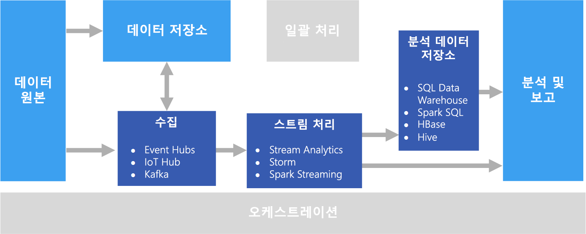

# 실시간 처리

실시간 처리는 실시간으로 캡처되고 최소 대기 시간으로 처리되는 데이터 스트림을 사용하여 실시간(또는 거의 실시간) 보고서 또는 자동화된 응답을 생성합니다. 예를 들어, 실시간 트래픽 모니터링 솔루션은 센서 데이터를 사용하여 높은 트래픽 볼륨을 감지할 수 있습니다. 이 데이터는 정체 상태를 표시하도록 지도를 동적으로 업데이트하거나, 점유율이 높은 차선 또는 기타 트래픽 관리 시스템을 자동으로 시작하는 데 사용될 수 있습니다.

실시간 처리는 바인딩되지 않은 입력 데이터의 스트림 처리로 정의되며 처리 대기 시간이 매우 짧습니다(밀리초 또는 초 단위로 &mdash; 측정). 이러한 들어오는 데이터는 일반적으로 JSON과 같은 비구조화 또는 반구조화 형식으로 도착하며, [일괄 처리](./batch-processing.md)와 같은 처리 요구 사항을 가지지만 실시간 사용을 지원하기 위해 좀 더 짧은 소요 시간을 유지합니다.

처리된 데이터는 주로 분석 및 시각화에 최적화된 분석 데이터 저장소에 기록됩니다. 또한 처리된 데이터는 분석, 비즈니스 인텔리전스 및 실시간 대시보드 시각화를 위해 분석 및 보고 계층으로 직접 수집될 수도 있습니다.

## 과제

실시간 처리 솔루션의 가장 큰 해결 과제 중 하나는 메시지(특히 고용량)를 실시간으로 메시지를 수집, 처리 및 저장하는 것입니다. 수집 파이프라인을 차단하지 않는 방식으로 처리를 수행해야 합니다. 데이터 저장소는 대용량 쓰기를 지원해야 합니다. 또 다른 문제는 실시간으로 경고를 생성하고 실시간(또는 거의 실시간) 대시보드에 데이터를 표시하는 등의 작업을 빠르게 수행하는 것입니다.

## 건축

실시간 처리 아키텍처는 다음 논리적 구성 요소를 갖습니다.

- **실시간 메시지 수집**. 아키텍처에는 실시간 메시지를 캡처하고 스트림 처리 소비자가 사용할 수 있게 저장하는 방법이 포함되어야 합니다. 대부분의 경우 이 서비스는 폴더에 새 메시지를 보관하는 간단한 데이터 저장소로 구현할 수 있습니다. 하지만 솔루션에 메시지에 대한 버퍼로 작동하는 Azure Event Hubs와 같은 메시지 브로커가 필요한 경우가 많습니다. 메시지 브로커는 스케일 아웃 처리 및 안정적인 배달을 지원해야 합니다.

- **스트림 처리**. 실시간 메시지를 캡처한 후 솔루션은 필터링, 집계 및 그 밖의 분석을 위한 데이터 준비를 통해 해당 메시지를 처리해야 합니다.

- **분석 데이터 저장소.** 대다수의 빅 데이터 솔루션은 분석할 데이터를 준비한 다음, 분석 도구를 사용하여 쿼리할 수 있는 구조화된 형식으로 처리된 데이터를 제공하도록 디자인되어 있습니다. 

- **분석 및 보고.** 대부분의 빅 데이터 솔루션의 목표는 분석 및 보고를 통해 데이터에 대한 정보를 제공하는 것입니다. 

## 기술 선택

다음과 같은 기술은 Azure의 실시간 처리 솔루션에 권장됩니다.

### 실시간 메시지 수집

- **Azure Event Hubs** - Azure Event Hubs는 초당 수백만 개의 이벤트 메시지를 수집하기 위한 메시지 큐 솔루션입니다. 캡처한 이벤트 데이터는 여러 소비자가 동시에 처리할 수 있습니다.
- **Azure IoT Hub** - Azure IoT Hub는 인터넷에 연결된 장치 간의 양방향 통신과 동시에 연결된 수백만 대의 장치를 처리할 수 있는 확장 가능한 메시지 큐를 제공합니다.
- **Apache Kafka**. Kafka는 다중 메시지 생산자에서 들어온 초당 수백만 개의 메시지를 처리하여 여러 소비자에게 전송하기 위해 확장될 수 있는 오픈 소스 메시지 큐 및 스트림 처리 응용 프로그램입니다. Kafka는 Azure에서 HDInsight 클러스터 유형으로 사용할 수 있습니다.

자세한 내용은 [실시간 메시지 수집](../technology-choices/real-time-ingestion.md)을 참조하세요.

### 데이터 저장소

- **Azure Storage Blob 컨테이너** 또는 **Azure Data Lake Store**. 들어오는 실시간 데이터는 일반적으로 메시지 브로커에서 캡처되지만(위 참조), 일부 시나리오에서는 폴더에 새 파일이 있는지 모니터링한 후 생성 또는 업데이트될 때 처리하는 것이 적절할 수 있습니다. 또한 많은 실시간 처리 솔루션은 스트리밍 데이터를 파일 저장소에 저장될 수 있는 정적 참조 데이터에 결합합니다. 마지막으로, 파일 저장소를 보관하거나 [람다 아키텍처](../big-data/index.md#lambda-architecture)에서 추가로 일괄 처리하기 위해 캡처된 실시간 데이터에 대한 출력 대상으로 사용할 수 있습니다.

자세한 내용은 [데이터 저장소](../technology-choices/data-storage.md)를 참조하세요.

### 스트림 처리

- **Azure Stream Analytics** - Azure Stream Analytics는 바인딩되지 않은 데이터 스트림에 대해 영구 쿼리를 실행할 수 있습니다. 이러한 쿼리는 저장소 또는 메시지 브로커의 데이터 스트림을 사용하고, 임시 기간을 기준으로 데이터를 필터링 및 집계하고, 결과를 저장소, 데이터베이스 같은 싱크에 쓰거나 Power BI의 보고서에 직접 씁니다.
- **Storm**. Apache Storm은 Spout 및 Bolt 토폴로지를 사용하여 실시간 처리 데이터 원본의 결과를 사용, 처리 및 출력하는 스트림 처리를 위한 오픈 소스 프레임워크입니다. Azure HDInsight 클러스터에서 Storm을 프로비전하고 Java 또는 C#에서 토폴로지를 구현할 수 있습니다.
- **Spark Streaming**. Apache Spark는 일반 데이터 처리를 위한 오픈 소스 분산 플랫폼입니다. Spark는 Java, Scala 및 Python을 포함하여 지원되는 모든 Spark 언어로 코드를 작성할 수 있는 Spark Streaming API를 제공합니다. Spark 2.0은 보다 간단하면서 일관된 프로그래밍 모델을 제공하는 Spark Structured Streaming API를 도입했습니다. Spark 2.0은 Azure HDInsight 클러스터에서 사용할 수 있습니다.

자세한 내용은 [스트림 처리](../technology-choices/stream-processing.md)를 참조하세요.

### 분석 데이터 저장소

- **SQL Data Warehouse**, **HBase**, **Spark** 또는 **Hive**. 처리된 실시간 데이터는 Azure SQL Data Warehouse와 같은 관계형 데이터베이스, HBase와 같은 NoSQL 저장소에 저장되거나 Spark나 Hive 테이블이 정의되고 쿼리될 수 있는 분산 저장소에 파일로 저장될 수 있습니다.

자세한 내용은 [분석 데이터 저장소](../technology-choices/analytical-data-stores.md)를 참조하세요.

### 분석 및 보고

- **Azure Analysis Services**, **Power BI** 및 **Microsoft Excel**. 분석 데이터 저장소에 저장된 처리된 실시간 데이터 분석 데이터는 일괄 처리된 데이터와 같은 바식으로 기록 보고 및 분석에 사용될 수 있습니다. 또한 Power BI는 대기 시간이 충분히 낮은 분석 데이터 원본에서 또는 경우에 따라 스트림 처리 출력에서 직접 실시간(또는 거의 실시간) 보고서 및 시각화를 게시하는 데 사용될 수 있습니다.

자세한 내용은 [분석 및 보고](../technology-choices/analysis-visualizations-reporting.md)를 참조하세요.

순수한 실시간 솔루션에서 대부분의 처리 오케스트레이션은 메시지 수집 및 스트림 처리 구성 요소에 의해 관리됩니다. 그러나 일괄 처리 및 실시간 처리를 결합하는 람다 아키텍처에서는 Azure Data Factory 또는 Apache Oozie Sqoop 등의 오케스트레이션 프레임워크를 사용하여 캡처된 실시간 데이터에 대한 일괄 처리 워크플로 관리해야 할 수 있습니다.

