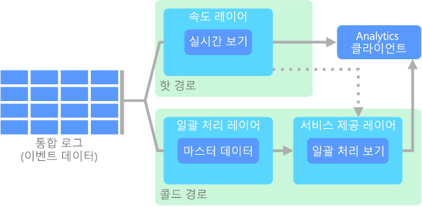

# 빅 데이터 아키텍처

빅 데이터 아키텍처는 기존의 데이터베이스 시스템에 비해 너무 크거나 복잡한 데이터의 수집, 처리 및 분석을 수행하도록 디자인되었습니다. 조직이 빅 데이터 영역으로 전환하게 되는 시점은 사용자의 역량과 사용하는 도구에 따라 다릅니다. 수백 기가바이트의 데이터일 수도 있고, 수백 테라바이트의 데이터일 수도 있습니다. 빅 데이터 집합으로 작업하기 위한 도구가 발전하면서 빅 데이터의 의미도 달라지고 있습니다. 이 용어는 엄격히 데이터 크기만을 고려하지 않고, 고급 분석을 통해 데이터 집합에서 추출할 수 있는 가치와 점점 더 밀접한 관련을 갖습니다. 데이터 크기만 고려한다면 빅 데이터는 훨씬 더 큰 데이터일 것입니다.

수 년에 걸쳐 데이터 환경이 변경되어 왔습니다. 데이터로 수행할 수 있는 작업이나 수행하려는 작업이 변경되었습니다. 데이터가 수집되는 방법이 점점 더 다양해지면서, 저장 비용은 크게 감소되었습니다. 빠른 속도로 도착하며 지속적으로 수집 및 관찰해야 하는 데이터가 있습니다. 느리게 도착하지만 대량의 청크로 구성된 수십 년 간의 기록 데이터도 있습니다. 고급 분석 문제나 기계 학습이 필요한 경우에 직면할 수도 있습니다. 이러한 점이 바로 빅 데이터 아키텍처가 해결하려고 하는 문제점입니다.

빅 데이터 솔루션에는 일반적으로 다음 중 하나 이상의 워크로드 유형이 포함됩니다.

* 미사용 빅 데이터 원본의 일괄 처리
* 사용 중인 빅 데이터의 실시간 처리
* 빅 데이터의 대화형 탐색
* 예측 분석 및 기계 학습

다음 작업이 필요할 때 빅 데이터 아키텍처를 고려합니다.

* 기존 데이터베이스에 비해 너무 큰 볼륨의 데이터 저장 및 처리
* 분석 및 보고를 위해 구조화되지 않은 데이터 변환
* 제한되지 않은 데이터 스트림을 실시간으로 또는 짧은 대기 시간으로 수집, 처리 및 분석

## 빅 데이터 아키텍처의 구성 요소

다음 다이어그램에서는 빅 데이터 아키텍처에 맞는 논리적 구성 요소를 보여 줍니다. 개별 솔루션이 이 다이어그램에 있는 모든 항목을 포함하지는 않을 수 있습니다.

 

대부분의 빅 데이터 아키텍처에는 다음 구성 요소의 일부 또는 전체가 포함됩니다.

* **데이터 원본**. 모든 빅 데이터 솔루션은 하나 이상의 데이터 원본으로 시작합니다. 이러한 예로 다음이 포함됩니다.

    * 응용 프로그램 데이터 저장소(예: 관계형 데이터베이스)
    * 응용 프로그램에서 생성하는 정적 파일(예: 웹 서버 로그 파일)
    * 실시간 데이터 원본(예: IoT 장치)

* **데이터 저장소**. 일괄 처리 작업을 위한 데이터는 대개 대용량 파일을 다양한 형식으로 저장할 수 있는 분산 파일 저장소에 저장됩니다. 이런 종류의 저장소를 *Data Lake*라고도 합니다. 이 저장소를 구현하기 위한 옵션으로는 Azure Data Lake Store 또는 Azure Storage의 BLOB 컨테이너가 있습니다.

* **일괄 처리**. 데이터 집합이 너무 큰 경우 빅 데이터 솔루션은 필터링, 집계 및 그 밖의 분석을 위한 데이터를 준비하기 위해 장기간 실행되는 일괄 처리 작업을 사용하여 데이터 파일을 처리해야 하는 경우가 있습니다. 일반적으로 이러한 작업은 원본 파일 읽기 및 처리와 새 파일에 출력 작성으로 이루어집니다. 옵션에는 Azure Data Lake Analytics에서 U-SQL 작업 실행, HDInsight Hadoop 클러스터에서 Hive, Pig 또는 사용자 지정 Map/Reduce 작업 사용, HDInsight Spark 클러스터에서 Java, Scala 또는 Python 프로그램 사용 등이 있습니다.

* **실시간 메시지 수집**. 솔루션에 실시간 원본이 포함되는 경우 스트림 처리를 위해 실시간 메시지를 캡처하고 저장하는 방법이 아키텍처에 포함되어야 합니다. 이는 들어오는 메시지가 처리를 위해 폴더에 저장되는 간단한 데이터 저장소일 수 있습니다. 그러나 많은 솔루션에는 메시지에 대한 버퍼로 작동하고 스케일 아웃 처리, 안정적인 전달 및 기타 메시지 큐 의미 체계를 지원하는 메시지 수집 저장소가 필요합니다. 스트리밍 아키텍처의 이 부분을 스트림 버퍼링이라고도 합니다. 옵션에는 Azure Event Hubs, Azure IoT Hub 및 Kafka가 포함됩니다.

* **스트림 처리**. 실시간 메시지를 캡처한 후 솔루션은 필터링, 집계 및 그 밖의 분석을 위한 데이터 준비를 통해 해당 메시지를 처리해야 합니다. 그런 다음, 처리된 스트림 데이터는 출력 싱크에 기록됩니다. Azure Stream Analytics는 제한되지 않은(Unbounded) 스트림에서 작동하는 영구적으로 실행되는 SQL 쿼리를 기반으로 관리되는 스트림 처리 서비스를 제공합니다. 또한 HDInsight 클러스터에서 Storm 및 Spark Streaming과 같은 오픈 소스 Apache 스트리밍 기술을 사용할 수도 있습니다.

* **분석 데이터 저장소**. 대다수의 빅 데이터 솔루션은 분석할 데이터를 준비한 다음, 분석 도구를 사용하여 쿼리할 수 있는 구조화된 형식으로 처리된 데이터를 제공합니다. 이러한 쿼리를 처리하는 데 사용되는 분석 데이터 저장소로는 대부분의 기존 BI(비즈니스 인텔리전스) 솔루션에서 볼 수 있는 Kimball 스타일의 관계형 데이터 웨어하우스가 있습니다. 또는 HBase와 같이 대기 시간이 짧은 NoSQL 기술이나, 분산 데이터 저장소의 데이터 파일에 대한 메타데이터 추상화를 제공하는 대화형 Hive 데이터베이스를 통해 데이터를 제공할 수 있습니다. Azure SQL Data Warehouse는 클라우드 기반의 대규모 데이터 웨어하우징을 위한 관리형 서비스를 제공합니다. HDInsight는 대화형 Hive, HBase 및 Spark SQL을 지원하며 이들을 사용하여 분석용 데이터를 처리할 수도 있습니다.

* **분석 및 보고**. 대부분의 빅 데이터 솔루션의 목표는 분석 및 보고를 통해 데이터에 대한 정보를 제공하는 것입니다. 사용자의 데이터 분석을 지원하도록 아키텍처에는 Azure Analysis Services의 다차원 OLAP 큐브 또는 테이블 형식 데이터 모델과 같은 데이터 모델링 계층이 포함될 수 있습니다. 또한 Microsoft Power BI 또는 Microsoft Excel의 모델링 기술 및 시각화 기술을 사용하여 셀프 서비스 BI를 지원할 수도 있습니다. 분석 및 보고는 데이터 과학자 또는 데이터 분석가에 의한 대화형 데이터 탐색의 형태를 취할 수도 있습니다. 이러한 시나리오의 경우 많은 Azure 서비스가 Jupyter와 같은 분석용 노트북을 지원하므로 사용자가 Python 또는 R을 사용하여 기존 기술을 활용할 수 있습니다. 대규모 데이터 탐색의 경우 Microsoft R Server를 독립적으로 또는 Spark와 함께 사용할 수 있습니다.

* **오케스트레이션**. 대부분의 빅 데이터 솔루션은 원본 데이터를 변환하고, 여러 원본과 싱크 간에 데이터를 이동하고, 처리된 데이터를 분석 데이터 저장소로 로드하거나, 또는 결과를 보고서나 대시보드로 직접 전달하는 '반복되는 데이터 처리 작업'을 워크플로 내에 캡슐화한 형태로 구성됩니다. 이러한 워크플로를 자동화하기 위해 Azure Data Factory 또는 Apache Oozie 및 Sqoop과 같은 오케스트레이션 기술을 사용할 수 있습니다.

## 람다 아키텍처

매우 큰 데이터 집합을 사용할 경우 클라이언트가 필요로 하는 쿼리 종류를 실행하는 데 시간이 오래 걸릴 수 있습니다. 이러한 쿼리는 실시간으로 수행할 수 없으며, [MapReduce](https://en.wikipedia.org/wiki/MapReduce)와 같이 전체 데이터 집합에 대해 병렬로 작동하는 알고리즘이 필요할 수 있습니다. 그런 후 결과는 원시 데이터와 별도로 저장되고 쿼리에 사용됩니다.

이 방식의 한 가지 단점은 대기 시간이 발생한다는 것입니다. 즉, 처리에 몇 시간이 걸릴 경우 쿼리는 몇 시간 늦은 결과를 반환할 수 있습니다. 일부 결과를 실시간으로 가져온 후(정확도가 다소 손실될 수 있음) 이러한 결과를 일괄 처리 분석의 결과와 조합하면 이상적일 것입니다.

Nathan Marz가 최초로 제안한 **람다 아키텍처**는 데이터 흐름에 대해 두 개의 경로를 만들어 이 문제를 해결합니다. 시스템으로 들어오는 모든 데이터는 다음 두 경로를 거칩니다.

* **일괄 처리 계층**(실행 부하 미달 경로)은 들어오는 모든 데이터를 원시 형식으로 저장하고 해당 데이터에 대해 일괄 처리를 수행합니다. 이러한 처리의 결과는 **일괄 처리 보기**로 저장됩니다.

* **빠른 레이어**(실행 부하 과다 경로)는 데이터를 실시간으로 분석합니다. 이 계층은 정확도는 떨어지지만 짧은 대기 시간을 제공하도록 디자인되었습니다.

일괄 처리 계층은 효율적인 쿼리를 위해 일괄 처리 보기를 인덱싱하는 **서비스 계층**으로 이동됩니다. 빠른 계층은 가장 최근 데이터를 기준으로 하는 증분 업데이트로 서비스 계층을 업데이트합니다.

실행 부하 과다 경로로 이동하는 데이터는 빠른 계층의 대기 시간 요구 사항으로 제약되므로 가능한 한 빠르게 처리될 수 있습니다. 대개, 가능한 한 빠르게 데이터를 준비하기 위해 정확도는 어느 정도 손상되게 됩니다. 예를 들어, 많은 수의 온도 센서가 원격 분석 데이터를 보내는 IoT 시나리오를 고려해 보세요. 들어오는 데이터의 슬라이딩 기간을 처리하기 위해 빠른 계층을 사용할 수 있습니다. 

반면에 실행 부하 미달 경로로 흐르는 데이터에는 동일한 짧은 대기 시간 요구 사항이 적용되지 않습니다. 따라서 큰 데이터 집합에서 시간이 많이 소요되는 높은 정확도의 계산이 수행될 수 있습니다. 

결과적으로, 실행 부하 과다 경로 및 실행 부하 미달 경로가 분석 클라이언트 응용 프로그램에서 수렴됩니다. 클라이언트는 덜 정확할 수 있는 데이터를 실시간으로 표시해야 할 경우 실행 부하 과다 경로에서 해당 결과를 얻게 됩니다. 그렇지 않은 경우, 실행 부하 미달 경로에서 결과를 선택하여 시기 적절성은 떨어지지만 좀 더 정확한 데이터를 표시합니다. 즉, 실행 부하 과다 경로는 비교적 짧은 기간 동안 데이터를 보유하며, 그 이후에는 실행 부하 미달 경로의 보다 정확한 데이터로 업데이트될 수 있습니다.

일괄 처리 계층에 저장된 원시 데이터는 변경할 수 없습니다. 들어오는 데이터는 항상 기존 데이터에 추가되며, 이전 데이터를 덮어쓰지 않습니다. 특정 데이터 값의 변경 내용은 새 타임스탬프 이벤트 레코드로 저장됩니다. 따라서 데이터가 수집되는 모든 시점에서 재계산을 수행할 수 있습니다. 원래의 원시 데이터에서 일괄 처리 보기를 다시 계산하는 기능은 매우 중요합니다. 시스템 변화에 따라 새로운 보기를 만들 수 있기 때문입니다. 

## 카파 아키텍처

람다 아키텍처의 단점은 복잡하다는 것입니다. 처리 논리는 다른 프레임워크를 사용하는 실행 부하 과다 경로와 실행 부하 미달 경로의 두 위치에서 나타납니다. 이로 인해 중복된 계산 논리와 두 경로의 아키텍처 관리에 따른 복잡성이 발생합니다.

**카파 아키텍처**는 람다 아키텍처의 대안으로 Jay Kreps가 제안했습니다. 람다 아키텍처와 기본 목표는 같지만, 모든 데이터가 스트림 처리 시스템을 사용하여 단일 경로를 따라 흐른다는 중요한 차이점이 있습니다. 

이벤트 데이터가 변경 불가능하며, 일부가 아닌 전체가 수집된다는 측면은 람다 아키텍처의 일괄 처리 계층과 약간 유사합니다. 데이터는 이벤트 스트림 형태로 내결함성이 있는 분산 통합 로그로 수집됩니다. 이러한 이벤트는 순서대로 정렬되며, 이벤트의 현재 상태는 추가되는 새 이벤트에 의해서만 변경됩니다. 람다 아키텍처의 빠른 계층과 비슷하게, 모든 이벤트 처리가 입력 스트림에서 수행되고 실시간 보기로 유지됩니다. 

전체 데이터 집합을 다시 계산해야 하는 경우(일괄 처리 계층이 람다에서 수행하는 것과 같음) 스트림을 재생하기만 하면 됩니다. 그러면 병렬화를 통해 시기 적절하게 계산이 완료됩니다.

## IoT(사물 인터넷)

실제 관점에서 보면, IoT(사물 인터넷)는 인터넷에 연결된 모든 장치를 나타냅니다. 여기에는 PC, 휴대폰, 스마트 워치, 스마트 자동 온도 조절기, 스마트 냉장고, 연결된 자동차, 심장 모니터링 보형물 및 인터넷에 연결되고 데이터를 주고받는 모든 장치가 포함됩니다. 연결된 장치 수가 매일 증가하고 있으며 이러한 장치에서 수집되는 데이터의 양도 증가하고 있습니다. 종종 이러한 데이터는 매우 제한적이면서, 경우에 따라 대기 시간이 긴 환경에서 수집됩니다. 경우에 따라 데이터가 수천만 또는 수백만 개의 장치에서 낮은 대기 시간 환경으로 전송되므로, 그에 따라 데이터를 빠르게 수집하고 처리하는 기능도 요구됩니다. 따라서 이러한 제약 및 고유한 요구 사항을 처리하기 위한 적절한 계획이 필요합니다.

이벤트 기반 아키텍처는 IoT 솔루션의 핵심입니다. 다음 다이어그램은 IoT의 가능한 논리 아키텍처를 보여 줍니다. 이 다이어그램에서는 아키텍처의 이벤트 스트리밍 구성 요소가 강조 표시되어 있습니다.

**클라우드 게이트웨이**는 안정적이고 대기 시간이 짧은 메시징 시스템을 사용하여 클라우드 경계에서 장치 이벤트를 수집합니다.

장치는 클라우드 게이트웨이에 직접 또는 **필드 게이트웨이**를 통해 이벤트를 보낼 수 있습니다. 필드 게이트웨이는 이벤트를 수신하여 클라우드 게이트웨이에 전달하는 특수 장치 또는 소프트웨어이며 일반적으로 장치와 함께 배치됩니다. 필드 게이트웨이에서 필터링, 집계, 프로토콜 변환 등의 기능을 수행하여 원시 장치 이벤트를 전처리할 수도 있습니다.

수집된 이벤트는 데이터를 저장소 등으로 라우트하거나 분석 및 기타 처리를 수행할 수 있는 하나 이상의 **스트림 프로세서**를 통과합니다.

다음은 몇 가지 일반적인 처리 유형입니다. (전체 목록은 아닙니다.)

- 보관 또는 배치 분석을 위해 콜드 스토리지에 이벤트 데이터 기록.

- 실행 부하 과다 경로 분석, (거의) 실시간으로 이벤트 스트림을 분석하여 이상 검색, 롤링 기간의 패턴 인식 또는 스트림에서 특정 조건이 발생할 때 경고 트리거. 

- 알림, 경보 등 장치에서 수신된 특수 유형의 비원격 분석 메시지 처리. 

- 기계 학습.

회색으로 표시된 상자는 이벤트 스트리밍과 직접 관련되지 않은 IoT 시스템의 구성 요소를 표시하지만 전체 표시를 위해 여기에 포함되었습니다.

- **장치 레지스트리**는 장치 ID와 일반적으로 장치 메타데이터(예: 위치)를 포함하는 프로비전된 장치의 데이터베이스입니다.

- **프로비저닝 API**는 새 장치를 프로비전 및 등록하기 위한 공통 외부 인터페이스입니다.

- 일부 IoT 솔루션에서는 **명령 및 제어 메시지**를 장치에 전송할 수 있습니다.

관련 Azure 서비스:

- [Azure IoT Hub](https://azure.microsoft.com/services/iot-hub/)
- [Azure Event Hubs](https://azure.microsoft.com/services/event-hubs/)
- [Azure Stream Analytics](https://azure.microsoft.com/services/stream-analytics/)  

[Azure IoT 참조 아키텍처](https://azure.microsoft.com/updates/microsoft-azure-iot-reference-architecture-available/)를 읽어 Azure의 IoT에 대해 자세히 알아보세요.

