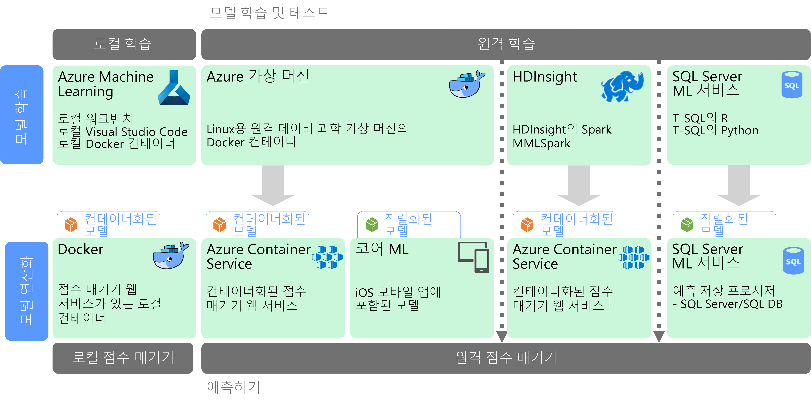

# 대규모 Machine LearningMachine learning at scale

ML(Machine Learning)은 수학적 알고리즘을 기준으로 예측 모델을 학습하는 데 사용하는 기술입니다.Machine learning (ML) is a technique used to train predictive models based on mathematical algorithms. Machine Learning에서는 데이터 필드 간 관계를 분석하여 알 수 없는 값을 예측합니다.Machine learning analyzes the relationships between data fields to predict unknown values.

Machine Learning 모델을 만들고 배포하는 과정은 대화형 프로세스입니다.Creating and deploying a machine learning model is an iterative process:

* 데이터 과학자는 원본 데이터를 탐색하여 *특성* 및 예측 *레이블* 간 관계를 확인합니다.Data scientists explore the source data to determine relationships between *features* and predicted *labels*.
* 데이터 과학자는 적절한 알고리즘을 기준으로 모델을 학습하고 유효성을 검사하여 예측의 최적 모델을 찾습니다.The data scientists train and validate models based on appropriate algorithms to find the optimal model for prediction.
* 최적 모델은 웹 서비스 또는 캡슐화된 다른 함수처럼 프로덕션 환경으로 배포됩니다.The optimal model is deployed into production, as a web service or some other encapsulated function.
* 새 데이터가 수집되면 모델은 주기적으로 다시 학습되어 효율성을 개선해 나갑니다.As new data is collected, the model is periodically retrained to improve is effectiveness.

대규모 Machine Learning은 두 개의 다른 확장성 문제를 해결합니다.Machine learning at scale addresses two different scalability concerns. 첫 번째는 학습을 위해 클러스터의 스케일 아웃 기능을 필요로 하는 대규모 데이터 집합에 대해 모델을 학습하는 것입니다.The first is training a model against large data sets that require the scale-out capabilities of a cluster to train. 두 번째 센터는 해당 모델을 사용하는 응용 프로그램의 요구를 충족하도록 확장될 수 있는 방식으로 학습된 모델을 연산화하는 것입니다.The second centers is operationalizating the learned model in a way that can scale to meet the demands of the applications that consume it. 일반적으로 이 작업은 예츠 기능을 웹 서비스로 배포하여 수행한 후 스케일 아웃할 수 있습니다.Typically this is accomplished by deploying the predictive capabilities as a web service that can then be scaled out.

데이터가 많을 수록 더 나은 모델이 생성되므로, 대규모 Machine Learning은 강력한 예측 능력을 생성할 수 있다는 장점이 있습니다.Machine learning at scale has the benefit that it can produce powerful, predictive capabilities because better models typically result from more data. 일단 학습된 모델은 뛰어난 상태 비저장 스케일 아웃 웹 서비스로 배포될 수 있습니다.Once a model is trained, it can be deployed as a stateless, highly-performant, scale-out web service. 

## 모델 준비 및 학습Model preparation and training

모델 준비 및 학습 단계 동안, 데이터 과학자는 Python 및 R과 같은 언어를 통해 대화형으로 데이터를 탐색함으로써 다음 작업을 수행합니다.During the model preparation and training phase, data scientists explore the data interactively using languages like Python and R to:

* 대용량 데이터 저장소에서 샘플을 추출합니다.Extract samples from high volume data stores.
* 이상값, 중복 및 누락 값을 찾아 처리하여 데이터를 정리합니다.Find and treat outliers, duplicates, and missing values to clean the data.
* 분석 및 시각화를 통해 데이터의 상관 관계 및 관계를 파악합니다.Determine correlations and relationships in the data through statistical analysis and visualization.
* 통계 관계의 예측 가능성을 개선하는 새 계산 기능을 생성합니다.Generate new calculated features that improve the predictiveness of statistical relationships.
* 예측 알고리즘에 따라 ML 모델을 학습합니다.Train ML models based on predictive algorithms.
* 학습 동안 보류된 데이터를 사용하여 학습된 모델의 유효성을 검사합니다.Validate trained models using data that was withheld during training.

이 대화형 분석 및 모델링 단계를 지원하려면 데이터 플랫폼은 데이터 과학자들이 다양한 도구를 사용하여 데이터를 탐색할 수 있도록 해야 합니다.To support this interactive analysis and modeling phase, the data platform must enable data scientists to explore data using a variety of tools. 또한 복잡한 Machine Learning 모델을 학습하려면 많은 양의 대용량 데이터를 집중적으로 처리해야 하므로, 모델 학습을 스케일 아웃할 수 있는 충분한 리소스가 필요합니다.Additionally, the training of a complex machine learning model can require a lot of intensive processing of high volumes of data, so sufficient resources for scaling out the model training is essential.

## 모델 배포 및 소비Model deployment and consumption

모델은 배포할 준비가 되면 웹 서비스로 캡슐화되고, 클라우드, 에지 장치 또는 엔터프라이즈 ML 실행 환경 내에 배포될 수 있습니다.When a model is ready to be deployed, it can be encapsulated as a web service and deployed in the cloud, to an edge device, or within an enterprise ML execution environment. 이 배포 프로세스를 운영화라고 합니다.This deployment process is referred to as operationalization.

## 과제Challenges

대규모 Machine Learning은 다음과 같은 몇 가지 문제를 생성합니다.Machine learning at scale produces a few challenges:

- 일반적으로 모델을 학습하기 위해서는 많은 데이터가 필요합니다. 특히 심층 학습 모델의 경우는 더 그렇습니다.You typically need a lot of data to train a model, especially for deep learning models.
- 모델 학습을 시작하기 전부터도 이러한 빅 데이터 집합을 준비해야 합니다.You need to prepare these big data sets before you can even begin training your model.
- 모델 학습 단계에서 빅 데이터 저장소에 액세스해야 합니다.The model training phase must access the big data stores. Spark와 같이 데이터 준비에 사용되는 것과 동일한 빅 데이터 클러스터를 사용하여 모델 학습을 수행하는 것이 일반적입니다.It's common to perform the model training using the same big data cluster, such as Spark, that is used for data preparation. 
- 심층 학습과 같은 시나리오의 경우, CPU에서 스케일 아웃을 제공할 수 있는 클러스터가 필요할 뿐만 아니라, 클러스터 자체가 GPU 지원 노드로 구성되어야 합니다.For scenarios such as deep learning, not only will you need a cluster that can provide you scale out on CPUs, but your cluster will need to consist of GPU-enabled nodes.

## Azure의 대규모 Machine LearningMachine learning at scale in Azure

학습 및 운영화에 사용할 ML 서비스를 결정하기 전에, 모델을 학습해야 하는지 또는 미리 작성된 모델로 요구를 충족할 수 있는지를 고려합니다.Before deciding which ML services to use in training and operationalization, consider whether you need to train a model at all, or if a prebuilt model can meet your requirements. 대부분의 경우, 미리 작성된 모델을 사용하면 웹 서비스를 호출하거나 ML 라이브러리를 사용하여 기존 모델을 로드하는 정도만 가능합니다.In many cases, using a prebuilt model is just a matter of calling a web service or using an ML library to load an existing model. 이러한 옵션에는 다음이 포함됩니다.Some options include: 

- Microsoft Cognitive Services에서 제공 하는 웹 서비스를 사용합니다.Use the web services provided by Microsoft Cognitive Services.
- Cognitive 도구 키트에서 제공하는 미리 학습된 신경망 모델을 사용합니다.Use the pretrained neural network models provided by Cognitive Toolkit.
- iOS 앱용 핵심 ML이 제공하는 직렬화된 모델을 포함합니다.Embed the serialized models provided by Core ML for an iOS apps. 

미리 작성된 모델이 사용자의 데이터 또는 시나리오에 맞지 않을 경우, Azure에서 Azure Machine Learning, HDInsight(Spark MLlib 및 MMLSpark 포함), Cognitive 도구 키트 및 SQL Machine Learning Services와 같은 옵션을 사용할 수 있습니다.If a prebuilt model does not fit your data or your scenario, options in Azure include Azure Machine Learning, HDInsight with Spark MLlib and MMLSpark, Cognitive Toolkit, and SQL Machine Learning Services. 사용자 지정 모델을 사용하려는 경우, 모델 학습 및 운영화를 포함하는 파이프라인을 디자인해야 합니다.If you decide to use a custom model, you must design a pipeline that includes model training and operationalization. 

Azure의 ML에 대한 기술 선택 목록을 보려면 다음 항목을 참조하세요.For a list of technology choices for ML in Azure, see the following topics:

- [Cognitive Services 기술 선택Choosing a cognitive services technology](../technology-choices/cognitive-services.md)
- [Machine Learning 기술 선택Choosing a machine learning technology](../technology-choices/data-science-and-machine-learning.md)
- [자연어 처리 기술 선택Choosing a natural language processing technology](../technology-choices/natural-language-processing.md)
