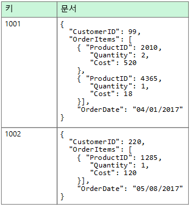
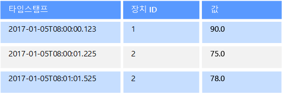
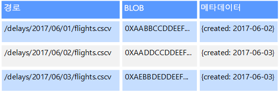
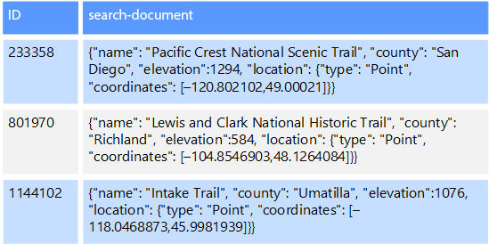

# 비관계형 데이터 및 NoSQL

*비관계형 데이터베이스*는 대부분의 전형적인 데이터베이스 시스템에서 찾을 수 있는 행과 열로 이루어진 테이블 형식 스키마를 사용하지 않는 데이터베이스입니다. 대신 비관계형 데이터베이스는 저장되는 데이터 형식의 특정 요구 사항에 맞게 최적화된 저장소 모델을 사용합니다. 예를 들어, 데이터는 단순 키/값 쌍, JSON 문서 또는 모서리와 꼭짓점으로 이루어진 그래프로 저장될 수 있습니다. 

이러한 모든 데이터 저장소가 갖는 공통점은 [관계형 모델](./relational-data.md)을 사용하지 않는다는 것입니다. 또한 지원하는 데이터 형식과 데이터를 쿼리할 수 있는 방법도 좀 더 구체적일 수 있습니다. 예를 들어, 시계열 데이터 저장소는 시간 기준 데이터 시퀀스에 대한 쿼리에 맞게 최적화되어 있지만, 그래프 데이터 저장소는 엔터티 간에 가중치가 적용된 관계를 탐색하는 데 최적화되어 있습니다. 두 형식 모두 트랜잭션 데이터의 관리 태스크로는 잘 일반화되지 않습니다. 

용어 *NoSQL*은 쿼리에 SQL을 사용하지 않고, 대신 다른 프로그래밍 언어 및 구문을 사용하여 데이터를 쿼리하는 데이터 저장소를 나타냅니다. 실제로, 이러한 많은 데이터베이스가 SQL 호환 쿼리를 지원하더라도, "NoSQL"은 "비관계형 데이터베이스"를 의미합니다. 그러나 기본 쿼리 실행 전략은 일반적으로 전형적인 RDBMS가 동일한 SQL 쿼리를 실행하는 방식과 매우 다릅니다.

다음 섹션에서는 비관계형 또는 NoSQL 데이터베이스의 주요 범주를 설명합니다.

## 문서 데이터 저장소
문서 데이터 저장소는 *문서*라고 하는 엔터티에서 명명된 문자열 필드 및 개체 데이터 값의 집합을 관리합니다. 일반적으로 이러한 데이터 저장소는 JSON 문서 형식으로 데이터를 저장합니다. 각 필드 값은 숫자와 같은 스칼라 항목이거나 목록 또는 부모-자식 컬렉션과 같은 복합 요소일 수 있습니다. 문서 필드의 데이터는 XML, YAML, JSON, BSON을 비롯한 다양한 방법으로 인코딩되거나 일반 텍스트로 저장될 수도 있습니다. 문서 내의 필드는 저장소 관리 시스템에 표시되므로 응용 프로그램에서 이러한 필드의 값을 사용하여 데이터를 쿼리하고 필터링할 수 있습니다.  

일반적으로 문서에는 엔터티의 전체 데이터가 포함됩니다. 엔터티를 구성하는 항목은 응용 프로그램에 따라 다릅니다. 예를 들어, 엔터티에는 고객의 세부 정보, 주문 또는 이 두 정보의 조합을 포함할 수 있습니다. RDBMS(관계형 데이터베이스 관리 시스템)의 여러 관계형 테이블에 분산된 정보가 단일 문서에 포함될 수도 있습니다. 문서 저장소의 모든 문서가 동일한 구조를 가질 필요는 없습니다. 이 자유 형식 접근 방식은 많은 유연성을 제공합니다. 예를 들어, 비즈니스 요구 사항의 변경에 대한 응답으로, 응용 프로그램은 문서에 다른 데이터를 저장할 수 있습니다.  

  

응용 프로그램은 문서 키를 사용하여 문서를 검색할 수 있습니다. 문서 키란 데이터를 균등하게 분산하는 데 사용되는 문서의 고유 식별자로서 종종 해시됩니다. 일부 문서 데이터베이스는 자동으로 문서 키를 만듭니다. 다른 문서 데이터베이스에서는 키로 사용할 문서의 특성을 사용자가 지정할 수 있습니다. 응용 프로그램은 하나 이상의 필드 값을 기반으로 문서를 쿼리할 수도 있습니다. 일부 문서 데이터베이스는 하나 이상의 인덱싱된 필드를 기반으로 문서를 빠르게 조회할 수 있도록 인덱싱을 지원합니다.  

많은 문서 데이터베이스에서는 응용 프로그램에서 전체 문서를 다시 작성하지 않고도 문서의 특정 필드 값을 수정할 수 있는 내부 업데이트를 지원합니다. 단일 문서의 여러 필드에 대한 읽기 및 쓰기 작업은 일반적으로 원자성입니다.

관련 Azure 서비스:  

- [Azure Cosmos DB](https://azure.microsoft.com/services/cosmos-db/)

## 칼럼 형식 데이터 저장소
칼럼 형식 또는 열 패밀리 데이터 저장소는 데이터를 열과 행으로 구성합니다. 가장 간단한 형태인 열 패밀리 데이터 저장소는 적어도 개념적으로 관계형 데이터베이스와 매우 유사하게 보일 수 있습니다. 열 패밀리 데이터베이스의 이점은 데이터를 저장하는 열 기반 접근법에서 파생된 스파스 데이터를 구조화하기 위한 비정규화된 접근법에 있습니다.  

열 패밀리 데이터 저장소는 행과 열이 있는 표 형식 데이터로 생각할 수 있지만 열은 열 패밀리라는 그룹으로 나뉩니다. 각 열 패밀리는 논리적으로 관련되어 있고 일반적으로 하나의 단위로 검색되거나 조작되는 열 집합을 보유합니다. 개별적으로 액세스되는 다른 데이터는 별도의 열 패밀리에 저장할 수 있습니다. 열 패밀리 내에서 새 열을 동적으로 추가할 수 있고 행은 스파스될 수 있습니다. 즉, 행은 모든 열에 대해 값을 가질 필요가 없습니다. 

다음 다이어그램은 `Identity` 및 `Contact Info`의 두 열 패밀리가 있는 예를 보여 줍니다. 단일 엔터티의 데이터에는 각 열 패밀리에서 동일한 행 키가 있습니다. 열 패밀리의 특정 개체에 대한 행이 동적으로 달라질 수 있는 이 구조는 열 패밀리 접근 방식의 중요한 이점이므로 이 데이터 저장소 형식은 다양한 스키마와 함께 데이터를 저장하는 데 매우 적합합니다.

키/값 저장소 또는 문서 데이터베이스와 달리 대부분의 열 패밀리 데이터베이스는 해시를 계산하지 않고 키 순서로 데이터를 저장합니다. 행 키는 기본 인덱스로 간주되며, 특정 키 또는 키 범위를 통한 키 기반 액세스를 허용합니다. 일부 구현을 통해 열 패밀리의 특정 열에 대한 보조 인덱스를 만들 수 있습니다. 보조 인덱스를 사용하면 행 키가 아닌 열 값으로 데이터를 검색할 수 있습니다.

디스크에서 열 패밀리 내의 모든 열은 동일한 파일에 함께 저장되며, 각 파일에는 특정 수의 행이 포함됩니다. 큰 데이터 집합을 사용할 경우 이 접근법은 한 번에 몇 개의 열만 쿼리될 때 디스크에서 읽어야 하는 데이터 양을 줄임으로써 성능을 높여줍니다. 

행에 대한 읽기 및 쓰기 작업은 일반적으로 단일 열 패밀리에 대해 원자성이지만 일부 구현은 여러 열 패밀리에 걸쳐 전체 행에 원자성을 제공합니다.

관련 Azure 서비스:  

- [HDInsight의 HBase](/azure/hdinsight/hdinsight-hbase-overview)

## 키/값 데이터 저장소
키/값 저장소는 기본적으로 큰 해시 테이블입니다. 각 데이터 값을 고유한 키와 연결하고 키/값 저장소는 이 키를 사용하여 적절한 해시 알고리즘을 통해 데이터를 저장합니다. 해시 알고리즘은 데이터 저장소 전반에 해시 키가 균등하게 분산되도록 하기 위해 선택됩니다.

대부분의 키/값 저장소는 간단한 쿼리, 삽입 및 삭제 작업만 지원합니다. 값을 수정(부분적으로 또는 완전히)하려면 응용 프로그램이 전체 값에 대해 기존 데이터를 덮어써야 합니다. 대부분의 구현에서 단일 값 읽기 또는 쓰기는 원자성 작업입니다. 값이 클 경우 쓸 때 약간의 시간이 걸릴 수 있습니다.

응용 프로그램은 임의의 데이터를 값 집합으로 저장할 수 있지만 일부 키/값 저장소는 값의 최대 크기를 제한합니다. 저장된 값은 저장소 시스템 소프트웨어에 불투명합니다. 모든 스키마 정보는 응용 프로그램에서 제공하고 해석해야 합니다. 본질적으로 값은 BLOB이며 키/값 저장소는 키로 값을 검색하거나 저장합니다.

키/값 저장소는 키의 값을 사용하거나 키 범위별로 간단한 조회를 수행하는 응용 프로그램에 대해 최적화되어 있지만, 여러 테이블 간에 데이터를 조인하는 경우처럼 다른 키/값 테이블 사이에서 데이터를 쿼리해야 하는 시스템에는 덜 적절합니다. 

키/값 저장소는 키에 따라서만 조회를 수행하는 것이 아니라 키 이외의 값별 조회나 필터링이 중요한 시나리오에 대해서도 최적화되어 있지 않습니다. 예를 들어, 관계형 데이터베이스의 경우 WHERE 절을 사용하여 키가 아닌 열을 필터링함으로써 레코드를 찾을 수 있지만, 키/값 저장소는 일반적으로 값에 대해 이러한 유형의 조회 기능을 제공하지 않으며, 제공한다고 해도 모든 값을 느리게 검색할 수밖에 없습니다.

단일 키/값 저장소는 별도의 컴퓨터에 있는 여러 노드에 데이터를 쉽게 배포할 수 있으므로 확장성이 매우 뛰어납니다.

관련 Azure 서비스:  
- [Azure Cosmos DB 테이블 API](/azure/cosmos-db/table-introduction)  
- [Azure Redis 캐시(영문)](https://azure.microsoft.com/services/cache/)  
- [Azure Table Storage](https://azure.microsoft.com/services/storage/tables/)

## 그래프 데이터 저장소
그래프 데이터 저장소는 노드와 에지, 두 가지 유형의 정보를 관리합니다. 노드는 엔터티를 나타내고, 에지는 이러한 엔터티 간의 관계를 지정합니다. 노드와 에지 모두 테이블의 열과 마찬가지로 해당 노드 또는 에지에 대한 정보를 제공하는 속성을 가질 수 있습니다. 에지는 또한 관계의 특성을 나타내는 방향을 가질 수 있습니다.  

그래프 데이터 저장소의 목적은 응용 프로그램이 노드와 에지의 네트워크를 트래버스하는 쿼리를 효율적으로 수행하고 엔터티 간의 관계를 분석할 수 있게 하는 것입니다. 다음 다이어그램은 그래프로 구성된 조직의 인사 데이터를 보여 줍니다. 엔터티는 직원 및 부서이며, 에지는 보고 관계 및 직원이 근무하는 부서를 나타냅니다. 이 그래프에서 에지의 화살표는 관계 방향을 나타냅니다.

이 구조를 통해 "Sarah에게 직접 또는 간접적으로 보고하는 모든 직원 찾기" 또는 "John과 같은 부서에서 근무하는 직원"과 같은 쿼리를 간단하게 수행할 수 있습니다. 엔터티와 관계가 많은 대형 그래프의 경우 매우 복잡한 분석을 매우 신속하게 수행할 수 있습니다. 많은 그래프 데이터베이스는 관계 네트워크를 효율적으로 트래버스하는 데 사용할 수 있는 쿼리 언어를 제공합니다.  

관련 Azure 서비스:  
- [Azure Cosmos DB Graph API](/azure/cosmos-db/graph-introduction)  

## 시계열 데이터 저장소
시계열 데이터는 시간별로 구성된 값 집합이며 시계열 데이터 저장소는 이러한 유형의 데이터에 대해 최적화되어 있습니다. 시계열 데이터 저장소는 대개 여러 소스에서 대량의 데이터를 실시간으로 수집하기 때문에 매우 많은 쓰기를 지원해야 합니다. 시계열 데이터 저장소는 원격 분석 데이터를 저장하도록 최적화되어 있습니다. 시나리오에는 IoT 센서 또는 응용 프로그램/시스템 카운터가 포함됩니다. 업데이트는 거의 발생하지 않으며 삭제는 종종 대량 작업으로 수행됩니다.

시계열 데이터베이스에 기록된 레코드는 일반적으로 작지만 레코드 수가 많아 전체 데이터 크기가 빠르게 커지는 경우가 종종 있습니다. 시계열 데이터 저장소는 순서가 맞지 않고 늦게 도착하는 데이터, 데이터 요소의 자동 인덱싱, 시간 측면에서 기술된 쿼리의 최적화도 처리합니다. 이 마지막 기능을 사용하면 시계열 데이터가 사용되는 일반적인 방식에 해당하는 시계열 시각화를 지원하기 위해, 수백만 개의 데이터 요소 및 여러 데이터 스트림 간에 빠르게 쿼리를 실행할 수 있습니다. 

자세한 내용은 [시계열 솔루션](../scenarios/time-series.md)을 참조하세요.

관련 Azure 서비스:  
- [Azure Time Series Insights](https://azure.microsoft.com/services/time-series-insights/)  
- [HDInsight의 OpenTSDB(HBase 포함)](/azure/hdinsight/hdinsight-hbase-overview)

## 개체 데이터 저장소
개체 데이터 저장소는 대형 이진 개체 또는 Blob(예: 이미지, 텍스트 파일, 비디오 및 오디오 스트림, 대형 응용 프로그램 데이터 개체 및 문서, 가상 머신 디스크 이미지)를 저장하고 검색하는 데 최적화되어 있습니다. 개체는 저장된 데이터, 일부 메타데이터 및 개체에 액세스하기 위한 고유한 ID로 구성됩니다. 개체 저장소는 개별적으로 매우 큰 파일을 지원할 뿐만 아니라 모든 파일을 관리하기 위해 용량이 큰 저장소를 제공하도록 디자인되었습니다.  

일부 개체 데이터 저장소는 여러 서버 노드에서 지정된 Blob을 복제하여 빠른 병렬 읽기를 허용합니다. 일반적으로 여러 다른 서버에서 실행되는 여러 프로세스가 큰 데이터 파일을 동시에 쿼리할 수 있으므로 이를 통해 큰 파일에 포함된 데이터에 대한 스케일 아웃 쿼리가 가능해집니다.

개체 데이터 저장소의 특수 경우는 네트워크 파일 공유입니다. 파일 공유를 사용하면 SMB(서버 메시지 블록)와 같은 표준 네트워킹 프로토콜을 사용하여 네트워크를 통해 파일에 액세스할 수 있습니다. 적절한 보안 및 동시 액세스 제어 메커니즘이 제공되면 이러한 방식으로 데이터를 공유하여, 분산 서비스를 통해 단순 읽기 및 쓰기 요청과 같은 기본, 저수준 작업을 위한 확장성이 뛰어난 데이터 액세스를 제공할 수 있습니다.

관련 Azure 서비스:   

- [Azure Blob Storage](https://azure.microsoft.com/services/storage/blobs/)  
- [Azure Data Lake Storage](https://azure.microsoft.com/services/data-lake-store/)  
- [Azure File Storage](https://azure.microsoft.com/services/storage/files/)  

## 외부 인덱스 데이터 저장소

외부 인덱스 데이터 저장소는 다른 데이터 저장소 및 서비스에 보관된 정보를 검색하는 기능을 제공합니다. 외부 인덱스는 모든 데이터 저장소에 대한 보조 인덱스 역할을 하며, 대량의 데이터를 인덱싱하고 이러한 인덱스에 대해 거의 실시간 액세스를 제공하는 데 사용될 수 있습니다. 

예를 들어, 파일 시스템에 저장된 텍스트 파일이 있을 수 있습니다. 파일 경로로 파일을 빠르게 찾을 수 있지만, 파일 내용을 기준으로 검색하려면 모든 파일을 검색해야 하므로 느립니다. 외부 인덱스를 사용하면 보조 검색 인덱스를 만들고, 조건에 일치하는 파일의 경로를 빠르게 찾을 수 있습니다. 외부 인덱스를 적용한 또 다른 예는 키로만 인덱싱하는 키/값 저장소를 사용하는 경우입니다. 데이터의 값에 따라 보조 인덱스를 작성할 수 있으며, 일치하는 각 항목을 고유하게 식별하는 키를 신속하게 조회할 수 있습니다. 

인덱스는 인덱싱 프로세스를 실행하여 생성됩니다. 이 작업은 데이터 저장소에 의해 트리거되는 끌어오기 모델을 사용하거나 응용 프로그램 코드에 의해 시작되는 밀어넣기 모델을 사용하여 수행할 수 있습니다. 인덱스는 다차원적일 수 있으며 많은 양의 텍스트 데이터에서 자유 텍스트 검색을 지원할 수 있습니다. 

외부 인덱스 데이터 저장소는 전체 텍스트 및 웹 기반 검색을 지원하는 데 종종 사용됩니다. 이러한 경우 검색은 정확한 항목 또는 유사 항목을 찾을 수 있습니다. 유사 항목 검색은 용어 집합과 일치하는 문서를 찾고 일치하는 정도를 계산합니다. 또한 일부 외부 인덱스는 동의어, 장르 확장(예를 들어, "dogs"를 검색하면 "pets"가 검색됨), 형태소 분석(예를 들어: "run"을 검색하면 “ran” 및 “running”도 검색됨)에 따라 일치 항목을 반환할 수 있는 언어 분석도 지원합니다. 

관련 Azure 서비스:  

- [Azure Search](https://azure.microsoft.com/services/search/)

## 일반적인 요구 사항
비관계형 데이터 저장소는 종종 관계형 데이터베이스에서 사용되는 다른 저장소 아키텍처를 사용합니다. 특히, 고정된 스키마가 없는 경향이 있습니다. 또한 트랜잭션을 지원하지 않거나 트랜잭션 범위를 제한하는 경향이 있으며, 일반적으로 확장성 때문에 보조 인덱스를 포함하지 않습니다.

다음은 각 비관계형 데이터 저장소의 요구 사항을 비교해서 설명한 것입니다.

| 요구 사항 | 문서 데이터 | 열 패밀리 데이터 | 키/값 데이터 | 그래프 데이터 | 
| --- | --- | --- | --- | --- | 
| 정규화 | 비정규화됨 | 비정규화됨 | 비정규화됨 | 정규화됨 | 
| 스키마 | 읽기 시 스키마 | 쓰기 시 열 패밀리 정의, 읽기 시 열 스키마 | 읽기 시 스키마 | 읽기 시 스키마 | 
| 일관성(동시 트랜잭션 전체) | 튜닝 가능한 일관성, 문서 수준 보장 | 열 패밀리 수준 보증 | 키 수준 보장 | 그래프 수준 보장 
| 원자성(트랜잭션 범위) | 컬렉션 | 테이블 | 테이블 | 그래프 | 
| 잠금 전략 | 낙관적(잠금 없음) | 비관적(행 잠금) | 낙관적(ETag) | 
| 액세스 패턴 | 임의 액세스 | tall/wide 데이터 집계 | 임의 액세스 | 임의 액세스 |
| 인덱싱 | 기본 및 보조 인덱스 | 기본 및 보조 인덱스 | 기본 인덱스만 | 기본 및 보조 인덱스 | 
| 데이터 모양 | 문서 | 열이 포함된 열 패밀리가 있는 테이블 형식 | 키 및 값 | 모서리와 꼭짓점을 포함하는 그래프 | 
| 스파스 | 예 | 예 | 예 | 아니오 | 
| 넓게(많은 열/특성) | 예 | 예 | 아니요 | 아니요 |  
| 데이터 크기 | 작음(KB) ~ 중간(낮은 MB) | 중간(MB) ~ 큰(낮은 GB) | 작음(KB) | 작음(KB) | 
| 전체 최대 크기 | 매우 큼(PB) | 매우 큼(PB) | 매우 큼(PB) | 큼(TB) | 

| 요구 사항 | 시계열 데이터 | 개체 데이터 | 외부 인덱스 데이터 |
| --- | --- | --- | --- |
| 정규화 | 정규화됨 | 비정규화됨 | 비정규화됨 |
| 스키마 | 읽기 시 스키마 | 읽기 시 스키마 | 쓰기 시 스키마 | 
| 일관성(동시 트랜잭션 전체) | 해당 없음 | 해당 없음 | 해당 없음 | 
| 원자성(트랜잭션 범위) | 해당 없음 | Object | 해당 없음 |
| 잠금 전략 | 해당 없음 | 비관적(Blob 잠금) | 해당 없음 |
| 액세스 패턴 | 임의 액세스 및 집계 | 순차적 액세스 | 임의 액세스 | 
| 인덱싱 | 기본 및 보조 인덱스 | 기본 인덱스만 | 해당 없음 |
| 데이터 모양 | 테이블 형식 | Blob 및 메타데이터 | 문서 |
| 스파스 | 아니요 | 해당 없음 | 아니오 | 
| 넓게(많은 열/특성) |  아니오 | 예 | 예 |  
| 데이터 크기 | 작음(KB) | 큼(TB) ~ 매우 큼(TB) | 작음(KB) |
| 전체 최대 크기 | 큼(낮은 TB)  | 매우 큼(PB) | 큼(낮은 TB) | 

