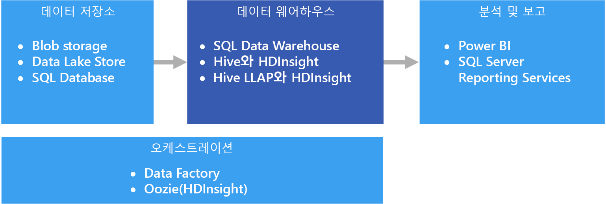

# 데이터 웨어하우징 및 데이터 마트Data warehousing and data marts

데이터 웨어하우스는 많은 또는 모든 주제 영역에 걸쳐, 하나 이상의 개별 원본에서 가져온 통합된 데이터의 조직적인 중앙 관계형 리포지토리입니다.A data warehouse is a central, organizational, relational repository of integrated data from one or more disparate sources, across many or all subject areas. 데이터 웨어하우스는 현재 및 기록 데이터를 저장하고, 다양한 방식으로 데이터의 보고 및 분석에 사용됩니다.Data warehouses store current and historical data and are used for reporting and analysis of the data in different ways.

데이터 웨어하우스로 데이터를 이동하기 위해 중요한 비즈니스 정보를 포함하는 다양한 원본에서 데이터가 주기적으로 추출됩니다.To move data into a data warehouse, it is extracted on a periodic basis from various sources that contain important business information. 데이터는 이동될 때, 서식이 지정되고, 정리되고, 유효성이 검사되고, 요약되고, 다시 구성됩니다.As the data is moved, it can be formatted, cleaned, validated, summarized, and reorganized. 또는 데이터를 가장 낮은 세부 수준으로 저장하고, 보고를 위해 웨어하우스에 집계된 보기를 제공할 수 있습니다.Alternately, the data can be stored in the lowest level of detail, with aggregated views provided in the warehouse for reporting. 두 경우 모두에서 데이터 웨어하우스는 BI(비즈니스 인텔리전스) 도구를 사용하여 보고, 분석 및 중요한 비즈니스 의사 결정을 수행하는 데 사용되는 데이터의 영구 저장 공간이 됩니다.In either case, the data warehouse becomes a permanent storage space for data used for reporting, analysis, and forming important business decisions using business intelligence (BI) tools.

## 데이터 마트 및 운영 데이터 저장소Data marts and operational data stores

최대 규모의 데이터를 관리하는 것은 복잡하며, 전체 엔터프라이즈의 모든 데이터를 나타내는 단일 데이터 웨어하우스를 유지하는 것은 별로 일반적이지 않습니다.Managing data at scale is complex, and it is becoming less common to have a single data warehouse that represents all data across the entire enterprise. 대신, 조직에서는 분석을 위해 원하는 데이터를 노출하는 *데이터 마트*라는 좀 더 작고 좀 더 특정 영역을 중심으로 하는 데이터 웨어하우스를 만듭니다.Instead, organizations create smaller, more focused data warehouses, called *data marts*, that expose the desired data for analytics purposes. 오케스트레이션 프로세스는 운영 데이터 저장소에 유지 관리되는 데이터로 데이터 마트를 채웁니다.An orchestration process populates the data marts from data maintained in an operational data store. 운영 데이터 저장소는 원본 트랜잭션 시스템 및 데이터 마트 간의 중간 매개 역할을 합니다.The operational data store acts as an intermediary between the source transactional system and the data mart. 운영 데이터 저장소에서 관리되는 데이터는 원본 트랜잭션 시스템에 있는 데이터의 정리된 버전으로, 일반적으로 데이터 웨어하우스 또는 데이터 마트에서 유지 관리되는 기록 데이터의 하위 집합입니다.Data managed by the operational data store is a cleaned version of the data present in the source transactional system, and is typically a subset of the historical data that is maintained by the data warehouse or data mart. 

## 이 솔루션을 사용해야 하는 경우When to use this solution

운영 체제의 대량의 데이터를 이해하기 쉽고 정확한 최신 형식으로 변환해야 할 경우 데이터 웨어하우스를 선택합니다.Choose a data warehouse when you need to turn massive amounts of data from operational systems into a format that is easy to understand, current, and accurate. 데이터 웨어하우스는 운영/OLTP 데이터베이스에서 사용될 수 있는 동일한 간결한 데이터 구조를 따를 필요가 없습니다.Data warehouses do not need to follow the same terse data structure you may be using in your operational/OLTP databases. 비즈니스 사용자 및 분석가에게 적절해 보이는 열 이름을 사용하고, 스키므를 다시 구성하여 데이터 관계를 간소화하고, 여러 테이블을 하나로 통합할 수 있습니다.You can use column names that make sense to business users and analysts, restructure the schema to simplify data relationships, and consolidate several tables into one. 이러한 단계는 DBA(데이터베이스 관리자) 또는 데이터 개발자의 도움 없이 임시 보고서를 만들거나, 보고서를 만들고 BI 시스템에서 데이터를 분석해야 하는 사용자를 안내하는 데 도움이 됩니다.These steps help guide users who need to create ad hoc reports, or create reports and analyze the data in BI systems, without the help of a database administrator (DBA) or data developer.

성능상의 이유로 기록 데이터를 원본 트랜잭션 시스템과는 따로 보관하려는 경우, 데이터 웨어하우스를 사용하는 것이 좋습니다.Consider using a data warehouse when you need to keep historical data separate from the source transaction systems for performance reasons. 데이터 웨어하우스는 중앙 위치를 제공하여 일반 형식, 공통 키, 공용 데이터 모델 및 일반적인 액세스 방법으로 여러 위치의 기록 데이터에 쉽게 액세스할 수 있도록 합니다.Data warehouses make it easy to access historical data from multiple locations, by providing a centralized location using common formats, common keys, common data models, and common access methods.

데이터 웨어하우스는 읽기 액세스에 최적화되어 있으므로, 원본 트랜잭션 시스템에 대해 보고서를 실행하는 방식에 비해 보고서를 더 빠르게 생성할 수 있도록 합니다.Data warehouses are optimized for read access, resulting in faster report generation compared to running reports against the source transaction system. 또한 데이터 웨어하우스는 다음과 같은 이점을 제공합니다.In addition, data warehouses provide the following benefits:

* 여러 원본의 모든 기록 데이터가 저장되며, 신뢰할 수 있는 단일 원본으로서 데이터 웨어하우스에서 액세스될 수 있습니다.All historical data from multiple sources can be stored and accessed from a data warehouse as the single source of truth.
* 데이터 웨어하우스로 데이터를 가져올 때 정리하고, 일관된 코드 및 설명을 제공할 뿐만 아니라 보다 정확한 데이터를 제공하여 데이터 품질을 개선할 수 있습니다.You can improve data quality by cleaning up data as it is imported into the data warehouse, providing more accurate data as well as providing consistent codes and descriptions.
* 보고 도구는 쿼리 처리 주기 동안 트랜잭션 원본 시스템과 경쟁하지 않습니다.Reporting tools do not compete with the transactional source systems for query processing cycles. 데이터 웨어하우스는 대부분의 읽기 요청을 충족하면서, 트랜잭션 시스템이 쓰기 작업을 처리하는 데 주로 초점을 맞출 수 있도록 합니다.A data warehouse allows the transactional system to focus predominantly on handling writes, while the data warehouse satisfies the majority of read requests.
* 데이터 웨어하우스는 서로 다른 소프트웨어의 데이터를 통합하는 데 도움이 될 수 있습니다.A data warehouse can help consolidate data from different software.
* 데이터 마이닝 도구는 웨어하우스에 저장된 데이터에 대해 자동 방법을 사용하여 숨겨진 패턴을 찾는 데 도움이 될 수 있습니다.Data mining tools can help you find hidden patterns using automatic methodologies against data stored in your warehouse.
* 데이터 웨어하우스를 사용하면 허가되지 않은 사용자의 액세스는 제한하면서 허가된 사용자에게 쉽게 보안 액세스를 제공할 수 있습니다.Data warehouses make it easier to provide secure access to authorized users, while restricting access to others. 비즈니스 사용자에게 원본 데이터에 대한 액세스 권한을 부여할 필요가 없으므로, 하나 이상의 프로덕션 트랜잭션 시스템에 대한 잠재적인 공격 벡터가 제거됩니다.There is no need to grant business users access to the source data, thereby removing a potential attack vector against one or more production transaction systems.
* 데이터 웨어하우스를 데이터 위에 [OLAP 큐브](online-analytical-processing.md)와 같은 비즈니스 인텔리전스 솔루션을 보다 쉽게 만들 수 있습니다.Data warehouses make it easier to create business intelligence solutions on top of the data, such as [OLAP cubes](online-analytical-processing.md).

## 과제Challenges

비즈니스의 요구에 맞게 데이터 웨어하우스를 적절히 구성하려는 경우 다음과 같은 해결 과제에 직면할 수 있습니다.Properly configuring a data warehouse to fit the needs of your business can bring some of the following challenges:

* 비즈니스 개념을 적절히 모델링하는 데 필요한 시간 확정.Committing the time required to properly model your business concepts. 데이터 웨어하우스는 정보를 중심으로 하므로, 개념 매핑이 나머지 프로젝트를 구동하게 됩니다. 따라서 이 단계는 중요합니다.This is an important step, as data warehouses are information driven, where concept mapping drives the rest of the project. 이 단계에서는 비즈니스 관련 용어 및 일반 형식(예: 통화 및 날짜)이 표준화되고, 비즈니스 사용자에게 보다 적절한 방식으로 데이터가 다시 구성되지만, 데이터 집계 및 관계의 정확도도 계속 보장됩니다.This involves standardizing business-related terms and common formats (such as currency and dates), and restructuring the schema in a way that makes sense to business users but still ensures accuracy of data aggregates and relationships.
* 데이터 오케스트레이션 계획 및 설정.Planning and setting up your data orchestration. 고려 사항으로는 원본 트랜잭션 시스템의 데이터를 데이터 웨어하우스로 복사하는 방법과, 운영 데이터 저장소의 기록 데이터를 웨어하우스로 이동하는 시기가 포함됩니다.Consideration include how to copy data from the source transactional system to the data warehouse, and when to move historical data out of your operational data stores and into the warehouse.
* 데이터를 웨어하우스로 가져올 때 데이터를 정리하여 품질 유지 또는 개선.Maintaining or improving data quality by cleaning the data as it is imported into the warehouse.

## Azure의 데이터 웨어하우징Data warehousing in Azure

Azure에서는 고객의 트랜잭션이든, 다양한 부서에서 사용되는 다양한 비즈니스 응용 프로그램이든, 하나 이상의 데이터 원본이 있을 수 있습니다.In Azure, you may have one or more sources of data, whether from customer transactions, or from various business applications used by various departments. 이 데이터는 일반적으로 하나 이상의 [OLTP](online-transaction-processing.md) 데이터베이스에 저장됩니다.This data is traditionally stored in one or more [OLTP](online-transaction-processing.md) databases. 데이터는 네트워크 공유, Azure Storage Blob 또는 Data Lake 같은 기타 저장소 미디어에 유지될 수 있습니다.The data could be persisted in other storage mediums such as network shares, Azure Storage Blobs, or a data lake. 데이터가 데이터 웨어하우스 자체 또는 Azure SQL Database 같은 관계형 데이터베이스에 저장할 수도 있습니다.The data could also be stored by the data warehouse itself or in a relational database such as Azure SQL Database. 분석 데이터 저장소 계층의 목적은 데이터 웨어하우스 또는 데이터 마트에 대해 분석 및 보고 도구에서 실행한 쿼리를 충족하는 것입니다.The purpose of the analytical data store layer is to satisfy queries issued by analytics and reporting tools against the data warehouse or data mart. Azure에서 이 분석 저장소 기능은 Azure SQL Data Warehouse를 사용하거나 Hive 또는 대화형 쿼리를 통해 Azure HDInsight를 사용하여 충족될 수 있습니다.In Azure, this analytical store capability can be met with Azure SQL Data Warehouse, or with Azure HDInsight using Hive or Interactive Query. 또한 데이터 저장소의 데이터를 데이터 웨어하우스에 주기적으로 이동하거나 복사하기 위해 일정 수준의 오케스트레이션이 필요합니다. 이 작업은 Azure Data Factory 또는 Azure HDInsight의 Oozie를 사용하여 수행할 수 있습니다.In addition, you will need some level of orchestration to periodically move or copy data from data storage to the data warehouse, which can be done using Azure Data Factory or Oozie on Azure HDInsight.

Azure에서는 사용자의 요구에 따라 다음과 같은 몇 가지 데이터 웨어하우스 구현 옵션을 사용할 수 있습니다.There are several options for implementing a data warehouse in Azure, depending on your needs. 다음 목록은 SMP([Symmetric Multiprocessing](https://en.wikipedia.org/wiki/Symmetric_multiprocessing)) 및 MPP([Massively Parallel Processing](https://en.wikipedia.org/wiki/Massively_parallel))의 두 범주로 구분됩니다.The following lists are broken into two categories, [symmetric multiprocessing](https://en.wikipedia.org/wiki/Symmetric_multiprocessing) (SMP) and [massively parallel processing](https://en.wikipedia.org/wiki/Massively_parallel) (MPP). 

SMP:SMP:

- [Azure SQL DatabaseAzure SQL Database](/azure/sql-database/)
- [가상 컴퓨터의 SQL ServerSQL Server in a virtual machine](/sql/sql-server/sql-server-technical-documentation)

MPP:MPP:

- [Azure Data WarehouseAzure Data Warehouse](/azure/sql-data-warehouse/sql-data-warehouse-overview-what-is)
- [HDInsight의 Apache HiveApache Hive on HDInsight](/azure/hdinsight/hadoop/hdinsight-use-hive)
- [HDInsight의 대화형 쿼리(Hive LLAP)Interactive Query (Hive LLAP) on HDInsight](/azure/hdinsight/interactive-query/apache-interactive-query-get-started)

일반적으로 MPP는 종종 빅 데이터에 사용되지만, SMP 기반 웨어하우스는 소형에서 중형 데이터 집합(최대 4-100TB)에 가장 적합합니다.As a general rule, SMP-based warehouses are best suited for small to medium data sets (up to 4-100 TB), while MPP is often used for big data. 소형/중형과 빅 데이터 간의 경계는 조직의 정의 및 지원 인프라와 어느 정도 관련이 있습니다.The delineation between small/medium and big data partly has to do with your organization's definition and supporting infrastructure. ([OLTP 데이터 저장소 선택](online-transaction-processing.md#scalability-capabilities)을 참조하세요.)(See [Choosing an OLTP data store](online-transaction-processing.md#scalability-capabilities).) 

데이터 크기보다는, 워크로드 패턴 유형이 더 큰 고려 요인일 수 있습니다.Beyond data sizes, the type of workload pattern is likely to be a greater determining factor. 예를 들어, 복잡한 쿼리는 SMP 솔루션에 비해 너무 느리므로 대신 MPP 솔루션이 필요할 수 있습니다.For example, complex queries may be too slow for an SMP solution, and require an MPP solution instead. MPP 기반 시스템은 노드에서 작업이 배포되고 통합되는 방식 때문에, 데이터 크기가 작은 경우 성능이 저하될 수 있습니다.MPP-based systems are likely to impose a performance penalty with small data sizes, due to the way jobs are distributed and consolidated across nodes. 데이터 크기가 이미 1TB를 초과하며, 지속적으로 증가할 수 있는 경우 MPP 솔루션을 선택하는 것이 좋습니다.If your data sizes already exceed 1 TB and are expected to continually grow, consider selecting an MPP solution. 그러나 데이터 크기가 이 범위보다 작지만 워크로드가 SMP 솔루션의 가용 리소스를 초과할 경우에는 MPP가 가장 적합할 수 있습니다.However, if your data sizes are less than this, but your workloads are exceeding the available resources of your SMP solution, then MPP may be your best option as well.

데이터 웨어하우스에서 액세스하거나 저장하는 데이터는 [Azure Data Lake Store](/azure/data-lake-store/)와 같은 데이터 레이크를 포함하는 다양한 데이터 원본에서 가져올 수 있습니다.The data accessed or stored by your data warehouse could come from a number of data sources, including a data lake, such as [Azure Data Lake Store](/azure/data-lake-store/). Azure Data Lake를 사용할 수 있는 MPP 서비스의 서로 다른 장점을 비교하는 비디오 세션을 보려면 [Azure Data Lake and Azure Data Warehouse: Applying Modern Practices to Your App](https://azure.microsoft.com/resources/videos/build-2016-azure-data-lake-and-azure-data-warehouse-applying-modern-practices-to-your-app/)(Azure Data Lake 및 Azure Data Warehouse: 앱에 최신 사례 적용)을 참조하세요.For a video session that compares the different strengths of MPP services that can use Azure Data Lake, see [Azure Data Lake and Azure Data Warehouse: Applying Modern Practices to Your App](https://azure.microsoft.com/resources/videos/build-2016-azure-data-lake-and-azure-data-warehouse-applying-modern-practices-to-your-app/).

SMP 시스템은 모든 리소스(CPU/메모리/디스크)를 공유하는 관계형 데이터베이스 관리 시스템의 단일 인스턴스로 나타낼 수 있습니다.SMP systems are characterized by a single instance of a relational database management system sharing all resources (CPU/Memory/Disk). SMP 시스템은 확장할 수 있습니다.You can scale up an SMP system. VM에서 실행 중인 SQL Server의 경우 VM 크기를 확장할 수 있습니다.For SQL Server running on a VM, you can scale up the VM size. Azure SQL Database의 경우 다른 서비스 계층을 선택하여 확장할 수 있습니다.For Azure SQL Database, you can scale up by selecting a different service tier. 

MPP 시스템은 계산 노드(자체 CUP, 메모리 및 I/O 하위 시스템 포함)를 더 추가하여 스케일 아웃할 수 있습니다.MPP systems can be scaled out by adding more compute nodes (which have their own CPU, memory and I/O subsystems). 서버를 강화하는 데는 물리적 제한이 있습니다. 이 경우 워크로드에 따라 스케일 아웃하는 것이 좀 더 바람직합니다.There are physical limitations to scaling up a server, at which point scaling out is more desirable, depending on the workload. 그러나 MPP 솔루션에는 데이터의 쿼리, 모델링, 분할 방식의 차이와 병렬 처리와 관련된 기타 요인 때문에 다른 기술 집합이 필요합니다.However, MPP solutions require a different skillset, due to variances in querying, modeling, partitioning of data, and other factors unique to parallel processing. 

사용할 SMP 솔루션을 결정할 때는 [Azure SQL 데이터베이스 및 Azure VM의 SQL Server에서 자세히 보기](/azure/sql-database/sql-database-paas-vs-sql-server-iaas#a-closer-look-at-azure-sql-database-and-sql-server-on-azure-vms)를 참조하세요.When deciding which SMP solution to use, see [A closer look at Azure SQL Database and SQL Server on Azure VMs](/azure/sql-database/sql-database-paas-vs-sql-server-iaas#a-closer-look-at-azure-sql-database-and-sql-server-on-azure-vms). 

워크로드가 계산 및 메모리 집약적인 소형 및 중형 데이터 집합에도 Azure SQL Data Warehouse를 사용할 수 있습니다.Azure SQL Data Warehouse can also be used for small and medium datasets, where the workload is compute and memory intensive. SQL Data Warehouse 패턴 및 일반적인 시나리오에 대해 읽어보세요.Read more about SQL Data Warehouse patterns and common scenarios:

- [SQL Data Warehouse 패턴 및 안티패턴SQL Data Warehouse Patterns and Anti-Patterns](https://blogs.msdn.microsoft.com/sqlcat/2017/09/05/azure-sql-data-warehouse-workload-patterns-and-anti-patterns/)
- [SQL Data Warehouse 로딩 패턴 및 전략SQL Data Warehouse Loading Patterns and Strategies](https://blogs.msdn.microsoft.com/sqlcat/2017/05/17/azure-sql-data-warehouse-loading-patterns-and-strategies/)
- [Azure SQL Data Warehouse로 데이터 마이그레이션](https://blogs.msdn.microsoft.com/sqlcat/2016/08/18/migrating-data-to-azure-sql-data-warehouse-in-practice/)(영문)[Migrating Data to Azure SQL Data Warehouse](https://blogs.msdn.microsoft.com/sqlcat/2016/08/18/migrating-data-to-azure-sql-data-warehouse-in-practice/)
- [Azure SQL Data Warehouse를 사용하는 일반적인 ISV 응용 프로그램 패턴Common ISV Application Patterns Using Azure SQL Data Warehouse](https://blogs.msdn.microsoft.com/sqlcat/2017/09/05/common-isv-application-patterns-using-azure-sql-data-warehouse/)

## 주요 선택 조건Key selection criteria

선택 옵션의 범위를 좁히려면 먼저 다음 질문에 답변합니다.To narrow the choices, start by answering these questions:

- 사용자 고유의 서버를 관리하지 않고 관리되는 서비스를 원하시나요?Do you want a managed service rather than managing your own servers?

- 매우 큰 데이터 집합 또는 매우 복잡하고 오래 실행되는 쿼리로 작업하고 있나요?Are you working with extremely large data sets or highly complex, long-running queries? 그렇다면 MPP 옵션을 고려합니다.If yes, consider an MPP option. 

- 큰 데이터 집합의 경우 데이터 원본이 구조적인가요 아니면 반구조적인가요?For a large data set, is the data source structured or unstructured? 구조화되지 않은 데이터는 HDInsight의 Spark, Azure Databricks, HDInsight의 Hive LLAP 또는 Azure Data Lake Analytics와 같은 빅 데이터 환경에서 처리해야 할 수 있습니다.Unstructured data may need to be processed in a big data environment such as Spark on HDInsight, Azure Databricks, Hive LLAP on HDInsight, or Azure Data Lake Analytics. 이러한 모든 환경은 ELT(추출, 로드, 변환) 및 ETL(추출, 변환, 로드) 엔진으로 사용할 수 있습니다.All of these can serve as ELT (Extract, Load, Transform) and ETL (Extract, Transform, Load) engines. 처리된 데이터를 구조화된 데이터로 출력하여 SQL Data Warehouse 또는 다른 옵션 중 하나로 보다 쉽게 로드할 수 있습니다.They can output the processed data into structured data, making it easier to load into SQL Data Warehouse or one of the other options. 구조화된 데이터의 경우, SQL Data Warehouse는 아주 높은 성능을 요구하는 계산 집약적 워크로드를 위해 “계산에 최적화”라고 지칭하는 성능 계층을 갖습니다.For structured data, SQL Data Warehouse has a performance tier called Optimized for Compute, for compute-intensive workloads requiring ultra-high performance.

- 현재, 운영 데이터에서 기록 데이터를 분리하려고 하나요?Do you want to separate your historical data from your current, operational data? 그렇다면 [오케스트레이션](../technology-choices/pipeline-orchestration-data-movement.md)이 필요한 옵션 중 하나를 선택합니다.If so, select one of the options where [orchestration](../technology-choices/pipeline-orchestration-data-movement.md) is required. 이것은 과도한 읽기 액세스에 최적화된 독립 실행형 웨어하우스로, 별도의 기록 데이터 저장소로 가장 적합합니다.These are standalone warehouses optimized for heavy read access, and are best suited as a separate historical data store.

- OLTP 데이터 저장소 이외의 여러 원본에 있는 데이터를 통합해야 하나요?Do you need to integrate data from several sources, beyond your OLTP data store? 그렇다면 여러 데이터 원본을 쉽게 통합하는 옵션을 고려합니다.If so, consider options that easily integrate multiple data sources. 

- 다중 테넌트 요구 사항이 있나요?Do you have a multi-tenancy requirement? 그렇다면 이 요구 사항에는 SQL Data Warehouse가 바람직하지 않습니다.If so, SQL Data Warehouse is not ideal for this requirement. 자세한 내용은 [SQL Data Warehouse 패턴 및 안티패턴](https://blogs.msdn.microsoft.com/sqlcat/2017/09/05/azure-sql-data-warehouse-workload-patterns-and-anti-patterns/)을 참조하세요.For more information, see [SQL Data Warehouse Patterns and Anti-Patterns](https://blogs.msdn.microsoft.com/sqlcat/2017/09/05/azure-sql-data-warehouse-workload-patterns-and-anti-patterns/).

- 관계형 데이터 저장소를 선호하나요?Do you prefer a relational data store? 그렇다면, 관계형 데이터 저장소가 있는 옵션으로 범위를 좁히되, 필요한 경우 PolyBase와 같은 도구를 사용하여 비관계형 데이터 저장소를 쿼리할 수 있다는 점에 유의하세요.If so, narrow your options to those with a relational data store, but also note that you can use a tool like PolyBase to query non-relational data stores if needed. 그러나 PolyBase를 사용하기로 결정한 경우 워크로드의 구조화되지 않은 데이터 집합에 대해 성능 테스트를 실행합니다.If you decide to use PolyBase, however, run performance tests against your unstructured data sets for your workload.

- 실시간 보고 요구 사항이 있나요?Do you have real-time reporting requirements? 고용량의 단일 삽입에 대해 신속한 쿼리 응답 시간이 필요한 경우 실시간 보고를 지원할 수 있는 옵션으로 범위를 좁힙니다.If you require rapid query response times on high volumes of singleton inserts, narrow your options to those that can support real-time reporting.

- 많은 수의 동시 사용자 및 연결을 지원해야 하나요?Do you need to support a large number of concurrent users and connections? 동시 사용자/연결 수를 지원하는 기능은 여러 가지 요인에 따라 달라집니다.The ability to support a number of concurrent users/connections depends on several factors. 

    - Azure SQL Database에 대해서는 서비스 계층에 따라 [문서화된 리소스 제한](/azure/sql-database/sql-database-resource-limits)을 참조하세요.For Azure SQL Database, refer to the [documented resource limits](/azure/sql-database/sql-database-resource-limits) based on your service tier. 
    
    - SQL Server에서는 최대 32,767개의 사용자 연결을 허용합니다.SQL Server allows a maximum of 32,767 user connections. VM에서 실행할 경우 성능은 VM 크기 및 기타 요인에 따라 달라집니다.When running on a VM, performance will depend on the VM size and other factors. 
    
    - SQL Data Warehouse는 동시 쿼리 및 동시 연결에 대한 제한이 있습니다.SQL Data Warehouse has limits on concurrent queries and concurrent connections. 자세한 내용은 [SQL Data Warehouse의 동시성 및 워크로드 관리](/azure/sql-data-warehouse/sql-data-warehouse-develop-concurrency)를 참조하세요.For more information, see [Concurrency and workload management in SQL Data Warehouse](/azure/sql-data-warehouse/sql-data-warehouse-develop-concurrency). [Azure Analysis Services](/azure/analysis-services/analysis-services-overview)와 같은 보완 서비스를 사용하여 SQL Data Warehouse의 제한을 극복하는 것이 바람직합니다.Consider using complementary services, such as [Azure Analysis Services](/azure/analysis-services/analysis-services-overview), to overcome limits in SQL Data Warehouse.

- 어떤 종류의 워크로드가 발생하나요?What sort of workload do you have? 일반적으로 MPP 기반 웨어하우스 솔루션은 분석, 일괄 처리 워크로드에 가장 적합합니다.In general, MPP-based warehouse solutions are best suited for analytical, batch-oriented workloads. 워크로드가 기본적으로 많은 작은 읽기/쓰기 작업 또는 여러 행 단위 작업을 포함하는 트랜잭션 작업인 경우 SMP 옵션 중 하나를 사용하는 것이 좋습니다.If your workloads are transactional by nature, with many small read/write operations or multiple row-by-row operations, consider using one of the SMP options. 이 지침의 한 가지 예외는 HDInsight 클러스터에서 Spark Streaming 같은 스트림 처리를 사용하고 데이터를 Hive 테이블 내에 저장하는 경우입니다.One exception to this guideline is when using stream processing on an HDInsight cluster, such as Spark Streaming, and storing the data within a Hive table.

## 기능 매트릭스Capability Matrix

다음 표에서는 주요 기능 차이점을 요약해서 보여 줍니다.The following tables summarize the key differences in capabilities.

### 일반 기능General capabilities

| | Azure SQL DatabaseAzure SQL Database | SQL Server(VM)SQL Server (VM) | SQL Data WarehouseSQL Data Warehouse | HDInsight의 Apache HiveApache Hive on HDInsight | HDInsight의 Hive LLAPHive LLAP on HDInsight |
| --- | --- | --- | --- | --- | --- | -- |
| 관리되는 서비스인지 여부Is managed service | 예Yes | 아니오No | 예Yes | 예 1Yes 1 | 예 1Yes 1 |
| 데이터 오케스트레이션 필요(데이터 사본/기록 데이터 보유)Requires data orchestration (holds copy of data/historical data) | 아니오No | 아니요No | 예Yes | 예Yes | 예Yes |
| 여러 데이터 원본을 쉽게 통합Easily integrate multiple data sources | 아니오No | 아니요No | 예Yes | 예Yes | 예Yes |
| 계산 일시 중지 지원 여부Supports pausing compute | 아니오No | 아니요No | 예Yes | 아니요 2No 2 | 아니요 2No 2 |
| 관계형 데이터 저장소Relational data store | 예Yes | 예Yes |  예Yes | 아니오No | 아니오No |
| 실시간 보고Real-time reporting | 예Yes | 예Yes | 아니오No | 아니요No | 예Yes |
| 유연한 백업/복원 지점Flexible backup restore points | 예Yes | 예Yes | 아니요 3No 3 | 예 4Yes 4 | 예 4Yes 4 |
| SMP/MPPSMP/MPP | SMPSMP | SMPSMP | MPPMPP | MPPMPP | MPPMPP |

[1] 수동 구성 및 크기 조정[1] Manual configuration and scaling.

[2] 필요할 때 HDInsight 클러스터를 삭제한 다음, 다시 만들 수 있습니다.[2] HDInsight clusters can be deleted when not needed, and then re-created. 클러스터를 삭제할 떼 데이터가 유지되도록 외부 데이터 저장소를 클러스터에 연결합니다.Attach an external data store to your cluster so your data is retained when you delete your cluster. Azure Data Factory로 워크로드를 처리하는 요청 시 HDInsight 클러스터를 만들어 클러스터의 수명 주기를 자동화한 다음, 처리가 완료된 후 삭제할 수 있습니다.You can use Azure Data Factory to automate your cluster's lifecycle by creating an on-demand HDInsight cluster to process your workload, then delete it once the processing is complete.

[3] SQL Data Warehouse를 사용할 경우 지난 7일 이내의 사용 가능한 복원 지점으로 데이터베이스를 복원할 수 있습니다.[3] With SQL Data Warehouse, you can restore a database to any available restore point within the last seven days. 스냅숏은 4~8시간마다 시작되며 7일 동안 사용할 수 있습니다.Snapshots start every four to eight hours and are available for seven days. 7일보다 오래된 스냅숏은 만료되고 해당 복원 지점을 더 이상 사용할 수 없게 됩니다.When a snapshot is older than seven days, it expires and its restore point is no longer available.

[4] 필요할 때 백업 및 복원할 수 있는 [외부 Hive metastore](/azure/hdinsight/hdinsight-hadoop-provision-linux-clusters#use-hiveoozie-metastore)를 사용하는 것이 좋습니다.[4] Consider using an [external Hive metastore](/azure/hdinsight/hdinsight-hadoop-provision-linux-clusters#use-hiveoozie-metastore) that can be backed up and restored as needed. Blob Storage 또는 Data Lake Store에 적용되는 표준 백업 및 복원 옵션을 데이터에 사용할 수 있으며, 더 큰 유연성이나 사용 편의성을 원할 경우 [Imanis Data](https://azure.microsoft.com/blog/imanis-data-cloud-migration-backup-for-your-big-data-applications-on-azure-hdinsight/)와 같은 타사 HDInsight 백업 및 복원 솔루션을 사용할 수 있습니다.Standard backup and restore options that apply to Blob Storage or Data Lake Store can be used for the data, or third party HDInsight backup and restore solutions, such as [Imanis Data](https://azure.microsoft.com/blog/imanis-data-cloud-migration-backup-for-your-big-data-applications-on-azure-hdinsight/) can be used for greater flexibility and ease of use.

### 확장성 기능Scalability capabilities

| | Azure SQL DatabaseAzure SQL Database | SQL Server(VM)SQL Server (VM) |  SQL Data WarehouseSQL Data Warehouse | HDInsight의 Apache HiveApache Hive on HDInsight | HDInsight의 Hive LLAPHive LLAP on HDInsight |
| --- | --- | --- | --- | --- | --- | -- |
| 고가용성을 위한 중복 지역 서버Redundant regional servers for high availability  | 예Yes | 예Yes | 예Yes | 아니오No | 아니오No |
| 쿼리 스케일 아웃 지원 여부(분산 쿼리)Supports query scale out (distributed queries)  | 아니오No | 아니요No | 예Yes | 예Yes | 예Yes |
| 동적 확장성Dynamic scalability | 예Yes | 아니오No | 예 1Yes 1 | 아니오No | 아니오No |
| 데이터의 메모리 내 캐싱 지원 여부Supports in-memory caching of data | 예Yes |  예Yes | 아니오No | 예Yes | 예Yes |

[1] SQL Data Warehouse에서는 DWU(데이터 웨어하우스 단위) 수를 조정하여 강화 및 축소할 수 있습니다.[1] SQL Data Warehouse allows you to scale up or down by adjusting the number of data warehouse units (DWUs). [Azure SQL Data Warehouse의 계산 능력 관리](/azure/sql-data-warehouse/sql-data-warehouse-manage-compute-overview)를 참조하세요.See [Manage compute power in Azure SQL Data Warehouse](/azure/sql-data-warehouse/sql-data-warehouse-manage-compute-overview).

### 보안 기능Security capabilities

|                         |           Azure SQL DatabaseAzure SQL Database            |  가상 컴퓨터의 SQL ServerSQL Server in a virtual machine  | SQL Data WarehouseSQL Data Warehouse |   HDInsight의 Apache HiveApache Hive on HDInsight    |    HDInsight의 Hive LLAPHive LLAP on HDInsight     |
|-------------------------|-----------------------------------------|-----------------------------------|--------------------|-------------------------------|-------------------------------|
|     인증Authentication      | SQL/Azure AD(Azure Active Directory)SQL / Azure Active Directory (Azure AD) | SQL / Azure AD / Active DirectorySQL / Azure AD / Active Directory |   SQL / Azure ADSQL / Azure AD   | 로컬/Azure AD 1local / Azure AD 1 | 로컬/Azure AD 1local / Azure AD 1 |
|      권한 부여Authorization      |                   예Yes                   |                예Yes                |        예Yes         |              예Yes              |       예 1Yes 1        |
|        감사Auditing         |                   예Yes                   |                예Yes                |        예Yes         |              예Yes              |       예 1Yes 1        |
| 휴지 상태의 암호화Data encryption at rest |            예 2Yes 2             |         예 2Yes 2          |  예 2Yes 2  |       예 2Yes 2        |       예 1Yes 1        |
|   행 수준 보안Row-level security    |                   예Yes                   |                예Yes                |        예Yes         |              아니오No               |       예 1Yes 1        |
|   방화벽 지원 여부Supports firewalls    |                   예Yes                   |                예Yes                |        예Yes         |              예Yes              |       예 3Yes 3        |
|  동적 데이터 마스킹Dynamic data masking   |                   예Yes                   |                예Yes                |        예Yes         |              아니오No               |       예 1Yes 1        |

[1] [도메인 가입 HDInsight 클러스터](/azure/hdinsight/domain-joined/apache-domain-joined-introduction)를 사용해야 합니다.[1] Requires using a [domain-joined HDInsight cluster](/azure/hdinsight/domain-joined/apache-domain-joined-introduction).

[2] 미사용 데이터의 암호화 및 암호 해독을 위해 TDE(투명한 데이터 암호화)를 사용해야 합니다.[2] Requires using Transparent Data Encryption (TDE) to encrypt and decrypt your data at rest.

[3] [Azure Virtual Network 내에서 사용](/azure/hdinsight/hdinsight-extend-hadoop-virtual-network)할 때 지원됩니다.[3] Supported when [used within an Azure Virtual Network](/azure/hdinsight/hdinsight-extend-hadoop-virtual-network).

데이터 웨어하우스 보안에 대해 읽어보세요.Read more about securing your data warehouse:

* [SQL Database 보안 설정Securing your SQL Database](/azure/sql-database/sql-database-security-overview#connection-security)
* [SQL Data Warehouse에서 데이터베이스 보호Secure a database in SQL Data Warehouse](/azure/sql-data-warehouse/sql-data-warehouse-overview-manage-security)
* [Azure Virtual Network를 사용하여 Azure HDInsight 확장Extend Azure HDInsight using an Azure Virtual Network](/azure/hdinsight/hdinsight-extend-hadoop-virtual-network)
* [도메인 조인 HDInsight 클러스터의 엔터프라이즈 수준 Hadoop 보안Enterprise-level Hadoop security with domain-joined HDInsight clusters](/azure/hdinsight/domain-joined/apache-domain-joined-introduction)

