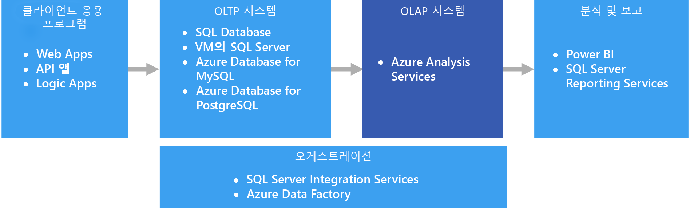
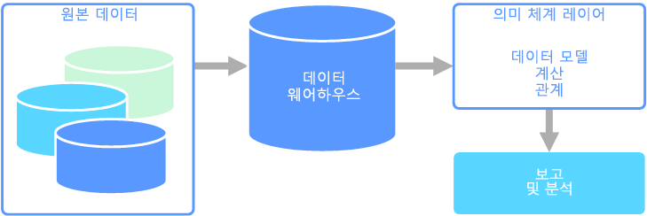

# OLAP(온라인 분석 처리)Online analytical processing (OLAP)

OLAP(온라인 분석 처리)는 대규모 비즈니스 데이터베이스를 구성하고 복잡한 분석을 지원하는 기술입니다.Online analytical processing (OLAP) is a technology that organizes large business databases and supports complex analysis. 트랜잭션 시스템에 부정적인 영향을 주지 않고 복잡한 분석 쿼리를 수행하는 데 사용할 수 있습니다.It can be used to perform complex analytical queries without negatively affecting transactional systems.

기업에서 모든 트랜잭션 및 레코드를 저장하는 데 사용하는 데이터베이스를 [OLTP(온라인 트랜잭션 처리)](online-transaction-processing.md) 데이터베이스라고 합니다.The databases that a business uses to store all its transactions and records are called [online transaction processing (OLTP)](online-transaction-processing.md) databases. 일반적으로 이러한 데이터베이스의 레코드는 한 번에 하나씩 입력됩니다.These databases usually have records that are entered one at a time. 종종 이러한 데이터베이스는 조직에 귀중한 정보를 풍부하게 포함합니다.Often they contain a great deal of information that is valuable to the organization. 그러나 OLTP에 사용되는 데이터베이스는 분석용으로 디자인되지 않았습니다.The databases that are used for OLTP, however, were not designed for analysis. 따라서 이러한 데이터베이스에서 답변을 검색할 때는 시간과 노력이 많이 듭니다.Therefore, retrieving answers from these databases is costly in terms of time and effort. OLAP 시스템은 고효율적 방식으로 데이터에서 이러한 비즈니스 인텔리전스 정보를 추출하는 데 도움이 되도록 디자인되었습니다.OLAP systems were designed to help extract this business intelligence information from the data in a highly performant way. OLAP 데이터베이스가 과도한 읽기, 낮은 쓰기 워크로드에 최적화되어 있기 때문입니다.This is because OLAP databases are optimized for heavy read, low write workloads.

 

## 의미 체계 모델링Semantic modeling

의미 체계 데이터 모델은 포함된 데이터 요소의 의미를 설명하는 개념적 모델입니다.A semantic data model is a conceptual model that describes the meaning of the data elements it contains. 조직에서는 종종 사물에 대해 자체 용어를 사용하며 동의어를 사용하기도 하고, 같은 용어에 대해 다른 의미를 사용할 때도 있습니다.Organizations often have their own terms for things, sometimes with synonyms, or even different meanings for the same term. 예를 들어, 재고 데이터베이스는 자산 ID와 일련 번호를 사용해서 장비를 추적할 수 있지만 판매 데이터베이스는 일련 번호를 자산 ID로 나타낼 수 있습니다.For example, an inventory database might track a piece of equipment with an asset ID and a serial number, but a sales database might refer to the serial number as the asset ID. 관계를 설명하는 모델 없이 이러한 값을 연관짓는 간단한 방식은 없습니다.There is no simple way to relate these values without a model that describes the relationship. 

의미 체계 모델링은 데이터베이스 스키마에 대해 추상화 수준을 제공하므로, 사용자는 기본 데이터 구조를 알 필요가 없습니다.Semantic modeling provides a level of abstraction over the database schema, so that users don't need to know the underlying data structures. 따라서 최종 사용자는 기본 스키마에 대해 집계 및 조인을 수행하지 않고도 데이터를 보다 쉽게 쿼리할 수 있습니다.This makes it easier for end users to query data without performing aggregates and joins over the underlying schema. 또한 일반적으로 열 이름이 좀 더 친숙한 이름으로 바뀌므로 데이터의 컨텍스트 및 의미가 좀 더 명확해집니다.Also, usually columns are renamed to more user-friendly names, so that the context and meaning of the data are more obvious.

의미 체계 모델링은 좀 더 쓰기 집약적인 트랜잭션 데이터 처리(OLTP)와 달리, 분석 및 비즈니스 인텔리전스(OLAP)와 같은 읽기 집약적인 시나리오에 더 많이 사용됩니다.Semantic modeling is predominately used for read-heavy scenarios, such as analytics and business intelligence (OLAP), as opposed to more write-heavy transactional data processing (OLTP). 이러한 사실은 다음과 같은 일반적인 의미 체계 계층의 특정 때문입니다.This is mostly due to the nature of a typical semantic layer:

- 보고 도구에 제대로 표시되도록 집계 동작이 설정됩니다.Aggregation behaviors are set so that reporting tools display them properly.
- 비즈니스 논리 및 계산이 정의됩니다.Business logic and calculations are defined.
- 시간 기반 계산이 포함됩니다.Time-oriented calculations are included.
- 종종 여러 원본의 데이터가 통합됩니다.Data is often integrated from multiple sources. 

일반적으로 의미 체계 계층은 이러한 이유로 데이터 웨어하우스 위에 배치됩니다.Traditionally, the semantic layer is placed over a data warehouse for these reasons.

의미 체계 모델에는 다음과 같은 2가지 기본 유형이 있습니다.There are two primary types of semantic models:

* **테이블 형식**.**Tabular**. 관계형 모델링 구문(모델, 테이블, 열)을 사용합니다.Uses relational modeling constructs (model, tables, columns). 내부적으로 메타데이터는 OLAP 모델링 구문(큐브, 차원, 측정값)에서 상속됩니다.Internally, metadata is inherited from OLAP modeling constructs (cubes, dimensions, measures). 코드 및 스크립트에는 OLAP 메타데이터를 사용합니다.Code and script use OLAP metadata.
* **다차원**.**Multidimensional**. 기존 OLAP 모델링 구문(큐브, 차원, 측정값)을 사용합니다.Uses traditional OLAP modeling constructs (cubes, dimensions, measures).

관련 Azure 서비스:Relevant Azure service:
- [Azure Analysis ServicesAzure Analysis Services](https://azure.microsoft.com/services/analysis-services/)

## 사용 사례Example use case

조직의 데이터가 대형 데이터베이스에 저장되어 있습니다.An organization has data stored in a large database. 비즈니스 사용자 및 고객이 자체 보고서를 만들고 분석을 수행하는 데 이 데이터를 사용할 수 있게 하려고 합니다.It wants to make this data available to business users and customers to create their own reports and do some analysis. 한 가지 방법은 해당 사용자에게 데이터베이스에 대한 직접 액세스 권한을 제공하는 것입니다.One option is just to give those users direct access to the database. 그러나 이러한 방식은 보안 관리 및 액세스 제어를 비롯한 몇 가지 단점이 있습니다.However, there are several drawbacks to doing this, including managing security and controlling access. 또한 테이블 및 열 이름을 포함하는 데이터베이스의 디자인을 사용자가 이해하기 어려울 수 있습니다.Also, the design of the database, including the names of tables and columns, may be hard for a user to understand. 사용자는 쿼리할 테이블, 해당 테이블이 조인되는 방법, 올바른 결과를 얻기 위해 적용해야 하는 기타 비즈니스 논리를 알고 있어야 합니다.Users would need to know which tables to query, how those tables should be joined, and other business logic that must be applied to get the correct results. 또한 시작하기 위해 SQL과 같은 쿼리 언어를 알고 있어야 합니다.Users would also need to know a query language like SQL even to get started. 일반적으로 이러한 경우 여러 사용자가 다른 결과로 동일한 메트릭을 보고하게 됩니다.Typically this leads to multiple users reporting the same metrics but with different results.

또 다른 옵션은 사용자에게 필요한 모든 정보를 의미 체계 모델에 캡슐화하는 것입니다.Another option is to encapsulate all of the information that users need into a semantic model. 의미 체계 모델은 사용자가 선택한 보고 도구를 사용해서 보다 쉽게 쿼리할 수 있습니다.The semantic model can be more easily queried by users with a reporting tool of their choice. 의미 체계 모델이 제공하는 데이터는 데이터 웨어하우스에서 끌어오므로, 모든 사용자가 신뢰할 수 있는 한 가지 버전을 보게 됩니다.The data provided by the semantic model is pulled from a data warehouse, ensuring that all users see a single version of the truth. 또한 의미 체계 모델은 친숙한 테이블 및 열 이름, 테이블 간 관계, 설명, 계산 및 행 수준 보안을 제공합니다.The semantic model also provides friendly table and column names, relationships between tables, descriptions, calculations, and row-level security.

## 의미 체계 모델링의 일반적인 특성Typical traits of semantic modeling

의미 체계 모델링 및 분석 처리는 다음과 같은 특성을 가질 수 있습니다.Semantic modeling and analytical processing tends to have the following traits:

| 요구 사항Requirement | 설명Description |
| --- | --- |
| 스키마Schema | 쓰기 시 스키마, 강력하게 적용Schema on write, strongly enforced|
| 트랜잭션 사용Uses Transactions | 아니오No |
| 잠금 전략Locking Strategy | 없음None |
| 업데이트 가능Updateable | 아니요(일반적으로 큐브를 다시 계산해야 함)No (typically requires recomputing cube) |
| 추가 가능Appendable | 아니요(일반적으로 큐브를 다시 계산해야 함)No (typically requires recomputing cube) |
| 워크로드Workload | 과도한 읽기, 읽기 전용Heavy reads, read-only |
| 인덱싱Indexing | 다차원 인덱싱Multidimensional indexing |
| 데이터 크기Datum size | 소규모~중간 규모Small to medium sized |
| 모델Model | 다차원Multidimensional |
| 데이터 모양:Data shape:| 큐브 또는 별/눈송이 스키마Cube or star/snowflake schema |
| 쿼리 유연성Query flexibility | 매우 유연Highly flexible |
| 크기:Scale: | 큼(10s-100s GB)Large (10s-100s GBs) |

## 이 솔루션을 사용해야 하는 경우When to use this solution

다음과 같은 시나리오에서 OLAP를 고려하세요.Consider OLAP in the following scenarios:

- OLTP 시스템에 부정적인 영향을 주지 않고, 복잡한 분석 및 임시 쿼리를 빠르게 실행해야 합니다.You need to execute complex analytical and ad hoc queries rapidly, without negatively affecting your OLTP systems. 
- 비즈니스 사용자에게 데이터에서 보고서를 생성하는 간단한 방법을 제공하려고 합니다.You want to provide business users with a simple way to generate reports from your data
- 사용자가 신속하고 일관된 결과를 얻을 수 있도록 많은 집계를 제공하려고 합니다.You want to provide a number of aggregations that will allow users to get fast, consistent results. 

OLAP은 방대한 양의 데이터에 대해 집계 계산을 적용하는 데 특히 유용합니다.OLAP is especially useful for applying aggregate calculations over large amounts of data. OLAP 시스템은 분석 및 비즈니스 인텔리전스 등, 과도한 읽기 시나리오에 대해 최적화되어 있습니다.OLAP systems are optimized for read-heavy scenarios, such as analytics and business intelligence. OLAP는 다차원 데이터를 2차원으로 볼 수 있는 조각(예: 피벗 테이블)으로 분할하거나 데이터를 특정 값을 기준으로 필터링할 수 있도록 합니다.OLAP allows users to segment multi-dimensional data into slices that can be viewed in two dimensions (such as a pivot table) or filter the data by specific values. 이 프로세스는 데이터의 "조각화 및 분석"이라고도 하며, 데이터가 여러 데이터 원본 간에 분할되는지 여부에 관계없이 수행될 수 있습니다.This process is sometimes called "slicing and dicing" the data, and can be done regardless of whether the data is partitioned across several data sources. 이 프로세스는 사용자들이 전형적인 데이터 분석의 세부 정보를 알지 못하더라도 추세를 알아내고, 패턴을 찾고, 데이터를 탐색하도록 합니다.This helps users to find trends, spot patterns, and explore the data without having to know the details of traditional data analysis.

의미 체계 모델은 비즈니스 사용자가 관계 복잡성을 추상화하고 데이터를 보다 쉽고 빠르게 분석하도록 지원할 수 있습니다.Semantic models can help business users abstract relationship complexities and make it easier to analyze data quickly.

## 과제Challenges

OLAP 시스템은 다양한 혜택을 제공하지만 다음과 같은 문제도 발생합니다.For all the benefits OLAP systems provide, they do produce a few challenges:

- OLTP 시스템의 데이터는 다양한 원본에서 진행되는 트랜잭션을 통해 지속적으로 업데이트되지만, OLAP 데이터 저장소는 일반적으로 비즈니스 요구에 따라 훨씬 더 느린 간격으로 새로 고쳐집니다.Whereas data in OLTP systems is constantly updated through transactions flowing in from various sources, OLAP data stores are typically refreshed at a much slower intervals, depending on business needs. 즉, OLAP 시스템은 변경에 대한 즉각적인 대응보다는, 전략적 비즈니스 의사 결정에 더 적합합니다.This means OLAP systems are better suited for strategic business decisions, rather than immediate responses to changes. 또한 OLAP 데이터 저장소를 최신 상태로 유지하려면 일정 수준의 데이터 정리 및 오케스트레이션을 계획해야 합니다.Also, some level of data cleansing and orchestration needs to be planned to keep the OLAP data stores up-to-date.
- OLTP 시스템의 전형적인 정규화된 관계형 테이블과 달리, OLAP 데이터 모델은 다차원이기 쉽습니다.Unlike traditional, normalized, relational tables found in OLTP systems, OLAP data models tend to be multidimensional. 따라서 각 특성이 하나의 열에 매핑되는 엔터티-관계 또는 개체 지향 모델에 직접 매핑하기는 어렵거나 불가능합니다.This makes it difficult or impossible to directly map to entity-relationship or object-oriented models, where each attribute is mapped to one column. 대신, OLAP 시스템은 일반적으로 기존의 정규화 대신 별모양 또는 눈송이 스키마를 사용합니다.Instead, OLAP systems typically use a star or snowflake schema in place of traditional normalization.

## Azure의 OLAPOLAP in Azure

Azure에서 Azure SQL Database와 같은 OLTP 시스템에 포함된 데이터는 [Azure Analysis Services](/azure/analysis-services/analysis-services-overview)와 같은 OLAP 시스템에 복사됩니다.In Azure, data held in OLTP systems such as Azure SQL Database is copied into the OLAP system, such as [Azure Analysis Services](/azure/analysis-services/analysis-services-overview). [Power BI](https://powerbi.microsoft.com), Excel 및 타사 옵션과 같은 데이터 탐색 및 시각화 도구는 Analysis Services 서버에 연결되며, 모델링된 데이터에 대해 시각적으로 풍부한 대화형 정보를 제공합니다.Data exploration and visualization tools like [Power BI](https://powerbi.microsoft.com), Excel, and third-party options connect to Analysis Services servers and provide users with highly interactive and visually rich insights into the modeled data. OLTP 간의 데이터 흐름은 일반적으로 [Azure Data Factory](/azure/data-factory/concepts-integration-runtime)를 사용하여 실행될 수 있는 SQL Server Integration Services를 사용하여 오케스트레이션됩니다.The flow of data from OLTP data to OLAP is typically orchestrated using SQL Server Integration Services, which can be executed using [Azure Data Factory](/azure/data-factory/concepts-integration-runtime).

Azure에서 다음의 모든 데이터 저장소는 OLAP의 요구 사항을 충족합니다.In Azure, all of the following data stores will meet the core requirements for OLAP:

- [SQL Server(columnstore 인덱스 포함)SQL Server with Columnstore indexes](/sql/relational-databases/indexes/get-started-with-columnstore-for-real-time-operational-analytics)
- [Azure Analysis ServicesAzure Analysis Services](/azure/analysis-services/analysis-services-overview)
- [SSAS(SQL Server Analysis Services)SQL Server Analysis Services (SSAS)](/sql/analysis-services/analysis-services)

SSAS(SQL Server Analysis Services)는 비즈니스 인텔리전스 응용 프로그램에 대한 OLAP 및 데이터 마이닝 기능을 제공합니다.SQL Server Analysis Services (SSAS) offers OLAP and data mining functionality for business intelligence applications. 로컬 서버에서 SSAS를 설치할 수도 있고, Azure의 가상 머신 내에 호스트할 수도 있습니다.You can either install SSAS on local servers, or host within a virtual machine in Azure. Azure Analysis Services는 SSAS와 같은 주요 기능을 제공하는 완전히 관리되는 서비스입니다.Azure Analysis Services is a fully managed service that provides the same major features as SSAS. Azure Analysis Services는 조직의 클라우드 및 온-프레미스에 있는 [다양한 데이터 원본](/azure/analysis-services/analysis-services-datasource)에 대한 연결을 지원합니다.Azure Analysis Services supports connecting to [various data sources](/azure/analysis-services/analysis-services-datasource) in the cloud and on-premises in your organization.

클러스터형 columnstore 인덱스는 Azure SQL Database 뿐만 아니라 SQL Server 2014 이상에서 사용할 수 있으며, OLAP 작업에 이상적입니다.Clustered Columnstore indexes are available in SQL Server 2014 and above, as well as Azure SQL Database, and are ideal for OLAP workloads. 그러나 SQL Server 2016(Azure SQL Database 포함)부터 업데이트 가능 비클러스터형 columnstore 인덱스를 사용하여 HTAP(하이브리드 트랜잭션/분석 처리)를 활용할 수 있습니다.However, beginning with SQL Server 2016 (including Azure SQL Database), you can take advantage of hybrid transactional/analytics processing (HTAP) through the use of updateable nonclustered columnstore indexes. HTAP를 사용하면 동일한 플랫폼에서 OLTP 및 OLAP 처리를 수행할 수 있으므로, 데이터의 여러 복사본을 저장할 필요가 없으며, 고유한 OLTP 및 OLAP 시스템이 없어도 됩니다.HTAP enables you to perform OLTP and OLAP processing on the same platform, which removes the need to store multiple copies of your data, and eliminates the need for distinct OLTP and OLAP systems. 자세한 내용은 [실시간 운영 분석을 위한 columnstore 시작](/sql/relational-databases/indexes/get-started-with-columnstore-for-real-time-operational-analytics)을 참조하세요.For more information, see [Get started with Columnstore for real-time operational analytics](/sql/relational-databases/indexes/get-started-with-columnstore-for-real-time-operational-analytics).

## 주요 선택 조건Key selection criteria

선택 옵션의 범위를 좁히려면 먼저 다음 질문에 답변합니다.To narrow the choices, start by answering these questions:

- 사용자 고유의 서버를 관리하지 않고 관리되는 서비스를 원하시나요?Do you want a managed service rather than managing your own servers?

- Azure AD(Azure Active Directory)를 사용하는 보안 인증이 필요한가요?Do you require secure authentication using Azure Active Directory (Azure AD)?

- 실시간 분석을 수행하려고 하나요?Do you want to conduct real-time analytics? 그렇다면 실시간 분석을 지원하는 옵션으로 범위를 줄입니다.If so, narrow your options to those that support real-time analytics. 

    이 컨텍스트의 *실시간 분석*은 운영 및 분석 워크로드를 둘 다 실행하는 ERP(전사적 자원 관리) 응용 프로그램 같은 단일 데이터 원본에 적용됩니다.*Real-time analytics* in this context applies to a single data source, such as an enterprise resource planning (ERP) application, that will run both an operational and an analytics workload. 여러 원본의 데이터를 통합해야 하거나 큐브와 같은 사전 집계된 데이터를 사용하여 분석 성능을 높여야 할 경우 여전히 별도의 데이터 웨어하우스가 필요할 수 있습니다.If you need to integrate data from multiple sources, or require extreme analytics performance by using pre-aggregated data such as cubes, you might still require a separate data warehouse.

- 예를 들어, 비즈니스 사용자가 보다 편리하게 분석을 수행할 수 있도록 하는 의미 체계 모델을 제공하기 위해 미리 집계된 데이터를 사용해야 하나요?Do you need to use pre-aggregated data, for example to provide semantic models that make analytics more business user friendly? 그렇다면 다차원 큐브 또는 테이블 형식의 의미 체계 모델을 지원하는 옵션을 선택합니다.If yes, choose an option that supports multidimensional cubes or tabular semantic models. 

    집계를 제공하면 데이터 집계를 일관되게 계산하는 데 도움이 될 수 있습니다.Providing aggregates can help users consistently calculate data aggregates. 또한 미리 집계된 데이터는 여러 행의 여러 열을 처리할 때 성능을 크게 향상시킬 수 있습니다.Pre-aggregated data can also provide a large performance boost when dealing with several columns across many rows. 데이터는 다차원 큐브 또는 테이블 형식 의미 체계 모델에 사전 집계될 수 있습니다.Data can be pre-aggregated in multidimensional cubes or tabular semantic models.

- OLTP 데이터 저장소 이외의 여러 원본에 있는 데이터를 통합해야 하나요?Do you need to integrate data from several sources, beyond your OLTP data store? 그렇다면 여러 데이터 원본을 쉽게 통합하는 옵션을 고려합니다.If so, consider options that easily integrate multiple data sources.

## 기능 매트릭스Capability matrix

다음 표에서는 주요 기능 차이점을 요약해서 보여 줍니다.The following tables summarize the key differences in capabilities.

### 일반 기능General capabilities

| | Azure Analysis ServicesAzure Analysis Services | SQL Server Analysis ServicesSQL Server Analysis Services | SQL Server(columnstore 인덱스 포함)SQL Server with Columnstore Indexes | Azure SQL Database(columnstore 인덱스 포함)Azure SQL Database with Columnstore Indexes |
| --- | --- | --- | --- | --- |
| 관리되는 서비스인지 여부Is managed service | 예Yes | 아니오No | 아니요No | 예Yes |
| 다차원 큐브 지원 여부Supports multidimensional cubes | 아니오No | 예Yes | 아니요No | 아니오No |
| 테이블 형식 의미 체계 모델 지원 여부Supports tabular semantic models | 예Yes | 예Yes | 아니오No | 아니오No |
| 여러 데이터 원본을 쉽게 통합Easily integrate multiple data sources | 예Yes | 예Yes | 아니요 1No 1 | 아니요 1No 1 |
| 실시간 분석 지원Supports real-time analytics | 아니오No | 아니요No | 예Yes | 예Yes |
| 원본에서 데이터를 복사하는 프로세스 필요Requires process to copy data from source(s) | 예Yes | 예Yes | 아니오No | 아니요No |
| Azure AD 통합Azure AD integration | 예Yes | 아니오No | 아니요 2No 2 | 예Yes |

[1] SQL Server 및 Azure SQL Database는 여러 외부 데이터 원본에서 쿼리하거나 이러한 원본을 통합하는 데 사용할 수 없지만, [SSIS](/sql/integration-services/sql-server-integration-services) 또는 [Azure Data Factory](/azure/data-factory/)를 사용하여 이 작업을 자동으로 수행하는 파이프라인을 여전히 구축할 수 있습니다.[1] Although SQL Server and Azure SQL Database cannot be used to query from and integrate multiple external data sources, you can still build a pipeline that does this for you using [SSIS](/sql/integration-services/sql-server-integration-services) or [Azure Data Factory](/azure/data-factory/). Azure VM에서 호스트되는 SQL Server의 경우 연결된 서버 및 [PolyBase](/sql/relational-databases/polybase/polybase-guide)와 같은 추가 옵션을 사용할 수 있습니다.SQL Server hosted in an Azure VM has additional options, such as linked servers and [PolyBase](/sql/relational-databases/polybase/polybase-guide). 자세한 내용은 [파이프라인 오케스트레이션, 제어 흐름 및 데이터 이동](../technology-choices/pipeline-orchestration-data-movement.md)을 참조하세요.For more information, see [Pipeline orchestration, control flow, and data movement](../technology-choices/pipeline-orchestration-data-movement.md).

[2] Azure AD 계정을 사용하여 Azure Virtual Machine에서 실행되는 SQL Server에 연결하는 것은 지원되지 않습니다.[2] Connecting to SQL Server running on an Azure Virtual Machine is not supported using an Azure AD account. 대신 도메인 Active Directory 계정을 사용합니다.Use a domain Active Directory account instead.

### 확장성 기능Scalability Capabilities

|                                                  | Azure Analysis ServicesAzure Analysis Services | SQL Server Analysis ServicesSQL Server Analysis Services | SQL Server(columnstore 인덱스 포함)SQL Server with Columnstore Indexes | Azure SQL Database(columnstore 인덱스 포함)Azure SQL Database with Columnstore Indexes |
|--------------------------------------------------|-------------------------|------------------------------|-------------------------------------|---------------------------------------------|
| 고가용성을 위한 중복 지역 서버Redundant regional servers for high availability |           예Yes           |              아니오No              |                 예Yes                 |                     예Yes                     |
|             쿼리 확장 지원 여부Supports query scale out             |           예Yes           |              아니요No              |                 예Yes                 |                     아니오No                      |
|          동적 확장성(강화)Dynamic scalability (scale up)          |           예Yes           |              아니요No              |                 예Yes                 |                     아니요No                      |

