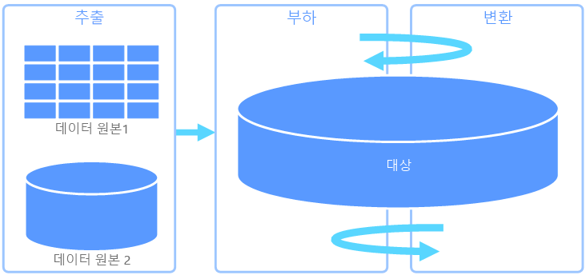
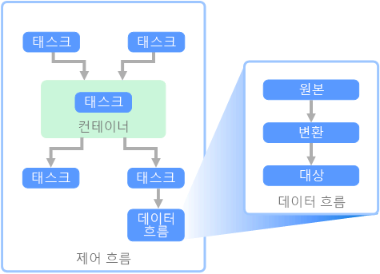

# ETL(추출, 변환 및 로드)Extract, transform, and load (ETL)

조직이 일반적으로 직면하는 문제는 여러 원본의 데이터를 여러 형식으로 수집한 후 하나 이상의 데이터 저장소로 이동하는 방법에 대한 것입니다.A common problem that organizations face is how to gathering data from multiple sources, in multiple formats, and move it to one or more data stores. 대상은 원본과 동일한 유형의 데이터 저장소가 아닐 수 있으며, 종종 형식이 다르거나, 데이터를 최종 대상으로 로드하기 전에 셰이핑 또는 정리해야 합니다.The destination may not be the same type of data store as the source, and often the format is different, or the data needs to be shaped or cleaned before loading it into its final destination.

이러한 문제를 해결하기 위해 수년에 걸쳐 다양한 도구, 서비스 및 프로세스 개발되었습니다.Various tools, services, and processes have been developed over the years to help address these challenges. 사용되는 프로세스에 관계없이, 일반적으로 작업을 조정하고 데이터 파이프라인 내에서 일정 수준의 데이터 변환을 적용할 필요가 있습니다.No matter the process used, there is a common need to coordinate the work and apply some level of data transformation within the data pipeline. 다음 섹션에서는 이러한 작업을 수행하는 데 사용되는 일반적인 방법을 강조해서 설명합니다.The following sections highlight the common methods used to perform these tasks.

## ETL(추출, 변환 및 로드)Extract, transform, and load (ETL)

ETL(추출, 변환 및 로드)은 다양한 원본에서 데이터를 수집하고, 비즈니스 규칙에 따라 데이터를 변환하고, 대상 데이터 저장소로 로드하는 데 사용되는 데이터 파이프라인입니다.Extract, transform, and load (ETL) is a data pipeline used to collect data from various sources, transform the data according to business rules, and load it into a destination data store. ETL의 변환 작업은 특수한 엔진에서 진행되며, 종종 변환 중인 데이터가 준비 테이블에서 임시로 보유되었다가 결과적으로 대상에 로드됩니다.The transformation work in ETL takes place in a specialized engine, and often involves using staging tables to temporarily hold data as it is being transformed and ultimately loaded to its destination.

일반적으로 발생하는 데이터 변환에는 필터링, 정렬, 집계, 데이터 조인, 데이터 정리, 중복 제거 및 데이터 유효성 검사 등의 다양한 작업이 포함됩니다.The data transformation that takes place usually involves various operations, such as filtering, sorting, aggregating, joining data, cleaning data, deduplicating, and validating data.

종종 시간 절약을 위해 3가지 ETL 단계가 동시에 실행됩니다.Often, the three ETL phases are run in parallel to save time. 예를 들어, 데이터의 전체 추출이 완료될 때까지 기다리지 않고, 데이터가 추출되는 동안 이미 수신된 데이터가 변환되면서 로드 준비가 진행되고, 준비된 데이터에 대해 로드 프로세스가 시작될 수 있습니다.For example, while data is being extracted, a transformation process could be working on data already received and prepare it for loading, and a loading process can begin working on the prepared data, rather than waiting for the entire extraction process to complete.

관련 Azure 서비스:Relevant Azure service:
- [Azure Data Factory v2Azure Data Factory v2](https://azure.microsoft.com/services/data-factory/)

기타 도구:Other tools:
- [SSIS(SQL Server Integration Services)SQL Server Integration Services (SSIS)](/sql/integration-services/sql-server-integration-services)

## ELT(추출, 로드, 변환)Extract, load, and transform (ELT)

ELT(추출, 로드, 변환)는 변환이 수행되는 위치만 ETL과 다릅니다.Extract, load, and transform (ELT) differs from ETL solely in where the transformation takes place. ELT 파이프라인에서는 대상 데이터 저장소에서 변환이 발생합니다.In the ELT pipeline, the transformation occurs in the target data store. 별도 변환 엔진을 사용하는 대신, 대상 데이터 저장소의 처리 기능을 사용하여 데이터를 변환합니다.Instead of using a separate transformation engine, the processing capabilities of the target data store are used to transform data. 따라서 파이프라인에서 변환 엔진이 제거되므로 아키텍처가 단순해집니다.This simplifies the architecture by removing the transformation engine from the pipeline. 이 방식의 또 다른 이점은 대상 데이터 저장소의 크기를 조정하면 ELT 파이프라인 성능도 조정된다는 것입니다.Another benefit to this approach is that scaling the target data store also scales the ELT pipeline performance. 그러나 ELT는 대상 시스템이 데이터를 효율적으로 변환할 수 있을 만큼 강력할 때만 효과적입니다.However, ELT only works well when the target system is powerful enough to transform the data efficiently.

ELT의 일반적인 사용 사례는 빅 데이터 영역에 포함합니다.Typical use cases for ELT fall within the big data realm. 예를 들어, 먼저 모든 원본 데이터를 HDFS(Hadoop 분산 파일 시스템) 또는 Azure Data Lake Store 같은 확장 가능한 저장소의 플랫 파일로 추출할 수 있습니다.For example, you might start by extracting all of the source data to flat files in scalable storage such as Hadoop distributed file system (HDFS) or Azure Data Lake Store. 그런 후 Spark, Hive 또는 PolyBase와 같은 기술을 사용하여 원본 데이터를 쿼리하기만 하면 됩니다.Technologies such as Spark, Hive, or PolyBase can then be used to query the source data. ELT의 중요한 점은 변형을 수행하는 데 사용된 동일한 데이터 저장소에서 궁극적으로 데이터가 사용된다는 것입니다.The key point with ELT is that the data store used to perform the transformation is the same data store where the data is ultimately consumed. 이 데이터 저장소는 자체 전용 저장소에 데이터를 로드하지 않고, 확장 가능한 저장소에서 직접 데이터를 읽습니다.This data store reads directly from the scalable storage, instead of loading the data into its own proprietary storage. 이 방법은 큰 데이터 집합을 사용할 경우 시간이 많이 소요될 수 있는 ETL의 데이터 복사 단계를 건너뜁니다.This approach skips the data copy step present in ETL, which can be a time consuming operation for large data sets.

실제로, 대상 데이터 저장소는 실제로 Hadoop 클러스터(Hive 또는 Spark 사용) 또는 SQL Data Warehouse를 사용하는 [데이터 웨어하우스](./data-warehousing.md)입니다.In practice, the target data store is a [data warehouse](./data-warehousing.md) using either a Hadoop cluster (using Hive or Spark) or a SQL Data Warehouse. 일반적으로 스키마는 쿼리 타임에 플랫 파일 데이터에 중첩되고 테이블로 저장되므로 데이터 저장소의 다른 테이블처럼 데이터를 쿼리할 수 있습니다.In general, a schema is overlaid on the flat file data at query time and stored as a table, enabling the data to be queried like any other table in the data store. 데이터가 데이터 저장소 자체에서 관리하는 저장소에 있지 않고 확장 가능한 외부 저장소에 있으므로 이러한 테이블을 외부 테이블이라고 합니다.These are referred to as external tables because the data does not reside in storage managed by the data store itself, but on some external scalable storage. 

데이터 저장소는 데이터의 스키마만 관리하고 읽기 시 스키마를 적용합니다.The data store only manages the schema of the data and applies the schema on read. 예를 들어, Hive를 사용하는 Hadoop 클러스터는 데이터 원본이 결과적으로 HDFS의 파일 집합에 대한 경로가 되는 Hive 테이블을 기술합니다.For example, a Hadoop cluster using Hive would describe a Hive table where the data source is effectively a path to a set of files in HDFS. SQL Data Warehouse에서 PolyBase는 동일한 결과를 얻을 수 있습니다. 즉, 외부 데이터베이스 자체에 외부적으로 저장되는 데이터 테이블이 만들어집니다.In SQL Data Warehouse, PolyBase can achieve the same result &mdash; creating a table against data stored externally to the database itself. 원본 데이터가 로드되면 데이터 저장소의 기능을 사용하여 외부 테이블에 있는 데이터를 처리할 수 있습니다.Once the source data is loaded, the data present in the external tables can be processed using the capabilities of the data store. 따라서 빅 데이터 시나리오에서는 데이터 저장소가 데이터를 좀 더 작은 청크로 분할하고 여러 컴퓨터에서 병렬로 청크 처리를 분산하는 MPP(Massively Parallel Processing) 기능을 갖추어야 합니다.In big data scenarios, this means the data store must be capable of massively parallel processing (MPP), which breaks the data into smaller chunks and distributes processing of the chunks across multiple machines in parallel.

ELT 파이프라인의 최종 단계는 일반적으로 지원해야 하는 쿼리 형식에 좀 더 효율적인 최종 형식으로 원본 데이터를 변환하는 것입니다.The final phase of the ELT pipeline is typically to transform the source data into a final format that is more efficient for the types of queries that need to be supported. 예를 들어 데이터는 분할될 수 있습니다.For example, the data may be partitioned. 또한 ELT는 행 기반 데이터를 칼럼 방식으로 저장하고 최적화된 인덱스를 제공하는 Parquet과 같은 최적화된 저장소 형식을 사용할 수도 있습니다.Also, ELT might use optimized storage formats like Parquet, which stores row-oriented data in a columnar fashion and providess optimized indexing. 

관련 Azure 서비스:Relevant Azure service:

- [Azure SQL Data WarehouseAzure SQL Data Warehouse](/azure/sql-data-warehouse/sql-data-warehouse-overview-what-is)
- [HDInsight(Hive 포함)HDInsight with Hive](/azure/hdinsight/hadoop/hdinsight-use-hive)
- [Azure Data Factory v2Azure Data Factory v2](https://azure.microsoft.com/services/data-factory/)
- [HDInsight의 OozieOozie on HDInsight](/azure/hdinsight/hdinsight-use-oozie-linux-mac)

기타 도구:Other tools:

- [SSIS(SQL Server Integration Services)SQL Server Integration Services (SSIS)](/sql/integration-services/sql-server-integration-services)

## 데이터 흐름 및 제어 흐름Data flow and control flow

데이터 파이프라인의 컨텍스트에서 제어 흐름은 태스크 집합이 순서대로 처리되도록 합니다.In the context of data pipelines, the control flow ensures orderly processing of a set of tasks. 이러한 태스크의 올바른 처리 순서를 적용하기 위해 선행 제약 조건이 사용됩니다.To enforce the correct processing order of these tasks, precedence constraints are used. 아래 그림에 나와 있는 것처럼, 이러한 제약 조건을 워크플로 다이어그램의 연결선으로 생각할 수 있습니다.You can think of these constraints as connectors in a workflow diagram, as shown in the image below. 각 태스크에는 성공, 실패 또는 완료와 같은 결과가 있습니다.Each task has an outcome, such as success, failure, or completion. 선행 작업이 이러한 결과 중 하나로 완료되어야만 후속 태스크의 처리가 시작됩니다.Any subsequent task does not initiate processing until its predecessor has completed with one of these outcomes.

제어 흐름은 데이터 흐름을 하나의 태스크로 실행합니다.Control flows execute data flows as a task. 데이터 흐름 태스크에서 데이터는 원본에서 추출되고, 변형되고, 데이터 저장소에 로드됩니다.In a data flow task, data is extracted from a source, transformed, or loaded into a data store. 하나의 데이터 흐름 태스크의 출력이 다음 데이터 흐름 태스크의 입력이 되고 데이터 흐름이 병렬로 실행될 수 있습니다.The output of one data flow task can be the input to the next data flow task, and data flowss can run in parallel. 제어 흐름과 달리, 데이터 흐름의 태스크 간에는 제약 조건을 추가할 수 없습니다.Unlike control flows, you cannot add constraints between tasks in a data flow. 그러나 각 태스크에서 처리되는 데이터를 관찰하기 위해 데이터 뷰어를 추가할 수는 있습니다.You can, however, add a data viewer to observe the data as it is processed by each task.

위의 다이어그램에는 제어 흐름 내의 여러 태스크가 나와 있습니다. 이중 하나가 데이터 흐름 태스크입니다.In the diagram above, there are several tasks within the control flow, one of which is a data flow task. 태스크 중 하나가 컨테이너 내에 중첩되어 있습니다.One of the tasks is nested within a container. 컨테이너는 태스크에 구조를 제공하는 데 사용될 수 있으며 작업 단위를 제공합니다.Containers can be used to provide structure to tasks, providing a unit of work. 이러한 예제 중 하나는 폴더 또는 데이터베이스 문의 파일처럼 컬렉션 내에서 요소를 반복하는 경우입니다.One such example is for repeating elements within a collection, such as files in a folder or database statements.

관련 Azure 서비스:Relevant Azure service:
- [Azure Data Factory v2Azure Data Factory v2](https://azure.microsoft.com/services/data-factory/)

기타 도구:Other tools:
- [SSIS(SQL Server Integration Services)SQL Server Integration Services (SSIS)](/sql/integration-services/sql-server-integration-services)

## 기술 선택Technology choices

- [OLTP(온라인 트랜잭션 처리) 데이터 저장소Online Transaction Processing (OLTP) data stores](../technology-choices/oltp-data-stores.md)
- [OLAP(온라인 분석 처리) 데이터 저장소Online Analytical Processing (OLAP) data stores](../technology-choices/olap-data-stores.md)
- [데이터 웨어하우스Data warehouses](../technology-choices/data-warehouses.md)
- [파이프라인 오케스트레이션Pipeline orchestration](../technology-choices/pipeline-orchestration-data-movement.md)
