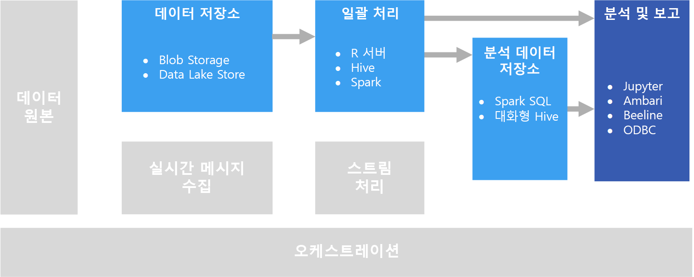

# 대화형 데이터 탐색

많은 회사 BI(비즈니스 인텔리전스) 솔루션에서는 보고서 및 의미 체계 모델이 BI 전문가에 의해 만들어지며 중앙에서 관리됩니다. 하지만 조직에서 사용자가 데이터 기반 결정을 내릴 수 있도록 하려는 경우가 점점 더 많아지고 있습니다. 또한 점점 더 많은 수의 조직에서 *데이터 과학자* 또는 *데이터 분석가*를 채용하고 있습니다. 이러한 직원들은 대화형으로 데이터를 탐색하고, 통계 모델 및 분석 기술을 적용하여 데이터의 추세와 패턴을 찾아냅니다. 대화형 데이터 탐색을 위해서는 오래 대기하지 않으면서 임시 쿼리 및 데이터 시각화를 처리하는 도구와 플랫폼이 필요합니다.

## 셀프 서비스 BI

셀프 서비스 BI는 사용자가 엔터프라이즈의 데이터에서 정보를 찾고, 탐색하고, 공유할 수 있는 권한을 부여 받게 되는 최신 비즈니스 의사 결정 방법을 나타냅니다. 이를 위해 데이터 솔루션은 다음과 같은 몇 가지 요구 사항을 지원해야 합니다.

* 데이터 카탈로그를 통해 비즈니스 데이터 원본 검색
* 데이터 엔터티 정의 및 값의 일관성을 보장하기 위한 마스터 데이터 관리
* 비즈니스 사용자를 위한 대화형 데이터 모델링 및 시각화 도구

셀프 서비스 BI 솔루션에서 비즈니스 사용자는 일반적으로 특정 비즈니스 영역에 관련된 데이터 원본을 찾아서 사용하며, 직관적인 도구 및 생산성 응용 프로그램을 사용하여 개인 데이터 모델 및 동료와 공유할 수 있는 보고서를 정의합니다.

관련 Azure 서비스:

- [Azure Data Catalog](/azure/data-catalog/data-catalog-what-is-data-catalog)
- [Microsoft Power BI](https://powerbi.microsoft.com/)

## 데이터 과학 실험
조직에 고급 분석 및 예측 모델링이 필요한 경우 초기 준비 작업은 일반적으로 전문 데이터 과학자가 수행합니다. 데이터 과학자는 데이터를 탐색하고 통계 분석 기술을 적용하여 데이터 *기능* 및 원하는 예측 *레이블* 간 관계를 알아냅니다. 데이터 탐색은 기본적으로 통계 모델링 및 시각화를 지원하는 Python 또는 R과 같은 프로그래밍 언어를 사용하여 수행됩니다. 데이터를 탐색하는 데 사용되는 스크립트는 일반적으로 Jupyter 노트와 같은 특수한 환경에서 호스트됩니다. 이러한 도구를 사용하여 데이터 과학자는 알아낸 정보를 문서화하고 공유하면서 데이터를 프로그래밍 방식으로 탐색할 수 있습니다.

관련 Azure 서비스:

- [Azure 노트](https://notebooks.azure.com/)
- [Azure Machine Learning Studio](/azure/machine-learning/studio/what-is-ml-studio)
- [Azure Machine Learning 실험 서비스](/azure/machine-learning/preview/experimentation-service-configuration)
- [데이터 과학 Virtual Machine](/azure/machine-learning/data-science-virtual-machine/overview)

## 과제

- **데이터 개인 정보 보호 규정 준수.** 셀프 서비스 분석 및 보고를 위해 사용자가 개인 데이터를 사용할 수 있게 할 때는 주의해야 합니다. 조직의 정책 및 규정 문제 때문에 규정 준수 고려 사항이 있을 수 있습니다. 

- **데이터 볼륨.** 사용자에게 전체 데이터 원본에 대한 액세스 권한을 부여하면 유용할 수 있지만, 매우 오래 실행되는 Excel 또는 Power BI 작업이 발생하거나 많은 양의 클러스터 리소스를 사용하게 되는 Spark SQL 쿼리가 실행될 수 있습니다.

- **사용자 지식.** 사용자는 정보를 토대로 비즈니스 의사 결정을 내리기 위해 자체 쿼리 및 집계를 만듭니다. 사용자에게 정확한 결과를 얻는 데 필요한 분석 및 쿼리 기술이 있다고 확신하시나요?

- **결과 공유.** 사용자가 보고서 또는 데이터 시각화를 만들고 공유할 수 있는 경우 보안을 고려해야 할 수 있습니다.

## 건축

이 시나리오의 목표는 대화형 데이터 분석을 지원하는 것이지만, 데이터 과학과 관련된 데이터 정리, 샘플링 및 구성 태스크에는 장기 실행 프로세스가 수반됩니다. 따라서 [일괄 처리](../big-data/batch-processing.md) 아키텍처가 적절할 수 있습니다.

## 기술 선택

Azure의 대화형 데이터 탐색을 위해 다음과 같은 기술이 권장됩니다.

### 데이터 저장소

- **Azure Storage Blob 컨테이너** 또는 **Azure Data Lake Store**. 데이터 과학자는 일반적으로 원시 원본 데이터를 사용하여 데이터의 가능한 모든 특징, 이상값 및 오류에 액세스할 수 있습니다. 빅 데이터 시나리오에서 이 데이터는 대개 데이터 저장소에서 파일 형태를 갖습니다.

자세한 내용은 [데이터 저장소](../technology-choices/data-storage.md)를 참조하세요.

### 일괄 처리

- **R Server** 또는 **Spark**. 대부분 데이터 과학자는 R 또는 Python과 같이 수학 및 통계 기능을 보다 강력하게 지원하는 프로그래밍 언어를 사용합니다. 많은 양의 데이터를 사용할 경우, 이러한 언어에서 분산 처리를 사용할 수 있도록 하는 플랫폼을 사용하여 대기 시간을 줄일 수 있습니다. R Server를 자체적으로 또는 Spark와 함께 사용하여 R 처리 함수를 스케일 아웃할 수 있으며, Spark는 기본적으로 해당 언어의 유사한 스케일 아웃 기능을 위해 Python을 지원합니다.
- **Hive**. Hive는 SQL과 비슷한 의미 체계를 사용하여 데이터를 변환하는 데 적합합니다. 사용자는 의미 체계가 SQL과 비슷한 HiveQL 문을 사용하여 테이블을 만들고 로드할 수 있습니다.

자세한 내용은 [일괄 처리](../technology-choices/batch-processing.md)를 참조하세요.

### 분석 데이터 저장소

- **Spark SQL**. Spark SQL은 SQL 구문을 사용하여 쿼리할 수 있는 데이터프레임 및 테이블을 만들 수 있도록 지원하는 Spark 기반 API입니다. 분석할 데이터가 원시 원본 파일인지 또는 일괄 처리 프로세스에 의해 정리되고 준비된 새 파일인지에 관계없이, 사용자는 추가 쿼리 또는 분석을 위해 데이터에 대해 Spark SQL 테이블을 정의할 수 있습니다. 
- **Hive**. Hive를 사용하여 원시 데이터를 일괄로 처리하는 것 외에도, 데이터가 저장되어 있는 폴더를 기준으로 Hive 테이블 및 뷰를 포함하는 Hive 데이터베이스를 만들어 분석 및 보고에 대화형 쿼리를 사용할 수 있습니다. HDInsight는 메모리 내 캐싱을 사용하여 Hive 쿼리 응답 시간을 줄이는 대화형 Hive 클러스터 형식을 포함합니다. SQL 유사 구문에 익숙한 사용자는 대화형 Hive를 사용하여 데이터를 탐색할 수 있습니다.

자세한 내용은 [분석 데이터 저장소](../technology-choices/analytical-data-stores.md)를 참조하세요.

### 분석 및 보고

- **Jupyter**. Jupyter 노트는 R, Python 또는 Scala 등의 언어로 코드를 실행하기 위한 브라우저 기반 인터페이스를 제공합니다. R Server 또는 Spark를 사용하여 데이터를 일괄로 처리하거나, Spark SQL을 사용하여 쿼리할 테이블 스키마를 정의할 때 데이터 쿼리를 위해 Jupyter를 선택하는 것이 적절할 수 있습니다. Spark를 사용할 경우, 포함된 SQL 문 뿐만 아니라 표준 Spark 데이터프레임 API 또는 Spark SQL API를 사용하여 데이터를 쿼리하고 시각화를 생성할 수 있습니다.
- **대화형 Hive 클라이언트**. 대화형 Hive 클러스터를 사용하여 데이터를 쿼리하는 경우 Ambari 클러스터 대시보드, Beeline 명령줄 도구, Microsoft Excel이나 Power BI 같은 ODBC 기반 도구(Hive ODBC 드라이버 사용)에서 Hive 보기를 사용할 수 있습니다.

자세한 내용은 [데이터 분석 및 보고 기술](../technology-choices/analysis-visualizations-reporting.md)을 참조하세요.