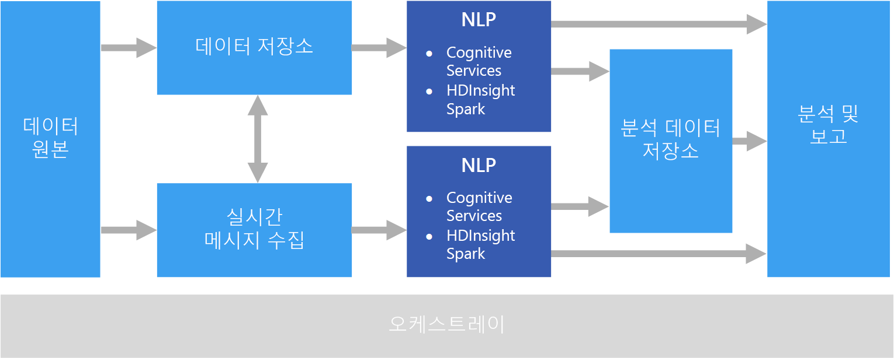

# 자연어 처리

NLP(자연어 처리)는 감성 분석, 토픽 감지, 언어 감지, 핵심 구 추출 및 문서 분류 등의 태스크에 사용됩니다.

## 이 솔루션을 사용해야 하는 경우

NLP는 문서에 중요 또는 스팸으로 레이블을 지정하는 것과 같이 문서를 분류하는 데 사용될 수 있습니다. NLP의 출력은 후속 처리 또는 검색에 사용될 수 있습니다. NLP의 다른 용도는 문서의 엔터티를 식별하여 텍스트를 요약하는 것입니다. 이러한 엔터티는 문서에 키워드를 태그로 지정하는 데도 사용할 수 있습니다. 이렇게 하면 콘텐츠에 따라 검색을 수행할 수 있습니다. 엔터티를 토픽과 결합하고, 각 문서의 중요 토픽을 설명하는 요약을 함께 표시할 수 있습니다. 감지된 토픽은 탐색을 위해 문서를 분류하거나, 선택한 토픽에 대해 관련 문서를 열거하는 데 사용될 수 있습니다. NLP의 또 다른 용도는 텍스트의 감정 점수를 매겨서 문서가 긍정적인 어조인지 부정적인 어조인지 평가하는 것입니다. 이러한 방식에서는 다음과 같은 자연어 처리의 많은 기술이 사용됩니다. 

- **토크나이저**. 텍스트를 단어 또는 구로 분할합니다.
- **형태소 분석 및 기본형 분석**. 다른 형태가 같은 의미의 정식 단어에 매핑되도록 단어 정규화. 예: "running" 및 "ran"은 "run"에 매핑됩니다. 
- **엔터티 추출**. 텍스트에서 주체 식별
- **품사 감지**. 텍스트를 동사, 명사, 분사, 동사구 등으로 식별
- **문장 경계 감지**. 텍스트 구 내에서 완전한 문장 감지

NLP를 사용하여 자유 형식 텍스트에서 정보를 추출할 때는 일반적으로 AAzure Storage 서비스 또는 Azure Data Lake Store와 같은 개체 저장소에 저장된 원시 문서에서 시작합니다. 

## 과제

- 자유 형식 텍스트 문서 컬렉션의 처리는 일반적으로 시간이 오래 걸릴 뿐만 아니라 계산 리소스도 많이 소비됩니다.
- 표준화된 문서 형식이 없는 경우, 자유 형식 텍스트 처리를 사용하여 문서에서 특정 팩트는 추출함으로써 일관되게 정확한 결과를 얻는 것이 매울 어려울 수 있습니다. 예를 들어, 청구서에 표시되는 텍스트를 생각해 보세요. 공급업체 번호에 포함되어 있는 송장 번호와 송장 날짜를 올바르게 추출하는 프로세스를 빌드하는 것은 어려울 수 있습니다.

## 건축

NLP 솔루션에서는 텍스트 단락이 포함된 문서에 대해 자유 형식 텍스트 처리가 수행됩니다. 전체 아키텍처는 [일괄 처리](./batch-processing.md) 또는 [실시간 스트림 처리](./real-time-processing.md) 아키텍처일 수 있습니다.

실제 처리는 원하는 결과에 따라 다르지만, 파이프라인의 관점에서 볼 때 NLP를 일괄로 또는 실시간 방식으로 적용할 수 있습니다. 예를 들어 텍스트 블록에 대해 감정 분석에 사용하여 감정 점수를 생성할 수 있습니다. 이 작업은 저장소의 데이터에 대해 일괄 처리 프로세스를 실행하여 또는 메시지 서비스를 통해 흐르는 데이터의 보다 작은 청크를 사용하여 실시간으로 수행할 수 있습니다.

## 기술 선택

- [자연어 처리](../technology-choices/natural-language-processing.md)