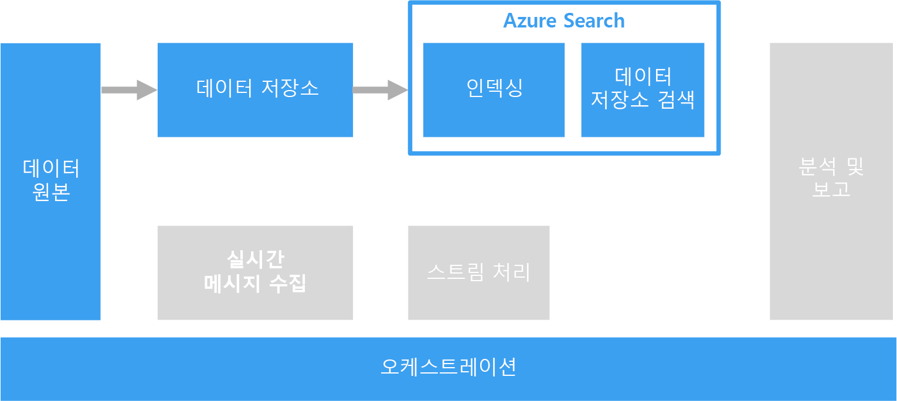

# 검색을 위해 자유 형식 텍스트 처리

검색을 지원하기 위해 텍스트 단락이 포함된 문서에 대해 자유 형식 텍스트 처리를 수행할 수 있습니다.

텍스트 검색은 문서 컬렉션에 대해 미리 계산되는 특수한 인덱스를 구성하여 작동합니다. 클라이언트 응용 프로그램은 검색 용어를 포함하는 쿼리를 제출합니다. 이 쿼리는 각 문서가 검색 조건과 얼마나 잘 일치하는지를 기준으로 정렬된 문서 목록으로 구성되는 결과 집합을 반환합니다. 또한 결과 집합에는 해당 문서가 기준과 일치하는 컨텍스트도 포함되어, 응용 프로그램에서 문서의 일치하는 구문이 강조 표시될 수 있습니다. 

자유 형식 텍스트 처리는 많은 양의 불필요한 텍스트 데이터에서 유용하고 실행 가능한 데이터를 생성할 수 있습니다. 결과적으로 구조화되지 않은 문서가 잘 정의되고 쿼리 가능한 구조를 갖게 될 수 있습니다.

## 과제

- 자유 형식 텍스트 문서 컬렉션의 처리는 일반적으로 시간이 오래 걸릴 뿐만 아니라 계산도 많이 수반됩니다.
- 자유 형식 텍스트를 효율적으로 검색하기 위해 검색 인덱스는 비슷한 구성을 갖는 용어를 기준으로 유사 항목 검색을 지원해야 합니다. 예를 들어, 검색 인덱스는 표준형 및 언어적 형태소 분석을 사용하여 작성되므로 "run"을 쿼리하면 "ran" 및 "running"을 포함하는 문서가 일치하는 항목으로 검색됩니다.

## 건축

대부분의 시나리오에서 원본 텍스트 문서는 Azure Storage 또는 Azure Data Lake Store와 같은 개체 저장소에 로드됩니다. 예외는 SQL Server 또는 Azure SQL Database 내에서 전체 텍스트 검색을 사용하는 것입니다. 이 경우 문서 데이터는 데이터베이스에서 관리되는 테이블에 로드됩니다. 일단 저장되면 문서는 일괄로 처리되어 인덱스를 생성합니다.

## 기술 선택

검색 인덱스를 만드는 옵션에는 Azure Search, Elasticsearch, HDInsight(Solr 포함)가 포함됩니다. 이러한 각 기술은 문서 컬렉션으로 검색 인덱스를 채울 수 있습니다. Azure Search는 일반 텍스트에서 Excel 및 PDF 형식 문서에 대한 인덱스를 자동으로 채울 수 있는 인덱서를 제공합니다. HDInsight에서 Apache Solr은 일반 텍스트, Word 및 PDF를 비롯한 다양한 형식의 이진 파일을 인덱싱할 수 있습니다. 인덱스가 생성되면 클라이언트는 REST API를 사용하여 검색 인터페이스에 액세스할 수 있습니다. 

텍스트 데이터가 SQL Server 또는 Azure SQL Database에 저장되면 데이터베이스로 작성된 전체 텍스트 검색을 사용할 수 있습니다. 데이터베이스는 텍스트, 이진 또는 동일한 데이터베이스 내에 저장된 XML 데이터를 사용해서 인덱스를 채웁니다. 클라이언트는 T-SQL 쿼리를 사용하여 검색합니다. 

자세한 내용은 [지원되는 데이터 원본](../technology-choices/search-options.md)을 참조하세요.
