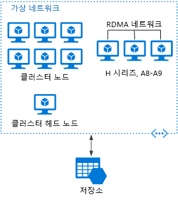

# 큰 계산 아키텍처 스타일

*큰 계산*이라는 용어는 수백 또는 수천 개의 번호 매기기 등 코어 수를 많이 요구하는 대규모 워크로드를 설명합니다. 시나리오에는 이미지 렌더링, 유체 역학, 재무 위험 모델링, 석유 탐색, 약 디자인 및 스트레스 분석 엔지니어링이 포함됩니다.

큰 계산 응용 프로그램의 몇 가지 일반적인 특성은 다음과 같습니다.

- 작업은 동시에 여러 코어에서 실행될 수 있는 개별 작업으로 분할될 수 있습니다.
- 각 작업은 한정됩니다. 일부 입력을 사용하고, 일부 처리를 수행하고, 출력을 생성합니다. 전체 응용 프로그램은 제한된 양의 시간(몇 분, 몇 일) 동안 실행됩니다. 일반적인 패턴에서는 갑자기 많은 수의 코어를 프로비전하고 응용 프로그램이 완료되면 0으로 스핀 다운합니다. 
- 응용 프로그램을 일주일 내내 사용하지 않아도 됩니다. 그러나 시스템은 노드 오류 또는 응용 프로그램 충돌을 처리해야 합니다.
- 일부 응용 프로그램의 경우 작업이 독립적이며 병렬로 실행할 수 있습니다. 다른 경우에 작업은 밀접하게 연결됩니다. 즉, 중간 결과와 상호 작용하거나 교환해야 합니다. 이 경우에 InfiniBand 및 RDMA(원격 직접 메모리 액세스)와 같은 고속 네트워킹 기술을 사용하는 것이 좋습니다. 
- 워크로드에 따라 계산 집약적인 VM 크기(H16r, H16mr 및 A9)를 사용할 수 있습니다.

## 이 아키텍처를 사용하는 경우

- 시뮬레이션 및 숫자 고속 처리와 같은 계산 집약적인 작업
- 계산 집약적이고 여러 컴퓨터(10~1000대)에서 CPU에 분할되어야 하는 시뮬레이션
- 한 대의 컴퓨터에 메모리가 너무 많이 필요하고 여러 컴퓨터 간에 분할되야 하는 시뮬레이션
- 단일 컴퓨터에서 완료되는 시간이 너무 오래 걸리는 장기 실행 계산
- Monte Carlo 시뮬레이션과 같이 100번 또는 1000번 실행해야 하는 더 작은 계산

## 이점

- "[병렬][embarrassingly-parallel]" 처리가 적합한 고성능
- 큰 문제를 더 빠르게 해결하도록 수백 또는 수천 개의 컴퓨터 코어를 활용할 수 있습니다.
- 빠른 전용 InfiniBand 네트워크를 사용하여 특수한 고성능 하드웨어에 액세스합니다.
- 작업을 수행하고 종료하는 데 필요한 만큼 VM을 프로비전할 수 있습니다. 

## 과제

- VM 인프라 관리
- 숫자 고속 처리의 볼륨 관리 
- 적절하게 수천 개의 코어 프로비전
- 밀접하게 연결된 작업의 경우 더 많은 코어를 추가하면 반환을 줄일 수 있습니다. 최적의 코어 수를 찾기 위해 실험이 필요할 수 있습니다.

## Azure Batch를 사용하는 큰 계산

[Azure Batch][batch]는 대규모 HPC(고성능 컴퓨팅) 응용 프로그램을 실행하기 위한 관리 서비스입니다.

Azure Batch를 사용하여 VM 풀을 구성하고, 응용 프로그램 및 데이터 파일을 업로드합니다. Batch 서비스는 VM을 프로비전하고, VM에 작업을 할당하고, 작업을 실행하고, 진행 상황을 모니터링합니다. Batch는 워크로드에 따라 VM을 자동으로 스케일 아웃할 수 있습니다. 또한 Batch는 작업 예약 기능을 제공합니다.

 

## Virtual Machines에서 실행되는 큰 계산

[Microsoft HPC Pack][hpc-pack]을 사용하여 VM의 클러스터를 관리하고 HPC 작업을 예약하고 모니터링할 수 있습니다. 이 접근 방식으로 VM 및 네트워크 인프라를 프로비전하고 관리해야 합니다. 기존 HPC 워크로드가 있고 그 중 일부 또는 모두를 Azure로 이동하려면 이 방법을 고려하세요. 전체 HPC 클러스터를 Azure로 이동하거나 HPC 클러스터 온-프레미스를 유지하면서 버스트 용량에 Azure를 사용할 수 있습니다. 자세한 내용은 [대규모 컴퓨팅 워크로드를 위한 Batch 및 HPC 솔루션][batch-hpc-solutions]을 참조하세요.

### Azure에 배포된 HPC Pack

이 시나리오에서 HPC 클러스터는 Azure 내에서 완전히 생성됩니다.

 
 
헤드 노드는 클러스터에 대한 관리 및 작업 예약 서비스를 제공합니다. 밀접하게 연결된 작업의 경우 VM 간에 매우 높은 대역폭으로 대기 시간이 짧은 통신을 제공하는 RDMA 네트워크를 사용합니다. 자세한 내용은 [Azure에서 HPC Pack 2016 클러스터 배포][deploy-hpc-azure]를 참조하세요.

### HPC 클러스터를 Azure로 버스트

이 시나리오에서 조직은 HPC Pack 온-프레미스를 실행하고 버스트 용량에 대해 Azure VM을 사용합니다. 클러스터 헤드 노드는 온-프레미스입니다. ExpressRoute 또는 VPN Gateway는 온-프레미스 네트워크를 Azure VNet에 연결합니다.

 

[batch]: /azure/batch/
[batch-hpc-solutions]: /azure/batch/batch-hpc-solutions
[deploy-hpc-azure]: /azure/virtual-machines/windows/hpcpack-2016-cluster
[embarrassingly-parallel]: https://en.wikipedia.org/wiki/Embarrassingly_parallel
[hpc-pack]: https://technet.microsoft.com/library/cc514029

 
