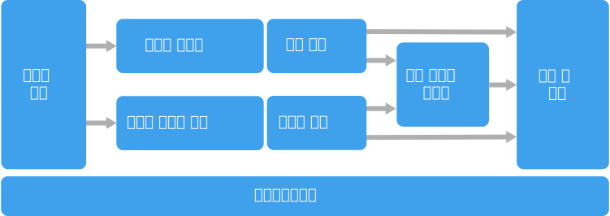

# 빅 데이터 아키텍처 스타일Big data architecture style

빅 데이터 아키텍처는 기존의 데이터베이스 시스템에 비해 너무 크거나 복잡한 데이터의 수집, 처리 및 분석을 수행하도록 디자인되었습니다.A big data architecture is designed to handle the ingestion, processing, and analysis of data that is too large or complex for traditional database systems.

 빅 데이터 솔루션에는 일반적으로 다음 중 하나 이상의 워크로드 유형이 포함됩니다.Big data solutions typically involve one or more of the following types of workload:

- 미사용 빅 데이터 원본의 일괄 처리Batch processing of big data sources at rest.
- 사용 중인 빅 데이터의 실시간 처리Real-time processing of big data in motion.
- 빅 데이터의 대화형 탐색Interactive exploration of big data.
- 예측 분석 및 기계 학습Predictive analytics and machine learning.

대부분의 빅 데이터 아키텍처에는 다음 구성 요소의 일부 또는 전체가 포함됩니다.Most big data architectures include some or all of the following components:

- **데이터 원본**: 모든 빅 데이터 솔루션은 하나 이상의 데이터 원본으로 시작합니다.**Data sources**: All big data solutions start with one or more data sources. 이러한 예로 다음이 포함됩니다.Examples include:

    - 응용 프로그램 데이터 저장소(예: 관계형 데이터베이스)Application data stores, such as relational databases.
    - 응용 프로그램에서 생성하는 정적 파일(예: 웹 서버 로그 파일)Static files produced by applications, such as web server log files.
    - 실시간 데이터 원본(예: IoT 장치)Real-time data sources, such as IoT devices.

- **데이터 저장소**: 일괄 처리 작업을 위한 데이터는 대개 대용량 파일을 다양한 형식으로 저장할 수 있는 분산 파일 저장소에 저장됩니다.**Data storage**: Data for batch processing operations is typically stored in a distributed file store that can hold high volumes of large files in various formats. 이런 종류의 저장소를 *Data Lake*라고도 합니다.This kind of store is often called a *data lake*. 이 저장소를 구현하기 위한 옵션으로는 Azure Data Lake Store 또는 Azure Storage의 BLOB 컨테이너가 있습니다.Options for implementing this storage include Azure Data Lake Store or blob containers in Azure Storage. 

- **일괄 처리**: 데이터 집합이 너무 큰 경우 빅 데이터 솔루션은 필터링, 집계 및 그 밖의 분석을 위한 데이터를 준비하기 위해 장기간 실행되는 일괄 처리 작업을 사용하여 데이터 파일을 처리해야 하는 경우가 있습니다.**Batch processing**: Because the data sets are so large, often a big data solution must process data files using long-running batch jobs to filter, aggregate, and otherwise prepare the data for analysis. 일반적으로 이러한 작업은 원본 파일 읽기 및 처리와 새 파일에 출력 작성으로 이루어집니다.Usually these jobs involve reading source files, processing them, and writing the output to new files. 옵션에는 Azure Data Lake Analytics에서 U-SQL 작업 실행, HDInsight Hadoop 클러스터에서 Hive, Pig 또는 사용자 지정 Map/Reduce 작업 사용, HDInsight Spark 클러스터에서 Java, Scala 또는 Python 프로그램 사용 등이 있습니다.Options include running U-SQL jobs in Azure Data Lake Analytics, using Hive, Pig, or custom Map/Reduce jobs in an HDInsight Hadoop cluster, or using Java, Scala, or Python programs in an HDInsight Spark cluster.

- **실시간 메시지 수집**: 솔루션에 실시간 원본이 포함되는 경우 스트림 처리를 위해 실시간 메시지를 캡처하고 저장하는 방법이 아키텍처에 포함되어야 합니다.**Real-time message ingestion**: If the solution includes real-time sources, the architecture must include a way to capture and store real-time messages for stream processing. 이는 들어오는 메시지가 처리를 위해 폴더에 저장되는 간단한 데이터 저장소일 수 있습니다.This might be a simple data store, where incoming messages are dropped into a folder for processing. 그러나 많은 솔루션에는 메시지에 대한 버퍼로 작동하고 스케일 아웃 처리, 안정적인 전달 및 기타 메시지 큐 의미 체계를 지원하는 메시지 수집 저장소가 필요합니다.However, many solutions need a message ingestion store to act as a buffer for messages, and to support scale-out processing, reliable delivery, and other message queuing semantics. 옵션에는 Azure Event Hubs, Azure IoT Hubs 및 Kafka가 포함됩니다.Options include Azure Event Hubs, Azure IoT Hubs, and Kafka.

- **스트림 처리**: 실시간 메시지를 캡처한 후 솔루션은 필터링, 집계 및 그 밖의 분석을 위한 데이터 준비를 통해 해당 메시지를 처리해야 합니다.**Stream processing**: After capturing real-time messages, the solution must process them by filtering, aggregating, and otherwise preparing the data for analysis. 그런 다음, 처리된 스트림 데이터는 출력 싱크에 기록됩니다.The processed stream data is then written to an output sink. Azure Stream Analytics는 제한되지 않은(Unbounded) 스트림에서 작동하는 영구적으로 실행되는 SQL 쿼리를 기반으로 관리되는 스트림 처리 서비스를 제공합니다.Azure Stream Analytics provides a managed stream processing service based on perpetually running SQL queries that operate on unbounded streams. 또한 HDInsight 클러스터에서 Storm 및 Spark Streaming과 같은 오픈 소스 Apache 스트리밍 기술을 사용할 수도 있습니다.You can also use open source Apache streaming technologies like Storm and Spark Streaming in an HDInsight cluster.

- **분석 데이터 저장소**: 대다수의 빅 데이터 솔루션은 분석할 데이터를 준비한 다음, 분석 도구를 사용하여 쿼리할 수 있는 구조화된 형식으로 처리된 데이터를 제공합니다.**Analytical data store**: Many big data solutions prepare data for analysis and then serve the processed data in a structured format that can be queried using analytical tools. 이러한 쿼리를 처리하는 데 사용되는 분석 데이터 저장소로는 대부분의 기존 BI(비즈니스 인텔리전스) 솔루션에서 볼 수 있는 Kimball 스타일의 관계형 데이터 웨어하우스가 있습니다.The analytical data store used to serve these queries can be a Kimball-style relational data warehouse, as seen in most traditional business intelligence (BI) solutions. 또는 HBase와 같이 대기 시간이 짧은 NoSQL 기술이나, 분산 데이터 저장소의 데이터 파일에 대한 메타데이터 추상화를 제공하는 대화형 Hive 데이터베이스를 통해 데이터를 제공할 수 있습니다.Alternatively, the data could be presented through a low-latency NoSQL technology such as HBase, or an interactive Hive database that provides a metadata abstraction over data files in the distributed data store. Azure SQL Data Warehouse는 클라우드 기반의 대규모 데이터 웨어하우징을 위한 관리형 서비스를 제공합니다.Azure SQL Data Warehouse provides a managed service for large-scale, cloud-based data warehousing. HDInsight는 대화형 Hive, HBase 및 Spark SQL을 지원하며 이들을 사용하여 분석용 데이터를 처리할 수도 있습니다.HDInsight supports Interactive Hive, HBase, and Spark SQL, which can also be used to serve data for analysis.

- **분석 및 보고**: 대부분의 빅 데이터 솔루션의 목표는 분석 및 보고를 통해 데이터에 대한 정보를 제공하는 것입니다.**Analysis and reporting**: The goal of most big data solutions is to provide insights into the data through analysis and reporting. 사용자의 데이터 분석을 지원하도록 아키텍처에는 Azure Analysis Services의 다차원 OLAP 큐브 또는 테이블 형식 데이터 모델과 같은 데이터 모델링 계층이 포함될 수 있습니다.To empower users to analyze the data, the architecture may include a data modeling layer, such as a multidimensional OLAP cube or tabular data model in Azure Analysis Services. 또한 Microsoft Power BI 또는 Microsoft Excel의 모델링 기술 및 시각화 기술을 사용하여 셀프 서비스 BI를 지원할 수도 있습니다.It might also support self-service BI, using the modeling and visualization technologies in Microsoft Power BI or Microsoft Excel. 분석 및 보고는 데이터 과학자 또는 데이터 분석가에 의한 대화형 데이터 탐색의 형태를 취할 수도 있습니다.Analysis and reporting can also take the form of interactive data exploration by data scientists or data analysts. 이러한 시나리오의 경우 많은 Azure 서비스가 Jupyter와 같은 분석용 노트북을 지원하므로 사용자가 Python 또는 R을 사용하여 기존 기술을 활용할 수 있습니다. 대규모 데이터 탐색의 경우 Microsoft R Server를 독립적으로 또는 Spark와 함께 사용할 수 있습니다.For these scenarios, many Azure services support analytical notebooks, such as Jupyter, enabling these users to leverage their existing skills with Python or R. For large-scale data exploration, you can use Microsoft R Server, either standalone or with Spark.

- **오케스트레이션**: 대부분의 빅 데이터 솔루션은 원본 데이터를 변환하고, 여러 원본과 싱크 간에 데이터를 이동하고, 처리된 데이터를 분석 데이터 저장소로 로드하거나, 또는 결과를 보고서나 대시보드로 직접 전달하는 '반복되는 데이터 처리 작업'을 워크플로 내에 캡슐화한 형태로 구성됩니다.**Orchestration**: Most big data solutions consist of repeated data processing operations, encapsulated in workflows, that transform source data, move data between multiple sources and sinks, load the processed data into an analytical data store, or push the results straight to a report or dashboard. 이러한 워크플로를 자동화하기 위해 Azure Data Factory 또는 Apache Oozie 및 Sqoop과 같은 오케스트레이션 기술을 사용할 수 있습니다.To automate these workflows, you can use an orchestration technology such Azure Data Factory or Apache Oozie and Sqoop.

Azure에는 빅 데이터 아키텍처에서 사용할 수 있는 많은 서비스가 포함되어 있습니다.Azure includes many services that can be used in a big data architecture. 이 서비스들은 크게 두 가지 범주로 나뉩니다.They fall roughly into two categories:

- Azure Data Lake Store, Azure Data Lake Analytics, Azure Data Warehouse, Azure Stream Analytics, Azure Event Hub, Azure IoT Hub 및 Azure Data Factory를 포함하는 관리 서비스Managed services, including Azure Data Lake Store, Azure Data Lake Analytics, Azure Data Warehouse, Azure Stream Analytics, Azure Event Hub, Azure IoT Hub, and Azure Data Factory.
- HDFS, HBase, Hive, Pig, Spark, Storm, Oozie, Sqoop 및 Kafka를 포함하는 Apache Hadoop 플랫폼 기반의 오픈 소스 기술Open source technologies based on the Apache Hadoop platform, including HDFS, HBase, Hive, Pig, Spark, Storm, Oozie, Sqoop, and Kafka. 이러한 기술은 Azure HDInsight 서비스에서 제공됩니다.These technologies are available on Azure in the Azure HDInsight service.

위 옵션들은 상호 배타적이지 않으며 대부분의 솔루션은 오픈 소스 기술과 Azure 서비스를 결합합니다.These options are not mutually exclusive, and many solutions combine open source technologies with Azure services.

## 이 아키텍처를 사용하는 경우When to use this architecture

다음 작업을 수행해야 하는 경우 이 아키텍처 스타일을 고려합니다.Consider this architecture style when you need to:

- 기존 데이터베이스에 비해 너무 큰 볼륨의 데이터 저장 및 처리Store and process data in volumes too large for a traditional database.
- 분석 및 보고를 위해 구조화되지 않은 데이터 변환Transform unstructured data for analysis and reporting.
- 제한되지 않은 데이터 스트림을 실시간으로 또는 짧은 대기 시간으로 수집, 처리 및 분석Capture, process, and analyze unbounded streams of data in real time, or with low latency.
- Azure Machine Learning 또는 Microsoft Cognitive Services 사용Use Azure Machine Learning or Microsoft Cognitive Services.

## 이점Benefits

- **기술 선택**.**Technology choices**. HDInsight 클러스터에서 Azure 관리 서비스와 Apache 기술을 적절히 조합하여 기존 기술 또는 기술 투자를 최대한 활용할 수 있습니다.You can mix and match Azure managed services and Apache technologies in HDInsight clusters, to capitalize on existing skills or technology investments.
- **병렬 처리를 통한 성능**.**Performance through parallelism**. 빅 데이터 솔루션은 병렬 처리를 활용하므로 대용량 데이터로 확장할 수 있는 고성능 솔루션을 구현할 수 있습니다.Big data solutions take advantage of parallelism, enabling high-performance solutions that scale to large volumes of data.
- **탄력적 확장**.**Elastic scale**. 빅 데이터 아키텍처의 모든 구성 요소는 스케일 아웃 프로비저닝을 지원하므로 솔루션을 크고 작은 워크로드로 조정하고 사용하는 리소스에 대해서만 비용을 지불할 수 있습니다.All of the components in the big data architecture support scale-out provisioning, so that you can adjust your solution to small or large workloads, and pay only for the resources that you use.
- **기존 솔루션과의 상호 운용성**.**Interoperability with existing solutions**. 빅 데이터 아키텍처의 구성 요소는 IoT 처리 및 엔터프라이즈 BI 솔루션에도 사용되므로 데이터 워크로드 전반에 걸쳐 통합 솔루션을 만들 수 있습니다.The components of the big data architecture are also used for IoT processing and enterprise BI solutions, enabling you to create an integrated solution across data workloads.

## 과제Challenges

- **복잡성**.**Complexity**. 빅 데이터 솔루션은 여러 데이터 원본에서 데이터 수집을 처리하는 다양한 구성 요소에 의해 매우 복잡할 수 있습니다.Big data solutions can be extremely complex, with numerous components to handle data ingestion from multiple data sources. 빅 데이터 프로세스를 빌드, 테스트 및 문제 해결하는 작업이 어려울 수 있습니다.It can be challenging to build, test, and troubleshoot big data processes. 또한 성능을 최적화하기 위해 사용해야 하는 많은 구성 설정이 여러 시스템에 걸쳐 있을 수 있습니다.Moreover, there may be a large number of configuration settings across multiple systems that must be used in order to optimize performance.
- **기능**.**Skillset**. 많은 빅 데이터 기술은 고도로 전문화되어 있으며 보다 일반적인 응용 프로그램 아키텍처에 많이 사용되지 않는 프레임워크와 언어를 사용합니다.Many big data technologies are highly specialized, and use frameworks and languages that are not typical of more general application architectures. 한편, 빅 데이터 기술은 더 많은 확립된 언어를 기반으로 구축된 새로운 API를 발전시키고 있습니다.On the other hand, big data technologies are evolving new APIs that build on more established languages. 예를 들어 Azure Data Lake Analytics의 U-SQL 언어는 TRANSACT-SQL 및 C#의 조합을 기반으로 합니다.For example, the U-SQL language in Azure Data Lake Analytics is based on a combination of Transact-SQL and C#. 마찬가지로 SQL 기반의 API를 Hive, HBase 및 Spark에서도 사용할 수 있습니다.Similarly, SQL-based APIs are available for Hive, HBase, and Spark.
- **기술 성숙도**.**Technology maturity**. 빅 데이터에 사용되는 많은 기술이 진화하고 있습니다.Many of the technologies used in big data are evolving. Hive 및 Pig와 같은 핵심 Hadoop 기술은 안정화되었지만 Spark와 같은 신기술은 새로운 릴리스가 있을 때마다 크게 변경되고 향상됩니다.While core Hadoop technologies such as Hive and Pig have stabilized, emerging technologies such as Spark introduce extensive changes and enhancements with each new release. Azure Data Lake Analytics 및 Azure Data Factory와 같은 관리 서비스는 다른 Azure 서비스와 비교할 때 아직 역사가 짧으므로 시간이 지남에 따라 더욱 발전할 것입니다.Managed services such as Azure Data Lake Analytics and Azure Data Factory are relatively young, compared with other Azure services, and will likely evolve over time.
- **보안**.**Security**. 빅 데이터 솔루션은 일반적으로 모든 정적 데이터를 중앙 집중식 Data Lake에 저장합니다.Big data solutions usually rely on storing all static data in a centralized data lake. 이 데이터에 대한 액세스를 보호하는 것은 어려울 수 있습니다. 여러 응용 프로그램 및 플랫폼에서 데이터를 수집하고 사용해야 하는 경우 특히 어렵습니다.Securing access to this data can be challenging, especially when the data must be ingested and consumed by multiple applications and platforms.

## 모범 사례Best practices

- **병렬 처리 활용**.**Leverage parallelism**. 대부분의 빅 데이터 처리 기술은 다중 처리 장치에 워크로드를 분산시킵니다.Most big data processing technologies distribute the workload across multiple processing units. 이를 위해서는 분할 가능한 형식으로 정적 데이터 파일을 만들고 저장해야 합니다.This requires that static data files are created and stored in a splittable format. HDFS와 같은 분산 파일 시스템은 읽기 및 쓰기 성능을 최적화할 수 있으며 실제 처리는 여러 클러스터 노드에서 병렬로 수행되므로 전체 작업 시간이 줄어듭니다.Distributed file systems such as HDFS can optimize read and write performance, and the actual processing is performed by multiple cluster nodes in parallel, which reduces overall job times.

- **데이터 분할**.**Partition data**. 일괄 처리는 일반적으로 매주 또는 매월과 같은 되풀이 일정에서 발생합니다.Batch processing usually happens on a recurring schedule &mdash; for example, weekly or monthly. 처리 일정과 일치하는 임시(temporal) 기간에 따라 데이터 파일과 데이터 구조(예: 테이블)를 분할합니다.Partition data files, and data structures such as tables, based on temporal periods that match the processing schedule. 이렇게 하면 데이터 수집 및 작업 예약을 단순화하고 오류를 쉽게 해결할 수 있습니다.That simplifies data ingestion and job scheduling, and makes it easier to troubleshoot failures. 또한 Hive, U-SQL 또는 SQL 쿼리에 사용되는 테이블을 분할하여 쿼리 성능을 크게 향상시킬 수 있습니다.Also, partitioning tables that are used in Hive, U-SQL, or SQL queries can significantly improve query performance.

- **스키마 온 리드(schema-on-read) 의미 체계 적용**.**Apply schema-on-read semantics**. Data Lake를 사용하면 구조화, 반구조화 또는 구조화되지 않은 여러 형식의 파일을 위해 저장소를 결합할 수 있습니다.Using a data lake lets you to combine storage for files in multiple formats, whether structured, semi-structured, or unstructured. *스키마 온 리드(schema-on-read)* 의미 체계를 사용하면 데이터가 저장될 때가 아니라 데이터가 처리 중일 때 스키마를 데이터에 반영합니다.Use *schema-on-read* semantics, which project a schema onto the data when the data is processing, not when the data is stored. 이를 통해 솔루션의 유연성이 향상되고 데이터 수집 중 데이터 유효성 검사 및 형식 검사로 인한 병목 현상이 방지됩니다.This builds flexibility into the solution, and prevents bottlenecks during data ingestion caused by data validation and type checking.

- **적소에서 데이터 처리**.**Process data in-place**. 기존의 BI 솔루션은 ETL(추출, 변환 및 로드) 프로세스를 사용하여 데이터를 데이터 웨어하우스로 이동시키는 경우가 많습니다.Traditional BI solutions often use an extract, transform, and load (ETL) process to move data into a data warehouse. 데이터 용량이 더 커지고 형식이 다양해진 빅 데이터 솔루션은 일반적으로 TEL(변환, 추출 및 로드)과 같은 ETL 변형을 사용합니다.With larger volumes data, and a greater variety of formats, big data solutions generally use variations of ETL, such as transform, extract, and load (TEL). 이 방식을 사용하면 변환된 데이터를 분석 데이터 저장소로 이동하기 전에 분산 데이터 저장소에서 데이터를 처리하여 필요한 구조로 변환할 수 있습니다.With this approach, the data is processed within the distributed data store, transforming it to the required structure, before moving the transformed data into an analytical data store.

- **사용률과 시간 비용의 균형 조정**.**Balance utilization and time costs**. 일괄 처리 작업의 경우 계산 노드의 단위당 비용과 작업 완료를 위해 해당 노드를 사용하는 분당 비용의 두 가지 요소를 고려해야 합니다.For batch processing jobs, it's important to consider two factors: The per-unit cost of the compute nodes, and the per-minute cost of using those nodes to complete the job. 예를 들어 네 개의 클러스터 노드로 8시간이 걸리는 일괄 처리 작업이 있다고 간주합니다.For example, a batch job may take eight hours with four cluster nodes. 그러나 작업에서 처음 두 시간 동안만 네 개의 노드를 모두 사용하고 그 후에는 두 개의 노드만 필요하다고 판명될 수 있습니다.However, it might turn out that the job uses all four nodes only during the first two hours, and after that, only two nodes are required. 이 경우 전체 작업을 두 개의 노드에서 실행하면 총 작업 시간이 늘어나지만 두 배보다는 적으므로 총 비용은 줄어듭니다.In that case, running the entire job on two nodes would increase the total job time, but would not double it, so the total cost would be less. 일부 비즈니스 시나리오에서는 활용도가 낮은 클러스터 리소스를 사용하는 데 드는 높은 비용보다 처리 시간이 길어지는 것을 선호할 수 있습니다.In some business scenarios, a longer processing time may be preferable to the higher cost of using under-utilized cluster resources.

- **클러스터 리소스 분리**.**Separate cluster resources**. HDInsight 클러스터를 배포할 때 일반적으로 각 유형의 워크로드에 대해 별도의 클러스터 리소스를 프로비저닝하여 더 나은 성능을 얻을 수 있습니다.When deploying HDInsight clusters, you will normally achieve better performance by provisioning separate cluster resources for each type of workload. 예를 들어 Spark 클러스터에는 Hive가 포함되어 있지만 Hive와 Spark 모두에서 광범위한 처리를 수행해야 하는 경우 별도의 전용 Spark 및 Hadoop 클러스터를 배포하는 것을 고려해야 합니다.For example, although Spark clusters include Hive, if you need to perform extensive processing with both Hive and Spark, you should consider deploying separate dedicated Spark and Hadoop clusters. 마찬가지로, HBase와 Storm을 대기 시간이 짧은 스트림 처리에 사용하고 Hive를 일괄 처리에 사용하는 경우 Storm, HBase 및 Hadoop에 대해 별도의 클러스터를 고려합니다.Similarly, if you are using HBase and Storm for low latency stream processing and Hive for batch processing, consider separate clusters for Storm, HBase, and Hadoop.

- **데이터 수집 오케스트레이션**.**Orchestrate data ingestion**. 경우에 따라 기존 비즈니스 응용 프로그램은 일괄 처리를 위한 데이터 파일을 HDInsight 또는 Azure Data Lake Analytics에서 사용할 수 있는 Azure Storage BLOB 컨테이너에 직접 쓸 수 있습니다.In some cases, existing business applications may write data files for batch processing directly into Azure storage blob containers, where they can be consumed by HDInsight or Azure Data Lake Analytics. 그러나 많은 경우 온-프레미스 또는 외부 데이터 원본의 데이터 수집을 Data Lake로 오케스트레이션해야 할 수 있습니다.However, you will often need to orchestrate the ingestion of data from on-premises or external data sources into the data lake. 이를 예측 가능하고 중앙 집중식 관리 방법으로 구현하도록 하려면 Azure Data Factory 또는 Oozie에서 지원하는 것과 같은 오케스트레이션 워크플로 또는 파이프라인을 사용합니다.Use an orchestration workflow or pipeline, such as those supported by Azure Data Factory or Oozie, to achieve this in a predictable and centrally manageable fashion.

- **중요한 데이터의 초기 스크럽**.**Scrub sensitive data early**. 데이터 수집 워크플로는 중요한 데이터를 Data Lake에 저장하는 것을 피하기 위해 프로세스 초기에 해당 데이터를 스크럽해야 합니다.The data ingestion workflow should scrub sensitive data early in the process, to avoid storing it in the data lake.
