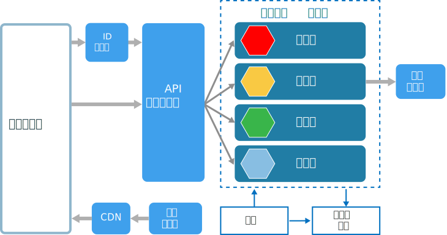
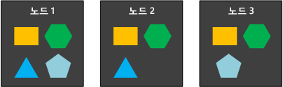
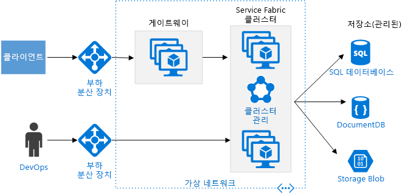

# 마이크로 서비스 아키텍처 스타일

마이크로 서비스 아키텍처는 작은 자율 서비스 컬렉션으로 구성됩니다. 각 서비스는 자체 포함되며 단일 비즈니스 기능을 구현해야 합니다. 

 
일부 측면에서 마이크로 서비스는 SOA(서비스 지향 아키텍처)의 자연스러운 발전이지만 마이크로 서비스와 SOA 간에는 차이가 있습니다. 다음은 마이크로 서비스를 정의하는 몇 가지 특성입니다.

- 마이크로 서비스 아키텍처에서 서비스는 작고, 독립적이며, 느슨하게 결합되어 있습니다.

- 각 서비스는 작은 개발 팀이 관리할 수 있는 개별 코드베이스입니다.

- 서비스를 독립적으로 배포할 수 있습니다. 팀이 전체 응용 프로그램을 다시 빌드한 후 재배치하지 않고도 기존 서비스를 업데이트할 수 있습니다.

- 서비스가 해당 데이터 또는 외부 상태를 유지해야 합니다. 이는 별도의 데이터 레이어가 데이터 지속성을 처리하는 기존 모델과의 차이점입니다.

- 서비스가 잘 정의된 API를 사용하여 서로 통신합니다. 각 서비스의 내부 구현 세부 정보는 다른 서비스에서 숨겨집니다.

- 서비스가 동일한 기술 스택, 라이브러리 또는 프레임워크를 공유할 필요가 없습니다.

서비스 자체 외에도 다음과 같은 몇 가지 다른 구성 요소가 기존 마이크로 서비스 아키텍처에 나타납니다.

**관리**. 관리 구성 요소는 노드에 서비스 배치, 실패 식별, 노드 간에 서비스 부하 조정 등의 작업을 담당합니다.  

**서비스 검색**.  서비스 목록과 서비스 목록이 배치되는 노드를 유지 관리합니다. 서비스 조회를 통해 서비스 끝점을 찾을 수 있게 합니다. 

**API 게이트웨이**. API 게이트웨이는 클라이언트의 진입점입니다. 클라이언트는 서비스를 직접 호출하지 않습니다. 대신, 호출을 백 엔드의 적절한 서비스에 전달하는 API 게이트웨이를 호출합니다. API 게이트웨이는 여러 서비스의 응답을 집계하고 집계된 응답을 반환할 수 있습니다. 

API 게이트웨이를 사용할 경우의 장점은 다음과 같습니다.

- 클라이언트와 서비스가 분리됩니다. 모든 클라이언트를 업데이트하지 않고도 서비스 버전을 관리하거나 서비스를 리팩터링할 수 있습니다.

-  서비스가 웹 우호적이 아닌 AMQP 등의 메시징 프로토콜을 사용할 수 있습니다.

- API 게이트웨이는 인증, 로깅, SSL 종료, 부하 분산 등의 다른 교차 기능을 수행할 수 있습니다.

## 이 아키텍처를 사용하는 경우

다음과 같은 경우 이 아키텍처 스타일을 고려합니다.

- 높은 릴리스 개발속도가 필요한 대규모 응용 프로그램.

- 고확장성이 필요한 복합 응용 프로그램.

- 풍부한 도메인이나 많은 하위 도메인이 있는 응용 프로그램.

- 소규모 개발 팀으로 구성된 조직.

## 이점 

- **독립 배포**. 전체 응용 프로그램을 다시 배포하지 않고 서비스를 업데이트할 수 있고, 문제가 발생하면 업데이트를 롤백 또는 롤포워드할 수 있습니다. 버그 수정 및 기능 릴리스 관리가 더 용이해지고 위험이 감소합니다.

- **독립 개발**. 단일 개발 팀이 서비스를 빌드, 테스트 및 배포할 수 있습니다. 그 결과, 연속적인 혁신과 더 빠른 릴리스 주기가 가능합니다. 

- **집중화된 소규모 팀**. 팀이 한 서비스에 집중할 수 있습니다. 각 서비스의 범위가 작을수록 코드베이스 이해가 더 용이해지며 새로운 팀 구성원이 더 쉽게 이용할 수 있습니다.

- **결함 격리**. 한 서비스가 다운되더라도 전체 응용 프로그램 작동은 중단되지 않습니다. 그러나 저절로 복원되는 것은 아닙니다. 복원 모범 사례 및 디자인 패턴을 따라야 합니다. [Azure용 복원 응용 프로그램 디자인][resiliency-overview]을 참조하세요.

- **혼합 기술 스택**. 팀이 해당 서비스에 가장 적합한 기술을 선택할 수 있습니다. 

- **세분화된 크기 조정**. 서비스를 독립적으로 확장할 수 있습니다. 이와 동시에, VM당 서비스 수준이 높을수록 VM 리소스가 완전히 활용됨을 의미합니다. 배치 제약 조건을 사용하여 서비스를 VM 프로필(높은 CPU, 높은 메모리 등)에 맞출 수 있습니다.

## 과제

- **복잡성**. 마이크로 서비스 응용 프로그램에는 동등한 모놀리식 응용 프로그램보다 작동 부분이 더 많습니다. 각 서비스는 더 단순하지만 전체 시스템이 더 복잡합니다.

- **개발 및 테스트**. 서비스 종속성에 대한 개발 시 다른 접근 방법이 필요합니다. 기존 도구는 서비스 종속성 작업에 맞게 설계되지 않았을 수 있습니다. 서비스 경계를 벗어난 리팩터링은 어려울 수 있습니다. 특히 응용 프로그램이 빠르게 발전하는 경우 서비스 종속성을 테스트하기도 어렵습니다.

- **통제 부족**. 마이크로 서비스 빌드에 대한 분산 접근 방법에는 장점이 있지만 문제가 발생할 수도 있습니다. 언어와 프레임워크가 너무 많아서 응용 프로그램 유지 관리가 어려워질 수 있습니다. 팀의 유연성을 지나치게 제한하지 않고 몇 가지 프로젝트 전체 표준을 적용하는 것이 유용할 수 있습니다. 특히 로깅과 같은 교차 기능에 해당합니다.

- **네트워크 정체 및 대기 시간**. 다수의 작고 세분화된 서비스를 사용하면 서비스 간 통신이 증가할 수 있습니다. 또한 서비스 종속성 체인이 너무 길어질 경우(서비스 A가 B를 호출하고, B가 C를 호출하고...) 추가 대기 시간이 문제가 될 수 있습니다. API를 신중하게 디자인해야 합니다. 통신량이 과도한 API를 피하고, 직렬화 형식을 고려하고, 비동기 통신 패턴을 사용할 영역을 찾아보세요.

- **데이터 무결성**. 각 마이크로 서비스가 자체 데이터 지속성을 담당합니다. 그 결과, 데이터 일관성이 과제가 될 수 있습니다. 가능한 경우 결과적 일관성을 수용합니다.

- **관리**. 마이크로 서비스에 성공하려면 성숙한 DevOps 문화가 필요합니다. 전체 서비스의 상관관계 로깅이 까다로울 수 있습니다. 일반적으로 로깅은 단일 사용자 작업에 대한 여러 서비스 호출을 상호 연결해야 합니다.

- **버전 관리**. 서비스 업데이트로 인해 종속된 서비스가 손상되지 않아야 합니다. 언제든지 여러 서비스가 업데이트될 수 있으므로 신중하게 디자인하지 않으면 이전 버전 또는 이후 버전과의 호환성 문제가 발생할 수 있습니다.

- **기능**. 마이크로 서비스는 고도로 분산된 시스템입니다. 팀이 성공을 위한 기술과 경험을 가지고 있는지 신중하게 평가합니다.

## 모범 사례

- 비즈니스 도메인을 중심으로 서비스를 모델링합니다. 

- 모든 것을 분산합니다. 개별 팀이 서비스 디자인 및 빌드를 담당합니다. 코드 또는 데이터 스키마를 공유하지 않도록 합니다. 

- 데이터 저장소가 데이터를 소유하는 서비스의 개인용이어야 합니다. 각 서비스 및 데이터 형식에 가장 적합한 저장소를 사용합니다. 

- 서비스가 잘 디자인된 API를 통해 통신합니다. 구현 세부 정보가 누출되지 않도록 합니다. API는 서비스의 내부 구현이 아니라 도메인을 모델링해야 합니다.

- 서비스 간의 결합을 피합니다. 결합의 원인에는 공유 데이터베이스 스키마, 엄격한 통신 프로토콜 등이 포함됩니다.

- 인증, SSL 종료 등의 교차 문제를 게이트웨이에 오프로드합니다.

- 도메인 정보를 게이트웨이에서 숨깁니다. 게이트웨이는 비즈니스 규칙 또는 도메인 논리를 몰라도 클라이언트 요청을 처리하고 라우트해야 합니다. 그러지 않으면 게이트웨이가 종속성이 되며 서비스 간에 결합이 발생할 수 있습니다.

- 서비스에 느슨한 결합 및 높은 기능 응집력이 있어야 합니다. 함께 변경될 가능성이 큰 기능은 함께 패키지하고 배포해야 합니다. 개별 서비스에 상주할 경우, 한 서비스가 변경되면 다른 서비스를 업데이트해야 하므로 해당 서비스가 긴밀하게 결합됩니다. 두 서비스 간의 과도한 통신량은 긴밀한 결합과 낮은 응집력의 증상일 수 있습니다. 

- 실패를 격리합니다. 복원 전략을 사용하여 한 서비스 내의 실패가 계단식으로 연속되지 않도록 합니다. [복원력 패턴][resiliency-patterns] 및 [복원력 있는 응용 프로그램 디자인][resiliency-overview]을 참조하세요.

## Azure Container Service를 사용하는 마이크로 서비스 

Azure Container Service를 사용하여 Docker 클러스터를 구성 및 프로비전할 수 있습니다. Azure Container Service는 Kubernetes, DC/OS 및 Docker Swarm을 포함하여 여러 인기 컨테이너 오케스트레이터를 지원합니다.

 
**공용 노드**. 이 노드는 공용 부하 분산 장치를 통해 연결할 수 있습니다. API 게이트웨이는 이 노드에 호스트됩니다.

**백 엔드 노드**. 이 노드는 클라이언트가 API 게이트웨이를 통해 연결하는 서비스를 실행합니다. 이 노드는 인터넷 트래픽을 직접 받지 않습니다. 백 엔드 노드에는 각각 다른 하드웨어 프로필을 사용하는 두 개 이상의 VM 풀이 포함될 수 있습니다. 예를 들어 일반 계산 워크로드, 높은 CPU 워크로드 및 높은 메모리 워크로드를 위해 개별 풀을 만들 수 있습니다. 

**관리 VM**. 이 VM은 컨테이너 오케스트레이터의 마스터 노드를 실행합니다. 

**네트워킹**. 공용 노드, 백 엔드 노드 및 관리 VM은 동일한 VNet(가상 네트워크) 내의 개별 서브넷에 배치됩니다. 

**부하 분산 장치**.  외부 연결 부하 분산 장치는 공용 노드 앞에 배치되고, 공용 노드에 인터넷 요청을 분배합니다. 다른 부하 분산 장치는 관리 VM 앞에 배치되어 NAT 규칙을 사용하여 관리 VM에 대한 ssh(보안 셸) 트래픽을 허용합니다.

안정성과 확장성을 위해 각 서비스가 여러 VM에 복제됩니다. 그러나 서비스는 모놀리식 응용 프로그램에 비해 상대적으로 경량이므로 일반적으로 여러 서비스가 단일 VM에 포함됩니다. 밀도가 높을수록 리소스 사용률이 향상됩니다. 특정 서비스가 많은 리소스를 사용하지 않는 경우 해당 서비스를 실행하기 위해 전체 VM을 사용할 필요가 없습니다.

다음 다이어그램은 네 가지 서비스(각기 다른 도형으로 표시됨)를 실행하는 세 개의 노드를 보여 줍니다. 각 서비스에 두 개 이상의 인스턴스가 있습니다. 
 

## Azure Service Fabric을 사용하는 마이크로 서비스

다음 다이어그램은 Azure Service Fabric을 사용하는 마이크로 서비스 아키텍처를 보여 줍니다.

Service Fabric 클러스터는 하나 이상의 VM 확장 집합에 배포됩니다. VM 유형을 섞어서 사용하기 위해 클러스터에 두 개 이상의 VM 확장 집합을 포함할 수도 있습니다. API 게이트웨이는 Service Fabric 클러스터의 앞에 배치되고 외부 부하 분산 장치가 클라이언트 요청을 수신합니다.

Service Fabric 런타임은 서비스 배치, 노드 장애 조치(failover) 및 상태 모니터링을 비롯한 클러스터 관리를 수행합니다. 런타임은 클러스터 노드 자체에 배포됩니다. 별도의 클러스터 관리 VM 집합이 없습니다.

서비스는 Service Fabric에 빌드된 역방향 프록시를 사용하여 서로 통신합니다. Service Fabric은 명명된 서비스의 끝점을 확인할 수 있는 검색 서비스를 제공합니다.

<!-- links -->

[resiliency-overview]: ../../resiliency/index.md
[resiliency-patterns]: ../../patterns/category/resiliency.md

