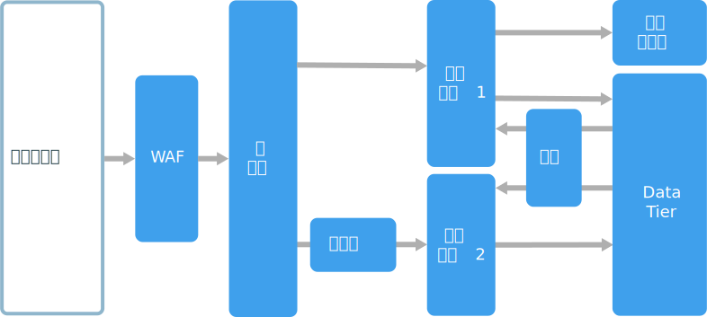
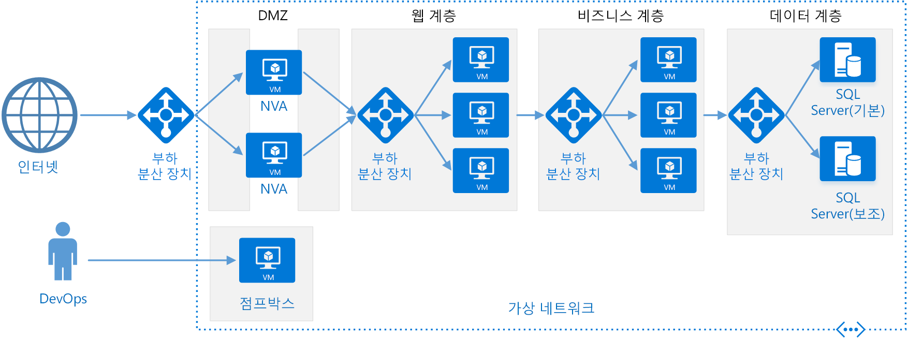

# N 계층 아키텍처 스타일

N 계층 아키텍처는 응용 프로그램을 **논리 레이어**와 **물리적 계층**으로 나눕니다. 

레이어는 책임을 구분하고 종속성을 관리하는 방법입니다. 레이어마다 특정 책임이 있습니다. 상위 레이어는 하위 레이어의 서비스를 사용할 수 있지만 하위 레이어는 상위 레이어의 서비스를 사용할 수 없습니다. 

계층은 물리적으로 분리되어 별도의 시스템에서 실행됩니다. 계층은 다른 계층을 직접 호출하거나 비동기 메시징(메시지 큐)을 사용할 수 있습니다. 각 레이어가 자체 계층에 호스트될 수 있지만 필수는 아닙니다. 여러 레이어가 동일한 계층에 호스트될 수도 있습니다. 계층을 물리적으로 분리하면 확장성과 복원력이 향상되지만 추가 네트워크 통신으로 인해 대기 시간도 증가합니다. 

기존 3계층 응용 프로그램에는 프레젠테이션 계층, 중간 계층 및 데이터베이스 계층이 있습니다. 중간 계층은 선택 사항입니다. 더 복잡한 응용 프로그램은 4개 이상의 계층으로 구성될 수 있습니다. 위 다이어그램은 각기 다른 기능 영역을 캡슐화하는 두 개의 중간 계층이 있는 응용 프로그램을 보여 줍니다. 

N 계층 응용 프로그램은 **폐쇄형 레이어 아키텍처** 또는 **개방형 레이어 아키텍처**를 사용할 수 있습니다.

- 폐쇄형 레이어 아키텍처에서는 레이어가 바로 아래에 있는 다음 레이어만 호출할 수 있습니다. 
- 개방형 레이어 아키텍처에서는 레이어가 아래에 있는 모든 레이어를 호출할 수 있습니다. 

폐쇄형 레이어 아키텍처는 레이어 간의 종속성을 제한합니다. 그러나 레이어가 단순히 요청을 다음 레이어로 전달하는 경우 불필요한 네트워크 트래픽을 만들 수 있습니다. 

## 이 아키텍처를 사용하는 경우

N 계층 아키텍처는 일반적으로 각 계층이 개별 VM 집합에서 실행되는 IaaS(Infrastructure-as-Service)로 구현됩니다. 그러나 N 계층 응용 프로그램은 순수 IaaS가 아니어도 됩니다. 특히 캐싱, 메시징, 데이터 저장소 같은 일부 아키텍처 부분에는 관리 서비스를 사용하는 것이 유리한 경우가 많습니다.

다음과 같은 경우 N 계층 아키텍처를 고려해 보세요.

- 단순 웹 응용 프로그램. 
- 최소 리팩터링으로 온-프레미스 응용 프로그램을 Azure로 마이그레이션.
- 온-프레미스 및 클라우드 응용 프로그램의 통합 개발.

N 계층 아키텍처는 기존 온-프레미스 응용 프로그램에서 매우 일반적이므로 기존 워크로드를 Azure로 마이그레이션하는 데 적합합니다.

## 이점

- 클라우드와 온-프레미스 간, 클라우드 플랫폼 간의 이식성.
- 대부분의 개발자에게 필요한 학습 곡선 단축.
- 기존 응용 프로그램 모델에서 자연스러운 발전.
- 이기종 환경(Windows/Linux)에 대한 개방성.

## 과제

- 데이터베이스에서 CRUD 작업을 수행하여 유용한 작업 없이 대기 시간만 늘리는 중간 계층이 생성되기 쉽습니다. 
- 모놀리식 디자인으로 인해 기능의 독립적 배포가 불가능합니다.
- IaaS 응용 프로그램 관리가 관리 서비스만 사용하는 응용 프로그램보다 더 복잡합니다. 
- 대규모 시스템에서는 네트워크 보안을 관리하기 어려울 수 있습니다.

## 모범 사례

- 자동 크기 조정을 사용하여 부하 변경을 처리합니다. [자동 크기 조정 모범 사례][autoscaling]를 참조하세요.
- 비동기 메시징을 사용하여 계층을 분리합니다.
- 반정적 데이터를 캐시합니다. [캐싱 모범 사례][caching]를 참조하세요.
- [SQL Server Always On 가용성 그룹][sql-always-on] 등의 솔루션을 사용하여 고가용성을 위해 데이터베이스 계층을 구성합니다.
- 프런트 엔드와 인터넷 사이에 WAF(웹 응용 프로그램 방화벽)를 배치합니다.
- 각 계층을 자체 서브넷에 배치하고 서브넷을 보안 경계로 사용합니다. 
- 중간 계층의 요청만 허용하여 데이터 계층에 대한 액세스를 제한합니다.

## 가상 머신의 N 계층 아키텍처

이 섹션에서는 VM에서 실행되는 권장 N 계층 아키텍처에 대해 설명합니다. 

각 계층은 두 개 이상의 VM으로 구성되며 가용성 집합 또는 VM 확장 집합에 배치됩니다. 한 VM이 실패할 경우 여러 VM이 복원을 제공합니다. 부하 분산 장치가 계층의 VM에 요청을 분배하는 데 사용됩니다. 풀에 VM을 더 추가하여 계층을 수평적으로 확장할 수 있습니다. 

또한 각 계층이 자체 서브넷 안에 배치되므로 내부 IP 주소가 동일한 주소 범위 내에 있습니다. 이렇게 하면 NSG(네트워크 보안 그룹) 규칙을 적용하고 테이블을 개별 계층으로 라우트하기 쉽습니다.

웹 계층과 비즈니스 계층은 상태 비저장입니다. 모든 VM이 해당 계층에 대한 요청을 처리할 수 있습니다. 데이터 계층은 복제된 데이터베이스로 구성되어야 합니다. Windows의 경우 SQL Server가 권장되며 고가용성을 위해 Always On 가용성 그룹을 사용하는 것이 좋습니다. Linux의 경우 복제를 지원하는 Apache Cassandra 등의 데이터베이스를 선택합니다. 

NSG(네트워크 보안 그룹)는 각 계층에 대한 액세스를 제한합니다. 예를 들어 데이터베이스 계층은 비즈니스 계층의 액세스만 허용합니다.

자세한 내용과 배포 가능한 Resource Manager 템플릿은 다음 참조 아키텍처를 참조하세요.

- [N 계층 응용 프로그램에 대해 Windows VM 실행][n-tier-windows]
- [ 계층 응용 프로그램에 대해 Linux VM 실행][n-tier-linux]

### 추가 고려 사항

- N 계층 아키텍처는 3개의 계층으로 제한되지 않습니다. 더 복잡한 응용 프로그램의 경우 추가 계층을 사용하는 것이 일반적입니다. 이 경우 레이어 7 라우팅을 사용하여 요청을 특정 계층으로 라우트하는 것이 좋습니다.

- 계층은 확장성, 안정성 및 보안의 경계입니다. 이러한 영역에서 요구 사항이 각기 다른 서비스에 대해 개별 계층을 사용하는 것이 좋습니다.

- 자동 크기 조정을 위해 VM 확장 집합을 사용합니다.

- 아키텍처에서 대규모 리팩터링 없이 관리 서비스를 사용할 수 있는 영역을 찾습니다. 특히 캐싱, 메시징, 저장소 및 데이터베이스를 찾으세요. 

- 보안 강화를 위해 응용 프로그램 앞에 네트워크 DMZ를 배치합니다. DMZ에는 방화벽 및 패킷 검사와 같은 보안 기능을 구현하는 NVA(네트워크 가상 어플라이언스)가 포함됩니다. 자세한 내용은 [네트워크 DMZ 참조 아키텍처][dmz]를 참조하세요.

- 고가용성을 위해 두 개 이상의 NVA를 가용성 집합에 배치하고 외부 부하 분산 장치를 사용하여 인스턴스에 인터넷 요청을 분배합니다. 자세한 내용은 [고가용성 네트워크 가상 어플라이언스 배포][ha-nva]를 참조하세요.

- 응용 프로그램 코드를 실행하는 VM에 대한 직접 RDP 또는 SSH 액세스를 허용하지 않도록 합니다. 대신, 운영자가 요새 호스트라고도 하는 Jumpbox에 로그인해야 합니다. 이는 관리자가 다른 VM에 연결할 때 사용하는 네트워크의 VM입니다. Jumpbox에는 승인된 공용 IP 주소의 RDP 또는 SSH만 허용하는 NSG가 있습니다.

- 사이트 간 VPN(가상 사설망) 또는 Azure ExpressRoute를 사용하여 Azure 가상 네트워크를 온-프레미스 네트워크로 확장할 수 있습니다. 자세한 내용은 [하이브리드 네트워크 참조 아키텍처][hybrid-network]를 참조하세요.

- 조직에서 Active Directory를 사용하여 ID를 관리하는 경우 Active Directory 환경을 Azure VNet으로 확장하는 것이 좋습니다. 자세한 내용은 [ID 관리 참조 아키텍처][identity]를 참조하세요.

- VM용 Azure SLA가 제공하는 가용성보다 높은 가용성이 필요한 경우, 두 지역 간에 응용 프로그램을 복제한 다음 장애 조치(failover)를 위해 Azure Traffic Manager를 사용합니다. 자세한 내용은 [여러 지역에서 Windows VM 실행][multiregion-windows] 또는 [여러 지역에서 Linux VM 실행][multiregion-linux]을 참조하세요.

[autoscaling]: ../../best-practices/auto-scaling.md
[caching]: ../../best-practices/caching.md
[dmz]: ../../reference-architectures/dmz/index.md
[ha-nva]: ../../reference-architectures/dmz/nva-ha.md
[hybrid-network]: ../../reference-architectures/hybrid-networking/index.md
[identity]: ../../reference-architectures/identity/index.md
[multiregion-linux]: ../../reference-architectures/virtual-machines-linux/multi-region-application.md
[multiregion-windows]: ../../reference-architectures/virtual-machines-windows/multi-region-application.md
[n-tier-linux]: ../../reference-architectures/virtual-machines-linux/n-tier.md
[n-tier-windows]: ../../reference-architectures/virtual-machines-windows/n-tier.md
[sql-always-on]: /sql/database-engine/availability-groups/windows/always-on-availability-groups-sql-server