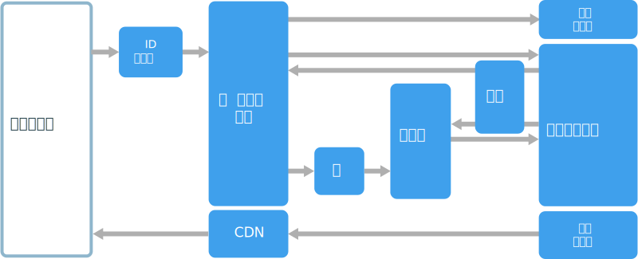
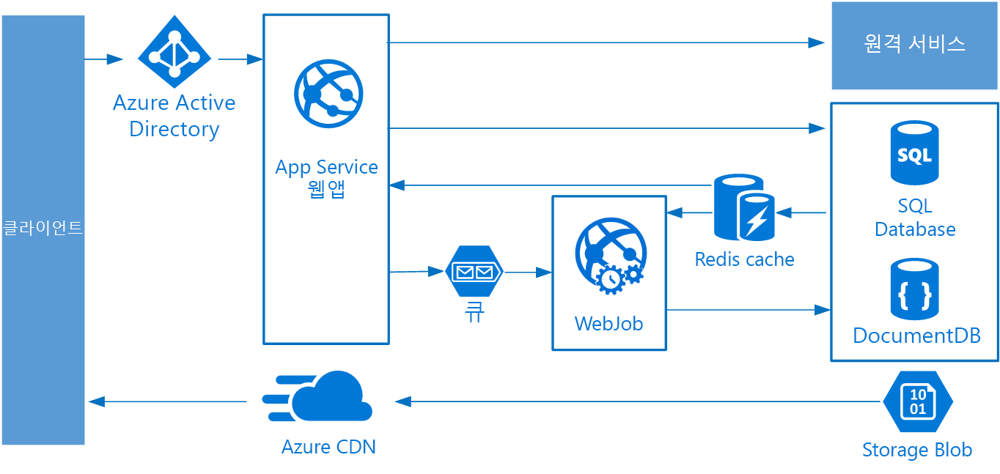

# 웹 큐 작업자 아키텍처 스타일

이 아키텍처의 핵심 구성 요소는 클라이언트 요청을 처리하는 **웹 프런트 엔드**와 리소스 집약적 작업, 장기 실행 워크플로 또는 일괄 처리 작업을 수행하는 **작업자**입니다.  웹 프런트 엔드는 **메시지 큐**를 통해 작업자와 통신합니다.  

이 아키텍처에 공통적으로 통합되는 기타 구성 요소는 다음과 같습니다.

- 하나 이상의 데이터베이스 
- 빠른 읽기를 위해 데이터베이스의 값을 저장하는 캐시
- 정적 콘텐츠를 제공하기 위한 CDN
- 원격 서비스(예: 전자 메일 또는 SMS 서비스) 종종 이러한 서비스는 타사에서 제공합니다.
- 인증을 위한 ID 공급자

웹 및 작업자는 둘 다 상태 비저장입니다. 세션 상태는 분산된 캐시에 저장할 수 있습니다. 모든 장기 실행 작업은 작업자에 의해 비동기적으로 수행됩니다. 작업자는 큐의 메시지에 의해 트리거되거나, 일괄 처리 일정에 따라 실행될 수 있습니다. 작업자는 선택적 구성 요소입니다. 장기 실행 작업이 없는 경우 작업자를 생략할 수 있습니다.  

프런트 엔드는 웹 API로 구성될 수 있습니다. 클라이언트 쪽에서 웹 API는 AJAX 호출을 하는 단일 페이지 응용 프로그램 또는 네이티브 클라이언트 응용 프로그램에서 사용될 수 있습니다.

## 이 아키텍처를 사용하는 경우

일반적으로 웹 큐 작업자 아키텍처는 관리되는 계산 서비스(Azure App Service 또는 Azure Cloud Services)를 사용하여 구현됩니다. 

다음과 같은 경우 이 아키텍처 스타일을 고려합니다.

- 비교적 간단한 도메인이 있는 응용 프로그램
- 장기 실행 워크플로 또는 일괄 처리 작업을 일부 포함하는 응용 프로그램
- IaaS(Infrastructure as a Service)가 아닌 관리되는 서비스를 사용하려는 경우

## 이점

- 이해하기 쉬운 비교적 간단한 아키텍처입니다.
- 쉽게 배포 및 관리할 수 있습니다.
- 문제가 명확히 구분됩니다.
- 프런트 엔드는 비동기 메시징을 사용하여 작업자에서 분리됩니다.
- 프런트 엔드 및 작업자 크기는 독립적으로 조정됩니다.

## 과제

- 주의깊게 디자인하지 않으면 프런트 엔드 및 작업자가 유지 관리 및 업데이트가 어려운 한 덩어리의 커다란 구성 요소로 변할 수 있습니다.
- 프런트 엔드 및 작업자가 데이터 스키마 또는 코드 모듈을 공유하는 경우 숨겨진 종속성이 있을 수 있습니다. 

## 모범 사례

- 클라이언트에 잘 디자인된 API를 노출합니다. [API 디자인 모범 사례][api-design]를 참조하세요.
- 부하 변경을 처리하도록 자동으로 크기가 조정됩니다. [자동 크기 조정 모범 사례][autoscaling]를 참조하세요.
- 반정적 데이터를 캐시합니다. [캐싱 모범 사례][caching]를 참조하세요.
- CDN을 사용하여 정적 콘텐츠를 호스트합니다. [CDN 모범 사례][cdn]를 참조하세요.
- 적절한 경우 polyglot 지속성을 사용합니다. [작업에 가장 적합한 데이터 저장소 사용][polyglot]을 참조하세요.
- 데이터를 분할하여 확장성을 향상시키고 경합을 줄여 성능을 최적화합니다. [데이터 분할 모범 사례][data-partition]를 참조하세요.

## Azure App Service의 웹 큐 작업자

이 섹션에서는 Azure App Service를 사용하는 권장 웹 큐 작업자 아키텍처에 대해 설명합니다. 

프런트 엔드는 Azure App Service 웹앱으로 구현되고, 작업자는 웹 작업으로 구현됩니다. 웹앱과 웹 작업은 둘 다 VM 인스턴스를 제공하는 App Service 계획에 연결되어 있습니다. 

메시지 큐에 대해 Azure Service Bus 또는 Azure Atorage 큐를 사용할 수 있습니다. (이 다이어그램은 Azure Storage 큐를 보여 줍니다.)

Azure Redis Cache는 낮은 대기 시간 액세스가 필요한 기타 데이터 및 세션 상태를 저장합니다.

Azure CDN은 이미지, CSS 또는 HTML과 같은 정적 콘텐츠를 캐시하는 데 사용됩니다.

저장소의 경우, 응용 프로그램의 요구에 가장 잘 맞는 저장소 기술을 선택합니다. 여러 저장소 기술(polyglot 지속성)을 사용할 수 있습니다. 이 아이디어를 설명하기 위해 이 다이어그램은 Azure SQL Database 및 Azure Cosmos DB를 보여 줍니다.  

자세한 내용은 [App Service 웹 응용 프로그램 참조 아키텍처][scalable-web-app]를 참조하세요.

### 추가 고려 사항

- 모든 트랜잭션이 큐 및 작업자를 거쳐 저장소로 이동해야 하는 것은 아닙니다. 웹 프런트 엔드는 간단한 읽기/쓰기 작업을 직접 수행할 수 있습니다. 작업자는 리소스 집약적인 작업 또는 장기 실행 워크플로를 위해 디자인되었습니다. 경우에 따라 작업자가 전혀 필요하지 않을 수도 있습니다.

- App Service의 기본 제공 자동 크기 조정 기능을 사용하여 VM 인스턴스 수를 스케일 아웃합니다. 응용 프로그램의 부하가 예측 가능한 패턴을 따를 경우 일정 기반 자동 크기 조정을 사용합니다. 부하를 예측할 수 없는 경우 메트릭 기반 자동 크기 조정 규칙을 사용합니다.      

- 웹앱 및 웹 작업을 별도의 App Service 계획에 포함하는 것이 좋습니다. 이런 방식으로 이러한 항목이 별도 VM 인스턴스에 호스트되고, 독립적으로 크기가 조정될 수 있습니다. 

- 프로덕션 및 테스트에 대해 별도 App Service 계획을 사용합니다. 그렇지 않고 프로덕션 및 테스트에 동일한 계획을 사용하는 것은 프로덕션 VM에서 테스트를 실행하는 것을 의미합니다.

- 배포 슬롯을 사용하여 배포를 관리합니다. 이렇게 하면 업데이트된 버전을 스테이징 슬롯에 배포한 다음 새 버전으로 교체할 수 있습니다. 또한 업데이트에 문제가 발생하면 이전 버전으로 다시 교체할 수 있습니다.

<!-- links -->

[api-design]: ../../best-practices/api-design.md
[autoscaling]: ../../best-practices/auto-scaling.md
[caching]: ../../best-practices/caching.md
[cdn]: ../../best-practices/cdn.md
[data-partition]: ../../best-practices/data-partitioning.md
[polyglot]: ../design-principles/use-the-best-data-store.md
[scalable-web-app]: ../../reference-architectures/app-service-web-app/scalable-web-app.md