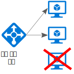
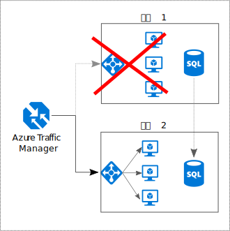

# 모두 중복으로 구성

## 단일 실패 지점을 피하도록 응용 프로그램에 중복성을 구축합니다.

복원력 있는 응용 프로그램은 장애가 발생해도 라우팅됩니다. 응용 프로그램에서 중요한 경로를 식별합니다. 경로의 각 지점에 중복성이 있나요? 하위 시스템에 오류가 발생하면 응용 프로그램이 장애 조치(Failover)되나요?

## 권장 사항 

**비즈니스 요구 사항 고려**. 시스템에 기본 제공되는 중복성 수준은 비용 및 복잡성에 영향을 미칠 수 있습니다. RTO(복구 시간 목표)와 같은 비즈니스 요구 사항이 아키텍처에 전달되어야 합니다. 예를 들어 다중 지역 배포는 단일 지역 배포보다 비용이 더 많이 들며, 관리하기가 좀 더 복잡합니다. 장애 조치(Failover) 및 장애 복구(Failback)를 처리하기 위한 운영 절차가 필요합니다. 추가적인 비용 및 복잡성이 타당한 비즈니스 시나리오도 있고 그렇지 않은 경우도 있습니다.

**부하 분산 장치 뒤에 VM 배치** 중요한 워크로드에 단일 VM을 사용하지 마세요. 대신, 부하 분산 장치 뒤에 여러 VM을 배치합니다. VM를 사용할 수 없는 경우 부하 분산 장치는 나머지 정상 VM에 트래픽을 분산합니다. 이 구성을 배포하는 방법을 알아보려면 [확장성 및 가용성을 위한 다중 VM][multi-vm-blueprint]을 참조하세요.

**데이터베이스 복제** Azure SQL Database 및 Cosmos DB는 지역 내에 데이터를 자동으로 복제하고 여러 지역에 걸쳐 지리적 복제를 사용하도록 설정할 수 있습니다. IaaS 데이터베이스 솔루션을 사용하는 경우 복제 및 장애 조치(Failover)를 지원하는 솔루션(예: [SQL Server Always On 가용성 그룹][sql-always-on])을 선택합니다. 

**지리적 복제 사용** [Azure SQL Database][sql-geo-replication] 및 [Cosmos DB][docdb-geo-replication]에 대한 지리적 복제는 하나 이상의 보조 지역에 읽기 가능한 데이터 보조 복제본을 만듭니다. 중단이 발생할 경우 데이터베이스는 쓰기 작업을 위해 보조 지역으로 장애 조치(Failover)될 수 있습니다.

**가용성을 위한 분할** 데이터베이스 분할은 확장성을 높이기 위해 자주 사용되지만 가용성을 높이는 결과도 가져올 수 있습니다. 하나의 분할된 데이터베이스가 다운되면 다른 분할된 데이터베이스에 계속 연결할 수 있습니다. 하나의 분할된 데이터베이스가 실패하는 경우 총 트랜잭션의 일부만 중단됩니다. 

**둘 이상의 지역에 배포** 최대 가용성을 위해 응용 프로그램을 둘 이상의 지역에 배포합니다. 이와 같이, 전체 지역에 문제가 발생하는 드문 경우, 응용 프로그램은 다른 지역으로 장애 조치(Failover)될 수 있습니다. 다음 다이어그램에서는 Azure Traffic Manager를 사용하여 장애 조치(Failover)를 처리하는 다중 지역 응용 프로그램을 보여 줍니다.

**프런트 엔드 및 백 엔드 장애 조치(Failover) 동기화**. Azure Traffic Manager를 사용하여 프런트 엔드를 장애 조치(Failover)합니다. 한 지역에서 프런트 엔드에 연결할 수 없는 경우, Traffic Manager는 새 요청을 보조 지역으로 라우팅합니다. 데이터베이스 솔루션에 따라, 데이터베이스 장애 조치(Failover)를 조정해야 할 수 있습니다. 

**자동 장애 조치(Failover)와 수동 장애 복구(Failback) 사용**. Traffic Manager를 자동 장애 조치(Failover)에만 사용하고 자동 장애 복구(Failback)에는 사용하지 않습니다. 자동 장애 복구(Failback)는 해당 지역이 완전히 정상 상태가 되기 전에 주 지역으로 전환될 수도 있는 위험을 수반합니다. 대신, 수동 장애 복구(Failback) 전에 모든 응용 프로그램 하위 시스템이 정상 상태인지 확인합니다. 또한 데이터베이스에 따라, 장애 복구(Failback) 전에 데이터 일관성을 확인해야 할 수 있습니다.

**Traffic Manager에 대한 중복성 포함**. Traffic Manager는 오류가 발생할 수 있는 지점입니다. Traffic Manager SLA를 검토하고 Traffic Manager만 사용하는 것이 고가용성을 위한 비즈니스 요구 사항을 충족하는지 확인합니다. 그렇지 않은 경우 다른 트래픽 관리 솔루션을 장애 복구(Failback)로 추가합니다. Azure Traffic Manager 서비스가 실패하면 다른 트래픽 관리 서비스를 가리키도록 DNS의 CNAME 레코드를 변경합니다.

<!-- links -->

[multi-vm-blueprint]: ../../reference-architectures/virtual-machines-windows/multi-vm.md

[cassandra]: http://cassandra.apache.org/
[docdb-geo-replication]: /azure/documentdb/documentdb-distribute-data-globally
[sql-always-on]: https://msdn.microsoft.com/library/hh510230.aspx
[sql-geo-replication]: /azure/sql-database/sql-database-geo-replication-overview
