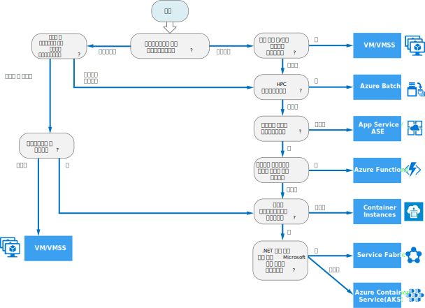

# Azure 계산 서비스에 대한 의사 결정 트리

Azure는 응용 프로그램 코드를 호스트하는 다양한 방법을 제공합니다. *계산*이라는 용어는 응용 프로그램이 실행되는 계산 리소스의 호스팅 모델을 말합니다. 다음 순서도는 응용 프로그램에 대한 계산 서비스를 선택하는 데 도움이 됩니다. 순서도는 권장 사항에 연결할 주요 의사 결정 기준의 집합을 안내합니다. 

**이 순서도를 시작점으로 처리합니다.** 모든 응용 프로그램에는 고유한 요구 사항이 있으므로 권장 사항을 시작점으로 처리합니다. 그런 다음, 다음과 같은 측면을 살펴보는 보다 자세한 평가를 수행합니다.
 
- 기능 집합
- [서비스 한도](/azure/azure-subscription-service-limits)
- [비용](https://azure.microsoft.com/pricing/)
- [SLA](https://azure.microsoft.com/support/legal/sla/)
- [국가별 가용성](https://azure.microsoft.com/global-infrastructure/services/)
- 개발자 에코시스템 및 팀 기술
- [계산 비교 표](./compute-comparison.md)

응용 프로그램이 여러 워크로드로 구성된 경우 각 워크로드를 개별적으로 평가합니다. 완벽한 솔루션은 두 개 이상의 계산 서비스를 통합할 수 있습니다.

## 순서도

## 정의

- **그린필드**는 완전히 새롭고 처음부터 빌드된 소프트웨어 프로젝트를 설명합니다. 레거시 코드는 포함되지 않습니다. 

- **브라운필드**는 기존 응용 프로그램을 기반으로 하는 소프트웨어 프로젝트를 설명합니다. 레거시 코드 또는 프레임워크를 상속할 수 있습니다.

- **리프트 앤 시프트**는 응용 프로그램을 다시 디자인하거나 코드를 변경하지 않고 워크로드를 클라우드로 마이그레이션하는 전략입니다. *재 호스팅*이라고도 합니다. 자세한 내용은 [Azure 마이그레이션 센터](https://azure.microsoft.com/migration/)를 참조하세요.

- **클라우드 최적화**는 클라우드 고유 기능 및 성능을 활용하도록 응용 프로그램을 리팩터링하여 클라우드로 마이그레이션하는 전략입니다.

## 다음 단계

고려해야 할 추가 기준은 [Azure 계산 서비스를 선택하기 위한 조건](./compute-comparison.md)을 참조하세요.
