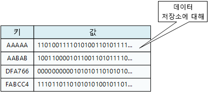
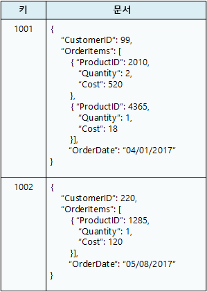
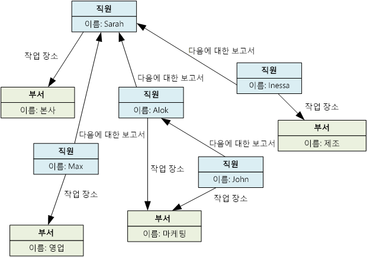

# 적절한 데이터 저장소 선택

최신 비즈니스 시스템은 점점 더 많은 양의 데이터를 관리합니다. 데이터는 외부 서비스에서 수집되거나 시스템 자체에서 생성되거나 사용자가 만들 수 있습니다. 이러한 데이터 집합은 매우 다양한 특성 및 처리 요구 사항이 있을 수 있습니다. 기업에서는 데이터를 사용하여 추세를 평가하고, 비즈니스 프로세스를 트리거하며, 해당 작업을 감사하고, 고객 행동을 분석하는 등의 작업을 수행합니다. 

그러므로 단일 데이터 저장소가 일반적으로 모든 경우에 최선의 방법이 될 수는 없습니다. 대신 서로 다른 유형의 데이터를 서로 다른 데이터 저장소에 저장하는 것이 좋습니다. 각 데이터 저장소는 특정 워크로드 또는 사용 패턴에 중점을 둡니다. *polyglot 지속성*이라는 용어는 데이터 저장소 기술을 혼합하여 사용하는 솔루션을 설명하는 데 사용됩니다.

요구 사항에 적합한 데이터 저장소를 선택하는 것이 디자인 결정의 핵심입니다. SQL과 NoSQL 데이터베이스 중에서 선택할 수 있는 구현에는 문자 그대로 수백 가지가 있습니다. 데이터 저장소는 데이터 구조화 방법과 지원하는 작업 유형에 따라 분류됩니다. 이 문서에서는 가장 일반적인 여러 저장소 모델에 대해 설명합니다. 특정 데이터 저장소 기술에서 여러 저장소 모델을 지원할 수 있습니다. 예를 들어 RDBMS(관계형 데이터베이스 관리 시스템)는 키/값 또는 그래프 저장을 지원할 수 있습니다. 사실, 단일 데이터베이스 시스템이 여러 모델을 지원하는 소위 *다중 모델* 지원이 일반적인 추세입니다. 그러나 다양한 모델을 개략적으로 이해하는 것은 여전히 유용합니다. 

특정 범주의 모든 데이터 저장소가 동일한 기능을 제공하는 것은 아닙니다. 대부분의 데이터 저장소는 데이터를 쿼리하고 처리하기 위한 서버 쪽 기능을 제공합니다. 경우에 따라 이 기능은 데이터 저장소 엔진에 기본 제공되어 있습니다. 또는 데이터 저장 및 처리 기능이 분리되어 처리 및 분석을 위한 몇 가지 옵션이 있을 수도 있습니다. 또한 데이터 저장소는 다양한 프로그래밍 및 관리 인터페이스를 지원합니다. 

일반적으로 요구 사항에 가장 적합한 저장소 모델을 고려하여 시작해야 합니다. 그런 다음 기능 집합, 비용 및 관리 용이성과 같은 요소를 기반으로 해당 범주 내의 특정 데이터 저장소를 고려합니다.

## 관계형 데이터베이스 관리 시스템

관계형 데이터베이스는 행과 열이 있는 일련의 2차원 테이블로 데이터를 구성합니다. 각 테이블에는 고유한 열이 있으며 테이블의 모든 행에는 동일한 열 집합이 있습니다. 이 모델은 수학에 기반을 두고 있으며 대부분의 공급업체는 데이터 검색 및 관리를 위해 SQL(구조적 쿼리 언어) 언어를 제공합니다. RDBMS는 일반적으로 정보 업데이트를 위해 ACID(원자성, 일관성, 격리, 영속성) 모델을 준수하는 트랜잭션 방식으로 일관된 메커니즘을 구현합니다. 

RDBMS는 일반적으로 데이터 구조가 미리 정의되고 모든 읽기 또는 쓰기 작업이 스키마를 사용해야 하는 스키마 온 라이트(schema-on-write) 모델을 지원합니다. 이 모델은 대부분의 NoSQL 데이터 저장소, 특히 키/값 유형과 대조됩니다. 스키마 온 리드(schema-on-read) 모델은 클라이언트가 데이터베이스에서 가져오는 데이터에 자체 해석 스키마를 부과하고, 쓰여지는 데이터 형식에 대해 제약 없는 것으로 가정합니다.

RDBMS는 강력한 일관성 보장이 중요한 경우 매우 유용합니다. 모든 변경 사항은 원자성이며 트랜잭션은 항상 데이터를 일관된 상태로 유지합니다. 그러나 기본 구조는 저장소를 분산하고 여러 컴퓨터에서 처리하여 확장하지 않습니다. 또한 RDBMS에 저장되는 정보는 정규화 프로세스를 수행하여 관계형 구조로 구성되어야 합니다. 이 프로세스는 이해하기 쉽지만 논리적 엔터티를 별도의 테이블 행으로 디스어셈블한 다음 쿼리를 실행할 때 데이터를 다시 어셈블해야 하므로 비효율적일 수 있습니다. 

관련 Azure 서비스: 

- [Azure SQL Database][sql-db]
- [Azure Database for MySQL][mysql]
- [Azure Database for PostgreSQL][postgres]

## 키/값 저장소

키/값 저장소는 기본적으로 큰 해시 테이블입니다. 각 데이터 값을 고유한 키와 연결하고 키/값 저장소는 이 키를 사용하여 적절한 해시 알고리즘을 통해 데이터를 저장합니다. 해시 알고리즘은 데이터 저장소 전반에 해시 키가 균등하게 분산되도록 하기 위해 선택됩니다. 

대부분의 키/값 저장소는 간단한 쿼리, 삽입 및 삭제 작업만 지원합니다. 값을 수정(부분적으로 또는 완전히)하려면 응용 프로그램이 전체 값에 대해 기존 데이터를 덮어써야 합니다. 대부분의 구현에서 단일 값 읽기 또는 쓰기는 원자성 작업입니다. 값이 클 경우 쓸 때 약간의 시간이 걸릴 수 있습니다. 

응용 프로그램은 임의의 데이터를 값 집합으로 저장할 수 있지만 일부 키/값 저장소는 값의 최대 크기를 제한합니다. 저장된 값은 저장소 시스템 소프트웨어에 불투명합니다. 모든 스키마 정보는 응용 프로그램에서 제공하고 해석해야 합니다. 본질적으로 값은 BLOB이며 키/값 저장소는 키로 값을 검색하거나 저장합니다. 

키/값 저장소는 간단한 조회를 수행하는 응용 프로그램에 대해 매우 최적화되어 있지만 다른 키/값 저장소에서 데이터를 쿼리해야 하는 시스템에는 적합하지 않습니다. 키/값 저장소는 키에 따라서만 조회를 수행하는 것이 아니라 값별 쿼리가 중요한 시나리오에 대해서도 최적화되어 있지 않습니다. 예를 들어, 관계형 데이터베이스의 경우 WHERE 절을 사용하여 레코드를 찾을 수 있지만 키/값 저장소에는 일반적으로 값에 대해 이러한 유형의 조회 기능이 없습니다.

단일 키/값 저장소는 별도의 컴퓨터에 있는 여러 노드에 데이터를 쉽게 배포할 수 있으므로 확장성이 매우 뛰어납니다. 

관련 Azure 서비스: 

- [Cosmos DB][cosmosdb]
- [Azure Redis Cache][redis-cache]

## 문서 데이터베이스

문서 데이터베이스는 개념적으로 키/값 저장소와 비슷하지만 명명된 필드 및 데이터의 모음(문서)을 저장하며 각각 간단한 스칼라 항목이나 목록 및 하위 모음과 같은 복합 요소가 될 수 있다는 점이 다릅니다. 문서 필드의 데이터는 XML, YAML, JSON, BSON을 비롯한 다양한 방법으로 인코딩되거나 일반 텍스트로 저장될 수도 있습니다. 키/값 저장소와 달리 문서의 필드는 저장소 관리 시스템에 표시되므로 응용 프로그램에서 이러한 필드의 값을 사용하여 데이터를 쿼리하고 필터링할 수 있습니다. 

일반적으로 문서에는 엔터티의 전체 데이터가 포함됩니다. 엔터티를 구성하는 항목은 응용 프로그램에 따라 다릅니다. 예를 들어, 엔터티에는 고객의 세부 정보, 주문 또는 이 두 정보의 조합을 포함할 수 있습니다. RDBMS의 여러 관계형 테이블에 분산된 정보가 단일 문서에 포함될 수도 있습니다. 

문서 저장소의 모든 문서가 동일한 구조를 가질 필요는 없습니다. 이 자유 형식 접근 방식은 많은 유연성을 제공합니다. 비즈니스 요구 사항이 변경될 경우 응용 프로그램은 문서에 다른 데이터를 저장할 수 있습니다.

응용 프로그램은 문서 키를 사용하여 문서를 검색할 수 있습니다. 문서 키란 데이터를 균등하게 분산하는 데 사용되는 문서의 고유 식별자로서 종종 해시됩니다. 일부 문서 데이터베이스는 자동으로 문서 키를 만듭니다. 다른 문서 데이터베이스에서는 키로 사용할 문서의 특성을 사용자가 지정할 수 있습니다. 응용 프로그램은 하나 이상의 필드 값을 기반으로 문서를 쿼리할 수도 있습니다. 일부 문서 데이터베이스는 하나 이상의 인덱싱된 필드를 기반으로 문서를 빠르게 조회할 수 있도록 인덱싱을 지원합니다. 

많은 문서 데이터베이스에서는 응용 프로그램에서 전체 문서를 다시 작성하지 않고도 문서의 특정 필드 값을 수정할 수 있는 내부 업데이트를 지원합니다. 단일 문서의 여러 필드에 대한 읽기 및 쓰기 작업은 일반적으로 원자성입니다.

관련 Azure 서비스: [Cosmos DB][cosmosdb]

## 그래프 데이터베이스

그래프 데이터베이스는 노드와 에지, 두 가지 유형의 정보를 저장합니다. 노드는 엔터티로 생각할 수 있습니다. 에지는 노드 간의 관계를 지정합니다. 노드와 에지 모두 테이블의 열과 마찬가지로 해당 노드 또는 에지에 대한 정보를 제공하는 속성을 가질 수 있습니다. 에지는 또한 관계의 특성을 나타내는 방향을 가질 수 있습니다.

그래프 데이터베이스의 목적은 응용 프로그램이 노드와 에지의 네트워크를 트래버스하는 쿼리를 효율적으로 수행하고 엔터티 간의 관계를 분석할 수 있게 하는 것입니다. 다음 다이어그램은 그래프로 구성된 조직의 인사 데이터베이스를 보여 줍니다. 엔터티는 직원 및 부서이며, 에지는 보고 관계 및 직원이 근무하는 부서를 나타냅니다. 이 그래프에서 에지의 화살표는 관계 방향을 나타냅니다.
 

이 구조를 통해 "Sarah에게 직접 또는 간접적으로 보고하는 모든 직원 찾기" 또는 "John과 같은 부서에서 근무하는 직원"과 같은 쿼리를 간단하게 수행할 수 있습니다. 엔터티와 관계가 많은 대형 그래프의 경우 매우 복잡한 분석을 매우 신속하게 수행할 수 있습니다. 많은 그래프 데이터베이스는 관계 네트워크를 효율적으로 트래버스하는 데 사용할 수 있는 쿼리 언어를 제공합니다. 

관련 Azure 서비스: [Cosmos DB][cosmosdb]

## 열 패밀리 데이터베이스

열 패밀리 데이터베이스는 데이터를 행과 열로 구성합니다. 가장 간단한 형태인 열 패밀리 데이터베이스는 적어도 개념적으로 관계형 데이터베이스와 매우 유사하게 보일 수 있습니다. 열 패밀리 데이터베이스의 이점은 스파스 데이터를 구조화하기 위한 비정규화된 접근법에 있습니다. 

열 패밀리 데이터베이스는 행과 열이 있는 표 형식 데이터로 생각할 수 있지만 열은 *열 패밀리*라는 그룹으로 나뉩니다. 각 열 패밀리는 논리적으로 관련되어 있고 일반적으로 하나의 단위로 검색되거나 조작되는 열 집합을 보유합니다. 개별적으로 액세스되는 다른 데이터는 별도의 열 패밀리에 저장할 수 있습니다. 열 패밀리 내에서 새 열을 동적으로 추가할 수 있고 행은 스파스될 수 있습니다. 즉, 행은 모든 열에 대해 값을 가질 필요가 없습니다.

다음 다이어그램은 `Identity` 및 `Contact Info`의 두 열 패밀리가 있는 예를 보여 줍니다. 단일 엔터티의 데이터에는 각 열 패밀리에서 동일한 행 키가 있습니다. 열 패밀리의 특정 개체에 대한 행이 동적으로 달라질 수 있는 이 구조는 열 패밀리 접근 방식의 중요한 이점이므로 이 데이터 저장소 형식은 구조화된 휘발성 데이터를 저장하는 데 매우 적합합니다.

 

키/값 저장소 또는 문서 데이터베이스와 달리 대부분의 열 패밀리 데이터베이스는 해시를 계산하지 않고 키 순서로 데이터를 저장합니다. 많은 구현을 통해 열 패밀리의 특정 열에 대한 인덱스를 만들 수 있습니다. 인덱스를 사용하면 행 키가 아닌 열 값으로 데이터를 검색할 수 있습니다.

행에 대한 읽기 및 쓰기 작업은 일반적으로 단일 열 패밀리에 대해 원자성이지만 일부 구현은 여러 열 패밀리에 걸쳐 전체 행에 원자성을 제공합니다.

관련 Azure 서비스: [HDInsight의 HBase][hbase]

## 데이터 분석

데이터 분석 저장소는 데이터 수집, 저장 및 분석을 위한 대규모 병렬 솔루션을 제공합니다. 이 데이터는 공유 안 함(share-nothing) 아키텍처를 사용하여 여러 서버에 분산되어 확장성을 최대화하고 종속성을 최소화합니다. 데이터는 정적일 가능성이 낮기 때문에 이러한 저장소는 여러 스트림에서 다양한 형식으로 도착하는 대량의 정보를 처리하면서 새로운 쿼리를 계속 처리할 수 있어야 합니다. 

관련 Azure 서비스:

- [SQL Data Warehouse][sql-dw]
- [Azure Data Lake][data-lake]

## 검색 엔진 데이터베이스  

검색 엔진 데이터베이스는 외부 데이터 저장소 및 서비스에 보관된 정보를 검색하는 기능을 지원합니다. 검색 엔진 데이터베이스를 사용하면 대용량 데이터를 인덱싱하고 이러한 인덱스에 거의 실시간으로 액세스할 수 있습니다. 검색 엔진 데이터베이스는 일반적으로 웹과 동의어로 간주되지만 많은 대규모 시스템에서 이를 사용하여 자체 데이터베이스 위에 구조화된 임시 검색 기능을 제공합니다.

검색 엔진 데이터베이스의 주요 특징은 정보를 매우 신속하게 저장 및 인덱싱하고 검색 요청에 대해 빠른 응답 시간을 제공할 수 있다는 것입니다. 인덱스는 다차원적일 수 있으며 많은 양의 텍스트 데이터에서 자유 텍스트 검색을 지원할 수 있습니다. 인덱싱은 검색 엔진 데이터베이스에 의해 트리거되는 끌어오기 모델을 사용하거나 외부 응용 프로그램 코드에 의해 시작되는 밀어넣기 모델을 사용하여 수행할 수 있습니다. 

검색은 정확한 항목 또는 유사 항목을 찾을 수 있습니다. 유사 항목 검색은 용어 집합과 일치하는 문서를 찾고 일치하는 정도를 계산합니다. 일부 검색 엔진은 동의어, 장르 확장(예: `dogs` 및 `pets` 일치) 및 형태소 분석(동일한 어근일 경우 일치하는 단어로 판단)을 기반으로 일치 항목을 반환할 수 있는 언어 분석도 지원합니다. 

관련 Azure 서비스: [Azure Search][search]

## 시계열 데이터베이스

시계열 데이터는 시간별로 구성된 값 집합이며 시계열 데이터베이스는 이러한 유형의 데이터에 대해 최적화된 데이터베이스입니다. 시계열 데이터베이스는 대개 여러 소스에서 대량의 데이터를 실시간으로 수집하기 때문에 매우 많은 쓰기를 지원해야 합니다. 업데이트는 거의 발생하지 않으며 삭제는 종종 대량 작업으로 수행됩니다. 시계열 데이터베이스에 기록된 레코드는 일반적으로 작지만 레코드 수가 많아 전체 데이터 크기가 빠르게 커지는 경우가 종종 있습니다.

시계열 데이터베이스는 원격 분석 데이터를 저장하는 데 적합합니다. 시나리오에는 IoT 센서 또는 응용 프로그램/시스템 카운터가 포함됩니다.

관련 Azure 서비스: [Time Series Insights][time-series]

## 개체 저장소  

개체 저장소는 대형 이진 개체(이미지, 파일, 비디오 및 오디오 스트림, 대형 응용 프로그램 데이터 개체 및 문서, 가상 머신 디스크 이미지)를 저장하고 검색하는 데 최적화되어 있습니다. 이러한 저장소 유형의 개체는 저장된 데이터, 일부 메타데이터 및 개체에 액세스하기 위한 고유한 ID로 구성됩니다. 개체 저장소를 사용하면 매우 많은 양의 구조화되지 않은 데이터를 관리할 수 있습니다.  

관련 Azure 서비스: [Blob Storage][blob]

## 공유된 파일   

때로는 간단한 플랫 파일을 사용하는 것이 정보를 저장하고 검색하는 가장 효과적인 방법이 될 수 있습니다. 파일 공유를 사용하면 네트워크를 통해 파일에 액세스할 수 있습니다. 적절한 보안 및 동시 액세스 제어 메커니즘이 제공되면 이러한 방식으로 데이터를 공유하여, 분산 서비스를 통해 단순 읽기 및 쓰기 요청과 같은 기본, 저수준 작업을 수행하기 위한 확장성이 뛰어난 데이터 액세스를 제공할 수 있습니다.

관련 Azure 서비스: [File Storage][file-storage]

<!-- links -->

[blob]: https://azure.microsoft.com/services/storage/blobs/
[cosmosdb]: https://azure.microsoft.com/services/cosmos-db/
[data-lake]: https://azure.microsoft.com/solutions/data-lake/
[file-storage]: https://azure.microsoft.com/services/storage/files/
[hbase]: /azure/hdinsight/hdinsight-hbase-overview
[mysql]: https://azure.microsoft.com/services/mysql/
[postgres]: https://azure.microsoft.com/services/postgresql/
[redis-cache]: https://azure.microsoft.com/services/cache/
[search]: https://azure.microsoft.com/services/search/
[sql-db]: https://azure.microsoft.com/services/sql-database
[sql-dw]: https://azure.microsoft.com/services/sql-data-warehouse/
[time-series]: https://azure.microsoft.com/services/time-series-insights/