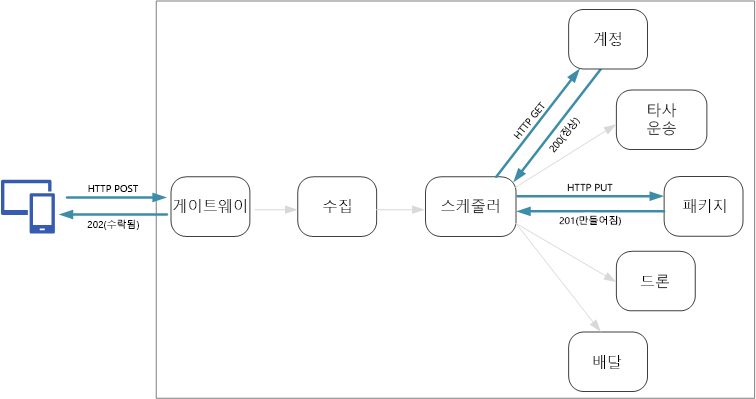
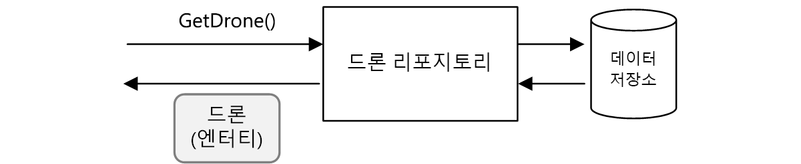
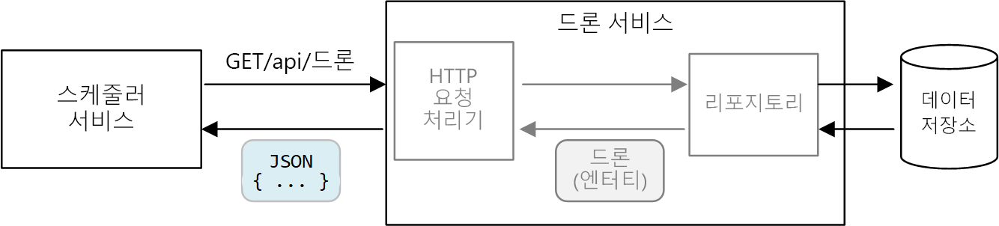
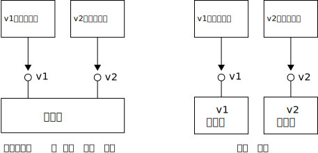

# <a name="designing-microservices-api-design"></a>마이크로 서비스 디자인: API 디자인

서비스 간의 모든 데이터 교환은 메시지 또는 API 호출을 통해 발생하므로 마이크로 서비스 아키텍처에서 좋은 API 디자인은 중요합니다. API는 [번잡한 I/O](../antipatterns/chatty-io/index.md) 만들기를 방지하는 데 효율적이어야 합니다. 서비스는 독립적으로 작업하는 팀에서 디자인되므로 업데이트가 다른 서비스를 중단하지 않도록 API에는 잘 정의된 의미 체계 및 버전 지정 체계가 있어야 합니다.



두 가지 유형의 API를 구분하는 것은 중요합니다.

- 클라이언트 응용 프로그램을 호출하는 공용 API 
- 서비스 간 통신에 사용되는 백 엔드 API

이러한 두 가지 사용 사례에는 약간 다른 요구 사항이 있습니다. 공용 API는 클라이언트 응용 프로그램, 일반적으로 브라우저 응용 프로그램 또는 네이티브 모바일 응용 프로그램과 호환되어야 합니다. 대부분의 경우 공용 API가 HTTP를 통해 공용 REST를 사용하는 것을 의미합니다. 그러나 백 엔드 API의 경우 네트워크 성능을 고려해야 합니다. 서비스의 세분성에 따라 서비스 간 통신은 많은 네트워크 트래픽을 발생시킬 수 있습니다. 서비스는 빠르게 I/O 바인딩될 수 있습니다. 이런 이유로 serialization 속도 및 페이로드 크기와 같은 고려 사항은 더욱 중요해집니다. HTTP를 통한 REST 사용에 대한 인기 있는 몇 가지 대안에는 gRPC, Apache Avro 및 Apache Thrift가 있습니다. 이러한 프로토콜은 이진 serialization을 지원하고 일반적으로 HTTP보다 더 효율적입니다.

## <a name="considerations"></a>고려 사항

API를 구현하는 방법을 선택할 때 고려할 몇 가지 사항은 다음과 같습니다.

**REST 및 RPC** REST 스타일 인터페이스와 RPC 스타일 인터페이스 사용 간의 장단점을 고려합니다.

- 자연스러운 방법이 될 수 있는 REST 모델 리소스는 도메인 모델을 표현합니다. 진화 능력을 장려하는 HTTP 동사에 따라 일관된 인터페이스를 정의합니다. 멱등성, 부작용 및 응답 코드 면에서 잘 정의된 의미 체계를 가지고 있습니다. 또한 확장성을 개선하는 상태 비저장 통신을 적용합니다. 

- RPC는 작업 또는 명령을 더 지향합니다. RPC 인터페이스는 로컬 메서드 호출과 같기 때문에 지나치게 번잡한 API를 디자인하게 될 수 있습니다. 그러나 RPC가 번잡해야 함을 의미하지 않습니다. 단지 인터페이스를 디자인할 때 주의해야 함을 의미합니다.

RESTful 인터페이스의 경우 가장 일반적인 선택은 JSON을 사용하는 HTTP를 통한 REST입니다. RPC 스타일 인터페이스의 경우 gRPC, Apache Avro 및 Apache Thrift 등의 여러 인기 있는 프레임워크가 있습니다.

**효율성** 속도, 메모리 및 페이로드 크기 측면에서 효율성을 고려합니다. 일반적으로 gRPC 기반 인터페이스는 HTTP를 통한 REST보다 빠릅니다.

**IDL(인터페이스 정의 언어)** IDL은 메서드, 매개 변수 및 API의 반환 값을 정의하는 데 사용됩니다. IDL은 클라이언트 코드, serialization 코드 및 API 설명서를 생성하는 데 사용될 수 있습니다. IDL은 또한 Postman과 같은 API 테스트 도구로 사용될 수도 있습니다. gRPC, Avro 및 Thrift 등의 프레임워크는 자체 IDL 사양을 정의합니다. HTTP를 통한 REST는 표준 IDL 형식을 갖지 않지만 일반적인 선택은 OpenAPI(이전의 Swagger)입니다. 또한 형식 정의 언어를 사용하지 않고 HTTP REST API를 만들 수도 있지만 코드 생성 및 테스트의 이점을 손실합니다.

**직렬화** 개체는 연결을 통해 어떻게 직렬화되나요? 옵션으로는 텍스트 기반 형식(주로 JSON) 및 프로토콜 버퍼와 같은 이진 형식이 있습니다. 이진 형식은 일반적으로 텍스트 기반 형식보다 빠릅니다. 그러나 대부분의 언어 및 프레임워크는 JSON serialization을 지원하므로 JSON은 상호 운용성 면에서도 이점을 갖습니다. 일부 serialization 형식은 고정된 스키마가 필요하고 일부는 스키마 정의 파일 컴파일이 필요합니다. 이 경우 이 단계를 빌드 프로세스로 통합해야 합니다. 

**프레임워크 및 언어 지원** HTTP는 거의 모든 프레임워크와 언어에서 지원됩니다. gRPC, Avro 및 Thrift 모두는 C++, C#, Java 및 Python에 대한 라이브러리를 갖습니다. Thrift 및 gRPC도 Go를 지원합니다. 

**호환성 및 상호 운용성** gRPC와 같은 프로토콜을 선택하는 경우 공용 API와 백 엔드 간에 프로토콜 변환 계층이 필요할 수 있습니다. [게이트웨이](./gateway.md)는 해당 기능을 수행할 수 있습니다. 서비스 메시를 사용하는 경우 서비스 메시와 호환되는 프로토콜을 고려합니다. 예를 들어 linkerd는 HTTP, Thrift 및 gRPC를 기본적으로 지원합니다. 

초기 권장 사항은 이진 프로토콜의 성능 이점이 필요한 경우가 아니면 HTTP를 통한 REST를 선택하는 것입니다. HTTP를 통한 REST에는 특수 라이브러리가 필요하지 않습니다. 호출자는 서비스와 통신하는 클라이언트 스텁이 필요하지 않으므로 최소 결합을 만듭니다. 스키마 정의, 테스트 및 RESTful HTTP 엔드포인트의 모니터링을 지원하는 도구의 풍부한 에코 시스템이 있습니다. 마지막으로 HTTP는 브라우저 클라이언트와 호환되므로 클라이언트와 백 엔드 간에 프로토콜 변환 계층이 필요하지 않습니다. 

그러나 HTTP를 통한 REST를 선택하는 경우 시나리오에 적절하게 수행하는지 여부를 확인하도록 개발 프로세스 초기에 성능 및 부하 테스트를 수행해야 합니다.

## <a name="restful-api-design"></a>RESTful API 디자인

RESTful API를 디자인하기 위한 여러 리소스가 있습니다. 다음은 도움이 될 수 있는 것입니다.

- [API 디자인](../best-practices/api-design.md) 

- [API 구현](../best-practices/api-implementation.md) 

- [Microsoft REST API 지침](https://github.com/Microsoft/api-guidelines)

다음은 염두에 두어야 할 몇 가지 특정 고려 사항입니다.

- 내부 구현 세부 정보를 누출하거나 단순히 내부 데이터베이스 스키마를 반영하는 API를 주의하세요. API는 도메인을 모델링해야 합니다. 서비스 간의 계약이며 이상적으로 일부 코드를 리팩터링했거나 데이터베이스 테이블을 정규화했기 때문이 아니라 새 기능이 추가되었을 때만 변경해야 합니다. 

- 모바일 응용 프로그램 및 데스크톱 웹 브라우저와 같은 다양한 유형의 클라이언트에는 다른 페이로드 크기 또는 상호 작용 패턴이 필요할 수 있습니다. 해당 클라이언트에 대한 최적의 인터페이스를 노출하는 각 클라이언트에 대한 별도 백 엔드를 만드는 데 [프런트 엔드에 대한 백 엔드 패턴](../patterns/backends-for-frontends.md)을 사용하는 것이 좋습니다.

- 부작용이 있는 작업의 경우 멱등원이 되도록 하고 PUT 메서드로 구현하는 것이 좋습니다. 안전한 재시도를 활성화하고 탄력성을 향상시킬 수 있습니다. [수집 및 워크플로](./ingestion-workflow.md#idempotent-vs-non-idempotent-operations)와 [서비스 간 통신](./interservice-communication.md) 챕터는 이 문제를 자세히 설명합니다.

- HTTP 메서드는 메서드가 응답을 즉시 반환하지만 서비스가 작업을 비동기적으로 수행하는 비동기 의미 체계를 가질 수 있습니다. 이 경우 메서드는 [HTTP 202](https://www.w3.org/Protocols/rfc2616/rfc2616-sec10.html) 응답 코드를 반환해야 합니다. 이는 요청이 처리를 위해 허용되었지만 처리가 아직 완료되지 않음을 나타냅니다.

## <a name="mapping-rest-to-ddd-patterns"></a>DDD 패턴에 REST 매핑

엔터티, 집계 및 값 개체와 같은 패턴은 도메인 모델의 개체에 특정 제약 조건을 넣도록 디자인되었습니다. DDD에 대한 많은 논의에서 패턴은 생성자 또는 속성 getter 및 setter와 같은 OO(개체 지향) 언어 개념을 사용하여 모델링됩니다. 예를 들어 *값 개체*는 변경이 불가능해야 합니다. OO 프로그래밍 언어에서는 생성자에 값을 할당하고 속성을 읽기 전용으로 설정하여 적용합니다.

```ts
export class Location {
    readonly latitude: number;
    readonly longitude: number;

    constructor(latitude: number, longitude: number) {
        if (latitude < -90 || latitude > 90) {
            throw new RangeError('latitude must be between -90 and 90');
        }
        if (longitude < -180 || longitude > 180) {
            throw new RangeError('longitude must be between -180 and 180');
        }
        this.latitude = latitude;
        this.longitude = longitude;
    }
}
```

이러한 종류의 코딩 방법은 기존 모놀리식 응용 프로그램을 빌드하는 경우에 특히 중요합니다. 큰 코드 베이스와 함께 많은 하위 시스템은 `Location` 개체를 사용할 수 있으므로 개체에 대해 올바른 동작을 적용하는 것은 중요합니다. 

또 다른 예로 다른 부분의 응용 프로그램이 데이터 저장소에 대해 직접 읽거나 쓰지 않도록 하는 리포지토리 패턴이 있습니다.



그러나 마이크로 서비스 아키텍처에서 서비스는 동일한 코드 베이스를 공유하지 않고 데이터 저장소를 공유하지 않습니다. 대신 API를 통해 통신합니다. Scheduler 서비스가 드론 서비스에서 드론에 대한 정보를 요청하는 경우를 고려합니다. 드론 서비스에는 코드를 통해 표시되는 드론의 내부 모델이 있습니다. 하지만 Scheduler는 이를 참조하지 않습니다. 대신 드론 엔터티의 *표현* &mdash; 아마도 HTTP 응답에서 JSON 개체를 다시 가져옵니다.



Scheduler 서비스는 드론 서비스의 내부 모델을 수정하거나 드론 서비스의 데이터 저장소에 작성할 수 없습니다. 즉, 드론 서비스를 구현하는 코드에는 기존 모놀리스의 코드와 비교하여 더 작은 노출된 노출 영역이 있습니다. 드론 서비스가 Location 클래스를 정의하는 경우 해당 클래스의 범위는 제한됩니다. &mdash; 다른 서비스는 클래스를 직접 사용하지 않습니다. 

이러한 이유로, 전술적 DDD 패턴과 관련되어 있으므로 이 설명서는 코딩 방법에 많이 집중하지 않습니다. 그러나 사실상 REST API를 통해 많은 DDD 패턴을 모델링할 수도 있습니다. 

예: 

- 집계는 REST에서 *리소스*에 자연스럽게 매핑합니다. 예를 들어 Delivery 집계는 Delivery API로 리소스로 노출되지 않습니다.

- 집계는 일관성 경계입니다. 집계에 대한 작업은 항상 일관성 없는 상태의 집계를 유지해야 합니다. 따라서 클라이언트가 집계의 내부 상태를 조작하도록 허용하는 API를 작성하지 마십시오. 대신 리소스 그룹으로 집계를 노출하는 정교하지 않은 API를 선호합니다.

- 엔터티는 고유한 ID를 가집니다. REST에서 리소스는 URL의 형식으로 고유 식별자를 갖습니다. 엔터티의 도메인 ID에 해당하는 리소스 URL을 만듭니다. URL에서 도메인 ID로의 매핑은 클라이언트에 불투명할 수 있습니다.

- 집계의 자식 엔터티는 루트 엔터티를 탐색하여 도달할 수 있습니다. [HATEOAS](https://en.wikipedia.org/wiki/HATEOAS) 원칙을 따르는 경우 자식 엔터티는 부모 엔터티의 표현에서 링크를 통해 도달될 수 있습니다. 

- 값 개체를 변경할 수 없기 때문에 업데이트는 전체 값 개체를 대체하여 수행됩니다. REST에서 구현은 PUT 또는 PATCH 요청을 통해 업데이트합니다. 

- 리포지토리는 클라이언트가 기본 데이터 저장소의 세부 정보를 추상화하여 컬렉션의 개체를 쿼리, 추가 또는 제거할 수 있도록 합니다. REST에서 컬렉션은 컬렉션을 쿼리하거나 컬렉션에 새 엔터티를 추가하기 위한 메서드를 사용하여 고유한 리소스가 될 수 있습니다.

API를 디자인할 때 도메인 모델을 표현하는 방법, 모델 내의 데이터뿐 아니라 비즈니스 작업 및 데이터에 대한 제약 조건을 고려합니다.

| DDD 개념 | REST 해당 항목 | 예 | 
|-------------|-----------------|---------|
| 집계 | 리소스 | `{ "1":1234, "status":"pending"... }` | 
| ID | URL | `http://delivery-service/deliveries/1` |
| 자식 엔터티 | 링크 | `{ "href": "/deliveries/1/confirmation" }` |
| 업데이트 값 개체 | PUT 또는 PATCH | `PUT http://delivery-service/deliveries/1/dropoff` |
| 리포지토리 | 컬렉션 | `http://delivery-service/deliveries?status=pending` |


## <a name="api-versioning"></a>API 버전 관리

API는 서비스와 클라이언트 또는 해당 서비스의 소비자 간의 계약입니다. API가 변경되는 경우 API, 외부 클라이언트 또는 다른 마이크로 서비스인지 여부에 따라 클라이언트 손상의 위험이 있습니다. 따라서 API 변경 내용의 수를 최소화하는 것이 좋습니다. 대개 기본 구현의 변경 내용은 API에 대한 변경 내용이 필요하지 않습니다. 그러나 실제적으로 일부 시점에서 기존 API를 변경해야 하는 새 기능을 추가하려고 합니다.

가능할 때마다 API 변경 내용을 이전 버전과 호환되도록 합니다. 예를 들어 필드가 해당 위치에 있기를 예상하는 클라이언트를 손상시킬 수 있기 때문에 모델에서 필드를 제거하지 마십시오. 클라이언트는 응답에서 인식하지 않는 모든 필드를 무시해야 하기 때문에 필드 추가는 호환성을 손상시키지 않습니다. 그러나 서비스는 이전 클라이언트가 요청에서 새 필드를 생략하는 경우를 처리해야 합니다. 

API 계약의 버전 관리를 지원합니다. 주요 API 변경 내용을 도입하는 경우 새로운 API 버전을 소개합니다. 이전 버전을 계속해서 지원하고 클라이언트가 호출할 버전을 선택하도록 합니다. 이 작업을 수행하는 몇 가지 방법이 있습니다. 하나는 단순히 동일한 서비스에서 두 버전을 노출하는 것입니다. 다른 옵션은 서비스의 두 버전을 나란히 실행하고 HTTP 라우팅 규칙에 따라 하나 또는 다른 버전에 대한 요청을 라우팅하는 것입니다. 



개발자 시간, 테스트 및 작업 오버헤드 측면에서 여러 버전을 지원하는 데 비용이 듭니다. 따라서 가능한 빨리 이전 버전을 사용할 수 없게 하는 것이 좋습니다. 내부 API의 경우 API를 소유하는 팀은 다른 팀이 새 버전으로 마이그레이션하는 것을 돕도록 함께 작업할 수 있습니다. 이는 팀 간 거버넌스 프로세스를 수행하는 것이 유용한 경우입니다. 외부(공용) API의 경우 특히 타사 또는 네이티브 클라이언트 응용 프로그램에서 API를 사용하는 경우 API 버전을 사용할 수 없도록 하는 것은 더 어려울 수 있습니다. 

서비스 구현이 변경되면 버전으로 변경 내용을 태그하는 것은 유용합니다. 버전은 오류 문제를 해결할 때 중요한 정보를 제공합니다. 근본 원인 분석이 호출된 서비스의 버전을 정확하게 아는 데 매우 유용할 수 있습니다. 서비스 버전에 대해 [의미 체계 버전 관리](https://semver.org/)를 사용하는 것이 좋습니다. 의미 체계 버전 관리는 *MAJOR.MINOR.PATCH* 형식을 사용합니다. 그러나 클라이언트는 부 버전 간에 상당한(하지만 주요하지 않은) 변경 내용이 있는 경우 주 버전 번호 또는 가능한 부 버전으로 API를 선택해야만 합니다. 즉, 클라이언트는 버전 2.1.3을 선택하지 않고 API의 버전 1과 2 사이에서 선택하는 것이 합리적입니다. 해당 수준의 세분성을 허용하는 경우 버전의 환산을 지원해야 하는 위험이 있습니다. 

API 버전 관리에 대한 자세한 내용은 [RESTful 웹 API 버전 관리](../best-practices/api-design.md#versioning-a-restful-web-api)를 참조하세요.

> [!div class="nextstepaction"]
> [수집 및 워크플로](./ingestion-workflow.md)