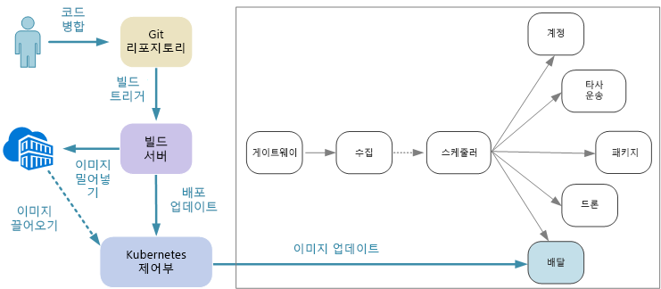
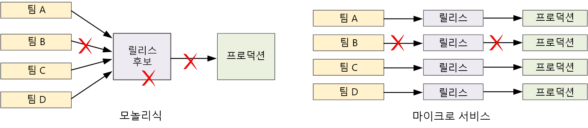

# 마이크로 서비스 디자인: 지속적인 통합Designing microservices: Continuous integration

지속적인 통합 및 지속적인 업데이트(CI/CD)는 마이크로 서비스의 성공 실현을 위한 중요한 요구 사항입니다.Continuous integration and continuous delivery (CI/CD) are a key requirement for achieving success with microservices. 좋은 CI/CD 프로세스 없이 마이크로 서비스가 약속하는 민첩성을 얻지 못합니다.Without a good CI/CD process, you will not achieve the agility that microservices promise. 마이크로 서비스에 대한 일부 CI/CD 문제는 여러 코드 베이스 및 다양한 서비스에 대한 형식이 다른 빌드 환경에서 발생합니다.Some of the CI/CD challenges for microservices arise from having multiple code bases and heterogenous build environments for the various services. 이 챕터는 문제를 설명하고 문제에 대한 몇 가지 방법을 제시합니다.This chapter describes the challenges and recommends some approaches to the problem.

더 빠른 릴리스 주기는 마이크로 서비스 아키텍처를 채택하는 가장 큰 이유 중 하나입니다.Faster release cycles are one of the biggest reasons to adopt a microservices architecture. 

순수한 모놀리식 응용 프로그램에서 출력이 응용 프로그램 실행 파일인 단일 빌드 파이프라인이 있습니다.In a purely monolithic application, there is a single build pipeline whose output is the application executable. 모든 개발 작업은 이 파이프라인으로 피드합니다.All development work feeds into this pipeline. 우선 순위가 높은 버그가 발견되는 경우 수정은 통합, 테스트 및 게시되어야 합니다. 이는 새로운 기능의 릴리스를 지연시킬 수 있습니다.If a high-priority bug is found, a fix must be integrated, tested, and published, which can delay the release of new features. 잘 구성된 모듈을 갖고 코드 변경 내용의 영향을 최소화하도록 기능 분기를 사용하여 이러한 문제를 완화할 수 있습니다.It's true that you can mitigate these problems by having well-factored modules and using feature branches to minimize the impact of code changes. 하지만 응용 프로그램 증가가 더욱 복잡해지고 더 많은 기능이 추가될수록 모놀리식에 대한 릴리스 프로세스는 더욱 불안정해지고 손상될 가능성이 많아지는 경향이 있습니다.But as the application grows more complex, and more features are added, the release process for a monolith tends to become more brittle and likely to break. 

마이크로 서비스 기본 원칙을 따르면 모든 팀이 줄을 서야 하는 긴 릴리스 기차가 없어야 합니다.Following the microservices philosophy, there should never be a long release train where every team has to get in line. 서비스 "A"를 빌드하는 팀은 병합, 테스트 및 배포될 서비스 "B"의 변경 내용을 기다릴 필요 없이 언제든지 업데이트를 릴리스할 수 있습니다.The team that builds service "A" can release an update at any time, without waiting for changes in service "B" to be merged, tested, and deployed. CI/CD 프로세스는 이를 가능하게 만드는 데 중요합니다.The CI/CD process is critical to making this possible. 릴리스 파이프라인은 업데이트 배포의 위험이 최소화되도록 자동화되고 매우 안정적이어야 합니다.Your release pipeline must be automated and highly reliable, so that the risks of deploying updates are minimized. 매일 또는 하루에 여러 번 프로덕션에 대해 릴리스하는 경우 재발 또는 서비스 중단은 매우 드물어야 합니다.If you are releasing to production daily or multiple times a day, regressions or service disruptions must be very rare. 동시에 잘못된 업데이트가 배포되는 경우 이전 버전의 서비스로 롤백하거나 롤포워드하는 신뢰할 수 있는 방법이 있어야 합니다.At the same time, if a bad update does get deployed, you must have a reliable way to quickly roll back or roll forward to a previous version of a service.

CI/CD에 대해 논의할 때 실제로 여러 가지 관련된 프로세스: 지속적인 통합, 지속적인 업데이트 및 지속적인 배포에 대해 논의합니다.When we talk about CI/CD, we are really talking about several related processes: Continuous integration, continuous delivery, and continuous deployment.

- 지속적인 통합은 주 분기의 코드가 항상 프로덕션 수준이 되도록 자동화된 빌드 및 테스트 프로세스를 사용하여 코드 변경 내용이 주 분기로 자주 병합됨을 의미합니다.Continuous integration means that code changes are frequently merged into the main branch, using automated build and test processes to ensure that  code in the main branch is always production-quality.

- 지속적인 업데이트는 CI 프로세스를 전달하는 코드 변경 내용이 프로덕션 환경과 유사한 환경으로 자동으로 게시되는 것을 의미 합니다.Continuous delivery means that code changes that pass the CI process are automatically published to a production-like environment. 라이브 프로덕션 환경으로 배포에는 수동 승인이 필요할 수 있지만 그렇지 않은 경우 자동화됩니다.Deployment into the live production environment may require manual approval, but is otherwise automated. 목표는 코드가 항상 프로덕션 환경으로 배포될 *준비*가 되어야 하는 것입니다.The goal is that your code should always be *ready* to deploy into production.

- 지속적인 배포는 CI/CD 프로세스를 전달하는 코드 변경 내용이 프로덕션 환경으로 자동으로 배포되는 것을 의미합니다.Continuous deployment means that code changes that pass the CI/CD process are automatically deployed into production.

Kubernetes 및 마이크로 서비스의 컨텍스트에서 CI 단계는 컨테이너 이미지를 구축 및 테스트하고 해당 이미지를 컨테이너 레지스트리로 푸시하는 것과 관련되어 있습니다.In the context of Kubernetes and microservices, the CI stage is concerned with building and testing container images, and pushing those images to a container registry. 배포 단계에서 Pod 사양은 최신 프로덕션 이미지를 선택하도록 업데이트됩니다.In the deployment stage, pod specs are updated to pick up the latest production image.

## 과제Challenges

- **다수의 작은 독립적인 코드 베이스****Many small independent code bases**. 각 팀은 자체 빌드 파이프라인으로 자체 서비스 구축을 담당합니다.Each team is responsible for building its own service, with its own build pipeline. 일부 조직에서 팀은 별도 코드 리포지토리를 사용할 수 있습니다.In some organizations, teams may use separate code repositories. 이로 인해 시스템을 구축하는 방법에 대한 정보가 팀 간에 분산되고 전체 응용 프로그램을 배포하는 방법을 알고 있는 사람이 조직에서 아무도 없는 상황이 발생할 수 있습니다.This could lead to a situation where the knowledge of how to build the system is spread across teams, and nobody in the organization knows how to deploy the entire application. 예를 들어 새 클러스터에 빠르게 배포해야 하는 경우 재해 복구 시나리오에서 무슨 일이 발생하나요?For example, what happens in a disaster recovery scenario, if you need to quickly deploy to a new cluster?   

- **여러 언어 및 프레임워크****Multiple languages and frameworks**. 자체 기술 조합을 사용하는 각 팀과 함께 조직 전체에서 작동하는 단일 빌드 프로세스를 만드는 것은 어려울 수 있습니다.With each team using its own mix of technologies, it can be difficult to create a single build process that works across the organization. 빌드 프로세스는 모든 팀이 언어 또는 프레임워크의 선택으로 채택할 만큼 충분히 유연해야 합니다.The build process must be flexible enough that every team can adapt it for their choice of language or framework. 

- **통합 및 부하 테스트****Integration and load testing**. 팀의 페이스로 업데이트를 릴리스하는 팀과 함께 특히 서비스에 다른 서비스에 대한 종속성이 있는 경우 강력한 종단 간 테스트를 디자인하는 것은 어려울 수 있습니다.With teams releasing updates at their own pace, it can be challenging to design robust end-to-end testing, especially when services have dependencies on other services. 또한 전체 프로덕션 클러스터를 실행하는 것은 비용이 많이 들 수 있으므로 모든 팀이 단지 테스트만을 위해 프로덕션 규모에서 자체 전체 클러스터를 실행할 수 없습니다.Moreover, running a full production cluster can be expensive, so it's unlikely that every team will be able to run its own full cluster at production scales, just for testing. 

- **릴리스 관리****Release management**. 모든 팀은 프로덕션 환경에 업데이트를 배포할 수 있어야 합니다.Every team should have the ability to deploy an update to production. 모든 팀 멤버가 그렇게 할 권한이 있음을 의미하는 것은 아닙니다.That doesn't mean that every team member has permissions to do so. 하지만 중앙 집중식 릴리스 관리자 역할을 가지면 배포의 개발 속도를 줄일 수 있습니다.But having a centralized Release Manager role can reduce the velocity of deployments. CI/CD 프로세스가 더욱 자동화되고 안정적이 될수록 중앙 기관에 대한 필요가 적어져야 합니다.The more that your CI/CD process is automated and reliable, the less there should be a need for a central authority. 즉, 주요 기능 업데이트와 사소한 버그 수정 릴리스에 대해 다른 정책을 가질 수 있습니다.That said, you might have different policies for releasing major feature updates versus minor bug fixes. 분산되는 것은 제로 거버넌스가 있어야 함을 의미하지 않습니다.Being decentralized does not mean there should be zero governance.

- **컨테이너 이미지 버전 관리****Container image versioning**. 개발 및 테스트 주기 동안 CI/CD 프로세스는 많은 컨테이너 이미지를 빌드합니다.During the development and test cycle, the CI/CD process will build many container images. 일부만이 릴리스에 대한 후보이며 해당 릴리스 후보의 일부만 프로덕션 환경으로 푸시됩니다.Only some of those are candidates for release, and then only some of those release candidates will get pushed into production. 현재 프로덕션에 배포되는 이미지를 알고 필요한 경우 이전 버전으로 다시 롤백할 수 있도록 명확한 버전 관리 전략이 있어야 합니다.You should have a clear versioning strategy, so that you know which images are currently deployed to production, and can roll back to a previous version if necessary. 

- **서비스 업데이트****Service updates**. 서비스를 새 버전으로 업데이트하는 경우 종속된 다른 서비스를 중단하지 않아야 합니다.When you update a service to a new version, it shouldn't break other services that depend on it. 롤링 업데이트를 수행하는 경우 버전 혼합이 실행되는 기간이 있습니다.If you do a rolling update, there will be a period of time when a mix of versions is running. 
 
이러한 문제는 기본적인 긴장감을 반영합니다.These challenges reflect a fundamental tension. 한편으로 팀은 가능한 독립적으로 작업해야 합니다.On the one hand, teams need to work as independently as possible. 반면에 한 사람이 통합 테스트 실행, 새 클러스터로 전체 솔루션 재배포 또는 잘못된 업데이트 롤백과 같은 작업을 수행할 수 있도록 일부 조정이 필요합니다.On the other hand, some coordination is needed so that a single person can do tasks like running an integration test, redeploying the entire solution to a new cluster, or rolling back a bad update. 
 
## 마이크로 서비스에 대한 CI/CD 방법CI/CD approaches for microservices

모든 서비스 팀은 빌드 환경을 컨테이너화하는 것이 좋습니다.It's a good practice for every service team to containerize their build environment. 이 컨테이너는 해당 서비스에 대한 코드 아티팩트를 빌드하는 데 필요한 모든 빌드 도구가 있어야 합니다.This container should have all of the build tools necessary to build the code artifacts for their service. 종종 언어 및 프레임워크에 대한 공식 Docker 이미지를 찾을 수 있습니다.Often you can find an official Docker image for your language and framework. 그런 다음 `docker run` 또는 Docker Compose를 사용하여 빌드를 실행할 수 있습니다.Then you can use `docker run` or Docker Compose to run the build. 

이 방식으로 새 빌드 환경을 설정하는 것은 간단합니다.With this approach, it's trivial to set up a new build environment. 코드를 빌드하려는 개발자는 빌드 도구 집합을 설치할 필요 없이 단순히 컨테이너 이미지를 실행합니다.A developer who wants to build your code doesn't need to install a set of build tools, but simply runs the container image. 아마도 무엇보다도 중요하게 빌드 서버는 동일한 작업을 수행하도록 구성될 수 있습니다.Perhaps more importantly, your build server can be configured to do the same thing. 이런 방식으로 빌드 서버에 이러한 도구를 설치하거나 충돌하는 버전의 도구를 관리할 필요가 없습니다.That way, you don't need to install those tools onto the build server, or manage conflicting versions of tools. 

로컬 개발 및 테스트의 경우 Docker를 사용하여 컨테이너 내에서 서비스를 실행합니다.For local development and testing, use Docker to run the service inside a container. 이 프로세스의 일환으로, 로컬 테스트에 필요한 모의 서비스 또는 테스트 데이터베이스가 있는 다른 컨테이너를 실행해야 합니다.As part of this process, you may need to run other containers that have mock services or test databases needed for local testing. Docker Compose를 사용하여 이러한 컨테이너를 조정하거나 Minikube를 사용하여 Kubernetes를 로컬로 실행할 수 있습니다.You could use Docker Compose to coordinate these containers, or use Minikube to run Kubernetes locally. 

코드가 준비되면 끌어오기 요청을 열고 마스터로 병합합니다.When the code is ready, open a pull request and merge into master. 빌드 서버에서 작업을 시작합니다.This will start a job on the build server:

1. 코드 자산을 빌드합니다.Build the code assets. 
2. 코드에 대한 단위 테스트를 실행합니다.Run unit tests against the code.
3. 컨테이너 이미지를 빌드합니다.Build the container image.
4. 실행 중인 컨테이너에서 기능 테스트를 실행하여 컨테이너 이미지를 테스트합니다.Test the container image by running functional tests on a running container. 이 단계는 잘못된 진입점과 같은 Docker 파일의 오류를 찾을 수 있습니다.This step can catch errors in the Docker file, such as a bad entry point.
5. 컨테이너 레지스트리에 이미지를 푸시합니다.Push the image to a container registry.
6. 새 이미지로 테스트 클러스터를 업데이트하여 통합 테스트를 실행합니다.Update the test cluster with the new image to run integration tests.

이미지가 프로덕션으로 이동할 준비가 되면 모든 Kubernetes 구성 파일을 포함하여 최신 이미지를 지정하는 데 필요한 배포 파일을 업데이트합니다.When the image is ready to go into production, update the deployment files as needed to specify the latest image, including any Kubernetes configuration files. 그런 다음 프로덕션 클러스터에 업데이트를 적용합니다.Then apply the update to the production cluster.

다음은 더 신뢰할 수 있는 배포를 만들기 위한 몇 가지 권장 사항입니다.Here are some recommendations for making deployments more reliable:
 
- 컨테이너 태그, 버전 관리에 대한 조직 전반의 규칙 및 클러스터(포드, 서비스 등)에 배포되는 리소스에 대한 명명 규칙을 정의합니다.Define organization-wide conventions for container tags, versioning, and naming conventions for resources deployed to the cluster (pods, services, and so on). 배포 문제를 진단하기 쉽게 만들 수 있습니다.That can make it easier to diagnose deployment issues. 

- 두 개의 별도 컨테이너 레지스트리, 개발/테스트용 및 프로덕션용을 만듭니다.Create two separate container registries, one for development/testing and one for production. 프로덕션 환경에 배포할 준비가 될 때까지 이미지를 프로덕션 레지스트리에 푸시하지 마십시오.Don't push an image to the production registry until you're ready to deploy it into production. 이 연습을 컨테이너 이미지의 의미 체계 버전 관리에 결합하면 릴리스에 대해 승인되지 않은 버전을 실수로 배포하는 가능성을 줄일 수 있습니다.If you combine this practice with semantic versioning of container images, it can reduce the chance of accidentally deploying a version that wasn't approved for release.

## 서비스 업데이트Updating services

이미 프로덕션 환경에 있는 서비스를 업데이트하기 위한 다양한 전략이 있습니다.There are various strategies for updating a service that's already in production. 여기에서는 세 가지 일반 옵션: 롤링 업데이트, 청록색 배포 및 카나리아 릴리스를 다룹니다.Here we discuss three common options: Rolling update, blue-green deployment, and canary release.

### 롤링 업데이트Rolling update 

롤링 업데이트에서 서비스의 새 인스턴스를 배포하고 새 인스턴스는 즉시 요청 수신을 시작합니다.In a rolling update, you deploy new instances of a service, and the new instances start receiving requests right away. 새 인스턴스가 나타나면 이전 인스턴스가 제거됩니다.As the new instances come up, the previous instances are removed.

롤링 업데이트는 배포에 대해 Pod 사양을 업데이트할 때 Kubernetes의 기본 동작입니다.Rolling updates are the default behavior in Kubernetes when you update the pod spec for a Deployment. 배포 컨트롤러는 업데이트된 Pod에 대한 새 ReplicaSet를 만듭니다.The Deployment controller creates a new ReplicaSet for the updated pods. 그런 다음 원하는 복제본 수를 유지하도록 기존 것을 축소하는 동안 새 ReplicaSet를 확장합니다.Then it scales up the new ReplicaSet while scaling down the old one, to maintain the desired replica count. 새 것이 준비될 때까지 이전 Pod를 삭제하지 않습니다.It doesn't delete old pods until the new ones are ready. Kubernetes는 업데이트의 기록을 유지하므로 kubectl을 사용하여 필요한 경우 업데이트를 롤백할 수 있습니다.Kubernetes keeps a history of the update, so you can use kubectl to roll back an update if needed. 

서비스가 긴 시작 작업을 수행하는 경우 준비 프로브를 정의할 수 있습니다.If your service performs a long startup task, you can define a readiness probe. 준비 프로브는 컨테이너가 트래픽 수신을 시작할 준비가 되었을 때 보고합니다.The readiness probe reports when the container is ready to start receiving traffic. Kubernetes는 프로브가 성공을 보고할 때까지 Pod에 트래픽을 보내지 않습니다.Kubernetes won't send traffic to the pod until the probe reports success. 

롤링 업데이트의 한 가지 문제는 업데이트 프로세스 중 이전 버전과 새 버전의 혼합이 실행되고 트래픽을 수신한다는 것입니다.One challenge of rolling updates is that during the update process, a mix of old and new versions are running and receiving traffic. 이 기간 동안 모든 요청은 두 버전 중 하나로 라우팅될 수 있습니다.During this period, any request could get routed to either of the two versions. 두 버전 간의 변경 내용의 범위에 따라 문제가 발생하거나 발생하지 않을 수 있습니다.That may or may not cause problems, depending on the scope of the changes between the two versions. 

### 청록색 배포Blue-green deployment

청록색 배포에서 이전 버전과 함께 새 버전을 배포합니다.In a blue-green deployment, you deploy the new version alongside the previous version. 새 버전의 유효성을 검사한 후 이전 버전에서 새 버전으로 모든 트래픽을 한 번에 전환합니다.After you validate the new version, you switch all traffic at once from the previous version to the new version. 전환 후 모든 문제에 대해 응용 프로그램을 모니터링합니다.After the switch, you monitor the application for any problems. 문제가 발생하는 경우 이전 버전으로 바꿀 수 있습니다.If something goes wrong, you can swap back to the old version. 문제가 없는 경우 이전 버전을 삭제할 수 있습니다.Assuming there are no problems, you can delete the old version.

더 일반적인 모놀리식 또는 N 계층 응용 프로그램으로 청록색 배포는 일반적으로 두 개의 동일한 환경 프로비전을 의미했습니다.With a more traditional monolithic or N-tier application, blue-green deployment generally meant provisioning two identical environments. 스테이징 환경에 새 버전을 배포한 다음 스테이징 환경에 클라이언트 트래픽을 리디렉션합니다. &mdash; 예를 들어 VIP 주소를 교환하여 리디렉션합니다.You would deploy the new version to a staging environment, then redirect client traffic to the staging environment &mdash; for example, by swapping VIP addresses.

Kubernetes에서는 청록색 배포를 수행하기 위해 별도 클러스터를 프로비전할 필요가 없습니다.In Kubernetes, you don't need to provision a separate cluster to do blue-green deployments. 대신 선택기를 활용할 수 있습니다.Instead, you can take advantage of selectors. 새 Pod 사양 및 다른 집합의 레이블을 사용하여 새 배포 리소스를 만듭니다.Create a new Deployment resource with a new pod spec and a different set of labels. 이전 배포를 삭제하거나 이를 가리키는 서비스를 수정하지 않고 이 배포를 만듭니다.Create this deployment, without deleting the previous deployment or modifying the service that points to it. 새 Pod가 실행되면 새 배포에 맞게 해당 서비스의 선택기를 업데이트할 수 있습니다.Once the new pods are running, you can update the service's selector to match the new deployment. 

청록색 배포의 장점은 서비스가 동시에 모든 Pod를 전환한다는 것입니다.An advantage of blue-green deployments is that the service switches all the pods at the same time. 서비스가 업데이트된 후 모든 새 요청이 새 버전으로 라우팅됩니다.After the service is updated, all new requests get routed to the new version. 한 가지 단점은 업데이트 중 서비스에 대해 두 배 더 많은 Pod를 실행한다는 것입니다(현재 및 다음).One drawback is that during the update, you are running twice as many pods for the service (current and next). Pod에 CPU 또는 메모리 리소스가 많이 필요한 경우 리소스 사용을 처리하기 위해 클러스터를 일시적으로 확장해야 합니다.If the pods require a lot of CPU or memory resources, you may need to scale out the cluster temporarily to handle the resource consumption. 

### 카나리아 릴리스Canary release

카나리아 릴리스에서는 업데이트된 버전을 적은 수의 클라이언트로 롤아웃합니다.In a canary release, you roll out an updated version to a small number of clients. 그런 다음 모든 클라이언트에 롤아웃하기 전에 새로운 서비스의 동작을 모니터링합니다.Then you monitor the behavior of the new service before rolling it out to all clients. 이를 통해 제어된 방식으로 느린 출시를 수행하고, 모든 고객이 영향을 받기 전에 실제 데이터와 스폿 문제를 확인할 수 있습니다.This lets you do a slow rollout in a controlled fashion, observe real data, and spot problems before all customers are affected.

카나리아 릴리스는 요청을 서로 다른 버전의 서비스로 동적으로 라우팅해야 하기 때문에 청록색 또는 롤링 업데이트보다 관리하기가 복잡합니다.A canary release is more complex to manage than either blue-green or rolling update, because you must dynamically route requests to different versions of the service. Kubernetes에서는 두 개의 복제본 세트(각 버전에 대해 하나씩)를 확장하고 복제본 수를 수동으로 조정하도록 서비스를 구성할 수 있습니다.In Kubernetes, you can configure a Service to span two replica sets (one for each version) and adjust the replica counts manually. 그러나 이 방법은 Kubernetes가 Pod에 대해 부하를 분산하는 방식으로 인해 정교하지 않습니다.However, this approach is rather coarse-grained, because of the way Kubernetes load balances across pods. 예를 들어 10개의 복제본이 있는 경우 10% 증분 단위로만 트래픽을 이동할 수 있습니다.For example, if you have a total of ten replicas, you can only shift traffic in 10% increments. 서비스 메시를 사용하는 경우 서비스 메시 라우팅 규칙을 사용하여 보다 정교한 카나리아 릴리스 전략을 구현할 수 있습니다.If you are using a service mesh, you can use the service mesh routing rules to implement a more sophisticated canary release strategy. 다음은 도움이 될 수 있는 몇 가지 리소스입니다.Here are some resources that may be helpful:

- 서비스 메시 없는 Kubernetes: [카나리아 배포](https://kubernetes.io/docs/concepts/cluster-administration/manage-deployment/#canary-deployments)Kubernetes without service mesh: [Canary deployments](https://kubernetes.io/docs/concepts/cluster-administration/manage-deployment/#canary-deployments)
- Linkerd: [동적 요청 라우팅](https://linkerd.io/features/routing/)Linkerd: [Dynamic request routing](https://linkerd.io/features/routing/)
- Istio: [Istio를 사용하여 카나리아 배포](https://istio.io/blog/canary-deployments-using-istio.html)Istio: [Canary Deployments using Istio](https://istio.io/blog/canary-deployments-using-istio.html)

## 결론Conclusion

최근 몇 년 동안에는 *기록 시스템*의 빌드에서 *참여 시스템*의 빌드로의 움직임으로 업계에서 급격한 변화가 있었습니다.In recent years, there has been a sea change in the industry, a movement from building *systems of record* to building *systems of engagement*.

기록 시스템은 기존 백 오피스 데이터 관리 응용 프로그램입니다.Systems of record are traditional back-office data management applications. 이러한 시스템의 중심에는 단일 진실의 원천이 되는 RDBMS가 종종 있습니다.At the heart of these systems there often sits an RDBMS that is the single source of truth. "참여 시스템"이라는 용어는 Geoffrey Moore의 2011 문서 *참여 시스템과 엔터프라이즈 IT의 미래*에 차용되었습니다.The term "system of engagement" is credited to Geoffrey Moore, in his 2011 paper *Systems of Engagement and the Future of Enterprise IT*. 참여 시스템은 통신 및 공동 작업에 중점을 둔 응용 프로그램입니다.Systems of engagement are applications focused on communication and collaboration. 사용자를 실시간으로 연결합니다.They connect people in real time. 연중 무휴로 사용 가능해야 합니다.They must be available 24/7. 응용 프로그램을 오프라인으로 수행하지 않고 새로운 기능이 정기적으로 소개됩니다.New features are introduced regularly without taking the application offline. 사용자는 더 기대하고 예기치 않은 지연 또는 가동 중지 시간을 참지 못합니다.Users expect more and are less patient of unexpected delays or downtime.

소비자 공간에서 더 나은 사용자 경험은 주목할 만한 비즈니스 가치를 가질 수 있습니다.In the consumer space, a better user experience can have measurable business value. 사용자가 응용 프로그램에 참여하는 시간의 양은 수익으로 직접 변환될 수 있습니다.The amount of time that a user engages with an application may translate directly into revenue. 또한 비즈니스 시스템의 영역에서 사용자의 기대치는 변경되었습니다.And in the realm of business systems, users' expectations have changed. 이러한 시스템이 통신과 공동 작업을 촉진하는 것을 목표로 하는 경우 소비자 지향 응용 프로그램에서 힌트를 얻어야 합니다.If these systems aim to foster communication and collaboration, they must take their cue from consumer-facing applications.

마이크로 서비스는 이 변경 상황에 대한 응답입니다.Microservices are a response to this changing landscape. 모놀리식 응용 프로그램을 느슨하게 결합된 서비스의 그룹으로 분해하여 각 서비스의 릴리스 주기를 제어하고 가동 중지 시간 또는 주요 변경 내용 없이 빈번한 업데이트를 활성화할 수 있습니다.By decomposing a monolithic application into a group of loosely coupled services, we can control the release cycle of each service, and enable frequent updates without downtime or breaking changes. 마이크로 서비스는 또한 확장성, 실패 격리 및 복원력에도 도움이 됩니다.Microservices also help with scalability, failure isolation, and resiliency. 한편, 클라우드 플랫폼은 계산 리소스의 자동화된 프로비전, 서비스로서의 컨테이너 오케스트레이터 및 이벤트 기반 서버리스 환경으로 마이크로 서비스를 쉽게 빌드하고 실행할 수 있도록 합니다.Meanwhile, cloud platforms are making it easier to build and run microservices, with automated provisioning of compute resources, container orchestrators as a service, and event-driven serverless environments.

하지만 앞서 설명한 것처럼 마이크로 서비스 아키텍처는 많은 과제가 되기도 합니다.But as we've seen, microservices architectures also being a lot of challenges. 성공하려면 견고한 디자인에서 시작해야 합니다.To succeed, you must start from a solid design. 도메인 분석, 기술 선택, 데이터 모델링, API 디자인 및 성숙한 DevOps 문화 구축에 신중해야 합니다.You must put careful thought into analyzing the domain, choosing technologies, modeling data, designing APIs, and building a mature DevOps culture. 이 가이드 및 함께 제공되는 [참조 구현](https://github.com/mspnp/microservices-reference-implementation)이 여정을 밝히는 데 도움이 됐기를 바랍니다.We hope that this guide, and the accompanying [reference implementation](https://github.com/mspnp/microservices-reference-implementation), has helped to illuminate the journey. 

