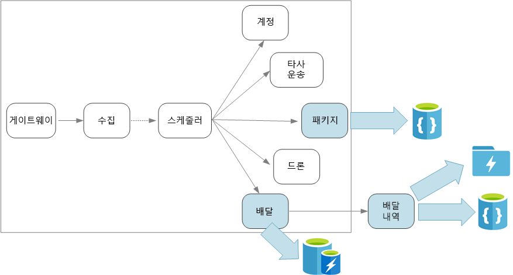

# 마이크로 서비스 디자인: 데이터 고려 사항Designing microservices: Data considerations

이 챕터는 마이크로 서비스 아키텍처의 데이터를 관리하기 위한 고려 사항을 설명합니다.This chapter describes considerations for managing data in a microservices architecture. 모든 마이크로 서비스는 자체 데이터를 관리하기 때문에 데이터 무결성 및 데이터 일관성은 중요한 문제입니다.Because every microservice manages its own data, data integrity and data consistency are critical challenges.

마이크로 서비스의 기본 원리는 각 서비스가 자체 데이터를 관리하는 것입니다.A basic principle of microservices is that each service manages its own data. 두 서비스는 데이터 저장소를 공유하면 안 됩니다.Two services should not share a data store. 대신 각 서비스는 다른 서비스가 직접 액세스할 수 없는 자체 개인 데이터 저장소에 대한 책임이 있습니다.Instead, each service is responsible for its own private data store, which other services cannot access directly.

이 규칙에 대한 이유는 서비스에서 동일한 기본 데이터 스키마를 공유하는 경우 발생할 수 있는 서비스 간의 의도하지 않은 결합을 방지하기 위해서입니다.The reason for this rule is to avoid unintentional coupling between services, which can result if services share the same underlying data schemas. 데이터 스키마에 대한 변경 내용이 있는 경우 해당 데이터베이스를 사용하는 모든 서비스에서 변경 내용이 조정되어야 합니다.If there is a change to the data schema, the change must be coordinated across every service that relies on that database. 각 서비스의 데이터 저장소를 격리하여 변경의 범위를 제한하고 완전히 독립적인 배포의 민첩성을 유지할 수 있습니다.By isolating each service's data store, we can limit the scope of change, and preserve the agility of truly independent deployments. 다른 이유는 각 마이크로 서비스에 자체 데이터 모델, 쿼리 또는 읽기/쓰기 패턴이 있을 수 있기 때문입니다.Another reason is that each microservice may have its own data models, queries, or read/write patterns. 공유 데이터 저장소를 사용하면 해당 특정 서비스에 대한 데이터 저장소를 최적화하는 각 팀의 기능을 제한합니다.Using a shared data store limits each team's ability to optimize data storage for their particular service. 

이 방법은 자연스럽게 [다각적인 지속성](https://martinfowler.com/bliki/PolyglotPersistence.html) &mdash; 단일 응용 프로그램 내의 여러 데이터 저장소 기술의 사용으로 이어집니다.This approach naturally leads to [polyglot persistence](https://martinfowler.com/bliki/PolyglotPersistence.html) &mdash; the use of multiple data storage technologies within a single application. 하나의 서비스에는 문서 데이터베이스의 스키마 온 리드(schema-on-read) 기능이 필요할 수 있습니다.One service might require the schema-on-read capabilities of a document database. 다른 서비스에는 RDBMS에서 제공하는 참조 무결성이 필요할 수 있습니다.Another might need the referential integrity provided by an RDBMS. 각 팀은 자신의 서비스에 대한 최상의 선택을 할 수 있습니다.Each team is free to make the best choice for their service. 다각적인 지속성의 일반 원칙에 대한 자세한 내용은 [작업에 가장 적합한 데이터 저장소 사용](../guide/design-principles/use-the-best-data-store.md)을 참조하세요.For more about the general principle of polyglot persistence, see [Use the best data store for the job](../guide/design-principles/use-the-best-data-store.md). 

> [!NOTE]
> 서비스의 경우 동일한 물리적 데이터베이스 서버를 공유하는 것은 괜찮습니다.It's fine for services to share the same physical database server. 서비스가 동일한 스키마를 공유하거나 동일한 데이터베이스 테이블 집합을 읽고 쓸 때 문제가 발생합니다.The problem occurs when services share the same schema, or read and write to the same set of database tables.

## 과제Challenges

몇 가지 과제는 데이터 관리에 대한 이 분산된 방식에서 발생합니다.Some challenges arise from this distributed approach to managing data. 먼저 여러 위치에 표시되는 동일한 데이터 항목이 있는 데이터 저장소에서 중복이 있을 수 있습니다.First, there may be redundancy across the data stores, with the same item of data appearing in multiple places. 예를 들어 데이터는 트랜잭션의 일부로 저장된 후 분석, 보고 또는 보관을 위해 다른 위치에 저장될 수 있습니다.For example, data might be stored as part of a transaction, then stored elsewhere for analytics, reporting, or archiving. 복제되거나 분할된 데이터로 인해 데이터 무결성과 일관성의 문제가 발생할 수 있습니다.Duplicated or partitioned data can lead to issues of data integrity and consistency. 데이터 관계가 여러 서비스에 걸쳐 있는 경우 기존 데이터 관리 기법을 사용하여 관계를 적용할 수 없습니다.When data relationships span multiple services, you can't use traditional data management techniques to enforce the relationships.

기존 데이터 모델링은 "한 위치에 하나의 팩트"의 규칙을 사용합니다.Traditional data modeling uses the rule of "one fact in one place." 모든 엔터티는 스키마에서 정확히 한 번만 나타납니다.Every entity appears exactly once in the schema. 다른 엔터티는 이에 대한 참조를 저장할 수 있지만 복제할 수 없습니다.Other entities may hold references to it but not duplicate it. 기존의 접근 방식에 대한 명백한 장점은 데이터 일관성에 문제가 발생하지 않도록 한 위치에서 업데이트가 발생한다는 것입니다.The obvious advantage to the traditional approach is that updates are made in a single place, which avoids problems with data consistency. 마이크로 서비스 아키텍처에서는 업데이트가 서비스 간에 전파되는 방법 및 강력한 일관성 없이 여러 위치에 데이터가 나타날 때 결과적 일관성을 관리하는 방법을 고려해야 합니다.In a microservices architecture, you have to consider how updates are propagated across services, and how to manage eventual consistency when data appears in multiple places without strong consistency. 

## 데이터를 관리하는 방법Approaches to managing data

모든 경우에 맞는 단일 접근 방식은 없지만 마이크로 서비스 아키텍처에서 데이터를 관리하기 위한 일반적인 지침은 다음과 같습니다.There is no single approach that's correct in all cases, but here are some general guidelines for managing data in a microservices architecture.

- 가능한 경우 결과적 일관성을 수용합니다.Embrace eventual consistency where possible. 강력한 일관성 또는 ACID 트랜잭션이 필요한 시스템의 위치 및 결과적 일관성이 허용되는 위치를 이해합니다.Understand the places in the system where you need strong consistency or ACID transactions, and the places where eventual consistency is acceptable.

- 강력한 일관성 보장이 필요한 경우 하나의 서비스는 API를 통해 노출되는 특정 엔터티에 대한 정보의 원본을 나타낼 수 있습니다.When you need strong consistency guarantees, one service may represent the source of truth for a given entity, which is exposed through an API. 다른 서비스는 데이터의 자체 복사본 또는 결국 마스터 데이터와 일치하지만 정보의 원본으로 간주되지 않는 데이터의 하위 집합을 유지할 수도 있습니다.Other services might hold their own copy of the data, or a subset of the data, that is eventually consistent with the master data but not considered the source of truth. 예를 들어 고객 주문 서비스 및 권장 서비스를 사용하는 전자 상거래 시스템을 가정합니다.For example, imagine an e-commerce system with a customer order service and a recommendation service. 권장 서비스는 주문 서비스에서 이벤트를 수신할 수 있지만 고객이 환불을 요청하는 경우 권장 서비스가 아닌 완전한 트랜잭션 기록이 있는 주문 서비스입니다.The recommendation service might listen to events from the order service, but if a customer requests a refund, it is the order service, not the recommendation service, that has the complete transaction history.

- 트랜잭션의 경우 [Scheduler 에이전트 감독자](../patterns/scheduler-agent-supervisor.md) 및 [보정 트랜잭션](../patterns/compensating-transaction.md)과 같은 패턴을 사용하여 여러 서비스에서 데이터 일관성을 유지합니다.For transactions, use patterns such as [Scheduler Agent Supervisor](../patterns/scheduler-agent-supervisor.md) and [Compensating Transaction](../patterns/compensating-transaction.md) to keep data consistent across several services.  여러 서비스 간에 부분 장애를 방지하기 위해 여러 서비스에 걸쳐 있는 작업의 단위 상태를 캡처하는 데이터의 추가 부분을 저장해야 할 수도 있습니다.You may need to store an additional piece of data that captures the state of a unit of work that spans multiple services, to avoid partial failure among multiple services. 예를 들어 다단계 트랜잭션이 진행 중인 동안 지속성 큐에서 작업 항목을 유지합니다.For example, keep a work item on a durable queue while a multi-step transaction is in progress. 

- 서비스가 필요한 데이터만 저장합니다.Store only the data that a service needs. 서비스는 도메인 엔터티에 대한 정보의 하위 집합만 필요할 수 있습니다.A service might only need a subset of information about a domain entity. 예를 들어 배송 제한된 컨텍스트에서 특정 배달에 연결된 고객을 알아야 합니다.For example, in the Shipping bounded context, we need to know which customer is associated to a particular delivery. 하지만 고객의 요금 청구서 주소가 필요하지 않습니다. &mdash; 계정 제한된 컨텍스트에서 관리됩니다.But we don't need the customer's billing address &mdash; that's managed by the Accounts bounded context. 도메인에 대해 신중하게 생각하세요. 여기에서는 DDD 방식을 사용하는 것이 도움이 될 수 있습니다.Thinking carefully about the domain, and using a DDD approach, can help here. 

- 서비스가 일관적이고 느슨하게 결합되었는지 여부를 고려합니다.Consider whether your services are coherent and loosely coupled. 두 서비스가 지속적으로 서로 정보를 교환하여 번잡한 API가 되는 경우 두 서비스를 병합하거나 해당 기능을 리팩터링하여 서비스 경계를 다시 그려야 할 수 있습니다.If two services are continually exchanging information with each other, resulting in chatty APIs, you may need to redraw your service boundaries, by merging two services or refactoring their functionality.

- [이벤트 기반 아키텍처 스타일](../guide/architecture-styles/event-driven.md)을 사용합니다.Use an [event driven architecture style](../guide/architecture-styles/event-driven.md). 이 아키텍처 스타일에서 서비스는 해당 공용 모델 또는 엔터티에 변경 내용이 있을 때 이벤트를 게시합니다.In this architecture style, a service publishes an event when there are changes to its public models or entities. 관심이 있는 서비스는 이러한 이벤트를 구독할 수 있습니다.Interested services can subscribe to these events. 예를 들어 다른 서비스는 쿼리에 적합한 데이터의 구체화된 뷰를 생성하는 이벤트를 사용할 수 있습니다.For example, another service could use the events to construct a materialized view of the data that is more suitable for querying. 

- 이벤트를 소유하는 서비스는 게시자와 구독자 간의 긴밀한 결합을 방지하기 위해 이벤트 직렬화 및 역직렬화를 자동화하는 데 사용할 수 있는 스키마를 게시해야 합니다.A service that owns events should publish a schema that can be used to automate serializing and deserializing the events, to avoid tight coupling between publishers and subscribers. JSON 스키마 또는 [Microsoft Bond](https://github.com/Microsoft/bond), Protobuf 또는 Avro와 같은 프레임워크를 사용하는 것이 좋습니다.Consider JSON schema or a framework like [Microsoft Bond](https://github.com/Microsoft/bond), Protobuf, or Avro.  
 
- 큰 규모에서 이벤트는 시스템의 병목 지점이 될 수 있으므로 총 부하를 줄이도록 집계 또는 일괄 처리를 사용하는 것이 좋습니다.At high scale, events can become a bottleneck on the system, so consider using aggregation or batching to reduce the total load. 

## 드론 배달: 데이터 저장소 선택Drone Delivery: Choosing the data stores 

몇 가지 서비스를 사용하더라도 배송 제한된 컨텍스트는 이 섹션에서 설명하는 여러 지점을 보여 줍니다.Even with only a few services, the Shipping bounded context illustrates several of the points discussed in this section. 

사용자가 새 배달을 예약하는 경우 클라이언트 요청에는 픽업 및 하차 위치와 같은 배달 및 크기 및 무게와 같은 패키지에 대한 정보가 포함됩니다.When a user schedules a new delivery, the client request includes information about the both the delivery, such as the pickup and dropoff locations, and about the package, such as the size and weight. 이 정보는 수집 서비스가 Event Hubs에 전송하는 작업 단위를 정의합니다.This information defines a unit of work, which the Ingestion service sends to Event Hubs. 배달 요청이 손실되지 않도록 Scheduler 서비스가 워크플로를 실행하는 동안 작업 단위가 영구 저장소에 유지되는 것은 중요합니다.It's important that the unit of work stays in persistent storage while the Scheduler service is executing the workflow, so that no delivery requests are lost. 워크플로에 대한 자세한 논의는 [수집 및 워크플로](./ingestion-workflow.md)를 참조하세요.For more discussion of the workflow, see [Ingestion and workflow](./ingestion-workflow.md). 

다양한 백 엔드 서비스는 요청에서 서로 다른 정보의 부분에 대해 고려하며 서로 다른 읽기 및 쓰기 프로필을 갖습니다.The various backend services care about different portions of the information in the request, and also have different read and write profiles. 

### 배달 서비스Delivery service

배달 서비스는 현재 예약되어 있거나 진행 중인 모든 배달에 대한 정보를 저장합니다.The Delivery service stores information about every delivery that is currently scheduled or in progress. 드론에서 이벤트에 대해 수신 대기하고 진행 중인 배달의 상태를 추적합니다.It listens for events from the drones, and tracks the status of deliveries that are in progress. 또한 배달 상태 업데이트와 함께 도메인 이벤트를 보냅니다.It also sends domain events with delivery status updates.

사용자는 해당 패키지를 기다리는 동안 배달 상태를 자주 확인할 수 있습니다.It's expected that users will frequently check the status of a delivery while they are waiting for their package. 따라서 배달 서비스는 장기 저장소에 대해 처리량(읽기 및 쓰기)을 강조하는 데이터 저장소가 필요합니다.Therefore, the Delivery service requires a data store that emphasizes throughput (read and write) over long-term storage. 또한 배달 서비스는 복잡한 쿼리 또는 분석을 수행하지 않으며 단순히 지정된 배달에 대한 최신 상태를 페치합니다.Also, the Delivery service does not perform any complex queries or analysis, it simply fetches the latest status for a given delivery. 배달 서비스 팀은 높은 읽기-쓰기 성능을 위해 Azure Redis Cache를 선택했습니다.The Delivery service team chose Azure Redis Cache for its high read-write performance. Redis에 저장된 정보는 수명이 비교적 짧습니다.The information stored in Redis is relatively short-lived. 배달이 완료되면 배달 기록 서비스는 레코드의 시스템입니다.Once a delivery is complete, the Delivery History service is the system of record.

### 배달 기록 서비스Delivery History service

배달 기록 서비스는 배달 서비스의 배달 상태 이벤트에 대해 수신 대기합니다.The Delivery History service listens for delivery status events from the Delivery service. 장기 저장소에 이 데이터를 저장합니다.It stores this data in long-term storage. 서로 다른 데이터 저장소 요구 사항이 있는 이 기록 데이터에 대한 두 개의 서로 다른 사용 사례가 있습니다.There are two different use-cases for this historical data, which have different data storage requirements. 

첫 번째 시나리오는 비즈니스를 최적화하거나 서비스의 품질을 향상시키기 위해 데이터 분석의 목적으로 데이터를 집계합니다.The first scenario is aggregating the data for the purpose of data analytics, in order to optimize the business or improve the quality of the service. 배달 기록 서비스는 데이터의 실제 분석을 수행하지 않습니다.Note that the Delivery History service doesn't perform the actual analysis of the data. 수집 및 저장만을 담당합니다.It's only responsible for the ingestion and storage. 이 시나리오의 경우 저장소는 다양한 데이터 원본에 맞게 스키마 온 리드(schema-on-read) 방법을 사용하여 큰 데이터 집합에 대한 데이터 분석을 위해 최적화되어야 합니다.For this scenario, the storage must be optimized for data analysis over a large set of data, using a schema-on-read approach to accommodate a variety of data sources. [Azure Data Lake Store](/azure/data-lake-store/)는 이 시나리오에 적합합니다.[Azure Data Lake Store](/azure/data-lake-store/) is a good fit for this scenario. Data Lake Store는 HDFS(Hadoop 분산 파일 시스템)와 호환되는 Apache Hadoop 파일 시스템이며 데이터 분석 시나리오에 대한 성능을 위해 조정됩니다.Data Lake Store is an Apache Hadoop file system compatible with Hadoop Distributed File System (HDFS), and is tuned for performance for data analytics scenarios. 

다른 시나리오는 사용자가 배달이 완료된 후 배달 기록을 조회할 수 있도록 합니다.The other scenario is enabling users to look up the history of a delivery after the delivery is completed. Azure Data Lake는 이 시나리오에 대해 특히 최적화되지 않았습니다.Azure Data Lake is not particularly optimized for this scenario. 최적의 성능을 위해 날짜별로 분할된 폴더의 Data Lake에 시계열 데이터를 저장하는 것이 좋습니다.For optimal performance, Microsoft recommends storing time-series data in Data Lake in folders partitioned by date. ([성능을 위해 Azure Data Lake Store 조정](/azure/data-lake-store/data-lake-store-performance-tuning-guidance)을 참조하세요.)(See [Tuning Azure Data Lake Store for performance](/azure/data-lake-store/data-lake-store-performance-tuning-guidance)). 그러나 해당 구조는 ID별 개별 레코드를 찾는 데 적합하지 않습니다.However, that structure is not optimal for looking up individual records by ID. 또한 타임스탬프를 알 수 없다면 ID별 조회는 전체 컬렉션을 검색해야 합니다.Unless you also know the timestamp, a lookup by ID requires scanning the entire collection. 따라서 배달 기록 서비스도 빠른 조회를 위해 Cosmos DB에 기록 데이터의 하위 집합을 저장합니다.Therefore, the Delivery History service also stores a subset of the historical data in Cosmos DB for quicker lookup. 레코드는 Cosmos DB에 무기한으로 유지될 필요가 없습니다.The records don't need to stay in Cosmos DB indefinitely. 이전 배달은 보관될 수 있습니다. &mdash; 한 달 후로 가정합니다.Older deliveries can be archived &mdash; say, after a month. 간헐적인 일괄 처리 프로세스를 실행하여 수행할 수 있습니다.This could be done by running an occasional batch process.

### 패키지 서비스Package service

패키지 서비스는 모든 패키지에 대한 정보를 저장합니다.The Package service stores information about all of the packages. 패키지에 대한 저장소 요구 사항은 다음과 같습니다.The storage requirements for the Package are: 

- 장기 저장소Long-term storage.
- 높은 쓰기 처리량이 필요한 대용량 패키지 처리 가능Able to handle a high volume of packages, requiring high write throughput.
- 패키지 ID별 간단한 쿼리 지원Support simple queries by package ID. 참조 무결성에 대한 복잡한 조인 또는 요구 사항 없음No complex joins or requirements for referential integrity.

패키지 데이터는 관계형이 아니기 때문에 문서 지향 데이터베이스는 적절하며 Cosmos DB는 분할된 컬렉션을 사용하여 매우 높은 처리량을 얻을 수 있습니다.Because the package data is not relational, a document oriented database is appropriate, and Cosmos DB can achieve very high throughput by using sharded collections. 패키지 서비스에서 작업하는 팀은 MEAN 스택(MongoDB, Express.js, AngularJS 및 Node.js)을 잘 알고 있으므로 Cosmos DB에 대해 [MongoDB API](/azure/cosmos-db/mongodb-introduction)를 선택합니다.The team that works on the Package service is familiar with the MEAN stack (MongoDB, Express.js, AngularJS, and Node.js), so they select the [MongoDB API](/azure/cosmos-db/mongodb-introduction) for Cosmos DB. 이를 통해 관리 Azure 서비스인 Cosmos DB의 이점으로 기존의 MongoDB 사용 경험을 활용할 수 있습니다.That lets them leverage their existing experience with MongoDB, while getting the benefits of Cosmos DB, which is a managed Azure service.

> [!div class="nextstepaction"]
> [서비스 간 통신Interservice communication](./interservice-communication.md)