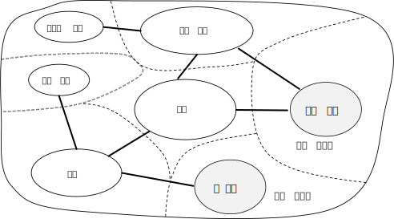
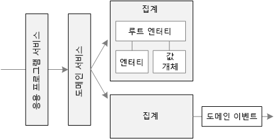
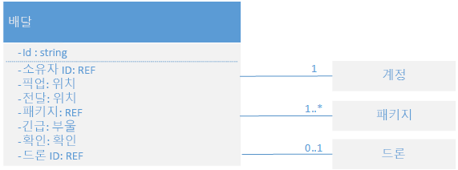
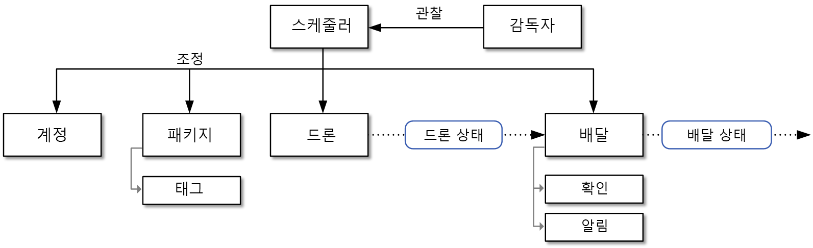

# 마이크로 서비스 설계: 도메인 분석Designing microservices: Domain analysis 

마이크로 서비스의 가장 큰 해결 과제 중 하나는 개별 서비스의 경계를 정의하는 것입니다.One of the biggest challenges of microservices is to define the boundaries of individual services. 일반적인 규칙은 서비스가 "한 가지"를 수행해야 하지만 &mdash; 해당 규칙을 실행하는 데는 신중한 계획이 필요합니다.The general rule is that a service should do "one thing" &mdash; but putting that rule into practice requires careful thought. "올바른" 설계를 만들어내는 기계적 프로세스는 없습니다.There is no mechanical process that will produce the "right" design. 비즈니스 도메인, 요구 사항 및 목표에 대한 숙고가 필요합니다.You have to think deeply about your business domain, requirements, and goals. 그렇지 않으면 서비스 간의 숨겨진 종속성, 밀접한 결합 또는 불완전하게 설계된 인터페이스 등, 바람직하지 않은 특징을 나타내는 체계적이지 못한 설계로 끝날 수 있습니다.Otherwise, you can end up with a haphazard design that exhibits some undesirable characteristics, such as hidden dependencies between services, tight coupling, or poorly designed interfaces. 이 장에서는 도메인 기반 접근 방식으로 마이크로 서비스를 설계합니다.In this chapter, we take a domain-driven approach to designing microservices. 

마이크로 서비스는 데이터 액세스나 메시징 등, 수평적 레이어가 아닌 비즈니스 기능을 중심으로 설계되어야 합니다.Microservices should be designed around business capabilities, not horizontal layers such as data access or messaging. 또한 느슨한 결합과 유효한 응집력이 있어야 합니다.In addition, they should have loose coupling and high functional cohesion. 다른 서비스를 동시에 업데이트하지 않고도 한 서비스를 변경할 수 있다면 마이크로 서비스가 *느슨하게 결합된* 것입니다.Microservices are *loosely coupled* if you can change one service without requiring other services to be updated at the same time. 사용자 계정 관리, 전달 기록 추적 등과 같이 잘 정의된 단일 용도가 있으면 *응집력*이 있는 마이크로 서비스입니다.A microservice is *cohesive* if it has a single, well-defined purpose, such as managing user accounts or tracking delivery history. 서비스는 도메인 지식을 캡슐화하고 해당 지식을 클라이언트로부터 추상화해야 합니다.A service should encapsulate domain knowledge and abstract that knowledge from clients. 예를 들어 클라이언트는 상세한 예약 알고리즘이나 드론 선단 관리 방법을 모르고도 드론을 예약할 수 있어야 합니다.For example, a client should be able to schedule a drone without knowing the details of the scheduling algorithm or how the drone fleet is managed.

DDD(도메인 기반 설계)는 잘 설계된 마이크로 서비스 집합을 가장 잘 활용할 수 있는 프레임워크를 제공합니다.Domain-driven design (DDD) provides a framework that can get you most of the way to a set of well-designed microservices. DDD에는 전략과 전술 등, 개별적인 두 단계가 있습니다.DDD has two distinct phases, strategic and tactical. 전략적 DDD에서는 대규모 시스템 구조를 정의합니다.In strategic DDD, you are defining the large-scale structure of the system. 전략적 DDD는 아키텍처가 지속적으로 비즈니스 기능에 주력하게 하는 데 도움이 됩니다.Strategic DDD helps to ensure that your architecture remains focused on business capabilities. 전술적 DDD는 도메인 모델을 만드는 데 사용할 수 있는 일련의 설계 패턴을 제공합니다.Tactical DDD provides a set of design patterns that you can use to create the domain model. 이러한 패턴에는 엔터티, 집계 및 도메인 서비스가 포함됩니다.These patterns include entities, aggregates, and domain services. 이러한 전술적 패턴은 느슨하게 결합된 응집력 있는 마이크로 서비스를 설계하는 데 도움이 됩니다.These tactical patterns will help you to design microservices that are both loosely coupled and cohesive.

이 장 및 다음 장에서는 다음 단계를 통해 드론 배달 응용 프로그램에 적용해 보겠습니다.In this chapter and the next, we'll walk through the following steps, applying them to the Drone Delivery application: 

1. 응용 프로그램의 기능 요구 사항을 이해하기 위한 비즈니스 도메인 분석부터 시작합니다.Start by analyzing the business domain to understand the application's functional requirements. 이 단계의 결과는 비공식적인 도메인 설명으로, 이를 더 공식적인 도메인 모델 집합으로 구체화할 수 있습니다.The output of this step is an informal description of the domain, which can be refined into a more formal set of domain models. 

2. 다음으로 도메인의 *경계가 있는 컨텍스트*를 정의합니다.Next, define the *bounded contexts* of the domain. 각각의 경계가 있는 컨텍스트에는 더 큰 응용 프로그램의 특정 하위 도메인을 나타내는 도메인 모델이 포함됩니다.Each bounded context contains a domain model that represents a particular subdomain of the larger application. 

3. 경계가 있는 컨텍스트 안에서 전술적 DDD 패턴을 적용하여 엔터티, 집계 및 도메인 서비스를 정의합니다.Within a bounded context, apply tactical DDD patterns to define entities, aggregates, and domain services. 
 
4. 이전 단계의 결과를 사용하여 응용 프로그램에서 마이크로 서비스를 식별합니다.Use the results from the previous step to identify the microservices in your application.

이 장에서는 주로 DDD와 관련된 첫 세 단계를 다룹니다.In this chapter, we cover the first three steps, which are primarily concerned with DDD. 다음 장에서는 마이크로 서비스를 식별합니다.In the next chapter, we will identify the microservices. 그러나 DDD는 반복적이고 계속되는 프로세스라는 점을 기억해야 합니다.However, it's important to remember that DDD is an iterative, ongoing process. 서비스 경계는 붙박이가 아닙니다.Service boundaries aren't fixed in stone. 응용 프로그램 진화에 따라 서비스를 더 작은 규모의 여러 서비스로 분할할 수 있습니다.As an application evolves, you may decide to break apart a service into several smaller services.

> [!NOTE]
> 이 장에서 다루는 것이 완전한 전체 도메인 분석은 아닙니다.This chapter is not meant to show a complete and comprehensive domain analysis. 요점을 설명하기 위해 예제를 간략하게 다듬었습니다.We deliberately kept the example brief, in order to illustrate the main points. DDD에 대한 자세한 배경 정보는 처음 이 용어를 사용한 책인 Eric Evans의 *Domain-Driven Design*을 추천합니다.For more background on DDD, we recommend Eric Evans' *Domain-Driven Design*, the book that first introduced the term. Vaughn Vernon의 *Implementing Domain-Driven Design(DDD 구현)*도 좋은 참고가 됩니다.Another good reference is *Implementing Domain-Driven Design* by Vaughn Vernon. 

## 도메인 분석Analyze the domain

DDD 방식을 사용하면 모든 서비스가 기능적인 비즈니스 요구 사항에 자연스럽게 부합하는 마이크로 서비스를 설계할 수 있습니다.Using a DDD approach will help you to design microservices so that every service forms a natural fit to a functional business requirement. 조직의 경계나 기술 선택에 따라 설계가 끌려가게 되는 상황을 방지하는 데도 도움이 됩니다.It can help you to avoid the trap of letting organizational boundaries or technology choices dictate your design.

코드를 작성하기 전에, 만드는 시스템에 대한 개요가 필요합니다.Before writing any code, you need a bird's eye view of the system that you are creating. DDD는 비즈니스 도메인을 모델링하고 *도메인 모델*을 만드는 데서 출발합니다.DDD starts by modeling the business domain and creating a *domain model*. 도메인 모델은 비즈니스 도메인의 추상적 모델입니다.The domain model is an abstract model of the business domain. 도메인 지식을 거르고 정리하며 개발자와 도메인 전문가를 위한 공통 언어를 제공합니다.It distills and organizes domain knowledge, and provides a common language for developers and domain experts. 

모든 비즈니스 기능 및 그러한 기능 간의 연결을 매핑하는 것에서 출발합니다.Start by mapping all of the business functions and their connections. 이것은 도메인 전문가, 소프트웨어 설계자및 기타 관련자와 관련된 협력이 될 수 있습니다.This will likely be a collaborative effort that involves domain experts, software architects, and other stakeholders. 정해진 특정 형식을 사용할 필요는 없습니다.You don't need to use any particular formalism.  다이어그램을 스케치하거나 화이트보드에 그릴 수 있습니다.Sketch a diagram or draw on whiteboard.

다이어그램을 채울 때는 분리된 하위 도메인을 식별하는 것부터 시작할 수 있습니다.As you fill in the diagram, you may start to identify discrete subdomains. 어떤 기능이 밀접하게 관련되었나?Which functions are closely related? 어떤 기능이 비즈니스에 핵심이며 어떤 기능이 부차적 서비스를 제공하는가?Which functions are core to the business, and which provide ancillary services? 종속성 그래프는 어떻게 되는가?What is the dependency graph? 이 초기 단계에서는 기술이나 구현 세부 사항은 고려하지 않습니다.During this initial phase, you aren't concerned with technologies or implementation details. 즉 응용 프로그램이 CRM, 결제 처리 또는 청구 시스템 등, 외부 시스템과 통합되어야 하는 지점을 확인해야 합니다.That said, you should note the place where the application will need to integrate with external systems, such as CRM, payment processing, or billing systems. 

## 드론 배달: 비즈니스 도메인 분석Drone Delivery: Analyzing the business domain.

최초 도메인 분석 후에는 Fabrikam 팀이 드론 배달 도메인을 묘사하는 개괄적인 스케치를 갖게 됩니다.After some initial domain analysis, the Fabrikam team came up with a rough sketch that depicts the Drone Delivery domain.

 

- **배송**은 이 비즈니스의 핵심이므로 다이어그램의 중앙에 있습니다.**Shipping** is placed in the center of the diagram, because it's core to the business. 다이어그램의 다른 모든 항목은 이 기능을 구현하기 위해 존재합니다.Everything else in the diagram exists to enable this functionality.
- **드론 관리**도 이 비즈니스에서 핵심입니다.**Drone management** is also core to the business. 드론 관리와 밀접한 관련이 있는 기능에는 **드론 복구**와, 드론 서비스 및 유지 관리가 필요한 시점을 예측하는 **예측 분석**이 포함됩니다.Functionality that is closely related to drone management includes **drone repair** and using **predictive analysis** to predict when drones need servicing and maintenance. 
- **ETA 분석**은 수거 및 배달에 대한 추정 시간을 제공합니다.**ETA analysis** provides time estimates for pickup and delivery. 
- **타사 운송**은 드론만으로는 패키지를 배송할 수 없는 경우 대체 운송 수단을 예약하는 응용 프로그램을 구현합니다.**Third-party transportation** will enable the application to schedule alternative transportation methods if a package cannot be shipped entirely by drone.
- **드론 공유**는 핵심 비즈니스의 가능한 확장입니다.**Drone sharing** is a possible extension of the core business. 회사에서 특정 시간대에 용량이 남아 유휴 상태가 되는 드론을 대여할 수 있습니다.The company may have excess drone capacity during certain hours, and could rent out drones that would otherwise be idle. 이 기능은 초기 릴리스에 없습니다.This feature will not be in the initial release.
- **비디오 감시**는 회사가 나중에 확장할 수 있는 다른 영역입니다.**Video surveillance** is another area that the company might expand into later.
- **사용자 계정**, **청구** 및 **콜 센터**는 핵심 비즈니스를 지원하는 하위 도메인입니다.**User accounts**, **Invoicing**, and **Call center** are subdomains that support the core business.
 
프로세스의 이 시점에서는 구현이나 기술에 대한 어떠한 결정도 이루어지지 않았습니다.Notice that at this point in the process, we haven't made any decisions about implementation or technologies. 하위 시스템 중 일부에는 외부 소프트웨어 시스템이나 타사 서비스가 관련될 수 있습니다.Some of the subsystems may involve external software systems or third-party services. 그렇다 하더라도 응용 프로그램은 이러한 시스템 및 서비스와 상호 작용해야 하므로 도메인 모델에 이를 포함시키는 것이 중요합니다.Even so, the application needs to interact with these systems and services, so it's important to include them in the domain model. 

> [!NOTE]
> 응용 프로그램이 외부 시스템을 사용할 경우 외부 시스템의 데이터 스키마나 API가 응용 프로그램에 유입되어 구조적 설계를 저해할 위험이 있습니다.When an application depends on an external system, there is a risk that the external system's data schema or API will leak into your application, ultimately compromising the architectural design. 특히 최신 모범 사례를 따르지 않아 구형 데이터 스키마나 통용되지 않는 API를 사용하는 기존 시스템인 경우가 그렇습니다.This is particularly true with legacy systems that may not follow modern best practices, and may use convoluted data schemas or obsolete APIs. 이 경우에는 해당 외부 시스템과 응용 프로그램 간의 경계를 잘 정의하는 것이 중요합니다.In that case, it's important to have a well-defined boundary between these external systems and the application. 이러한 용도로 [Strangler 패턴](../patterns/strangler.md) 또는 [손상 방지 레이어 패턴](../patterns/anti-corruption-layer.md)을 사용할 수 있습니다.Consider using the [Strangler Pattern](../patterns/strangler.md) or the [Anti-Corruption Layer Pattern](../patterns/anti-corruption-layer.md) for this purpose.

## 경계가 있는 컨텍스트 정의Define bounded contexts

도메인 모델은 현실 세계에 존재하는 항목 &mdash; 사용자, 드론, 패키지 등의 표현을 포함합니다.The domain model will include representations of real things in the world &mdash; users, drones, packages, and so forth. 그렇다고 해서 시스템의 모든 부분에서 동일한 사안에 대해 동일한 표현을 사용해야 한다는 것은 아닙니다.But that doesn't mean that every part of the system needs to use the same representations for the same things. 

예를 들어 드론 수리와 예측 분석을 처리하는 하위 시스템은 유지 관리 이력, 이동거리, 사용 기간, 모델 번호, 성능 특징 등과 같이 드론의 물리적 특징을 표현해야 할 수 있습니다.For example, subsystems that handle drone repair and predictive analysis will need to represent many physical characteristics drones, such as their maintenance history, mileage, age, model number, performance characteristics, and so on. 그러나 배달 예약에서는 그러한 특징을 고려하지 않습니다.But when it's time to schedule a delivery, we don't care about those things. 예약 하위 시스템은 드론의 가용 여부와, 수거 및 배달의 ETA를 알기만 하면 됩니다. The scheduling subsystem only needs to know whether a drone is available, and the ETA for pickup and delivery. 

이 두 하위 시스템 모두에 대해 하나의 모델을 만들려고 하면 불필요하게 복잡해질 것입니다.If we tried to create a single model for both of these subsystems, it would be unnecessarily complex. 시간이 흘러 이 모델을 확장하게 되면 변경 사항이 개별 하위 시스템을 담당하는 여러 팀을 만족시켜야 하기 때문에 더 어려워집니다.It would also become harder for the model to evolve over time, because any changes will need to satisfy multiple teams working on separate subsystems. 따라서 동일한 현실 세계 엔터티(이 경우 드론)을 두 가지 다른 컨텍스트에 표현하는 별도의 모델을 설계하는 것이 더 나은 경우가 종종 있습니다.Therefore, it's often better to design separate models that represent the same real-world entity (in this case, a drone) in two different contexts. 각각의 모델은 특정 컨텍스트 내에서 유관한 기능 및 특성만 포함하게 됩니다.Each model contains only the features and attributes that are relevant within its particular context.

바로 DDD의 *경계가 있는 컨텍스트* 개념이 빛을 발하는 부분입니다.This is where the DDD concept of *bounded contexts* comes into play. 경계가 있는 컨텍스트는 단순히 그 안에서 특정 도메인 모델이 적용되는 도메인 안의 범위입니다.A bounded context is simply the boundary within a domain where a particular domain model applies. 이전 다이어그램을 살펴보면 다양한 기능이 단일 도메인 모델을 공유하는지의 여부에 따라 기능을 그룹화할 수 있습니다.Looking at the previous diagram, we can group functionality according to whether various functions will share a single domain model. 

 
 
경계가 있는 컨텍스트가 반드시 서로 격리될 필요는 없습니다.Bounded contexts are not necessarily isolated from one another. 이 다이어그램에서 경계가 있는 컨텍스트를 연결하는 실선은 경계가 있는 두 컨텍스트가 상호 작용하는 지점을 나타냅니다.In this diagram, the solid lines connecting the bounded contexts represent places where two bounded contexts interact. 예를 들어 배송은 고객 정보를 가져오기 위해 사용자 계정을, 선단에서 드론을 예약하기 위해 드론 관리를 사용합니다.For example, Shipping depends on User Accounts to get information about customers, and on Drone Management to schedule drones from the fleet.

*Domain Driven Design* 책에서 Eric Evans는 다른 경계가 있는 컨텍스트와 상호 작용할 때 도메인 모델의 무결성을 유지 관리하기 위한 여러 가지 패턴을 설명합니다.In the book *Domain Driven Design*, Eric Evans describes several patterns for maintaining the integrity of a domain model when it interacts with another bounded context. 마이크로 서비스의 기본 원칙 중 하나는 서비스가 잘 정의된 API를 통해 통신하는 것입니다.One of the main principles of microservices is that services communicate through well-defined APIs. 이 방법은 Evans가 개방형 호스트 서비스와 게시된 언어라고 칭한 두 패턴에 해당합니다.This approach corresponds to two patterns that Evans calls Open Host Service and Published Language. 개방형 호스트 서비스란 하위 시스템이 다른 하위 시스템과의 통신을 위한 공식 프로토콜(API)를 정의하는 것입니다.The idea of Open Host Service is that a subsystem defines a formal protocol (API) for other subsystems to communicate with it. 게시된 언어는 다른 팀이 클라이언트를 작성하는 데 사용할 수 있는 양식으로 API를 게시하여 이러한 개념을 확장합니다.Published Language extends this idea by publishing the API in a form that other teams can use to write clients. [API 설계](./api-design.md)에 대한 장에서 [OpenAPI 사양](https://www.openapis.org/specification/repo)(이전의 Swagger)을 사용하여 JSON 또는 YAML 형식으로 표현된 REST API에 대한 언어 중립적 인터페이스 설명을 정의합니다.In the chapter on [API Design](./api-design.md), we discuss using [OpenAPI Specification](https://www.openapis.org/specification/repo) (formerly known as Swagger) to define language-agnostic interface descriptions for REST APIs, expressed in JSON or YAML format.

이 과정의 나머지 부분에서는 경계가 있는 컨텍스트인 배송에 초점을 맞춥니다.For the rest of this journey, we will focus on the Shipping bounded context. 

## 전술적 DDDTactical DDD

DDD의 전략적 단계에서는 비즈니스 도메인을 매핑하고 도메인 모델에 대해 경계가 있는 컨텍스트를 정의합니다.During the strategic phase of DDD, you are mapping out the business domain and defining bounded contexts for your domain models. 전술적 DDD는 더 상세하게 도메인 모델을 정의하는 부분입니다.Tactical DDD is when you define your domain models with more precision. 경계가 있는 단일 컨텍스트 안에서 전술적 패턴을 적용합니다.The tactical patterns are applied within a single bounded context. 마이크로 서비스 아키텍처에서는 특히 엔터티와 집계 패턴에 초점을 둡니다.In a microservices architecture, we are particularly interested in the entity and aggregate patterns. 이러한 패턴을 적용하면 응용 프로그램의 서비스에 대한 자연스러운 경계를 파악할 수 있습니다([다음 장](./microservice-boundaries.md) 참조).Applying these patterns will help us to identify natural boundaries for the services in our application (see [next chapter](./microservice-boundaries.md)). 일반적인 원칙으로 마이크로 서비스는 집계보다 작거나 경계가 있는 컨텍스트보다 클 수 없습니다.As a general principle, a microservice should be no smaller than an aggregate, and no larger than a bounded context. 먼저 전술적 패턴을 검토합니다.First, we'll review the tactical patterns. 그런 다음 드론 배달 응용 프로그램에서 경계가 있는 컨텍스트 배송에 적용합니다.Then we'll apply them to the Shipping bounded context in the Drone Delivery application. 

### 전술적 패턴 개요Overview of the tactical patterns

이 섹션에서는 전술적 DDD 패턴에 대한 간략한 개요를 제공하므로 이미 DDD에 익숙하다면 이 섹션을 건너뛸 수 있습니다.This section provides a brief summary of the tactical DDD patterns, so if you are already familiar with DDD, you can probably skip this section. 패턴은 Eric Evans의 책 5 &ndash; 6장과, Vaughn Vernon의 *Implementing Domain-Driven Design(DDD 구현)*에서 더 상세히 설명합니다.The patterns are described in more detail in chapters 5 &ndash; 6 of Eric Evans' book, and in *Implementing Domain-Driven Design* by Vaughn Vernon. 

**엔터티**.**Entities**. 엔터티는 시간이 지나도 지속되는 고유의 ID가 있는 개체입니다.An entity is an object with a unique identity that persists over time. 예를 들어 뱅킹 응용 프로그램에서 는 고객과 계좌가 엔터티입니다.For example, in a banking application, customers and accounts would be entities. 

- 엔터티에는 엔터티를 조회하거나 검색하는 데 사용할 수 있는 고유의 식별자가 있습니다.An entity has a unique identifier in the system, which can be used to look up or retrieve the entity. 식별자가 항상 사용자에게 직접 노출되는 것은 아닙니다.That doesn't mean the identifier is always exposed directly to users. 데이터베이스의 GUID 또는 기본 키가 될 수 있습니다.It could be a GUID or a primary key in a database. 
- ID는 여러 경계가 있는 컨텍스트를 포괄할 수 있고 응용 프로그램의 수명을 넘어설 수 있습니다.An identity may span multiple bounded contexts, and may endure beyond the lifetime of the application. 예를 들어 은행 계좌번호나 정부 발급 ID는 특정 응용 프로그램의 수명 주기에 종속되지 않습니다.For example, bank account numbers or government-issued IDs are not tied to the lifetime of a particular application.
- 엔터티의 특성은 시간이 지나면서 변화할 수 있습니다.The attributes of an entity may change over time. 예를 들어 사용자 이름 또는 주소는 변경될 수 있지만 여전히 같은 사람입니다.For example, a person's name or address might change, but they are still the same person. 
- 엔터티는 다른 엔터티에 대한 참조를 포함할 수 있습니다.An entity can hold references to other entities.
 
**값 개체**.**Value objects**. 값 개체에는 ID가 없습니다.A value object has no identity. 해당 특성의 값으로만 정의됩니다.It is defined only by the values of its attributes. 값 개체도 변경할 수 없습니다.Value objects are also immutable. 값 개체를 업데이트하려면 항상 새 인스턴스를 만들어 기존 인스턴스를 대체합니다.To update a value object, you always create a new instance to replace the old one. 값 개체는 도메인 논리를 캡슐화하는 메서드를 갖을 수 있으나 이러한 메서드는 개체의 상태에 부작용을 주지 않아야 합니다.Value objects can have methods that encapsulate domain logic, but those methods should have no side-effects on the object's state. 값 개체의 대표적인 예로 색, 날짜 및 시간, 통화 값 등이 있습니다.Typical examples of value objects include colors, dates and times, and currency values. 

**집계**.**Aggregates**. 집계는 하나 이상의 엔터티에 대한 일관성 경계를 정의합니다.An aggregate defines a consistency boundary around one or more entities. 한 집계에서 정확히 한 엔터티가 루트입니다.Exactly one entity in an aggregate is the root. 조회는 루트 엔터티의 식별자를 사용하여 수행됩니다.Lookup is done using the root entity's identifier. 집계의 다른 엔터티는 루트의 자식 요소로, 루트의 다음 포인터에서 참조합니다.Any other entities in the aggregate are children of the root, and are referenced by following pointers from the root. 

집계의 목적은 트랜잭션 불변 항목을 모델링하는 것입니다.The purpose of an aggregate is to model transactional invariants. 실세계의 항목은 그물처럼 얽혀 복잡합니다.Things in the real world have complex webs of relationships. 고객은 주문을 만들고, 주문에는 제품이 포함되며, 제품은 공급자를 갖는 식입니다.Customers create orders, orders contain products, products have suppliers, and so on. 응용 프로그램에서 여러 관련된 개체를 수정할 경우 어떻게 일관성을 보장할까요?If the application modifies several related objects, how does it guarantee consistency? 불변 항목을 어떻게 추적하고 적용할까요?How do we keep track of invariants and enforce them?  

전통적 응용 프로그램에서는 데이터베이스 트랜잭션을 사용하여 일관성을 적용하는 경우가 종종 있었습니다.Traditional applications have often used database transactions to enforce consistency. 그러나 분산형 응용 프로그램의 경우 현실성이 떨어지는 경우가 많았습니다.In a distributed application, however, that's often not feasible. 단일 비즈니스 트랜잭션이 여러 데이터 저장소에 걸쳐 있거나, 오래 실행되거나, 타사 서비스와 관련될 수 있습니다.A single business transaction may span multiple data stores, or may be long running, or may involve third-party services. 궁극적으로 이것은 데이터 계층이 아니라 도메인에 필요한 불변 항목을 시행하는 응용 프로그램에 달려 있습니다.Ultimately it's up to the application, not the data layer, to enforce the invariants required for the domain. 이것이 집계가 모델링에서 갖는 의미입니다.That's what aggregates are meant to model.

> [!NOTE]
> 집계는 자식 엔터티 없이 단일 엔터티로 구성될 수 있습니다.An aggregate might consist of a single entity, without child entities. 집계를 만드는 것은 트랜잭션 경계입니다.What makes it an aggregate is the transactional boundary.

**도메인 및 응용 프로그램 서비스**.**Domain and application services**. DDD 용어에서 서비스란 상태를 유지하지 않고 일부 논리를 구현하는 개체입니다.In DDD terminology, a service is an object that implements some logic without holding any state. Evans는 도메인 논리를 캡슐화하는 *도메인 서비스*와, 사용자 인증이나 SMS 메시 전송 같은 기술적 기능을 제공하는 *응용 프로그램 서비스*를 구분하고 있습니다.Evans distinguishes between *domain services*, which encapsulate domain logic, and *application services*, which provide technical functionality, such as user authentication or sending an SMS message. 도메인 서비스는 종종 여러 엔터티를 포괄하는 동작을 모델링하는 데 사용됩니다.Domain services are often used to model behavior that spans multiple entities. 

> [!NOTE]
> *서비스*라는 용어는 소프트웨어 개발에서 범위가 넓습니다.The term *service* is overloaded in software development. 여기에서는 그 정의가 마이크로 서비스와 직접적인 연관이 없습니다.The definition here is not directly related to microservices.

**도메인 이벤트**.**Domain events**. 도메인 이벤트는 변경이 있을 때 시스템의 다른 부분에 이를 알리는 데 사용됩니다.Domain events can be used to notify other parts of the system when something happens. 이름에서 알 수 있듯이 도메인 이벤트는 도메인 내의 항목을 의미해야 합니다.As the name suggests, domain events should mean something within the domain. 예를 들어 "테이블에 레코드가 삽입"되는 것은 도메인 이벤트가 아닙니다.For example, "a record was inserted into a table" is not a domain event. "배달 취소"는 도메인 이벤트입니다."A delivery was cancelled" is a domain event. 도메인 이벤트는 마이크로 서비스 아키텍처에서 특히 관련이 있습니다.Domain events are especially relevant in a microservices architecture. 마이크로 서비스는 분산되며 데이터 저장소를 공유하지 않으므로 도메인 이벤트가 마이크로 서비스 상호 간의 조정을 위한 방법을 제공합니다.Because microservices are distributed and don't share data stores, domain events provide a way for microservices to coordinate with each other. [서비스 간 통신](./interservice-communication.md) 장에서는 비동기 메시징에 대해 더 상세히 논의합니다.The chapter [Interservice communication](./interservice-communication.md) discusses asynchronous messaging in more detail.
 
팩터리, 리포지토리, 모듈 등을 포함한 몇 가지 다른 DDD 패턴은 여기에 나열되지 않았습니다.There are a few other DDD patterns not listed here, including factories, repositories, and modules. 마이크로 서비스를 구현할 때 이러한 패턴이 유용할 수 있지만 마이크로 서비스 간 경계를 정의할 때는 다소 무관합니다.These can be useful patterns for when you are implementing a microservice, but they are less relevant when designing the boundaries between microservice.

## 드론 배달: 패턴 적용Drone delivery: Applying the patterns

경계가 있는 컨텍스트 Shipping이 처리해야 하는 시나리오부터 시작합니다.We start with the scenarios that the Shipping bounded context must handle.

- 고객이 드론 배달 서비스에 등록한 기업으로부터 물품 수거를 위해 드론을 요청할 수 있습니다.A customer can request a drone to pick up goods from a business that is registered with the drone delivery service.
- 보내는 사람은 패키지에 표시할 태그(바코드 또는 RFID)를 생성합니다.The sender generates a tag (barcode or RFID) to put on the package. 
- 드론이 원본 위치에서 패키지를 수거하여 대상 위치로 배달합니다.A drone will pick up and deliver a package from the source location to the destination location.
- 고객이 배달을 예약할 때 시스템은 경로 정보, 기상 상황, 이력 데이터를 기준으로 ETA를 제공합니다.When a customer schedules a delivery, the system provides an ETA based on route information, weather conditions, and historical data. 
- 드론이 이동 중일 때 사용자는 현재 위치와 최신 ETA를 추적합니다.When the drone is in flight, a user can track the current location and the latest ETA. 
- 드론이 패키지를 수거하기 전에는 고객이 배달을 취소할 수 있습니다.Until a drone has picked up the package, the customer can cancel a delivery.
- 배달이 완료되면 고객에게 알림이 전달됩니다.The customer is notified when the delivery is completed.
- 보내는 사람은 서명이나 지문의 형태로 고객의 배달 확인을 요청할 수 있습니다.The sender can request delivery confirmation from the customer, in the form of a signature or finger print.
- 사용자는 완료된 배달의 기록을 조회할 수 있습니다.Users can look up the history of a completed delivery.

이러한 시나리오에서 개발 팀은 다음 **엔터티**를 식별했습니다.From these scenarios, the development team identified the following **entities**.

- 배달Delivery
- 패키지Package
- 드론Drone
- 계좌Account
- 확인Confirmation
- 알림Notification
- 태그Tag

처음 4개, 즉 Delivery, Package, Drone 및 Account은 모두 트랜잭션 일관성 경계를 나타내는 **집계**입니다.The first four, Delivery, Package, Drone, and Account, are all **aggregates** that represent transactional consistency boundaries. Confirmations 및 Notifications는 Deliveries의 자식 엔터티, Tags는 Packages의 자식 엔터티입니다.Confirmations and Notifications are child entities of Deliveries, and Tags are child entities of Packages. 

이 설계의 **값 개체**에는 Location, ETA, PackageWeight 및 PackageSize가 포함됩니다.The **value objects** in this design include Location, ETA, PackageWeight, and PackageSize. 

이를 설명하기 위한 Delivery 집계의 UML 다이어그램입니다.To illustrate, here is a UML diagram of the Delivery aggregate. Account, Package 및 Drone 등, 다른 집계에 대한 참조가 포함되었습니다.Notice that it holds references to other aggregates, including Account, Package, and Drone.

다음과 같은 두 가지 도메인 이벤트가 있습니다.There are two domain events:

- 드론이 이동 중인 동안 Drone 개체는 드론의 위치와 상태(이동 중, 착륙함)를 설명하는 DroneStatus 이벤트를 보냅니다.While a drone is in flight, the Drone entity sends DroneStatus events that describe the drone's location and status (in-flight, landed).

- Delivery 엔터티는 배달 단계가 변경될 때마다 DeliveryTracking 이벤트를 보냅니다.The Delivery entity sends DeliveryTracking events whenever the stage of a delivery changes. 여기에는 DeliveryCreated, DeliveryRescheduled, DeliveryHeadedToDropoff 및 DeliveryCompleted가 포함됩니다.These include DeliveryCreated, DeliveryRescheduled, DeliveryHeadedToDropoff, and DeliveryCompleted. 

이러한 이벤트는 도메인 모델 안에서 유의미한 사항을 설명합니다.Notice that these events describe things that are meaningful within the domain model. 도메인과 관련한 무언가를 설명하며 특정 프로그래밍 언어 구조와 연관이 없습니다.They describe something about the domain, and aren't tied to a particular programming language construct.

개발 팀은 지금까지 설명한 엔터티 중 어디에도 정확히 부합하지는 않는 기능 영역을 하나 더 확인했습니다.The development team identified one more area of functionality, which doesn't fit neatly into any of the entities described so far. 시스템의 일부는 배달 예약 또는 업데이트에 관련된 모든 단계를 조정해야 합니다.Some part of the system must coordinate all of the steps involved in scheduling or updating a delivery. 따라서 개발 팀은 단계의 실패 또는 시간 초과 여부를 확인하기 위해 설계에 두 **도메인 서비스**, 즉 단계를 조정하는 *스케줄러*와 각 단계의 상태를 모니터링하는 *감독자*를 추가했습니다. 이것은 [Scheduler 에이전트 감독자 패턴](../patterns/scheduler-agent-supervisor.md)의 변형입니다.Therefore, the development team added two **domain services** to the design: a *Scheduler* that coordinates the steps, and a *Supervisor* that monitors the status of each step, in order to detect whether any steps have failed or timed out. This is a variation of the [Scheduler Agent Supervisor pattern](../patterns/scheduler-agent-supervisor.md).

> [!div class="nextstepaction"]
> [마이크로 서비스 경계 식별Identifying microservice boundaries](./microservice-boundaries.md)
