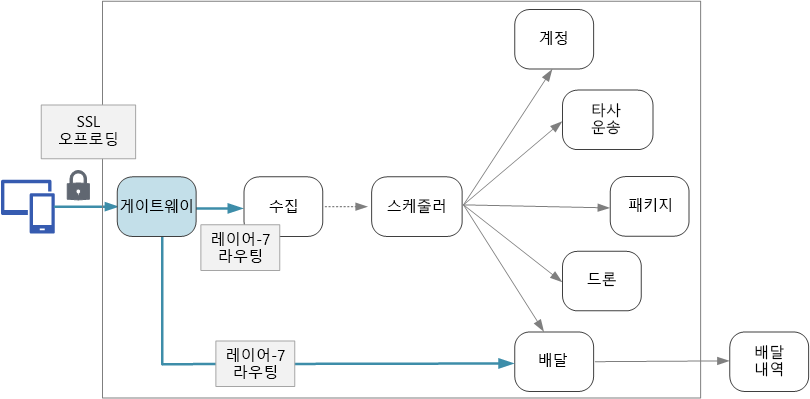

# 마이크로 서비스 디자인: API 게이트웨이Designing microservices: API gateways

마이크로 서비스 아키텍처에서 클라이언트는 둘 이상의 프런트 엔드 서비스와 상호 작용할 수 있습니다.In a microservices architecture, a client might interact with more than one front-end service. 이 사실을 감안할 때 클라이언트가 호출할 엔드포인트를 어떻게 알 수 있나요?Given this fact, how does a client know what endpoints to call? 새 서비스가 도입되거나 기존 서비스가 리팩터링되면 어떻게 되나요?What happens when new services are introduced, or existing services are refactored? 서비스에서 SSL 종료, 인증 및 기타 고려 사항을 어떻게 처리하나요?How do services handle SSL termination, authentication, and other concerns? *API 게이트웨이*는 이러한 도전 과제를 처리하는 데 도움이 됩니다.An *API gateway* can help to address these challenges. 

## API 게이트웨이란?What is an API gateway?

API 게이트웨이는 클라이언트와 서비스 사이에 배치합니다.An API gateway sits between clients and services. 역방향 프록시로 작동하면서 클라이언트에서 서비스로 요청을 라우팅합니다.It acts as a reverse proxy, routing requests from clients to services. 또한 인증, SSL 종료 및 속도 제한과 같은 다양한 교차 작업을 수행할 수도 있습니다.It may also perform various cross-cutting tasks such as authentication, SSL termination, and rate limiting. 게이트웨이를 배포하지 않으면 클라이언트는 프런트 엔드 서비스로 직접 요청을 보내야 합니다.If you don't deploy a gateway, clients must send requests directly to front-end services. 단, 서비스를 클라이언트에 직접 노출하는 데에는 몇 가지 잠재적인 문제가 있습니다.However, there are some potential problems with exposing services directly to clients:

- 클라이언트 코드가 복잡해질 수 있습니다.It can result in complex client code. 클라이언트는 여러 엔드포인트를 추적해야 하고 복원성 있는 방식으로 오류를 처리해야 합니다.The client must keep track of multiple endpoints, and handle failures in a resilient way. 
- 클라이언트와 백 엔드 간의 결합을 만듭니다.It creates coupling between the client and the backend. 클라이언트는 개별 서비스가 분해되는 방식을 알아야 합니다.The client needs to know how the individual services are decomposed. 따라서 클라이언트 유지 관리가 어렵고 서비스를 리팩터링하는 것도 더 어렵습니다.That makes it harder to maintain the client and also harder to refactor services.
- 단일 작업에 여러 서비스에 대한 호출이 필요할 수 있습니다.A single operation might require calls to multiple services. 이로 인해 클라이언트와 서버 사이에 다수의 네트워크 왕복이 발생하여 상당한 대기 시간이 추가될 수 있습니다.That can result in multiple network round trips between the client and the server, adding significant latency. 
- 각각의 공용 서비스는 인증, SSL 및 클라이언트 속도 제한 등의 문제를 처리해야 합니다.Each public-facing service must handle concerns such as authentication, SSL, and client rate limiting. 
- 서비스는 HTTP나 WebSocket과 같은 클라이언트 친화적인 프로토콜을 노출해야 합니다.Services must expose a client-friendly protocol such as HTTP or WebSocket. 이로 인해 [통신 프로토콜](./interservice-communication.md) 선택이 제한됩니다.This limits the choice of [communication protocols](./interservice-communication.md). 
- 공용 엔드포인트가 있는 서비스는 잠재적으로 공격에 대한 취약성이며 강화되어야 합니다.Services with public endpoints are a potential attack surface, and must be hardened.

게이트웨이는 서비스에서 클라이언트를 분리하여 이러한 문제를 해결하는 데 도움이 됩니다.A gateway helps to address these issues by decoupling clients from services. 게이트웨이는 다양한 기능을 수행할 수 있으며 이러한 기능이 모두 필요하지 않을 수 있습니다.Gateways can perform a number of different functions, and you may not need all of them. 함수는 다음과 같은 디자인 패턴으로 그룹화할 수 있습니다.The functions can be grouped into the following design patterns:

[게이트웨이 라우팅](../patterns/gateway-routing.md).[Gateway Routing](../patterns/gateway-routing.md). 계층 7 라우팅을 사용하여 게이트웨이를 역방향 프록시로 사용하여 하나 이상의 백 엔드 서비스로 요청을 라우팅합니다.Use the gateway as a reverse proxy to route requests to one or more backend services, using layer 7 routing. 게이트웨이는 클라이언트용 단일 엔드포인트를 제공하고 서비스에서 클라이언트를 분리하는 데 도움이 됩니다.The gateway provides a single endpoint for clients, and helps to decouple clients from services. 

[게이트웨이 집계](../patterns/gateway-aggregation.md).[Gateway Aggregation](../patterns/gateway-aggregation.md). 게이트웨이를 사용하여 여러 개별 요청을 단일 요청으로 집계합니다.Use the gateway to aggregate multiple individual requests into a single request. 이 패턴은 단일 작업에 여러 백엔드 서비스에 대한 호출이 필요한 경우에 적용됩니다.This pattern applies when a single operation requires calls to multiple backend services. 클라이언트는 하나의 요청을 게이트웨이로 전송합니다.The client sends one request to the gateway. 게이트웨이는 다양한 백 엔드 서비스에 요청을 발송한 다음 결과를 집계하여 클라이언트에 다시 보냅니다.The gateway dispatches requests to the various backend services, and then aggregates the results and sends them back to the client. 이렇게 하면 클라이언트와 백 엔드 사이에 전송량을 줄이는 데 도움이 됩니다.This helps to reduce chattiness between the client and the backend. 

[게이트웨이 오프로딩](../patterns/gateway-offloading.md).[Gateway Offloading](../patterns/gateway-offloading.md). 게이트웨이를 사용하여 개별 서비스의 기능, 특히 교차 작업을 게이트웨이로 오프로드 할 수 있습니다.Use the gateway to offload functionality from individual services to the gateway, particularly cross-cutting concerns. 이러한 기능을 모든 서비스가 구현하도록 하는 대신 한 곳에 통합하는 것이 유용할 수 있습니다.It can be useful to consolidate these functions into one place, rather than making every service responsible for implementing them. 인증 및 권한 부여와 같이 올바르게 구현해야 하는 특수 기술이 필요한 기능의 경우 특히 그렇습니다.This is particularly true for features that requires specialized skills to implement correctly, such as authentication and authorization. 

다음은 게이트웨이에 오프로드할 수 있는 기능의 몇 가지 예입니다.Here are some examples of functionality that could be offloaded to a gateway:

- SSL 종료SSL termination
- 인증Authentication
- IP 허용 목록IP whitelisting
- 클라이언트 속도 제한(제한)Client rate limiting (throttling)
- 로깅 및 모니터링Logging and monitoring
- 응답 캐싱Response caching
- 웹 응용 프로그램 방화벽Web application firewall
- GZIP 압축GZIP compression
- 정적 콘텐츠 서비스Servicing static content

## 게이트웨이 기술 선택Choosing a gateway technology

다음은 응용 프로그램에 API 게이트웨이를 구현하는 몇 가지 옵션입니다.Here are some options for implementing an API gateway in your application.

- **역방향 프록시 서버**.**Reverse proxy server**. Nginx 및 HAProxy는 많이 사용되는 역방향 프록시 서버이며 부하 분산, SSL 및 계층 7 라우팅과 같은 기능을 지원합니다.Nginx and HAProxy are popular reverse proxy servers that support features such as load balancing, SSL, and layer 7 routing. 두 가지 모두 무료 오픈 소스 제품이며 추가 기능과 지원 옵션을 제공하는 유료 버전이 있습니다.They are both free, open-source products, with paid editions that provide additional features and support options. Nginx 및 HAProxy 모두 다양한 기능 집합이 있는 고성능의 완성도 높은 제품입니다.Nginx and HAProxy are both mature products with rich feature sets and high performance. 타사 모듈을 사용하거나 Lua에 사용자 지정 스크립트를 작성하여 확장할 수 있습니다.You can extend them with third-party modules or by writing custom scripts in Lua. Nginx는 NginScript라는 JavaScript 기반 스크립팅 모듈을 지원합니다.Nginx also supports a JavaScript-based scripting module called NginScript.

- **서비스 메시 수신 컨트롤러**.**Service mesh ingress controller**. linkerd 또는 Istio와 같은 서비스 메시를 사용하는 경우에는 해당 서비스 메시에 대해 수신 컨트롤러가 제공하는 기능을 고려합니다.If you are using a service mesh such as linkerd or Istio, consider the features that are provided by the ingress controller for that service mesh. 예를 들어 Istio 수신 컨트롤러는 계층 7 라우팅, HTTP 리디렉션, 다시 시도 및 기타 기능을 지원합니다.For example, the Istio ingress controller supports layer 7 routing, HTTP redirects, retries, and other features. 

- [Azure Application Gateway](/azure/application-gateway/).[Azure Application Gateway](/azure/application-gateway/). Application Gateway는 계층 7 라우팅과 SSL 종료를 수행할 수 있는 관리되는 부하 분산 서비스입니다.Application Gateway is a managed load balancing service that can perform layer-7 routing and SSL termination. WAF(웹 응용 프로그램 방화벽)도 제공합니다.It also provides a web application firewall (WAF).

- [Azure API Management](/azure/api-management/).[Azure API Management](/azure/api-management/). API Management는 외부 및 내부 소비자에게 API를 게시하기 위한 턴키 방식 솔루션입니다.API Management is a turnkey solution for publishing APIs to external and internal customers. Azure Active Directory나 기타 ID 공급자를 사용하여 속도 제한, IP 허용 목록 및 인증을 비롯한 공용 API를 관리하는 데 유용한 기능을 제공합니다.It provides features that are useful for managing a public-facing API, including rate limiting, IP white listing, and authentication using Azure Active Directory or other identity providers. API Management는 부하 분산을 수행하지 않기 때문에 Application Gateway나 역방향 프록시와 같은 부하 분산 장치와 결합하여 사용해야 합니다.API Management doesn't perform any load balancing, so it should be used in conjunction with a load balancer such as Application Gateway or a reverse proxy.

게이트웨이 기술을 선택할 때 다음 사항을 고려하십시오.When choosing a gateway technology, consider the following:

**기능**.**Features**. 위에 나열된 옵션은 모두 계층 7 라우팅을 지원하지만 다른 기능에 대한 지원은 다양합니다.The options listed above all support layer 7 routing, but support for other features will vary. 필요한 기능에 따라 둘 이상의 게이트웨이를 배포할 수 있습니다.Depending on the features that you need, you might deploy more than one gateway. 

**배포**.**Deployment**. Azure Application Gateway와 API Management는 관리되는 서비스입니다.Azure Application Gateway and API Management are managed services. Nginx 및 HAProxy는 일반적으로 클러스터 내부의 컨테이너에서 실행되지만 클러스터 외부의 전용 VM에도 배포할 수 있습니다.Nginx and HAProxy will typically run in containers inside the cluster, but can also be deployed to dedicated VMs outside of the cluster. 이렇게 하면 게이트웨이가 워크로드의 나머지 부분과 격리되지만 관리 오버헤드가 더 높아집니다.This isolates the gateway from the rest of the workload, but incurs higher management overhead.

**관리**.**Management**. 서비스가 업데이트되거나 새 서비스가 추가되면 게이트웨이 라우팅 규칙을 업데이트해야 할 수 있습니다.When services are updated or new services are added, the gateway routing rules may need to be updated. 이 프로세스를 어떻게 관리할지 고려해야 합니다.Consider how this process will be managed. SSL 인증서, IP 허용 목록 및 기타 구성 측면을 관리하는 경우에도 비슷한 고려 사항이 적용됩니다.Similar considerations apply to managing SSL certificates, IP whitelists, and other aspects of configuration.

## 배포 고려 사항Deployment considerations

### Kubernetes에 Nginx 또는 HAProxy 배포Deploying Nginx or HAProxy to Kubernetes

Nginx 또는 HAProxy를 Nginx 또는 HAProxy 컨테이너 이미지를 지정하는 [ReplicaSet](https://kubernetes.io/docs/concepts/workloads/controllers/replicaset/) 또는[DaemonSet](https://kubernetes.io/docs/concepts/workloads/controllers/daemonset/)으로 Kubernetes에 배포할 수 있습니다.You can deploy Nginx or HAProxy to Kubernetes as a [ReplicaSet](https://kubernetes.io/docs/concepts/workloads/controllers/replicaset/) or [DaemonSet](https://kubernetes.io/docs/concepts/workloads/controllers/daemonset/) that specifies the Nginx or HAProxy container image. ConfigMap을 사용하여 프록시에 대한 구성 파일을 저장하고 ConfigMap을 볼륨으로 탑재합니다.Use a ConfigMap to store the configuration file for the proxy, and mount the ConfigMap as a volume. Azure Load Balancer를 통해 게이트웨이를 노출하려면 LoadBalancer 유형의 서비스를 만듭니다.Create a service of type LoadBalancer to expose the gateway through an Azure Load Balancer. 

<!-- - Configure a readiness probe that serves a static file from the gateway (rather than routing to another service). -->

대안은 수신 컨트롤러를 만드는 것입니다.An alternative is to create an Ingress Controller. 수신 컨트롤러는 부하 분산 장치 또는 역방향 프록시 서버를 배포하는 Kubernetes 리소스입니다.An Ingress Controller is a Kubernetes resource that deploys a load balancer or reverse proxy server. Nginx와 HAProxy를 비롯한 여러 가지 구현이 존재합니다.Several implementations exist, including Nginx and HAProxy. Ingress라는 별도의 리소스는 라우팅 규칙 및 TLS 인증서와 같은 수신 컨트롤러에 대한 설정을 정의합니다.A separate resource called an Ingress defines settings for the Ingress Controller, such as routing rules and TLS certificates. 이렇게 하면 특정 프록시 서버 기술과 관련된 복잡한 구성 파일을 관리할 필요가 없습니다.That way, you don't need to manage complex configuration files that are specific to a particular proxy server technology. 수신 컨트롤러는 이 문서를 작성 당시를 기준으로 아직 Kubernetes의 베타 기능이며 계속해서 발전할 것입니다.Ingress Controllers are still a beta feature of Kubernetes at the time of this writing, and the feature will continue to evolve.

게이트웨이는 잠재적인 병목 현상 또는 시스템의 SPOF이기 때문에 고가용성을 위해 항상 두 개 이상의 복제본 배포하십시오.The gateway is a potential bottleneck or single point of failure in the system, so always deploy at least two replicas for high availability. 부하에 따라 복제본을 더 확장해야 할 수도 있습니다.You may need to scale out the replicas further, depending on the load. 

또한 클러스터의 전용 노드 집합에서 게이트웨이를 실행하는 것도 좋습니다.Also consider running the gateway on a dedicated set of nodes in the cluster. 이 방법의 이점은 다음과 같습니다.Benefits to this approach include:

- 격리.Isolation. 모든 인바운드 트래픽은 백 엔드 서비스와 격리될 수 있는 고정된 노드 집합으로 이동합니다.All inbound traffic goes to a fixed set of nodes, which can be isolated from backend services.

- 안정적인 구성.Stable configuration. 게이트웨이를 잘못 구성하면 전체 응용 프로그램을 사용할 수 없게 될 수 있습니다.If the gateway is misconfigured, the entire application may become unavailable. 

- 성능.Performance. 성능상의 이유로 특정 VM 구성을 게이트웨이에 사용할 수 있습니다.You may want to use a specific VM configuration for the gateway for performance reasons.

<!-- - Load balancing. You can configure the external load balancer so that requests always go to a gateway node. That can save a network hop, which would otherwise happen whenever a request lands on a node that isn't running a gateway pod. This consideration applies mainly to large clusters, where the gateway runs on a relatively small fraction of the total nodes. In Azure Container Service (ACS), this approach currently requires [ACS Engine](https://github.com/Azure/acs-engine)) which allows you to create multiple agent pools. Then you can deploy the gateway as a DaemonSet to the front-end pool. -->

### Azure Application GatewayAzure Application Gateway

Azure에서 Application Gateway를 Kubernetes 클러스터에 연결하려면:To connect Application Gateway to a Kubernetes cluster in Azure:

1. 클러스터 VNet에 빈 서브넷을 만듭니다.Create an empty subnet in the cluster VNet.
2. Application Gateway를 배포합니다.Deploy Application Gateway.
3. type=[NodePort](https://kubernetes.io/docs/concepts/services-networking/service/#type-nodeport)로 Kubernetes 서비스를 만듭니다.Create a Kubernetes service with type=[NodePort](https://kubernetes.io/docs/concepts/services-networking/service/#type-nodeport). 이렇게 하면 클러스터 외부에서 도달할 수 있도록 각 노드의 서비스가 노출됩니다.This exposes the service on each node so that it can be reached from outside the cluster. 부하 분산 장치는 만들지 않습니다.It does not create a load balancer.
5. 서비스에 할당된 포트 번호를 가져옵니다.Get the assigned port number for the service.
6. 다음과 같은 경우 Application Gateway 규칙을 추가합니다.Add an Application Gateway rule where:
    - 백엔드 풀에 에이전트 VM이 포함됩니다.The backend pool contains the agent VMs.
    - HTTP 설정에서 서비스 포트 번호를 지정합니다.The HTTP setting specifies the service port number.
    - 게이트웨이 수신기가 포트 80/443에서 수신 대기합니다.The gateway listener listens on ports 80/443
    
고가용성을 위해 인스턴스 수를 2 이상으로 설정합니다.Set the instance count to 2 or more for high availability.

### Azure API ManagementAzure API Management 

Azure에서 API Management를 Kubernetes 클러스터에 연결하려면:To connect API Management to a Kubernetes cluster in Azure:

1. 클러스터 VNet에 빈 서브넷을 만듭니다.Create an empty subnet in the cluster VNet.
2. 이 서브넷에 API Management를 배포합니다.Deploy API Management to that subnet.
3. LoadBalancer 유형의 Kubernetes 서비스를 만듭니다.Create a Kubernetes service of type LoadBalancer. [내부 부하 분산 장치](https://kubernetes.io/docs/concepts/services-networking/service/#internal-load-balancer) 주석을 사용하여 기본값인 인터넷 연결 부하 분산 장치 대신 내부 부하 분산 장치를 만듭니다.Use the [internal load balancer](https://kubernetes.io/docs/concepts/services-networking/service/#internal-load-balancer) annotation to create an internal load balancer, instead of an Internet-facing load balancer, which is the default.
4. kubectl 또는 Azure CLI를 사용하여 내부 부하 분산 장치의 개인 IP를 찾습니다.Find the private IP of the internal load balancer, using kubectl or the Azure CLI.
5. API 관리를 사용하여 부하 분산 장치의 개인 IP 주소에 보내는 API를 만듭니다.Use API Management to create an API that directs to the private IP address of the load balancer.

Nginx, HAProxy 또는 Azure Application Gateway든 상관 없이, API Management와 역방향 프록시를 결합하는 것이 좋습니다.Consider combining API Management with a reverse proxy, whether Nginx, HAProxy, or Azure Application Gateway. Application Gateway에서 API Management를 사용하는 방법에 대한 자세한 내용은 [내부 VNET에서 Application Gateway와 API Management 통합](/azure/api-management/api-management-howto-integrate-internal-vnet-appgateway)을 참조하세요.For information about using API Management with Application Gateway, see [Integrate API Management in an internal VNET with Application Gateway](/azure/api-management/api-management-howto-integrate-internal-vnet-appgateway).

> [!div class="nextstepaction"]
> [로깅 및 모니터링Logging and monitoring](./logging-monitoring.md)
