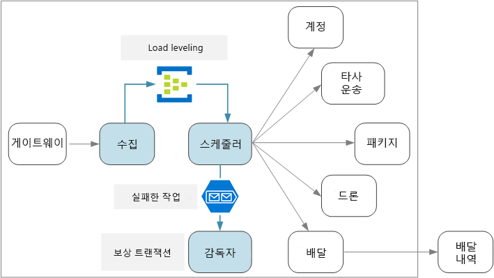
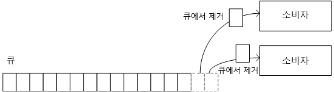
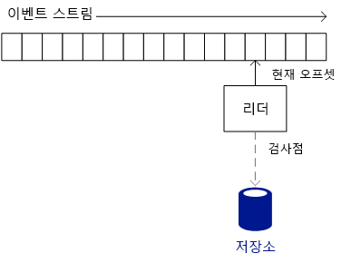
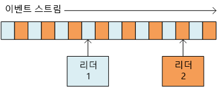
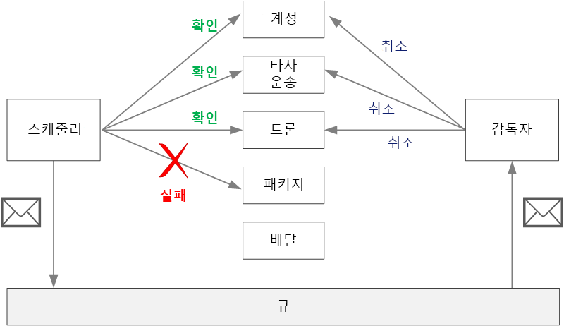

# <a name="designing-microservices-ingestion-and-workflow"></a>마이크로 서비스 디자인: 수집 및 워크플로

마이크로 서비스에는 단일 트랜잭션을 위한 워크플로가 여러 서비스에 걸쳐있는 있는 경우가 있습니다. 워크플로에는 신뢰성이 필요합니다. 트랜잭션을 손실하거나 부분적으로 완료된 상태로 남겨 둘 수 없습니다. 들어오는 요청의 수집 속도를 제어하는 것도 중요합니다. 서로 통신하는 소규모 서비스가 많은 경우 들어오는 요청이 폭증하면 서비스 간 통신이 압도될 수 있습니다. 



## <a name="the-drone-delivery-workflow"></a>드론 배달 워크플로

드론 배달 응용 프로그램에서 배달을 예약하려면 다음 작업을 수행해야 합니다.

1. 고객의 계정 상태를 확인합니다(계정 서비스).
2. 새 패키지 엔터티를 만듭니다(패키지 서비스).
3. 픽업 및 배달 위치에 따라 타사 전송이 필요한지 확인합니다(타사 전송 서비스).
4. 픽업을 위해 드론을 예약합니다(드론 서비스).
5. 새 배달 엔터티를 만듭니다(배달 서비스).

이것이 전체 응용 프로그램의 핵심이므로 종단 간 프로세스가 성능 기준에 맞아야 할뿐만 아니라 신뢰성이 있어야 합니다. 몇 가지 특정 과제를 반드시 해결해야 합니다.

- **부하 평준화**. 클라이언트 요청이 너무 많으면 서비스 간 네트워크 트래픽으로 인해 시스템이 압도될 수 있습니다. 이로 인해 저장소나 원격 서비스와 같은 백 엔드 종속성이 압도될 수도 있습니다. 이러한 문제는 시스템에서 역 압력(backpressure)을 생성하여 호출하는 서비스를 제한하는 방식으로 대응할 수 있습니다. 따라서 시스템에 들어오는 요청을 버퍼나 큐에 넣어 처리하는 방식으로 요청의 부하를 평준화하는 것이 중요합니다. 

- **배달 보장**. 클라이언트 요청이 누락되는 것을 방지하기 위해 수집 구성 요소는 한 번 이상의 메시지 배달을 반드시 보장해야 합니다. 

- **오류 처리**. 오류를 반환하는 서비스가 있거나 일시적인 오류가 발생하면 배달을 예약할 수 없습니다. 오류 코드는 예상되는 오류 상태(예: 고객의 계정이 중지됨) 또는 예기치 않은 서버 오류(HTTP 5xx)를 표시할 수 있습니다. 서비스를 사용할 수 없어서 네트워크 호출 시간이 초과될 수도 있습니다. 

우선 수식의 수집 측면 &mdash; 즉 시스템에서 들어오는 사용자 요청을 높은 처리량으로 처리하는 방법을 살펴 보겠습니다. 그런 다음 무인 드론 배달 응용 프로그램으로 안정적인 워크플로를 구현하는 방법을 살펴보겠습니다. 수집 하위 시스템 디자인은 워크플로 백 엔드에 영향을 미칩니다. 

## <a name="ingestion"></a>수집

개발 팀은 비즈니스 요구 사항을 기반으로 수집에 대해 다음과 같은 비기능적인 요구 사항을 파악했습니다.

- 지속적인 처리량: 초당 요청 10,000건
- 클라이언트 요청 손실이나 시간 초과 없이 초당 최대 50,000건의 스파이크 처리 가능
- 99번째 백분위수에서 500밀리초 미만의 대기 시간

트래픽에 종종 발생하는 스파이크를 처리하기 위한 요구 사항으로 인해 디자인에 어려움이 있습니다. 이론상으로는 최대 예상 트래픽을 처리하도록 시스템을 확장할 수 있습니다. 그러나 많은 자원을 프로비전하는 것은 매우 비효율적입니다. 대부분의 경우, 응용 프로그램에 그만큼의 용량이 필요하지 않아서 유휴 코어가 발생하기 때문에 가치는 창출하지 않고 비용만 소비하게 됩니다.

더 좋은 방법은 들어오는 요청을 버퍼에 넣고 버퍼를 부하 평준화 도구로 작동시키는 것입니다. 이렇게 디자인하면 수집 서비스는 짧은 기간 동안 최대 수집 속도를 처리할 수 있어야 하지만 백 엔드 서비스는 최대 지속 부하만 처리하면 됩니다. 프런트 엔드에서 버퍼링을 하기 때문에 백엔드 서비스는 트래픽의 대규모 스파이크를 처리할 필요가 없습니다. 드론 배달 응용 프로그램에 필요한 규모에서 [Azure Event Hubs](/azure/event-hubs/)는 부하 평준화에 적합한 선택입니다. Event Hubs는 낮은 대기 시간과 높은 처리량을 제공하며 수집 볼륨이 많은 경우에 비용 효율적인 솔루션입니다. 

테스트에서는 파티션이 32개이고 처리량 단위가 100인 표준 계층 이벤트 허브를 사용합니다. 대기 시간 90밀리초, 초당 32,000개 정도의 이벤트 수집이 관찰되었습니다. 현재 기본 제한 처리량 단위는 20이지만 Azure 고객이 지원 요청을 입력하여 처리량 단위를 추가로 요청할 수 있습니다. 자세한 내용은 [Event Hubs 할당량](/azure/event-hubs/event-hubs-quotas)을 참조하세요. 모든 성능 메트릭과 마찬가지로 메시지 페이로드 크기와 같은 여러 요소가 성능에 영향을 줄 수 있으므로 이러한 수치를 벤치마크로 해석하지 않도록 해야 합니다. 처리량이 더 필요한 경우 수집 서비스는 둘 이상의 이벤트 허브에서 분할될 수 있습니다. 훨씬 더 높은 처리량 속도를 위해 [전용 Event Hubs](/azure/event-hubs/event-hubs-dedicated-overview)에 초당 2백만 개 이상의 이벤트를 수신할 수 있는 단일 테넌트 배포가 제공됩니다.

Event Hubs에서 이렇게 높은 처리량을 구현하는 방법을 이해하는 것은 중요합니다. 클라이언트가 Event Hubs의 메시지를 소비하는 방법에 영향을 미치기 때문입니다. Event Hubs는 *큐*를 구현하지 않습니다. 대신 *이벤트 스트림*을 구현합니다. 

큐를 사용하면 개별 소비자가 큐에서 메시지를 제거할 수 있어서 다음 소비자가 해당 메시지를 볼 수 없습니다. 따라서 큐를 사용하면 [경쟁 소비자 패턴](../patterns/competing-consumers.md)을 사용하여 메시지를 병렬 처리하고 확장성을 높일 수 있습니다. 복원력을 높이기 위해 소비자는 메시지를 잠근 상태로 유지하고 메시지 처리가 완료되면 잠금을 해제합니다. 소비자가 실패하면 &mdash;예를 들어, 실행 중인 노드가 충돌하면&mdash; 잠금 시간이 초과되고 메시지는 큐로 다시 돌아갑니다. 



반면에 Event Hubs는 스트리밍 의미 체계를 사용합니다. 소비자는 자신의 속도에 맞게 독립적으로 스트림을 읽습니다. 각 소비자는 스트림에서 현재 위치를 추적하는 일을 담당합니다. 소비자는 미리 정의된 간격으로 영구 저장소에 현재 위치를 기록해야 합니다. 이렇게 하면 소비자에게 오류가 발생하는 경우(예: 소비자에게 충돌이나 호스트 장애가 발생하는 경우) 새 인스턴스가 마지막으로 기록된 위치에서 스트림 읽기를 다시 시작할 수 있습니다. 이러한 프로세스를 *검사점 설정*이라고 합니다. 

성능을 위해 소비자는 일반적으로 각 메시지 이후에 검사점을 설정하지 않습니다. 대신 고정된 간격으로(예: *n* 메시지를 처리한 후 또는 *n*초마다) 검사점을 설정합니다. 결과적으로 소비자에게 오류가 발생하면 마지막 검사점에서 새 인스턴스를 항상 픽업하기 때문에 일부 이벤트는 두 번 처리될 수 있습니다. 여기에는 장단점이 있습니다. 검사점이 빈번하면 성능이 저하될 수 있지만 검사점이 드물면 오류가 발생한 후 더 많은 이벤트를 다시 재생합니다.  


 
Event Hubs는 경쟁 소비자에 맞게 설계되지 않았습니다. 여러 소비자가 하나의 스트림을 읽을 수 있지만 각 소비자는 스트림을 독립적으로 통과합니다. 대신 Event Hubs는 분할된 소비자 패턴을 사용합니다. 이벤트 허브에는 최대 32개의 파티션이 있습니다. 수평 확장은 각 파티션에 별도의 소비자를 할당하여 구현됩니다.

이것은 드론 배달 워크플로에 어떤 의미일까요? Event Hubs를 최대한 활용하기 위해서 Delivery Scheduler는 다음 메시지로 이동하기 전에 각 메시지가 처리되기를 기다릴 수 없습니다. 만약 그렇게 되면 대부분의 시간을 네트워크 호출이 완료되기를 기다리는 데 소비하게 됩니다. 대신 백 엔드 서비스에 대한 비동기 호출을 사용하여 일괄 처리 메시지를 병렬로 처리해야 합니다. 앞으로 살펴보겠지만 올바른 검사점 설정 전략을 선택하는 것도 중요합니다.  

## <a name="workflow"></a>워크플로

메시지를 읽고 처리하는 이벤트 프로세서 호스트, Service Bus 큐 및 IoTHub React 라이브러리라는 세 가지 옵션을 살펴보았습니다. IoTHub React를 선택했지만 이유를 이해하기 위해서는 이벤트 프로세서 호스트부터 시작하는 것이 좋습니다. 

### <a name="event-processor-host"></a>이벤트 프로세서 호스트

이벤트 프로세서 호스트는 메시지 일괄 처리를 위해 설계되었습니다. 응용 프로그램은 `IEventProcessor` 인터페이스를 구현하고 프로세서 호스트는 이벤트 허브의 각 파티션에 대해 하나의 이벤트 허브 프로세서를 만듭니다. 그런 다름 이벤트 프로세서 호스트는 각 이벤트 프로세서의 `ProcessEventsAsync` 메서드를 일괄 처리 이벤트 메시지와 함께 호출합니다. 응용 프로그램은 `ProcessEventsAsync` 메서드 내에서 검사점을 설정할 시기를 제어하고 이벤트 프로세서 호스트는 Azure 저장소에 검사점을 작성합니다. 

파티션 내에서 이벤트 프로세서 호스트는 다음 일괄 처리를 다시 호출하기 전에 반환할 `ProcessEventsAsync`를 기다립니다. 이 방법은 이벤트 처리 코드를 재진입할 필요가 없기 때문에 프로그래밍 모델을 간소화합니다. 하지만 이벤트 프로세서가 한 번에 하나의 일괄 처리를 수행하기 때문에 프로세서 호스트가 메시지를 펌핑할 수 있는 속도를 제어합니다.

> [!NOTE] 
> 프로세서 호스트는 스레드를 차단하는 의미로 *대기*하지 않습니다. `ProcessEventsAsync` 메서드가 비동기식이기 때문에 프로세서 호스트는 메서드가 완료되는 동안 다른 작업을 수행할 수 있습니다. 하지만 메서드가 반환될 때 까지 해당 파티션에 대해 다른 일괄 처리 메시지를 전달하지 않습니다. 

드론 응용 프로그램에서 일괄 처리 메시지는 병렬로 처리될 수 있습니다. 하지만 전체 일괄 처리가 완료되기까지 대기하면 병목 현상이 여전히 발생할 수 있습니다. 처리 속도는 일괄 처리 내에서 가장 느린 메시지 만큼만 빠를 수 있습니다. 응답 시간이 변하면 "꼬리가 길어질 수” 있으며 느린 응답으로 인해 전체 시스템이 느려질 수 있습니다. 성능 테스트에 따르면 이러한 방법을 사용하여 목표 처리량을 달성하지 못한 것으로 나타났습니다. 그렇다고 이벤트 프로세서 호스트를 사용하지 말아야 한다는 것을 의미하지는 *않습니다*. 하지만 처리량을 높이려면 `ProcesssEventsAsync` 메서드 내에서 오래 실행되는 작업을 수행하지 마십시오. 각각의 일괄 처리를 신속하게 처리하십시오.

### <a name="iothub-react"></a>IotHub React 

[IotHub React](https://github.com/Azure/toketi-iothubreact)는 Event Hub의 이벤트를 읽는 Akka Streams 라이브러리입니다. Akka Streams는 [Reactive Streams](http://www.reactive-streams.org/) 사양을 구현하는 스트림 기반 프로그래밍 프레임워크입니다. 모든 스트리밍 작업이 비동기적으로 수행되고 파이프라인은 정상적으로 역 압력(backpressure)을 처리는 효율적인 스트리밍 파이프라인을 구축하는 방법을 제공합니다. 역 압력(backpressure)은 이벤트 원본이 다운스트림 소비자가 수신할 수 있는 것보다 빠른 속도로 이벤트를 생성하는 경우 발생하며 &mdash; 드론 배달 시스템의 트래픽이 급증하는 상황과 정확히 일치합니다. 백 엔드 서비스가 느려지면 IoTHub React가 느려집니다. 용량이 증가하면 IoTHub React는 파이프라인을 통해 더 많은 메시지를 푸시합니다.

Akka Streams는 Event Hubs의 스트리밍 이벤트의 매우 자연스러운 프로그래밍 모델이기도 합니다. 일괄 처리 이벤트를 반복하는 대신 각 이벤트에 적용할 작업 집합을 정의하여 Akka Streams에서 스트리밍을 처리하도록 합니다. Akka Streams는 *소스*, *흐름* 및 *싱크* 측면에서 스트리밍 파이프라인을 정의합니다. 원본은 출력 스트림을 생성하고, 흐름은 입력 스트림을 처리하고 출력 스트림을 생성하며, 싱크는 출력을 생성하지 않고 스트림을 소비합니다.

Akka Streams 파이프라인을 설정하는 Scheduler 서비스의 코드는 다음과 같습니다.

```java
IoTHub iotHub = new IoTHub();
Source<MessageFromDevice, NotUsed> messages = iotHub.source(options);

messages.map(msg -> DeliveryRequestEventProcessor.parseDeliveryRequest(msg))
        .filter(ad -> ad.getDelivery() != null).via(deliveryProcessor()).to(iotHub.checkpointSink())
        .run(streamMaterializer);
```

이 코드는 Event Hubs를 원본으로 구성합니다. `map` 문은 배달 요청을 나타내는 Java 클래스로 각 이벤트 메시지를 deserialize합니다. `filter` 문은 스트림에서 `null` 개체를 제거하며, 이를 통해 메시지를 deserialize할 수 없는 경우에 대비합니다. `via` 문은 각 배달 요청을 처리하는 흐름에 원본을 조언합니다. `to` 메서드는 IoTHub React에 내장된 검사점 싱크에 흐름을 조인합니다.

IoTHub React는 이벤트 호스트 프로세서와 다른 검사점 설정 전략을 사용합니다. 검사점은 파이프라인의 종료 단계인 검사점 싱크에 의해 작성됩니다. Akka Streams 디자인을 사용하면 싱크에서 검사점을 작성하는 동안 파이프라인에서 스트리밍을 계속 수행할 수 있습니다. 즉, 검사점이 설정될 때까지 업스트림 프로세싱 단계가 기다릴 필요가 없습니다. 시간이 초과된 후 또는 특정 수의 메시지가 처리된 후 검사점이 설정되도록 구성할 수 있습니다.

`deliveryProcessor` 메서드는 Akka Streams 흐름을 생성합니다.  

```java
private static Flow<AkkaDelivery, MessageFromDevice, NotUsed> deliveryProcessor() {
    return Flow.of(AkkaDelivery.class).map(delivery -> {
        CompletableFuture<DeliverySchedule> completableSchedule = DeliveryRequestEventProcessor
                .processDeliveryRequestAsync(delivery.getDelivery(), 
                        delivery.getMessageFromDevice().properties());
        
        completableSchedule.whenComplete((deliverySchedule,error) -> {
            if (error!=null){
                Log.info("failed delivery" + error.getStackTrace());
            }
            else{
                Log.info("Completed Delivery",deliverySchedule.toString());
            }
                                
        });
        completableSchedule = null;
        return delivery.getMessageFromDevice();
    });
}
```

이 흐름은 각 메시지를 처리하는 실제 작업을 수행하는 정적 `processDeliveryRequestAsync` 메서드를 호출합니다.

### <a name="scaling-with-iothub-react"></a>IoTHub React로 크기 조정

Scheduler 서비스는 각 컨테이너 인스턴스가 단일 파티션에서 읽을 수 있도록 설계되었습니다. 예를 들어 Event Hubs에 32개의 파티션이 있는 경우 Scheduler 서비스는 32개의 복제본으로 배포됩니다. 따라서 수평 확장의 측면에서 유연성이 큽니다. 

클러스터의 크기에 따라 클러스터의 노드에 둘 이상의 Scheduler 서비스 Pod가 실행 중일 수 있습니다. 하지만 Scheduler 서비스에 리소스가 더 필요하면 더 많은 노드에 Pod를 배포하기 위해 클러스터를 확장할 수 있습니다. 성능 테스트에 따르면 Scheduler 서비스는 메모리 및 스레드에 바운딩되므로 VM 크기와 노드당 Pod 수에 따라 성능이 크게 달라지는 것으로 나타납니다.

각 인스턴스는 읽을 수 있는 Event Hubs 파티션을 알아야 합니다. 파티션 번호를 구성하기 위해 Kubernetes의 [StatefulSet](https://kubernetes.io/docs/concepts/workloads/controllers/statefulset/) 리소스 유형이 활용되었습니다. StatefulSet의 Pod에는 숫자 인덱스가 포함된 영구 식별자가 있습니다. 구체적으로 Pod 이름은 `<statefulset name>-<index>`이며 Kubernetes [Downward API](https://kubernetes.io/docs/tasks/inject-data-application/downward-api-volume-expose-pod-information/)를 통해 컨테이너에서 이 값을 사용할 수 있습니다. 런타임 시 Scheduler 서비스는 Pod 이름을 읽고 Pod 인덱스를 파티션 ID로 사용합니다.

Scheduler 서비스를 훨씬 더 확장해야 하는 경우 이벤트 허브 파티션 당 둘 이상의 Pod를 지정하여 여러 개의 Pod가 각 파티션을 읽도록 할 수 있습니다. 단, 이런 경우 각 인스턴스는 할당된 파티션의 모든 이벤트를 읽습니다. 중복 처리를 방지하려면 각 인스턴스가 메시지의 일부를 건너뛸 수 있도록 해싱 알고리즘을 사용해야 합니다. 이렇게 하면 여러 판독기가 스트림을 소비할 수 있지만 모든 메시지는 하나의 인스턴스에서만 처리됩니다. 
 


### <a name="service-bus-queues"></a>Service Bus 큐

세 번째로 고려한 옵션은 Event Hubs의 메시지를 Service Bus 큐에 복사한 다음 Scheduler 서비스에서 Service Bus의 메시지를 읽도록 하는 것입니다. 들어오는 요청을 Service Bus에 복사하기 위해서 Event Hubs에 쓰는 것이 생소할 수 있습니다.  하지만 이것은 각 서비스의 다양한 장점을 활용하기 위한 아이디어입니다. Event Hubs를 사용하여 많이 사용되는 트래픽이 급증하면 흡수하고 Service Bus의 큐 의미 체계를 활용하여 경쟁 소비자 패턴으로 워크로드를 처리합니다. 지속적인 처리량에 대한 목표가 예상한 피크 부하보다 적기 때문에 Service Bus 큐를 처리하는 속도가 메시지 수집 속도만큼 빠를 필요가 없습니다.
 
이 접근 방식을 사용한 개념 증명 구현을 통해 초당 약 4000건의 작업이 수행되었습니다. 이 테스트에서 실제 작업을 수행하지 않는 모의 백 엔드 서비스가 사용되고 서비스당 일정한 대기 시간만 추가되었습니다. 성능 수치는 Service Bus에 대한 이론적인 최대치보다 훨씬 적습니다. 불일치에 대한 잠재적인 원인은 다음과 같습니다.

- 연결 풀 제한, 병렬 처리 수준, 프리페치 수 및 일괄 처리 크기와 같은 다양한 클라이언트 매개 변수에 대해 최적의 값이 없습니다.

- 네트워크 I/O 병목 현상.

- 한 번 이상의 메시지 배달을 보장하는 데 필요한 [ReceiveAndDelete](/rest/api/servicebus/receive-and-delete-message-destructive-read) 대신 [PeekLock](/rest/api/servicebus/peek-lock-message-non-destructive-read) 모드를 사용합니다.

추가적인 성능 테스트를 통해 근본 원인을 찾고 이러한 문제를 해결할 수 있었습니다. 하지만 IotHub React가 성능 목표를 충족했기 때문에 이 옵션을 선택했습니다. 즉, Service Bus는 이 시나리오에 유용한 옵션입니다.

## <a name="handling-failures"></a>오류 처리 

고려해야 할 일반적인 오류 클래스에는 세 가지가 입니다.

1. 다운스트림 서비스에는 영구적인 오류가 있을 수 있으며, 자체적으로 사라질 가능성이 없는 오류입니다. 영구 오류에는 메서드에 대한 잘못된 입력과 같은 일반적인 오류 조건이 포함됩니다. 응용 프로그램 코드의 처리되지 않은 예외나 프로세스 충돌도 포함될 수 있습니다. 이런 유형의 오류가 발생하면 전체 비즈니스 트랜잭션이 실패로 표시되어야 합니다. 이미 성공한 동일한 트랜잭션의 다른 단계를 실행 취소해야 할 수도 있습니다. (아래 보정 트랜잭션 참조)
 
2. 다운 스트림 서비스에 네트워크 시간 초과와 같은 일시적인 오류가 발생할 수 있습니다. 이러한 오류는 호출을 다시 시도하여 종종 해결할 수 있습니다. 일정 횟수를 시도한 후에도 작업이 계속 실패하면 영구적인 오류로 간주됩니다. 

3. Scheduler 서비스 자체에서 오류가 발생할 수 있습니다(예: 노드 충돌로 인해). 이런 경우 Kubernetes는 새로운 서비스 인스턴스를 표시합니다. 하지만 이미 진행 중인 트랜잭션이 있으면 다시 시작해야 합니다. 

## <a name="compensating-transactions"></a>보정 트랜잭션

영구적인 오류가 발생하면 현재 트랜잭션은 하나 이상의 단계가 이미 완료된 *부분적으로 실패* 상태가 될 수 있습니다. 예를 들어 드론 서비스에서 드론을 이미 예약한 경우 드론을 취소해야 합니다. 이 경우 응용 프로그램은 [보정 트랜잭션](../patterns/compensating-transaction.md)을 사용하여 성공한 단계를 실행 취소해야 합니다. 경우에 따라 이 작업을 외부 시스템 또는 수동 프로세스로 수행해야 합니다. 

보정 트랜잭션 논리가 복잡한 경우 이 프로세스를 담당하는 별도의 서비스를 만드는 것이 좋습니다. 드론 배달 응용 프로그램에서 Scheduler 서비스는 실패한 작업을 전용 큐에 넣습니다. Supervisor라고 하는 별도의 마이크로 서비스는 이 큐를 읽고 보정이 필요한 서비스에 취소 API를 호출합니다. 이것은 [Scheduler 에이전트 감독자 패턴][scheduler-agent-supervisor]의 변형입니다. 감독자 서비스는 텍스트 또는 이메일로 사용자에게 알리는 등의 다른 작업을 수행하거나 작업 대시보드에 경고를 보낼 수 있습니다. 



## <a name="idempotent-vs-non-idempotent-operations"></a>Idempotent 및 non-idempotent 작업

요청이 손실되지 않으려면 Scheduler 서비스는 모든 메시지가 한 번 이상 처리되도록 보장해야 합니다. Event Hubs는 클라이언트가 검사점을 제대로 설정하면 한 번 이상 배달을 보장합니다.

Scheduler 서비스가 충돌하면 하나 이상의 클라이언트 요청을 처리하는 중일 수 있습니다. 이러한 메시지는 다른 Scheduler 인스턴스가 픽업하여 다시 처리합니다 요청이 두 번 처리되면 어떻게 되나요? 작업을 중복하지 않는 것이 중요합니다. 즉, 동일한 패키지를 위해 시스템에서 드론을 두 개 보내지 않도록 해야 합니다.

한 가지 방법은 모든 연산을 idempotent가 되도록 디자인하는 것입니다. 연산을 처음 호출한 후에 추가로 부작용을 생성하지 않고 여러 번 호출 할 수 있으면 그 연산은 idempotent입니다. 다시 말해 클라이언트가 연산을 한 번, 두 번 또는 여러 번 호출할 수 있고 결과는 동일합니다. 기본적으로 서비스는 중복 호출을 무시해야 합니다. 부작용이 idempotent가 되는 메서드의 경우 서비스는 중복 호출을 감지할 수 있어야 합니다. 예를 들어 서비스에서 새 ID를 생성하는 대신 호출자가 ID를 할당하도록 할 수 있습니다. 그런 다음 서비스에서 중복 ID를 확인할 수 있습니다.

> [!NOTE]
> HTTP 사양에 따라 GET, PUT 및 DELETE 메서드는 idempotent가 되어야 합니다. POST 메서드는 idempotent가 되는 것이 보장되지 않습니다. POST 메서드가 새 리소스를 만드는 경우 일반적으로 이 연산이 idempotent라는 보장은 없습니다. 

idempotent 메서드 작성이 항상 쉬운 것은 아닙니다. Scheduler에 대한 또 다른 옵션은 지속형 저장소의 모든 트랜잭션 진행률을 추적하는 것입니다. 메시지를 처리할 때마다 지속형 저장소에서 상태를 조회합니다. 각 단계마다 저장소에 결과를 작성합니다. 이 접근 방식은 성능에 영향이 있을 수 있습니다.

## <a name="example-idempotent-operations"></a>예: Idempotent 연산

HTTP 사양에는 PUT 메서드가 idempotent여야 한다고 명시되어 있습니다. idempotent는 사양에 다음과 같이 정의되어 있습니다.

>  해당 메서드로 여러 개의 동일한 요청이 서버에 미치는 영향이 단일 요청에 대한 효과와 동일한 경우 요청 메서드는 "idempotent"로 간주됩니다. ([RFC 7231](https://tools.ietf.org/html/rfc7231#section-4))

새 엔터티를 만들 때 PUT과 POST 의미 체계 사이의 차이를 이해하는 것이 중요합니다. 두 가지 경우 모두 클라이언트가 요청 본문에 엔터티 표시를 보냅니다. 하지만 URI의 의미는 다릅니다.

- POST 메서드의 경우 URI는 컬렉션과 같은 새 엔터티의 부모 리소스를 나타냅니다. 예를 들어 새 배달을 만들려면 URI는 `/api/deliveries`일 수 있습니다. 서버는 엔터티를 만들어서 새 URI(예: `/api/deliveries/39660`)를 할당합니다. 이 URI는 응답의 Location 헤더에 반환됩니다. 클라이언트가 요청을 보낼 때마다 서버는 새 URI로 새 엔터티를 만듭니다.

- PUT 메서드의 경우, URI는 엔터티를 식별합니다. 해당 URI가 있는 엔터티가 이미 존재하면 서버는 기존 엔터티를 요청의 버전으로 바꿉니다. 해당 URI가 있는 엔터티가 없으면 서버가 엔터티를 만듭니다. 예를 들어, 클라이언트가 PUT 요청을 `api/deliveries/39660`에 보낸다고 가정합니다. 해당 URI가 있는 배달이 없다고 가정하고 서버가 새 배달을 만듭니다. 이제 클라이언트가 동일한 요청을 다시 보내면 서버는 기존 엔터티를 바꿉니다.

다음은 배달 서비스의 PUT 메서드 구현입니다. 

```csharp
[HttpPut("{id}")]
[ProducesResponseType(typeof(Delivery), 201)]
[ProducesResponseType(typeof(void), 204)]
public async Task<IActionResult> Put([FromBody]Delivery delivery, string id)
{
    logger.LogInformation("In Put action with delivery {Id}: {@DeliveryInfo}", id, delivery.ToLogInfo());
    try
    {
        var internalDelivery = delivery.ToInternal();

        // Create the new delivery entity.
        await deliveryRepository.CreateAsync(internalDelivery);

        // Create a delivery status event.
        var deliveryStatusEvent = new DeliveryStatusEvent { DeliveryId = delivery.Id, Stage = DeliveryEventType.Created };
        await deliveryStatusEventRepository.AddAsync(deliveryStatusEvent);

        // Return HTTP 201 (Created)
        return CreatedAtRoute("GetDelivery", new { id= delivery.Id }, delivery);
    }
    catch (DuplicateResourceException)
    {
        // This method is mainly used to create deliveries. If the delivery already exists then update it.
        logger.LogInformation("Updating resource with delivery id: {DeliveryId}", id);

        var internalDelivery = delivery.ToInternal();
        await deliveryRepository.UpdateAsync(id, internalDelivery);

        // Return HTTP 204 (No Content)
        return NoContent();
    }
}
```

대부분의 요청은 새 엔터티를 생성할 것으로 예상되기 때문에 메서드는 리포지토리 개체에서 낙관적으로 `CreateAsync`를 호출한 다음 리소스를 대신 업데이트하여 중복된 리소스 예외가 있으면 처리합니다. 

> [!div class="nextstepaction"]
> [API 게이트웨이](./gateway.md)

<!-- links -->

[scheduler-agent-supervisor]: ../patterns/scheduler-agent-supervisor.md