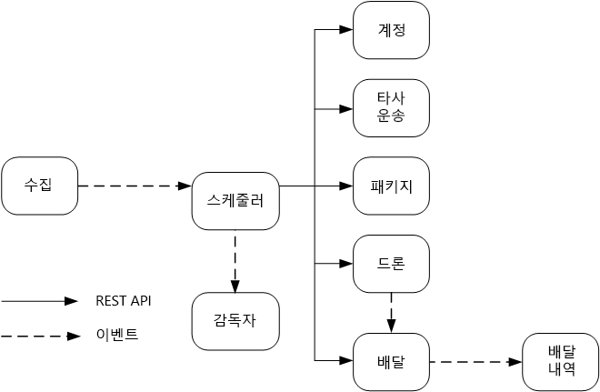

# 마이크로 서비스 디자인: 서비스 간 통신

마이크로 서비스 사이의 통신은 효율적이고 강력해야 합니다. 단일 트랜잭션을 완료하기 위해 다수의 소규모 서비스가 상호 작용하는 경우에는 이것이 어려울 수 있습니다. 이 챕터에서는 비동기 메시징과 동기 API 사이에서 절충안을 찾아봅니다. 그런 다음 복원력 있는 서비스 간 통신을 설계하는 문제점과 서비스 메시가 수행할 수 있는 역할을 알아봅니다.

## 과제 

다음은 서비스 간 통신에서 발생하는 주요 문제점 중 일부입니다. 이 챕터의 뒷부분에 설명되어 있는 서비스 메시는 이러한 문제점을 처리하도록 설계되었습니다.

**복원력.** 주어진 마이크로 서비스에 대해 수십 또는 수백 개의 인스턴스가 있을 수 있습니다. 인스턴스는 여러 가지 이유로 실패할 수 있습니다. 하드웨어 오류나 VM 재부팅과 같은 노드 수준 오류가 있을 수 있습니다. 인스턴스가 중단되거나 요청으로 인해 무력화되고 새로운 요청을 처리할 수 없습니다. 이러한 이벤트로 인해 네트워크 호출이 실패할 수 있습니다. 서비스 간 네트워크 호출의 복원력을 높이는 데 도움이 되는 두 가지 디자인 패턴이 있습니다.

- **[다시 시도](../patterns/retry.md)**. 네트워크 호출이 자체적으로 사라지는 일시적인 오류로 인해 실패할 수 있습니다. 완전히 실패하기 보다는, 호출자가 일정한 횟수만큼 작업을 다시 시도하거나 구성된 시간 제한 기간이 경과할 때까지 다시 시도해야 합니다. 하지만 연산이 idempotent가 아니면 다시 시도로 인해 의도치 않은 부작용이 발생할 수 있습니다. 원래 호출은 성공할 수 있지만 호출자가 응답을 받지 못합니다. 호출자가 다시 시도하면 연산이 두 번 호출될 수 있습니다. 일반적으로 POST 또는 PATCH 메서드는 idempotent가 아닐 수도 있기 때문에 다시 시도하는 것은 안전하지 않습니다.

- **[회로 차단기](../patterns/circuit-breaker.md)**. 실패한 요청 수가 너무 많으면 보류 중인 요청이 큐에 누적되어 병목 상태가 발생할 수 있습니다. 이처럼 차단된 요청이 메모리, 스레드, 데이터베이스 연결 등의 중요한 시스템 리소스를 계속 잡아 두어 연속 오류를 일으킬 있습니다. 회로 차단기 패턴은 서비스가 실패 가능성이 있는 작업을 반복해서 다시 시도하는 것을 막을 수 있습니다. 

**부하 분산**. 서비스 "A"가 서비스 "B"를 호출하면 요청이 서비스 "B"의 실행 중인 인스턴스에 도달해야 합니다. Kubernetes에서 `Service` 리소스 유형은 Pod 그룹에 대해 안정적인 IP 주소를 제공합니다. iptable 규칙을 사용하여 서비스의 IP 주소에 대한 네트워크 트래픽이 Pod에 전달됩니다. 기본적으로 Pod가 무작위로 선택합니다. 서비스 메시(아래 참조)는 관찰된 대기 시간이나 기타 메트릭을 기반으로 보다 지능적인 부하 분산 알고리즘을 제공할 수 있습니다.

**분산 추적**. 여러 서비스에 걸친 단일 트랜잭션이 있을 수 있습니다. 이런 경우 시스템의 전반적인 성능과 상태를 모니터링하기가 어려워집니다. 모든 서비스가 로그와 메트릭을 생성하더라도 이것을 함께 연결할 방법이 없다면 사용이 제한됩니다. [로깅 및 모니터링](./logging-monitoring.md) 챕터에 분산 추적에 대한 자세한 내용이 있지만 이 문서에 도전 과제로 언급되어 있습니다.

**서비스 버전 관리**. 팀이 새 버전의 서비스를 배포할 때 그에 종속된 다른 서비스나 외부 클라이언트가 손상되지 않도록 해야 합니다. 또한 여러 버전의 서비스를 side-by-side 실행하고 특정 버전으로 요청을 라우팅하는 것이 좋습니다. 이 문제에 대한 자세한 내용은 [API 버전 관리](./api-design.md#api-versioning)를 참조하세요.

**TLS 암호화 및 상호 TLS 인증**. 보안을 위해 TLS를 사용하는 서비스 사이의 트래픽을 암호화하고 상호 TLS 인증을 사용하여 호출자를 인증하는 것이 좋습니다.

## 동기 대 비동기 메시징

마이크로 서비스가 다른 마이크로 서비스와 통신하는 데 사용할 수 있는 기본 메시징 패턴이 두 가지 있습니다. 

1. 동기식 통신. 이 패턴에서 서비스는 HTTP 또는 gRPC와 같은 프로토콜을 사용하여 다른 서비스가 노출하는 API를 호출합니다. 이 옵션은 호출자가 수신자의 응답을 기다리기 때문에 동기 메시징 패턴입니다. 

2. 비동기 메시지 전달. 이 패턴에서 서비스는 응답을 기다리지 않고 메시지를 보내고 하나 이상의 서비스가 메시지를 비동기적으로 처리합니다.

비동기 I/O와 비동기 프로토콜의 차이를 구분하는 것은 중요합니다. 비동기 I/O란 I/O가 완료되는 동안 호출 스레드가 차단되지 않는 것을 의미합니다. 이것은 성능을 위해 중요하지만 아키텍처 측면의 구현 세부 정보입니다. 비동기 프로토콜은 발신자가 응답을 기다리지 않는 것을 의미합니다. HTTP 클라이언트가 요청을 보낼 때 비동기 I/O를 사용할 수 있지만 HTTP는 동기 프로토콜입니다. 

각 패턴에는 장단점이 있습니다. 요청/응답은 잘 알려진 패러다임이므로 API를 설계하는 것을 메시징 시스템을 설계하는 것보다 자연스럽게 느낄 수 있습니다. 하지만 비동기 메시징에는 마이크로 서비스 아키텍처에 매우 유용한 몇 가지 이점이 있습니다.

- **결합 감소**. 메시지 발신자가 소비자에 대해 알 필요가 없습니다. 

- **여러 구독자**. pub/sub 모델을 사용하면 여러 소비자가 이벤트를 수신하도록 구독할 수 있습니다. [이벤트 기반 아키텍처 스타일](/azure/architecture/guide/architecture-styles/event-driven)을 참조하세요.

- **실패 격리**. 소비자가 실패하더라도 발신자는 여전히 메시지를 보낼 수 있습니다. 소비자가 복구되면 메시지가 픽업됩니다. 이 기능은 마이크로 서비스 아키텍처에서 특히 유용합니다. 서비스마다 자체적인 수명 주기가 있기 때문입니다. 서비스는 언제든 사용할 수 없게 되거나 새 버전으로 교체될 수 있습니다. 비동기 메시징은 일시적 가동 중지 시간을 처리할 수 있습니다. 반면에 동기 API는 다운스트림 서비스를 사용할 수 있어야 하며 그렇지 않으면 작업이 실패합니다. 
 
- **응답성**. 업스트림 서비스는 다운스트림 서비스를 기다리지 않으면 더 빨리 응답할 수 있습니다. 이것은 마이크로 서비스 아키텍처에서 특히 유용합니다. 서비스 종속성 체인(서비스 A가 B를 호출하고 B가 C를 호출하는)이 있는 경우 동기 호출에 대기하면 대기 시간이 허용할 수 없을 만큼 추가될 수 있습니다.

- **부하 평준화**. 큐는 워크로드를 평준화하는 버퍼로 작동할 수 있으므로 수신자는 자체 속도에 맞게 메시지를 처리할 수 있습니다. 

- **워크플로**. 큐는 워크플로의 각 단계가 끝날 때마다 메시지에 검사점을 설정하여 워크플로를 관리하는 데 사용될 수 있습니다.

단 비동기 메시징을 효율적으로 사용하려면 몇 가지 과제가 있습니다.

- **메시징 인프라와 결합**. 특정 메시징 인프라를 사용하면 해당 인프라와 밀접하게 결합될 수 있습니다. 그렇게 되면 나중에 다른 메시징 인프라로 전환하는 것이 어렵습니다.

- **대기 시간**. 메시지 큐가 채워지면 작업을 위한 종단 간 대기 시간이 길어질 수 있습니다.  

- **비용**. 처리량이 높으면 메시징 인프라에 대한 금전적인 비용이 상당할 수 있습니다.

- **복잡성**. 비동기 메시징 처리는 간단한 작업이 아닙니다. 예를 들어 중복을 제거하거나 작업을 idempotent로 만들어서 중복 메시지를 처리해야 합니다. 비동기 메시징을 사용하여 요청-응답 의미 체계를 구현하는 것도 어렵습니다. 응답을 보내려면 다른 큐가 필요하고 요청과 응답 메시지를 상호 연결하는 방법이 필요합니다.

- **처리량**. 메시지에 *큐 의미 체계*가 필요하면 큐가 시스템에서 병목 상태가 될 수 있습니다. 각 메시지에는 하나 이상의 큐 작업과 큐에서 제거하는 작업이 필요합니다. 또한, 일반적으로 큐 의미 체계에는 메시징 인프라 내에서 일종의 잠금이 필요합니다. 큐가 관리되는 서비스인 경우 큐가 클러스터의 가상 네트워크 외부에 있기 때문에 추가 대기 시간이 있을 수 있습니다. 이러한 문제는 메시지를 일괄 처리하면 완화될 수 있지만 그렇게 하면 코드가 복잡해집니다. 메시지에 큐 의미 체계가 필요하지 않은 경우 큐 대신 이벤트 *스트림*을 사용할 수 있습니다. 자세한 내용은 [이벤트 기반 아키텍처 스타일](../guide/architecture-styles/event-driven.md)을 참조하세요.  

## 드론 배달: 메시징 패턴 선택

이러한 사항을 고려하여, 개발 팀은 드론 배달 응용 프로그램 설계를 위해 다음과 같은 선택을 했습니다.

- 수집 서비스는 클라이언트 응용 프로그램에서 배달을 예약, 업데이트 또는 취소하는 데 사용되는 공용 REST API를 노출합니다.

- 수집 서비스는 Event Hubs를 사용하여 Scheduler 서비스에 비동기 메시지를 보냅니다. 비동기 메시지는 수집에 필요한 부하 평준화를 구현하는 데 필요합니다. 수집 및 Scheduler 서비스가 사용 작용하는 방법에 대한 세부 정보는 [수집 및 워크플로][ingestion-workflow]를 참조하세요.

- 계정, 배달, 패키지, 드론 및 타사 전송 서비스는 모두 내부 REST API를 노출합니다. Scheduler 서비스는 이러한 API를 호출하여 사용자 요청을 수행합니다. 동기 API를 사용하는 한 가지 이유는 Scheduler가 각 다운스트림 서비스로부터 응답을 받아야 하기 때문입니다. 다운스트림 서비스에 장애가 발생하면 전체 작업이 실패합니다. 그러나 잠재적인 문제는 백 엔드 서비스를 호출하여 발생하는 대기 시간의 양입니다. 

- 다운스트림 서비스에 영구적인 오류가 있는 경우 전체 트랜잭션이 실패로 표시되어야 합니다. 이런 경우를 처리하기 위해 [수집 및 워크플로][ingestion-workflow] 챕터의 설명대로 감독자가 보정 트랜잭션을 예약할 수 있도록 Scheduler 서비스가 감독자에게 비동기 메시지를 보냅니다.   

- 배달 서비스는 클라이언트가 배달 상태를 가져오는 데 사용할 수 있는 공용 API를 노출합니다. [API 게이트웨이](./gateway.md) 챕터에는 API 게이트웨이가 클라이언트에서 기본 서비스를 숨겨서 어떤 서비스가 어떤 API를 노출하는지 클라이언트가 알 필요가 없도록 하는 방법이 논의되어 있습니다. 

- 드론이 비행하는 동안 드론 서비스는 드론의 현재 위치와 상태를 포함하는 이벤트를 보냅니다. 배달 서비스는 배달 상태를 추적하기 위해 이러한 이벤트를 수신 대기합니다.

- 배달 상태가 변경되면 배달 서비스는 배달 상태 이벤트(예: `DeliveryCreated` 또는 `DeliveryCompleted`)를 보냅니다. 모든 서비스는 이러한 이벤트를 구독할 수 있습니다. 현재 디자인에서는 배달 서비스가 유일한 구독자이지만 나중에 다른 구독자가 생길 수 있습니다. 예를 들어 이벤트가 실시간 분석 서비스로 이동할 수 있습니다. 또한 Scheduler가 응답을 기다릴 필요가 없기 때문에 구독자를 더 추가해도 기본 워크플로 경로에 영향을 미치지 않습니다.

배달 서비스 이벤트는 드론 위치 이벤트에서 파생됩니다. 예를 들어 드론이 배달 위치에 도달하여 패키지를 떨어뜨리면 배달 서비스는 이것을 DeliveryCompleted 이벤트로 변환합니다. 이것은 도메인 모델 관점의 생각에 대한 예입니다. 앞의 설명처럼 드론 관리는 별도의 바인딩된 컨텍스트에 속합니다. 드론 이벤트는 드론의 물리적 위치를 전달합니다. 반면 배달 이벤트는 배달 상태의 변화를 나타내며 이것은 다른 비즈니스 엔터티입니다.

## 서비스 메시 사용

*서비스 메시*는 서비스 간 통신을 처리하는 소프트웨어 계층입니다. 서비스 메시는 이전 섹션에 나열된 많은 문제를 해결하고 이러한 문제에 대한 책임을 마이크로 서비스 자체에서 공유 레이어로 이동하도록 설계되었습니다. 서비스 메시는 클러스터의 마이크로 서비스 사이에 네트워크 통신을 가로채는 프록시로 작동합니다. 

> [!NOTE]
> 서비스 메시는 [특사 패턴](../patterns/ambassador.md)의 예입니다. &mdash; 이것은 응용 프로그램 대신 네트워크 요청을 보내는 도우미 서비스입니다. 

현재 Kubernetes에서 서비스 메시에 대한 주요 옵션은 [linkerd](https://linkerd.io/) 및 [Istio](https://istio.io/)입니다. 이러한 기술은 모두 빠르게 진화하고 있습니다. 이 가이드를 작성할 당시 최신 Istio 릴리스는 0.2이므로 매우 새로운 기술입니다. linkerd와 Istio에 공통되는 몇 가지 기능은 다음과 같습니다. 

- 관찰된 대기 시간이나 미해결 요청 수에 기반한 세션 수준의 부하 분산. 이를 통해 Kubernetes에 제공되는 계층 4 부하 분산보다 성능이 향상될 수 있습니다. 

- URL 경로, Host 헤더, API 버전 또는 기타 응용 프로그램 수준 규칙에 기반한 계층 7 라우팅.

- 실패한 요청 다시 시도. 서비스 메시는 HTTP 오류 코드를 이해하고 실패한 요청을 자동으로 다시 시도할 수 있습니다. 최대 대기 시간을 제한하기 위해 시간 초과 기간과 함께 최대 다시 시도 횟수를 구성할 수 있습니다. 

- 회로 차단. 인스턴스가 일관적으로 요청에 실패하면 서비스 메시는 해당 요청을 일시적으로 사용할 수 없게 표시합니다. 백오프 기간 후에 인스턴스를 다시 시도합니다. 회로 차단기는 다양한 기준(예: 연속 실패 횟수)을 기반으로 구성할 수 있습니다.  

- 서비스 메시는 서비스 간 호출에 대한 메트릭(예: 요청 볼륨, 대기 시간, 오류 및 성공률 및 응답 크기)을 캡처합니다. 또한 서비스 메시는 요청의 각 홉에 대한 상관 관계 정보를 추가하여 분산 추적을 가능하게 합니다.

- 서비스 간 호출에 대한 상호 TLS 인증.

서비스 메시가 필요한가요? 이것이 분산 시스템에 추가하는 가치는 확실히 유용합니다. 서비스 메시가 없으면 챕터의 앞부분에 언급된 각각의 도전 관제를 고려해야 합니다. 다시 시도, 회로 차단기 및 분산 추적과 같은 문제는 서비스 메시가 없어도 해결할 수 있지만 서비스 메시를 사용하면 이러한 문제를 개별 서비스에서 전용 레이어로 이동시킵니다. 반면에 서비스 메시는 아직 성숙 단계에 있는 비교적 새로운 기술입니다. 서비스 메시를 배포하면 클러스터 설정과 구성이 더 복잡해집니다. 요청이 서비스 메시 프록시를 통해 라우팅되기 때문에 그리고 추가 서비스가 클러스터의 모든 노드에서 실행되기 때문에 성능에 영향을 미칠 수 있습니다. 서비스 메시를 프로덕션에 배포하기 전에 철저한 성능 및 부하 테스트를 수행해야 합니다.

> [!div class="nextstepaction"]
> [API 디자인](./api-design.md)

<!-- links -->

[ingestion-workflow]: ./ingestion-workflow.md
