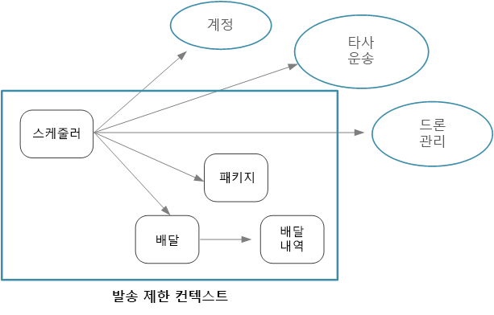
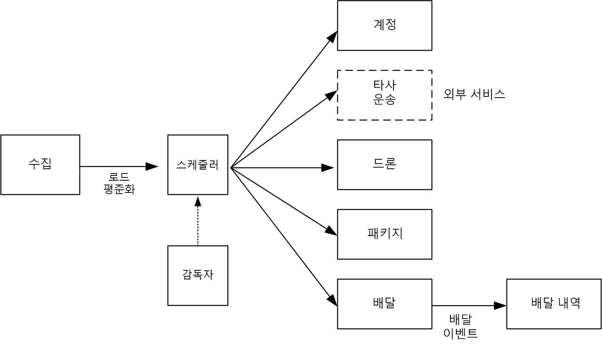

# 마이크로 서비스 디자인: 마이크로 서비스 경계 식별

마이크로 서비스에 적절한 크기는 얼마인가요? "너무 크지도 작지도 않은 것"이 효과가 있다고들 하며 &mdash;이것이 물론 맞는 말이지만 실제로는 별로 도움이 되지 않습니다. 하지만 신중하게 디자인한 도메인 모델을 사용하여 시작하면 마이크로 서비스를 사용하는 이유를 쉽게 이해할 수 있습니다.

## 도메인 모델에서 마이크로 서비스로

[이전 챕터](./domain-analysis.md)에서는 드론 배달 응용 프로그램의 바인딩된 컨텍스트 집합을 정의했습니다. 그런 다음 바인딩된 컨텍스트 중 하나인 배송(Shipping) 바인딩된 컨텍스트를 자세히 살펴보고 바인딩된 컨텍스트에 대한 엔터티 집합, 집계 및 도메인 서비스를 확인했습니다.

이제 도메인 모델에서 응용 프로그램 디자인으로 이동할 준비가 되었습니다. 다음은 도메인 모델에서 마이크로 서비스를 파생시키는 데 사용할 수 있는 방법입니다.

1. 바인딩된 컨텍스트로 시작합니다. 일반적으로 마이크로 서비스의 기능은 둘 이상의 바인딩된 컨텍스트에 걸쳐 있지 않아야 합니다. 정의에 따라 바인딩된 컨텍스트는 특정 도메인 모델의 경계를 표시합니다. 마이크로 서비스가 서로 다른 도메인 모델을 함께 혼합한다는 것을 알게 되면, 다시 돌아가서 도메인 분석을 구체화해야 합니다.

2. 그런 다음 도메인 모델에서 집계를 살펴봅니다. 집계는 마이크로 서비스에 적합한 경우가 많습니다. 잘 설계된 집계에는 다음과 같이 잘 설계된 마이크로 서비스의 특징이 많이 나타납니다.

    - 집계는 데이터 액세스 또는 메시징과 같은 기술적인 문제보다는 비즈니스 요구 사항에서 파생됩니다.  
    - 집계에는 높은 기능적 응집력이 있어야 합니다.
    - 집계는 지속성에 대한 경계입니다.
    - 집계는 느슨하게 결합되어야 합니다. 
    
3. 도메인 서비스 역시 마이크로 서비스에 적합합니다. 도메인 서비스는 여러 집계에 걸쳐 있는 상태 비저장 작업입니다. 일반적인 예는 여러 마이크로 서비스가 관련된 워크플로입니다. 이러한 예를 드론 배달 응용 프로그램에서 살펴보겠습니다.

4. 마지막으로 비기능적인 요구 사항을 고려합니다. 팀 규모, 데이터 유형, 기술, 확장성 요구 사항, 가용성 요구 사항 및 보안 요구 사항과 같은 요소를 확인합니다. 이러한 요소로 인해 마이크로 서비스를 둘 이상의 더 작은 서비스로 분해하거나 그 반대의 작업을 수행하고 여러 마이크로 서비스를 하나로 결합해야 하는 경우가 있습니다. 

응용 프로그램에서 마이크로 서비스를 확인한 후 다음 기준에 따라 디자인을 유효성을 검증합니다.

- 각 서비스에는 단일 책임이 있습니다.
- 서비스 간에 번잡한 호출이 없습니다. 기능을 두 개의 서비스로 나눠서 과도하게 번잡한 호출이 발생하는 경우, 해당 서비스가 동일한 서비스에 속한다는 징후일 수 입니다.
- 각 서비스는 소규모 팀이 독립적으로 작업할 수 있을 정도로 충분히 작습니다.
- 둘 이상의 서비스를 잠금 단계에서 배포해야 하는 상호 종속성이 없습니다. 다른 서비스를 다시 배포하지 않고도 서비스를 배포하는 것이 항상 가능합니다.
- 서비스는 밀접하게 결합되어 있지 않으며 독립적으로 진화할 수 있습니다.
- 서비스 경계로 인해 데이터 일관성이나 무결성에 문제가 발생하지 않습니다. 경우에 따라 단일 마이크로 서비스에 기능을 입력하여 데이터 일관성을 유지하는 것이 중요합니다. 즉, 강력한 일관성이 정말 필요한지 고려해야 합니다. 분산 시스템의 최종 일관성을 해결하기 위한 전략이 있으며, 서비스를 분해하는 이점이 최종 일관성을 관리하는 어려움보다 큰 경우가 많이 있습니다.

무엇보다 실용적인 디자인이 중요하며 도메인 기반 디자인은 반복적인 프로세스라는 것을 기억해야 합니다. 의문이 있으면 정교하지 않은 마이크로 서비스로 시작합니다. 마이크로 서비스를 두 개의 작은 서비스로 나누는 것이 기존의 여러 마이크로 서비스에서 기능을 리팩터링하는 것보다 쉽습니다.
  
## 드론 배달: 마이크로 서비스 정의

앞에서 개발 팀은 &mdash;배달, 패키지, 드론 및 계정&mdash;이라는 네 가지 집계와 Scheduler 및 감독자라는 두 가지 도메인 서비스를 확인했습니다. 

배달 및 패키지는 마이크로 서비스가 될만한 명백한 후보입니다. Scheduler와 감독자는 다른 마이크로 서비스가 수행하는 작업을 조정하기 때문에 이러한 도메인 서비스를 마이크로 서비스로 구현하는 것이 타당합니다.  

드론 및 계정은 다른 바인딩된 컨텍스트에 속하기 때문에 고려할 필요가 있습니다. Scheduler에 대한 한가지 옵션은 드론 및 계정 바인딩된 컨텍스트를 직접 호출하는 것입니다. 또 다른 옵션은 배송(Shipping) 바인딩된 컨텍스트 내에 드론 및 계정 마이크로 서비스를 만드는 것입니다. 이러한 마이크로 서비스는 배송 컨텍스트에 적합한 API 또는 데이터 스키마를 노출하여 바인딩된 컨텍스트 사이에서 중재를 수행합니다.

드론 및 계정 바인딩된 컨텍스트의 세부 정보는 이 가이드의 범위를 벗어나기 때문에 이에 대한 모의 서비스를 참조 구현에 만들어 두었습니다. 하지만 이런 상황에서 고려할 몇 가지 요소가 있습니다.

- 다른 바인딩된 컨텍스트로 직접 호출하는 네트워크 오버헤드는 얼마나 되나요? 

- 다른 바인딩된 컨텍스트의 데이터 스키마가 이 컨텍스트에 적합한가요? 아니면 이 바인딩된 컨텍스트에 맞는 스키마를 두는 것이 더 좋은가요? 

- 다른 바인딩된 컨텍스트는 레거시 시스템인가요? 그렇다면 레거시 시스템과 최신 응용 프로그램 사이에서 변환을 수행하여 [손상 방지 레이어](../patterns/anti-corruption-layer.md) 역할을 하는 서비스를 만들 수 있습니다. 

- 팀 구조는 어떤가요? 다른 바인딩된 컨텍스트를 담당하는 팀과 통신하기가 쉽나요? 그렇지 않은 경우 두 컨텍스트 사이에서 중재를 수행하는 서비스를 만들면 팀 간 통신 비용을 줄일 수 있습니다.

지금까지는 비기능적인 요구 사항을 고려하지 않았습니다. 응용 프로그램의 처리량 요구 사항을 고려하여, 개발 팀은 클라이언트 요청에 대한 집계를 담당하는 별도의 집계 마이크로 서비스를 만들기로 결정했습니다. 이 마이크로 서비스는 들어오는 요청을 처리용 버퍼에 넣어서 [부하 평준화](../patterns/queue-based-load-leveling.md)를 구현합니다. Scheduler는 버퍼에서 요청을 읽고 워크플로를 실행합니다. 

비기능적인 요구 사항으로 인해 팀에서 하나의 서비스를 추가로 만들었습니다. 여태까지 모든 서비스는 실시간으로 패키지를 예약하고 전달하는 프로세스에 관한 서비스였습니다. 시스템은 데이터 분석을 위해 장기 저장소에 모든 배달 기록을 저장해야 합니다. 팀에서는 이것을 배달 서비스 담당으로 간주했습니다. 하지만 기록 분석을 위한 데이터 저장소 요구 사항은 처리 중인 작업을 위한 데이터 저장소 요구 사항과 매우 다릅니다([데이터 고려 사항](./data-considerations.md) 참조). 그래서 팀은 배달 서비스의 DeliveryTracking 이벤트를 수신 대기하고 장기 저장소에 이벤트를 작성하는 별도의 Delivery History(배달 기록) 서비스를 만들기로 결정했습니다.

다음 다이어그램은 현 시점의 디자인입니다.
 

## 계산 옵션 선택

*계산*이라는 용어는 응용 프로그램이 실행되는 계산 리소스의 호스팅 모델을 말합니다. 마이크로 서비스 아키텍처의 경우 두 가지 접근 방식이 특히 많이 사용됩니다.

- 전용 노드(VM)에서 실행되는 서비스를 관리하는 서비스 오케스트레이터
- FaaS(functions as a service)를 사용하고 서버를 사용하지 않는 아키텍처 

이것이 유일한 옵션은 아니지만, 마이크로 서비스 구축을 위해 검증된 방법입니다. 응용 프로그램에 두 가지 방법이 모두 포함될 수 있습니다.

### 서비스 오케스트레이터

오케스트레이터는 서비스 집합 배포 및 관리와 관련된 작업을 처리합니다. 이러한 작업에는 노드에 서비스 배치, 서비스 상태 모니터링, 비정상 서비스 다시 시작, 서비스 인스턴스 사이에서 네트워크 트래픽 부하 조정, 서비스 검색, 서비스 인스턴스 수의 규모 조정, 구성 업데이트 적용이 포함됩니다. 많이 사용되는 오케스트레이터에는 Kubernetes, DC/OS, Docker Swarm 및 Service Fabric이 있습니다. 

- [ACS](/azure/container-service/)(Azure Container Service)는 프로덕션이 준비된 Kubernetes, DC/OS 또는 Docker Swarm 클러스터를 빠르게 배포할 수 있는 Azure 서비스입니다.

- [AKS(Azure Container Service)](/azure/aks/)는 관리되는 Kubernetes 서비스입니다. AKS는 Kubernetes를 프로비전하고 Kubernetes API 엔드포인트를 노출하지만 Kubernetes 제어 플레인을 호스트 및 관리하고 자동 업그레이드, 자동 패치 적용, 자동 크기 조정 및 기타 관리 작업을 수행합니다. AKS를 "서비스로 제공되는 Kubernetes API"라고 생각할 수 있습니다. 이 문서 작성 시점에 AKS는 아직 미리 보기 상태입니다. AKS는 Azure에서 Kubernetes를 실행하는 데 많이 사용하는 방법이 될 것으로 예상됩니다. 

- [Service Fabric](/azure/service-fabric/)은 마이크로 서비스를 패키징, 배포 및 관리하기 위한 분산 시스템 플랫폼입니다. 마이크로 서비스는 Service Fabric에 컨테이너, 이진 실행 파일 또는 [Reliable Services](/azure/service-fabric/service-fabric-reliable-services-introduction)로 배포될 수 있습니다. Reliable Services 프로그래밍 모델을 사용하면, 서비스에서 Service Fabric 프로그래밍 API를 직접 사용하여 시스템을 쿼리하고, 상태를 보고하고, 구성 및 코드 변경에 대한 알림을 받고, 다른 서비스를 검색할 수 있습니다. Service Fabric을 통한 주요 차별화는 [Reliable Collections](/azure/service-fabric/service-fabric-reliable-services-reliable-collections)를 사용하여 상태 저장 서비스를 구축하는 데 강력하게 집중하는 것입니다.

### 컨테이너

컨테이너와 마이크로 서비스가 같은 것처럼 말하는 경우도 있습니다. 그것은 사실이 아니며 &mdash;마이크로 서비스를 만드는 데는 컨테이너가 필요하지 않습니다.&mdash; 컨테이너에는 마이크로 서비스에 특히 적합한 다음과 같은 이점이 있습니다.

- **이식성**. 컨테이너 이미지는 라이브러리나 다른 종속성을 설치할 필요 없이 실행되는 독립 실행형 패키지입니다. 따라서 배포가 쉽습니다. 컨테이너는 신속하게 시작하고 중지할 수 있기 때문에 부하를 더 많이 처리하거나 노드 장애를 복구하도록 새로운 인스턴스를 스핀업할 수 있습니다. 

- **밀도**. 컨테이너는 OS 리소스를 공유하기 때문에 가상 머신을 실행하는 것보다 경량입니다. 여러 컨테이너를 단일 노드로 묶는 것이 가능하기 때문에 다수의 소규모 서비스로 구성된 응용 프로그램에 특히 유용합니다.

- **리소스 격리**. 컨테이너에서 사용할 수 있는 메모리 및 CPU 양을 제한할 수 있기 때문에 런어웨이 프로세스가 호스트 리소스를 소진하지 않도록 하는 데 도움이 됩니다. 자세한 내용은 [격벽 패턴](../patterns/bulkhead.md)을 참조하세요.

### 서버리스(Functions as a Service)

서버리스 아키텍처에서는 VM 또는 가상 네트워크 인프라를 관리하지 않습니다. 대신, 사용자가 코드를 배포하면 호스팅 서비스가 해당 코드를 VM에 넣고 실행합니다. 이 방법은 이벤트 기반 트리거를 사용하여 조율하는 소규모의 세분화된 함수를 선호하는 경향이 있습니다. 예를 들어 큐에 배치된 메시지는 큐에서 읽고 메시지를 처리하는 함수를 트리거 할 수 있습니다.

[Azure Functions][functions]는 HTTP 요청, Service Bus 큐 및 Event Hubs를 비롯한 다양한 함수 트리거를 지원하는 서버리스 계산 서비스입니다. 전체 목록은 [Azure Functions 트리거 및 바인딩 개념][functions-triggers]을 참조하세요. Azure에서 관리되는 이벤트 라우팅 서비스인 [Azure Event Grid][event-grid]도 살펴보세요.

### 오케스트레이터 또는 서버리스

오케스트레이터 방식과 서버리스 방식 중에서 선택할 때 고려해야 할 몇 가지 요소가 있습니다.

**관리 효율성** 플랫폼이 모든 계산 리소스를 관리하기 때문에 서버리스 애플리케이션은 관리가 쉽습니다. 오케스트레이터는 클러스터 관리 및 구성의 일부 측면을 추상화하지만 기본 VM은 완전히 숨기지 않습니다. 오케스트레이터를 사용하면 부하 분산, CPU 및 메모리 사용량 및 네트워킹과 같은 문제에 대해 생각해야 합니다.

**유연성 및 제어**. 오케스트레이터를 사용하면 서비스와 클러스터를 구성하고 관리하는 데 있어 많은 제어가 가능합니다. 단점은 복잡성이 추가되는 것입니다. 서버리스 아키텍처를 사용하면 이러한 세부 사항이 추상화되기 때문에 제어를 어느 정도 포기해야 합니다.

**이식성**. 여기에 나열된 모든 오케스트레이터(Kubernetes, DC/OS, Docker Swarm 및 Service Fabric)는 온-프레미스 또는 다수의 공용 클라우드에서 실행할 수 있습니다. 

**응용 프로그램 통합**. 서버리스 아키텍처를 사용하면 복잡한 응용 프로그램을 개발하기 어려울 수 있습니다. Azure의 한 가지 옵션은 [Azure Logic Apps](/azure/logic-apps/)를 사용하여 Azure Functions 집합을 조정하는 것입니다. 이러한 방법에 대한 예제는 [Azure Logic Apps와 통합하는 함수 만들기](/azure/azure-functions/functions-twitter-email)를 참조하세요.

**비용**. 오케스트레이터를 사용하면 클러스터에서 실행 중인 VM에 대한 비용을 지불합니다. 서버리스 응용 프로그램을 사용하면 소비한 실제 계산 리소스에 대해서만 비용을 지불합니다. 두 경우 모두 저장소, 데이터베이스 및 메시징 서비스와 같은 추가 서비스에 대한 비용을 고려해야 합니다.

**확장성**. Azure Functions는 들어오는 이벤트 수를 기반으로 수요에 맞게 자동으로 규모가 조정됩니다. 오케스트레이터를 사용하면 클러스터에서 실행 중인 서비스 인스턴스의 수를 늘려서 규모를 확장할 수 있습니다. 클러스터에 VM을 더 추가하여 확장할 수도 있습니다.

참조 구현에는 주로 Kubernetes를 사용했지만 한 가지 서비스 즉, Delivery History(배달 기록) 서비스에 대해서는 Azure Functions를 사용했습니다. Azure Functions는 이벤트 기반 워크로드이기 때문에 이러한 특정 서비스에 적합합니다 Event Hubs 트리거를 사용하여 함수를 호출하면 서비스에 최소한의 코드만 필요합니다. Delivery History(배달 기록) 서비스는 기본 워크플로에 속하지 않으므로 Kubernetes 클러스터 외부에서 실행하면 사용자가 시작한 작업의 종단 간 대기 시간에 영향을 미치지 않습니다. 

> [!div class="nextstepaction"]
> [데이터 고려 사항](./data-considerations.md)

<!-- links -->

[acs-engine]: https://github.com/Azure/acs-engine
[acs-faq]: /azure/container-service/dcos-swarm/container-service-faq
[event-grid]: /azure/event-grid/
[functions]: /azure/azure-functions/functions-overview
[functions-triggers]: /azure/azure-functions/functions-triggers-bindings
