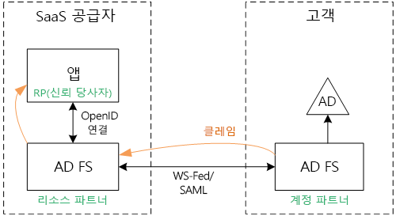
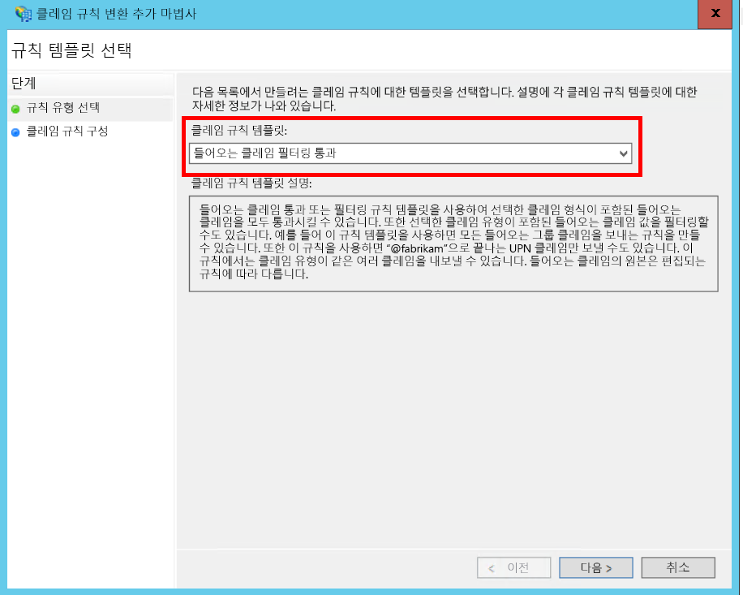
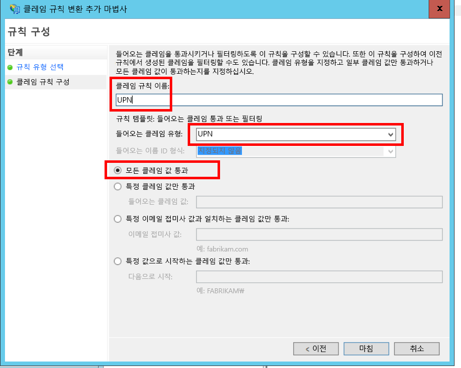
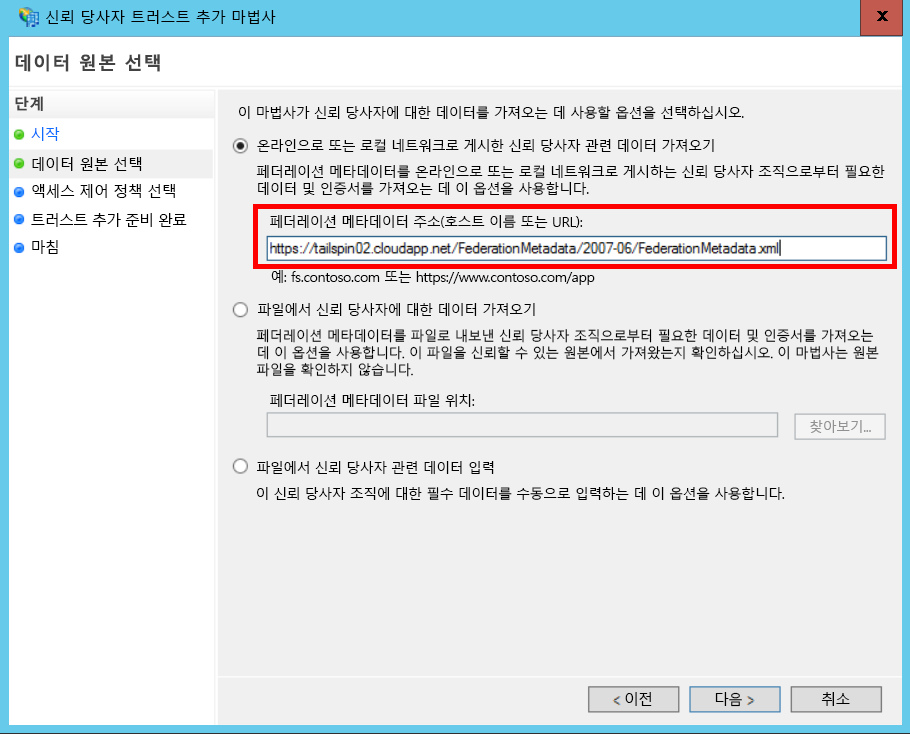
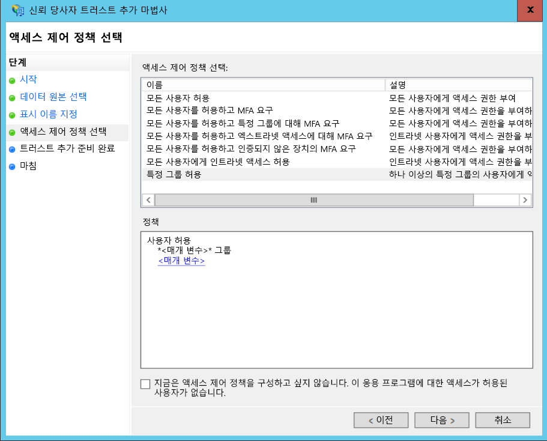
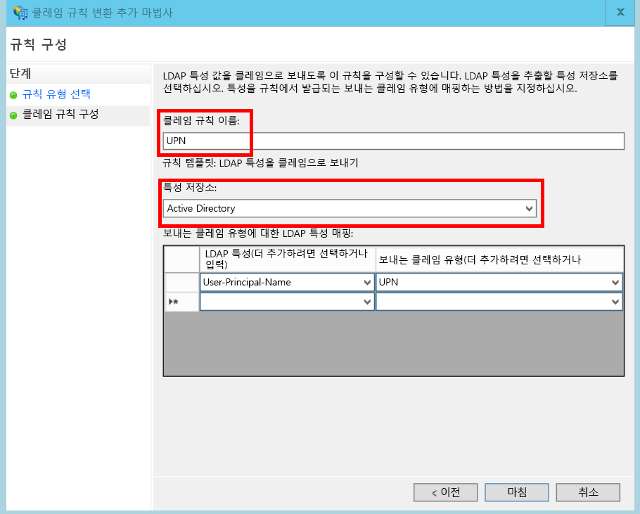
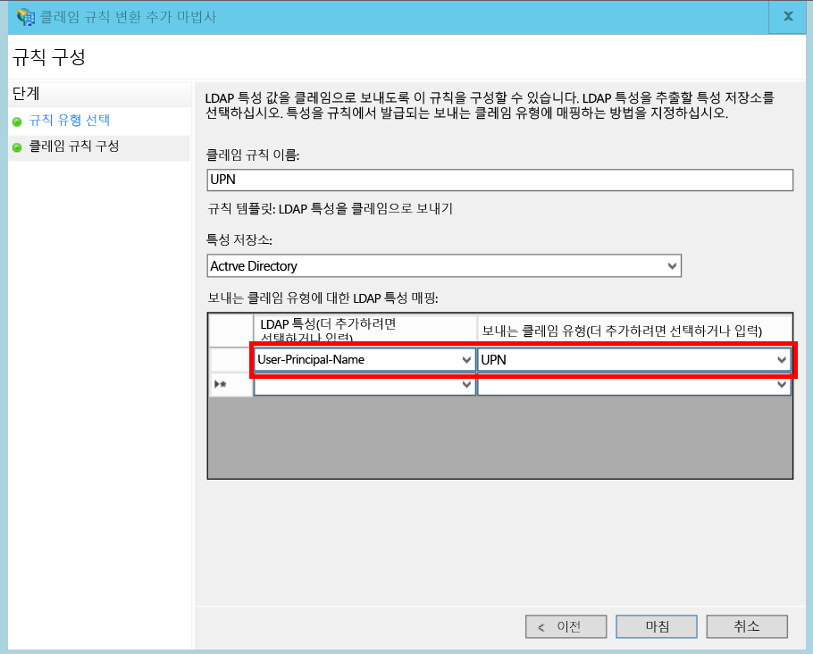

# <a name="federate-with-a-customers-ad-fs"></a>고객의 AD FS로 페더레이션

이 문서에서는 다중 테넌트 SaaS 응용 프로그램이 고객의 AD FS와 페더레이션하기 위해 AD FS(Active Directory Federation Services)를 통해 인증을 지원할 수 있는 방법을 설명합니다.

## <a name="overview"></a>개요
Azure AD(Azure Active Directory)를 통해 Office365 및 Dynamics CRM Online 고객을 포함하여 Azure AD 테넌트에서 사용자를 쉽게 로그인할 수 있습니다. 그러나 회사 인트라넷에서 온-프레미스 Active Directory를 사용하는 고객은 어떨까요?

이러한 고객을 위한 한 가지 옵션은 [Azure AD Connect]를 사용하여 고객의 온-프레미스 AD와 Azure AD를 동기화하는 것입니다. 그러나 일부 고객은 회사 IT 정책이나 기타 원인으로 이러한 방법을 사용할 수 없습니다. 이 경우 다른 옵션은 AD FS(Active Directory Federation Services)를 통해 페더레이션하는 것입니다.

이 시나리오를 사용하려면

* 고객에게 인터넷 연결 AD FS 팜이 있어야 합니다.
* SaaS 공급자는 자신의 AD FS 팜을 배포합니다.
* 고객 및 SaaS 공급자는 [페더레이션 트러스트]를 설정해야 합니다. 수동 프로세스입니다.

트러스트 관계에는 세 가지 주요 역할이 있습니다.

* 고객의 AD FS는 [계정 파트너]이며, 고객의 AD에서 사용자 인증 및 사용자 클레임으로 보안 토큰 생성을 담당합니다.
* SaaS 공급자의 AD FS는 [리소스 파트너]이며, 계정 파트너를 트러스트하고 사용자 클레임을 받습니다.
* 응용 프로그램은 SaaS 공급자의 AD FS에서 RP(신뢰 당사자)로 구성됩니다.
  
  

> [!NOTE]
> 이 문서에서는 응용 프로그램이 인증 프로토콜로 OpenID Connect를 사용한다고 가정합니다. 다른 옵션은 WS-Federation을 사용하는 것입니다.
> 
> OpenID Connect의 경우 SaaS 공급자는 Windows Server 2016에서 실행되는 AD FS 2016을 사용해야 합니다. AD FS 3.0은 OpenID Connect를 지원하지 않습니다.
> 
> ASP.NET Core는 기본적으로 WS-Federation을 지원하지 않습니다.
> 
> 

ASP.NET 4에서 WS-Federation을 사용하는 예제는 [active-directory-dotnet-webapp-wsfederation 샘플][active-directory-dotnet-webapp-wsfederation]을 참조하세요.

## <a name="authentication-flow"></a>인증 흐름
1. 사용자가 "로그인"을 클릭하면 응용 프로그램은 SaaS 공급자의 AD FS에서 OpenID Connect 끝점으로 리디렉션됩니다.
2. 사용자가 자신의 조직 사용자 이름("`alice@corp.contoso.com`")을 입력합니다. AD FS는 고객의 AD FS로 리디렉션하기 위해 홈 영역 검색을 사용하며 여기서 사용자는 자신의 자격 증명을 입력합니다.
3. 고객의 AD FS는 WF-Federation(또는 SAML)을 사용하여 사용자 클레임을 SaaS 공급자의 AD FS로 보냅니다.
4. 클레임은 OpenID Connect를 사용하여 AD FS에서 앱으로 흐릅니다. 여기에 WS-Federation에서 프로토콜 전환이 필요합니다.

## <a name="limitations"></a>제한 사항
기본적으로 신뢰 당사자 응용 프로그램은 다음 표와 같이 id_token에서 사용할 수 있는 고정 클레임 집합만 받습니다. AD FS 2016에서는 OpenID Connect 시나리오의 id_token을 사용자 지정할 수 있습니다. 자세한 내용은 [AD FS의 사용자 지정 ID 토큰](/windows-server/identity/ad-fs/development/customize-id-token-ad-fs-2016)을 참조하세요.

| 클레임 | 설명 |
| --- | --- |
| aud |대상. 클레임이 발급된 응용 프로그램입니다. |
| authenticationinstant |[인증 인스턴트]. 인증이 발생한 시간입니다. |
| c_hash |코드 해시 값. 토큰 콘텐츠의 해시입니다. |
| exp |[만료 시간]. 이 시간 후에는 토큰이 더 이상 허용되지 않는 시간입니다. |
| iat |발급 시간. 토큰이 발급된 시간입니다. |
| iss |발급자. 이 클레임 값은 항상 리소스 파트너의 AD FS입니다. |
| 이름 |사용자 이름. 예: `john@corp.fabrikam.com`. |
| nameidentifier |[이름 식별자]. 토큰이 발급된 엔터티 이름의 식별자입니다. |
| nonce |세션 nonce. AD FS에서 재생 공격을 방지하기 위해 생성하는 고유 값입니다. |
| upn |사용자 계정 이름(UPN). 예제: john@corp.fabrikam.com |
| pwd_exp |암호 만료 기간. 사용자 암호 또는 유사한 인증 비밀(예: PIN)이 만료되기까지의 시간(초)입니다. |

> [!NOTE]
> "iss" 클레임에는 파트너의 AD FS가 포함됩니다. 일반적으로 이 클레임은 SaaS 공급자를 발급자로 식별하며 고객의 AD FS를 식별하지 않습니다. 고객 도메인을 UPN의 일부로 확인할 수 있습니다.
> 
> 

이 문서의 나머지 부분에서는 RP(앱) 및 계정 파트너(고객) 간에 트러스트 관계를 설정하는 방법을 설명합니다.

## <a name="ad-fs-deployment"></a>AD FS 배포
SaaS 공급자는 온-프레미스 또는 Azure VM에 AD FS를 배포할 수 있습니다. 보안 및 가용성을 위해 다음 지침이 중요합니다.

* 두 개 이상의 AD FS 서버와 두 개의 AD FS 프록시 서버를 배포하여 AD FS 서비스의 최적의 가용성을 달성합니다.
* 도메인 컨트롤러와 AD FS 서버는 인터넷에 직접 노출하면 안 되며 여기에 직접 액세스할 수 있는 가상 네트워크에 있어야 합니다.
* AD FS 서버를 인터넷에 게시하는 데는 웹 응용 프로그램 프록시(이전에 AD FS 프록시)를 사용해야 합니다.

Azure에서 유사한 토폴로지를 설정하기 위해서는 가상 네트워크, NSG, azure VM 및 가용성 집합을 사용해야 합니다. 자세한 내용은 [Azure Virtual Machines에 Windows Server Active Directory를 배포하기 위한 지침][active-directory-on-azure]을 참조하세요.

## <a name="configure-openid-connect-authentication-with-ad-fs"></a>AD FS를 사용하여 OpenID Connect 인증 구성
SaaS 공급자는 응용 프로그램 및 AD FS 간의 OpenID Connect를 사용하도록 설정해야 합니다. 이렇게 하려면 AD FS에서 응용 프로그램 그룹을 추가합니다.  이 [블로그 게시물]의 "OpenId Connect 로그인 AD FS를 위한 웹앱 설정" 아래에서 상세 지침을 확인할 수 있습니다. 

그런 다음 OpenID Connect 미들웨어를 구성합니다. 메타데이터 끝점은 `https://domain/adfs/.well-known/openid-configuration`이며, 여기서 도메인은 SaaS 공급자의 AD FS 도메인입니다.

일반적으로 이것을 다른 OpenID Connect 끝점(예: AAD)과 결합할 수 있습니다. 사용자가 올바른 인증 끝점으로 보내지도록 두 개의 서로 다른 로그인 단추 또는 이를 구분하기 위한 기타 방법이 필요합니다.

## <a name="configure-the-ad-fs-resource-partner"></a>AD FS 리소스 파트너 구성
SaaS 공급자는 ADFS를 통한 연결을 원하는 각 고객을 위해 다음을 수행해야 합니다.

1. 클레임 공급자 트러스트를 추가합니다.
2. 클레임 규칙을 추가합니다.
3. 홈 영역 검색을 사용하도록 설정합니다.

다음은 자세한 단계입니다.

### <a name="add-the-claims-provider-trust"></a>클레임 공급자 트러스트 추가
1. 서버 관리자에서 **도구**를 클릭하고 **AD FS 관리**를 선택합니다.
2. 콘솔 트리의 **AD FS** 아래에서 **클레임 공급자 트러스트**를 마우스 오른쪽 단추로 클릭합니다. **클레임 공급자 트러스트 추가**를 선택합니다.
3. **시작** 을 클릭하여 마법사를 시작합니다.
4. "온라인으로 게시된 또는 로컬 네트워크에서 클레임 공급자에 대한 데이터 가져오기" 옵션을 선택합니다. 고객의 페더레이션 메타데이터 끝점 URI를 입력합니다. (예: `https://contoso.com/FederationMetadata/2007-06/FederationMetadata.xml`) 이 정보는 고객으로부터 받아야 합니다.
5. 기본 옵션을 사용하여 마법사를 완료합니다.

### <a name="edit-claims-rules"></a>클레임 규칙 편집
1. 새로 추가된 클레임 공급자 트러스트를 마우스 오른쪽 단추로 클릭하고 **클레임 규칙 편집**을 선택합니다.
2. **규칙 추가**를 클릭합니다.
3. "들어오는 클레임 통과 또는 필터링"을 선택하고 **다음**을 클릭합니다.
   
4. 규칙의 이름을 입력합니다.
5. "들어오는 클레임 유형"에서 **UPN**을 선택합니다.
6. "모든 클레임 값 통과"를 선택합니다.
   
7. **Finish**를 클릭합니다.
8. 2 - 7단계를 반복하고 들어오는 클레임 유형에 대해 **앵커 클레임 유형** 을 지정합니다.
9. **확인** 을 클릭하여 마법사를 완료합니다.

### <a name="enable-home-realm-discovery"></a>홈 영역 검색을 사용하도록 설정
다음 PowerShell 스크립트를 실행합니다.

```
Set-ADFSClaimsProviderTrust -TargetName "name" -OrganizationalAccountSuffix @("suffix")
```

여기서 "name"은 클레임 공급자 트러스트의 친숙한 이름이고 "suffix"는 고객의 AD에 대한 UPN 접미사입니다(예: "corp.fabrikam.com").

이 구성을 사용하여 최종 사용자는 자신의 조직 계정을 입력할 수 있으며 AD FS가 해당 클레임 공급자를 자동으로 선택합니다. "특정 전자 메일 접미사를 사용하도록 ID 공급자 구성" 섹션 아래 [AD FS 로그인 페이지 사용자 지정]을 참조하세요.

## <a name="configure-the-ad-fs-account-partner"></a>AD FS 계정 파트너 구성
고객은 다음을 수행해야 합니다.

1. 신뢰 당사자(RP) 트러스트를 추가합니다.
2. 클레임 규칙을 추가합니다.

### <a name="add-the-rp-trust"></a>RP 트러스트 추가
1. 서버 관리자에서 **도구**를 클릭하고 **AD FS 관리**를 선택합니다.
2. 콘솔 트리의 **AD FS** 아래에서 **신뢰 당사자 트러스트**를 마우스 오른쪽 단추로 클릭합니다. **신뢰 당사자 트러스트 추가**를 선택합니다.
3. **클레임 인식**을 선택하고 **시작**을 클릭합니다.
4. **데이터 원본 선택** 페이지에서 "온라인으로 게시된 또는 로컬 네트워크에서 클레임 공급자에 대한 데이터 가져오기" 옵션을 선택합니다. SaaS 공급자의 페더레이션 메타데이터 끝점의 URI를 입력합니다.
   
5. **표시 이름 지정** 페이지에서 이름을 입력합니다.
6. **Access Control 정책 선택** 페이지에서 정책을 선택합니다. 조직에 있는 모든 사람을 허용하거나 특정 보안 그룹을 선택할 수 있습니다.
   
7. **정책** 상자에 필요한 매개 변수를 입력합니다.
8. **다음** 을 클릭하여 마법사를 완료합니다.

### <a name="add-claims-rules"></a>클레임 규칙 추가
1. 새로 추가된 신뢰 당사자 트러스트를 마우스 오른쪽 단추로 클릭하고 **클레임 발급 정책 편집**을 선택합니다.
2. **규칙 추가**를 클릭합니다.
3. "LDAP 특성을 클레임으로 전송"을 선택하고 **다음**을 클릭합니다.
4. 규칙의 이름을 입력합니다(예: "UPN").
5. **특성 저장소** 아래에서 **Active Directory**를 선택합니다.
   
6. **LDAP 특성의 매핑** 섹션에서:
   * **LDAP 특성** 아래에서 **User-Principal-Name**을 선택합니다.
   * **나가는 클레임 유형** 아래에서 **UPN**을 선택합니다.
     
7. **Finish**를 클릭합니다.
8. **규칙 추가** 를 다시 클릭합니다.
9. "사용자 지정 규칙을 사용하여 클레임 보내기"를 선택하고 **다음**을 클릭합니다.
10. 규칙의 이름을 입력합니다(예: "앵커 클레임 유형").
11. **사용자 지정 규칙**아래에서 다음을 입력합니다.
    
    ```
    EXISTS([Type == "http://schemas.microsoft.com/ws/2014/01/identity/claims/anchorclaimtype"])=>
    issue (Type = "http://schemas.microsoft.com/ws/2014/01/identity/claims/anchorclaimtype",
          Value = "http://schemas.xmlsoap.org/ws/2005/05/identity/claims/upn");
    ```
    
    이 규칙은 `anchorclaimtype` 유형의 클레임을 발급합니다. 이 클레임은 신뢰 당사자에게 UPN을 변경할 수 없는 사용자 ID로 사용하도록 알립니다.
12. **Finish**를 클릭합니다.
13. **확인** 을 클릭하여 마법사를 완료합니다.


<!-- Links -->
[Azure AD Connect]: /azure/active-directory/active-directory-aadconnect/
[페더레이션 트러스트]: https://technet.microsoft.com/library/cc770993(v=ws.11).aspx
[계정 파트너]: https://technet.microsoft.com/library/cc731141(v=ws.11).aspx
[리소스 파트너]: https://technet.microsoft.com/library/cc731141(v=ws.11).aspx
[인증 인스턴트]: https://msdn.microsoft.com/library/system.security.claims.claimtypes.authenticationinstant%28v=vs.110%29.aspx
[만료 시간]: http://tools.ietf.org/html/draft-ietf-oauth-json-web-token-25#section-4.1.
[이름 식별자]: https://msdn.microsoft.com/library/system.security.claims.claimtypes.nameidentifier(v=vs.110).aspx
[active-directory-on-azure]: https://msdn.microsoft.com/library/azure/jj156090.aspx
[블로그 게시물]: http://www.cloudidentity.com/blog/2015/08/21/OPENID-CONNECT-WEB-SIGN-ON-WITH-ADFS-IN-WINDOWS-SERVER-2016-TP3/
[AD FS 로그인 페이지 사용자 지정]: https://technet.microsoft.com/library/dn280950.aspx
[sample application]: https://github.com/mspnp/multitenant-saas-guidance
[client assertion]: client-assertion.md
[active-directory-dotnet-webapp-wsfederation]: https://github.com/Azure-Samples/active-directory-dotnet-webapp-wsfederation
