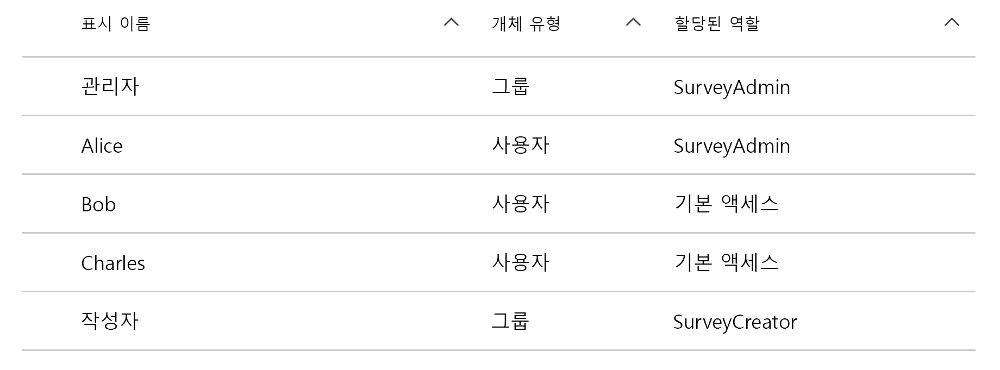
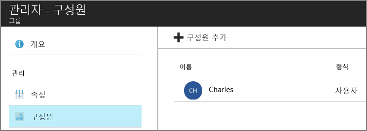

# <a name="application-roles"></a><span data-ttu-id="ec7a0-103">응용 프로그램 역할</span><span class="sxs-lookup"><span data-stu-id="ec7a0-103">Application roles</span></span>

<span data-ttu-id="ec7a0-104">[ 샘플 코드][sample application]</span><span class="sxs-lookup"><span data-stu-id="ec7a0-104">[ Sample code][sample application]</span></span>

<span data-ttu-id="ec7a0-105">응용 프로그램 역할은 사용자에게 사용 권한을 할당하는 데 사용됩니다.</span><span class="sxs-lookup"><span data-stu-id="ec7a0-105">Application roles are used to assign permissions to users.</span></span> <span data-ttu-id="ec7a0-106">예를 들어 [Tailspin Surveys][Tailspin] 응용 프로그램은 다음 역할을 정의합니다.</span><span class="sxs-lookup"><span data-stu-id="ec7a0-106">For example, the [Tailspin Surveys][Tailspin] application defines the following roles:</span></span>

* <span data-ttu-id="ec7a0-107">관리자.</span><span class="sxs-lookup"><span data-stu-id="ec7a0-107">Administrator.</span></span> <span data-ttu-id="ec7a0-108">해당 테넌트에 속하는 모든 설문 조사에 대한 모든 CRUD 작업을 수행할 수 있습니다.</span><span class="sxs-lookup"><span data-stu-id="ec7a0-108">Can perform all CRUD operations on any survey that belongs to that tenant.</span></span>
* <span data-ttu-id="ec7a0-109">작성자.</span><span class="sxs-lookup"><span data-stu-id="ec7a0-109">Creator.</span></span> <span data-ttu-id="ec7a0-110">새 설문 조사를 만들 수 있습니다.</span><span class="sxs-lookup"><span data-stu-id="ec7a0-110">Can create new surveys.</span></span>
* <span data-ttu-id="ec7a0-111">읽기 권한자.</span><span class="sxs-lookup"><span data-stu-id="ec7a0-111">Reader.</span></span> <span data-ttu-id="ec7a0-112">해당 테넌트에 속하는 모든 설문 조사를 읽을 수 있습니다.</span><span class="sxs-lookup"><span data-stu-id="ec7a0-112">Can read any surveys that belong to that tenant.</span></span>

<span data-ttu-id="ec7a0-113">이 역할은 결국 [권한 부여]중에 사용 권한으로 변환되는 것을 확인할 수 있습니다.</span><span class="sxs-lookup"><span data-stu-id="ec7a0-113">You can see that roles ultimately get translated into permissions, during [authorization].</span></span> <span data-ttu-id="ec7a0-114">그러나 첫 번째 질문은 역할을 할당 및 관리하는 방법입니다.</span><span class="sxs-lookup"><span data-stu-id="ec7a0-114">But the first question is how to assign and manage roles.</span></span> <span data-ttu-id="ec7a0-115">세 가지 기본 옵션을 확인했습니다.</span><span class="sxs-lookup"><span data-stu-id="ec7a0-115">We identified three main options:</span></span>

* [<span data-ttu-id="ec7a0-116">Azure AD 앱 역할</span><span class="sxs-lookup"><span data-stu-id="ec7a0-116">Azure AD App Roles</span></span>](#roles-using-azure-ad-app-roles)
* [<span data-ttu-id="ec7a0-117">Azure AD 보안 그룹</span><span class="sxs-lookup"><span data-stu-id="ec7a0-117">Azure AD security groups</span></span>](#roles-using-azure-ad-security-groups)
* <span data-ttu-id="ec7a0-118">[응용 프로그램 역할 관리자](#roles-using-an-application-role-manager)</span><span class="sxs-lookup"><span data-stu-id="ec7a0-118">[Application role manager](#roles-using-an-application-role-manager).</span></span>

## <a name="roles-using-azure-ad-app-roles"></a><span data-ttu-id="ec7a0-119">Azure AD 앱 역할을 사용하는 역할</span><span class="sxs-lookup"><span data-stu-id="ec7a0-119">Roles using Azure AD App Roles</span></span>
<span data-ttu-id="ec7a0-120">이 방식은 Tailspin Surveys 앱에서 사용하는 방식입니다.</span><span class="sxs-lookup"><span data-stu-id="ec7a0-120">This is the approach that we used in the Tailspin Surveys app.</span></span>

<span data-ttu-id="ec7a0-121">이 방법에서 SaaS 공급자는 응용 프로그램 역할을 응용 프로그램 매니페스트에 추가하여 응용 프로그램 역할을 정의합니다.</span><span class="sxs-lookup"><span data-stu-id="ec7a0-121">In this approach, The SaaS provider defines the application roles by adding them to the application manifest.</span></span> <span data-ttu-id="ec7a0-122">고객이 등록하면 고객의 AD 디렉터리 관리자가 사용자를 해당 역할에 할당합니다.</span><span class="sxs-lookup"><span data-stu-id="ec7a0-122">After a customer signs up, an admin for the customer's AD directory assigns users to the roles.</span></span> <span data-ttu-id="ec7a0-123">사용자가 로그인하면 사용자에게 할당된 역할이 클레임으로 전송됩니다.</span><span class="sxs-lookup"><span data-stu-id="ec7a0-123">When a user signs in, the user's assigned roles are sent as claims.</span></span>

> [!NOTE]
> <span data-ttu-id="ec7a0-124">고객에게 Azure AD Premium이 있는 경우 관리자는 보안 그룹을 역할에 할당할 수 있으며 해당 그룹의 구성원은 앱 역할을 상속합니다.</span><span class="sxs-lookup"><span data-stu-id="ec7a0-124">If the customer has Azure AD Premium, the admin can assign a security group to a role, and members of the group will inherit the app role.</span></span> <span data-ttu-id="ec7a0-125">그룹 소유자가 AD 관리자일 필요가 없으므로 역할을 관리할 수 있는 편리한 방법입니다.</span><span class="sxs-lookup"><span data-stu-id="ec7a0-125">This is a convenient way to manage roles, because the group owner doesn't need to be an AD admin.</span></span>
> 
> 

<span data-ttu-id="ec7a0-126">이 방법의 장점</span><span class="sxs-lookup"><span data-stu-id="ec7a0-126">Advantages of this approach:</span></span>

* <span data-ttu-id="ec7a0-127">단순한 프로그래밍 모델입니다.</span><span class="sxs-lookup"><span data-stu-id="ec7a0-127">Simple programming model.</span></span>
* <span data-ttu-id="ec7a0-128">역할이 응용 프로그램에 한정됩니다.</span><span class="sxs-lookup"><span data-stu-id="ec7a0-128">Roles are specific to the application.</span></span> <span data-ttu-id="ec7a0-129">한 응용 프로그램에 대한 역할 클레임은 다른 응용 프로그램에 전송되지 않습니다.</span><span class="sxs-lookup"><span data-stu-id="ec7a0-129">The role claims for one application are not sent to another application.</span></span>
* <span data-ttu-id="ec7a0-130">고객이 해당 AD 테넌트에서 응용 프로그램을 제거하면 역할이 사라집니다.</span><span class="sxs-lookup"><span data-stu-id="ec7a0-130">If the customer removes the application from their AD tenant, the roles go away.</span></span>
* <span data-ttu-id="ec7a0-131">응용 프로그램에는 사용자의 프로필을 읽는 것 외에 어떠한 추가 Active Directory 권한도 필요하지 않습니다.</span><span class="sxs-lookup"><span data-stu-id="ec7a0-131">The application doesn't need any extra Active Directory permissions, other than reading the user's profile.</span></span>

<span data-ttu-id="ec7a0-132">단점</span><span class="sxs-lookup"><span data-stu-id="ec7a0-132">Drawbacks:</span></span>

* <span data-ttu-id="ec7a0-133">Azure AD Premium이 없는 고객은 보안 그룹을 역할에 할당할 수 없습니다.</span><span class="sxs-lookup"><span data-stu-id="ec7a0-133">Customers without Azure AD Premium cannot assign security groups to roles.</span></span> <span data-ttu-id="ec7a0-134">이러한 고객의 경우 모든 사용자 할당은 AD 관리자에 의해 수행되어야 합니다.</span><span class="sxs-lookup"><span data-stu-id="ec7a0-134">For these customers, all user assignments must be done by an AD administrator.</span></span>
* <span data-ttu-id="ec7a0-135">웹앱과 별도로 백 엔드 Web API가 있는 경우 웹앱에 대한 역할 할당은 Web API에 적용되지 않습니다.</span><span class="sxs-lookup"><span data-stu-id="ec7a0-135">If you have a backend web API, which is separate from the web app, then role assignments for the web app don't apply to the web API.</span></span> <span data-ttu-id="ec7a0-136">이에 대한 자세한 내용은 [백 엔드 Web API 보안]을 참조하세요.</span><span class="sxs-lookup"><span data-stu-id="ec7a0-136">For more discussion of this point, see [Securing a backend web API].</span></span>

### <a name="implementation"></a><span data-ttu-id="ec7a0-137">구현</span><span class="sxs-lookup"><span data-stu-id="ec7a0-137">Implementation</span></span>
<span data-ttu-id="ec7a0-138">**역할 정의.**</span><span class="sxs-lookup"><span data-stu-id="ec7a0-138">**Define the roles.**</span></span> <span data-ttu-id="ec7a0-139">SaaS 공급자는 [응용 프로그램 매니페스트]에서 앱 역할을 선언합니다.</span><span class="sxs-lookup"><span data-stu-id="ec7a0-139">The SaaS provider declares the app roles in the [application manifest].</span></span> <span data-ttu-id="ec7a0-140">예를 들어 다음은 Surveys 앱을 위한 매니페스트 항목입니다.</span><span class="sxs-lookup"><span data-stu-id="ec7a0-140">For example, here is the manifest entry for the Surveys app:</span></span>

```
"appRoles": [
  {
    "allowedMemberTypes": [
      "User"
    ],
    "description": "Creators can create Surveys",
    "displayName": "SurveyCreator",
    "id": "1b4f816e-5eaf-48b9-8613-7923830595ad",
    "isEnabled": true,
    "value": "SurveyCreator"
  },
  {
    "allowedMemberTypes": [
      "User"
    ],
    "description": "Administrators can manage the Surveys in their tenant",
    "displayName": "SurveyAdmin",
    "id": "c20e145e-5459-4a6c-a074-b942bbd4cfe1",
    "isEnabled": true,
    "value": "SurveyAdmin"
  }
],
```

<span data-ttu-id="ec7a0-141">`value` 속성은 역할 클레임에 표시됩니다.</span><span class="sxs-lookup"><span data-stu-id="ec7a0-141">The `value`  property appears in the role claim.</span></span> <span data-ttu-id="ec7a0-142">`id` 속성은 정의된 역할에 대한 고유한 식별자입니다.</span><span class="sxs-lookup"><span data-stu-id="ec7a0-142">The `id` property is the unique identifier for the defined role.</span></span> <span data-ttu-id="ec7a0-143">항상 `id`에 대한 새 GUID 값을 생성합니다.</span><span class="sxs-lookup"><span data-stu-id="ec7a0-143">Always generate a new GUID value for `id`.</span></span>

<span data-ttu-id="ec7a0-144">**사용자 할당**.</span><span class="sxs-lookup"><span data-stu-id="ec7a0-144">**Assign users**.</span></span> <span data-ttu-id="ec7a0-145">새 고객이 등록하면 응용 프로그램이 고객의 AD 테넌트에 등록됩니다.</span><span class="sxs-lookup"><span data-stu-id="ec7a0-145">When a new customer signs up, the application is registered in the customer's AD tenant.</span></span> <span data-ttu-id="ec7a0-146">이 시점에서 해당 테넌트의 AD 관리자가 역할에 사용자를 할당할 수 있습니다.</span><span class="sxs-lookup"><span data-stu-id="ec7a0-146">At this point, an AD admin for that tenant can assign users to roles.</span></span>

> [!NOTE]
> <span data-ttu-id="ec7a0-147">앞에서 설명한 대로 Azure AD Premium이 있는 고객은 보안 그룹을 역할에 할당할 수도 있습니다.</span><span class="sxs-lookup"><span data-stu-id="ec7a0-147">As noted earlier, customers with Azure AD Premium can also assign security groups to roles.</span></span>
> 
> 

<span data-ttu-id="ec7a0-148">Azure Portal의 다음 스크린샷은 설문 조사 응용 프로그램의 사용자와 그룹을 보여 줍니다.</span><span class="sxs-lookup"><span data-stu-id="ec7a0-148">The following screenshot from the Azure portal shows users and groups for the Survey application.</span></span> <span data-ttu-id="ec7a0-149">Admin 및 Creator는 각각 SurveyAdmin 및 SurveyCreator 역할에 할당된 그룹입니다.</span><span class="sxs-lookup"><span data-stu-id="ec7a0-149">Admin and Creator are groups, assigned to SurveyAdmin and SurveyCreator roles respectively.</span></span> <span data-ttu-id="ec7a0-150">Alice는 SurveyAdmin 역할에 직접 할당된 사용자입니다.</span><span class="sxs-lookup"><span data-stu-id="ec7a0-150">Alice is a user who was assigned directly to the SurveyAdmin role.</span></span> <span data-ttu-id="ec7a0-151">Bob과 Charles는 역할에 직접 할당되지 않은 사용자입니다.</span><span class="sxs-lookup"><span data-stu-id="ec7a0-151">Bob and Charles are users that have not been directly assigned to a role.</span></span>



<span data-ttu-id="ec7a0-153">다음 스크린샷과 같이 Charles는 Admin 그룹에 속해 있으므로 SurveyAdmin 역할을 상속합니다.</span><span class="sxs-lookup"><span data-stu-id="ec7a0-153">As shown in the following screenshot, Charles is part of the Admin group, so he inherits the SurveyAdmin role.</span></span> <span data-ttu-id="ec7a0-154">Bob의 경우 아직 역할이 할당되지 않았습니다.</span><span class="sxs-lookup"><span data-stu-id="ec7a0-154">In the case of Bob, he has not been assigned a role yet.</span></span>




> [!NOTE]
> <span data-ttu-id="ec7a0-156">또는 응용 프로그램이 Azure AD Graph API를 사용하여 프로그래밍 방식으로 역할을 할당할 수 있습니다.</span><span class="sxs-lookup"><span data-stu-id="ec7a0-156">An alternative approach is for the application to assign roles programmatically, using the Azure AD Graph API.</span></span> <span data-ttu-id="ec7a0-157">그러나 이 경우 응용 프로그램이 고객의 AD 디렉터리에 대한 쓰기 권한을 확보해야 합니다.</span><span class="sxs-lookup"><span data-stu-id="ec7a0-157">However, this requires the application to obtain write permissions for the customer's AD directory.</span></span> <span data-ttu-id="ec7a0-158">이러한 권한을 가진 응용 프로그램은 많은 오류를 만들 수 있으며, 앱이 해당 디렉터리를 손상하지 않을 것이라고 고객이 신뢰해야 합니다.</span><span class="sxs-lookup"><span data-stu-id="ec7a0-158">An application with those permissions could do a lot of mischief &mdash; the customer is trusting the app not to mess up their directory.</span></span> <span data-ttu-id="ec7a0-159">많은 고객이 이 수준의 액세스를 부여하는 것을 꺼려할 수 있습니다.</span><span class="sxs-lookup"><span data-stu-id="ec7a0-159">Many customers might be unwilling to grant this level of access.</span></span>
> 

<span data-ttu-id="ec7a0-160">**역할 클레임 가져오기**.</span><span class="sxs-lookup"><span data-stu-id="ec7a0-160">**Get role claims**.</span></span> <span data-ttu-id="ec7a0-161">사용자가 로그인하는 경우 응용 프로그램은 유형이 `http://schemas.microsoft.com/ws/2008/06/identity/claims/role`인 클레임에서 사용자의 할당된 역할을 수신합니다.</span><span class="sxs-lookup"><span data-stu-id="ec7a0-161">When a user signs in, the application receives the user's assigned role(s) in a claim with type `http://schemas.microsoft.com/ws/2008/06/identity/claims/role`.</span></span>  

<span data-ttu-id="ec7a0-162">사용자는 여러 역할을 보유하거나 역할이 없을 수 있습니다.</span><span class="sxs-lookup"><span data-stu-id="ec7a0-162">A user can have multiple roles, or no role.</span></span> <span data-ttu-id="ec7a0-163">인증 코드에서 사용자가 정확한 한 개의 역할 클레임만 포함한다고 가정하지 마세요.</span><span class="sxs-lookup"><span data-stu-id="ec7a0-163">In your authorization code, don't assume the user has exactly one role claim.</span></span> <span data-ttu-id="ec7a0-164">대신, 특정 클레임 값이 있는지 여부를 확인하는 코드를 작성합니다.</span><span class="sxs-lookup"><span data-stu-id="ec7a0-164">Instead, write code that checks whether a particular claim value is present:</span></span>

```csharp
if (context.User.HasClaim(ClaimTypes.Role, "Admin")) { ... }
```

## <a name="roles-using-azure-ad-security-groups"></a><span data-ttu-id="ec7a0-165">Azure AD 보안 그룹을 사용하는 역할</span><span class="sxs-lookup"><span data-stu-id="ec7a0-165">Roles using Azure AD security groups</span></span>
<span data-ttu-id="ec7a0-166">이 접근 방법에서는 역할이 AD 보안 그룹으로 표시됩니다.</span><span class="sxs-lookup"><span data-stu-id="ec7a0-166">In this approach, roles are represented as AD security groups.</span></span> <span data-ttu-id="ec7a0-167">응용 프로그램은 보안 그룹 구성원 자격에 따라 사용자에게 권한을 할당합니다.</span><span class="sxs-lookup"><span data-stu-id="ec7a0-167">The application assigns permissions to users based on their security group memberships.</span></span>

<span data-ttu-id="ec7a0-168">장점</span><span class="sxs-lookup"><span data-stu-id="ec7a0-168">Advantages:</span></span>

* <span data-ttu-id="ec7a0-169">Azure AD Premium이 없는 고객의 경우 이 접근 방법을 통해 고객은 보안 그룹을 사용하여 역할 할당을 관리할 수 있습니다.</span><span class="sxs-lookup"><span data-stu-id="ec7a0-169">For customers who do not have Azure AD Premium, this approach enables the customer to use security groups to manage role assignments.</span></span>

<span data-ttu-id="ec7a0-170">단점</span><span class="sxs-lookup"><span data-stu-id="ec7a0-170">Disadvantages:</span></span>

* <span data-ttu-id="ec7a0-171">복잡성.</span><span class="sxs-lookup"><span data-stu-id="ec7a0-171">Complexity.</span></span> <span data-ttu-id="ec7a0-172">모든 테넌트가 서로 다른 그룹 클레임을 전송하므로 앱이 각 테넌트에 대해 어떤 보안 그룹이 어떤 응용 프로그램 역할에 해당하는지를 추적해야 합니다.</span><span class="sxs-lookup"><span data-stu-id="ec7a0-172">Because every tenant sends different group claims, the app must keep track of which security groups correspond to which application roles, for each tenant.</span></span>
* <span data-ttu-id="ec7a0-173">고객이 AD 테넌트에서 응용 프로그램을 제거하면 보안 그룹은 AD 디렉터리에 남아 있습니다.</span><span class="sxs-lookup"><span data-stu-id="ec7a0-173">If the customer removes the application from their AD tenant, the security groups are left in their AD directory.</span></span>

### <a name="implementation"></a><span data-ttu-id="ec7a0-174">구현</span><span class="sxs-lookup"><span data-stu-id="ec7a0-174">Implementation</span></span>
<span data-ttu-id="ec7a0-175">응용 프로그램 매니페스트에서 `groupMembershipClaims` 속성을 "SecurityGroup"으로 설정합니다.</span><span class="sxs-lookup"><span data-stu-id="ec7a0-175">In the application manifest, set the `groupMembershipClaims` property to "SecurityGroup".</span></span> <span data-ttu-id="ec7a0-176">이를 위해서는 AAD에서 그룹 구성원 자격 클레임을 가져와야 합니다.</span><span class="sxs-lookup"><span data-stu-id="ec7a0-176">This is needed to get group membership claims from AAD.</span></span>

```
{
   // ...
   "groupMembershipClaims": "SecurityGroup",
}
```

<span data-ttu-id="ec7a0-177">새 고객이 등록하면 응용 프로그램은 고객에게 응용 프로그램에 필요한 역할에 대한 보안 그룹을 만들라고 지시합니다.</span><span class="sxs-lookup"><span data-stu-id="ec7a0-177">When a new customer signs up, the application instructs the customer to create security groups for the roles needed by the application.</span></span> <span data-ttu-id="ec7a0-178">그러면 고객은 응용 프로그램에 그룹 개체 ID를 입력해야 합니다.</span><span class="sxs-lookup"><span data-stu-id="ec7a0-178">The customer then needs to enter the group object IDs into the application.</span></span> <span data-ttu-id="ec7a0-179">응용 프로그램은 이 내용을 테넌트별로 그룹 ID를 응용 프로그램 역할에 매핑하는 테이블에 저장합니다.</span><span class="sxs-lookup"><span data-stu-id="ec7a0-179">The application stores these in a table that maps group IDs to application roles, per tenant.</span></span>

> [!NOTE]
> <span data-ttu-id="ec7a0-180">또는 응용 프로그램이 Azure AD Graph API를 사용하여 그룹을 프로그래밍 방식으로 만들 수 있습니다.</span><span class="sxs-lookup"><span data-stu-id="ec7a0-180">Alternatively, the application could create the groups programmatically, using the Azure AD Graph API.</span></span>  <span data-ttu-id="ec7a0-181">이렇게 하면 오류 가능성이 적습니다.</span><span class="sxs-lookup"><span data-stu-id="ec7a0-181">This would be less error prone.</span></span> <span data-ttu-id="ec7a0-182">그러나 이 경우 응용 프로그램이 고객의 AD 디렉터리에 대한 "모든 그룹의 읽기 및 쓰기" 권한을 확보해야 합니다.</span><span class="sxs-lookup"><span data-stu-id="ec7a0-182">However, it requires the application to obtain "read and write all groups" permissions for the customer's AD directory.</span></span> <span data-ttu-id="ec7a0-183">많은 고객이 이 수준의 액세스를 부여하는 것을 꺼려할 수 있습니다.</span><span class="sxs-lookup"><span data-stu-id="ec7a0-183">Many customers might be unwilling to grant this level of access.</span></span>
> 
> 

<span data-ttu-id="ec7a0-184">사용자가 로그인하는 경우</span><span class="sxs-lookup"><span data-stu-id="ec7a0-184">When a user signs in:</span></span>

1. <span data-ttu-id="ec7a0-185">응용 프로그램은 사용자의 그룹을 클레임으로 수신합니다.</span><span class="sxs-lookup"><span data-stu-id="ec7a0-185">The application receives the user's groups as claims.</span></span> <span data-ttu-id="ec7a0-186">각 클레임의 값은 그룹의 개체 ID입니다.</span><span class="sxs-lookup"><span data-stu-id="ec7a0-186">The value of each claim is the object ID of a group.</span></span>
2. <span data-ttu-id="ec7a0-187">Azure AD는 토큰으로 전송한 그룹 수를 제한합니다.</span><span class="sxs-lookup"><span data-stu-id="ec7a0-187">Azure AD limits the number of groups sent in the token.</span></span> <span data-ttu-id="ec7a0-188">그룹 수가 이 한도를 초과하면 Azure AD는 특별한 "초과" 클레임을 보냅니다.</span><span class="sxs-lookup"><span data-stu-id="ec7a0-188">If the number of groups exceeds this limit, Azure AD sends a special "overage" claim.</span></span> <span data-ttu-id="ec7a0-189">해당 클레임이 있는 경우 응용 프로그램은 사용자가 속한 모든 그룹을 얻기 위해 Azure AD Graph API를 쿼리해야 합니다.</span><span class="sxs-lookup"><span data-stu-id="ec7a0-189">If that claim is present, the application must query the Azure AD Graph API to get all of the groups to which that user belongs.</span></span> <span data-ttu-id="ec7a0-190">자세한 내용은 "그룹 클레임 초과" 섹션 아래, [AD 그룹을 사용하여 클라우드 응용 프로그램에서 권한 부여]를 참조하세요.</span><span class="sxs-lookup"><span data-stu-id="ec7a0-190">For details, see [Authorization in Cloud Applications using AD Groups], under the section titled "Groups claim overage".</span></span>
3. <span data-ttu-id="ec7a0-191">응용 프로그램은 사용자에게 할당할 해당 응용 프로그램 역할을 찾기 위해 자신의 데이터베이스에서 개체 ID를 조회합니다.</span><span class="sxs-lookup"><span data-stu-id="ec7a0-191">The application looks up the object IDs in its own database, to find the corresponding application roles to assign to the user.</span></span>
4. <span data-ttu-id="ec7a0-192">응용 프로그램은 사용자 지정 클레임 값을 응용 프로그램 역할을 표현하는 사용자 계정에 추가합니다.</span><span class="sxs-lookup"><span data-stu-id="ec7a0-192">The application adds a custom claim value to the user principal that expresses the application role.</span></span> <span data-ttu-id="ec7a0-193">예를 들어, `survey_role` = "SurveyAdmin"입니다.</span><span class="sxs-lookup"><span data-stu-id="ec7a0-193">For example: `survey_role` = "SurveyAdmin".</span></span>

<span data-ttu-id="ec7a0-194">권한 부여 정책은 그룹 클레임이 아닌, 사용자 지정 역할 클레임을 사용해야 합니다.</span><span class="sxs-lookup"><span data-stu-id="ec7a0-194">Authorization policies should use the custom role claim, not the group claim.</span></span>

## <a name="roles-using-an-application-role-manager"></a><span data-ttu-id="ec7a0-195">응용 프로그램 역할 관리자를 사용하는 역할</span><span class="sxs-lookup"><span data-stu-id="ec7a0-195">Roles using an application role manager</span></span>
<span data-ttu-id="ec7a0-196">이 접근 방법에서는 응용 프로그램 역할이 Azure AD에 저장되지 않습니다.</span><span class="sxs-lookup"><span data-stu-id="ec7a0-196">With this approach, application roles are not stored in Azure AD at all.</span></span> <span data-ttu-id="ec7a0-197">대신, 응용 프로그램이 ASP.NET ID의 **RoleManager** 클래스 등을 사용하여 각 사용자에 대한 역할 할당을 해당 DB에 저장합니다.</span><span class="sxs-lookup"><span data-stu-id="ec7a0-197">Instead, the application stores the role assignments for each user in its own DB &mdash; for example, using the **RoleManager** class in ASP.NET Identity.</span></span>

<span data-ttu-id="ec7a0-198">장점</span><span class="sxs-lookup"><span data-stu-id="ec7a0-198">Advantages:</span></span>

* <span data-ttu-id="ec7a0-199">앱은 역할 및 사용자 할당에 대한 모든 권한을 보유합니다.</span><span class="sxs-lookup"><span data-stu-id="ec7a0-199">The app has full control over the roles and user assignments.</span></span>

<span data-ttu-id="ec7a0-200">단점</span><span class="sxs-lookup"><span data-stu-id="ec7a0-200">Drawbacks:</span></span>

* <span data-ttu-id="ec7a0-201">좀더 복잡하고 유지 관리하기 어렵습니다.</span><span class="sxs-lookup"><span data-stu-id="ec7a0-201">More complex, harder to maintain.</span></span>
* <span data-ttu-id="ec7a0-202">역할 할당을 관리하는 데 AD 보안 그룹을 사용할 수 없습니다.</span><span class="sxs-lookup"><span data-stu-id="ec7a0-202">Cannot use AD security groups to manage role assignments.</span></span>
* <span data-ttu-id="ec7a0-203">사용자를 추가하거나 제거하면 테넌트의 AD 디렉터리와 동기화되지 않을 수 있는 응용 프로그램 데이터베이스에 사용자 정보를 저장합니다.</span><span class="sxs-lookup"><span data-stu-id="ec7a0-203">Stores user information in the application database, where it can get out of sync with the tenant's AD directory, as users are added or removed.</span></span>   


<span data-ttu-id="ec7a0-204">[**다음**][권한 부여]</span><span class="sxs-lookup"><span data-stu-id="ec7a0-204">[**Next**][authorization]</span></span>

<!-- Links -->
[Tailspin]: tailspin.md

[권한 부여]: authorize.md
[백 엔드 Web API 보안]: web-api.md
[응용 프로그램 매니페스트]: /azure/active-directory/active-directory-application-manifest/
[sample application]: https://github.com/mspnp/multitenant-saas-guidance
