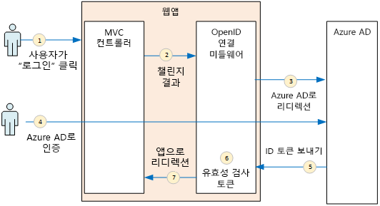
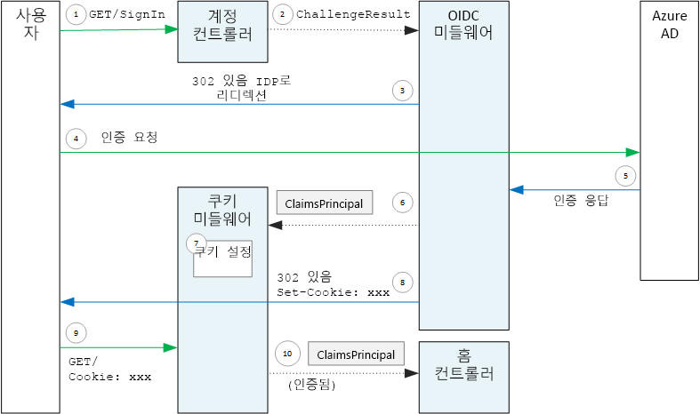

# <a name="authenticate-using-azure-ad-and-openid-connect"></a><span data-ttu-id="98afd-103">Azure AD 및 OpenID Connect를 사용하여 인증</span><span class="sxs-lookup"><span data-stu-id="98afd-103">Authenticate using Azure AD and OpenID Connect</span></span>

<span data-ttu-id="98afd-104">[ 샘플 코드][sample application]</span><span class="sxs-lookup"><span data-stu-id="98afd-104">[ Sample code][sample application]</span></span>

<span data-ttu-id="98afd-105">Surveys 응용 프로그램은 Azure AD(Azure Active Directory)에 사용자를 인증하기 위해 OIDC(OpenID Connect) 프로토콜을 사용합니다.</span><span class="sxs-lookup"><span data-stu-id="98afd-105">The Surveys application uses the OpenID Connect (OIDC) protocol to authenticate users with Azure Active Directory (Azure AD).</span></span> <span data-ttu-id="98afd-106">Surveys 응용 프로그램은 OIDC용 미들웨어를 기본 제공하는 ASP.NET Core를 사용합니다.</span><span class="sxs-lookup"><span data-stu-id="98afd-106">The Surveys application uses ASP.NET Core, which has built-in middleware for OIDC.</span></span> <span data-ttu-id="98afd-107">다음 다이어그램은 사용자가 로그인할 때 진행 과정을 개략적인 수준으로 보여 줍니다.</span><span class="sxs-lookup"><span data-stu-id="98afd-107">The following diagram shows what happens when the user signs in, at a high level.</span></span>



1. <span data-ttu-id="98afd-109">사용자가 앱에서 "로그인" 단추를 클릭합니다.</span><span class="sxs-lookup"><span data-stu-id="98afd-109">The user clicks the "sign in" button in the app.</span></span> <span data-ttu-id="98afd-110">이 작업은 MVC 컨트롤러에서 처리됩니다.</span><span class="sxs-lookup"><span data-stu-id="98afd-110">This action is handled by an MVC controller.</span></span>
2. <span data-ttu-id="98afd-111">MVC 컨트롤러는 **ChallengeResult** 작업을 반환합니다.</span><span class="sxs-lookup"><span data-stu-id="98afd-111">The MVC controller returns a **ChallengeResult** action.</span></span>
3. <span data-ttu-id="98afd-112">미들웨어는 **ChallengeResult** 를 가로채고 사용자를 Azure AD 로그인 페이지로 리디렉션하는 302 응답을 생성합니다.</span><span class="sxs-lookup"><span data-stu-id="98afd-112">The middleware intercepts the **ChallengeResult** and creates a 302 response, which redirects the user to the Azure AD sign-in page.</span></span>
4. <span data-ttu-id="98afd-113">사용자는 Azure AD로 인증합니다.</span><span class="sxs-lookup"><span data-stu-id="98afd-113">The user authenticates with Azure AD.</span></span>
5. <span data-ttu-id="98afd-114">Azure AD는 ID 토큰을 응용 프로그램으로 보냅니다.</span><span class="sxs-lookup"><span data-stu-id="98afd-114">Azure AD sends an ID token to the application.</span></span>
6. <span data-ttu-id="98afd-115">미들웨어는 ID 토큰의 유효성을 검사합니다.</span><span class="sxs-lookup"><span data-stu-id="98afd-115">The middleware validates the ID token.</span></span> <span data-ttu-id="98afd-116">이때 사용자가 응용 프로그램 내부에서 인증됩니다.</span><span class="sxs-lookup"><span data-stu-id="98afd-116">At this point, the user is now authenticated inside the application.</span></span>
7. <span data-ttu-id="98afd-117">미들웨어는 사용자를 응용 프로그램으로 다시 리디렉션합니다.</span><span class="sxs-lookup"><span data-stu-id="98afd-117">The middleware redirects the user back to application.</span></span>

## <a name="register-the-app-with-azure-ad"></a><span data-ttu-id="98afd-118">Azure AD에 앱 등록</span><span class="sxs-lookup"><span data-stu-id="98afd-118">Register the app with Azure AD</span></span>
<span data-ttu-id="98afd-119">OpenID Connect를 사용하도록 설정하려면 SaaS 공급자는 응용 프로그램을 자신의 Azure AD 테넌트 내에 등록합니다.</span><span class="sxs-lookup"><span data-stu-id="98afd-119">To enable OpenID Connect, the SaaS provider registers the application inside their own Azure AD tenant.</span></span>

<span data-ttu-id="98afd-120">응용 프로그램을 등록하려면 [Azure Active Directory와 응용 프로그램 통합](/azure/active-directory/active-directory-integrating-applications/)에서 [응용 프로그램 추가](/azure/active-directory/active-directory-integrating-applications/#adding-an-application) 섹션의 단계를 따릅니다.</span><span class="sxs-lookup"><span data-stu-id="98afd-120">To register the application, follow the steps in [Integrating Applications with Azure Active Directory](/azure/active-directory/active-directory-integrating-applications/), in the section [Adding an Application](/azure/active-directory/active-directory-integrating-applications/#adding-an-application).</span></span>

<span data-ttu-id="98afd-121">Surveys 응용 프로그램 관련 단계는 [Run the Surveys application](./run-the-app.md)(Surveys 응용 프로그램 실행)을 참조하세요.</span><span class="sxs-lookup"><span data-stu-id="98afd-121">See [Run the Surveys application](./run-the-app.md) for the specific steps for the Surveys application.</span></span> <span data-ttu-id="98afd-122">다음 사항에 유의하세요.</span><span class="sxs-lookup"><span data-stu-id="98afd-122">Note the following:</span></span>

- <span data-ttu-id="98afd-123">다중 테넌트 응용 프로그램의 경우 다중 테넌트 옵션을 명시적으로 구성해야 합니다.</span><span class="sxs-lookup"><span data-stu-id="98afd-123">For a multitenant application, you must configure the multi-tenanted option explicitly.</span></span> <span data-ttu-id="98afd-124">이렇게 하면 다른 조직이 응용 프로그램에 액세스할 수 있습니다.</span><span class="sxs-lookup"><span data-stu-id="98afd-124">This enables other organizations to to access the application.</span></span>

- <span data-ttu-id="98afd-125">회신 URL은 Azure AD에서 OAuth 2.0 응답을 보내는 URL입니다.</span><span class="sxs-lookup"><span data-stu-id="98afd-125">The reply URL is the URL where Azure AD will send OAuth 2.0 responses.</span></span> <span data-ttu-id="98afd-126">ASP.NET Core를 사용할 경우 이 URL은 인증 미들웨어에서 구성하는 경로와 일치해야 합니다(다음 섹션 참조).</span><span class="sxs-lookup"><span data-stu-id="98afd-126">When using the ASP.NET Core, this needs to match the path that you configure in the authentication middleware (see next section),</span></span> 

## <a name="configure-the-auth-middleware"></a><span data-ttu-id="98afd-127">인증 미들웨어 구성</span><span class="sxs-lookup"><span data-stu-id="98afd-127">Configure the auth middleware</span></span>
<span data-ttu-id="98afd-128">이 섹션에서는 ASP.NET Core에서 OpenID Connect로 다중 테넌트 인증을 위한 인증 미들웨어를 구성하는 방법을 설명합니다.</span><span class="sxs-lookup"><span data-stu-id="98afd-128">This section describes how to configure the authentication middleware in ASP.NET Core for multitenant authentication with OpenID Connect.</span></span>

<span data-ttu-id="98afd-129">[시작 클래스](/aspnet/core/fundamentals/startup)에서 OpenID Connect 미들웨어를 추가합니다.</span><span class="sxs-lookup"><span data-stu-id="98afd-129">In your [startup class](/aspnet/core/fundamentals/startup), add the OpenID Connect middleware:</span></span>

```csharp
app.UseOpenIdConnectAuthentication(new OpenIdConnectOptions {
    ClientId = configOptions.AzureAd.ClientId,
    ClientSecret = configOptions.AzureAd.ClientSecret, // for code flow
    Authority = Constants.AuthEndpointPrefix,
    ResponseType = OpenIdConnectResponseType.CodeIdToken,
    PostLogoutRedirectUri = configOptions.AzureAd.PostLogoutRedirectUri,
    SignInScheme = CookieAuthenticationDefaults.AuthenticationScheme,
    TokenValidationParameters = new TokenValidationParameters { ValidateIssuer = false },
    Events = new SurveyAuthenticationEvents(configOptions.AzureAd, loggerFactory),
});
```

<span data-ttu-id="98afd-130">일부 설정은 런타임 구성 옵션에서 가져옵니다.</span><span class="sxs-lookup"><span data-stu-id="98afd-130">Notice that some of the settings are taken from runtime configuration options.</span></span> <span data-ttu-id="98afd-131">다음은 미들웨어 옵션의 의미입니다.</span><span class="sxs-lookup"><span data-stu-id="98afd-131">Here's what the middleware options mean:</span></span>

* <span data-ttu-id="98afd-132">**ClientId**.</span><span class="sxs-lookup"><span data-stu-id="98afd-132">**ClientId**.</span></span> <span data-ttu-id="98afd-133">Azure AD에 응용 프로그램을 등록할 때 얻은 응용 프로그램의 클라이언트 ID입니다.</span><span class="sxs-lookup"><span data-stu-id="98afd-133">The application's client ID, which you got when you registered the application in Azure AD.</span></span>
* <span data-ttu-id="98afd-134">**Authority**.</span><span class="sxs-lookup"><span data-stu-id="98afd-134">**Authority**.</span></span> <span data-ttu-id="98afd-135">다중 테넌트 응용 프로그램의 경우 `https://login.microsoftonline.com/common/`으로 설정합니다.</span><span class="sxs-lookup"><span data-stu-id="98afd-135">For a multitenant application, set this to `https://login.microsoftonline.com/common/`.</span></span> <span data-ttu-id="98afd-136">Azure AD 공용 끝점에 대한 URL로, Azure AD 테넌트의 사용자가 이를 통해 로그인할 수 있습니다.</span><span class="sxs-lookup"><span data-stu-id="98afd-136">This is the URL for the Azure AD common endpoint, which enables users from any Azure AD tenant to sign in.</span></span> <span data-ttu-id="98afd-137">공용 끝점에 대한 자세한 내용은 [이 블로그 게시물](http://www.cloudidentity.com/blog/2014/08/26/the-common-endpoint-walks-like-a-tenant-talks-like-a-tenant-but-is-not-a-tenant/)을 참조하세요.</span><span class="sxs-lookup"><span data-stu-id="98afd-137">For more information about the common endpoint, see [this blog post](http://www.cloudidentity.com/blog/2014/08/26/the-common-endpoint-walks-like-a-tenant-talks-like-a-tenant-but-is-not-a-tenant/).</span></span>
* <span data-ttu-id="98afd-138">**TokenValidationParameters**에서 **ValidateIssuer**를 false로 설정합니다.</span><span class="sxs-lookup"><span data-stu-id="98afd-138">In **TokenValidationParameters**, set **ValidateIssuer** to false.</span></span> <span data-ttu-id="98afd-139">이 경우 앱에서 ID 토큰의 발급자 값의 유효성을 검사해야 합니다.</span><span class="sxs-lookup"><span data-stu-id="98afd-139">That means the app will be responsible for validating the issuer value in the ID token.</span></span> <span data-ttu-id="98afd-140">(토큰 자체의 유효성은 계속 미들웨어에서 검사합니다.) 발급자 유효성 검사에 대한 자세한 내용은 [발급자 확인](claims.md#issuer-validation)을 참조하세요.</span><span class="sxs-lookup"><span data-stu-id="98afd-140">(The middleware still validates the token itself.) For more information about validating the issuer, see [Issuer validation](claims.md#issuer-validation).</span></span>
* <span data-ttu-id="98afd-141">**PostLogoutRedirectUri**.</span><span class="sxs-lookup"><span data-stu-id="98afd-141">**PostLogoutRedirectUri**.</span></span> <span data-ttu-id="98afd-142">로그아웃한 후 사용자를 리디렉션할 URL을 지정합니다. 이 URL은 익명 요청을 허용하는 페이지여야 하며, 일반적으로 홈페이지입니다.</span><span class="sxs-lookup"><span data-stu-id="98afd-142">Specify a URL to redirect users after the sign out. This should be a page that allows anonymous requests &mdash; typically the home page.</span></span>
* <span data-ttu-id="98afd-143">**SignInScheme**.</span><span class="sxs-lookup"><span data-stu-id="98afd-143">**SignInScheme**.</span></span> <span data-ttu-id="98afd-144">`CookieAuthenticationDefaults.AuthenticationScheme`로 설정합니다.</span><span class="sxs-lookup"><span data-stu-id="98afd-144">Set this to `CookieAuthenticationDefaults.AuthenticationScheme`.</span></span> <span data-ttu-id="98afd-145">이 설정은 사용자가 인증된 후 사용자 클레임이 쿠키에 로컬로 저장됨을 의미합니다.</span><span class="sxs-lookup"><span data-stu-id="98afd-145">This setting means that after the user is authenticated, the user claims are stored locally in a cookie.</span></span> <span data-ttu-id="98afd-146">이 쿠키는 브라우저 세션 중에 사용자가 로그인을 유지하는 방법입니다.</span><span class="sxs-lookup"><span data-stu-id="98afd-146">This cookie is how the user stays logged in during the browser session.</span></span>
* <span data-ttu-id="98afd-147">**이벤트.**</span><span class="sxs-lookup"><span data-stu-id="98afd-147">**Events.**</span></span> <span data-ttu-id="98afd-148">이벤트 콜백, [인증 이벤트](#authentication-events)입니다.</span><span class="sxs-lookup"><span data-stu-id="98afd-148">Event callbacks; see [Authentication events](#authentication-events).</span></span>

<span data-ttu-id="98afd-149">또한 파이프라인에 쿠키 인증 미들웨어를 추가합니다.</span><span class="sxs-lookup"><span data-stu-id="98afd-149">Also add the Cookie Authentication middleware to the pipeline.</span></span> <span data-ttu-id="98afd-150">이 미들웨어는 쿠키에 사용자 클레임을 기록한 후 후속 페이지 로드 중에 쿠키를 읽는 역할을 합니다.</span><span class="sxs-lookup"><span data-stu-id="98afd-150">This middleware is responsible for writing the user claims to a cookie, and then reading the cookie during subsequent page loads.</span></span>

```csharp
app.UseCookieAuthentication(new CookieAuthenticationOptions {
    AutomaticAuthenticate = true,
    AutomaticChallenge = true,
    AccessDeniedPath = "/Home/Forbidden",
    CookieSecure = CookieSecurePolicy.Always,

    // The default setting for cookie expiration is 14 days. SlidingExpiration is set to true by default
    ExpireTimeSpan = TimeSpan.FromHours(1),
    SlidingExpiration = true
});
```

## <a name="initiate-the-authentication-flow"></a><span data-ttu-id="98afd-151">인증 흐름 시작</span><span class="sxs-lookup"><span data-stu-id="98afd-151">Initiate the authentication flow</span></span>
<span data-ttu-id="98afd-152">ASP.NET MVC에서 인증 흐름을 시작하려면 컨트롤러에서 **ChallengeResult** 를 반환합니다.</span><span class="sxs-lookup"><span data-stu-id="98afd-152">To start the authentication flow in ASP.NET MVC, return a **ChallengeResult** from the contoller:</span></span>

```csharp
[AllowAnonymous]
public IActionResult SignIn()
{
    return new ChallengeResult(
        OpenIdConnectDefaults.AuthenticationScheme,
        new AuthenticationProperties
        {
            IsPersistent = true,
            RedirectUri = Url.Action("SignInCallback", "Account")
        });
}
```

<span data-ttu-id="98afd-153">그러면 미들웨어가 인증 끝점으로 리디렉션하는 302(Found) 응답을 반환합니다.</span><span class="sxs-lookup"><span data-stu-id="98afd-153">This causes the middleware to return a 302 (Found) response that redirects to the authentication endpoint.</span></span>

## <a name="user-login-sessions"></a><span data-ttu-id="98afd-154">사용자 로그인 세션</span><span class="sxs-lookup"><span data-stu-id="98afd-154">User login sessions</span></span>
<span data-ttu-id="98afd-155">언급했듯이 사용자가 처음 로그인할 때, 쿠키 인증 미들웨어는 사용자 클레임을 쿠키에 씁니다.</span><span class="sxs-lookup"><span data-stu-id="98afd-155">As mentioned, when the user first signs in, the Cookie Authentication middleware writes the user claims to a cookie.</span></span> <span data-ttu-id="98afd-156">그 후에는 쿠키를 읽어 HTTP 요청을 인증합니다.</span><span class="sxs-lookup"><span data-stu-id="98afd-156">After that, HTTP requests are authenticated by reading the cookie.</span></span>

<span data-ttu-id="98afd-157">기본적으로 쿠키 미들웨어는 [세션 쿠키][session-cookie]를 쓰며, 이 쿠키는 사용자가 브라우저를 닫으면 삭제됩니다.</span><span class="sxs-lookup"><span data-stu-id="98afd-157">By default, the cookie middleware writes a [session cookie][session-cookie], which gets deleted once the user closes the browser.</span></span> <span data-ttu-id="98afd-158">따라서 다음에 사용자가 사이트를 방문하는 경우 다시 로그인해야 합니다.</span><span class="sxs-lookup"><span data-stu-id="98afd-158">The next time the user next visits the site, they will have to sign in again.</span></span> <span data-ttu-id="98afd-159">그러나 **ChallengeResult**에서 **IsPersistent**를 true로 설정하면 미들웨어가 영구 쿠키를 쓰므로 사용자가 브라우저를 닫은 후에도 로그인 상태로 유지됩니다.</span><span class="sxs-lookup"><span data-stu-id="98afd-159">However, if you set **IsPersistent** to true in the **ChallengeResult**, the middleware writes a persistent cookie, so the user stays logged in after closing the browser.</span></span> <span data-ttu-id="98afd-160">쿠키 만료를 구성할 수 있습니다. [쿠키 옵션 제어][cookie-options]를 참조하세요.</span><span class="sxs-lookup"><span data-stu-id="98afd-160">You can configure the cookie expiration; see [Controlling cookie options][cookie-options].</span></span> <span data-ttu-id="98afd-161">영구 쿠키는 사용자에게 더 편리하지만 사용자에게 매번 로그인하도록 하는 일부 응용 프로그램(예: 뱅킹 응용 프로그램)에는 적합하지 않을 수 있습니다.</span><span class="sxs-lookup"><span data-stu-id="98afd-161">Persistent cookies are more convenient for the user, but may be inappropriate for some applications (say, a banking application) where you want the user to sign in every time.</span></span>

## <a name="about-the-openid-connect-middleware"></a><span data-ttu-id="98afd-162">OpenID Connect 미들웨어 정보</span><span class="sxs-lookup"><span data-stu-id="98afd-162">About the OpenID Connect middleware</span></span>
<span data-ttu-id="98afd-163">ASP.NET의 OpenID Connect 미들웨어는 대부분의 프로토콜 정보를 숨깁니다.</span><span class="sxs-lookup"><span data-stu-id="98afd-163">The OpenID Connect middleware in ASP.NET hides most of the protocol details.</span></span> <span data-ttu-id="98afd-164">이 섹션에는 프로토콜 흐름을 이해하는 데 유용할 수 있는 구현에 대 한 일부 정보가 들어 있습니다.</span><span class="sxs-lookup"><span data-stu-id="98afd-164">This section contains some notes about the implementation, that may be useful for understanding the protocol flow.</span></span>

<span data-ttu-id="98afd-165">먼저, ASP.NET를 기준으로 하는 인증 흐름을 살펴보겠습니다(앱과 Azure AD 간의 OIDC 프로토콜 흐름에 대한 세부 정보는 생략).</span><span class="sxs-lookup"><span data-stu-id="98afd-165">First, let's examine the authentication flow in terms of ASP.NET (ignoring the details of the OIDC protocol flow between the app and Azure AD).</span></span> <span data-ttu-id="98afd-166">다음 다이어그램은 이 프로세스를 보여 줍니다.</span><span class="sxs-lookup"><span data-stu-id="98afd-166">The following diagram shows the process.</span></span>



<span data-ttu-id="98afd-168">이 다이어그램에는 두 개의 MVC 컨트롤러가 있습니다.</span><span class="sxs-lookup"><span data-stu-id="98afd-168">In this diagram, there are two MVC controllers.</span></span> <span data-ttu-id="98afd-169">Account 컨트롤러는 로그인 요청을 처리하고 Home 컨트롤러는 홈 페이지를 서비스합니다.</span><span class="sxs-lookup"><span data-stu-id="98afd-169">The Account controller handles sign-in requests, and the Home controller serves up the home page.</span></span>

<span data-ttu-id="98afd-170">다음은 인증 프로세스입니다.</span><span class="sxs-lookup"><span data-stu-id="98afd-170">Here is the authentication process:</span></span>

1. <span data-ttu-id="98afd-171">사용자가 "로그인" 단추를 클릭하면 브라우저는 GET 요청을 보냅니다.</span><span class="sxs-lookup"><span data-stu-id="98afd-171">The user clicks the "Sign in" button, and the browser sends a GET request.</span></span> <span data-ttu-id="98afd-172">예: `GET /Account/SignIn/`</span><span class="sxs-lookup"><span data-stu-id="98afd-172">For example: `GET /Account/SignIn/`.</span></span>
2. <span data-ttu-id="98afd-173">Account 컨트롤러는 `ChallengeResult`를 반환합니다.</span><span class="sxs-lookup"><span data-stu-id="98afd-173">The account controller returns a `ChallengeResult`.</span></span>
3. <span data-ttu-id="98afd-174">OIDC 미들웨어는 Azure AD로 리디렉션하는 HTTP 302 응답을 반환합니다.</span><span class="sxs-lookup"><span data-stu-id="98afd-174">The OIDC middleware returns an HTTP 302 response, redirecting to Azure AD.</span></span>
4. <span data-ttu-id="98afd-175">브라우저가 Azure AD에 인증 요청을 보냅니다.</span><span class="sxs-lookup"><span data-stu-id="98afd-175">The browser sends the authentication request to Azure AD</span></span>
5. <span data-ttu-id="98afd-176">사용자가 Azure AD에 로그인하고 Azure AD는 인증 응답을 다시 보냅니다.</span><span class="sxs-lookup"><span data-stu-id="98afd-176">The user signs in to Azure AD, and Azure AD sends back an authentication response.</span></span>
6. <span data-ttu-id="98afd-177">OIDC 미들웨어는 클레임 주체를 만들고 이를 쿠키 인증 미들웨어에 전달합니다.</span><span class="sxs-lookup"><span data-stu-id="98afd-177">The OIDC middleware creates a claims principal and passes it to the Cookie Authentication middleware.</span></span>
7. <span data-ttu-id="98afd-178">쿠키 미들웨어는 클레임 주체를 직렬화하고 쿠키를 설정합니다.</span><span class="sxs-lookup"><span data-stu-id="98afd-178">The cookie middleware serializes the claims principal and sets a cookie.</span></span>
8. <span data-ttu-id="98afd-179">OIDC 미들웨어는 응용 프로그램의 콜백 URL로 리디렉션됩니다.</span><span class="sxs-lookup"><span data-stu-id="98afd-179">The OIDC middleware redirects to the application's callback URL.</span></span>
9. <span data-ttu-id="98afd-180">브라우저는 요청에 쿠키를 전송하는 리디렉션을 따릅니다.</span><span class="sxs-lookup"><span data-stu-id="98afd-180">The browser follows the redirect, sending the cookie in the request.</span></span>
10. <span data-ttu-id="98afd-181">쿠키 미들웨어는 클레임 주체로 쿠키를 역직렬화하고 클레임 주체와 동일하게 `HttpContext.User` 를 설정합니다.</span><span class="sxs-lookup"><span data-stu-id="98afd-181">The cookie middleware deserializes the cookie to a claims principal and sets `HttpContext.User` equal to the claims principal.</span></span> <span data-ttu-id="98afd-182">요청은 MVC 컨트롤러로 라우팅됩니다.</span><span class="sxs-lookup"><span data-stu-id="98afd-182">The request is routed to an MVC controller.</span></span>

### <a name="authentication-ticket"></a><span data-ttu-id="98afd-183">인증 티켓</span><span class="sxs-lookup"><span data-stu-id="98afd-183">Authentication ticket</span></span>
<span data-ttu-id="98afd-184">인증이 성공하면 OIDC 미들웨어는 사용자의 클레임을 보유하는 클레임 주체를 포함하는 인증 티켓을 만듭니다.</span><span class="sxs-lookup"><span data-stu-id="98afd-184">If authentication succeeds, the OIDC middleware creates an authentication ticket, which contains a claims principal that holds the user's claims.</span></span> <span data-ttu-id="98afd-185">**AuthenticationValidated** 또는 **TicketReceived** 이벤트 내에서 티켓에 액세스할 수 있습니다.</span><span class="sxs-lookup"><span data-stu-id="98afd-185">You can access the ticket inside the **AuthenticationValidated** or **TicketReceived** event.</span></span>

> [!NOTE]
> <span data-ttu-id="98afd-186">전체 인증 흐름이 완료될 때까지 `HttpContext.User`는 익명 보안 주체를 계속 보유하며 인증된 사용자가 **아닙니다**.</span><span class="sxs-lookup"><span data-stu-id="98afd-186">Until the entire authentication flow is completed, `HttpContext.User` still holds an anonymous principal, **not** the authenticated user.</span></span> <span data-ttu-id="98afd-187">익명 보안 주체에는 빈 클레임 컬렉션이 있습니다.</span><span class="sxs-lookup"><span data-stu-id="98afd-187">The anonymous principal has an empty claims collection.</span></span> <span data-ttu-id="98afd-188">인증이 완료되고 앱이 리디렉션된 후에는 쿠키 미들웨어가 인증 쿠키를 역직렬화하고 `HttpContext.User` 를 인증된 사용자를 나타내는 클레임 주체로 설정합니다.</span><span class="sxs-lookup"><span data-stu-id="98afd-188">After authentication completes and the app redirects, the cookie middleware deserializes the authentication cookie and sets `HttpContext.User` to a claims principal that represents the authenticated user.</span></span>
> 
> 

### <a name="authentication-events"></a><span data-ttu-id="98afd-189">인증 이벤트</span><span class="sxs-lookup"><span data-stu-id="98afd-189">Authentication events</span></span>
<span data-ttu-id="98afd-190">인증 프로세스 중에 OpenID Connect 미들웨어는 일련의 이벤트를 발생시킵니다.</span><span class="sxs-lookup"><span data-stu-id="98afd-190">During the authentication process, the OpenID Connect middleware raises a series of events:</span></span>

* <span data-ttu-id="98afd-191">**RedirectToIdentityProvider**.</span><span class="sxs-lookup"><span data-stu-id="98afd-191">**RedirectToIdentityProvider**.</span></span> <span data-ttu-id="98afd-192">미들웨어가 인증 끝점으로 리디렉션하기 직전에 호출됩니다.</span><span class="sxs-lookup"><span data-stu-id="98afd-192">Called right before the middleware redirects to the authentication endpoint.</span></span> <span data-ttu-id="98afd-193">이 이벤트를 사용하여 리디렉션 URL을 수정할 수 있습니다. 예를 들어 요청 매개변수를 추가할 수 있습니다.</span><span class="sxs-lookup"><span data-stu-id="98afd-193">You can use this event to modify the redirect URL; for example, to add request parameters.</span></span> <span data-ttu-id="98afd-194">예를 보려면 [관리자 동의 프롬프트 추가하기](signup.md#adding-the-admin-consent-prompt)를 참조하세요.</span><span class="sxs-lookup"><span data-stu-id="98afd-194">See [Adding the admin consent prompt](signup.md#adding-the-admin-consent-prompt) for an example.</span></span>
* <span data-ttu-id="98afd-195">**AuthorizationCodeReceived**.</span><span class="sxs-lookup"><span data-stu-id="98afd-195">**AuthorizationCodeReceived**.</span></span> <span data-ttu-id="98afd-196">인증 코드와 함께 호출됩니다.</span><span class="sxs-lookup"><span data-stu-id="98afd-196">Called with the authorization code.</span></span>
* <span data-ttu-id="98afd-197">**TokenResponseReceived**.</span><span class="sxs-lookup"><span data-stu-id="98afd-197">**TokenResponseReceived**.</span></span> <span data-ttu-id="98afd-198">미들웨어가 IDP에서 액세스 토큰을 가져오고 토큰의 유효성을 검사하기 전에 호출됩니다.</span><span class="sxs-lookup"><span data-stu-id="98afd-198">Called after the middleware gets an access token from the IDP, but before it is validated.</span></span> <span data-ttu-id="98afd-199">인증 코드 흐름에만 적용됩니다.</span><span class="sxs-lookup"><span data-stu-id="98afd-199">Applies only to authorization code flow.</span></span>
* <span data-ttu-id="98afd-200">**TokenValidated**.</span><span class="sxs-lookup"><span data-stu-id="98afd-200">**TokenValidated**.</span></span> <span data-ttu-id="98afd-201">미들웨어가 ID 토큰의 유효성을 검사한 후 호출됩니다.</span><span class="sxs-lookup"><span data-stu-id="98afd-201">Called after the middleware validates the ID token.</span></span> <span data-ttu-id="98afd-202">이때 응용 프로그램에는 사용자에 대해 유효성 검증된 클레임 집합이 포함됩니다.</span><span class="sxs-lookup"><span data-stu-id="98afd-202">At this point, the application has a set of validated claims about the user.</span></span> <span data-ttu-id="98afd-203">이 이벤트를 사용하여 클레임에 대한 추가 유효성 검사를 수행하거나 클레임을 변환할 수 있습니다.</span><span class="sxs-lookup"><span data-stu-id="98afd-203">You can use this event to perform additional validation on the claims, or to transform claims.</span></span> <span data-ttu-id="98afd-204">[클레임 작업](claims.md)을 참조하세요.</span><span class="sxs-lookup"><span data-stu-id="98afd-204">See [Working with claims](claims.md).</span></span>
* <span data-ttu-id="98afd-205">**UserInformationReceived**.</span><span class="sxs-lookup"><span data-stu-id="98afd-205">**UserInformationReceived**.</span></span> <span data-ttu-id="98afd-206">미들웨어가 사용자 정보 끝점에서 사용자 프로필을 가져오는 경우 호출됩니다.</span><span class="sxs-lookup"><span data-stu-id="98afd-206">Called if the middleware gets the user profile from the user info endpoint.</span></span> <span data-ttu-id="98afd-207">인증 코드 흐름에만 적용되며 미들웨어 옵션에서 `GetClaimsFromUserInfoEndpoint = true` 인 경우에만 적용됩니다.</span><span class="sxs-lookup"><span data-stu-id="98afd-207">Applies only to authorization code flow, and only when `GetClaimsFromUserInfoEndpoint = true` in the middleware options.</span></span>
* <span data-ttu-id="98afd-208">**TicketReceived**.</span><span class="sxs-lookup"><span data-stu-id="98afd-208">**TicketReceived**.</span></span> <span data-ttu-id="98afd-209">인증이 완료되면 호출됩니다.</span><span class="sxs-lookup"><span data-stu-id="98afd-209">Called when authentication is completed.</span></span> <span data-ttu-id="98afd-210">인증이 성공했다고 가정할 경우 마지막 이벤트입니다.</span><span class="sxs-lookup"><span data-stu-id="98afd-210">This is the last event, assuming that authentication succeeds.</span></span> <span data-ttu-id="98afd-211">이 이벤트가 처리된 후에는 사용자가 앱에 로그인됩니다.</span><span class="sxs-lookup"><span data-stu-id="98afd-211">After this event is handled, the user is signed into the app.</span></span>
* <span data-ttu-id="98afd-212">**AuthenticationFailed**.</span><span class="sxs-lookup"><span data-stu-id="98afd-212">**AuthenticationFailed**.</span></span> <span data-ttu-id="98afd-213">인증에 실패하면 호출됩니다.</span><span class="sxs-lookup"><span data-stu-id="98afd-213">Called if authentication fails.</span></span> <span data-ttu-id="98afd-214">이 이벤트를 사용하여 인증 오류를 처리합니다. 예를 들어 오류 페이지로 리디렉션합니다.</span><span class="sxs-lookup"><span data-stu-id="98afd-214">Use this event to handle authentication failures &mdash; for example, by redirecting to an error page.</span></span>

<span data-ttu-id="98afd-215">이러한 이벤트에 대한 콜백을 제공하려면 미들웨어에서 **Events** 옵션을 설정합니다.</span><span class="sxs-lookup"><span data-stu-id="98afd-215">To provide callbacks for these events, set the **Events** option on the middleware.</span></span> <span data-ttu-id="98afd-216">이벤트 처리기를 선언하는 방법은 람다를 사용하여 인라인으로 선언하거나 **OpenIdConnectEvents**에서 파생되는 클래스에서 선언하는 두 가지 방법이 있습니다.</span><span class="sxs-lookup"><span data-stu-id="98afd-216">There are two different ways to declare the event handlers: Inline with lambdas, or in a class that derives from **OpenIdConnectEvents**.</span></span> <span data-ttu-id="98afd-217">이벤트 콜백에 많은 논리가 있는 경우 두 번째 방법을 사용하는 것이 좋은데, 시작 클래스를 복잡하게 만들지 않기 때문입니다.</span><span class="sxs-lookup"><span data-stu-id="98afd-217">The second approach is recommended if your event callbacks have any substantial logic, so they don't clutter your startup class.</span></span> <span data-ttu-id="98afd-218">여기의 참조 구현에서는 이 방법을 사용합니다.</span><span class="sxs-lookup"><span data-stu-id="98afd-218">Our reference implementation uses this approach.</span></span>

### <a name="openid-connect-endpoints"></a><span data-ttu-id="98afd-219">OpenID Connect 끝점</span><span class="sxs-lookup"><span data-stu-id="98afd-219">OpenID connect endpoints</span></span>
<span data-ttu-id="98afd-220">Azure AD는 [OpenID Connect 검색](https://openid.net/specs/openid-connect-discovery-1_0.html)을 지원하는데, 여기에서 IDP(ID 공급자)는 [잘 알려진 끝점](https://openid.net/specs/openid-connect-discovery-1_0.html#ProviderConfig)에서 JSON 메타데이터 문서를 반환합니다.</span><span class="sxs-lookup"><span data-stu-id="98afd-220">Azure AD supports [OpenID Connect Discovery](https://openid.net/specs/openid-connect-discovery-1_0.html), wherein the identity provider (IDP) returns a JSON metadata document from a [well-known endpoint](https://openid.net/specs/openid-connect-discovery-1_0.html#ProviderConfig).</span></span> <span data-ttu-id="98afd-221">메타데이터 문서에는 다음과 같은 정보가 들어 있습니다.</span><span class="sxs-lookup"><span data-stu-id="98afd-221">The metadata document contains information such as:</span></span>

* <span data-ttu-id="98afd-222">권한 부여 끝점의 URL.</span><span class="sxs-lookup"><span data-stu-id="98afd-222">The URL of the authorization endpoint.</span></span> <span data-ttu-id="98afd-223">사용자 인증을 위해 앱이 리디렉션되는 위치입니다.</span><span class="sxs-lookup"><span data-stu-id="98afd-223">This is where the app redirects to authenticate the user.</span></span>
* <span data-ttu-id="98afd-224">앱이 사용자를 로그아웃하기 위해서 가는 "세션 종료" 끝점의 URL입니다.</span><span class="sxs-lookup"><span data-stu-id="98afd-224">The URL of the "end session" endpoint, where the app goes to log out the user.</span></span>
* <span data-ttu-id="98afd-225">클라이언트가 IDP에서 가져온 OIDC 토큰의 유효성을 검사하기 위해 사용하는 서명 키를 가져올 URL입니다.</span><span class="sxs-lookup"><span data-stu-id="98afd-225">The URL to get the signing keys, which the client uses to validate the OIDC tokens that it gets from the IDP.</span></span>

<span data-ttu-id="98afd-226">기본적으로 OIDC 미들웨어는 이 메타데이터를 가져오는 방법을 알고 있습니다.</span><span class="sxs-lookup"><span data-stu-id="98afd-226">By default, the OIDC middleware knows how to fetch this metadata.</span></span> <span data-ttu-id="98afd-227">미들웨어에서 **Authority** 옵션을 설정하면 미들웨어는 메타데이터에 대한 URL을 구성합니다.</span><span class="sxs-lookup"><span data-stu-id="98afd-227">Set the **Authority** option in the middleware, and the middleware constructs the URL for the metadata.</span></span> <span data-ttu-id="98afd-228">(**MetadataAddress** 옵션을 설정하여 메타데이터 URL을 재정의할 수 있습니다.)</span><span class="sxs-lookup"><span data-stu-id="98afd-228">(You can override the metadata URL by setting the **MetadataAddress** option.)</span></span>

### <a name="openid-connect-flows"></a><span data-ttu-id="98afd-229">OpenID connect 흐름</span><span class="sxs-lookup"><span data-stu-id="98afd-229">OpenID connect flows</span></span>
<span data-ttu-id="98afd-230">기본적으로 OIDC 미들웨어는 폼 게시 응답 모드로 하이브리드 흐름을 사용합니다.</span><span class="sxs-lookup"><span data-stu-id="98afd-230">By default, the OIDC middleware uses hybrid flow with form post response mode.</span></span>

* <span data-ttu-id="98afd-231">*하이브리드 흐름*은 클라이언트가 동일한 왕복에 있는 ID 토큰 및 인증 코드를 인증 서버로 가져올 수 있음을 의미합니다.</span><span class="sxs-lookup"><span data-stu-id="98afd-231">*Hybrid flow* means the client can get an ID token and an authorization code in the same round-trip to the authorization server.</span></span>
* <span data-ttu-id="98afd-232">*폼 게시 응답 모드*는 인증 서버가 HTTP POST 요청을 사용하여 ID 토큰 및 인증 코드를 앱으로 보내는 것을 의미합니다.</span><span class="sxs-lookup"><span data-stu-id="98afd-232">*Form post reponse mode* means the authorization server uses an HTTP POST request to send the ID token and authorization code to the app.</span></span> <span data-ttu-id="98afd-233">값은 form-urlencoded입니다(content type = "application/x-www-form-urlencoded").</span><span class="sxs-lookup"><span data-stu-id="98afd-233">The values are form-urlencoded (content type = "application/x-www-form-urlencoded").</span></span>

<span data-ttu-id="98afd-234">OIDC 미들웨어가 권한 부여 끝점으로 리디렉션되면 리디렉션 URL은 OIDC에 필요한 모든 쿼리 문자열 매개 변수를 포함합니다.</span><span class="sxs-lookup"><span data-stu-id="98afd-234">When the OIDC middleware redirects to the authorization endpoint, the redirect URL includes all of the query string parameters needed by OIDC.</span></span> <span data-ttu-id="98afd-235">하이브리드 흐름의 경우 다음과 같습니다.</span><span class="sxs-lookup"><span data-stu-id="98afd-235">For hybrid flow:</span></span>

* <span data-ttu-id="98afd-236">client_id.</span><span class="sxs-lookup"><span data-stu-id="98afd-236">client_id.</span></span> <span data-ttu-id="98afd-237">이 값은 **ClientId** 옵션에서 설정됩니다.</span><span class="sxs-lookup"><span data-stu-id="98afd-237">This value is set in the **ClientId** option</span></span>
* <span data-ttu-id="98afd-238">scope = "openid profile", OIDC 요청이며 사용자의 프로필을 원한다는 것을 의미합니다.</span><span class="sxs-lookup"><span data-stu-id="98afd-238">scope = "openid profile", which means it's an OIDC request and we want the user's profile.</span></span>
* <span data-ttu-id="98afd-239">response_type  = "code id_token".</span><span class="sxs-lookup"><span data-stu-id="98afd-239">response_type  = "code id_token".</span></span> <span data-ttu-id="98afd-240">하이브리드 흐름을 지정합니다.</span><span class="sxs-lookup"><span data-stu-id="98afd-240">This specifies hybrid flow.</span></span>
* <span data-ttu-id="98afd-241">response_mode = "form_post".</span><span class="sxs-lookup"><span data-stu-id="98afd-241">response_mode = "form_post".</span></span> <span data-ttu-id="98afd-242">폼 게시 응답을 지정합니다.</span><span class="sxs-lookup"><span data-stu-id="98afd-242">This specifies form post response.</span></span>

<span data-ttu-id="98afd-243">서로 다른 흐름을 지정하려면 옵션에서 **ResponseType** 속성을 설정합니다.</span><span class="sxs-lookup"><span data-stu-id="98afd-243">To specify a different flow, set the **ResponseType** property on the options.</span></span> <span data-ttu-id="98afd-244">예: </span><span class="sxs-lookup"><span data-stu-id="98afd-244">For example:</span></span>

```csharp
app.UseOpenIdConnectAuthentication(options =>
{
    options.ResponseType = "code"; // Authorization code flow

    // Other options
}
```

<span data-ttu-id="98afd-245">[**다음**][claims]</span><span class="sxs-lookup"><span data-stu-id="98afd-245">[**Next**][claims]</span></span>

[claims]: claims.md
[cookie-options]: /aspnet/core/security/authentication/cookie#controlling-cookie-options
[session-cookie]: https://en.wikipedia.org/wiki/HTTP_cookie#Session_cookie
[sample application]: https://github.com/mspnp/multitenant-saas-guidance
