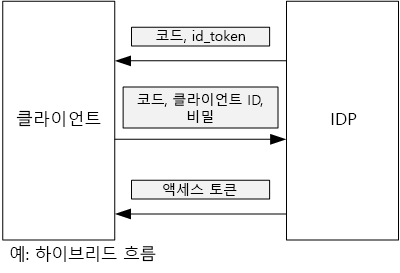

# Azure AD에서 액세스 토큰을 가져오기 위한 클라이언트 어설션 사용

[ 샘플 코드][sample application]

## 배경
OpenID Connect에서 인증 코드 흐름 또는 하이브리드 흐름을 사용할 때, 클라이언트는 인증 코드와 액세스 토큰을 교환합니다. 이 단계에서 클라이언트는 서버에 자신을 인증해야 합니다.



클라이언트를 인증하는 한 가지 방법은 클라이언트 암호를 사용하는 것입니다. 이는 [Tailspin Surveys][Surveys] 응용 프로그램이 기본값으로 구성되는 방법입니다.

다음은 클라이언트에서 IDP로 액세스 토큰을 요청하는 예입니다. `client_secret` 매개변수에 주목하세요.

```
POST https://login.microsoftonline.com/b9bd2162xxx/oauth2/token HTTP/1.1
Content-Type: application/x-www-form-urlencoded

resource=https://tailspin.onmicrosoft.com/surveys.webapi
  &client_id=87df91dc-63de-4765-8701-b59cc8bd9e11
  &client_secret=i3Bf12Dn...
  &grant_type=authorization_code
  &code=PG8wJG6Y...
```

암호는 단지 문자열이므로 그 값이 유출되지 않도록 합니다. 모범 사례는 클라이언트 암호가 소스 제어를 받지 않게 하는 것입니다. Azure에 배포할 때, [앱 설정][configure-web-app]에 암호를 저장합니다.

하지만, 누구나 Azure 구독을 액세스하면 앱 설정을 볼 수 있습니다. 또 소스 제어로 들어가는 암호를 확인하고 싶은 유혹(예: 배포 스크립트에서), 이메일 등에 의해 그것을 공유하고 싶은 유혹이 항상 있습니다.

추가 보안을 위해서, 클라이언트 암호 대신 [클라이언트 어설션](https://tools.ietf.org/html/rfc7521) 을 사용할 수 있습니다.  클라이언트 어설션에서, 클라이언트는 토큰 요청이 클라이언트로부터 온 것임을 증명하기 위해서 Z.509 인증서를 사용합니다.  클라이언트 인증서는 웹 서버에 설치됩니다. 일반적으로, 아무도 클라이언트 암호를 무심코 폭로하지 못하게 하기보다 인증서에 대한 접근을 제한하는 것이 더 쉬울 것입니다.  웹 앱에서 인증서 구성에 대한 자세한 정보는, [Azure 웹사이트 응용 프로그램에서 인증서 사용하기][using-certs-in-websites]를 참조하세요.

다음은 클라이언트 어설션을 사용한 토큰 요청입니다. 
```
POST https://login.microsoftonline.com/b9bd2162xxx/oauth2/token HTTP/1.1
Content-Type: application/x-www-form-urlencoded

resource=https://tailspin.onmicrosoft.com/surveys.webapi
  &client_id=87df91dc-63de-4765-8701-b59cc8bd9e11
  &client_assertion_type=urn:ietf:params:oauth:client-assertion-type:jwt-bearer
  &client_assertion=eyJhbGci...
  &grant_type=authorization_code
  &code= PG8wJG6Y...
```

`client_secret` 매개변수가 더 이상 사용되지 않음에 주의하세요. 그 대신, `client_assertion` 매개변수가 클라이언트 인증서를 사용하여 서명된 JWT 토큰을 포함합니다. `client_assertion_type` 매개변수는 어설션 유형을 지정합니다 — 이 경우 JWT 토큰. 서버는 JWT 토큰을 확인합니다. JWT 토큰이 유효하지 않은 경우, 토큰 요청은 오류를 반환합니다.

> [!참고]
> X.509 인증서가 클라이언트 어설션의 유일한 양식은 아닙니다; 우리가 클라이언트 어설션에 초점을 맞추는 이유는 Azure AD에서 지원하는 양식이기 때문입니다.
> 
> 

## Surveys 응용 프로그램에서 클라이언트 어설션 사용하기
이 절에서는 클라이언트 어설션을 사용하기 위해 Tailspin Surveys 응용 프로그램을 어떻게 구성하는지 보여줍니다. 이 단계에서, 개발에 적절하지만 생산품 사용에는 부적절한 자체 서명된 인증서를 생성할 것입니다.

1. 다음과 같이 PowerShell 스크립트 [/Scripts/Setup-KeyVault.ps1][Setup-KeyVault]를 실행합니다:
   
    ```
    .\Setup-KeyVault.ps -Subject [subject]
    ```
   
Subject 매개변수에, "surveysapp"처럼, 아무 이름이나 입력합니다. 스크립트는 자체 서명된 인증서를 생성해서 "Current User/Personal" 인증서 저장소에 저장합니다.
   
2. 스크립트의 출력은 JSON 조각입니다. 이 출력을 다음과 같이 웹 앱의 응용 프로그램 매니페스트에 추가합니다:
   
   1. [Azure 관리 포털][azure-management-portal]에 로그인하여 Azure AD 디렉터리를 탐색합니다.
   2. **응용 프로그램**을 클릭합니다.
   3. Surveys 응용 프로그램을 선택합니다.
   4. **매니페스트 관리**를 클릭하고 **매니페스트 다운로드**를 선택합니다.
   5. 텍스트 편집기에서 매니페스트 JSON 파일을 엽니다. 스크립트의 출력을 `keyCredentials` 속성에 붙여넣습니다. 결과는 다음과 같습니다.
      
      ```    
      "keyCredentials": [
        {
          "type": "AsymmetricX509Cert",
          "usage": "Verify",
          "keyId": "29d4f7db-0539-455e-b708-....",
          "customKeyIdentifier": "ZEPpP/+KJe2fVDBNaPNOTDoJMac=",
          "value": "MIIDAjCCAeqgAwIBAgIQFxeRiU59eL.....
        }
      ],
      ```
   6. 변경 내용을 JSON 파일에 저장합니다.
   7. 포털로 돌아갑니다. **매니페스트 관리** > **매니페스트 업로드**를 클릭하고 JSON 파일을 업로드합니다.
   
3. 인증서 지문이 표시되도록 다음 명령어를 실행합니다.
   
    ```
    certutil -store -user my [subject]
    ```
   
   여기서 [subject]는 PowerShell 스크립트에서 Subject에 지정한 값입니다. 지문은 "인증서 해시(sha1)"에 목록으로 되어 있습니다. 16진수 사이에 있는 여백을 제거합니다.
   
4. 4.	앱 암호를 업데이트합니다. Solution Explorer에서, Tailspin.Surveys.Web 프로젝트에서 마우스 오른쪽 단추를 클릭하고 **사용자 암호 관리**를 선택합니다. 아래와 같이 "AzureAd"에서 "비대칭" 항목을 추가합니다:
   
    ```
    {
      "AzureAd": {
        "ClientId": "[Surveys application client ID]",
        // "ClientSecret": "[client secret]",  << Delete this entry
        "PostLogoutRedirectUri": "https://localhost:44300/",
        "WebApiResourceId": "[App ID URI of your Survey.WebAPI application]",
        // new:
        "Asymmetric": {
          "CertificateThumbprint": "[certificate thumbprint]",  // Example: "105b2ff3bc842c53582661716db1b7cdc6b43ec9"
          "StoreName": "My",
          "StoreLocation": "CurrentUser",
          "ValidationRequired": "false"
        }
      },
      "Redis": {
        "Configuration": "[Redis connection string]"
      }
    }
    ```
   
   인증서가 최상위 CA 기관에서 서명한 것이 아니기 때문에 `ValidationRequired` 를 false로 설정해야 합니다. 생산품에서, CA 기관에서 서명한 인증서를 사용하고 `ValidationRequired`를 true로 설정합니다.
   
   `ClientSecret`에 대한 항목은 클라이언트 어설션에는 필요하지 않으므로 삭제합니다.
   
5. Startup.cs에서, `ICredentialService`를 등록하는 코드를 찾습니다. `CertificateCredentialService`를 사용한 줄에서 주석 처리를 제거하고,`ClientCredentialService`를 사용한 줄을 주석으로 처리합니다 :

   
    ```csharp
    // Uncomment this:
    services.AddSingleton<ICredentialService, CertificateCredentialService>();
    // Comment out this:
    //services.AddSingleton<ICredentialService, ClientCredentialService>();
    ```

실행 시간에 웹 응용 프로그램이 인증서 저장소에서 인증서를 읽습니다.  인증서가 웹 앱과 같은 컴큐터에 설치되어야 합니다.

[**다음**][key vault]

<!-- Links -->
[configure-web-app]: /azure/app-service-web/web-sites-configure/
[azure-management-portal]: https://manage.windowsazure.com
[client assertion]: https://tools.ietf.org/html/rfc7521
[key vault]: key-vault.md
[Setup-KeyVault]: https://github.com/Azure-Samples/guidance-identity-management-for-multitenant-apps/blob/master/scripts/Setup-KeyVault.ps1
[Surveys]: tailspin.md
[using-certs-in-websites]: https://azure.microsoft.com/blog/using-certificates-in-azure-websites-applications/

[sample application]: https://github.com/Azure-Samples/guidance-identity-management-for-multitenant-apps
