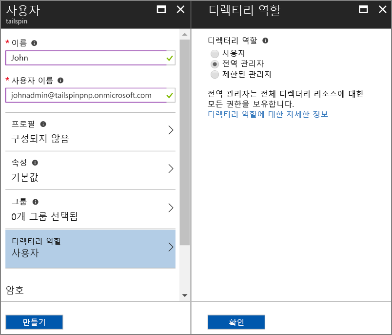
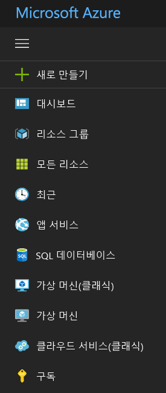

# <a name="use-azure-key-vault-to-protect-application-secrets"></a>Azure Key Vault를 사용하여 응용 프로그램 암호 보호

[ 샘플 코드][sample application]

다음과 같이 민감하고 보호되어야 하는 응용 프로그램 설정을 갖는 것이 일반적입니다.

* 데이터베이스 연결 문자열
* 암호
* 암호화 키

보안 모범 사례로 이 암호를 소스 제어에 저장해서는 안됩니다. 소스 코드 저장소가 비공개인 경우에도 쉽게 누출될 수 있습니다. 공용으로부터 암호를 유지하는 것 뿐만이 아닙니다. 대규모 프로젝트에서 프로덕션 암호에 액세스할 수 있는 개발자 및 운영자를 제한할 수 있습니다. (테스트 또는 개발 환경에 대한 설정은 서로 다릅니다.)

보다 안전한 옵션은 이러한 비밀을 [Azure Key Vault][KeyVault]에 저장하는 것입니다. 키 자격 증명 모음은 암호화 키 및 기타 암호를 관리하기 위한 클라우드 호스티드 서비스입니다. 이 문서는 키 자격 증명 모음을 사용하여 앱에 대한 구성 설정을 저장하는 방법을 보여줍니다.

[Tailspin Surveys][Surveys] 응용 프로그램에서 다음 설정은 비밀입니다.

* 데이터베이스 연결 문자열.
* Redis 연결 문자열.
* 웹 응용 프로그램에 대한 클라이언트 암호.

설문 조사 응용 프로그램은 다음 위치에서 구성 설정을 로드합니다.

* appsettings.json 파일
* [사용자 비밀 저장소][user-secrets](개발 환경에만 해당, 테스트용)
* 호스팅 환경(Azure 웹앱에서 앱 설정)
* Key Vault(사용 가능한 경우)

각각은 이전 것을 재정의하므로 키 자격 증명 모음에 저장된 모든 설정이 우선적으로 적용됩니다.

> [!NOTE]
> 기본적으로 키 자격 증명 모음 구성 공급자는 사용할 수 없습니다. 응용 프로그램을 로컬로 실행하는 데 필요하지 않습니다. 프로덕션 배포에 사용하도록 허용합니다.

시작 시 응용 프로그램은 모든 등록된 구성 공급자에서 설정을 읽고 이를 사용하여 강력한 형식의 옵션 개체를 채웁니다. 자세한 내용은 [옵션 및 구성 개체 사용][options]을 참조하세요.

## <a name="setting-up-key-vault-in-the-surveys-app"></a>설문 조사 앱에서 키 자격 증명 모음 설정
필수 조건:

* [Azure Resource Manager cmdlet][azure-rm-cmdlets]을 설치합니다.
* [Surveys 응용 프로그램 실행][readme]에 설명된 대로 Surveys 응용 프로그램을 구성합니다.

대략적인 단계:

1. 테넌트에서 관리 사용자를 설정합니다.
2. 클라이언트 인증서를 설정합니다.
3. 키 자격 증명 모음을 만듭니다.
4. 키 자격 증명 모음에 구성 설정을 추가합니다.
5. 키 자격 증명 모음을 사용하는 코드의 주석 처리를 제거합니다.
6. 응용 프로그램의 사용자 암호를 업데이트합니다.

### <a name="set-up-an-admin-user"></a>관리 사용자 설정
> [!NOTE]
> 키 자격 증명 모음을 만들려면 Azure 구독을 관리할 수 있는 계정을 사용해야 합니다. 또한 키 자격 증명 모음을 읽을 수 있도록 허용하는 모든 응용 프로그램을 해당 계정과 동일한 테넌트에 등록해야 합니다.
> 
> 

이 단계에서 설문 조사 앱이 등록된 테넌트에서 사용자로 로그인한 상태에서 키 자격 증명 모음을 만들 수 있는지 확인합니다.

Surveys 응용 프로그램이 등록된 Azure AD 테넌트 내에서 관리자 사용자를 만듭니다.

1. [Azure Portal][azure-portal]에 로그인합니다.
2. 응용 프로그램이 등록된 Azure AD 테넌트를 선택합니다.
3. **추가 서비스** > **보안 + ID** > **Azure Active Directory** > **사용자 및 그룹** > **모든 사용자**를 클릭합니다.
4. 포털의 맨 위에서 **새 사용자**를 클릭합니다.
5. 필드를 채우고 해당 사용자를 **전역 관리자** 디렉터리 역할에 할당합니다.
6. **만들기**를 클릭합니다.



이제 이 사용자를 구독 소유자로 할당합니다.

1. 허브 메뉴에서 **구독**을 선택합니다.

    

2. 관리자가 액세스할 구독을 선택합니다.
3. 구독 블레이드에서 **액세스 제어(IAM)** 를 선택합니다.
4. **추가**를 클릭합니다.
4. **역할** 아래에서 **소유자**를 선택합니다.
5. 소유자로 추가할 사용자의 메일 주소를 입력합니다.
6. 사용자를 선택하고 **저장**을 클릭합니다.

### <a name="set-up-a-client-certificate"></a>클라이언트 인증서 설정
1. 다음과 같이 PowerShell 스크립트 [/Scripts/Setup-KeyVault.ps1][Setup-KeyVault]을 실행합니다.
   
    ```
    .\Setup-KeyVault.ps1 -Subject <<subject>>
    ```
    `Subject` 매개 변수의 경우 "surveysapp"과 같은 이름을 임의로 입력합니다. 스크립트는 자체 서명된 인증서를 생성하고 "현재 사용자/개인" 인증서 저장소에 저장합니다. 스크립트의 출력은 JSON 조각입니다. 이 값을 복사합니다.

2. [Azure Portal][azure-portal]에서 포털의 오른쪽 위에 있는 사용자 계정을 선택하여 Surveys 응용 프로그램이 등록된 디렉터리로 전환합니다.

3. **Azure Active Directory** > **앱 등록** > 설문 조사를 선택합니다.

4.  **매니페스트**, **편집**을 차례로 클릭합니다.

5.  스크립트의 출력을 `keyCredentials` 속성에 붙여 넣습니다. 다음과 유사하게 나타납니다.
        
    ```json
    "keyCredentials": [
        {
        "type": "AsymmetricX509Cert",
        "usage": "Verify",
        "keyId": "29d4f7db-0539-455e-b708-....",
        "customKeyIdentifier": "ZEPpP/+KJe2fVDBNaPNOTDoJMac=",
        "value": "MIIDAjCCAeqgAwIBAgIQFxeRiU59eL.....
        }
    ],
    ```          

6. **저장**을 클릭합니다.  

7. 3-6단계를 반복하여 동일한 JSON 조각을 Web API(Surveys.WebAPI)의 응용 프로그램 매니페스트에 추가합니다.

8. PowerShell 창에서 다음 명령을 실행하여 인증서의 지문을 가져옵니다.
   
    ```
    certutil -store -user my [subject]
    ```
    
    `[subject]`에는 PowerShell 스크립트에서 Subject에 대해 지정한 값을 사용합니다. 지문은 "Cert Hash(sha1)" 아래에 나열됩니다. 이 값을 복사합니다. 나중에 지문을 사용합니다.

### <a name="create-a-key-vault"></a>키 자격 증명 모음 만들기
1. 다음과 같이 PowerShell 스크립트 [/Scripts/Setup-KeyVault.ps1][Setup-KeyVault]을 실행합니다.
   
    ```
    .\Setup-KeyVault.ps1 -KeyVaultName <<key vault name>> -ResourceGroupName <<resource group name>> -Location <<location>>
    ```
   
    자격 증명을 묻는 메시지가 나타나면 이전에 만든 Azure AD 사용자로 로그인합니다. 스크립트는 해당 리소스 그룹 내에 새 리소스 그룹 및 새 키 자격 증명 모음을 만듭니다. 
   
2. 다음과 같이 SetupKeyVault.ps를 다시 실행합니다.
   
    ```
    .\Setup-KeyVault.ps1 -KeyVaultName <<key vault name>> -ApplicationIds @("<<Surveys app id>>", "<<Surveys.WebAPI app ID>>")
    ```
   
    다음 매개 변수 값을 설정합니다.
   
       * 키 자격 증명 모음 이름 = 이전 단계에서 키 자격 증명 모음에 제공한 이름입니다.
       * Surveys 앱 ID = Surveys 웹 응용 프로그램의 응용 프로그램 ID입니다.
       * Surveys.WebApi 앱 ID = Surveys.WebAPI 응용 프로그램의 응용 프로그램 ID입니다.
         
    예:
     
    ```
     .\Setup-KeyVault.ps1 -KeyVaultName tailspinkv -ApplicationIds @("f84df9d1-91cc-4603-b662-302db51f1031", "8871a4c2-2a23-4650-8b46-0625ff3928a6")
    ```
    
    이 스크립트는 웹앱 및 웹 API에 사용자 키 자격 증명 모음에서 암호를 검색할 수 있는 권한을 부여합니다. 이에 대한 설명은 [Azure Key Vault 시작](/azure/key-vault/key-vault-get-started/)을 참조하세요.

### <a name="add-configuration-settings-to-your-key-vault"></a>키 자격 증명 모음에 구성 설정 추가
1. 다음과 같이 SetupKeyVault.ps를 실행합니다.
   
    ```
    .\Setup-KeyVault.ps1 -KeyVaultName <<key vault name> -KeyName Redis--Configuration -KeyValue "<<Redis DNS name>>.redis.cache.windows.net,password=<<Redis access key>>,ssl=true" 
    ```
    여기서,
   
   * 키 자격 증명 모음 이름 = 이전 단계에서 키 자격 증명 모음에 제공한 이름입니다.
   * Redis DNS 이름 = Redis 캐시 인스턴스의 DNS 이름입니다.
   * Redis 액세스 키 = Redis 캐시 인스턴스에 대한 액세스 키입니다.
     
2. 이 시점에서 키 자격 증명 모음에 암호를 성공적으로 저장했는지 여부를 테스트하는 것이 좋습니다. 다음 PowerShell 명령을 실행합니다.
   
    ```
    Get-AzureKeyVaultSecret <<key vault name>> Redis--Configuration | Select-Object *
    ```

3. SetupKeyVault.ps를 다시 실행하여 데이터베이스 연결 문자열을 추가합니다.
   
    ```
    .\Setup-KeyVault.ps1 -KeyVaultName <<key vault name> -KeyName Data--SurveysConnectionString -KeyValue <<DB connection string>> -ConfigName "Data:SurveysConnectionString"
    ```
   
    여기에서 `<<DB connection string>>` 은(는) 데이터베이스 연결 문자열의 값입니다.
   
    로컬 데이터베이스로 테스트하기 위해 Tailspin.Surveys.Web/appsettings.json 파일에서 연결 문자열을 복사합니다. 이 경우 이중 백슬래시('\\\\')를 단일 백슬래시로 변경해야 합니다. 이중 백슬래시는 JSON 파일에서 이스케이프 문자입니다.
   
    예:
   
    ```
    .\Setup-KeyVault.ps1 -KeyVaultName mykeyvault -KeyName Data--SurveysConnectionString -KeyValue "Server=(localdb)\MSSQLLocalDB;Database=Tailspin.SurveysDB;Trusted_Connection=True;MultipleActiveResultSets=true" 
    ```

### <a name="uncomment-the-code-that-enables-key-vault"></a>키 자격 증명 모음을 사용하는 코드의 주석 처리 제거
1. Tailspin.Surveys 솔루션을 엽니다.
2. Tailspin.Surveys.Web/Startup.cs에서 다음 코드 블록을 찾아 주석 처리를 제거합니다.
   
    ```csharp
    //var config = builder.Build();
    //builder.AddAzureKeyVault(
    //    $"https://{config["KeyVault:Name"]}.vault.azure.net/",
    //    config["AzureAd:ClientId"],
    //    config["AzureAd:ClientSecret"]);
    ```
3. Tailspin.Surveys.Web/Startup.cs에서 `ICredentialService`를 등록하는 코드를 찾습니다. `CertificateCredentialService`를 사용하는 줄의 주석 처리를 제거하고 `ClientCredentialService`를 사용하는 줄을 주석으로 처리합니다.
   
    ```csharp
    // Uncomment this:
    services.AddSingleton<ICredentialService, CertificateCredentialService>();
    // Comment out this:
    //services.AddSingleton<ICredentialService, ClientCredentialService>();
    ```
   
    이렇게 변경하면 웹앱이 [클라이언트 어설션][client-assertion]을 사용하여 OAuth 액세스 토큰을 가져올 수 있습니다. 클라이언트 어설션을 사용하는 경우 OAuth 클라이언트 암호가 필요 없습니다. 또는 클라이언트 암호를 키 자격 증명 모음에 저장할 수 있습니다. 그러나 키 자격 증명 모음 및 클라이언트 어설션 모두에서 클라이언트 인증서를 사용하므로 키 자격 증명 모음을 활성화하는 경우 클라이언트 어설션도 활성화하는 것이 좋습니다.

### <a name="update-the-user-secrets"></a>사용자 암호 업데이트
솔루션 탐색기에서 Tailspin.Surveys.Web 프로젝트를 마우스 오른쪽 단추로 클릭하고 **사용자 암호 관리**를 선택합니다. secrets.json 파일에서 기존 JSON을 삭제하고 다음에 붙여 넣습니다.

    ```
    {
      "AzureAd": {
        "ClientId": "[Surveys web app client ID]",
        "ClientSecret": "[Surveys web app client secret]",
        "PostLogoutRedirectUri": "https://localhost:44300/",
        "WebApiResourceId": "[App ID URI of your Surveys.WebAPI application]",
        "Asymmetric": {
          "CertificateThumbprint": "[certificate thumbprint. Example: 105b2ff3bc842c53582661716db1b7cdc6b43ec9]",
          "StoreName": "My",
          "StoreLocation": "CurrentUser",
          "ValidationRequired": "false"
        }
      },
      "KeyVault": {
        "Name": "[key vault name]"
      }
    }
    ```

[대괄호] 안에 있는 항목을 올바른 값으로 바꿉니다.

* `AzureAd:ClientId`: 설문 조사 앱의 클라이언트 ID입니다.
* `AzureAd:ClientSecret`: Azure AD에 Surveys 응용 프로그램을 등록할 때 생성된 키입니다.
* `AzureAd:WebApiResourceId`: Azure AD에서 Surveys.WebAPI 응용 프로그램을 만들 때 지정한 앱 ID URI입니다.
* `Asymmetric:CertificateThumbprint`: 클라이언트 인증서를 만들 때 이전에 가져온 인증서 지문입니다.
* `KeyVault:Name`: 키 자격 증명 모음의 이름입니다.

> [!NOTE]
> `Asymmetric:ValidationRequired`는 이전에 만든 인증서가 루트 CA(인증 기관)에서 서명되지 않았기 때문에 false입니다. 프로덕션에서는 루트 CA에서 서명된 인증서를 사용하고 `ValidationRequired`를 true로 설정합니다.
> 
> 

업데이트된 secrets.json 파일을 저장합니다.

다음으로 솔루션 탐색기에서 Tailspin.Surveys.WebApi 프로젝트를 마우스 오른쪽 단추로 클릭하고 **사용자 암호 관리**를 선택합니다. 기존 JSON을 삭제하고 다음에 붙여 넣습니다.

```
{
  "AzureAd": {
    "ClientId": "[Surveys.WebAPI client ID]",
    "WebApiResourceId": "https://tailspin5.onmicrosoft.com/surveys.webapi",
    "Asymmetric": {
      "CertificateThumbprint": "[certificate thumbprint]",
      "StoreName": "My",
      "StoreLocation": "CurrentUser",
      "ValidationRequired": "false"
    }
  },
  "KeyVault": {
    "Name": "[key vault name]"
  }
}
```

[대괄호] 안에 있는 항목의 이름을 바꾸고 secrets.json 파일을 저장합니다.

> [!NOTE]
> 웹 API의 경우 설문 조사 응용 프로그램이 아닌 Surveys.WebAPI 응용 프로그램에 대한 클라이언트 ID를 사용해야 합니다.
> 
> 

[**다음**][adfs]

<!-- Links -->
[adfs]: ./adfs.md
[authorize-app]: /azure/key-vault/key-vault-get-started//#authorize
[azure-portal]: https://portal.azure.com
[azure-rm-cmdlets]: https://msdn.microsoft.com/library/mt125356.aspx
[client-assertion]: client-assertion.md
[configuration]: /aspnet/core/fundamentals/configuration
[KeyVault]: https://azure.microsoft.com/services/key-vault/
[key-tags]: https://msdn.microsoft.com/library/azure/dn903623.aspx#BKMK_Keytags
[Microsoft.Azure.KeyVault]: https://www.nuget.org/packages/Microsoft.Azure.KeyVault/
[options]: /aspnet/core/fundamentals/configuration#using-options-and-configuration-objects
[readme]: ./run-the-app.md
[Setup-KeyVault]: https://github.com/mspnp/multitenant-saas-guidance/blob/master/scripts/Setup-KeyVault.ps1
[Surveys]: tailspin.md
[user-secrets]: http://go.microsoft.com/fwlink/?LinkID=532709
[sample application]: https://github.com/mspnp/multitenant-saas-guidance
