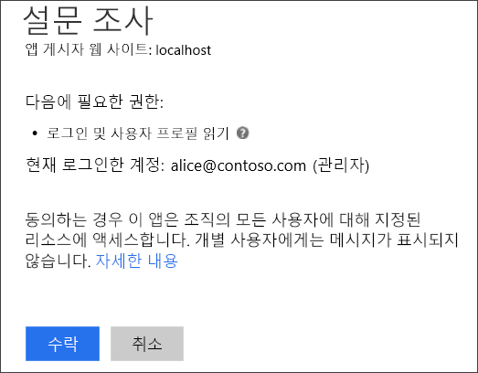
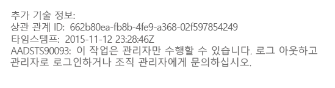
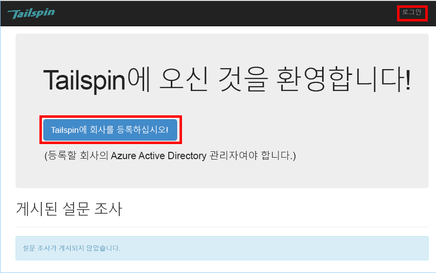
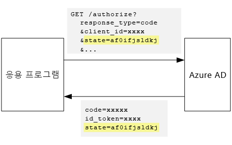

# 테넌트 등록 및 온보딩

[ 샘플 코드][sample application]

이 문서는 고객이 응용 프로그램에 자기의 조직을 등록할 수 있는 다중 테넌트 응용 프로그램에서 등록 프로세스를 구현하는 방법에 대해 설명합니다.  등록 프로세스를 구현하는 이유는 다음과 같습니다:

•	AD 관리자가 고객의 조직 전체가 응용 프로그램을 사용하는 데 동의하는 것을 허용합니다.

•	신용카드 결제 또는 기타 고객 정보를 수집합니다.

•	응용 프로그램에 필요한 테넌트당 1회 설치를 실행합니다.


## 관리 동의 및 Azure AD 사용 권한
Azure AD를 인증하기 위해 응용 프로그램은 사용자 디렉터리에 대한 액세스가 필요합니다. 응용 프로그램은 최소한 사용자 프로필을 읽을 권한이 필요합니다. 사용자가 최초 로그인하면, Azure AD는 요청받은 사용 권한을 나열한 동의 페이지를 보여줍니다. 사용자는 **동의**를 클릭하여 응용 프로그램에 사용 권한을 부여합니다.

기본값으로, 사용자별로 동의가 부여됩니다.  로그인한 모든 사용자는 동의 페이지를 봅니다. Azure AD 또한 *관리자 동의*를 지원함으로써, AD 관리자가 조직 전체에 대해서 동의하는 것을 허용합니다.

관리 동의 흐름이 사용되면, 동의 페이지는 AD 관리자가 테넌트 전체를 대신해서 권한을 부여하고 있음을 설명합니다.



관리자가 **동의**를 클릭하고 나면, 같은 테넌트에 있는 다른 사용자들이 로그인할 수 있고, Azure AD는 동의 화면을 건너뛸 것입니다.

AD 관리자만 관리 동의를 부여할 수 있는데, AD 관리자가 전체 조직을 대신해서 사용 권한을 부여하기 때문입니다. 비관리자가 관리 동의 흐름으로 인증을 시도할 경우, Azure AD는 오류를 표시합니다:



이후 응용 프로그램이 사용 권한을 추가로 요구할 경우, 고객은 다시 등록하고 업데이트된 사용 권한에 동의해야 합니다.   

## 테넌트 등록 구현하기
[Tailspin Surveys][Tailspin] 응용 프로그램에 대해서, 우리는 등록 프로세스에 대한 몇 가지 요구사항을 정의했습니다:

•	테넌트가 등록되어야 사용자들이 로그인할 수 있습니다.

•	등록은 관리 동의 흐름을 사용합니다.

•	등록은 응용 프로그램 데이터베이스에 사용자의 테넌트를 추가합니다.

•	테넌트가 등록되고 나면, 응용 프로그램이 오보딩 페이지를 표시합니다. 


이 절에서는 우리가 등록 프로세스를 구현한 것을 보여줄 것입니다. "등록"과 "로그인"이 응용 프로그램 개념임을 이해하는 것이 중요합니다. 인증 흐름 중에, Azure AD는 기본적으로 사용자가 등록 과정인지 여부를 알지 못합니다. 상황을 계속 추적하는 것은 응용 프로그램의 역할입니다.

익명의 사용자가 Surveys 응용 프로그램을 방문하면, 2 개의 단추가 표시되는데, 하나는 로그인 단추이고 하나는 "회사 등록"(등록) 단추입니다.



These buttons invoke actions in the [AccountController](https://github.com/Azure-Samples/guidance-identity-management-for-multitenant-apps/blob/master/src/Tailspin.Surveys.Web/Controllers/AccountController.cs) 클래스에서 작업들을 호출합니다.

`SignIn` 작업이 **ChallegeResult**를 반환하면. OpenID Connect 미들웨어가 인증 끝점으로 리디렉션합니다. 이는 ASP.NET Core 1.0에서 인증을 작동시키는 기본 방법입니다.

```csharp
[AllowAnonymous]
public IActionResult SignIn()
{
    return new ChallengeResult(
        OpenIdConnectDefaults.AuthenticationScheme,
        new AuthenticationProperties
        {
            IsPersistent = true,
            RedirectUri = Url.Action("SignInCallback", "Account")
        });
}
```

이제 `SignUp` 작업과 비교해보세요.

```csharp
[AllowAnonymous]
public IActionResult SignUp()
{
    // Workaround for https://github.com/aspnet/Security/issues/546
    HttpContext.Items.Add("signup", "true");

    var state = new Dictionary<string, string> { { "signup", "true" }};
    return new ChallengeResult(
        OpenIdConnectDefaults.AuthenticationScheme,
        new AuthenticationProperties(state)
        {
            RedirectUri = Url.Action(nameof(SignUpCallback), "Account")
        });
}
```

`SignIn`처럼 `SignUp` 작업도 `ChallengeResult`를 반환합니다. 이 때, 우리는`ChallengeResult`에서 상태 정보 하나를 `AuthenticationProperties`에 추가합니다. 

* signup: 사용자가 등록 프로세스를 시작했음을 나타내는 부울 플래그입니다.

`AuthenticationProperties` 안에 있는 상태 정보는 OpenID Connect  [상태](http://openid.net/specs/openid-connect-core-1_0.html#AuthRequest) 매개변수에 추가되어, 인증 흐름 중에 왕복합니다.



사용자가 Azure AD에서 인증되고 응용 프로그램으로 리디렉션되고 나면, 인증 티켓은 상태를 포함합니다. 이런 사실을 이용하여, 우리는 "등록" 값을 전체 인증 흐름 동안 유지할 것입니다.

## 관리 동의 프롬프트 추가하기
Azure AD에서, 관리 동의 흐름은 인증 요청의 쿼리 문자열에 "prompt" 매개변수를 추가함으로써 작동됩니다.

```
/authorize?prompt=admin_consent&...
```

Surveys 응용 프로그램은 `RedirectToAuthenticationEndpoint` 이벤트 중에 프롬프트를 추가합니다. 이 이벤트는 미들웨어가 인증 끝점으로 리디렉션되기 직전에 호출됩니다.

```csharp
public override Task RedirectToAuthenticationEndpoint(RedirectContext context)
{
    if (context.IsSigningUp())
    {
        context.ProtocolMessage.Prompt = "admin_consent";
    }

    _logger.RedirectToIdentityProvider();
    return Task.FromResult(0);
}
```

> [!참고]
> [SurveyAuthenticationEvents.cs](https://github.com/Azure-Samples/guidance-identity-management-for-multitenant-apps/blob/master/src/Tailspin.Surveys.Web/Security/SurveyAuthenticationEvents.cs)를 참고하세요.
> 
> 

Setting` ProtocolMessage.Prompt`는 미들웨어에 "prompt" 매개변수를 인증 요청에 추가하라고 알립니다.

프롬프트는 등록 중에만 필요하다는 사실에 주의하세요. 일반 로그인은 프롬프트를 포함하면 안 됩니다. 두 가지를 구별하려면 인증 상태에서 `등록` 값을 확인해야 합니다. 다음의 확장 메서드는 이런 조건을 확인합니다. 

```csharp
internal static bool IsSigningUp(this BaseControlContext context)
{
    Guard.ArgumentNotNull(context, nameof(context));

    string signupValue;
    object obj;
    // Check the HTTP context and convert to string
    if (context.HttpContext.Items.TryGetValue("signup", out obj))
    {
        signupValue = (string)obj;
    }
    else
    {
        // It's not in the HTTP context, so check the authentication ticket.  If it's not there, we aren't signing up.
        if ((context.AuthenticationTicket == null) ||
            (!context.AuthenticationTicket.Properties.Items.TryGetValue("signup", out signupValue)))
        {
            return false;
        }
    }

    // We have found the value, so see if it's valid
    bool isSigningUp;
    if (!bool.TryParse(signupValue, out isSigningUp))
    {
        // The value for signup is not a valid boolean, throw                
        throw new InvalidOperationException($"'{signupValue}' is an invalid boolean value");
    }

    return isSigningUp;
}
```

> [!참고]
> [BaseControlContextExtensions.cs](https://github.com/Azure-Samples/guidance-identity-management-for-multitenant-apps/blob/master/src/Tailspin.Surveys.Web/Security/BaseControlContextExtensions.cs)를 참조하세요.
> 
> [!참고]
> 참고: 이 코드는 ASP.NET Core 1.0 RC1에 알려진 버그에 대한 해결 방법을 담고 있습니다. `RedirectToAuthenticationEndpoint` 이벤트에서, "startup" 상태를 포함한 인증 속성을 얻을 방법이 없습니다. 해결 방법으로, `AccountController.SignUp` 메서드도 `HttpContext`에 "startup" 상태를 넣습니다. 이는 `RedirectToAuthenticationEndpoint`가 리디렉션 전에 발생하기 때문에 작동하는 것이므로, 우리는 계속해서 같은 `HttpContext`를 갖습니다.
> 
> 

## 테넌트 등록하기
Surveys 응용 프로그램은 응용 프로그램 데이터베이스에 각 테넌트와 사용자에 관한 정보를 저장합니다.


Tenant 표에서, IssuerValue는 테넌트에 대한 발급자 클레임의 값입니다. Azure AD에서는 `https://sts.windows.net/<tentantID>`이고 테넌트마다 고유한 값을 부여합니다.

새 테넌트가 등록되면 Surveys 응용 프로그램은 테넌트 레코드를 데이터베이스에 씁니다. 이 작업은 `AuthenticationValidated` 이벤트 안에서 일어납니다. (ID 토큰이 아직 확인되지 않아서 클레임 값을 신뢰할 수 없으므로, 이 이벤트 전에 수행하지 않도록 합니다.) [Authentication](https://docs.microsoft.com/en-us/azure/architecture/multitenant-identity/authenticate)을 참조하세요.

다음은 Surveys 응용 프로그램에 있는 관련 코드입니다. 

```csharp
public override async Task AuthenticationValidated(AuthenticationValidatedContext context)
{
    var principal = context.AuthenticationTicket.Principal;
    var userId = principal.GetObjectIdentifierValue();
    var tenantManager = context.HttpContext.RequestServices.GetService<TenantManager>();
    var userManager = context.HttpContext.RequestServices.GetService<UserManager>();
    var issuerValue = principal.GetIssuerValue();
    _logger.AuthenticationValidated(userId, issuerValue);

    // Normalize the claims first.
    NormalizeClaims(principal);
    var tenant = await tenantManager.FindByIssuerValueAsync(issuerValue)
        .ConfigureAwait(false);

    if (context.IsSigningUp())
    {
        // Originally, we were checking to see if the tenant was non-null, however, this would not allow
        // permission changes to the application in AAD since a re-consent may be required.  Now we just don't
        // try to recreate the tenant.
        if (tenant == null)
        {
            tenant = await SignUpTenantAsync(context, tenantManager)
                .ConfigureAwait(false);
        }

        // In this case, we need to go ahead and set up the user signing us up.
        await CreateOrUpdateUserAsync(context.AuthenticationTicket, userManager, tenant)
            .ConfigureAwait(false);
    }
    else
    {
        if (tenant == null)
        {
            _logger.UnregisteredUserSignInAttempted(userId, issuerValue);
            throw new SecurityTokenValidationException($"Tenant {issuerValue} is not registered");
        }

        await CreateOrUpdateUserAsync(context.AuthenticationTicket, userManager, tenant)
            .ConfigureAwait(false);
    }
}
```

> [!참고]
> [SurveyAuthenticationEvents.cs](https://github.com/Azure-Samples/guidance-identity-management-for-multitenant-apps/blob/master/src/Tailspin.Surveys.Web/Security/SurveyAuthenticationEvents.cs)를 참고하세요.
> 
> 

이 코드는 다음을 실행합니다:

1. 테넌트의 발급자 값이 이미 데이터베이스에 있는지 확인합니다. 테넌트가 등록되지 않은 경우, `FindByIssuerValueAsync`는 null을 반환합니다.

2. 사용자가 등록된 경우:
   1. 테넌트를 데이터베이스에(`SignUpTenantAsync`) 추가합니다.
   2. 인증된 사용자를 데이터베이스에(`CreateOrUpdateUserAsync`) 추가합니다.
   
3. 그렇지 않으면 정상적인 로그인 흐름을 완료합니다:

   1. 데이터베이스에 테넌트 발급자가 없는 경우, 테넌트가 등록되지 않았고 고객 등록이 필요함을 의미합니다.  그런 경우, 인증 실패를 야기하는 예외를 발생시킵니다.
   
   2. b.	그렇지 않고, 이미 사용자가 있는 경우 이 사용자에 대한 데이터베이스 레코드를 만듭니다 (`CreateOrUpdateUserAsync`).

다음은 데이터베이스에 테넌트를 추가하는 [SignUpTenantAsync](https://github.com/Azure-Samples/guidance-identity-management-for-multitenant-apps/blob/master/src/Tailspin.Surveys.Web/Security/SurveyAuthenticationEvents.cs) 메서드입니다.

```csharp
private async Task<Tenant> SignUpTenantAsync(BaseControlContext context, TenantManager tenantManager)
{
    Guard.ArgumentNotNull(context, nameof(context));
    Guard.ArgumentNotNull(tenantManager, nameof(tenantManager));

    var principal = context.AuthenticationTicket.Principal;
    var issuerValue = principal.GetIssuerValue();
    var tenant = new Tenant
    {
        IssuerValue = issuerValue,
        Created = DateTimeOffset.UtcNow
    };

    try
    {
        await tenantManager.CreateAsync(tenant)
            .ConfigureAwait(false);
    }
    catch(Exception ex)
    {
        _logger.SignUpTenantFailed(principal.GetObjectIdentifierValue(), issuerValue, ex);
        throw;
    }

    return tenant;
}
```

다음은 Surveys 응용 프로그램의 등록 흐름 전 과정을 요약한 내용입니다. 

1. 사용자가 **등록** 단추를 클릭합니다.
2. `AccountController.SignUp` 작업은 challege result를 반환합니다. 인증 상태는 "signup" 값을 포함합니다.
3. `RedirectToAuthenticationEndpoint` 이벤트에서, `admin_consent` 프롬프트를 추가합니다.
4. OpenID Connect 미들웨어가 Azure AD로 리디렉션되고 사용자가 인증됩니다.
5. `AuthenticationValidated` 이벤트에서, "signup" 상태를 찾습니다.
6. 테넌트를 데이터베이스에 추가합니다. 

[**다음**][app roles]

<!-- Links -->
[app roles]: app-roles.md
[Tailspin]: tailspin.md

[AccountController]: https://github.com/Azure-Samples/guidance-identity-management-for-multitenant-apps/blob/master/src/Tailspin.Surveys.Web/Controllers/AccountController.cs
[state]: http://openid.net/specs/openid-connect-core-1_0.html#AuthRequest
[SurveyAuthenticationEvents.cs]: https://github.com/Azure-Samples/guidance-identity-management-for-multitenant-apps/blob/master/src/Tailspin.Surveys.Web/Security/SurveyAuthenticationEvents.cs
[BaseControlContextExtensions.cs]: https://github.com/Azure-Samples/guidance-identity-management-for-multitenant-apps/blob/master/src/Tailspin.Surveys.Web/Security/BaseControlContextExtensions.cs
[Authentication]: authenticate.md
[SignUpTenantAsync]: https://github.com/Azure-Samples/guidance-identity-management-for-multitenant-apps/blob/master/src/Tailspin.Surveys.Web/Security/SurveyAuthenticationEvents.cs
[sample application]: https://github.com/Azure-Samples/guidance-identity-management-for-multitenant-apps
