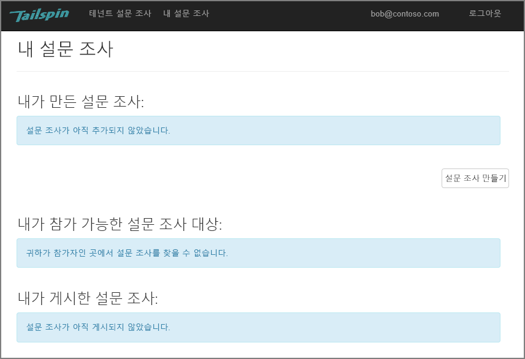
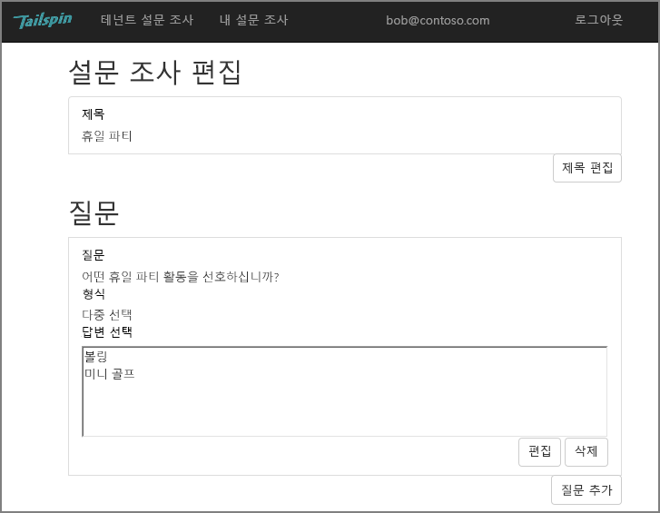
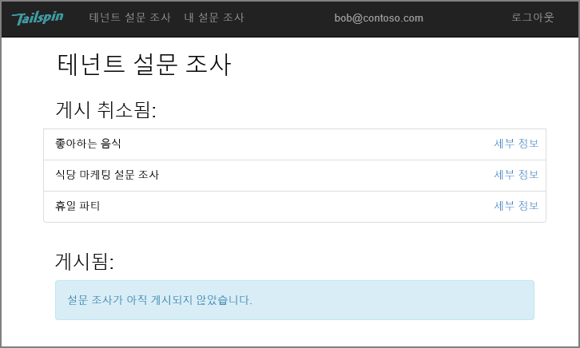
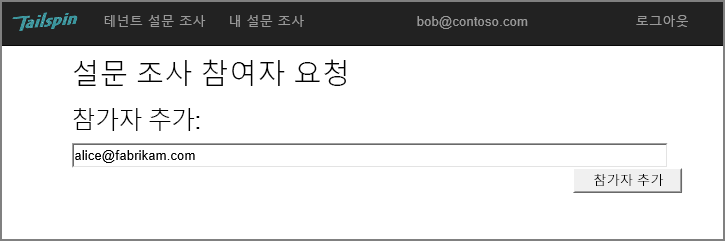
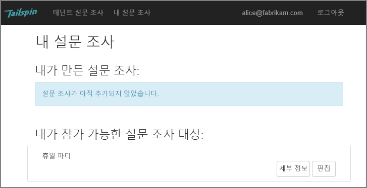
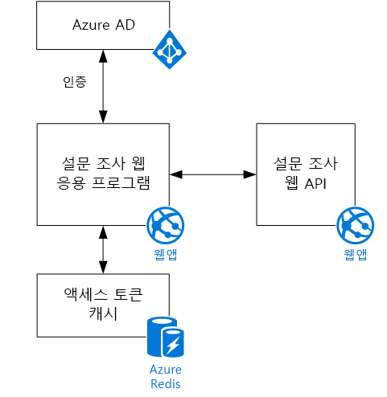

# Tailspin 시나리오

[ 샘플 코드][sample application]

Tailspin은 설문 조사라는 SaaS 응용 프로그램을 개발하는 가상 회사입니다. 이 응용 프로그램을 사용하면 조직에서 온라인 설문 조사를 만들어 게시할 수 있습니다.

* 조직은 응용 프로그램을 등록할 수 있습니다.
* 조직이 등록한 후 사용자는 조직 자격 증명으로 응용 프로그램에 로그인할 수 있습니다.
* 사용자는 설문 조사를 만들고, 편집하고, 게시할 수 있습니다.

> [!NOTE]
> 응용 프로그램을 시작하려면 [설문 조사 응용 프로그램 실행]을 참조하세요.
> 
> 

## 사용자는 설문 조사를 만들고, 편집하고, 볼 수 있습니다.
인증된 사용자는 자신이 만들었거나 참가자 권한이 있는 모든 설문 조사를 볼 수 있고, 새 설문 조사를 만들 수 있습니다. 사용자가 조직 ID, `bob@contoso.com`을 사용하여 로그인합니다.

이 스크린샷은 설문 조사 편집 페이지를 보여 줍니다.

또한 사용자는 동일한 테넌트 내에서 다른 사용자가 만든 설문 조사를 볼 수 있습니다.

## 설문 조사 소유자는 참가자를 초대할 수 있습니다.
사용자는 설문 조사를 만들 때 다른 사람을 설문 조사의 참가자로 초대할 수 있습니다. 참가자는 설문 조사를 편집할 수 있으나 삭제하거나 게시할 수는 없습니다.  

사용자는 다른 테넌트에서 참가자를 추가하여 테넌트 간에 리소스를 공유할 수 있습니다. 이 스크린샷에서 Bob(`bob@contoso.com`)은 자신이 만든 설문 조사에 참가자로 Alice(`alice@fabrikam.com`)를 추가하고 있습니다.

Alice가 로그인할 때 "Surveys I can contribute to" 아래에 나열된 설문 조사를 확인합니다.

Alice는 Contoso 테넌트의 게스트가 아니라 자신의 테넌트로 로그인합니다. Alice는 해당 설문 조사에 대해서만 참가자 권한을 가지며 Contoso 테넌트의 다른 설문 조사는 볼 수 없습니다.

## 건축
설문 조사 응용 프로그램은 웹 프런트 엔드 및 Web API 백 엔드로 구성됩니다. 둘 다 [ASP.NET Core]를 사용하여 구현됩니다.

웹 응용 프로그램은 Azure AD(Azure Active Directory)를 사용하여 사용자를 인증합니다. 또한 웹 응용 프로그램은 Azure AD를 호출하여 Web API에 대한 OAuth 2 액세스 토큰을 가져옵니다. 액세스 토큰은 Azure Redis Cache에 캐시됩니다. 캐시는 여러 인스턴스가 동일한 토큰 캐시를 공유할 수 있도록 해줍니다(예: 서버 팜에서).

[**다음**][authentication]

<!-- Links -->

[authentication]: authenticate.md

[설문 조사 응용 프로그램 실행]: ./run-the-app.md
[ASP.NET Core]: /aspnet/core
[sample application]: https://github.com/mspnp/multitenant-saas-guidance
