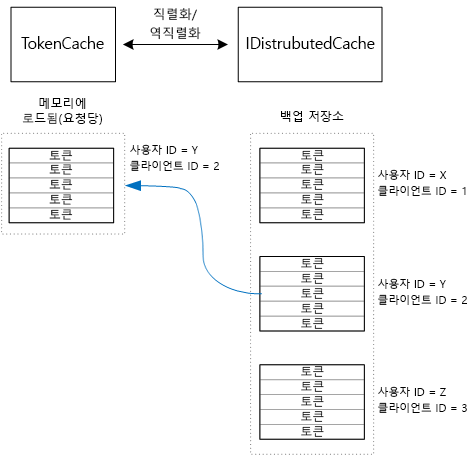

# <a name="cache-access-tokens"></a><span data-ttu-id="10eb5-103">액세스 토큰 캐시</span><span class="sxs-lookup"><span data-stu-id="10eb5-103">Cache access tokens</span></span>

<span data-ttu-id="10eb5-104">[ 샘플 코드][sample application]</span><span class="sxs-lookup"><span data-stu-id="10eb5-104">[ Sample code][sample application]</span></span>

<span data-ttu-id="10eb5-105">OAuth 액세스 토큰을 사용하려면 토큰 끝점에 대해 HTTP 요청을 실행해야 하므로 비교적 비용이 많이 듭니다.</span><span class="sxs-lookup"><span data-stu-id="10eb5-105">It's relatively expensive to get an OAuth access token, because it requires an HTTP request to the token endpoint.</span></span> <span data-ttu-id="10eb5-106">따라서 가능한 경우 토큰을 캐시하는 것이 좋습니다.</span><span class="sxs-lookup"><span data-stu-id="10eb5-106">Therefore, it's good to cache tokens whenever possible.</span></span> <span data-ttu-id="10eb5-107">ADAL([Azure AD 인증 라이브러리][ADAL])은 새로 고침 토큰을 포함하여 Azure AD에서 가져온 토큰을 자동으로 캐시합니다.</span><span class="sxs-lookup"><span data-stu-id="10eb5-107">The [Azure AD Authentication Library][ADAL] (ADAL)  automatically caches tokens obtained from Azure AD, including refresh tokens.</span></span>

<span data-ttu-id="10eb5-108">ADAL은 기본 토큰 캐시 구현을 제공합니다.</span><span class="sxs-lookup"><span data-stu-id="10eb5-108">ADAL provides a default token cache implementation.</span></span> <span data-ttu-id="10eb5-109">그러나 이 토큰 캐시는 네이티브 클라이언트 앱을 위한 것이므로 웹앱에는 적합하지 **않습니다**.</span><span class="sxs-lookup"><span data-stu-id="10eb5-109">However, this token cache is intended for native client apps, and is **not** suitable for web apps:</span></span>

* <span data-ttu-id="10eb5-110">정적 인스턴스이며, 스레드로부터 안전하지 않습니다.</span><span class="sxs-lookup"><span data-stu-id="10eb5-110">It is a static instance, and not thread safe.</span></span>
* <span data-ttu-id="10eb5-111">모든 사용자의 토큰이 동일한 사전으로 이동하므로 많은 사용자로 확장되지 않습니다.</span><span class="sxs-lookup"><span data-stu-id="10eb5-111">It doesn't scale to large numbers of users, because tokens from all users go into the same dictionary.</span></span>
* <span data-ttu-id="10eb5-112">팜의 웹 서버에서 공유할 수 없습니다.</span><span class="sxs-lookup"><span data-stu-id="10eb5-112">It can't be shared across web servers in a farm.</span></span>

<span data-ttu-id="10eb5-113">대신 ADAL `TokenCache` 클래스에서 파생되지만 서버 환경에 적합하고 여러 사용자의 토큰을 적절히 격리하는 사용자 지정 토큰 캐시를 구현해야 합니다.</span><span class="sxs-lookup"><span data-stu-id="10eb5-113">Instead, you should implement a custom token cache that derives from the ADAL `TokenCache` class but is suitable for a server environment and provides the desirable level of isolation between tokens for different users.</span></span>

<span data-ttu-id="10eb5-114">`TokenCache` 클래스는 발급자, 리소스, 클라이언트 ID 및 사용자별로 인덱싱된 토큰 사전을 저장합니다.</span><span class="sxs-lookup"><span data-stu-id="10eb5-114">The `TokenCache` class stores a dictionary of tokens, indexed by issuer, resource, client ID, and user.</span></span> <span data-ttu-id="10eb5-115">사용자 지정 토큰 캐시는 Redis 캐시와 같은 백업 저장소에 이 사전을 작성해야 합니다.</span><span class="sxs-lookup"><span data-stu-id="10eb5-115">A custom token cache should write this dictionary to a backing store, such as a Redis cache.</span></span>

<span data-ttu-id="10eb5-116">Tailspin Surveys 응용 프로그램에서 `DistributedTokenCache` 클래스는 토큰 캐시를 구현합니다.</span><span class="sxs-lookup"><span data-stu-id="10eb5-116">In the Tailspin Surveys application, the `DistributedTokenCache` class implements the token cache.</span></span> <span data-ttu-id="10eb5-117">이 구현은 ASP.NET Core의 [IDistributedCache][distributed-cache] 추상화를 사용합니다.</span><span class="sxs-lookup"><span data-stu-id="10eb5-117">This implementation uses the [IDistributedCache][distributed-cache] abstraction from ASP.NET Core.</span></span> <span data-ttu-id="10eb5-118">즉, 모든 `IDistributedCache` 구현을 백업 저장소로 사용할 수 있습니다.</span><span class="sxs-lookup"><span data-stu-id="10eb5-118">That way, any `IDistributedCache` implementation can be used as a backing store.</span></span>

* <span data-ttu-id="10eb5-119">기본적으로 Surveys 응용 프로그램에서는 Redis 캐시를 사용합니다.</span><span class="sxs-lookup"><span data-stu-id="10eb5-119">By default, the Surveys app uses a Redis cache.</span></span>
* <span data-ttu-id="10eb5-120">단일 인스턴스 웹 서버의 경우 ASP.NET Core [메모리 내 캐시][in-memory-cache]를 사용할 수 있습니다.</span><span class="sxs-lookup"><span data-stu-id="10eb5-120">For a single-instance web server, you could use the ASP.NET Core [in-memory cache][in-memory-cache].</span></span> <span data-ttu-id="10eb5-121">이는 개발하는 동안 응용 프로그램을 로컬로 실행하는 데 유용한 옵션이기도 합니다.</span><span class="sxs-lookup"><span data-stu-id="10eb5-121">(This is also a good option for running the app locally during development.)</span></span>

<span data-ttu-id="10eb5-122">`DistributedTokenCache` 는 백업 저장소에 키/값 쌍으로 캐시 데이터를 저장합니다.</span><span class="sxs-lookup"><span data-stu-id="10eb5-122">`DistributedTokenCache` stores the cache data as key/value pairs in the backing store.</span></span> <span data-ttu-id="10eb5-123">키는 사용자 ID+클라이언트 ID이므로 백업 저장소는 고유한 각 사용자/클라이언트 조합에 대해 별도의 캐시 데이터를 유지합니다.</span><span class="sxs-lookup"><span data-stu-id="10eb5-123">The key is the user ID plus client ID, so the backing store holds separate cache data for each unique combination of user/client.</span></span>



<span data-ttu-id="10eb5-125">백업 저장소는 사용자에 의해 분할됩니다.</span><span class="sxs-lookup"><span data-stu-id="10eb5-125">The backing store is partitioned by user.</span></span> <span data-ttu-id="10eb5-126">각 HTTP 요청에 대해 해당 사용자의 토큰이 백업 저장소에서 읽어지고 `TokenCache` 사전에 로드됩니다.</span><span class="sxs-lookup"><span data-stu-id="10eb5-126">For each HTTP request, the tokens for that user are read from the backing store and loaded into the `TokenCache` dictionary.</span></span> <span data-ttu-id="10eb5-127">Redis가 백업 저장소로 사용되는 경우 서버 팜의 모든 서버 인스턴스에서 동일한 캐시를 읽고 쓰므로 이 접근 방식은 많은 사용자로 확장됩니다.</span><span class="sxs-lookup"><span data-stu-id="10eb5-127">If Redis is used as the backing store, every server instance in a server farm reads/writes to the same cache, and this approach scales to many users.</span></span>

## <a name="encrypting-cached-tokens"></a><span data-ttu-id="10eb5-128">캐시된 토큰 암호화</span><span class="sxs-lookup"><span data-stu-id="10eb5-128">Encrypting cached tokens</span></span>
<span data-ttu-id="10eb5-129">토큰은 사용자의 리소스에 대한 액세스 권한을 부여하므로 중요한 데이터입니다.</span><span class="sxs-lookup"><span data-stu-id="10eb5-129">Tokens are sensitive data, because they grant access to a user's resources.</span></span> <span data-ttu-id="10eb5-130">또한 사용자의 암호와 달리 토큰의 해시를 저장할 수 없습니다. 따라서 토큰이 손상되지 않도록 보호하는 것이 중요합니다.</span><span class="sxs-lookup"><span data-stu-id="10eb5-130">(Moreover, unlike a user's password, you can't just store a hash of the token.) Therefore, it's critical to protect tokens from being compromised.</span></span> <span data-ttu-id="10eb5-131">Redis 지원 캐시는 암호로 보호되지만 누군가 암호를 획득한 경우 캐시된 액세스 토큰을 모두 가져올 수 있습니다.</span><span class="sxs-lookup"><span data-stu-id="10eb5-131">The Redis-backed cache is protected by a password, but if someone obtains the password, they could get all of the cached access tokens.</span></span> <span data-ttu-id="10eb5-132">이러한 이유로 `DistributedTokenCache` 는 백업 저장소에 기록하는 모든 항목을 암호화합니다.</span><span class="sxs-lookup"><span data-stu-id="10eb5-132">For that reason, the `DistributedTokenCache` encrypts everything that it writes to the backing store.</span></span> <span data-ttu-id="10eb5-133">암호화는 ASP.NET Core [데이터 보호][data-protection] API를 사용하여 수행됩니다.</span><span class="sxs-lookup"><span data-stu-id="10eb5-133">Encryption is done using the ASP.NET Core [data protection][data-protection] APIs.</span></span>

> [!NOTE]
> <span data-ttu-id="10eb5-134">Azure 웹 사이트에 배포하면 암호화 키가 네트워크 저장소에 백업되고 모든 컴퓨터에서 동기화됩니다([키 관리 및 수명][key-management] 참조).</span><span class="sxs-lookup"><span data-stu-id="10eb5-134">If you deploy to Azure Web Sites, the encryption keys are backed up to network storage and synchronized across all machines (see [Key management and lifetime][key-management]).</span></span> <span data-ttu-id="10eb5-135">기본적으로 Azure 웹 사이트에서 실행할 때 키는 암호화되지 않지만 [X.509 인증서를 사용하여 암호화를 활성화][x509-cert-encryption]할 수 있습니다.</span><span class="sxs-lookup"><span data-stu-id="10eb5-135">By default, keys are not encrypted when running in Azure Web Sites, but you can [enable encryption using an X.509 certificate][x509-cert-encryption].</span></span>
> 
> 

## <a name="distributedtokencache-implementation"></a><span data-ttu-id="10eb5-136">DistributedTokenCache 구현</span><span class="sxs-lookup"><span data-stu-id="10eb5-136">DistributedTokenCache implementation</span></span>
<span data-ttu-id="10eb5-137">`DistributedTokenCache` 클래스는 ADAL [TokenCache][tokencache-class] 클래스에서 파생됩니다.</span><span class="sxs-lookup"><span data-stu-id="10eb5-137">The `DistributedTokenCache` class derives from the ADAL [TokenCache][tokencache-class] class.</span></span>

<span data-ttu-id="10eb5-138">생성자에서 `DistributedTokenCache` 클래스는 현재 사용자에 대한 키를 만들고 백업 저장소에서 캐시를 로드합니다.</span><span class="sxs-lookup"><span data-stu-id="10eb5-138">In the constructor, the `DistributedTokenCache` class creates a key for the current user and loads the cache from the backing store:</span></span>

```csharp
public DistributedTokenCache(
    ClaimsPrincipal claimsPrincipal,
    IDistributedCache distributedCache,
    ILoggerFactory loggerFactory,
    IDataProtectionProvider dataProtectionProvider)
    : base()
{
    _claimsPrincipal = claimsPrincipal;
    _cacheKey = BuildCacheKey(_claimsPrincipal);
    _distributedCache = distributedCache;
    _logger = loggerFactory.CreateLogger<DistributedTokenCache>();
    _protector = dataProtectionProvider.CreateProtector(typeof(DistributedTokenCache).FullName);
    AfterAccess = AfterAccessNotification;
    LoadFromCache();
}
```

<span data-ttu-id="10eb5-139">사용자 ID와 클라이언트 ID를 연결하여 키가 만들어집니다.</span><span class="sxs-lookup"><span data-stu-id="10eb5-139">The key is created by concatenating the user ID and client ID.</span></span> <span data-ttu-id="10eb5-140">두 ID 모두 사용자의 `ClaimsPrincipal`에 있는 클레임에서 가져옵니다.</span><span class="sxs-lookup"><span data-stu-id="10eb5-140">Both of these are taken from claims found in the user's `ClaimsPrincipal`:</span></span>

```csharp
private static string BuildCacheKey(ClaimsPrincipal claimsPrincipal)
{
    string clientId = claimsPrincipal.FindFirstValue("aud", true);
    return string.Format(
        "UserId:{0}::ClientId:{1}",
        claimsPrincipal.GetObjectIdentifierValue(),
        clientId);
}
```

<span data-ttu-id="10eb5-141">캐시 데이터를 로드하려면 백업 저장소에서 직렬화된 blob을 읽고 `TokenCache.Deserialize` 를 호출하여 blob을 캐시 데이터로 변환합니다.</span><span class="sxs-lookup"><span data-stu-id="10eb5-141">To load the cache data, read the serialized blob from the backing store, and call `TokenCache.Deserialize` to convert the blob into cache data.</span></span>

```csharp
private void LoadFromCache()
{
    byte[] cacheData = _distributedCache.Get(_cacheKey);
    if (cacheData != null)
    {
        this.Deserialize(_protector.Unprotect(cacheData));
    }
}
```

<span data-ttu-id="10eb5-142">ADAL에서 캐시에 액세스할 때마다 `AfterAccess` 이벤트가 발생합니다.</span><span class="sxs-lookup"><span data-stu-id="10eb5-142">Whenever ADAL access the cache, it fires an `AfterAccess` event.</span></span> <span data-ttu-id="10eb5-143">캐시 데이터가 변경된 경우 `HasStateChanged` 속성이 true입니다.</span><span class="sxs-lookup"><span data-stu-id="10eb5-143">If the cache data has changed, the `HasStateChanged` property is true.</span></span> <span data-ttu-id="10eb5-144">이 경우 변경 내용을 반영하도록 백업 저장소를 업데이트한 다음 `HasStateChanged` 를 false로 설정합니다.</span><span class="sxs-lookup"><span data-stu-id="10eb5-144">In that case, update the backing store to reflect the change, and then set `HasStateChanged` to false.</span></span>

```csharp
public void AfterAccessNotification(TokenCacheNotificationArgs args)
{
    if (this.HasStateChanged)
    {
        try
        {
            if (this.Count > 0)
            {
                _distributedCache.Set(_cacheKey, _protector.Protect(this.Serialize()));
            }
            else
            {
                // There are no tokens for this user/client, so remove the item from the cache.
                _distributedCache.Remove(_cacheKey);
            }
            this.HasStateChanged = false;
        }
        catch (Exception exp)
        {
            _logger.WriteToCacheFailed(exp);
            throw;
        }
    }
}
```

<span data-ttu-id="10eb5-145">TokenCache는 두 가지 이벤트를 보냅니다.</span><span class="sxs-lookup"><span data-stu-id="10eb5-145">TokenCache sends two other events:</span></span>

* <span data-ttu-id="10eb5-146">`BeforeWrite`.</span><span class="sxs-lookup"><span data-stu-id="10eb5-146">`BeforeWrite`.</span></span> <span data-ttu-id="10eb5-147">ADAL이 캐시에 쓰기 직전에 호출됩니다.</span><span class="sxs-lookup"><span data-stu-id="10eb5-147">Called immediately before ADAL writes to the cache.</span></span> <span data-ttu-id="10eb5-148">이를 사용하여 동시성 전략을 구현할 수 있습니다.</span><span class="sxs-lookup"><span data-stu-id="10eb5-148">You can use this to implement a concurrency strategy</span></span>
* <span data-ttu-id="10eb5-149">`BeforeAccess`.</span><span class="sxs-lookup"><span data-stu-id="10eb5-149">`BeforeAccess`.</span></span> <span data-ttu-id="10eb5-150">ADAL이 캐시에서 읽기 직전에 호출됩니다.</span><span class="sxs-lookup"><span data-stu-id="10eb5-150">Called immediately before ADAL reads from the cache.</span></span> <span data-ttu-id="10eb5-151">여기서 캐시를 다시 로드하여 최신 버전을 가져올 수 있습니다.</span><span class="sxs-lookup"><span data-stu-id="10eb5-151">Here you can reload the cache to get the latest version.</span></span>

<span data-ttu-id="10eb5-152">이 예제에서는 이 두 이벤트를 처리하지 않기로 결정했습니다.</span><span class="sxs-lookup"><span data-stu-id="10eb5-152">In our case, we decided not to handle these two events.</span></span>

* <span data-ttu-id="10eb5-153">동시성의 경우 마지막 쓰기가 적용됩니다.</span><span class="sxs-lookup"><span data-stu-id="10eb5-153">For concurrency, last write wins.</span></span> <span data-ttu-id="10eb5-154">각 사용자+클라이언트에 대해 토큰이 독립적으로 저장되므로 동일한 사용자에게 두 개의 로그인 세션이 동시에 열린 경우에만 충돌이 발생합니다.</span><span class="sxs-lookup"><span data-stu-id="10eb5-154">That's OK, because tokens are stored independently for each user + client, so a conflict would only happen if the same user had two concurrent login sessions.</span></span>
* <span data-ttu-id="10eb5-155">읽기의 경우 모든 요청에 대해 캐시를 로드합니다.</span><span class="sxs-lookup"><span data-stu-id="10eb5-155">For reading, we load the cache on every request.</span></span> <span data-ttu-id="10eb5-156">요청은 수명이 짧습니다.</span><span class="sxs-lookup"><span data-stu-id="10eb5-156">Requests are short lived.</span></span> <span data-ttu-id="10eb5-157">이 시간 동안 캐시가 수정된 경우 다음 요청에서 새 값이 선택됩니다.</span><span class="sxs-lookup"><span data-stu-id="10eb5-157">If the cache gets modified in that time, the next request will pick up the new value.</span></span>

<span data-ttu-id="10eb5-158">[**다음**][client-assertion]</span><span class="sxs-lookup"><span data-stu-id="10eb5-158">[**Next**][client-assertion]</span></span>

<!-- links -->
[ADAL]: https://msdn.microsoft.com/library/azure/jj573266.aspx
[client-assertion]: ./client-assertion.md
[data-protection]: /aspnet/core/security/data-protection/
[distributed-cache]: /aspnet/core/performance/caching/distributed
[key-management]: /aspnet/core/security/data-protection/configuration/default-settings
[in-memory-cache]: /aspnet/core/performance/caching/memory
[tokencache-class]: https://msdn.microsoft.com/library/azure/microsoft.identitymodel.clients.activedirectory.tokencache.aspx
[x509-cert-encryption]: /aspnet/core/security/data-protection/implementation/key-encryption-at-rest#x509-certificate
[sample application]: https://github.com/mspnp/multitenant-saas-guidance
