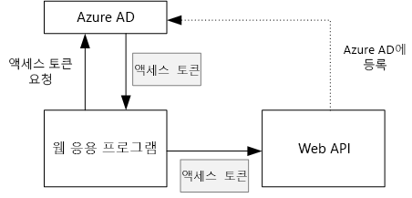
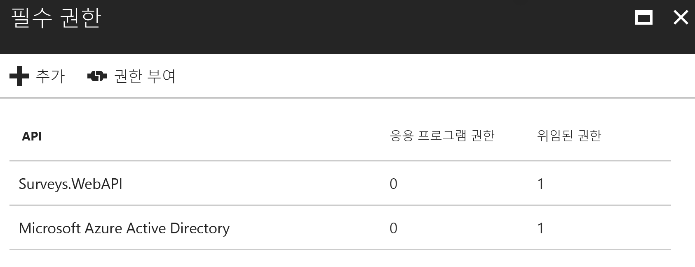

# <a name="secure-a-backend-web-api"></a><span data-ttu-id="eb2e8-103">백 엔드 웹 API의 보안 유지</span><span class="sxs-lookup"><span data-stu-id="eb2e8-103">Secure a backend web API</span></span>

<span data-ttu-id="eb2e8-104">[ 샘플 코드][sample application]</span><span class="sxs-lookup"><span data-stu-id="eb2e8-104">[ Sample code][sample application]</span></span>

<span data-ttu-id="eb2e8-105">[Tailspin 설문 조사] 응용 프로그램은 백 엔드 웹 API를 사용하여 설문 조사에 대한 CRUD 작업을 관리합니다.</span><span class="sxs-lookup"><span data-stu-id="eb2e8-105">The [Tailspin Surveys] application uses a backend web API to manage CRUD operations on surveys.</span></span> <span data-ttu-id="eb2e8-106">예를 들어 사용자가 "내 설문 조사"를 클릭하면 웹 응용 프로그램은 웹 API에 HTTP 요청을 보냅니다.</span><span class="sxs-lookup"><span data-stu-id="eb2e8-106">For example, when a user clicks "My Surveys", the web application sends an HTTP request to the web API:</span></span>

```
GET /users/{userId}/surveys
```

<span data-ttu-id="eb2e8-107">웹 API는 JSON 개체를 반환합니다.</span><span class="sxs-lookup"><span data-stu-id="eb2e8-107">The web API returns a JSON object:</span></span>

```
{
  "Published":[],
  "Own":[
    {"Id":1,"Title":"Survey 1"},
    {"Id":3,"Title":"Survey 3"},
    ],
  "Contribute": [{"Id":8,"Title":"My survey"}]
}
```

<span data-ttu-id="eb2e8-108">웹앱은 OAuth 2 전달자 토큰을 사용하여 자신을 인증해야 하므로 웹 API는 익명 요청을 허용하지 않습니다.</span><span class="sxs-lookup"><span data-stu-id="eb2e8-108">The web API does not allow anonymous requests, so the web app must authenticate itself using OAuth 2 bearer tokens.</span></span>

> [!NOTE]
> <span data-ttu-id="eb2e8-109">이는 서버 간 시나리오입니다.</span><span class="sxs-lookup"><span data-stu-id="eb2e8-109">This is a server-to-server scenario.</span></span> <span data-ttu-id="eb2e8-110">응용 프로그램은 브라우저 클라이언트에서 API에 대한 AJAX 호출을 만들지 않습니다.</span><span class="sxs-lookup"><span data-stu-id="eb2e8-110">The application does not make any AJAX calls to the API from the browser client.</span></span>
> 
> 

<span data-ttu-id="eb2e8-111">실행할 수 있는 두 가지 주요 방법이 있습니다.</span><span class="sxs-lookup"><span data-stu-id="eb2e8-111">There are two main approaches you can take:</span></span>

* <span data-ttu-id="eb2e8-112">위임된 사용자 ID.</span><span class="sxs-lookup"><span data-stu-id="eb2e8-112">Delegated user identity.</span></span> <span data-ttu-id="eb2e8-113">웹 응용 프로그램은 사용자의 ID로 인증합니다.</span><span class="sxs-lookup"><span data-stu-id="eb2e8-113">The web application authenticates with the user's identity.</span></span>
* <span data-ttu-id="eb2e8-114">응용 프로그램 ID.</span><span class="sxs-lookup"><span data-stu-id="eb2e8-114">Application identity.</span></span> <span data-ttu-id="eb2e8-115">웹 응용 프로그램은 OAuth2 클라이언트 자격 증명 흐름을 사용하여 해당 클라이언트 ID로 인증합니다.</span><span class="sxs-lookup"><span data-stu-id="eb2e8-115">The web application authenticates with its client ID, using OAuth2 client credential flow.</span></span>

<span data-ttu-id="eb2e8-116">Tailspin 응용 프로그램은 위임된 사용자 ID를 구현합니다.</span><span class="sxs-lookup"><span data-stu-id="eb2e8-116">The Tailspin application implements delegated user identity.</span></span> <span data-ttu-id="eb2e8-117">주요 차이점은 다음과 같습니다.</span><span class="sxs-lookup"><span data-stu-id="eb2e8-117">Here are the main differences:</span></span>

<span data-ttu-id="eb2e8-118">**위임된 사용자 ID**</span><span class="sxs-lookup"><span data-stu-id="eb2e8-118">**Delegated user identity**</span></span>

* <span data-ttu-id="eb2e8-119">웹 API로 전송되는 전달자 토큰은 사용자 ID를 포함합니다.</span><span class="sxs-lookup"><span data-stu-id="eb2e8-119">The bearer token sent to the web API contains the user identity.</span></span>
* <span data-ttu-id="eb2e8-120">웹 API는 사용자 ID에 따라 권한 부여를 결정합니다.</span><span class="sxs-lookup"><span data-stu-id="eb2e8-120">The web API makes authorization decisions based on the user identity.</span></span>
* <span data-ttu-id="eb2e8-121">웹 응용 프로그램은 사용자가 작업을 수행할 수 있는 권한이 없는 경우 웹 API에서 403(사용할 수 없음) 오류를 처리해야 합니다.</span><span class="sxs-lookup"><span data-stu-id="eb2e8-121">The web application needs to handle 403 (Forbidden) errors from the web API, if the user is not authorized to perform an action.</span></span>
* <span data-ttu-id="eb2e8-122">일반적으로 웹 응용 프로그램은 UI 요소 표시 또는 숨기기와 같은 UI에 영향을 주는 몇 가지 권한 부여를 결정합니다.)</span><span class="sxs-lookup"><span data-stu-id="eb2e8-122">Typically, the web application still makes some authorization decisions that affect UI, such as showing or hiding UI elements).</span></span>
* <span data-ttu-id="eb2e8-123">웹 API는 JavaScript 응용 프로그램 또는 네이티브 클라이언트 응용 프로그램과 같은 신뢰할 수 없는 클라이언트에서 잠재적으로 사용될 수 있습니다.</span><span class="sxs-lookup"><span data-stu-id="eb2e8-123">The web API can potentially be used by untrusted clients, such as a JavaScript application or a native client application.</span></span>

<span data-ttu-id="eb2e8-124">**응용 프로그램 ID**</span><span class="sxs-lookup"><span data-stu-id="eb2e8-124">**Application identity**</span></span>

* <span data-ttu-id="eb2e8-125">웹 API는 사용자에 대한 정보를 가져오지 않습니다.</span><span class="sxs-lookup"><span data-stu-id="eb2e8-125">The web API does not get information about the user.</span></span>
* <span data-ttu-id="eb2e8-126">웹 API는 사용자 ID에 따라 권한 부여를 수행할 수 없습니다.</span><span class="sxs-lookup"><span data-stu-id="eb2e8-126">The web API cannot perform any authorization based on the user identity.</span></span> <span data-ttu-id="eb2e8-127">웹 응용 프로그램에서 모든 권한 부여를 결정합니다.</span><span class="sxs-lookup"><span data-stu-id="eb2e8-127">All authorization decisions are made by the web application.</span></span>  
* <span data-ttu-id="eb2e8-128">웹 API는 신뢰할 수 없는 클라이언트(JavaScript 또는 네이티브 클라이언트 응용 프로그램)에서 사용될 수 없습니다.</span><span class="sxs-lookup"><span data-stu-id="eb2e8-128">The web API cannot be used by an untrusted client (JavaScript or native client application).</span></span>
* <span data-ttu-id="eb2e8-129">웹 API에는 권한 부여 논리가 없으므로 이 방법은 구현하는 데 다소 수월할 수 있습니다.</span><span class="sxs-lookup"><span data-stu-id="eb2e8-129">This approach may be somewhat simpler to implement, because there is no authorization logic in the Web API.</span></span>

<span data-ttu-id="eb2e8-130">방법 중 하나에서 웹 응용 프로그램은 웹 API를 호출하는 데 필요한 자격 증명인 액세스 토큰을 가져와야 합니다.</span><span class="sxs-lookup"><span data-stu-id="eb2e8-130">In either approach, the web application must get an access token, which is the credential needed to call the web API.</span></span>

* <span data-ttu-id="eb2e8-131">위임된 사용자 ID의 경우 토큰은 사용자를 대신하여 토큰을 발급할 수 있는 IDP에서 가져와야 합니다.</span><span class="sxs-lookup"><span data-stu-id="eb2e8-131">For delegated user identity, the token has to come from the IDP, which can issue a token on behalf of the user.</span></span>
* <span data-ttu-id="eb2e8-132">클라이언트 자격 증명의 경우 응용 프로그램은 해당 자체 토큰 서버인 IDP 또는 호스트에서 토큰을 가져올 수도 있습니다.</span><span class="sxs-lookup"><span data-stu-id="eb2e8-132">For client credentials, an application might get the token from the IDP or host its own token server.</span></span> <span data-ttu-id="eb2e8-133">하지만 처음부터 토큰 서버를 작성하지 말고 [IdentityServer3]과 같이 테스트가 완료된 프레임워크를 사용합니다. Azure AD로 인증하는 경우 Azure AD의 액세스 토큰을 클라이언트 자격 증명 흐름과 함께 사용하는 것이 좋습니다.</span><span class="sxs-lookup"><span data-stu-id="eb2e8-133">(But don't write a token server from scratch; use a well-tested framework like [IdentityServer3].) If you authenticate with Azure AD, it's strongly recommended to get the access token from Azure AD, even with client credential flow.</span></span>

<span data-ttu-id="eb2e8-134">이 문서의 나머지 부분에서는 응용 프로그램이 Azure AD로 인증하는 것을 가정합니다.</span><span class="sxs-lookup"><span data-stu-id="eb2e8-134">The rest of this article assumes the application is authenticating with Azure AD.</span></span>



## <a name="register-the-web-api-in-azure-ad"></a><span data-ttu-id="eb2e8-136">Azure AD에서 웹 API 등록</span><span class="sxs-lookup"><span data-stu-id="eb2e8-136">Register the web API in Azure AD</span></span>
<span data-ttu-id="eb2e8-137">Azure AD에서 웹 API에 대한 전달자 토큰을 발급하려면 Azure AD에서 몇 가지를 구성해야 합니다.</span><span class="sxs-lookup"><span data-stu-id="eb2e8-137">In order for Azure AD to issue a bearer token for the web API, you need to configure some things in Azure AD.</span></span>

1. <span data-ttu-id="eb2e8-138">Azure AD에서 웹 API를 등록합니다.</span><span class="sxs-lookup"><span data-stu-id="eb2e8-138">Register the web API in Azure AD.</span></span>

2. <span data-ttu-id="eb2e8-139">웹앱의 클라이언트 ID를 `knownClientApplications` 속성의 웹 API 응용 프로그램 매니페스트에 추가합니다.</span><span class="sxs-lookup"><span data-stu-id="eb2e8-139">Add the client ID of the web app to the web API application manifest, in the `knownClientApplications` property.</span></span> <span data-ttu-id="eb2e8-140">[응용 프로그램 매니페스트 업데이트]를 참조하세요.</span><span class="sxs-lookup"><span data-stu-id="eb2e8-140">See [Update the application manifests].</span></span>

3. <span data-ttu-id="eb2e8-141">웹 응용 프로그램에 웹 API를 호출하는 권한을 부여합니다.</span><span class="sxs-lookup"><span data-stu-id="eb2e8-141">Give the web application permission to call the web API.</span></span> <span data-ttu-id="eb2e8-142">Azure 관리 포털에서 응용 프로그램 ID(클라이언트 자격 증명 흐름)에 대한 "응용 프로그램 권한" 또는 위임된 사용자 ID에 대한 "위임된 권한", 두 가지 유형의 사용 권한을 설정할 수 있습니다.</span><span class="sxs-lookup"><span data-stu-id="eb2e8-142">In the Azure Management Portal, you can set two types of permissions: "Application Permissions" for application identity (client credential flow), or "Delegated Permissions" for delegated user identity.</span></span>
   
   

## <a name="getting-an-access-token"></a><span data-ttu-id="eb2e8-144">액세스 토큰 가져오기</span><span class="sxs-lookup"><span data-stu-id="eb2e8-144">Getting an access token</span></span>
<span data-ttu-id="eb2e8-145">웹 API를 호출하기 전에 웹 응용 프로그램은 Azure AD에서 액세스 토큰을 가져옵니다.</span><span class="sxs-lookup"><span data-stu-id="eb2e8-145">Before calling the web API, the web application gets an access token from Azure AD.</span></span> <span data-ttu-id="eb2e8-146">.NET 응용 프로그램에서는 [.NET용 ADAL(Azure AD 인증 라이브러리)][ADAL]을 사용합니다.</span><span class="sxs-lookup"><span data-stu-id="eb2e8-146">In a .NET application, use the [Azure AD Authentication Library (ADAL) for .NET][ADAL].</span></span>

<span data-ttu-id="eb2e8-147">OAuth 2 권한 부여 코드 흐름에서 응용 프로그램은 액세스 토큰에 대한 권한 부여 코드를 교환합니다.</span><span class="sxs-lookup"><span data-stu-id="eb2e8-147">In the OAuth 2 authorization code flow, the application exchanges an authorization code for an access token.</span></span> <span data-ttu-id="eb2e8-148">다음 코드는 ADAL을 사용하여 액세스 토큰을 가져옵니다.</span><span class="sxs-lookup"><span data-stu-id="eb2e8-148">The following code uses ADAL to get the access token.</span></span> <span data-ttu-id="eb2e8-149">이 코드는 `AuthorizationCodeReceived` 이벤트 중에 호출됩니다.</span><span class="sxs-lookup"><span data-stu-id="eb2e8-149">This code is called during the `AuthorizationCodeReceived` event.</span></span>

```csharp
// The OpenID Connect middleware sends this event when it gets the authorization code.   
public override async Task AuthorizationCodeReceived(AuthorizationCodeReceivedContext context)
{
    string authorizationCode = context.ProtocolMessage.Code;
    string authority = "https://login.microsoftonline.com/" + tenantID
    string resourceID = "https://tailspin.onmicrosoft.com/surveys.webapi" // App ID URI
    ClientCredential credential = new ClientCredential(clientId, clientSecret);

    AuthenticationContext authContext = new AuthenticationContext(authority, tokenCache);
    AuthenticationResult authResult = await authContext.AcquireTokenByAuthorizationCodeAsync(
        authorizationCode, new Uri(redirectUri), credential, resourceID);

    // If successful, the token is in authResult.AccessToken
}
```

<span data-ttu-id="eb2e8-150">필요한 다양한 매개 변수는 다음과 같습니다.</span><span class="sxs-lookup"><span data-stu-id="eb2e8-150">Here are the various parameters that are needed:</span></span>

* <span data-ttu-id="eb2e8-151">`authority`.</span><span class="sxs-lookup"><span data-stu-id="eb2e8-151">`authority`.</span></span> <span data-ttu-id="eb2e8-152">로그인한 사용자의 테넌트 ID에서 파생됨.</span><span class="sxs-lookup"><span data-stu-id="eb2e8-152">Derived from the tenant ID of the signed in user.</span></span> <span data-ttu-id="eb2e8-153">(SaaS 공급자의 테넌트 ID가 아님)</span><span class="sxs-lookup"><span data-stu-id="eb2e8-153">(Not the tenant ID of the SaaS provider)</span></span>  
* <span data-ttu-id="eb2e8-154">`authorizationCode`.</span><span class="sxs-lookup"><span data-stu-id="eb2e8-154">`authorizationCode`.</span></span> <span data-ttu-id="eb2e8-155">IDP에서 다시 가져온 인증 코드.</span><span class="sxs-lookup"><span data-stu-id="eb2e8-155">the auth code that you got back from the IDP.</span></span>
* <span data-ttu-id="eb2e8-156">`clientId`.</span><span class="sxs-lookup"><span data-stu-id="eb2e8-156">`clientId`.</span></span> <span data-ttu-id="eb2e8-157">웹 응용 프로그램의 클라이언트 ID.</span><span class="sxs-lookup"><span data-stu-id="eb2e8-157">The web application's client ID.</span></span>
* <span data-ttu-id="eb2e8-158">`clientSecret`.</span><span class="sxs-lookup"><span data-stu-id="eb2e8-158">`clientSecret`.</span></span> <span data-ttu-id="eb2e8-159">웹 응용 프로그램의 클라이언트 암호.</span><span class="sxs-lookup"><span data-stu-id="eb2e8-159">The web application's client secret.</span></span>
* <span data-ttu-id="eb2e8-160">`redirectUri`.</span><span class="sxs-lookup"><span data-stu-id="eb2e8-160">`redirectUri`.</span></span> <span data-ttu-id="eb2e8-161">OpenID Connect에 대해 설정한 리디렉션 URI.</span><span class="sxs-lookup"><span data-stu-id="eb2e8-161">The redirect URI that you set for OpenID connect.</span></span> <span data-ttu-id="eb2e8-162">IDP가 토큰으로 다시 호출하는 위치입니다.</span><span class="sxs-lookup"><span data-stu-id="eb2e8-162">This is where the IDP calls back with the token.</span></span>
* <span data-ttu-id="eb2e8-163">`resourceID`.</span><span class="sxs-lookup"><span data-stu-id="eb2e8-163">`resourceID`.</span></span> <span data-ttu-id="eb2e8-164">Azure AD에서 웹 API를 등록할 때 만든 웹 API의 앱 ID URI</span><span class="sxs-lookup"><span data-stu-id="eb2e8-164">The App ID URI of the web API, which you created when you registered the web API in Azure AD</span></span>
* <span data-ttu-id="eb2e8-165">`tokenCache`.</span><span class="sxs-lookup"><span data-stu-id="eb2e8-165">`tokenCache`.</span></span> <span data-ttu-id="eb2e8-166">액세스 토큰을 캐시하는 개체.</span><span class="sxs-lookup"><span data-stu-id="eb2e8-166">An object that caches the access tokens.</span></span> <span data-ttu-id="eb2e8-167">[토큰 캐싱]을 참조하세요.</span><span class="sxs-lookup"><span data-stu-id="eb2e8-167">See [Token caching].</span></span>

<span data-ttu-id="eb2e8-168">`AcquireTokenByAuthorizationCodeAsync` 이(가) 성공하는 경우 ADAL은 토큰을 캐시합니다.</span><span class="sxs-lookup"><span data-stu-id="eb2e8-168">If `AcquireTokenByAuthorizationCodeAsync` succeeds, ADAL caches the token.</span></span> <span data-ttu-id="eb2e8-169">나중에 AcquireTokenSilentAsync를 호출하여 캐시에서 토큰을 가져올 수 있습니다.</span><span class="sxs-lookup"><span data-stu-id="eb2e8-169">Later, you can get the token from the cache by calling AcquireTokenSilentAsync:</span></span>

```csharp
AuthenticationContext authContext = new AuthenticationContext(authority, tokenCache);
var result = await authContext.AcquireTokenSilentAsync(resourceID, credential, new UserIdentifier(userId, UserIdentifierType.UniqueId));
```

<span data-ttu-id="eb2e8-170">여기서 `userId`는 `http://schemas.microsoft.com/identity/claims/objectidentifier` 클레임에 있는 사용자의 개체 ID입니다.</span><span class="sxs-lookup"><span data-stu-id="eb2e8-170">where `userId` is the user's object ID, which is found in the `http://schemas.microsoft.com/identity/claims/objectidentifier` claim.</span></span>

## <a name="using-the-access-token-to-call-the-web-api"></a><span data-ttu-id="eb2e8-171">액세스 토큰을 사용하여 웹 API 호출</span><span class="sxs-lookup"><span data-stu-id="eb2e8-171">Using the access token to call the web API</span></span>
<span data-ttu-id="eb2e8-172">토큰을 가지면 웹 API에 대한 HTTP 요청의 인증 헤더에 전송합니다.</span><span class="sxs-lookup"><span data-stu-id="eb2e8-172">Once you have the token, send it in the Authorization header of the HTTP requests to the web API.</span></span>

```
Authorization: Bearer xxxxxxxxxx
```

<span data-ttu-id="eb2e8-173">설문 조사 응용 프로그램의 다음 확장 메서드는 **HttpClient** 클래스를 사용하여 HTTP 요청에 권한 부여 헤더를 설정합니다.</span><span class="sxs-lookup"><span data-stu-id="eb2e8-173">The following extension method from the Surveys application sets the Authorization header on an HTTP request, using the **HttpClient** class.</span></span>

```csharp
public static async Task<HttpResponseMessage> SendRequestWithBearerTokenAsync(this HttpClient httpClient, HttpMethod method, string path, object requestBody, string accessToken, CancellationToken ct)
{
    var request = new HttpRequestMessage(method, path);
    if (requestBody != null)
    {
        var json = JsonConvert.SerializeObject(requestBody, Formatting.None);
        var content = new StringContent(json, Encoding.UTF8, "application/json");
        request.Content = content;
    }

    request.Headers.Authorization = new AuthenticationHeaderValue("Bearer", accessToken);
    request.Headers.Accept.Add(new MediaTypeWithQualityHeaderValue("application/json"));

    var response = await httpClient.SendAsync(request, ct);
    return response;
}
```

## <a name="authenticating-in-the-web-api"></a><span data-ttu-id="eb2e8-174">웹 API에서 인증</span><span class="sxs-lookup"><span data-stu-id="eb2e8-174">Authenticating in the web API</span></span>
<span data-ttu-id="eb2e8-175">웹 API는 전달자 토큰을 인증해야 합니다.</span><span class="sxs-lookup"><span data-stu-id="eb2e8-175">The web API has to authenticate the bearer token.</span></span> <span data-ttu-id="eb2e8-176">ASP.NET Core에서는 [Microsoft.AspNet.Authentication.JwtBearer][JwtBearer] 패키지를 사용할 수 있습니다.</span><span class="sxs-lookup"><span data-stu-id="eb2e8-176">In ASP.NET Core, you can use the [Microsoft.AspNet.Authentication.JwtBearer][JwtBearer] package.</span></span> <span data-ttu-id="eb2e8-177">이 패키지는 응용 프로그램에서 OpenID Connect 전달자 토큰을 받을 수 있게 해 주는 미들웨어를 제공합니다.</span><span class="sxs-lookup"><span data-stu-id="eb2e8-177">This package provides middleware that enables the application to receive OpenID Connect bearer tokens.</span></span>

<span data-ttu-id="eb2e8-178">웹 API `Startup` 클래스에서 미들웨어를 등록합니다.</span><span class="sxs-lookup"><span data-stu-id="eb2e8-178">Register the middleware in your web API `Startup` class.</span></span>

```csharp
public void Configure(IApplicationBuilder app, IHostingEnvironment env, ApplicationDbContext dbContext, ILoggerFactory loggerFactory)
{
    // ...

    app.UseJwtBearerAuthentication(new JwtBearerOptions {
        Audience = configOptions.AzureAd.WebApiResourceId,
        Authority = Constants.AuthEndpointPrefix,
        TokenValidationParameters = new TokenValidationParameters {
            ValidateIssuer = false
        },
        Events= new SurveysJwtBearerEvents(loggerFactory.CreateLogger<SurveysJwtBearerEvents>())
    });
    
    // ...
}
```

* <span data-ttu-id="eb2e8-179">**Audience**.</span><span class="sxs-lookup"><span data-stu-id="eb2e8-179">**Audience**.</span></span> <span data-ttu-id="eb2e8-180">Azure AD로 웹 API를 등록할 때 만든 웹 API에 대한 앱 ID URI로 설정합니다.</span><span class="sxs-lookup"><span data-stu-id="eb2e8-180">Set this to the App ID URL for the web API, which you created when you registered the web API with Azure AD.</span></span>
* <span data-ttu-id="eb2e8-181">**Authority**.</span><span class="sxs-lookup"><span data-stu-id="eb2e8-181">**Authority**.</span></span> <span data-ttu-id="eb2e8-182">다중 테넌트 응용 프로그램의 경우 `https://login.microsoftonline.com/common/`으로 설정합니다.</span><span class="sxs-lookup"><span data-stu-id="eb2e8-182">For a multitenant application, set this to `https://login.microsoftonline.com/common/`.</span></span>
* <span data-ttu-id="eb2e8-183">**TokenValidationParameters**.</span><span class="sxs-lookup"><span data-stu-id="eb2e8-183">**TokenValidationParameters**.</span></span> <span data-ttu-id="eb2e8-184">다중 테넌트 응용 프로그램의 경우 **ValidateIssuer**를 false로 설정합니다.</span><span class="sxs-lookup"><span data-stu-id="eb2e8-184">For a multitenant application, set **ValidateIssuer** to false.</span></span> <span data-ttu-id="eb2e8-185">즉, 응용 프로그램이 발급자의 유효성을 검사합니다.</span><span class="sxs-lookup"><span data-stu-id="eb2e8-185">That means the application will validate the issuer.</span></span>
* <span data-ttu-id="eb2e8-186">**Events**는 **JwtBearerEvents**에서 파생된 클래스입니다.</span><span class="sxs-lookup"><span data-stu-id="eb2e8-186">**Events** is a class that derives from **JwtBearerEvents**.</span></span>

### <a name="issuer-validation"></a><span data-ttu-id="eb2e8-187">발급자 유효성 검사</span><span class="sxs-lookup"><span data-stu-id="eb2e8-187">Issuer validation</span></span>
<span data-ttu-id="eb2e8-188">**JwtBearerEvents.TokenValidated** 이벤트에서 토큰 발급자의 유효성을 검사합니다.</span><span class="sxs-lookup"><span data-stu-id="eb2e8-188">Validate the token issuer in the **JwtBearerEvents.TokenValidated** event.</span></span> <span data-ttu-id="eb2e8-189">발급자는 "iss" 클레임에서 전송됩니다.</span><span class="sxs-lookup"><span data-stu-id="eb2e8-189">The issuer is sent in the "iss" claim.</span></span>

<span data-ttu-id="eb2e8-190">설문 조사 응용 프로그램에서 웹 API는 [테넌트 등록]을 처리하지 않습니다.</span><span class="sxs-lookup"><span data-stu-id="eb2e8-190">In the Surveys application, the web API doesn't handle [tenant sign-up].</span></span> <span data-ttu-id="eb2e8-191">따라서 발급자가 이미 응용 프로그램 데이터베이스에 있는지만을 확인합니다.</span><span class="sxs-lookup"><span data-stu-id="eb2e8-191">Therefore, it just checks if the issuer is already in the application database.</span></span> <span data-ttu-id="eb2e8-192">그렇지 않으면 인증이 실패되는 예외를 throw합니다.</span><span class="sxs-lookup"><span data-stu-id="eb2e8-192">If not, it throws an exception, which causes authentication to fail.</span></span>

```csharp
public override async Task TokenValidated(TokenValidatedContext context)
{
    var principal = context.Ticket.Principal;
    var tenantManager = context.HttpContext.RequestServices.GetService<TenantManager>();
    var userManager = context.HttpContext.RequestServices.GetService<UserManager>();
    var issuerValue = principal.GetIssuerValue();
    var tenant = await tenantManager.FindByIssuerValueAsync(issuerValue);

    if (tenant == null)
    {
        // The caller was not from a trusted issuer. Throw to block the authentication flow.
        throw new SecurityTokenValidationException();
    }

    var identity = principal.Identities.First();

    // Add new claim for survey_userid
    var registeredUser = await userManager.FindByObjectIdentifier(principal.GetObjectIdentifierValue());
    identity.AddClaim(new Claim(SurveyClaimTypes.SurveyUserIdClaimType, registeredUser.Id.ToString()));
    identity.AddClaim(new Claim(SurveyClaimTypes.SurveyTenantIdClaimType, registeredUser.TenantId.ToString()));

    // Add new claim for Email
    var email = principal.FindFirst(ClaimTypes.Upn)?.Value;
    if (!string.IsNullOrWhiteSpace(email))
    {
        identity.AddClaim(new Claim(ClaimTypes.Email, email));
    }
}
```

<span data-ttu-id="eb2e8-193">이 예제에서처럼 **TokenValidated** 이벤트를 사용하여 클레임을 수정할 수도 있습니다.</span><span class="sxs-lookup"><span data-stu-id="eb2e8-193">As this example shows, you can also use the **TokenValidated** event to modify the claims.</span></span> <span data-ttu-id="eb2e8-194">클레임은 Azure AD에서 직접 가져온 것입니다.</span><span class="sxs-lookup"><span data-stu-id="eb2e8-194">Remember that the claims come directly from Azure AD.</span></span> <span data-ttu-id="eb2e8-195">웹 응용 프로그램에서 가져오는 클레임을 수정할 경우 해당 변경 내용이 웹 API를 수신하는 전달자 토큰에 나타나지 않습니다.</span><span class="sxs-lookup"><span data-stu-id="eb2e8-195">If the web application modifies the claims that it gets, those changes won't show up in the bearer token that the web API receives.</span></span> <span data-ttu-id="eb2e8-196">자세한 내용은 [클레임 변환][claims-transformation]을 참조하세요.</span><span class="sxs-lookup"><span data-stu-id="eb2e8-196">For more information, see [Claims transformations][claims-transformation].</span></span>

## <a name="authorization"></a><span data-ttu-id="eb2e8-197">권한 부여</span><span class="sxs-lookup"><span data-stu-id="eb2e8-197">Authorization</span></span>
<span data-ttu-id="eb2e8-198">권한 부여에 대한 일반적 내용은 [역할 기반 및 리소스 기반 권한 부여][Authorization]를 참조하세요.</span><span class="sxs-lookup"><span data-stu-id="eb2e8-198">For a general discussion of authorization, see [Role-based and resource-based authorization][Authorization].</span></span> 

<span data-ttu-id="eb2e8-199">JwtBearer 미들웨어는 인증 응답을 처리합니다.</span><span class="sxs-lookup"><span data-stu-id="eb2e8-199">The JwtBearer middleware handles the authorization responses.</span></span> <span data-ttu-id="eb2e8-200">예를 들어 컨트롤러 작업을 인증된 사용자로 제한하려면 **[Authorize]** 특성을 사용하고 **JwtBearerDefaults.AuthenticationScheme**을 인증 체계로 지정합니다.</span><span class="sxs-lookup"><span data-stu-id="eb2e8-200">For example, to restrict a controller action to authenticated users, use the **[Authorize]** atrribute and specify **JwtBearerDefaults.AuthenticationScheme** as the authentication scheme:</span></span>

```csharp
[Authorize(ActiveAuthenticationSchemes = JwtBearerDefaults.AuthenticationScheme)]
```

<span data-ttu-id="eb2e8-201">사용자가 인증되지 않은 경우 401 상태 코드를 반환합니다.</span><span class="sxs-lookup"><span data-stu-id="eb2e8-201">This returns a 401 status code if the user is not authenticated.</span></span>

<span data-ttu-id="eb2e8-202">권한 정책에 의한 컨트롤러 작업을 제한하려면 **[Authorize]** 특성에서 정책 이름을 지정합니다.</span><span class="sxs-lookup"><span data-stu-id="eb2e8-202">To restrict a controller action by authorizaton policy, specify the policy name in the **[Authorize]** attribute:</span></span>

```csharp
[Authorize(Policy = PolicyNames.RequireSurveyCreator)]
```

<span data-ttu-id="eb2e8-203">사용자가 인증되지 않은 경우 401 상태 코드를 반환하고 사용자가 인증됐지만 권한이 부여되지 않은 경우 403을 반환합니다.</span><span class="sxs-lookup"><span data-stu-id="eb2e8-203">This returns a 401 status code if the user is not authenticated, and 403 if the user is authenticated but not authorized.</span></span> <span data-ttu-id="eb2e8-204">시작 시 정책을 등록합니다.</span><span class="sxs-lookup"><span data-stu-id="eb2e8-204">Register the policy on startup:</span></span>

```csharp
public void ConfigureServices(IServiceCollection services)
{
    services.AddAuthorization(options =>
    {
        options.AddPolicy(PolicyNames.RequireSurveyCreator,
            policy =>
            {
                policy.AddRequirements(new SurveyCreatorRequirement());
                policy.RequireAuthenticatedUser(); // Adds DenyAnonymousAuthorizationRequirement 
                policy.AddAuthenticationSchemes(JwtBearerDefaults.AuthenticationScheme);
            });
        options.AddPolicy(PolicyNames.RequireSurveyAdmin,
            policy =>
            {
                policy.AddRequirements(new SurveyAdminRequirement());
                policy.RequireAuthenticatedUser(); // Adds DenyAnonymousAuthorizationRequirement 
                policy.AddAuthenticationSchemes(JwtBearerDefaults.AuthenticationScheme);
            });
    });
    
    // ...
}
```

<span data-ttu-id="eb2e8-205">[**다음**][token cache]</span><span class="sxs-lookup"><span data-stu-id="eb2e8-205">[**Next**][token cache]</span></span>

<!-- links -->
[ADAL]: https://msdn.microsoft.com/library/azure/jj573266.aspx
[JwtBearer]: https://www.nuget.org/packages/Microsoft.AspNet.Authentication.JwtBearer

[Tailspin 설문 조사]: tailspin.md
[IdentityServer3]: https://github.com/IdentityServer/IdentityServer3
[응용 프로그램 매니페스트 업데이트]: ./run-the-app.md#update-the-application-manifests
[토큰 캐싱]: token-cache.md
[테넌트 등록]: signup.md
[claims-transformation]: claims.md#claims-transformations
[Authorization]: authorize.md
[sample application]: https://github.com/mspnp/multitenant-saas-guidance
[token cache]: token-cache.md
