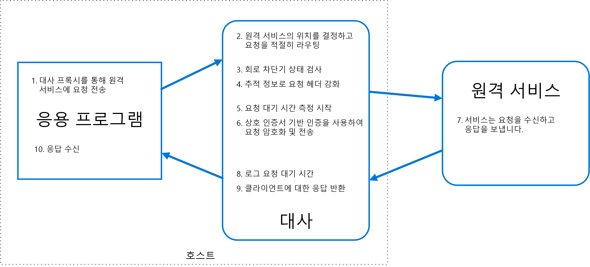

# 특사 패턴Ambassador pattern

소비자 서비스 또는 응용 프로그램을 대신하여 네트워크 요청을 전송하는 도우미 서비스를 만듭니다.Create helper services that send network requests on behalf of a consumer service or application. 특사 서비스는 클라이언트와 함께 배치하는 Out of Process 프록시로 간주할 수 있습니다.An ambassador service can be thought of as an out-of-process proxy that is co-located with the client.

이 패턴은 모니터링, 로깅, 라우팅, 보안(예: TLS) 및 언어 독립적 방식의 [복원력 패턴][resiliency-patterns] 등의 일반적인 클라이언트 연결 작업의 오프로딩에 유용할 수 있습니다.This pattern can be useful for offloading common client connectivity tasks such as monitoring, logging, routing, security (such as TLS), and [resiliency patterns][resiliency-patterns] in a language agnostic way. 레거시 응용 프로그램 또는 수정하기 어려운 다른 응용 프로그램에서 네트워킹 기능을 확장하기 위해 이 패턴을 사용하는 경우가 많습니다.It is often used with legacy applications, or other applications that are difficult to modify, in order to extend their networking capabilities. 특수 팀을 통해 이러한 기능을 구현할 수도 있습니다.It can also enable a specialized team to implement those features.

## 컨텍스트 및 문제점Context and problem

복원력 있는 클라우드 기반 응용 프로그램을 사용하려면 [회로 차단][circuit-breaker], 라우팅, 측정 및 모니터링 등의 기능과 네트워크 관련 구성을 업데이트하는 기능이 필요합니다.Resilient cloud-based applications require features such as [circuit breaking][circuit-breaker], routing, metering and monitoring, and the ability to make network-related configuration updates. 이러한 기능을 추가하기 위해 레거시 응용 프로그램 또는 기존 코드 라이브러리를 업데이트하기는 어렵거나 불가능할 수 있습니다. 개발 팀에서 더 이상 코드를 쉽게 수정하거나 유지 관리할 수 없기 때문입니다.It may be difficult or impossible to update legacy applications or existing code libraries to add these features, because the code is no longer maintained or can't be easily modified by the development team.

네트워크 호출을 위해 연결, 인증 및 권한 부여에 대한 상당한 구성이 필요할 수도 있습니다.Network calls may also require substantial configuration for connection, authentication, and authorization. 여러 언어 및 프레임워크를 사용하여 작성된 여러 응용 프로그램에서 이러한 호출을 사용할 경우 이러한 인스턴스 각각에 대해 호출을 구성해야 합니다.If these calls are used across multiple applications, built using multiple languages and frameworks, the calls must be configured for each of these instances. 또한 조직 내의 중앙 팀에서 네트워크 및 보안 기능을 관리해야 할 수 있습니다.In addition, network and security functionality may need to be managed by a central team within your organization. 대규모 코드 기반에서는 해당 팀이 친숙하지 않은 응용 프로그램 코드를 업데이트하는 것이 위험할 수 있습니다.With a large code base, it can be risky for that team to update application code they aren't familiar with.

## 해결 방법Solution

클라이언트 프레임워크 및 라이브러리를 응용 프로그램과 외부 서비스 간의 프록시 역할을 하는 외부 프로세스에 배치합니다.Put client frameworks and libraries into an external process that acts as a proxy between your application and external services. 라우팅, 복원력, 보안 기능에 대한 제어를 허용하고 모든 호스트 관련 액세스 제한을 방지하기 위해 응용 프로그램과 동일한 호스트 환경에서 프록시를 배포합니다.Deploy the proxy on the same host environment as your application to allow control over routing, resiliency, security features, and to avoid any host-related access restrictions. 또한 특사 패턴을 사용하여 계측을 확장하고 표준화할 수 있습니다.You can also use the ambassador pattern to standardize and extend instrumentation. 프록시는 대기 시간 또는 리소스 사용량과 같은 성능 메트릭을 모니터링할 수 있으며 이 모니터링은 응용 프로그램과 동일한 호스트 환경에서 발생합니다.The proxy can monitor performance metrics such as latency or resource usage, and this monitoring happens in the same host environment as the application.

특사에 오프로드되는 기능은 응용 프로그램과 독립적으로 관리할 수 있습니다.Features that are offloaded to the ambassador can be managed independently of the application. 응용 프로그램의 레거시 기능을 방해하지 않고 특사를 업데이트 및 수정할 수 있습니다.You can update and modify the ambassador without disturbing the application's legacy functionality. 또한 별도의 특수 팀에서 특사로 이동된 보안, 네트워킹 또는 인증 기능을 구현하고 유지 관리할 수도 있습니다.It also allows for separate, specialized teams to implement and maintain security, networking, or authentication features that have been moved to the ambassador.

특사 서비스를 [사이드카][ sidecar]로 배포하여 사용 중인 응용 프로그램 또는 서비스의 수명 주기와 함께 수행할 수 있습니다.Ambassador services can be deployed as a [sidecar][sidecar] to accompany the lifecycle of a consuming application or service. 또는 특사는 일반 호스트의 여러 개별 프로세스에서 공유되는 경우 디먼 또는 Windows 서비스로 배포될 수 있습니다.Alternatively, if an ambassador is shared by multiple separate processes on a common host, it can be deployed as a daemon or Windows service. 사용 중인 서비스가 컨테이너화된 경우 통신을 위해 구성된 적절한 링크를 사용하여 동일한 호스트에 특사를 별도의 컨테이너로 만들어야 합니다.If the consuming service is containerized, the ambassador should be created as a separate container on the same host, with the appropriate links configured for communication.

## 문제 및 고려 사항Issues and considerations

- 프록시는 약간의 대기 시간 오버헤드를 추가합니다.The proxy adds some latency overhead. 응용 프로그램에서 직접 호출하는 클라이언트 라이브러리가 더 좋은 방법인지 고려합니다.Consider whether a client library, invoked directly by the application, is a better approach.
- 일반화된 기능을 프록시에 포함할 때 미칠 수 있는 영향을 고려합니다.Consider the possible impact of including generalized features in the proxy. 예를 들어 특사는 재시도를 처리할 수 있지만 모든 작업이 idempotent가 아닌 이상 안전하지 않을 수 있습니다.For example, the ambassador could handle retries, but that might not be safe unless all operations are idempotent.
- 클라이언트와 프록시 간에 일부 컨텍스트를 전달할 수 있도록 하는 메커니즘을 고려합니다.Consider a mechanism to allow the client to pass some context to the proxy, as well as back to the client. 예를 들어 HTTP 요청 헤더를 포함하여 재시도를 취소하거나 최대 재시도 횟수를 지정합니다.For example, include HTTP request headers to opt out of retry or specify the maximum number of times to retry.
- 프록시를 패키지하고 배포하는 방법을 고려합니다.Consider how you will package and deploy the proxy.
- 모든 클라이언트에 단일 공유 인스턴스를 사용할지 또는 각 클라이언트에 하나의 인스턴스를 사용할지 고려합니다.Consider whether to use a single shared instance for all clients or an instance for each client.

## 이 패턴을 사용해야 하는 경우When to use this pattern

다음 경우에 이 패턴을 사용합니다.Use this pattern when you:

- 여러 언어 또는 프레임워크에 대한 클라이언트 연결 기능의 공통 집합을 빌드해야 하는 경우Need to build a common set of client connectivity features for multiple languages or frameworks.
- 인프라 개발자 또는 더 많은 다른 특수 팀에 교차하는 클라이언트 연결 문제를 오프로드해야 하는 경우Need to offload cross-cutting client connectivity concerns to infrastructure developers or other more specialized teams.
- 레거시 응용 프로그램 또는 수정하기 어려운 응용 프로그램에서 클라우드 또는 클러스터 연결 요구 사항을 지원해야 하는 경우Need to support cloud or cluster connectivity requirements in a legacy application or an application that is difficult to modify.

다음 경우에는 이 패턴이 적합하지 않을 수 있습니다.This pattern may not be suitable:

- 네트워크 요청 대기 시간이 중요한 경우.When network request latency is critical. 프록시에서 최소 수준이더라도 약간의 오버헤드가 발생하고 이는 일부 경우에 응용 프로그램에 영향을 미칠 수 있습니다.A proxy will introduce some overhead, although minimal, and in some cases this may affect the application.
- 단일 언어로 클라이언트 연결 기능을 사용하는 경우.When client connectivity features are consumed by a single language. 이 경우 개발팀에 패키지로 배포되는 클라이언트 라이브러리가 더 나은 옵션이 될 수 있습니다.In that case, a better option might be a client library that is distributed to the development teams as a package.
- 연결 기능이 일반화될 수 없고 클라이언트 응용 프로그램과 심층적 통합이 필요한 경우When connectivity features cannot be generalized and require deeper integration with the client application.

## 예Example

다음 다이어그램에서는 특사 프록시를 통해 원격 서비스에 요청하는 응용 프로그램을 보여 줍니다.The following diagram shows an application making a request to a remote service via an ambassador proxy. 특사는 라우팅, 회로 차단 및 로깅을 제공합니다.The ambassador provides routing, circuit breaking, and logging. 원격 서비스를 호출한 후 클라이언트 응용 프로그램에 대한 응답을 반환합니다.It calls the remote service and then returns the response to the client application:

 

## 관련 지침Related guidance

- [사이드카 패턴Sidecar pattern](./sidecar.md)

<!-- links -->

[circuit-breaker]: ./circuit-breaker.md
[resiliency-patterns]: ./category/resiliency.md
[sidecar]: ./sidecar.md
