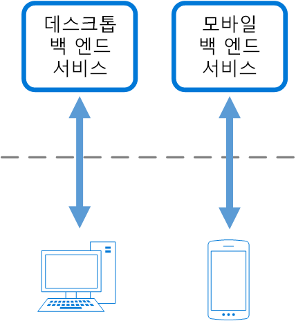

# 프런트 엔드에 대한 백 엔드 패턴Backends for Frontends pattern

특정 프런트 엔드 응용 프로그램 또는 인터페이스에서 사용할 별도의 백 엔드 서비스를 만듭니다.Create separate backend services to be consumed by specific frontend applications or interfaces. 이 패턴은 단일 백 엔드를 여러 인터페이스에 맞게 사용자 지정하지 않으려는 경우에 유용합니다.This pattern is useful when you want to avoid customizing a single backend for multiple interfaces. 이 패턴은 Sam Newman이 처음으로 설명했습니다.This pattern was first described by Sam Newman.

## 컨텍스트 및 문제점Context and problem

응용 프로그램은 처음에 데스크톱 웹 UI에서 대상으로 지정할 수 있습니다.An application may initially be targeted at a desktop web UI. 일반적으로 해당 UI에 필요한 기능을 제공하는 백 엔드 서비스는 병렬로 개발됩니다.Typically, a backend service is developed in parallel that provides the features needed for that UI. 응용 프로그램의 사용자 기반이 확장되면 동일한 백 엔드와 상호 작용해야 하는 모바일 응용 프로그램이 개발됩니다.As the application's user base grows, a mobile application is developed that must interact with the same backend. 이 백 엔드 서비스는 데스크톱 및 모바일 인터페이스의 요구 사항을 둘 다 처리하는 범용 백엔드가 됩니다.The backend service becomes a general-purpose backend, serving the requirements of both the desktop and mobile interfaces.

하지만 모바일 장치의 기능은 화면 크기, 성능 및 디스플레이 제한 측면에서 데스크톱 브라우저와 크게 다릅니다.But the capabilities of a mobile device differ significantly from a desktop browser, in terms of screen size, performance, and display limitations. 결과적으로 모바일 응용 프로그램 백 엔드에 대한 요구 사항은 데스크톱 웹 UI와 다릅니다.As a result, the requirements for a mobile application backend differ from the desktop web UI. 

이러한 차이점 때문에 백 엔드에 대해 상충되는 요구 사항이 발생하게 됩니다.These differences result in competing requirements for the backend. 백 엔드는 데스크톱 웹 UI 및 모바일 응용 프로그램을 둘 다 서비스하기 위해 정기적인 중요한 변경이 필요합니다.The backend requires regular and significant changes to serve both the desktop web UI and the mobile application. 종종 별도의 인터페이스 팀이 각 프런트 엔드에서 작업하므로, 백 엔드가 개발 프로세스의 병목 지점이 될 수 있습니다.Often, separate interface teams work on each frontend, causing the backend to become a bottleneck in the development process. 업데이트 요구 사항이 충돌하고, 서비스가 프런트 엔드 둘 다에서 작동되도록 해야 하기 때문에 배포 가능한 단일 리소스에 많은 노력을 투입될 수 있습니다.Conflicting update requirements, and the need to keep the service working for both frontends, can result in spending a lot of effort on a single deployable resource.

 

개발 활동이 백 엔드 서비스를 중심으로 진행되므로, 백 엔드를 관리하고 유지하기 위한 별도 팀을 만들 수 있습니다.As the development activity focuses on the backend service, a separate team may be created to manage and maintain the backend. 결과적으로 이로 인해 인터페이스 및 백 엔드 개발 팀 사이에서 연결이 끊어지며, 백 엔드 팀은 여러 다른 UI 팀의 상충하는 요구 사항의 균형을 유지해야 하는 부담을 갖게 됩니다.Ultimately, this results in a disconnect between the interface and backend development teams, placing a burden on the backend team to balance the competing requirements of the different UI teams. 한 인터페이스 팀이 백 엔드를 변경해야 할 경우, 해당 변경 내용을 백 엔드에 통합하기 전에 먼저 다른 인터페이스 팀에서도 유효한지 확인해야 합니다.When one interface team requires changes to the backend, those changes must be validated with other interface teams before they can be integrated into the backend. 

## 해결 방법Solution

사용자 인터페이스당 하나의 백 엔드를 만듭니다.Create one backend per user interface. 다른 프런트 엔드 환경에 영향을 미치지 않고도 프런트 엔드 환경의 요구에 가장 잘 맞도록 각 백 엔드의 동작 및 성능을 미세 조정합니다.Fine tune the behavior and performance of each backend to best match the needs of the frontend environment, without worrying about affecting other frontend experiences.

 

각 백 엔드는 하나의 인터페이스에 맞춰지므로 해당 인터페이스에 대해 최적화할 수 있습니다.Because each backend is specific to one interface, it can be optimized for that interface. 결과적으로 모든 인터페이스의 요구 사항을 충족하는 일반 백 엔드보다 더 작고, 덜 복잡하고, 더 빠를 수 있습니다.As a result, it will be smaller, less complex, and likely faster than a generic backend that tries to satisfy the requirements for all interfaces. 각 인터페이스 팀은 자율적으로 자체 백 엔드를 제어할 수 있으며, 중앙 집중식 백 엔드 개발 팀에 의존하지 않습니다.Each interface team has autonomy to control their own backend and doesn't rely on a centralized backend development team. 이를 통해 인터페이스 팀은 언어 선택, 릴리스 일정, 작업 우선 순위, 백 엔드의 기능 통합 문제를 유연하게 처리할 수 있습니다.This gives the interface team flexibility in language selection, release cadence, prioritization of workload, and feature integration in their backend.

자세한 내용은 [패턴: 프런트 엔드에 대한 백 엔드](http://samnewman.io/patterns/architectural/bff/)를 참조하세요.For more information, see [Pattern: Backends For Frontends](http://samnewman.io/patterns/architectural/bff/).

## 문제 및 고려 사항Issues and considerations

- 배포할 백 엔드 수를 고려합니다.Consider how many backends to deploy.
- 여러 다른 인터페이스(예: 모바일 클라이언트)가 동일한 요청을 수행할 경우 각 인터페이스에 대해 백 엔드를 구현할 필요가 있는지 아니면 단일 백 엔드로 충분한지를 고려합니다.If different interfaces (such as mobile clients) will make the same requests, consider whether it is necessary to implement a backend for each interface, or if a single backend will suffice.
- 이 패턴을 구현할 때는 서비스 간에 코드가 중복될 가능성이 높습니다.Code duplication across services is highly likely when implementing this pattern.
- 프런트 엔드에 중점을 둔 백 엔드 서비스는 클라이언트별 논리 및 동작만 포함해야 합니다.Frontend-focused backend services should only contain client-specific logic and behavior. 일반적인 비즈니스 논리 및 기타 전역 기능은 응용 프로그램의 다른 위치에서 관리되어야 합니다.General business logic and other global features should be managed elsewhere in your application.
- 이 패턴이 개발 팀의 업무에 어떻게 반영될 수 있는지 생각해 봅니다.Think about how this pattern might be reflected in the responsibilities of a development team.
- 이 패턴을 구현하는 데 걸리는 시간을 고려합니다.Consider how long it will take to implement this pattern. 기존 일반 백 엔드를 계속 지원하면서, 새 백 엔드를 구축하면 기술적인 문제가 초래될까요?Will the effort of building the new backends incur technical debt, while you continue to support the existing generic backend?

## 이 패턴을 사용해야 하는 경우When to use this pattern

다음 경우에 이 패턴을 사용합니다.Use this pattern when:

- 공유 또는 범용 백 엔드 서비스를 유지 관리하는 데 상당량의 개발 오버헤드가 발생합니다.A shared or general purpose backend service must be maintained with significant development overhead.
- 특정 클라이언트 인터페이스의 요구 사항에 맞게 백 엔드를 최적화하려고 할 수 있습니다.You want to optimize the backend for the requirements of specific client interfaces.
- 범용 백 엔드는 여러 인터페이스를 수용할 수 있게 사용자 지정이 수행됩니다.Customizations are made to a general-purpose backend to accommodate multiple interfaces.
- 대체 언어는 다른 사용자 인터페이스의 백 엔드에 좀 더 적합합니다.An alternative language is better suited for the backend of a different user interface.

다음의 경우에는 이 패턴이 적합하지 않을 수 있습니다.This pattern may not be suitable:

- 인터페이스가 백 엔드에 대해 동일하거나 유사한 요청 수행하는 경우When interfaces make the same or similar requests to the backend.
- 백 엔드와 상호 작용하는 데 하나의 인터페이스만 사용되는 경우When only one interface is used to interact with the backend.

## 관련 지침Related guidance

- [게이트웨이 집계 패턴Gateway Aggregation pattern](./gateway-aggregation.md)
- [게이트웨이 오프로딩 패턴Gateway Offloading pattern](./gateway-offloading.md)
- [게이트웨이 라우팅 패턴Gateway Routing pattern](./gateway-routing.md)

