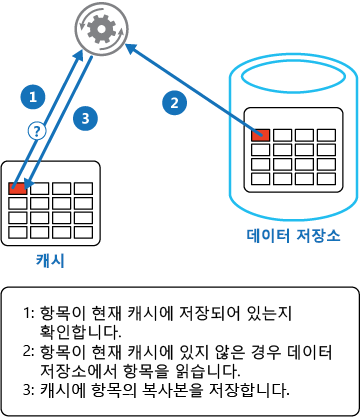

# 캐시 배제

[!INCLUDE [header](../_includes/header.md)]

주문형 데이터를 데이터 저장소에서 캐시로 로드합니다. 이렇게 하면 성능을 향상시킬 수 있고 캐시에 보관된 데이터와 기본 데이터 저장소의 데이터 사이에 일관성을 손 쉽게 유지할 수 있습니다.

## 배경 및 문제

응용 프로그램은 캐시를 사용해 데이터 저장소에 보관된 정보에 반복적으로 이루어지는 액세스를 개선합니다. 그러나 캐시된 데이터가 데이터 저장소의 데이터와 항상 일치하기를 기대하기란 어렵습니다. 응용 프로그램은 캐시에 보관된 데이터를 최신 상태로 유지할 수 있도록 지원하는 전략을 구현하는 동시에 캐시에 보관된 오래된 데이터로 인해 발생하는 상황을 감지하고 처리할 수 있어야 합니다.

## 해결책

많은 상업용 캐싱 시스템은 리드스루 및 라이트스루/라이트비하인드 작업을 제공합니다. 이런 캐싱 시스템에서 응용 프로그램은 캐시를 참조해 데이터를 검색합니다. 캐시에 데이터가 없으면 데이터 저장소에서 데이터를 검색한 뒤 캐시에 추가할 뿐 아니라 캐시에 보관된 데이터의 모든 수정 사항도 라이트백 방식으로 데이터 저장소에 자동 기록합니다.

라이트백 기능을 제공하지 않는 캐시의 경우, 데이터 유지를 위해 캐시를 사용하는 것은 응용 프로그램의 몫입니다.

응용 프로그램은 캐시 배제 전략을 구현해 리드스루 캐싱의 기능을 에뮬레이트할 수 있습니다. 캐시 배제 전략은 데이터를 주문형 캐시에 로드합니다. 아래 그림은 캐시 배제 패턴을 사용해 데이터를 캐시에 저장하는 방법을 보여줍니다.




정보를 업데이트한 응용 프로그램은 데이터 저장소에 수정 사항을 저장하고 캐시의 해당 항목을 무효화해 라이트스루 전략을 구현할 수 있습니다.

다음에도 해당 항목이 필요한 경우에도 캐시 배제 전략을 사용하면 데이터 저장소에서 업데이트된 데이터를 검색해 캐시에 다시 추가할 수 있습니다.

## 문제 및 고려 사항

이 패턴의 구현 방법을 결정할 때는 다음 사항을 고려해야 합니다.

**캐시된 데이터의 수명**. 대부분의 캐시는 규정된 기간 동안 액세스하지 않은 경우 데이터를 무효화하고 캐시에서 삭제하는 만료 정책을 구현합니다. 캐시 배제가 효과적이려면 만료 정책이 데이터를 사용하는 응용 프로그램의 액세스 패턴과 일치해야 합니다. 응용 프로그램은 데이터 저장소에서 데이터를 지속적으로 검색해서 캐시에 추가할 수 있기 때문에, 만료 기간이 너무 짧아서도 안 되고 이와 마찬가지로 캐시된 데이터는 오래 유지될 수 있기 때문에 만료 기간이 너무 길어서도 안 됩니다. 캐싱은 비교적 정적인 데이터 또는 자주 읽는 데이터에 가장 효과입니다.

**데이터 제거**. 대부분의 캐시는 데이터를 가져오는 데이터 저장소에 비해 크기가 제한되기 때문에 필요한 경우 데이터를 제거합니다. 대부분의 캐시는 오래 전에 사용한 항목 정책을 채택해 제거 대상 항목을 선택하지만, 정책을 사용자 지정할 수도 있습니다. 캐시의 전역 만료 속성과 기타 속성 및 각각의 캐시된 항목의 만료 속성을 구성하여 캐시의 경제성을 높입니다. 한편 캐시의 모든 항목에 전역 제거 정책을 적용하는 것이 항상 적절한 것은 아닙니다. 예를 들어 데이터 저장소에서 캐시된 항목을 검색하는 비용이 높은 경우에는 더 자주 액세스하지만 비용이 낮은 항목을 제거하고 비용이 높은 항목을 유지하는 것이 유리할 수 있습니다.

**캐시 초기화**. 대부분의 솔루션은 시작 처리 과정에서 응용 프로그램에 필요할 수 있는 데이터를 미리 캐시에 채워둡니다. 캐시 배제 패턴은 이런 데이터 중 일부가 만료되거나 제거되는 경우에도 여전히 유용할 수 있습니다.

**일관성**. 캐시 배제 패턴의 구현이 데이터 저장소와 캐시의 일관성을 보증하는 것은 아닙니다. 데이터 저장소의 항목은 외부 프로세스를 통해 언제든 변경될 수 있고, 이와 같은 변경은 해당 항목을 다시 로드할 때까지 캐시에 반영되지 않습니다. 여러 데이터 저장소에 데이터를 복제하는 시스템에서 동기화가 자주 이루어질 경우 이와 같은 문제가 심각한 문제로 발전할 수 있습니다.

**로컬(메모리 내) 캐싱**. 캐시는 응용 프로그램 인스턴스에 대해 로컬일 수 있으며 메모리 내에 저장될 수 있습니다. 캐시 배제는 응용 프로그램이 동일한 데이터에 반복적으로 액세스하는 경우 로컬 환경에서 유용할 수 있습니다. 그러나 로컬 캐시는 개인용이므로, 다양한 응용 프로그램 인스턴스 각각은 동일한 캐시된 데이터의 사본을 보유할 수 있습니다. 이런 데이터는 캐시 사이에서 일관성을 빠르게 상실할 수 있으므로, 개인 캐시에 보관된 데이터는 만료시키고 더 자주 새로 고칠 필요가 있습니다. 이런 시나리오에서는 공유 또는 분산 캐싱 방식의 사용 여부 검토를 고려해야 합니다.

## 패턴 사용 사례

다음의 경우에 이 패턴을 사용합니다.

- 캐시가 기본 리드스루 및 라이트스루 작업을 제공하지 않는 경우
- 리소스 요구 사항을 예측할 수 없는 경우, 이 패턴을 사용하면 응용 프로그램이 주문형 데이터를 로드할 수 있습니다. 이 패턴은 응용 프로그램에 필요할 데이터에 대해 사전에 가정하지 않습니다.

다음 경우에는 이 패턴이 적합하지 않습니다.

- 캐시된 데이터 집합이 정적인 경우. 사용 가능한 캐시 공간에 데이터가 가득 차면 시작 시 데이터가 채워진 캐시를 초기화하고 데이터의 만료를 방지하는 정책을 적용합니다.
- 웹 팜에 호스팅되는 웹 응용 프로그램 내 캐싱 세션 상태 정보.  이런 환경에서는 클라이언트-서버 선호도를 기반으로 하는 종속성 도입을 피해야 합니다.

## 예제

Microsoft Azure에서는 Azure Cache를 사용해 응용 프로그램의 복수 인스턴스가 공유할 수 있는 분산 캐시를 생성할 수 있습니다. 다음 코드 예제의 `GetMyEntityAsync` 메서드는 Azure Cache를 기반으로 하는 캐시 배제 패턴의 구현을 보여줍니다. 이 메서드는 리드스루 접근 방식을 사용해 캐시에서 개체를 검색합니다.

개체 식별 키는 정수 ID입니다. `GetMyEntityAsync` 메서드는 이 키를 기반으로 하는 문자열 값을 생성하고(Azure Cache API는 키 값 대신 문자열을 사용) 이 키를 포함한 항목을 캐시에서 검색합니다. 일치하는 항목이 발견되면 해당 항목이 반환됩니다. 캐시에 일치하는 항목이 없으면 `GetMyEntityAsync` 메서드는 개체를 데이터 저장소에서 검색해 캐시에 추가한 뒤 반환합니다. 데이터 저장소의 종속성 때문에, 데이터 저장소에서 데이터를 실제로 검색하는 코드는 생략되었습니다. 캐시된 항목을 만료 방식으로 구성하여 다른 위치에서 업데이트되더라도 오래되지 않도록 조치해야 합니다.

```csharp
private DataCache cache;

public async Task<MyEntity> GetMyEntityAsync(int id)
{  
  // Define a unique key for this method and its parameters.
  var key = string.Format("StoreWithCache_GetAsync_{0}", id);
  var expiration = TimeSpan.FromMinutes(3);
  bool cacheException = false;

  try
  {
    // Try to get the entity from the cache.
    var cacheItem = cache.GetCacheItem(key);
    if (cacheItem != null)
    {
      return cacheItem.Value as MyEntity;
    }
  }
  catch (DataCacheException)
  {
    // If there's a cache related issue, raise an exception 
    // and avoid using the cache for the rest of the call.
    cacheException = true;
  }

  // If there's a cache miss, get the entity from the original store and cache it.
  // Code has been omitted because it's data store dependent.  
  var entity = ...;

  if (!cacheException)
  {
    try
    {
      // Avoid caching a null value.
      if (entity != null)
      {
        // Put the item in the cache with a custom expiration time that 
        // depends on how critical it is to have stale data.
        cache.Put(key, entity, timeout: expiration);
      }
    }
    catch (DataCacheException)
    {
      // If there's a cache related issue, ignore it
      // and just return the entity.
    }
  }

  return entity;
}
```

>  위의 예제는 Azure Cache API를 사용해 데이터 저장소에 액세스하고 정보를 캐시에서 검색합니다. 자세한 내용은 [Using Microsoft Azure Cache](https://msdn.microsoft.com/library/azure/hh914165.aspx)를 참조하시기 바랍니다.

아래 제시된 `UpdateEntityAsync` 메서드는 응용 프로그램에서 값이 변경될 때 캐시의 개체를 무효화하는 방법을 보여줍니다. 이것이 바로 라이트스루 접근 방식의 예입니다. 다음 코드는 원래 데이터 저장소를 업데이트한 다음 `Remove` 메서드를 호출하고 키를 지정해(데이터 저장소 종속성 때문에 코드는 생략) 캐시에서 캐시된 항목을 삭제합니다.

>  이 시퀀스에서는 단계의 순서가 중요합니다. 캐시를 업데이트하기 전에 캐시의 항목을 삭제하면 (캐시에 데이터가 없기 때문에) 클라이언트 응용 프로그램이 데이터를 가져오는 시간이 짧아지는데, 데이터 저장소의 항목이 변경되기 전이라면 캐시는 오래된 데이터를 포함하게 됩니다.

```csharp
public async Task UpdateEntityAsync(MyEntity entity)
{
  // Update the object in the original data store
  await this.store.UpdateEntityAsync(entity).ConfigureAwait(false);

  // Get the correct key for the cached object.
  var key = this.GetAsyncCacheKey(entity.Id);

  // Then, invalidate the current cache object
  this.cache.Remove(key);
}

private string GetAsyncCacheKey(int objectId)
{
  return string.Format("StoreWithCache_GetAsync_{0}", objectId);
}
```

## 관련 지침 

이 패턴의 구현과 관련된 정보는 다음과 같습니다.

- [캐싱 지침](https://msdn.microsoft.com/library/dn589802.aspx)클라우드 솔루션에서 데이터를 캐시할 수 있는 방법에 대한 추가 정보뿐 아니라 캐시 구현 시 고려해야 하는 문제를 제공합니다. 

- [데이터 일관성 프라이머](https://msdn.microsoft.com/library/dn589800.aspx). 보통 클라우드 응용 프로그램은 여러 데이터 저장소에 걸쳐 있는 데이터를 사용합니다. 이런 환경에서는 데이터 일관성의 관리와 유지가 시스템에서 중요한 측면으로 작용하는데, 구체적으로 동시성과 가용성 문제가 발생할 수 있습니다. 데이터 일관성 프라이머는 분산 데이터의 일관성 문제를 설명할 뿐 아니라 응용 프로그램에서 일관성을 구현해 데이터의 가용성을 유지하는 방법도 요약하고 있습니다.
