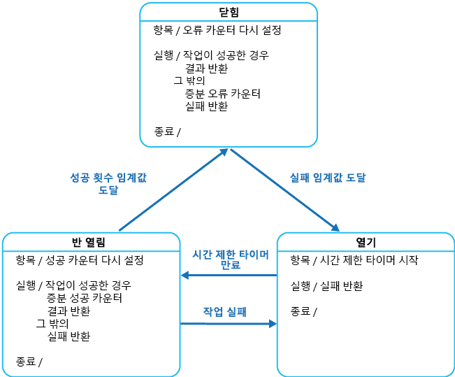

# <a name="circuit-breaker-pattern"></a><span data-ttu-id="36895-104">회로 차단기 패턴</span><span class="sxs-lookup"><span data-stu-id="36895-104">Circuit Breaker pattern</span></span>

<span data-ttu-id="36895-105">원격 서비스 또는 리소스에 연결할 때 복구하는 데 걸리는 시간이 유동적인 오류를 처리합니다.</span><span class="sxs-lookup"><span data-stu-id="36895-105">Handle faults that might take a variable amount of time to recover from, when connecting to a remote service or resource.</span></span> <span data-ttu-id="36895-106">그러면 응용 프로그램의 안정성 및 복원력을 향상시킬 수 있습니다.</span><span class="sxs-lookup"><span data-stu-id="36895-106">This can improve the stability and resiliency of an application.</span></span>

## <a name="context-and-problem"></a><span data-ttu-id="36895-107">컨텍스트 및 문제점</span><span class="sxs-lookup"><span data-stu-id="36895-107">Context and problem</span></span>

<span data-ttu-id="36895-108">분산된 환경에서 원격 리소스 및 서비스에 대한 호출은 느린 네트워크 연결, 제한 시간 또는 과도하게 커밋되거나 일시적으로 사용할 수 없는 리소스와 같은 일시적인 오류로 인해 실패할 수 있습니다.</span><span class="sxs-lookup"><span data-stu-id="36895-108">In a distributed environment, calls to remote resources and services can fail due to transient faults, such as slow network connections, timeouts, or the resources being overcommitted or temporarily unavailable.</span></span> <span data-ttu-id="36895-109">이러한 오류는 일반적으로 짧은 기간 후에 자체적으로 수정되며 강력한 클라우드 응용 프로그램은 [재시도 패턴][retry-pattern]과 같은 전략을 사용하여 이를 처리하도록 준비해야 합니다.</span><span class="sxs-lookup"><span data-stu-id="36895-109">These faults typically correct themselves after a short period of time, and a robust cloud application should be prepared to handle them by using a strategy such as the [Retry pattern][retry-pattern].</span></span>

<span data-ttu-id="36895-110">그러나 예기치 않은 이벤트로 인해 오류가 발생할 수 있으며 이 경우에 문제를 해결하는 시간이 훨씬 더 오래 걸릴 수 있습니다.</span><span class="sxs-lookup"><span data-stu-id="36895-110">However, there can also be situations where faults are due to unanticipated events, and that might take much longer to fix.</span></span> <span data-ttu-id="36895-111">이러한 오류는 심각도의 범위가 연결의 부분적인 손실에서 서비스의 전체 오류까지 퍼질 수 있습니다.</span><span class="sxs-lookup"><span data-stu-id="36895-111">These faults can range in severity from a partial loss of connectivity to the complete failure of a service.</span></span> <span data-ttu-id="36895-112">이러한 경우에 응용 프로그램에서 계속 성공할 가능성이 없는 작업을 계속 다시 시도하는 것은 무의미할 수 있습니다. 대신 응용 프로그램은 신속하게 작업이 실패했음을 받아들이고 그에 따라 이 오류를 처리해야 합니다.</span><span class="sxs-lookup"><span data-stu-id="36895-112">In these situations it might be pointless for an application to continually retry an operation that is unlikely to succeed, and instead the application should quickly accept that the operation has failed and handle this failure accordingly.</span></span>

<span data-ttu-id="36895-113">또한 서비스 사용량이 많은 경우 시스템의 한 부분에서 발생한 오류로 인해 연계 오류가 발생할 수 있습니다.</span><span class="sxs-lookup"><span data-stu-id="36895-113">Additionally, if a service is very busy, failure in one part of the system might lead to cascading failures.</span></span> <span data-ttu-id="36895-114">예를 들어 서비스를 호출하는 작업은 시간 초과를 구현하고 서비스가 이 기간 내에 응답하지 못하는 경우 오류 메시지를 회신하도록 구성될 수 있습니다.</span><span class="sxs-lookup"><span data-stu-id="36895-114">For example, an operation that invokes a service could be configured to implement a timeout, and reply with a failure message if the service fails to respond within this period.</span></span> <span data-ttu-id="36895-115">그러나 이 전략은 같은 작업에 대한 여러 동시 요청을 시간 제한이 만료될 때까지 차단할 수 있습니다.</span><span class="sxs-lookup"><span data-stu-id="36895-115">However, this strategy could cause many concurrent requests to the same operation to be blocked until the timeout period expires.</span></span> <span data-ttu-id="36895-116">이처럼 차단된 요청이 메모리, 스레드, 데이터베이스 연결 등의 중요한 시스템 리소스를 계속 잡아 둘 수 있습니다.</span><span class="sxs-lookup"><span data-stu-id="36895-116">These blocked requests might hold critical system resources such as memory, threads, database connections, and so on.</span></span> <span data-ttu-id="36895-117">따라서 이러한 리소스가 부족해지면 동일한 리소스를 사용해야 하는 시스템과 관계 없는 부분에 오류가 발생하게 됩니다.</span><span class="sxs-lookup"><span data-stu-id="36895-117">Consequently, these resources could become exhausted, causing failure of other possibly unrelated parts of the system that need to use the same resources.</span></span> <span data-ttu-id="36895-118">이러한 상황에서는 즉시 실패할 작업만을 수행하고 성공할 수 있는 서비스만을 호출하는 것이 좋습니다.</span><span class="sxs-lookup"><span data-stu-id="36895-118">In these situations, it would be preferable for the operation to fail immediately, and only attempt to invoke the service if it's likely to succeed.</span></span> <span data-ttu-id="36895-119">시간 제한을 짧게 설정하면 이 문제를 해결하는 데 도움이 될 수 있습니다. 하지만 서비스에 대한 요청이 결국 성공하는 경우에도 시간 제한이 너무 짧아서 작업이 대부분 실패하지 않도록 해야 합니다.</span><span class="sxs-lookup"><span data-stu-id="36895-119">Note that setting a shorter timeout might help to resolve this problem, but the timeout shouldn't be so short that the operation fails most of the time, even if the request to the service would eventually succeed.</span></span>

## <a name="solution"></a><span data-ttu-id="36895-120">해결 방법</span><span class="sxs-lookup"><span data-stu-id="36895-120">Solution</span></span>

<span data-ttu-id="36895-121">Michael Nygard의 저서 [Release It!](https://pragprog.com/book/mnee/release-it)에서 알려진 회로 차단기 패턴은 응용 프로그램이 실패할 가능성이 있는 작업을 반복적으로 실행하지 않도록 방지할 수 있습니다.</span><span class="sxs-lookup"><span data-stu-id="36895-121">The Circuit Breaker pattern, popularized by Michael Nygard in his book, [Release It!](https://pragprog.com/book/mnee/release-it), can prevent an application from repeatedly trying to execute an operation that's likely to fail.</span></span> <span data-ttu-id="36895-122">오류가 장기 지속된다는 점을 확인하는 동안 오류가 수정되도록 대기하거나 CPU 주기를 낭비하지 않고 계속되도록 허용합니다.</span><span class="sxs-lookup"><span data-stu-id="36895-122">Allowing it to continue without waiting for the fault to be fixed or wasting CPU cycles while it determines that the fault is long lasting.</span></span> <span data-ttu-id="36895-123">회로 차단기 패턴을 사용하면 응용 프로그램에서 오류가 해결되었는지를 감지할 수 있습니다.</span><span class="sxs-lookup"><span data-stu-id="36895-123">The Circuit Breaker pattern also enables an application to detect whether the fault has been resolved.</span></span> <span data-ttu-id="36895-124">문제가 해결된 것으로 나타나면 응용 프로그램은 작업을 호출하도록 시도할 수 있습니다.</span><span class="sxs-lookup"><span data-stu-id="36895-124">If the problem appears to have been fixed, the application can try to invoke the operation.</span></span>

> <span data-ttu-id="36895-125">회로 차단기 패턴의 목적은 재시도 패턴과 다릅니다.</span><span class="sxs-lookup"><span data-stu-id="36895-125">The purpose of the Circuit Breaker pattern is different than the Retry pattern.</span></span> <span data-ttu-id="36895-126">재시도 패턴을 사용하면 응용 프로그램에서 작업이 성공한다는 기대로 작업을 다시 시도할 수 있습니다.</span><span class="sxs-lookup"><span data-stu-id="36895-126">The Retry pattern enables an application to retry an operation in the expectation that it'll succeed.</span></span> <span data-ttu-id="36895-127">회로 차단기 패턴은 응용 프로그램이 실패할 수 있는 작업을 시도하지 않도록 방지합니다.</span><span class="sxs-lookup"><span data-stu-id="36895-127">The Circuit Breaker pattern prevents an application from performing an operation that is likely to fail.</span></span> <span data-ttu-id="36895-128">응용 프로그램은 회로 차단기를 통해 작업을 호출하기 위해 재시도 패턴을 사용하여 이러한 두 가지 패턴을 결합할 수 있습니다.</span><span class="sxs-lookup"><span data-stu-id="36895-128">An application can combine these two patterns by using the Retry pattern to invoke an operation through a circuit breaker.</span></span> <span data-ttu-id="36895-129">그러나 재시도 논리는 회로 차단기에서 반환되는 모든 예외에 민감하며, 회로 차단기에서 오류가 일시적임을 나타내는 경우 재시도를 중단합니다.</span><span class="sxs-lookup"><span data-stu-id="36895-129">However, the retry logic should be sensitive to any exceptions returned by the circuit breaker and abandon retry attempts if the circuit breaker indicates that a fault is not transient.</span></span>

<span data-ttu-id="36895-130">회로 차단기는 실패할 수 있는 작업에서 프록시 역할을 합니다.</span><span class="sxs-lookup"><span data-stu-id="36895-130">A circuit breaker acts as a proxy for operations that might fail.</span></span> <span data-ttu-id="36895-131">프록시는 발생한 최근 오류 수를 모니터링하거나, 이 정보를 사용하여 작업을 진행하도록 허용할지를 결정하거나, 단순히 예외를 즉시 반환해야 합니다.</span><span class="sxs-lookup"><span data-stu-id="36895-131">The proxy should monitor the number of recent failures that have occurred, and use this information to decide whether to allow the operation to proceed, or simply return an exception immediately.</span></span>

<span data-ttu-id="36895-132">프록시는 전기 회로 차단기의 기능을 모방하는 다음과 같은 상태인 상태 컴퓨터로 구현될 수 있습니다.</span><span class="sxs-lookup"><span data-stu-id="36895-132">The proxy can be implemented as a state machine with the following states that mimic the functionality of an electrical circuit breaker:</span></span>

- <span data-ttu-id="36895-133">**닫힘**: 응용 프로그램의 요청을 작업으로 라우팅합니다.</span><span class="sxs-lookup"><span data-stu-id="36895-133">**Closed**: The request from the application is routed to the operation.</span></span> <span data-ttu-id="36895-134">프록시는 최근 오류 수를 유지 관리합니다. 작업에 대한 호출이 실패하는 경우 프록시로 인해 이 수가 증가합니다.</span><span class="sxs-lookup"><span data-stu-id="36895-134">The proxy maintains a count of the number of recent failures, and if the call to the operation is unsuccessful the proxy increments this count.</span></span> <span data-ttu-id="36895-135">최근 오류 수가 지정된 기간 내에서 지정된 임계값을 초과하는 경우 프록시는 **열린** 상태로 전환됩니다.</span><span class="sxs-lookup"><span data-stu-id="36895-135">If the number of recent failures exceeds a specified threshold within a given time period, the proxy is placed into the **Open** state.</span></span> <span data-ttu-id="36895-136">프록시가 시간 제한 타이머를 시작하는 시점에서 이 타이머가 만료되는 경우 프록시는 **반 열린** 상태로 전환됩니다.</span><span class="sxs-lookup"><span data-stu-id="36895-136">At this point the proxy starts a timeout timer, and when this timer expires the proxy is placed into the **Half-Open** state.</span></span>

    > <span data-ttu-id="36895-137">시간 제한 타이머의 목적은 응용 프로그램이 작업을 다시 수행하도록 허용하기 전에 오류를 발생시킨 문제를 해결할 시간을 시스템에 제공하는 것입니다.</span><span class="sxs-lookup"><span data-stu-id="36895-137">The purpose of the timeout timer is to give the system time to fix the problem that caused the failure before allowing the application to try to perform the operation again.</span></span>

- <span data-ttu-id="36895-138">**열림**: 응용 프로그램의 요청이 즉시 실패하고 응용 프로그램에 예외가 반환됩니다.</span><span class="sxs-lookup"><span data-stu-id="36895-138">**Open**: The request from the application fails immediately and an exception is returned to the application.</span></span>

- <span data-ttu-id="36895-139">**반 열림**: 제한된 수의 응용 프로그램 요청이 전달되도록 허용하고 작업을 호출할 수 있습니다.</span><span class="sxs-lookup"><span data-stu-id="36895-139">**Half-Open**: A limited number of requests from the application are allowed to pass through and invoke the operation.</span></span> <span data-ttu-id="36895-140">이러한 요청이 성공하는 경우 이전에 오류가 발생된 오류가 해결되었고 회로 차단기가 **닫힌** 상태로 전환되었다(오류 카운터를 다시 설정함)고 가정합니다.</span><span class="sxs-lookup"><span data-stu-id="36895-140">If these requests are successful, it's assumed that the fault that was previously causing the failure has been fixed and the circuit breaker switches to the **Closed** state (the failure counter is reset).</span></span> <span data-ttu-id="36895-141">요청이 실패하면 회로 차단기에서는 오류가 여전히 존재한다고 가정합니다. 따라서 **열린** 상태로 다시 되돌리고 시간 제한 타이머를 다시 시작하여 오류로부터 복구할 추가 기간을 시스템에 제공합니다.</span><span class="sxs-lookup"><span data-stu-id="36895-141">If any request fails, the circuit breaker assumes that the fault is still present so it reverts back to the **Open** state and restarts the timeout timer to give the system a further period of time to recover from the failure.</span></span>

    > <span data-ttu-id="36895-142">**반 열린** 상태는 복구 중인 서비스에 갑자기 요청이 몰리지 않도록 방지할 수 있습니다.</span><span class="sxs-lookup"><span data-stu-id="36895-142">The **Half-Open** state is useful to prevent a recovering service from suddenly being flooded with requests.</span></span> <span data-ttu-id="36895-143">서비스가 복구되는 대로 복구가 완료될 때까지 제한된 볼륨의 요청을 지원할 수 있지만 복구가 진행 중인 동안 많은 양의 작업으로 인해 서비스에 시간 초과 또는 다시 실패가 발생할 수 있습니다.</span><span class="sxs-lookup"><span data-stu-id="36895-143">As a service recovers, it might be able to support a limited volume of requests until the recovery is complete, but while recovery is in progress a flood of work can cause the service to time out or fail again.</span></span>



<span data-ttu-id="36895-145">그림에서는 **닫힌** 상태에서 사용되는 오류 카운터가 시간에 기반합니다.</span><span class="sxs-lookup"><span data-stu-id="36895-145">In the figure, the failure counter used by the **Closed** state is time based.</span></span> <span data-ttu-id="36895-146">정기적 간격에 자동으로 다시 설정됩니다.</span><span class="sxs-lookup"><span data-stu-id="36895-146">It's automatically reset at periodic intervals.</span></span> <span data-ttu-id="36895-147">이렇게 하면 회로 차단기에 종종 오류가 발생하는 경우 **열린** 상태로 전환되지 않도록 할 수 있습니다.</span><span class="sxs-lookup"><span data-stu-id="36895-147">This helps to prevent the circuit breaker from entering the **Open** state if it experiences occasional failures.</span></span> <span data-ttu-id="36895-148">지정된 수의 오류가 지정된 간격 동안 발생한 경우에만 회로 차단기를 **열린** 상태로 전환하는 오류 임계값에 도달합니다.</span><span class="sxs-lookup"><span data-stu-id="36895-148">The failure threshold that trips the circuit breaker into the **Open** state is only reached when a specified number of failures have occurred during a specified interval.</span></span> <span data-ttu-id="36895-149">**반 열린** 상태에서 사용하는 카운터는 작업을 호출하는 시도가 성공한 수를 기록합니다.</span><span class="sxs-lookup"><span data-stu-id="36895-149">The counter used by the **Half-Open** state records the number of successful attempts to invoke the operation.</span></span> <span data-ttu-id="36895-150">지정된 수의 연속 작업 호출이 성공한 후에 회로 차단기가 **닫힌** 상태로 되돌아갑니다.</span><span class="sxs-lookup"><span data-stu-id="36895-150">The circuit breaker reverts to the **Closed** state after a specified number of consecutive operation invocations have been successful.</span></span> <span data-ttu-id="36895-151">호출에 실패하면 회로 차단기는 **열린** 상태로 즉시 전환되고 성공 카운터는 다음에 **반 열린** 상태로 전환될 때 다시 설정됩니다.</span><span class="sxs-lookup"><span data-stu-id="36895-151">If any invocation fails, the circuit breaker enters the **Open** state immediately and the success counter will be reset the next time it enters the **Half-Open** state.</span></span>

> <span data-ttu-id="36895-152">실패한 구성 요소를 복원 또는 다시 시작하거나 네트워크 연결을 복구하여 시스템 복구를 외부적으로 처리하는 방법입니다.</span><span class="sxs-lookup"><span data-stu-id="36895-152">How the system recovers is handled externally, possibly by restoring or restarting a failed component or repairing a network connection.</span></span>

<span data-ttu-id="36895-153">회로 차단기 패턴은 시스템이 오류로부터 복구되는 동안 안정성을 제공하여 성능에 대한 영향을 최소화합니다.</span><span class="sxs-lookup"><span data-stu-id="36895-153">The Circuit Breaker pattern provides stability while the system recovers from a failure and minimizes the impact on performance.</span></span> <span data-ttu-id="36895-154">작업이 제한 시간을 초과하거나 반환하기를 대기하지 않고 실패할 가능성이 있는 작업에 대한 요청을 거부하여 시스템의 응답 시간을 유지 관리할 수 있습니다.</span><span class="sxs-lookup"><span data-stu-id="36895-154">It can help to maintain the response time of the system by quickly rejecting a request for an operation that's likely to fail, rather than waiting for the operation to time out, or never return.</span></span> <span data-ttu-id="36895-155">회로 차단기가 상태를 변경할 때마다 이벤트를 발생시키는 경우 이 정보는 회로 차단기에 의해 보호되는 시스템의 일부 상태를 모니터링하거나 회로 차단기가 **열린** 상태로 전환될 때를 관리자에게 알리는 데 사용할 수 있습니다.</span><span class="sxs-lookup"><span data-stu-id="36895-155">If the circuit breaker raises an event each time it changes state, this information can be used to monitor the health of the part of the system protected by the circuit breaker, or to alert an administrator when a circuit breaker trips to the **Open** state.</span></span>

<span data-ttu-id="36895-156">패턴은 사용자 지정할 수 있으며 발생할 수 있는 오류의 형식에 따라 적용할 수 있습니다.</span><span class="sxs-lookup"><span data-stu-id="36895-156">The pattern is customizable and can be adapted according to the type of the possible failure.</span></span> <span data-ttu-id="36895-157">예를 들어 회로 차단기에 증가하는 시간 제한 타이머를 적용할 수 있습니다.</span><span class="sxs-lookup"><span data-stu-id="36895-157">For example, you can apply an increasing timeout timer to a circuit breaker.</span></span> <span data-ttu-id="36895-158">처음 몇 초 동안 회로 차단기를 **열린** 상태로 전환한 다음 오류가 해결되지 않는 경우 몇 분 동안 시간 제한을 늘릴 수 있습니다.</span><span class="sxs-lookup"><span data-stu-id="36895-158">You could place the circuit breaker in the **Open** state for a few seconds initially, and then if the failure hasn't been resolved increase the timeout to a few minutes, and so on.</span></span> <span data-ttu-id="36895-159">어떤 경우에는 오류를 반환하고 예외를 발생시키는 **열린** 상태가 아니라 응용 프로그램에 의미 있는 기본값을 반환하는 것이 유용할 수 있습니다.</span><span class="sxs-lookup"><span data-stu-id="36895-159">In some cases, rather than the **Open** state returning failure and raising an exception, it could be useful to return a default value that is meaningful to the application.</span></span>

## <a name="issues-and-considerations"></a><span data-ttu-id="36895-160">문제 및 고려 사항</span><span class="sxs-lookup"><span data-stu-id="36895-160">Issues and considerations</span></span>

<span data-ttu-id="36895-161">이 패턴을 구현할 방법을 결정할 때 다음 사항을 고려해야 합니다.</span><span class="sxs-lookup"><span data-stu-id="36895-161">You should consider the following points when deciding how to implement this pattern:</span></span>

<span data-ttu-id="36895-162">**예외 처리**</span><span class="sxs-lookup"><span data-stu-id="36895-162">**Exception Handling**.</span></span> <span data-ttu-id="36895-163">회로 차단기를 통해 작업을 호출하는 응용 프로그램은 작업을 사용할 수 없는 경우 발생하는 예외를 처리하도록 준비되어야 합니다.</span><span class="sxs-lookup"><span data-stu-id="36895-163">An application invoking an operation through a circuit breaker must be prepared to handle the exceptions raised if the operation is unavailable.</span></span> <span data-ttu-id="36895-164">예외를 처리하는 방법은 응용 프로그램에 따라 다릅니다.</span><span class="sxs-lookup"><span data-stu-id="36895-164">The way exceptions are handled will be application specific.</span></span> <span data-ttu-id="36895-165">예를 들어 응용 프로그램이 일시적으로 해당 기능을 저하시키면 대체 작업을 호출하여 동일한 작업을 수행하거나 동일한 데이터를 가져옵니다. 또는 사용자에게 예외를 보고하고 나중에 다시 시도하도록 요청합니다.</span><span class="sxs-lookup"><span data-stu-id="36895-165">For example, an application could temporarily degrade its functionality, invoke an alternative operation to try to perform the same task or obtain the same data, or report the exception to the user and ask them to try again later.</span></span>

<span data-ttu-id="36895-166">**예외의 형식**</span><span class="sxs-lookup"><span data-stu-id="36895-166">**Types of Exceptions**.</span></span> <span data-ttu-id="36895-167">요청은 여러 가지 이유로 실패합니다. 그 중 일부는 다른 항목보다 더 심각한 오류를 나타낼 수 있습니다.</span><span class="sxs-lookup"><span data-stu-id="36895-167">A request might fail for many reasons, some of which might indicate a more severe type of failure than others.</span></span> <span data-ttu-id="36895-168">예를 들어 원격 서비스에서 반복적인 충돌이 발생하고 복구하려면 몇 분 정도가 걸리기 때문에 요청이 실패할 수 있습니다. 또는 서비스의 일시적 오버로드로 인한 시간 초과 때문에 요청이 실패할 수 있습니다.</span><span class="sxs-lookup"><span data-stu-id="36895-168">For example, a request might fail because a remote service has crashed and will take several minutes to recover, or because of a timeout due to the service being temporarily overloaded.</span></span> <span data-ttu-id="36895-169">회로 차단기는 발생한 예외의 형식을 검사하고 이러한 예외의 성격에 따라 해당 전략을 조정할 수 있습니다.</span><span class="sxs-lookup"><span data-stu-id="36895-169">A circuit breaker might be able to examine the types of exceptions that occur and adjust its strategy depending on the nature of these exceptions.</span></span> <span data-ttu-id="36895-170">예를 들어 서비스를 완전히 사용할 수 없게 됨으로 인해 발생하는 오류 수와는 대조적으로 회로 차단기를 **열린** 상태로 전환하려면 다양한 시간 제한 예외가 필요할 수 있습니다.</span><span class="sxs-lookup"><span data-stu-id="36895-170">For example, it might require a larger number of timeout exceptions to trip the circuit breaker to the **Open** state compared to the number of failures due to the service being completely unavailable.</span></span>

<span data-ttu-id="36895-171">**로깅**</span><span class="sxs-lookup"><span data-stu-id="36895-171">**Logging**.</span></span> <span data-ttu-id="36895-172">회로 차단기는 관리자가 작업의 상태를 모니터링할 수 있도록 모든 실패한 요청 및 가능하면 성공한 요청을 기록해야 합니다.</span><span class="sxs-lookup"><span data-stu-id="36895-172">A circuit breaker should log all failed requests (and possibly successful requests) to enable an administrator to monitor the health of the operation.</span></span>

<span data-ttu-id="36895-173">**복구 기능**</span><span class="sxs-lookup"><span data-stu-id="36895-173">**Recoverability**.</span></span> <span data-ttu-id="36895-174">보호하는 작업의 가능한 복구 패턴과 일치하도록 회로 차단기를 구성해야 합니다.</span><span class="sxs-lookup"><span data-stu-id="36895-174">You should configure the circuit breaker to match the likely recovery pattern of the operation it's protecting.</span></span> <span data-ttu-id="36895-175">예를 들어 회로 차단기가 오랫동안 **열린** 상태를 유지하는 경우 실패의 원인이 해결되는 경우에도 예외가 발생할 수 있습니다.</span><span class="sxs-lookup"><span data-stu-id="36895-175">For example, if the circuit breaker remains in the **Open** state for a long period, it could raise exceptions even if the reason for the failure has been resolved.</span></span> <span data-ttu-id="36895-176">마찬가지로 회로 차단기가 **열린** 상태에서 **반 열린** 상태로 너무 빨리 전환하는 경우 응용 프로그램의 응답 시간을 변동시키고 줄일 수 있습니다.</span><span class="sxs-lookup"><span data-stu-id="36895-176">Similarly, a circuit breaker could fluctuate and reduce the response times of applications if it switches from the **Open** state to the **Half-Open** state too quickly.</span></span>

<span data-ttu-id="36895-177">**실패한 작업 테스트**</span><span class="sxs-lookup"><span data-stu-id="36895-177">**Testing Failed Operations**.</span></span> <span data-ttu-id="36895-178">회로 차단기는 **열린** 상태에서 **반 열린** 상태로 전환할 시기를 결정하는 데 타이머를 사용하지 않고 대신 원격 서비스 또는 리소스를 다시 사용할 수 있는지 확인하기 위해 주기적으로 ping할 수 있습니다.</span><span class="sxs-lookup"><span data-stu-id="36895-178">In the **Open** state, rather than using a timer to determine when to switch to the **Half-Open** state, a circuit breaker can instead periodically ping the remote service or resource to determine whether it's become available again.</span></span> <span data-ttu-id="36895-179">이 ping은 이전에 실패한 작업을 호출하려는 시도의 형식을 사용할 수 있습니다. 또는 [상태 끝점 모니터링 패턴](health-endpoint-monitoring.md)에 설명된 대로 서비스의 상태를 테스트하기 위해 특별히 원격 서비스에서 제공하는 특별한 작업을 사용할 수 있습니다.</span><span class="sxs-lookup"><span data-stu-id="36895-179">This ping could take the form of an attempt to invoke an operation that had previously failed, or it could use a special operation provided by the remote service specifically for testing the health of the service, as described by the [Health Endpoint Monitoring pattern](health-endpoint-monitoring.md).</span></span>

<span data-ttu-id="36895-180">**수동 재정의**</span><span class="sxs-lookup"><span data-stu-id="36895-180">**Manual Override**.</span></span> <span data-ttu-id="36895-181">실패한 작업의 복구 시간에 매우 변수가 많은 시스템에서는 관리자가 회로 차단기를 닫고 실패 카운터를 다시 설정하도록 수동 재설정 옵션을 제공하는 것이 좋습니다.</span><span class="sxs-lookup"><span data-stu-id="36895-181">In a system where the recovery time for a failing operation is extremely variable, it's beneficial to provide a manual reset option that enables an administrator to close a circuit breaker (and reset the failure counter).</span></span> <span data-ttu-id="36895-182">마찬가지로 회로 차단기에 의해 보호된 작업을 일시적으로 사용할 수 없는 경우 관리자는 회로 차단기를 **열린** 상태로 강제로 전환하고 시간 제한 타이머를 다시 시작할 수 있습니다.</span><span class="sxs-lookup"><span data-stu-id="36895-182">Similarly, an administrator could force a circuit breaker into the **Open** state (and restart the timeout timer) if the operation protected by the circuit breaker is temporarily unavailable.</span></span>

<span data-ttu-id="36895-183">**동시성**</span><span class="sxs-lookup"><span data-stu-id="36895-183">**Concurrency**.</span></span> <span data-ttu-id="36895-184">동일한 회로 차단기는 응용 프로그램의 대규모 동시 인스턴스에서 액세스할 수 있습니다.</span><span class="sxs-lookup"><span data-stu-id="36895-184">The same circuit breaker could be accessed by a large number of concurrent instances of an application.</span></span> <span data-ttu-id="36895-185">구현은 동시 요청을 차단하거나 작업에 대한 호출에 과도한 오버헤드를 추가하지 않아야 합니다.</span><span class="sxs-lookup"><span data-stu-id="36895-185">The implementation shouldn't block concurrent requests or add excessive overhead to each call to an operation.</span></span>

<span data-ttu-id="36895-186">**리소스 차별화**</span><span class="sxs-lookup"><span data-stu-id="36895-186">**Resource Differentiation**.</span></span> <span data-ttu-id="36895-187">여러 기본 독립 공급자가 있을 수 있는 경우 한 가지 형식의 리소스에서 단일 회로 차단기를 사용할 때 주의해야 합니다.</span><span class="sxs-lookup"><span data-stu-id="36895-187">Be careful when using a single circuit breaker for one type of resource if there might be multiple underlying independent providers.</span></span> <span data-ttu-id="36895-188">예를 들어 여러 분할된 데이터베이스를 포함하는 데이터 저장소에서 하나의 분할된 데이터베이스에 완전히 액세스할 수 있는 반면 다른 분할된 데이터베이스에 일시적인 문제가 발생할 수 있습니다.</span><span class="sxs-lookup"><span data-stu-id="36895-188">For example, in a data store that contains multiple shards, one shard might be fully accessible while another is experiencing a temporary issue.</span></span> <span data-ttu-id="36895-189">이러한 시나리오의 오류 응답이 병합되는 경우 응용 프로그램은 오류가 발생할 가능성이 매우 높더라도 일부 분할된 데이터베이스에 액세스할 수 있습니다. 반면 다른 분할된 데이터베이스에 대한 액세스는 성공할 가능성이 매우 높더라도 차단될 수 있습니다.</span><span class="sxs-lookup"><span data-stu-id="36895-189">If the error responses in these scenarios are merged, an application might try to access some shards even when failure is highly likely, while access to other shards might be blocked even though it's likely to succeed.</span></span>

<span data-ttu-id="36895-190">**가속 회로 차단**</span><span class="sxs-lookup"><span data-stu-id="36895-190">**Accelerated Circuit Breaking**.</span></span> <span data-ttu-id="36895-191">경우에 따라 오류 응답은 회로 차단기를 즉시 전환할 수 있는 충분한 정보를 포함하며 최소 시간 동안 전환된 상태를 유지할 수 있습니다.</span><span class="sxs-lookup"><span data-stu-id="36895-191">Sometimes a failure response can contain enough information for the circuit breaker to trip immediately and stay tripped for a minimum amount of time.</span></span> <span data-ttu-id="36895-192">예를 들어 오버로드된 공유 리소스의 오류 응답은 즉시 재시도를 사용하지 않는 것이 좋으며 대신 응용 프로그램을 몇 분 후에 다시 시도해야 한다는 점을 나타낼 수 있습니다.</span><span class="sxs-lookup"><span data-stu-id="36895-192">For example, the error response from a shared resource that's overloaded could indicate that an immediate retry isn't recommended and that the application should instead try again in a few minutes.</span></span>

> [!NOTE]
> <span data-ttu-id="36895-193">서비스가 클라이언트를 제한하는 경우 HTTP 429(요청이 너무 많음)를 반환하거나 서비스를 현재 사용할 수 없는 경우 HTTP 503(서비스를 사용할 수 없음)을 반환할 수 있습니다.</span><span class="sxs-lookup"><span data-stu-id="36895-193">A service can return HTTP 429 (Too Many Requests) if it is throttling the client, or HTTP 503 (Service Unavailable) if the service is not currently available.</span></span> <span data-ttu-id="36895-194">응답에는 지연의 예상된 기간 등 추가 정보가 포함될 수 있습니다.</span><span class="sxs-lookup"><span data-stu-id="36895-194">The response can include additional information, such as the anticipated duration of the delay.</span></span>

<span data-ttu-id="36895-195">**실패한 요청 재생**</span><span class="sxs-lookup"><span data-stu-id="36895-195">**Replaying Failed Requests**.</span></span> <span data-ttu-id="36895-196">또한 회로 차단기는 **열린** 상태에서 단순히 신속하게 실패하지 않고 저널에 대한 각 요청의 세부 정보를 기록하고 원격 리소스 또는 서비스를 사용할 수 있게 되면 이러한 요청을 재생하도록 정렬할 수 있습니다.</span><span class="sxs-lookup"><span data-stu-id="36895-196">In the **Open** state, rather than simply failing quickly, a circuit breaker could also record the details of each request to a journal and arrange for these requests to be replayed when the remote resource or service becomes available.</span></span>

<span data-ttu-id="36895-197">**외부 서비스에 대한 부적절한 시간 제한**</span><span class="sxs-lookup"><span data-stu-id="36895-197">**Inappropriate Timeouts on External Services**.</span></span> <span data-ttu-id="36895-198">회로 차단기는 시간 제한이 길게 구성된 외부 서비스에서 실패하는 작업으로부터 응용 프로그램을 완전히 보호할 수 없습니다.</span><span class="sxs-lookup"><span data-stu-id="36895-198">A circuit breaker might not be able to fully protect applications from operations that fail in external services that are configured with a lengthy timeout period.</span></span> <span data-ttu-id="36895-199">시간 제한이 너무 긴 경우 회로 차단기가 작업이 실패했음을 나타내기 전에 확장된 기간 동안 회로 차단기를 실행하는 스레드가 차단될 수 있습니다.</span><span class="sxs-lookup"><span data-stu-id="36895-199">If the timeout is too long, a thread running a circuit breaker might be blocked for an extended period before the circuit breaker indicates that the operation has failed.</span></span> <span data-ttu-id="36895-200">이 시간 동안 다른 여러 응용 프로그램 인스턴스는 회로 차단기를 통해 서비스를 호출하고 모두 실패하기 전에 상당한 수의 스레드를 연결하려고 합니다.</span><span class="sxs-lookup"><span data-stu-id="36895-200">In this time, many other application instances might also try to invoke the service through the circuit breaker and tie up a significant number of threads before they all fail.</span></span>

## <a name="when-to-use-this-pattern"></a><span data-ttu-id="36895-201">이 패턴을 사용해야 하는 경우</span><span class="sxs-lookup"><span data-stu-id="36895-201">When to use this pattern</span></span>

<span data-ttu-id="36895-202">이 패턴을 사용합니다.</span><span class="sxs-lookup"><span data-stu-id="36895-202">Use this pattern:</span></span>

- <span data-ttu-id="36895-203">이 작업이 실패할 가능성이 높은 경우 응용 프로그램이 원격 서비스를 호출하거나 공유 리소스에 액세스하지 않도록 방지하려는 경우</span><span class="sxs-lookup"><span data-stu-id="36895-203">To prevent an application from trying to invoke a remote service or access a shared resource if this operation is highly likely to fail.</span></span>

<span data-ttu-id="36895-204">이 패턴이 권장되지 않습니다.</span><span class="sxs-lookup"><span data-stu-id="36895-204">This pattern isn't recommended:</span></span>

- <span data-ttu-id="36895-205">메모리 내 데이터 구조 등 응용 프로그램에서 개인 로컬 리소스에 대한 액세스 권한을 처리하는 경우</span><span class="sxs-lookup"><span data-stu-id="36895-205">For handling access to local private resources in an application, such as in-memory data structure.</span></span> <span data-ttu-id="36895-206">이 환경에서 회로 차단기를 사용하면 시스템에 오버헤드가 추가됩니다.</span><span class="sxs-lookup"><span data-stu-id="36895-206">In this environment, using a circuit breaker would add overhead to your system.</span></span>
- <span data-ttu-id="36895-207">응용 프로그램의 비즈니스 논리에서 예외를 처리하기 위한 대안</span><span class="sxs-lookup"><span data-stu-id="36895-207">As a substitute for handling exceptions in the business logic of your applications.</span></span>

## <a name="example"></a><span data-ttu-id="36895-208">예</span><span class="sxs-lookup"><span data-stu-id="36895-208">Example</span></span>

<span data-ttu-id="36895-209">웹 응용 프로그램에서 여러 페이지는 외부 서비스에서 검색한 데이터로 채워집니다.</span><span class="sxs-lookup"><span data-stu-id="36895-209">In a web application, several of the pages are populated with data retrieved from an external service.</span></span> <span data-ttu-id="36895-210">시스템이 최소 캐시를 구현하는 경우 이 페이지의 최대 방문 횟수로 인해 서비스에 대한 왕복 시간이 발생합니다.</span><span class="sxs-lookup"><span data-stu-id="36895-210">If the system implements minimal caching, most hits to these pages will cause a round trip to the service.</span></span> <span data-ttu-id="36895-211">웹 응용 프로그램에서 서비스에 대한 연결은 시간 제한(일반적으로 60초)이 있게 구성될 수 있습니다. 또한 이 기간 내에 서비스가 응답하지 않는 경우 각 웹 페이지에 있는 논리는 해당 서비스를 사용할 수 없다고 가정하고 예외를 throw합니다.</span><span class="sxs-lookup"><span data-stu-id="36895-211">Connections from the web application to the service could be configured with a timeout period (typically 60 seconds), and if the service doesn't respond in this time the logic in each web page will assume that the service is unavailable and throw an exception.</span></span>

<span data-ttu-id="36895-212">그러나 서비스가 실패하고 시스템 사용량이 많으면 사용자가 예외가 발생하기 전에 최대 60초 동안 대기하도록 강제할 수 있습니다.</span><span class="sxs-lookup"><span data-stu-id="36895-212">However, if the service fails and the system is very busy, users could be forced to wait for up to 60 seconds before an exception occurs.</span></span> <span data-ttu-id="36895-213">결국 메모리, 연결 및 스레드와 같은 리소스가 부족해질 수 있으므로 서비스에서 데이터를 검색하는 페이지에 액세스하지 않더라도 다른 사용자가 시스템에 연결하지 않도록 방지합니다.</span><span class="sxs-lookup"><span data-stu-id="36895-213">Eventually resources such as memory, connections, and threads could be exhausted, preventing other users from connecting to the system, even if they aren't accessing pages that retrieve data from the service.</span></span>

<span data-ttu-id="36895-214">웹 서버를 추가하고 부하 분산을 구현하여 시스템의 규모를 조정하는 작업은 리소스가 부족할 때 지연될 수 있습니다. 하지만 사용자 요청이 여전히 응답되지 않고 모든 웹 서버에서는 결국 여전히 리소스가 부족할 수 있기 때문에 문제를 해결하지 못합니다.</span><span class="sxs-lookup"><span data-stu-id="36895-214">Scaling the system by adding further web servers and implementing load balancing might delay when resources become exhausted, but it won't resolve the issue because user requests will still be unresponsive and all web servers could still eventually run out of resources.</span></span>

<span data-ttu-id="36895-215">서비스에 연결하고 회로 차단기에서 데이터를 검색하는 논리를 래핑하면 이 문제를 해결하고 서비스 오류를 보다 유연하게 처리할 수 있습니다.</span><span class="sxs-lookup"><span data-stu-id="36895-215">Wrapping the logic that connects to the service and retrieves the data in a circuit breaker could help to solve this problem and handle the service failure more elegantly.</span></span> <span data-ttu-id="36895-216">사용자 요청은 여전히 실패하지만 더 신속하게 실패하고 리소스가 차단되지 않습니다.</span><span class="sxs-lookup"><span data-stu-id="36895-216">User requests will still fail, but they'll fail more quickly and the resources won't be blocked.</span></span>

<span data-ttu-id="36895-217">`CircuitBreaker` 클래스는 다음 코드에 표시된 `ICircuitBreakerStateStore` 인터페이스를 구현하는 개체에서 회로 차단기에 대한 상태 정보를 유지 관리합니다.</span><span class="sxs-lookup"><span data-stu-id="36895-217">The `CircuitBreaker` class maintains state information about a circuit breaker in an object that implements the `ICircuitBreakerStateStore` interface shown in the following code.</span></span>

```csharp
interface ICircuitBreakerStateStore
{
  CircuitBreakerStateEnum State { get; }

  Exception LastException { get; }

  DateTime LastStateChangedDateUtc { get; }

  void Trip(Exception ex);

  void Reset();

  void HalfOpen();

  bool IsClosed { get; }
}
```

<span data-ttu-id="36895-218">`State` 속성은 `CircuitBreakerStateEnum` 열거형에 정의된 대로 **열림**, **반 열림** 또는 **닫힘** 중 하나로 회로 차단기의 현재 상태를 나타냅니다.</span><span class="sxs-lookup"><span data-stu-id="36895-218">The `State` property indicates the current state of the circuit breaker, and will be either **Open**, **HalfOpen**, or **Closed** as defined by the `CircuitBreakerStateEnum` enumeration.</span></span> <span data-ttu-id="36895-219">`IsClosed` 속성은 회로 차단기가 닫혀 있는 경우 true이지만 열려 있거나 반 열린 상태이면 false여야 합니다.</span><span class="sxs-lookup"><span data-stu-id="36895-219">The `IsClosed` property should be true if the circuit breaker is closed, but false if it's open or half open.</span></span> <span data-ttu-id="36895-220">`Trip` 메서드는 회로 차단기의 상태를 열린 상태로 전환하고 예외가 발생한 날짜 및 시간과 함께 상태를 변경시킨 예외를 기록합니다.</span><span class="sxs-lookup"><span data-stu-id="36895-220">The `Trip` method switches the state of the circuit breaker to the open state and records the exception that caused the change in state, together with the date and time that the exception occurred.</span></span> <span data-ttu-id="36895-221">`LastException` 및 `LastStateChangedDateUtc` 속성은 이러한 정보를 반환합니다.</span><span class="sxs-lookup"><span data-stu-id="36895-221">The `LastException` and the `LastStateChangedDateUtc` properties return this information.</span></span> <span data-ttu-id="36895-222">`Reset` 메서드는 회로 차단기를 닫고 `HalfOpen` 메서드는 회로 차단기를 반 열림으로 설정합니다.</span><span class="sxs-lookup"><span data-stu-id="36895-222">The `Reset` method closes the circuit breaker, and the `HalfOpen` method sets the circuit breaker to half open.</span></span>

<span data-ttu-id="36895-223">예제의 `InMemoryCircuitBreakerStateStore` 클래스에는 `ICircuitBreakerStateStore` 인터페이스 구현이 포함됩니다.</span><span class="sxs-lookup"><span data-stu-id="36895-223">The `InMemoryCircuitBreakerStateStore` class in the example contains an implementation of the `ICircuitBreakerStateStore` interface.</span></span> <span data-ttu-id="36895-224">`CircuitBreaker` 클래스는 회로 차단기의 상태를 저장하기 위해 이 클래스의 인스턴스를 만듭니다.</span><span class="sxs-lookup"><span data-stu-id="36895-224">The `CircuitBreaker` class creates an instance of this class to hold the state of the circuit breaker.</span></span>

<span data-ttu-id="36895-225">`CircuitBreaker` 클래스의 `ExecuteAction` 메서드는 `Action` 대리자로 지정된 작업을 래핑합니다.</span><span class="sxs-lookup"><span data-stu-id="36895-225">The `ExecuteAction` method in the `CircuitBreaker` class wraps an operation, specified as an `Action` delegate.</span></span> <span data-ttu-id="36895-226">회로 차단기 닫혀 있는 경우 `ExecuteAction`는 `Action` 대리자를 호출합니다.</span><span class="sxs-lookup"><span data-stu-id="36895-226">If the circuit breaker is closed, `ExecuteAction` invokes the `Action` delegate.</span></span> <span data-ttu-id="36895-227">예외가 실패하면 예외 처리기는 `TrackException`를 호출합니다. 여기서는 회로 차단기 상태를 열림으로 설정합니다.</span><span class="sxs-lookup"><span data-stu-id="36895-227">If the operation fails, an exception handler calls `TrackException`, which sets the circuit breaker state to open.</span></span> <span data-ttu-id="36895-228">다음 코드 예제에서는 이 흐름을 강조 표시합니다.</span><span class="sxs-lookup"><span data-stu-id="36895-228">The following code example highlights this flow.</span></span>

```csharp
public class CircuitBreaker
{
  private readonly ICircuitBreakerStateStore stateStore =
    CircuitBreakerStateStoreFactory.GetCircuitBreakerStateStore();

  private readonly object halfOpenSyncObject = new object ();
  ...
  public bool IsClosed { get { return stateStore.IsClosed; } }

  public bool IsOpen { get { return !IsClosed; } }

  public void ExecuteAction(Action action)
  {
    ...
    if (IsOpen)
    {
      // The circuit breaker is Open.
      ... (see code sample below for details)
    }

    // The circuit breaker is Closed, execute the action.
    try
    {
      action();
    }
    catch (Exception ex)
    {
      // If an exception still occurs here, simply
      // retrip the breaker immediately.
      this.TrackException(ex);

      // Throw the exception so that the caller can tell
      // the type of exception that was thrown.
      throw;
    }
  }

  private void TrackException(Exception ex)
  {
    // For simplicity in this example, open the circuit breaker on the first exception.
    // In reality this would be more complex. A certain type of exception, such as one
    // that indicates a service is offline, might trip the circuit breaker immediately.
    // Alternatively it might count exceptions locally or across multiple instances and
    // use this value over time, or the exception/success ratio based on the exception
    // types, to open the circuit breaker.
    this.stateStore.Trip(ex);
  }
}
```

<span data-ttu-id="36895-229">다음 예제에서는 회로 차단기가 닫힌 경우 실행되는 코드(이전 예제에서 생략됨)를 보여줍니다.</span><span class="sxs-lookup"><span data-stu-id="36895-229">The following example shows the code (omitted from the previous example) that is executed if the circuit breaker isn't closed.</span></span> <span data-ttu-id="36895-230">먼저 회로 차단기가 `CircuitBreaker` 클래스의 로컬 `OpenToHalfOpenWaitTime` 필드에서 지정된 시간보다 오랜 기간 동안 열려 있는지를 확인합니다.</span><span class="sxs-lookup"><span data-stu-id="36895-230">It first checks if the circuit breaker has been open for a period longer than the time specified by the local `OpenToHalfOpenWaitTime` field in the `CircuitBreaker` class.</span></span> <span data-ttu-id="36895-231">이 경우에 `ExecuteAction` 메서드는 회로 차단기를 반 열림으로 설정하고 `Action` 대리자에서 지정한 작업을 수행하려고 합니다.</span><span class="sxs-lookup"><span data-stu-id="36895-231">If this is the case, the `ExecuteAction` method sets the circuit breaker to half open, then tries to perform the operation specified by the `Action` delegate.</span></span>

<span data-ttu-id="36895-232">작업이 성공하면 회로 차단기가 닫힌 상태로 다시 설정됩니다.</span><span class="sxs-lookup"><span data-stu-id="36895-232">If the operation is successful, the circuit breaker is reset to the closed state.</span></span> <span data-ttu-id="36895-233">작업이 실패하면 회로 차단기가 작업을 다시 실행하기 전에 추가 기간 동안 대기할 수 있도록 작업이 열린 상태로 전환되고 예외가 발생한 시간이 업데이트됩니다.</span><span class="sxs-lookup"><span data-stu-id="36895-233">If the operation fails, it is tripped back to the open state and the time the exception occurred is updated so that the circuit breaker will wait for a further period before trying to perform the operation again.</span></span>

<span data-ttu-id="36895-234">회로 차단기가 `OpenToHalfOpenWaitTime` 값보다 작은 짧은 시간 동안에만 열린 경우 `ExecuteAction` 메서드는 `CircuitBreakerOpenException` 예외를 단순히 throw하고 회로 차단기를 열린 상태로 전환하는 오류를 반환합니다.</span><span class="sxs-lookup"><span data-stu-id="36895-234">If the circuit breaker has only been open for a short time, less than the `OpenToHalfOpenWaitTime` value, the `ExecuteAction` method simply throws a `CircuitBreakerOpenException` exception and returns the error that caused the circuit breaker to transition to the open state.</span></span>

<span data-ttu-id="36895-235">또한 회로 차단기가 반 열림 상태인 동안 작업에 동시 호출을 수행하지 않도록 방지하는 잠금을 사용합니다.</span><span class="sxs-lookup"><span data-stu-id="36895-235">Additionally, it uses a lock to prevent the circuit breaker from trying to perform concurrent calls to the operation while it's half open.</span></span> <span data-ttu-id="36895-236">작업을 호출하려는 동시 시도는 회로 차단기가 열려 있는 것처럼 처리되고 나중에 설명된 대로 예외를 표시하며 실패합니다.</span><span class="sxs-lookup"><span data-stu-id="36895-236">A concurrent attempt to invoke the operation will be handled as if the circuit breaker was open, and it'll fail with an exception as described later.</span></span>

```csharp
    ...
    if (IsOpen)
    {
      // The circuit breaker is Open. Check if the Open timeout has expired.
      // If it has, set the state to HalfOpen. Another approach might be to
      // check for the HalfOpen state that had be set by some other operation.
      if (stateStore.LastStateChangedDateUtc + OpenToHalfOpenWaitTime < DateTime.UtcNow)
      {
        // The Open timeout has expired. Allow one operation to execute. Note that, in
        // this example, the circuit breaker is set to HalfOpen after being
        // in the Open state for some period of time. An alternative would be to set
        // this using some other approach such as a timer, test method, manually, and
        // so on, and check the state here to determine how to handle execution
        // of the action.
        // Limit the number of threads to be executed when the breaker is HalfOpen.
        // An alternative would be to use a more complex approach to determine which
        // threads or how many are allowed to execute, or to execute a simple test
        // method instead.
        bool lockTaken = false;
        try
        {
          Monitor.TryEnter(halfOpenSyncObject, ref lockTaken);
          if (lockTaken)
          {
            // Set the circuit breaker state to HalfOpen.
            stateStore.HalfOpen();

            // Attempt the operation.
            action();

            // If this action succeeds, reset the state and allow other operations.
            // In reality, instead of immediately returning to the Closed state, a counter
            // here would record the number of successful operations and return the
            // circuit breaker to the Closed state only after a specified number succeed.
            this.stateStore.Reset();
            return;
          }
          catch (Exception ex)
          {
            // If there's still an exception, trip the breaker again immediately.
            this.stateStore.Trip(ex);

            // Throw the exception so that the caller knows which exception occurred.
            throw;
          }
          finally
          {
            if (lockTaken)
            {
              Monitor.Exit(halfOpenSyncObject);
            }
          }
        }
      }
      // The Open timeout hasn't yet expired. Throw a CircuitBreakerOpen exception to
      // inform the caller that the call was not actually attempted,
      // and return the most recent exception received.
      throw new CircuitBreakerOpenException(stateStore.LastException);
    }
    ...
```

<span data-ttu-id="36895-237">작업을 보호하기 위해 `CircuitBreaker` 개체를 사용하려면 응용 프로그램은 `CircuitBreaker` 클래스의 인스턴스를 만들고 `ExecuteAction` 메서드를 호출하여 매개 변수로 수행할 작업을 지정합니다.</span><span class="sxs-lookup"><span data-stu-id="36895-237">To use a `CircuitBreaker` object to protect an operation, an application creates an instance of the `CircuitBreaker` class and invokes the `ExecuteAction` method, specifying the operation to be performed as the parameter.</span></span> <span data-ttu-id="36895-238">회로 차단기가 열려 있기 때문에 작업이 실패한 경우 `CircuitBreakerOpenException` 예외를 catch하도록 응용 프로그램을 준비해야 합니다.</span><span class="sxs-lookup"><span data-stu-id="36895-238">The application should be prepared to catch the `CircuitBreakerOpenException` exception if the operation fails because the circuit breaker is open.</span></span> <span data-ttu-id="36895-239">다음은 예를 보여 주는 코드입니다.</span><span class="sxs-lookup"><span data-stu-id="36895-239">The following code shows an example:</span></span>

```csharp
var breaker = new CircuitBreaker();

try
{
  breaker.ExecuteAction(() =>
  {
    // Operation protected by the circuit breaker.
    ...
  });
}
catch (CircuitBreakerOpenException ex)
{
  // Perform some different action when the breaker is open.
  // Last exception details are in the inner exception.
  ...
}
catch (Exception ex)
{
  ...
}
```

## <a name="related-patterns-and-guidance"></a><span data-ttu-id="36895-240">관련 패턴 및 지침</span><span class="sxs-lookup"><span data-stu-id="36895-240">Related patterns and guidance</span></span>

<span data-ttu-id="36895-241">이 패턴을 구현할 때 유용한 패턴은 다음과 같습니다.</span><span class="sxs-lookup"><span data-stu-id="36895-241">The following patterns might also be useful when implementing this pattern:</span></span>

- <span data-ttu-id="36895-242">[재시도 패턴][retry-pattern]</span><span class="sxs-lookup"><span data-stu-id="36895-242">[Retry Pattern][retry-pattern].</span></span> <span data-ttu-id="36895-243">이전에 실패한 작업을 투명하게 다시 시도하여 서비스 또는 네트워크 리소스에 연결하려 할 때 응용 프로그램이 예상된 일시적 오류를 처리할 수 있는 방법을 설명합니다.</span><span class="sxs-lookup"><span data-stu-id="36895-243">Describes how an application can handle anticipated temporary failures when it tries to connect to a service or network resource by transparently retrying an operation that has previously failed.</span></span>

- <span data-ttu-id="36895-244">[상태 끝점 모니터링 패턴](health-endpoint-monitoring.md)</span><span class="sxs-lookup"><span data-stu-id="36895-244">[Health Endpoint Monitoring Pattern](health-endpoint-monitoring.md).</span></span> <span data-ttu-id="36895-245">회로 차단기는 서비스에서 노출하는 끝점에 요청을 보내어 서비스의 상태를 테스트할 수 있습니다.</span><span class="sxs-lookup"><span data-stu-id="36895-245">A circuit breaker might be able to test the health of a service by sending a request to an endpoint exposed by the service.</span></span> <span data-ttu-id="36895-246">서비스는 해당 상태를 나타내는 정보를 반환해야 합니다.</span><span class="sxs-lookup"><span data-stu-id="36895-246">The service should return information indicating its status.</span></span>


[retry-pattern]: ./retry.md
