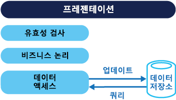
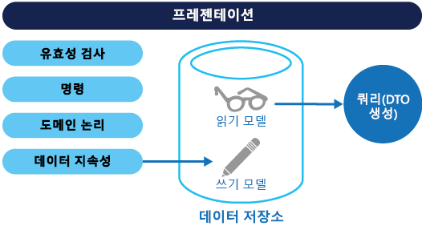
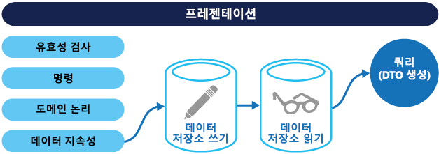

# <a name="command-and-query-responsibility-segregation-cqrs-pattern"></a><span data-ttu-id="4dd61-104">CQRS(명령 및 쿼리 책임 분리) 패턴</span><span class="sxs-lookup"><span data-stu-id="4dd61-104">Command and Query Responsibility Segregation (CQRS) pattern</span></span>

[!INCLUDE [header](../_includes/header.md)]

<span data-ttu-id="4dd61-105">별도의 인터페이스를 사용하여 데이터를 업데이트하는 작업과 데이터를 읽는 작업을 분리합니다.</span><span class="sxs-lookup"><span data-stu-id="4dd61-105">Segregate operations that read data from operations that update data by using separate interfaces.</span></span> <span data-ttu-id="4dd61-106">이 패턴은 시스템 성능, 확장성 및 보안을 극대화할 수 있습니다.</span><span class="sxs-lookup"><span data-stu-id="4dd61-106">This can maximize performance, scalability, and security.</span></span> <span data-ttu-id="4dd61-107">높은 유연성을 통해 시간이 지남에 따라 시스템이 진화하도록 지원하고, 업데이트 명령으로 인해 도메인 수준에서 병합 충돌이 발생하지 않도록 방지합니다.</span><span class="sxs-lookup"><span data-stu-id="4dd61-107">Supports the evolution of the system over time through higher flexibility, and prevents update commands from causing merge conflicts at the domain level.</span></span>

## <a name="context-and-problem"></a><span data-ttu-id="4dd61-108">컨텍스트 및 문제점</span><span class="sxs-lookup"><span data-stu-id="4dd61-108">Context and problem</span></span>

<span data-ttu-id="4dd61-109">전통적인 데이터 관리 시스템에서 명령(데이터 업데이트)과 쿼리(데이터 요청)는 단일 데이터 리포지토리의 동일한 엔터티 집합에 대해 실행됩니다.</span><span class="sxs-lookup"><span data-stu-id="4dd61-109">In traditional data management systems, both commands (updates to the data) and queries (requests for data) are executed against the same set of entities in a single data repository.</span></span> <span data-ttu-id="4dd61-110">이 엔터티는 SQL Server와 같은 관계형 데이터베이스에서 하나 이상의 테이블 행의 하위 집합일 수 있습니다.</span><span class="sxs-lookup"><span data-stu-id="4dd61-110">These entities can be a subset of the rows in one or more tables in a relational database such as SQL Server.</span></span>

<span data-ttu-id="4dd61-111">일반적으로 이러한 시스템에서 이루어지는 모든 CRUD(만들기, 읽기, 업데이트 및 삭제) 작업은 동일한 엔터티 표현에 적용됩니다.</span><span class="sxs-lookup"><span data-stu-id="4dd61-111">Typically in these systems, all create, read, update, and delete (CRUD) operations are applied to the same representation of the entity.</span></span> <span data-ttu-id="4dd61-112">예를 들어 고객을 나타내는 DTO(데이터 전송 개체)는 DAL(데이터 액세스 계층)을 통해 데이터 저장소에서 검색되어 화면에 표시됩니다.</span><span class="sxs-lookup"><span data-stu-id="4dd61-112">For example, a data transfer object (DTO) representing a customer is retrieved from the data store by the data access layer (DAL) and displayed on the screen.</span></span> <span data-ttu-id="4dd61-113">사용자는 데이터 바인딩을 통해 DTO의 일부 필드를 업데이트하고 DTO는 DAL을 통해 데이터 저장소에 다시 저장됩니다.</span><span class="sxs-lookup"><span data-stu-id="4dd61-113">A user updates some fields of the DTO (perhaps through data binding) and the DTO is then saved back in the data store by the DAL.</span></span> <span data-ttu-id="4dd61-114">읽기와 쓰기 작업에는 동일한 DTO가 사용됩니다.</span><span class="sxs-lookup"><span data-stu-id="4dd61-114">The same DTO is used for both the read and write operations.</span></span> <span data-ttu-id="4dd61-115">아래 그림은 기존의 CRUD 아키텍처를 보여 줍니다.</span><span class="sxs-lookup"><span data-stu-id="4dd61-115">The figure illustrates a traditional CRUD architecture.</span></span>



<span data-ttu-id="4dd61-117">기존의 CRUD 디자인은 데이터 작업에 제한된 비즈니스 논리가 적용된 경우에만 제대로 작동합니다.</span><span class="sxs-lookup"><span data-stu-id="4dd61-117">Traditional CRUD designs work well when only limited business logic is applied to the data operations.</span></span> <span data-ttu-id="4dd61-118">개발 도구가 제공하는 스캐폴드 메커니즘은 데이터 액세스 코드를 매우 빠르게 만들 수 있는데, 이 코드는 나중에 필요에 따라 사용자 지정할 수 있습니다.</span><span class="sxs-lookup"><span data-stu-id="4dd61-118">Scaffold mechanisms provided by development tools can create data access code very quickly, which can then be customized as required.</span></span>

<span data-ttu-id="4dd61-119">그러나 기존 CRUD 방식에는 다음과 같은 몇 가지 단점이 있습니다.</span><span class="sxs-lookup"><span data-stu-id="4dd61-119">However, the traditional CRUD approach has some disadvantages:</span></span>

- <span data-ttu-id="4dd61-120">작업의 일부로 필요하지 않더라도 정확하게 업데이트되어야만 하는 추가 열이나 속성과 같이 데이터의 읽기와 쓰기 표현 사이에 불일치가 나타나는 경우가 많습니다.</span><span class="sxs-lookup"><span data-stu-id="4dd61-120">It often means that there's a mismatch between the read and write representations of the data, such as additional columns or properties that must be updated correctly even though they aren't required as part of an operation.</span></span>

- <span data-ttu-id="4dd61-121">여러 작업자가 동일한 데이터 집합을 동시에 사용하는 공동 작업 도메인의 데이터 저장소에 레코드가 잠겨 있는 경우 데이터 경합을 초래할 위험이 있습니다.</span><span class="sxs-lookup"><span data-stu-id="4dd61-121">It risks data contention when records are locked in the data store in a collaborative domain, where multiple actors operate in parallel on the same set of data.</span></span> <span data-ttu-id="4dd61-122">또는 낙관적 잠금을 사용하는 경우 동시 업데이트로 인해 업데이트 충돌이 발생할 수 있습니다.</span><span class="sxs-lookup"><span data-stu-id="4dd61-122">Or update conflicts caused by concurrent updates when optimistic locking is used.</span></span> <span data-ttu-id="4dd61-123">이러한 위험은 시스템의 복잡성과 처리량이 늘어날수록 증가합니다.</span><span class="sxs-lookup"><span data-stu-id="4dd61-123">These risks increase as the complexity and throughput of the system grows.</span></span> <span data-ttu-id="4dd61-124">또한 기존의 접근 방식은 데이터 저장소와 데이터 액세스 계층에 가해지는 부하뿐 아니라 정보를 검색하는 데 필요한 쿼리의 복잡성으로 인해 성능에 좋지 않은 영향을 미칠 수 있습니다.</span><span class="sxs-lookup"><span data-stu-id="4dd61-124">In addition, the traditional approach can have a negative effect on performance due to load on the data store and data access layer, and the complexity of queries required to retrieve information.</span></span>

- <span data-ttu-id="4dd61-125">엔터티 각각이 읽기와 쓰기 작업의 대상으로 잘못된 컨텍스트에 데이터를 노출시킬 수 있기 때문에 보안 및 권한 관리가 더 복잡해질 수 있습니다.</span><span class="sxs-lookup"><span data-stu-id="4dd61-125">It can make managing security and permissions more complex because each entity is subject to both read and write operations, which might expose data in the wrong context.</span></span>

> <span data-ttu-id="4dd61-126">CRUD 접근 방식의 제한에 대한 자세한 내용은 [CRUD, Only When You Can Afford It](https://blogs.msdn.microsoft.com/maarten_mullender/2004/07/23/crud-only-when-you-can-afford-it-revisited/)(CRUD, 사용 가능한 경우에만)을 참조하세요.</span><span class="sxs-lookup"><span data-stu-id="4dd61-126">For a deeper understanding of the limits of the CRUD approach see [CRUD, Only When You Can Afford It](https://blogs.msdn.microsoft.com/maarten_mullender/2004/07/23/crud-only-when-you-can-afford-it-revisited/).</span></span>

## <a name="solution"></a><span data-ttu-id="4dd61-127">해결 방법</span><span class="sxs-lookup"><span data-stu-id="4dd61-127">Solution</span></span>

<span data-ttu-id="4dd61-128">CQRS(명령 및 쿼리 책임 분리)는 별도의 인터페이스를 사용하여 데이터를 업데이트하는 작업(명령)에서 데이터를 읽는 작업(쿼리)을 분리하는 패턴입니다.</span><span class="sxs-lookup"><span data-stu-id="4dd61-128">Command and Query Responsibility Segregation (CQRS) is a pattern that segregates the operations that read data (queries) from the operations that update data (commands) by using separate interfaces.</span></span> <span data-ttu-id="4dd61-129">이는 쿼리와 업데이트에 사용되는 데이터 모델이 다르다는 것입니다.</span><span class="sxs-lookup"><span data-stu-id="4dd61-129">This means that the data models used for querying and updates are different.</span></span> <span data-ttu-id="4dd61-130">그런 다음 이 모델을 아래 그림과 같이 분리할 수 있는데, 반드시 분리해야 하는 것은 아닙니다.</span><span class="sxs-lookup"><span data-stu-id="4dd61-130">The models can then be isolated, as shown in the following figure, although that's not an absolute requirement.</span></span>



<span data-ttu-id="4dd61-132">CQRS 기반 시스템에서 데이터의 쿼리와 업데이트가 분리된 모델을 사용하면 CRUD 기반 시스템에 사용하는 단일 데이터 모델에 비해 디자인과 구현이 간단해집니다.</span><span class="sxs-lookup"><span data-stu-id="4dd61-132">Compared to the single data model used in CRUD-based systems, the use of separate query and update models for the data in CQRS-based systems simplifies design and implementation.</span></span> <span data-ttu-id="4dd61-133">그러나 여기에는 CRUD 디자인에는 없는 단점이 한 가지 있는데, 그것은 바로 스캐폴드 메커니즘을 사용해 CQRS 코드를 자동으로 생성할 수 없다는 점입니다.</span><span class="sxs-lookup"><span data-stu-id="4dd61-133">However, one disadvantage is that unlike CRUD designs, CQRS code can't automatically be generated using scaffold mechanisms.</span></span>

<span data-ttu-id="4dd61-134">데이터를 읽기 위한 쿼리 모델과 데이터를 쓰기 위한 업데이트 모델은 SQL 뷰를 사용하거나 프로젝션을 즉시 생성해 동일한 물리적 저장소에 액세스할 수 있습니다.</span><span class="sxs-lookup"><span data-stu-id="4dd61-134">The query model for reading data and the update model for writing data can access the same physical store, perhaps by using SQL views or by generating projections on the fly.</span></span> <span data-ttu-id="4dd61-135">그러나 일반적으로는 다음 그림에서와 같이 성능, 확장성, 보안을 최대화하기 위해 데이터를 여러 물리적 저장소로 분리합니다.</span><span class="sxs-lookup"><span data-stu-id="4dd61-135">However, it's common to separate the data into different physical stores to maximize performance, scalability, and security, as shown in the next figure.</span></span>



<span data-ttu-id="4dd61-137">읽기 저장소는 쓰기 저장소의 읽기 전용 복제본이거나 읽기 및 쓰기 저장소가 전혀 다른 구조일 수 있습니다.</span><span class="sxs-lookup"><span data-stu-id="4dd61-137">The read store can be a read-only replica of the write store, or the read and write stores can have a different structure altogether.</span></span> <span data-ttu-id="4dd61-138">읽기 저장소의 읽기 전용 복제본을 여러 개 사용하면 특히 읽기 전용 복제본이 응용 프로그램 인스턴스에 가깝게 위치하는 분산 시나리오에서 쿼리 성능과 응용 프로그램 UI 응답성을 크게 높일 수 있습니다.</span><span class="sxs-lookup"><span data-stu-id="4dd61-138">Using multiple read-only replicas of the read store can greatly increase query performance and application UI responsiveness, especially in distributed scenarios where read-only replicas are located close to the application instances.</span></span> <span data-ttu-id="4dd61-139">일부 데이터베이스 시스템(SQL Server)은 가용성을 최대화하기 위한 장애 조치(failover)용 복제본과 같은 추가 기능을 제공합니다.</span><span class="sxs-lookup"><span data-stu-id="4dd61-139">Some database systems (SQL Server) provide additional features such as failover replicas to maximize availability.</span></span>

<span data-ttu-id="4dd61-140">읽기 및 쓰기 저장소를 분리하면 부하를 감안해 각 저장소를 적절하게 확장할 수도 있습니다.</span><span class="sxs-lookup"><span data-stu-id="4dd61-140">Separation of the read and write stores also allows each to be scaled appropriately to match the load.</span></span> <span data-ttu-id="4dd61-141">예를 들어 보통 읽기 저장소는 쓰기 저장소보다 부하가 훨씬 더 높습니다.</span><span class="sxs-lookup"><span data-stu-id="4dd61-141">For example, read stores typically encounter a much higher load than write stores.</span></span>

<span data-ttu-id="4dd61-142">쿼리/읽기 모델에 비정규화된 데이터([구체화된 뷰 패턴](materialized-view.md) 참조)가 포함되어 있으면 응용 프로그램에서 각각의 보기를 위해 데이터를 읽거나 시스템 내 데이터를 쿼리할 때 성능이 최대화됩니다.</span><span class="sxs-lookup"><span data-stu-id="4dd61-142">When the query/read model contains denormalized data (see [Materialized View pattern](materialized-view.md)), performance is maximized when reading data for each of the views in an application or when querying the data in the system.</span></span>

## <a name="issues-and-considerations"></a><span data-ttu-id="4dd61-143">문제 및 고려 사항</span><span class="sxs-lookup"><span data-stu-id="4dd61-143">Issues and considerations</span></span>

<span data-ttu-id="4dd61-144">이 패턴을 구현할 방법을 결정할 때 다음 사항을 고려하세요.</span><span class="sxs-lookup"><span data-stu-id="4dd61-144">Consider the following points when deciding how to implement this pattern:</span></span>

- <span data-ttu-id="4dd61-145">데이터 저장소를 읽기 및 쓰기 작업을 위한 별도의 물리적 저장소로 분리하면 시스템의 성능과 보안이 좋아지지만 복원력과 결과적 일관성 면에서 더 복잡해질 수 있습니다.</span><span class="sxs-lookup"><span data-stu-id="4dd61-145">Dividing the data store into separate physical stores for read and write operations can increase the performance and security of a system, but it can add complexity in terms of resiliency and eventual consistency.</span></span> <span data-ttu-id="4dd61-146">읽기 모델 저장소는 쓰기 모델 저장소의 변경 사항을 반영하도록 업데이트되어야 합니다. 사용자가 오래된 읽기 데이터를 기반으로 요청을 발급하면 변경된 사항을 검색하기 어려울 수 있는데, 그런 경우 작업을 완료할 수 없습니다.</span><span class="sxs-lookup"><span data-stu-id="4dd61-146">The read model store must be updated to reflect changes to the write model store, and it can be difficult to detect when a user has issued a request based on stale read data, which means that the operation can't be completed.</span></span>

    > <span data-ttu-id="4dd61-147">결과적 일관성에 대한 자세한 내용은 [데이터 일관성 입문서](https://msdn.microsoft.com/library/dn589800.aspx)를 참조하세요.</span><span class="sxs-lookup"><span data-stu-id="4dd61-147">For a description of eventual consistency see the [Data Consistency Primer](https://msdn.microsoft.com/library/dn589800.aspx).</span></span>

- <span data-ttu-id="4dd61-148">가장 가치 있는 시스템의 제한된 구역에 CQRS 적용을 고려해야 합니다.</span><span class="sxs-lookup"><span data-stu-id="4dd61-148">Consider applying CQRS to limited sections of your system where it will be most valuable.</span></span>

- <span data-ttu-id="4dd61-149">결과적 일관성을 추구하기 위한 일반적인 접근 방식은 이벤트 소싱을 CQRS와 함께 사용하는 것입니다. 그러면 쓰기 모델은 명령의 실행으로 구동되는 추가 전용 이벤트 스트림이 됩니다.</span><span class="sxs-lookup"><span data-stu-id="4dd61-149">A typical approach to deploying eventual consistency is to use event sourcing in conjunction with CQRS so that the write model is an append-only stream of events driven by execution of commands.</span></span> <span data-ttu-id="4dd61-150">이러한 이벤트는 읽기 모델로 작용하는 구체화된 뷰를 업데이트하는 데 사용합니다.</span><span class="sxs-lookup"><span data-stu-id="4dd61-150">These events are used to update materialized views that act as the read model.</span></span> <span data-ttu-id="4dd61-151">자세한 내용은 [이벤트 소싱 및 CQRS](/azure/architecture/patterns/cqrs#event-sourcing-and-cqrs)를 참조하세요.</span><span class="sxs-lookup"><span data-stu-id="4dd61-151">For more information see [Event Sourcing and CQRS](/azure/architecture/patterns/cqrs#event-sourcing-and-cqrs).</span></span>

## <a name="when-to-use-this-pattern"></a><span data-ttu-id="4dd61-152">이 패턴을 사용해야 하는 경우</span><span class="sxs-lookup"><span data-stu-id="4dd61-152">When to use this pattern</span></span>

<span data-ttu-id="4dd61-153">다음 경우에 이 패턴을 사용합니다.</span><span class="sxs-lookup"><span data-stu-id="4dd61-153">Use this pattern in the following situations:</span></span>

- <span data-ttu-id="4dd61-154">여러 작업이 동일한 데이터에서 동시에 수행되는 공동 작업 도메인.</span><span class="sxs-lookup"><span data-stu-id="4dd61-154">Collaborative domains where multiple operations are performed in parallel on the same data.</span></span> <span data-ttu-id="4dd61-155">CQRS를 사용하면 동일한 유형으로 보이는 데이터를 업데이트하더라도 도메인 수준에서 병합 충돌(충돌이 발생할 때 명령으로 병합할 수 있는 충돌)을 최소화할 수 있을 정도로 자세하게 명령을 정의할 수 있습니다.</span><span class="sxs-lookup"><span data-stu-id="4dd61-155">CQRS allows you to define commands with enough granularity to minimize merge conflicts at the domain level (any conflicts that do arise can be merged by the command), even when updating what appears to be the same type of data.</span></span>

- <span data-ttu-id="4dd61-156">여러 단계를 거치거나 복잡한 도메인 모델을 사용하는 복잡한 프로세스를 통해 사용자를 안내하는 작업 기반 사용자 인터페이스.</span><span class="sxs-lookup"><span data-stu-id="4dd61-156">Task-based user interfaces where users are guided through a complex process as a series of steps or with complex domain models.</span></span> <span data-ttu-id="4dd61-157">DDD(도메인 기반 디자인) 기법에 이미 익숙한 팀에도 유용합니다.</span><span class="sxs-lookup"><span data-stu-id="4dd61-157">Also, useful for teams already familiar with domain-driven design (DDD) techniques.</span></span> <span data-ttu-id="4dd61-158">쓰기 모델은 비즈니스 논리, 입력 유효성 검사, 비즈니스 유효성 검사와 함께 완전한 명령 처리 스택을 보유하기 때문에 쓰기 모델의 각 집계(데이터 변경을 위한 단위로 처리되는 관련 개체의 각 클러스터)는 항상 일관성을 유지합니다.</span><span class="sxs-lookup"><span data-stu-id="4dd61-158">The write model has a full command-processing stack with business logic, input validation, and business validation to ensure that everything is always consistent for each of the aggregates (each cluster of associated objects treated as a unit for data changes) in the write model.</span></span> <span data-ttu-id="4dd61-159">읽기 모델은 비즈니스 논리 또는 유효성 검사 스택을 보유하지 않으며 보기 모델에 사용할 DTO를 반환하기만 합니다.</span><span class="sxs-lookup"><span data-stu-id="4dd61-159">The read model has no business logic or validation stack and just returns a DTO for use in a view model.</span></span> <span data-ttu-id="4dd61-160">결과적으로 읽기 모델과 쓰기 모델의 일관성이 유지됩니다.</span><span class="sxs-lookup"><span data-stu-id="4dd61-160">The read model is eventually consistent with the write model.</span></span>

- <span data-ttu-id="4dd61-161">데이터 읽기 성능을 데이터 쓰기 성능과 별도로 세밀하게 조정해야 하는 시나리오(특히 읽기/쓰기 비율이 매우 높고 수평 확장이 필요한 경우).</span><span class="sxs-lookup"><span data-stu-id="4dd61-161">Scenarios where performance of data reads must be fine tuned separately from performance of data writes, especially when the read/write ratio is very high, and when horizontal scaling is required.</span></span> <span data-ttu-id="4dd61-162">예를 들어 많은 시스템에서 읽기 작업 수가 쓰기 작업 수보다 몇 배 더 많습니다.</span><span class="sxs-lookup"><span data-stu-id="4dd61-162">For example, in many systems the number of read operations is many times greater than the number of write operations.</span></span> <span data-ttu-id="4dd61-163">이런 사실을 감안한다면 읽기 모델을 확장하고 쓰기 모델은 하나 또는 소수의 인스턴스에서만 실행하는 것이 좋습니다.</span><span class="sxs-lookup"><span data-stu-id="4dd61-163">To accommodate this, consider scaling out the read model, but running the write model on only one or a few instances.</span></span> <span data-ttu-id="4dd61-164">소수의 쓰기 모델 인스턴스는 병합 충돌 발생을 최소화하는 데도 기여합니다.</span><span class="sxs-lookup"><span data-stu-id="4dd61-164">A small number of write model instances also helps to minimize the occurrence of merge conflicts.</span></span>

- <span data-ttu-id="4dd61-165">개발자 중 한 팀은 쓰기 모델에 포함되는 복잡한 도메인 모델에 집중하고 또 한 팀은 읽기 모델과 사용자 인터페이스에 집중할 수 있는 시나리오.</span><span class="sxs-lookup"><span data-stu-id="4dd61-165">Scenarios where one team of developers can focus on the complex domain model that is part of the write model, and another team can focus on the read model and the user interfaces.</span></span>

- <span data-ttu-id="4dd61-166">시스템이 시간이 지나면서 진화할 것으로 예상되어 여러 버전의 모델을 포함할 수 있거나 비즈니스 규칙이 정기적으로 변하는 시나리오</span><span class="sxs-lookup"><span data-stu-id="4dd61-166">Scenarios where the system is expected to evolve over time and might contain multiple versions of the model, or where business rules change regularly.</span></span>

- <span data-ttu-id="4dd61-167">특히 이벤트 소싱과 조합해 다른 시스템과 통합하는 경우. 이때 하위 시스템 하나의 일시적인 장애가 다른 시스템의 가용성에 영향을 주지 않아야 합니다.</span><span class="sxs-lookup"><span data-stu-id="4dd61-167">Integration with other systems, especially in combination with event sourcing, where the temporal failure of one subsystem shouldn't affect the availability of the others.</span></span>

<span data-ttu-id="4dd61-168">다음 경우에는 이 패턴을 권장하지 않습니다.</span><span class="sxs-lookup"><span data-stu-id="4dd61-168">This pattern isn't recommended in the following situations:</span></span>

- <span data-ttu-id="4dd61-169">도메인 또는 비즈니스 규칙이 간단한 경우</span><span class="sxs-lookup"><span data-stu-id="4dd61-169">Where the domain or the business rules are simple.</span></span>

- <span data-ttu-id="4dd61-170">간단한 CRUD 스타일 사용자 인터페이스 및 관련된 데이터 액세스 작업으로 충분한 경우</span><span class="sxs-lookup"><span data-stu-id="4dd61-170">Where a simple CRUD-style user interface and the related data access operations are sufficient.</span></span>

- <span data-ttu-id="4dd61-171">전체 시스템에 구현하는 경우.</span><span class="sxs-lookup"><span data-stu-id="4dd61-171">For implementation across the whole system.</span></span> <span data-ttu-id="4dd61-172">전체 데이터 관리 시나리오에서 CQRS가 유용할 수 있는 특정 구성 요소가 있지만, CQRS가 필요하지 않은 경우에는 불필요한 복잡성을 상당히 추가할 수 있습니다.</span><span class="sxs-lookup"><span data-stu-id="4dd61-172">There are specific components of an overall data management scenario where CQRS can be useful, but it can add considerable and unnecessary complexity when it isn't required.</span></span>

## <a name="event-sourcing-and-cqrs"></a><span data-ttu-id="4dd61-173">이벤트 소싱 및 CQRS</span><span class="sxs-lookup"><span data-stu-id="4dd61-173">Event Sourcing and CQRS</span></span>

<span data-ttu-id="4dd61-174">CQRS 패턴은 이벤트 소싱 패턴과 함께 사용되는 경우가 많습니다.</span><span class="sxs-lookup"><span data-stu-id="4dd61-174">The CQRS pattern is often used along with the Event Sourcing pattern.</span></span> <span data-ttu-id="4dd61-175">CQRS 기반 시스템은 별도의 읽기 및 쓰기 데이터 모델을 사용하며 각각 관련 작업에 맞춤화되고 종종 물리적으로 분리된 저장소에 배치됩니다.</span><span class="sxs-lookup"><span data-stu-id="4dd61-175">CQRS-based systems use separate read and write data models, each tailored to relevant tasks and often located in physically separate stores.</span></span> <span data-ttu-id="4dd61-176">[이벤트 소싱](event-sourcing.md) 패턴과 함께 사용할 때 이벤트 저장소는 쓰기 모델이며 정보의 공식적인 출처입니다.</span><span class="sxs-lookup"><span data-stu-id="4dd61-176">When used with the [Event Sourcing](event-sourcing.md) pattern, the store of events is the write model, and is the official source of information.</span></span> <span data-ttu-id="4dd61-177">보통 CQRS 기반 시스템의 읽기 모델은 고도로 비정규화된 뷰의 형태로 데이터의 구체화된 뷰를 제공합니다.</span><span class="sxs-lookup"><span data-stu-id="4dd61-177">The read model of a CQRS-based system provides materialized views of the data, typically as highly denormalized views.</span></span> <span data-ttu-id="4dd61-178">이러한 뷰는 응용 프로그램의 인터페이스 및 디스플레이 요구 사항에 맞춤화되어 디스플레이 및 쿼리 성능을 모두 최대화하는 데 기여합니다.</span><span class="sxs-lookup"><span data-stu-id="4dd61-178">These views are tailored to the interfaces and display requirements of the application, which helps to maximize both display and query performance.</span></span>

<span data-ttu-id="4dd61-179">특정 시점의 실제 데이터 대신 이벤트의 스트림을 쓰기 저장소로 사용하면 단일 집계에서 업데이트 충돌을 방지하고 성능과 확장성을 최대화할 수 있습니다.</span><span class="sxs-lookup"><span data-stu-id="4dd61-179">Using the stream of events as the write store, rather than the actual data at a point in time, avoids update conflicts on a single aggregate and maximizes performance and scalability.</span></span> <span data-ttu-id="4dd61-180">읽기 저장소를 채우는 데 사용하는 데이터의 구체화된 뷰를 비동기적으로 생성하는 데 이벤트를 사용할 수 있습니다.</span><span class="sxs-lookup"><span data-stu-id="4dd61-180">The events can be used to asynchronously generate materialized views of the data that are used to populate the read store.</span></span>

<span data-ttu-id="4dd61-181">이벤트 저장소는 정보의 공식적인 출처이기 때문에, 시스템이 진화하거나 읽기 모델을 변경해야 할 때 구체화된 뷰를 삭제하고 모든 지난 이벤트를 재생해 현재 상태의 새로운 표현을 생성할 수 있습니다.</span><span class="sxs-lookup"><span data-stu-id="4dd61-181">Because the event store is the official source of information, it is possible to delete the materialized views and replay all past events to create a new representation of the current state when the system evolves, or when the read model must change.</span></span> <span data-ttu-id="4dd61-182">사실상 구체화된 뷰는 데이터의 지속형 읽기 전용 캐시입니다.</span><span class="sxs-lookup"><span data-stu-id="4dd61-182">The materialized views are in effect a durable read-only cache of the data.</span></span>

<span data-ttu-id="4dd61-183">CQRS를 이벤트 소싱 패턴과 함께 사용할 때는 다음을 고려해야 합니다.</span><span class="sxs-lookup"><span data-stu-id="4dd61-183">When using CQRS combined with the Event Sourcing pattern, consider the following:</span></span>

- <span data-ttu-id="4dd61-184">쓰기 및 읽기 저장소가 분리되는 시스템처럼 이 패턴을 기반으로 하는 시스템만이 결과적으로 일관성을 유지할 수 있습니다.</span><span class="sxs-lookup"><span data-stu-id="4dd61-184">As with any system where the write and read stores are separate, systems based on this pattern are only eventually consistent.</span></span> <span data-ttu-id="4dd61-185">생성되는 이벤트와 업데이트되는 데이터 저장소 사이에는 약간의 지연이 나타나게 됩니다.</span><span class="sxs-lookup"><span data-stu-id="4dd61-185">There will be some delay between the event being generated and the data store being updated.</span></span>

- <span data-ttu-id="4dd61-186">이벤트를 시작하고 처리하며 쿼리나 읽기 모델에 필요한 적절한 뷰 또는 개체를 어셈블하거나 업데이트하는 코드를 생성해야 하기 때문에, 이벤트 소싱 패턴은 더 복잡합니다.</span><span class="sxs-lookup"><span data-stu-id="4dd61-186">The pattern adds complexity because code must be created to initiate and handle events, and assemble or update the appropriate views or objects required by queries or a read model.</span></span> <span data-ttu-id="4dd61-187">CQRS 패턴을 이벤트 소싱 패턴과 함께 사용하는 경우 패턴이 복잡하기 때문에 성공적으로 구현하는 것이 더 어려워질 수 있으므로 시스템 디자인에 대한 다른 접근 방식이 필요합니다.</span><span class="sxs-lookup"><span data-stu-id="4dd61-187">The complexity of the CQRS pattern when used with the Event Sourcing pattern can make a successful implementation more difficult, and requires a different approach to designing systems.</span></span> <span data-ttu-id="4dd61-188">그러나 이벤트 소싱은 도메인을 더 쉽게 모델링할 수 있고 데이터를 변경한 의도가 보존되기 때문에 뷰를 다시 작성하거나 새로 만들기가 더 쉽습니다.</span><span class="sxs-lookup"><span data-stu-id="4dd61-188">However, event sourcing can make it easier to model the domain, and makes it easier to rebuild views or create new ones because the intent of the changes in the data is preserved.</span></span>

- <span data-ttu-id="4dd61-189">특정 엔터티 또는 엔터티 모음을 위한 이벤트를 재생하고 처리하여 데이터의 읽기 모델 또는 프로젝션에 사용할 구체화된 뷰를 생성하려면 상당한 처리 시간과 리소스 사용이 필요할 수 있습니다.</span><span class="sxs-lookup"><span data-stu-id="4dd61-189">Generating materialized views for use in the read model or projections of the data by replaying and handling the events for specific entities or collections of entities can require significant processing time and resource usage.</span></span> <span data-ttu-id="4dd61-190">장기간 값의 합계 또는 분석이 필요한 경우에 특히 그런데 그 이유는 관련된 모든 이벤트를 검사해야 하기 때문입니다.</span><span class="sxs-lookup"><span data-stu-id="4dd61-190">This is especially true if it requires summation or analysis of values over long periods, because all the associated events might need to be examined.</span></span> <span data-ttu-id="4dd61-191">이 문제는 발생한 특정 동작의 총 개수 또는 엔터티의 현재 상태와 같이 예약된 간격으로 데이터의 스냅숏을 구현해 해결할 수 있습니다.</span><span class="sxs-lookup"><span data-stu-id="4dd61-191">Resolve this by implementing snapshots of the data at scheduled intervals, such as a total count of the number of a specific action that have occurred, or the current state of an entity.</span></span>

## <a name="example"></a><span data-ttu-id="4dd61-192">예</span><span class="sxs-lookup"><span data-stu-id="4dd61-192">Example</span></span>

<span data-ttu-id="4dd61-193">다음 코드는 읽기 모델과 쓰기 모델에 다른 정의를 사용하는 CQRS 구현의 예제 중 일부를 보여 줍니다.</span><span class="sxs-lookup"><span data-stu-id="4dd61-193">The following code shows some extracts from an example of a CQRS implementation that uses different definitions for the read and the write models.</span></span> <span data-ttu-id="4dd61-194">모델 인터페이스는 기본 데이터 저장소의 기능을 지정하지 않고 진화할 수 있으며 분리되기 있기 때문에 독립적으로 세밀하게 조정할 수 있습니다.</span><span class="sxs-lookup"><span data-stu-id="4dd61-194">The model interfaces don't dictate any features of the underlying data stores, and they can evolve and be fine-tuned independently because these interfaces are separated.</span></span>

<span data-ttu-id="4dd61-195">다음 코드는 읽기 모델 정의를 보여줍니다.</span><span class="sxs-lookup"><span data-stu-id="4dd61-195">The following code shows the read model definition.</span></span>

```csharp
// Query interface
namespace ReadModel
{
  public interface ProductsDao
  {
    ProductDisplay FindById(int productId);
    ICollection<ProductDisplay> FindByName(string name);
    ICollection<ProductInventory> FindOutOfStockProducts();
    ICollection<ProductDisplay> FindRelatedProducts(int productId);
  }

  public class ProductDisplay
  {
    public int Id { get; set; }
    public string Name { get; set; }
    public string Description { get; set; }
    public decimal UnitPrice { get; set; }
    public bool IsOutOfStock { get; set; }
    public double UserRating { get; set; }
  }

  public class ProductInventory
  {
    public int Id { get; set; }
    public string Name { get; set; }
    public int CurrentStock { get; set; }
  }
}
```

<span data-ttu-id="4dd61-196">시스템에서 사용자가 제품을 평가하는 것을 허용합니다.</span><span class="sxs-lookup"><span data-stu-id="4dd61-196">The system allows users to rate products.</span></span> <span data-ttu-id="4dd61-197">응용 프로그램 코드는 다음 코드에 제시된 `RateProduct` 명령을 사용하여 제품을 평가합니다.</span><span class="sxs-lookup"><span data-stu-id="4dd61-197">The application code does this using the `RateProduct` command shown in the following code.</span></span>

```csharp
public interface ICommand
{
  Guid Id { get; }
}

public class RateProduct : ICommand
{
  public RateProduct()
  {
    this.Id = Guid.NewGuid();
  }
  public Guid Id { get; set; }
  public int ProductId { get; set; }
  public int Rating { get; set; }
  public int UserId {get; set; }
}
```

<span data-ttu-id="4dd61-198">시스템이 `ProductsCommandHandler` 클래스를 사용하여 응용 프로그램이 전송한 명령을 처리합니다.</span><span class="sxs-lookup"><span data-stu-id="4dd61-198">The system uses the `ProductsCommandHandler` class to handle commands sent by the application.</span></span> <span data-ttu-id="4dd61-199">일반적으로 클라이언트는 큐와 같은 메시징 시스템을 통해 명령을 도메인에 보냅니다.</span><span class="sxs-lookup"><span data-stu-id="4dd61-199">Clients typically send commands to the domain through a messaging system such as a queue.</span></span> <span data-ttu-id="4dd61-200">명령 처리기는 이러한 명령을 수락하고 도메인 인터페이스의 메서드를 호출합니다.</span><span class="sxs-lookup"><span data-stu-id="4dd61-200">The command handler accepts these commands and invokes methods of the domain interface.</span></span> <span data-ttu-id="4dd61-201">요청이 충돌할 가능성이 줄어들도록 세분화된 각 명령이 디자인됩니다.</span><span class="sxs-lookup"><span data-stu-id="4dd61-201">The granularity of each command is designed to reduce the chance of conflicting requests.</span></span> <span data-ttu-id="4dd61-202">다음 코드는 `ProductsCommandHandler` 클래스의 개요를 보여 줍니다.</span><span class="sxs-lookup"><span data-stu-id="4dd61-202">The following code shows an outline of the `ProductsCommandHandler` class.</span></span>

```csharp
public class ProductsCommandHandler :
    ICommandHandler<AddNewProduct>,
    ICommandHandler<RateProduct>,
    ICommandHandler<AddToInventory>,
    ICommandHandler<ConfirmItemShipped>,
    ICommandHandler<UpdateStockFromInventoryRecount>
{
  private readonly IRepository<Product> repository;

  public ProductsCommandHandler (IRepository<Product> repository)
  {
    this.repository = repository;
  }

  void Handle (AddNewProduct command)
  {
    ...
  }

  void Handle (RateProduct command)
  {
    var product = repository.Find(command.ProductId);
    if (product != null)
    {
      product.RateProduct(command.UserId, command.Rating);
      repository.Save(product);
    }
  }

  void Handle (AddToInventory command)
  {
    ...
  }

  void Handle (ConfirmItemsShipped command)
  {
    ...
  }

  void Handle (UpdateStockFromInventoryRecount command)
  {
    ...
  }
}
```

<span data-ttu-id="4dd61-203">다음 코드는 쓰기 모델의 `IProductsDomain` 인터페이스를 보여 줍니다.</span><span class="sxs-lookup"><span data-stu-id="4dd61-203">The following code shows the `IProductsDomain` interface from the write model.</span></span>

```csharp
public interface IProductsDomain
{
  void AddNewProduct(int id, string name, string description, decimal price);
  void RateProduct(int userId, int rating);
  void AddToInventory(int productId, int quantity);
  void ConfirmItemsShipped(int productId, int quantity);
  void UpdateStockFromInventoryRecount(int productId, int updatedQuantity);
}
```

<span data-ttu-id="4dd61-204">또한 `IProductsDomain` 인터페이스가 도메인에서 의미가 있는 메서드를 포함하는 방법도 알려 줍니다.</span><span class="sxs-lookup"><span data-stu-id="4dd61-204">Also notice how the `IProductsDomain` interface contains methods that have a meaning in the domain.</span></span> <span data-ttu-id="4dd61-205">일반적으로 CRUD 환경에서 이러한 메서드는 `Save` 또는 `Update`와 같은 제네릭 이름을 포함하고 DTO만 인수로 사용할 수 있습니다.</span><span class="sxs-lookup"><span data-stu-id="4dd61-205">Typically, in a CRUD environment these methods would have generic names such as `Save` or `Update`, and have a DTO as the only argument.</span></span> <span data-ttu-id="4dd61-206">CQRS 접근 방식은 이 조직의 비즈니스 및 인벤토리 관리 시스템에 대한 요구를 충족하도록 디자인할 수 있습니다.</span><span class="sxs-lookup"><span data-stu-id="4dd61-206">The CQRS approach can be designed to meet the needs of this organization's business and inventory management systems.</span></span>

## <a name="related-patterns-and-guidance"></a><span data-ttu-id="4dd61-207">관련 패턴 및 지침</span><span class="sxs-lookup"><span data-stu-id="4dd61-207">Related patterns and guidance</span></span>

<span data-ttu-id="4dd61-208">이 패턴을 구현할 때 유용한 패턴 및 지침은 다음과 같습니다.</span><span class="sxs-lookup"><span data-stu-id="4dd61-208">The following patterns and guidance are useful when implementing this pattern:</span></span>

- <span data-ttu-id="4dd61-209">다른 아키텍처 스타일과 함께 CQRS를 비교하려면 [아키텍처 스타일](/azure/architecture/guide/architecture-styles/) 및 [CQRS 아키텍처 스타일](/azure/architecture/guide/architecture-styles/cqrs)을 참조하세요.</span><span class="sxs-lookup"><span data-stu-id="4dd61-209">For a comparison of CQRS with other architectural styles, see [Architecture styles](/azure/architecture/guide/architecture-styles/) and [CQRS architecture style](/azure/architecture/guide/architecture-styles/cqrs).</span></span>

- <span data-ttu-id="4dd61-210">[데이터 일관성 입문서](https://msdn.microsoft.com/library/dn589800.aspx).</span><span class="sxs-lookup"><span data-stu-id="4dd61-210">[Data Consistency Primer](https://msdn.microsoft.com/library/dn589800.aspx).</span></span> <span data-ttu-id="4dd61-211">CQRS 패턴을 사용할 때 읽기 및 쓰기 데이터 저장소 간의 결과적 일관성 때문에 일반적으로 발생하는 문제와 이러한 문제의 해결 방법을 설명합니다.</span><span class="sxs-lookup"><span data-stu-id="4dd61-211">Explains the issues that are typically encountered due to eventual consistency between the read and write data stores when using the CQRS pattern, and how these issues can be resolved.</span></span>

- <span data-ttu-id="4dd61-212">[데이터 분할 지침](https://msdn.microsoft.com/library/dn589795.aspx).</span><span class="sxs-lookup"><span data-stu-id="4dd61-212">[Data Partitioning Guidance](https://msdn.microsoft.com/library/dn589795.aspx).</span></span> <span data-ttu-id="4dd61-213">CQRS 패턴에 사용하는 읽기 및 쓰기 데이터 저장소를 별도로 관리하고 액세스할 수 있는 파티션으로 분할해 확장성을 향상시키고, 경합을 줄이며, 성능을 최적화할 수 있는 방법을 설명합니다.</span><span class="sxs-lookup"><span data-stu-id="4dd61-213">Describes how the read and write data stores used in the CQRS pattern can be divided into partitions that can be managed and accessed separately to improve scalability, reduce contention, and optimize performance.</span></span>

- <span data-ttu-id="4dd61-214">[이벤트 소싱 패턴](event-sourcing.md).</span><span class="sxs-lookup"><span data-stu-id="4dd61-214">[Event Sourcing Pattern](event-sourcing.md).</span></span> <span data-ttu-id="4dd61-215">이벤트 소싱을 CQRS 패턴과 함께 사용하여 복잡한 도메인의 작업을 간소화하면서 성능, 확장성 및 응답성을 향상시킬 수 있는 방법을 자세히 설명합니다.</span><span class="sxs-lookup"><span data-stu-id="4dd61-215">Describes in more detail how Event Sourcing can be used with the CQRS pattern to simplify tasks in complex domains while improving performance, scalability, and responsiveness.</span></span> <span data-ttu-id="4dd61-216">또한 트랜잭션 데이터의 일관성을 제공하면서 보상 동작을 가능하게 하는 전체 감사 내역과 기록을 유지하는 방법도 설명합니다.</span><span class="sxs-lookup"><span data-stu-id="4dd61-216">As well as how to provide consistency for transactional data while maintaining full audit trails and history that can enable compensating actions.</span></span>

- <span data-ttu-id="4dd61-217">[구체화된 뷰 패턴](materialized-view.md).</span><span class="sxs-lookup"><span data-stu-id="4dd61-217">[Materialized View Pattern](materialized-view.md).</span></span> <span data-ttu-id="4dd61-218">CQRS를 구현한 읽기 모델은 쓰기 모델 데이터의 구체화된 뷰를 포함할 수 있습니다. 또는 구체화된 뷰를 생성하는 데 읽기 모델을 사용할 수 있습니다.</span><span class="sxs-lookup"><span data-stu-id="4dd61-218">The read model of a CQRS implementation can contain materialized views of the write model data, or the read model can be used to generate materialized views.</span></span>

- <span data-ttu-id="4dd61-219">패턴 및 사례 가이드 [CQRS 과정](http://aka.ms/cqrs).</span><span class="sxs-lookup"><span data-stu-id="4dd61-219">The patterns & practices guide [CQRS Journey](http://aka.ms/cqrs).</span></span> <span data-ttu-id="4dd61-220">특히 [Introducing the Command Query Responsibility Segregation Pattern](https://msdn.microsoft.com/library/jj591573.aspx)(명령 쿼리 책임 분리 패턴 소개)은 패턴 및 유용한 경우를 탐색하며, [Epilogue: Lessons Learned](https://msdn.microsoft.com/library/jj591568.aspx)(에필로그: 교훈)는 이 패턴을 사용할 때 발생하는 문제 중 일부를 이해하는 데 도움이 됩니다.</span><span class="sxs-lookup"><span data-stu-id="4dd61-220">In particular, [Introducing the Command Query Responsibility Segregation Pattern](https://msdn.microsoft.com/library/jj591573.aspx) explores the pattern and when it's useful, and [Epilogue: Lessons Learned](https://msdn.microsoft.com/library/jj591568.aspx) helps you understand some of the issues that come up when using this pattern.</span></span>

- <span data-ttu-id="4dd61-221">[Martin Fowler의 CQRS](http://martinfowler.com/bliki/CQRS.html) 게시물. 패턴의 기본 내용을 설명하고 다른 유용한 리소스에 연결되는 링크를 제공합니다.</span><span class="sxs-lookup"><span data-stu-id="4dd61-221">The post [CQRS by Martin Fowler](http://martinfowler.com/bliki/CQRS.html), which explains the basics of the pattern and links to other useful resources.</span></span>

- <span data-ttu-id="4dd61-222">[Greg Young의 게시물](http://codebetter.com/gregyoung/). CQRS 패턴의 여러 측면을 탐색합니다.</span><span class="sxs-lookup"><span data-stu-id="4dd61-222">[Greg Young’s posts](http://codebetter.com/gregyoung/), which explore many aspects of the CQRS pattern.</span></span>
